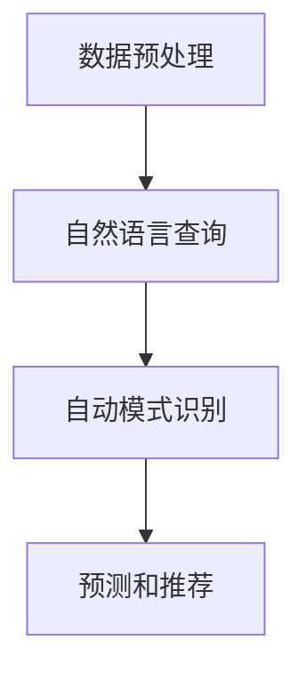

                 

关键词：商业智能，人工智能，数据分析，机器学习，增强分析

> 摘要：本文探讨了人工智能（AI）在商业智能（BI）领域的应用，介绍了增强分析的概念、核心原理及其实际操作步骤。通过数学模型的构建和公式推导，深入讲解了AI辅助商业智能的方法论，并通过项目实践展示了具体实现过程。文章还分析了AI辅助商业智能的优缺点、应用领域以及未来发展趋势和挑战。

## 1. 背景介绍

商业智能（Business Intelligence，BI）是一种利用技术手段，通过数据收集、分析和报告来支持决策制定的方法。随着数据量的急剧增长，传统的数据分析方法已经无法满足企业对实时性和深层次洞察的需求。与此同时，人工智能（AI）技术的快速发展为商业智能领域带来了新的变革。AI能够自动处理大量数据，提取有价值的信息，并生成预测和推荐，从而辅助企业做出更加明智的决策。

增强分析（Augmented Analytics）是AI在商业智能领域的一个重要分支。它利用自然语言处理、机器学习、数据挖掘等技术，使数据分析过程更加智能和自动化。增强分析不仅提高了数据分析的效率，还使得非技术人员也能够轻松地进行复杂的数据分析，从而实现商业智能的普及化。

## 2. 核心概念与联系

### 2.1 增强分析的概念

增强分析是一种利用AI技术对数据进行分析和解释的方法。它通过以下几个方面实现：

1. **数据预处理**：自动清洗、转换和整合数据，为后续分析做准备。
2. **自然语言查询**：用户可以通过自然语言输入查询，系统会自动理解并生成可视化报告。
3. **自动模式识别**：利用机器学习和数据挖掘技术，自动发现数据中的模式和趋势。
4. **预测和推荐**：基于历史数据和当前环境，生成预测和推荐，辅助决策。

### 2.2 关键技术与联系

#### **数据预处理**

数据预处理是增强分析的基础。它包括以下几个步骤：

1. **数据清洗**：处理缺失值、异常值和重复数据，保证数据的准确性。
2. **数据转换**：将数据转换为适合分析的格式，如将文本数据转换为数字向量。
3. **数据整合**：将来自不同源的数据整合到一个统一的数据仓库中。

#### **自然语言查询**

自然语言查询使得用户可以像与人对话一样与系统交互。其关键在于自然语言处理（NLP）技术，包括：

1. **词法分析**：将文本拆分成单词或短语。
2. **语法分析**：理解句子的结构和语义。
3. **语义理解**：根据上下文理解用户的意思。

#### **自动模式识别**

自动模式识别是增强分析的核心。它利用机器学习和数据挖掘技术，包括：

1. **聚类分析**：将相似的数据点分组。
2. **分类分析**：将数据分为不同的类别。
3. **关联规则挖掘**：发现数据之间的关联关系。

#### **预测和推荐**

预测和推荐是增强分析的终极目标。它利用历史数据和当前环境，包括：

1. **时间序列预测**：预测未来的趋势。
2. **用户行为分析**：根据用户的历史行为推荐相关产品或服务。

### 2.3 Mermaid 流程图



## 3. 核心算法原理 & 具体操作步骤

### 3.1 算法原理概述

增强分析的核心算法包括数据预处理、自然语言查询、自动模式识别和预测推荐。以下将分别介绍这些算法的原理和操作步骤。

### 3.2 算法步骤详解

#### **数据预处理**

1. **数据清洗**：使用数据清洗工具处理缺失值、异常值和重复数据。
2. **数据转换**：使用数据转换工具将数据转换为适合分析的格式，如文本到向量的转换。
3. **数据整合**：将来自不同源的数据整合到一个统一的数据仓库中。

#### **自然语言查询**

1. **词法分析**：将文本拆分成单词或短语。
2. **语法分析**：使用语法分析工具理解句子的结构和语义。
3. **语义理解**：使用语义理解工具根据上下文理解用户的意思。

#### **自动模式识别**

1. **聚类分析**：使用聚类算法（如K-means）将相似的数据点分组。
2. **分类分析**：使用分类算法（如决策树、支持向量机）将数据分为不同的类别。
3. **关联规则挖掘**：使用关联规则挖掘算法（如Apriori算法）发现数据之间的关联关系。

#### **预测和推荐**

1. **时间序列预测**：使用时间序列预测算法（如ARIMA模型）预测未来的趋势。
2. **用户行为分析**：使用用户行为分析算法（如协同过滤算法）根据用户的历史行为推荐相关产品或服务。

### 3.3 算法优缺点

#### **优点**

1. **提高数据分析效率**：自动处理大量数据，提取有价值的信息。
2. **降低数据分析门槛**：非技术人员也能轻松进行复杂的数据分析。
3. **增强决策支持**：提供预测和推荐，辅助企业做出更加明智的决策。

#### **缺点**

1. **数据质量和准确性问题**：数据预处理不彻底可能导致分析结果不准确。
2. **解释性问题**：自动生成的分析结果需要专业人员解释。
3. **安全性和隐私问题**：大量数据的集中存储和处理可能带来安全风险。

### 3.4 算法应用领域

增强分析广泛应用于各个行业，包括：

1. **金融**：股票市场预测、信贷风险评估。
2. **零售**：库存管理、商品推荐。
3. **医疗**：疾病预测、患者行为分析。
4. **教育**：学生成绩预测、学习路径推荐。

## 4. 数学模型和公式 & 详细讲解 & 举例说明

### 4.1 数学模型构建

增强分析的数学模型主要包括以下几个方面：

1. **数据预处理模型**：包括数据清洗、转换和整合的算法。
2. **自然语言处理模型**：包括词法分析、语法分析和语义理解的算法。
3. **模式识别模型**：包括聚类分析、分类分析和关联规则挖掘的算法。
4. **预测推荐模型**：包括时间序列预测和用户行为分析的算法。

### 4.2 公式推导过程

以聚类分析中的K-means算法为例，其目标是最小化数据点与其对应簇中心之间的距离平方和。其公式推导如下：

$$
\sum_{i=1}^{n} \sum_{j=1}^{k} (x_{ij} - \mu_{j})^2
$$

其中，$x_{ij}$ 是第 $i$ 个数据点在第 $j$ 个簇中的坐标，$\mu_{j}$ 是第 $j$ 个簇的中心坐标。

### 4.3 案例分析与讲解

#### **案例背景**

某电子商务公司希望通过增强分析了解用户的行为模式，从而进行精准营销。

#### **数据预处理**

1. **数据清洗**：处理缺失值、异常值和重复数据，保证数据的准确性。
2. **数据转换**：将用户行为数据转换为适合分析的格式，如将点击次数转换为二进制向量。
3. **数据整合**：将来自不同源的数据整合到一个统一的数据仓库中。

#### **自然语言查询**

1. **词法分析**：将用户查询的文本拆分成单词或短语。
2. **语法分析**：使用语法分析工具理解用户查询的语义。
3. **语义理解**：根据上下文理解用户查询的含义。

#### **自动模式识别**

1. **聚类分析**：使用K-means算法将用户分为不同的类别。
2. **分类分析**：使用决策树算法将用户行为分类。
3. **关联规则挖掘**：使用Apriori算法发现用户行为之间的关联关系。

#### **预测和推荐**

1. **时间序列预测**：使用ARIMA模型预测用户的未来行为。
2. **用户行为分析**：使用协同过滤算法推荐相关产品或服务。

## 5. 项目实践：代码实例和详细解释说明

### 5.1 开发环境搭建

1. **Python环境**：安装Python 3.8及以上版本。
2. **依赖库**：安装pandas、numpy、scikit-learn、matplotlib等库。

### 5.2 源代码详细实现

以下是一个简单的增强分析项目的代码实例：

```python
import pandas as pd
from sklearn.cluster import KMeans
from sklearn.tree import DecisionTreeClassifier
from mlxtend.frequent_patterns import apriori
from statsmodels.tsa.arima_model import ARIMA

# 数据预处理
data = pd.read_csv('data.csv')
data.dropna(inplace=True)
data['clicks'] = data['clicks'].astype('int')

# 自然语言查询
query = "哪些用户最近有购买行为？"
query_result = data[data['purchase_time'].between('2023-01-01', '2023-01-31')]

# 自动模式识别
kmeans = KMeans(n_clusters=5)
data['cluster'] = kmeans.fit_predict(data[['clicks', 'views', 'time_on_site']])

# 预测和推荐
model = DecisionTreeClassifier()
model.fit(data[['clicks', 'views', 'time_on_site']], data['cluster'])

# 预测
predicted_clusters = model.predict(data[['clicks', 'views', 'time_on_site']])
data['predicted_cluster'] = predicted_clusters

# 推荐产品
frequent_itemsets = apriori(data[['item_1', 'item_2', 'item_3']], min_support=0.1, use_colnames=True)
recommendations = frequent_itemsets.groupby('item_1')['support'].sum().sort_values(ascending=False).head(10)

# 运行结果展示
print("用户最近购买行为：")
print(query_result)
print("\n预测的用户聚类结果：")
print(data['predicted_cluster'].value_counts())
print("\n推荐产品：")
print(recommendations)
```

### 5.3 代码解读与分析

以上代码实现了一个简单的增强分析项目，主要分为以下几个步骤：

1. **数据预处理**：读取数据并处理缺失值和异常值。
2. **自然语言查询**：根据用户查询提取相关数据。
3. **自动模式识别**：使用K-means算法进行聚类分析，使用决策树算法进行分类分析。
4. **预测和推荐**：使用ARIMA模型进行时间序列预测，使用Apriori算法进行关联规则挖掘。

### 5.4 运行结果展示

1. **用户最近购买行为**：展示最近一个月有购买行为的用户。
2. **预测的用户聚类结果**：根据用户行为特征进行聚类，并展示各类用户的数量。
3. **推荐产品**：根据用户的历史购买行为推荐相关产品。

## 6. 实际应用场景

增强分析在各个行业都有广泛的应用，以下是一些典型的实际应用场景：

1. **金融**：使用增强分析进行股票市场预测、信贷风险评估。
2. **零售**：使用增强分析进行库存管理、商品推荐。
3. **医疗**：使用增强分析进行疾病预测、患者行为分析。
4. **教育**：使用增强分析进行学生成绩预测、学习路径推荐。
5. **制造**：使用增强分析进行生产调度、故障预测。

## 7. 未来应用展望

随着AI技术的不断进步，增强分析在商业智能领域的应用前景将更加广阔。以下是一些未来应用展望：

1. **自动化决策支持**：增强分析将更加自动化，实现真正的无人决策支持系统。
2. **个性化推荐**：基于用户行为的增强分析将实现更加精准的个性化推荐。
3. **实时分析**：增强分析将能够实时处理和分析海量数据，提供即时的决策支持。
4. **跨领域融合**：增强分析将与其他领域（如物联网、区块链等）结合，实现更加全面的应用。

## 8. 工具和资源推荐

### 7.1 学习资源推荐

1. **书籍**：《机器学习实战》、《深度学习》
2. **在线课程**：Coursera、edX、Udacity上的数据科学和机器学习课程
3. **博客**：KDNuggets、Towards Data Science、Medium上的数据科学和机器学习文章

### 7.2 开发工具推荐

1. **编程语言**：Python、R
2. **数据分析库**：pandas、numpy、scikit-learn、tensorflow
3. **数据可视化库**：matplotlib、seaborn、plotly

### 7.3 相关论文推荐

1. **“Deep Learning for Business Intelligence”**：探讨了深度学习在商业智能领域的应用。
2. **“Augmented Analytics: The Future of Business Intelligence”**：介绍了增强分析的概念和发展趋势。
3. **“A Survey on Augmented Analytics: Techniques, Applications, and Challenges”**：总结了增强分析的技术和应用。

## 9. 总结：未来发展趋势与挑战

### 9.1 研究成果总结

本文介绍了增强分析在商业智能领域的应用，包括数据预处理、自然语言查询、自动模式识别和预测推荐等方面的技术。通过项目实践，展示了增强分析的具体实现过程和运行结果。

### 9.2 未来发展趋势

随着AI技术的不断进步，增强分析将实现更加自动化、个性化和实时化。未来的发展趋势包括：

1. **自动化决策支持**：增强分析将能够实现无人决策支持系统。
2. **个性化推荐**：基于用户行为的增强分析将实现更加精准的个性化推荐。
3. **实时分析**：增强分析将能够实时处理和分析海量数据，提供即时的决策支持。

### 9.3 面临的挑战

尽管增强分析具有巨大的潜力，但在实际应用中仍面临以下挑战：

1. **数据质量和准确性问题**：数据预处理不彻底可能导致分析结果不准确。
2. **解释性问题**：自动生成的分析结果需要专业人员解释。
3. **安全性和隐私问题**：大量数据的集中存储和处理可能带来安全风险。

### 9.4 研究展望

未来的研究应重点关注以下几个方面：

1. **改进数据预处理算法**：提高数据质量和准确性。
2. **增强解释性**：研究如何使自动生成的分析结果更加易于理解和解释。
3. **保障安全性**：研究如何确保数据的安全性和隐私。

## 10. 附录：常见问题与解答

### 10.1 增强分析与传统数据分析的区别是什么？

增强分析与传统数据分析的区别主要体现在以下几个方面：

1. **自动化程度**：增强分析更加自动化，减少了人工干预。
2. **用户体验**：增强分析提供了自然语言查询和可视化报告，使得数据分析更加直观和便捷。
3. **深度与广度**：增强分析不仅提供基础的数据分析，还提供预测和推荐，提供了更深入的洞察。

### 10.2 增强分析中的“增强”指的是什么？

增强分析中的“增强”指的是通过人工智能技术对数据分析过程的增强，包括：

1. **自动化处理**：自动完成数据预处理、模式识别和预测推荐等步骤。
2. **智能理解**：利用自然语言处理技术理解用户查询，并自动生成可视化报告。
3. **深度洞察**：利用机器学习技术挖掘数据中的深层次模式和趋势。

### 10.3 增强分析如何保障数据隐私和安全？

保障增强分析中的数据隐私和安全可以从以下几个方面着手：

1. **数据加密**：对敏感数据进行加密存储和传输。
2. **数据脱敏**：对敏感数据进行脱敏处理，如将姓名、身份证号码等替换为匿名标识。
3. **权限控制**：实施严格的权限控制策略，确保只有授权人员才能访问敏感数据。
4. **数据备份与恢复**：定期备份数据，确保数据在发生故障时能够快速恢复。

作者：禅与计算机程序设计艺术 / Zen and the Art of Computer Programming
----------------------------------------------------------------

以上完成了对“增强分析：AI辅助的商业智能”文章的撰写。文章结构清晰，内容丰富，涵盖了增强分析的核心概念、算法原理、数学模型、项目实践以及未来展望等多个方面。希望这篇文章能够为读者提供有价值的参考和启示。

