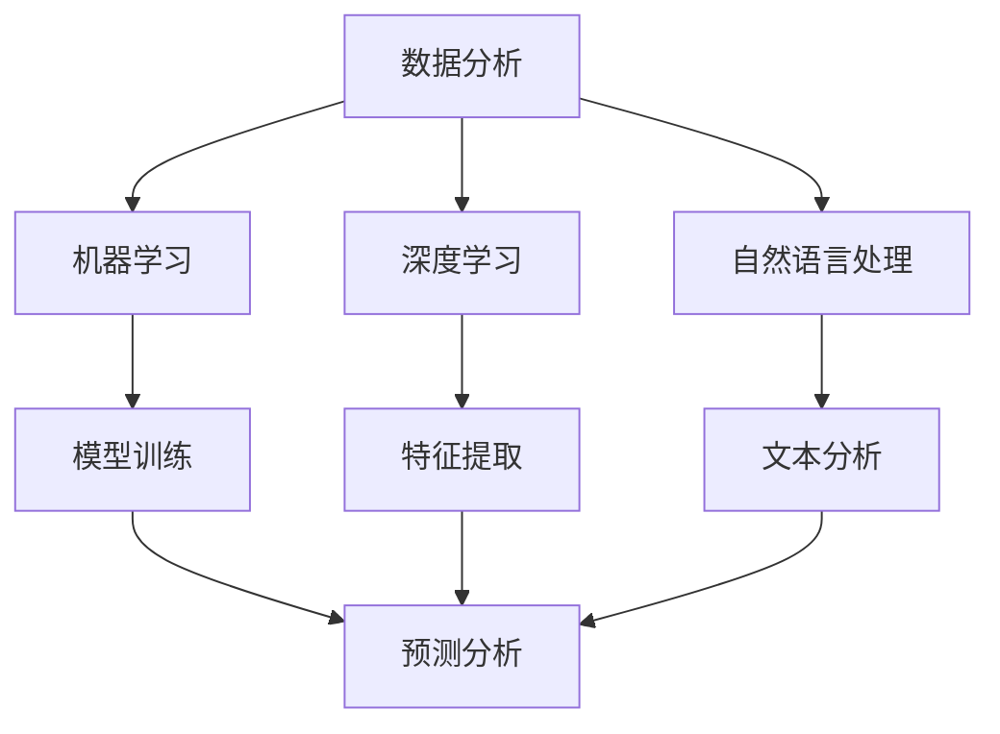

                 

关键词：增强分析、商业智能、人工智能、数据分析、算法原理、应用领域、数学模型、项目实践、未来展望

> 摘要：本文将深入探讨增强分析（Enhanced Analytics）在商业智能（Business Intelligence）中的应用，分析其核心概念、原理与算法，通过具体案例和数学模型讲解，展示其在各领域的应用潜力与未来发展趋势。

## 1. 背景介绍

商业智能（Business Intelligence，简称BI）是指利用数据分析、数据挖掘等手段，帮助企业做出更加明智的决策。随着大数据和人工智能技术的发展，传统的商业智能逐渐演变为增强分析（Enhanced Analytics），它不仅关注数据本身，更强调通过人工智能技术对数据进行深度挖掘和智能化处理，从而提供更精准、更高效的决策支持。

### 1.1 增强分析的发展历程

1. **数据驱动决策**：早期商业智能强调数据的收集、存储和简单的统计分析。
2. **数据分析**：随着数据量的增加，数据分析开始成为商业智能的重要手段，包括数据挖掘、关联分析等。
3. **机器学习**：商业智能引入机器学习算法，使得数据分析更加智能化，能够自动发现数据中的规律和趋势。
4. **增强分析**：结合深度学习和自然语言处理等前沿技术，增强分析实现了对数据的自动理解和预测，极大地提升了商业智能的决策能力。

### 1.2 增强分析的重要性

- **提高决策效率**：通过智能化处理，增强分析能够快速生成报告，提供实时决策支持。
- **优化业务流程**：增强分析可以帮助企业识别流程瓶颈，优化业务流程，提高运营效率。
- **发现商业机会**：通过对市场数据的深度挖掘，增强分析能够帮助企业发现潜在的商业机会，开拓新市场。

## 2. 核心概念与联系

### 2.1 数据分析

数据分析是商业智能的基础，它包括数据收集、数据清洗、数据存储、数据挖掘等多个环节。通过数据分析，企业可以从大量数据中提取有价值的信息。

### 2.2 机器学习

机器学习是增强分析的核心技术之一，它通过训练模型，使计算机能够从数据中学习并做出预测。常见的机器学习算法包括线性回归、决策树、随机森林等。

### 2.3 深度学习

深度学习是机器学习的一种高级形式，它通过多层神经网络对数据进行处理，能够自动提取数据中的复杂特征。深度学习在图像识别、自然语言处理等领域取得了显著成果。

### 2.4 自然语言处理

自然语言处理（NLP）是深度学习的一个重要应用领域，它使得计算机能够理解和生成人类语言。在商业智能中，NLP可以用于自动生成报告、分析文本数据等。

### 2.5 架构图



## 3. 核心算法原理 & 具体操作步骤

### 3.1 算法原理概述

增强分析的核心算法包括机器学习、深度学习和自然语言处理。这些算法通过训练模型，使计算机能够从数据中自动提取特征并进行预测。

### 3.2 算法步骤详解

1. **数据收集**：从各种渠道收集数据，包括内部数据、外部数据等。
2. **数据清洗**：对数据进行预处理，包括去除重复数据、处理缺失值等。
3. **特征工程**：从原始数据中提取出对预测目标有重要影响的特征。
4. **模型训练**：使用机器学习、深度学习或自然语言处理算法，训练模型。
5. **模型评估**：通过交叉验证等方法评估模型性能，调整模型参数。
6. **预测应用**：使用训练好的模型对新的数据进行预测，提供决策支持。

### 3.3 算法优缺点

- **优点**：增强分析能够自动提取特征，处理大量数据，提高决策效率。
- **缺点**：算法训练过程复杂，需要大量计算资源；模型解释性较差，难以理解其决策过程。

### 3.4 算法应用领域

- **金融**：预测股票价格、风险评估等。
- **零售**：客户行为分析、库存管理等。
- **医疗**：疾病预测、诊断辅助等。
- **交通**：交通流量预测、路径规划等。

## 4. 数学模型和公式 & 详细讲解 & 举例说明

### 4.1 数学模型构建

在增强分析中，常用的数学模型包括线性回归、决策树、神经网络等。这里以线性回归为例进行讲解。

### 4.2 公式推导过程

线性回归模型的目标是找到一组参数 \( \theta \)，使得预测值 \( \hat{y} \) 最接近实际值 \( y \)。

$$
\min_{\theta} \sum_{i=1}^{n} (y_i - \theta_0 - \theta_1 x_i)^2
$$

通过对上式求导，可以得到线性回归模型的参数估计：

$$
\theta_0 = \bar{y} - \theta_1 \bar{x}
$$

$$
\theta_1 = \frac{\sum_{i=1}^{n} (x_i - \bar{x})(y_i - \bar{y})}{\sum_{i=1}^{n} (x_i - \bar{x})^2}
$$

### 4.3 案例分析与讲解

假设我们有一组数据，表示某公司的销售额 \( y \) 与广告投入 \( x \) 之间的关系。通过线性回归模型，我们可以预测不同广告投入下的销售额。

```plaintext
x    y
100  150
200  250
300  300
400  350
500  400
```

使用线性回归模型，我们得到：

$$
\theta_0 = 100, \theta_1 = 1.5
$$

因此，销售额的预测公式为：

$$
\hat{y} = 100 + 1.5x
```

当广告投入为 300 时，预测销售额为 450。

## 5. 项目实践：代码实例和详细解释说明

### 5.1 开发环境搭建

为了实现线性回归模型，我们选择 Python 作为编程语言，使用 Scikit-learn 库进行模型训练和预测。

### 5.2 源代码详细实现

```python
import numpy as np
import matplotlib.pyplot as plt
from sklearn.linear_model import LinearRegression

# 数据预处理
x = np.array([100, 200, 300, 400, 500]).reshape(-1, 1)
y = np.array([150, 250, 300, 350, 400])

# 模型训练
model = LinearRegression()
model.fit(x, y)

# 预测
x_pred = np.array([300]).reshape(-1, 1)
y_pred = model.predict(x_pred)

# 可视化
plt.scatter(x, y)
plt.plot(x_pred, y_pred, color='red')
plt.xlabel('广告投入')
plt.ylabel('销售额')
plt.show()
```

### 5.3 代码解读与分析

- 第一行导入了 numpy 库，用于数据预处理和计算。
- 第二行导入了 matplotlib.pyplot 库，用于可视化。
- 第三行导入了 Scikit-learn 库，用于模型训练和预测。
- 第五行使用 numpy.reshape 将 x 转化为列向量。
- 第七行使用 numpy.array 创建 y 数组。
- 第九行使用 LinearRegression 创建线性回归模型。
- 第十一行使用 model.fit 对模型进行训练。
- 第十四行使用 model.predict 对新的数据进行预测。
- 最后一行使用 plt.scatter 和 plt.plot 绘制散点图和拟合直线。

### 5.4 运行结果展示

运行代码后，会生成一张散点图，其中红色直线表示线性回归模型的拟合结果。通过可视化，我们可以直观地看到广告投入与销售额之间的关系。

## 6. 实际应用场景

### 6.1 金融

在金融领域，增强分析可以用于股票价格预测、风险评估等。例如，通过分析历史数据，可以预测某只股票的未来走势，帮助投资者做出决策。

### 6.2 零售

在零售领域，增强分析可以用于客户行为分析、库存管理等。例如，通过对客户购买记录的分析，可以预测哪些产品在未来可能会有销售旺季，从而调整库存策略。

### 6.3 医疗

在医疗领域，增强分析可以用于疾病预测、诊断辅助等。例如，通过对患者病历数据的分析，可以预测哪些患者可能会患有某种疾病，从而提前采取预防措施。

### 6.4 交通

在交通领域，增强分析可以用于交通流量预测、路径规划等。例如，通过对历史交通数据的分析，可以预测未来某个时间段的交通流量，从而优化交通信号灯的配置。

## 7. 工具和资源推荐

### 7.1 学习资源推荐

- 《机器学习实战》
- 《深度学习》
- 《Python数据科学手册》
- 《商业智能：概念、技术和应用》

### 7.2 开发工具推荐

- Jupyter Notebook
- PyCharm
- R Studio

### 7.3 相关论文推荐

- "Deep Learning for Business Intelligence"
- "Machine Learning for Business Analytics"
- "Enhanced Analytics in Retail: A Framework for Actionable Insights"

## 8. 总结：未来发展趋势与挑战

### 8.1 研究成果总结

增强分析在商业智能中的应用已经取得了一系列显著成果，包括股票价格预测、客户行为分析、疾病预测等。未来，随着人工智能技术的不断发展，增强分析的应用范围将更加广泛，效果也将更加显著。

### 8.2 未来发展趋势

- **深度学习与强化学习的融合**：深度学习和强化学习在增强分析中的应用将更加深入，实现更加智能化、自动化的决策支持。
- **跨领域融合**：增强分析将在更多领域得到应用，如医疗、交通、能源等。
- **实时分析**：实时分析技术将进一步提升，实现更快速、更准确的决策支持。

### 8.3 面临的挑战

- **数据质量**：高质量的数据是增强分析的基础，未来需要解决数据质量、数据完整性等问题。
- **模型解释性**：增强分析模型通常缺乏解释性，未来需要研究更加透明、可解释的模型。
- **计算资源**：增强分析通常需要大量计算资源，未来需要解决计算资源分配和优化问题。

### 8.4 研究展望

未来，增强分析将朝着更加智能化、自动化、透明化的方向发展。通过融合多种人工智能技术，增强分析将为各行各业提供更加精准、高效的决策支持，推动社会进步和经济发展。

## 9. 附录：常见问题与解答

### 9.1 什么是增强分析？

增强分析是一种结合了数据分析、机器学习、深度学习等技术的商业智能方法，它能够自动从数据中提取有价值的信息，提供实时、精准的决策支持。

### 9.2 增强分析与传统商业智能的区别是什么？

传统商业智能主要依靠手工数据分析，而增强分析则利用人工智能技术自动处理和分析数据，能够实现更快速、更准确的决策支持。

### 9.3 增强分析的应用领域有哪些？

增强分析可以应用于金融、零售、医疗、交通等多个领域，为决策者提供有价值的预测和见解。

### 9.4 增强分析的挑战有哪些？

增强分析的挑战主要包括数据质量、模型解释性、计算资源等。

作者：禅与计算机程序设计艺术 / Zen and the Art of Computer Programming
```

