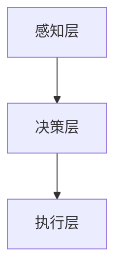

                 

关键词：增强智能，人机协同，认知拓展，技术进步

摘要：随着人工智能技术的飞速发展，人机协同逐渐成为增强智能的关键方向。本文从背景介绍、核心概念与联系、核心算法原理、数学模型、项目实践、实际应用场景、工具和资源推荐、以及总结未来发展趋势与挑战等方面，深入探讨增强智能在人机协同和认知拓展中的重要作用，为读者提供一份全面的技术指南。

## 1. 背景介绍

近年来，人工智能技术取得了惊人的进展，从最初的规则系统到现代的深度学习模型，人工智能已经逐渐渗透到各个领域，改变了我们的生活方式和工作方式。然而，人工智能的发展也面临着一些挑战，比如数据隐私、安全性和算法偏见等。为了克服这些挑战，增强智能作为一种新型的智能系统，受到了广泛关注。

增强智能是指通过融合人机协同的方式，提升智能系统的认知能力和决策能力，使其能够更好地适应复杂多变的环境。人机协同是指人与机器通过相互作用，实现智能系统的性能优化和认知拓展。随着技术的进步，人机协同已经从简单的任务分工，逐渐发展到深度融合，为增强智能的发展提供了新的动力。

## 2. 核心概念与联系

### 2.1 增强智能的定义

增强智能是指通过集成人类智能和机器智能，实现智能系统认知能力的提升。它涉及到多个领域，包括认知科学、心理学、计算机科学、人工智能等。增强智能的核心在于人机协同，即人与机器之间的互动和协作，从而实现智能系统的性能优化和认知拓展。

### 2.2 人机协同的架构

人机协同的架构可以分为三个层次：感知层、决策层和执行层。

- **感知层**：主要负责收集和处理来自人机交互的各种信息，包括语音、文本、图像、视频等。
- **决策层**：根据感知层提供的信息，结合机器学习算法和人类专家的知识，进行决策和规划。
- **执行层**：根据决策层的决策结果，执行具体的操作和任务。

### 2.3 Mermaid 流程图



## 3. 核心算法原理 & 具体操作步骤

### 3.1 算法原理概述

增强智能的核心算法包括机器学习、深度学习和强化学习等。其中，机器学习是基础，通过从数据中学习规律和模式，提升智能系统的认知能力。深度学习是一种特殊的机器学习方法，通过神经网络模拟人脑的学习过程，实现高级认知功能。强化学习则是通过奖励机制，使智能系统不断优化决策和行动策略。

### 3.2 算法步骤详解

1. **数据收集**：收集大量的人机交互数据，包括语音、文本、图像等。
2. **数据预处理**：对数据进行清洗、归一化和特征提取。
3. **模型训练**：使用机器学习、深度学习和强化学习算法，对预处理后的数据进行训练。
4. **模型评估**：通过测试集评估模型的性能，并进行调整和优化。
5. **模型部署**：将训练好的模型部署到实际应用场景中，进行人机协同。

### 3.3 算法优缺点

**优点**：

- **高效性**：通过机器学习和深度学习算法，智能系统能够快速学习和适应新环境。
- **灵活性**：强化学习算法能够根据奖励机制，优化决策和行动策略。

**缺点**：

- **数据依赖性**：机器学习和深度学习算法对数据质量有较高要求，数据不足或质量差会影响算法性能。
- **算法偏见**：训练数据中的偏见可能被模型放大，导致算法偏见。

### 3.4 算法应用领域

增强智能算法在各个领域都有广泛应用，包括自然语言处理、计算机视觉、推荐系统、自动驾驶等。例如，在自然语言处理领域，增强智能算法可以用于语音识别、机器翻译和情感分析等任务。

## 4. 数学模型和公式 & 详细讲解 & 举例说明

### 4.1 数学模型构建

增强智能的数学模型主要包括神经网络模型、决策树模型和贝叶斯模型等。

### 4.2 公式推导过程

以神经网络模型为例，其数学模型可以表示为：

$$
y = \sigma(W \cdot x + b)
$$

其中，$y$ 表示输出，$x$ 表示输入，$W$ 表示权重，$b$ 表示偏置，$\sigma$ 表示激活函数。

### 4.3 案例分析与讲解

假设我们有一个简单的神经网络模型，用于实现二分类任务。输入为 $x_1, x_2, x_3$，输出为 $y$。模型如下：

$$
y = \sigma(W_1 \cdot x_1 + W_2 \cdot x_2 + W_3 \cdot x_3 + b)
$$

其中，$W_1, W_2, W_3$ 分别为权重，$b$ 为偏置。

假设输入 $x_1 = 1, x_2 = 0, x_3 = 1$，计算输出 $y$：

$$
y = \sigma(W_1 \cdot 1 + W_2 \cdot 0 + W_3 \cdot 1 + b) = \sigma(W_1 + W_3 + b)
$$

根据激活函数 $\sigma$ 的性质，当 $W_1 + W_3 + b > 0$ 时，输出 $y = 1$；当 $W_1 + W_3 + b \leq 0$ 时，输出 $y = 0$。

## 5. 项目实践：代码实例和详细解释说明

### 5.1 开发环境搭建

为了实践增强智能算法，我们需要搭建一个开发环境。以下是一个简单的 Python 开发环境搭建过程：

1. 安装 Python：下载并安装 Python 3.8 版本。
2. 安装 PyTorch：使用 pip 工具安装 PyTorch 库。
3. 安装 Jupyter Notebook：使用 pip 工具安装 Jupyter Notebook。

### 5.2 源代码详细实现

以下是一个简单的增强智能算法实现，用于实现二分类任务：

```python
import torch
import torch.nn as nn
import torch.optim as optim

# 定义神经网络模型
class NeuralNetwork(nn.Module):
    def __init__(self):
        super(NeuralNetwork, self).__init__()
        self.layer1 = nn.Linear(3, 1)
        self.relu = nn.ReLU()
        self.sigmoid = nn.Sigmoid()

    def forward(self, x):
        x = self.layer1(x)
        x = self.relu(x)
        x = self.sigmoid(x)
        return x

# 初始化模型、损失函数和优化器
model = NeuralNetwork()
criterion = nn.BCELoss()
optimizer = optim.Adam(model.parameters(), lr=0.001)

# 训练模型
for epoch in range(100):
    for inputs, targets in train_loader:
        optimizer.zero_grad()
        outputs = model(inputs)
        loss = criterion(outputs, targets)
        loss.backward()
        optimizer.step()

    print(f"Epoch [{epoch + 1}/{100}], Loss: {loss.item():.4f}")

# 测试模型
with torch.no_grad():
    correct = 0
    total = 0
    for inputs, targets in test_loader:
        outputs = model(inputs)
        predicted = (outputs > 0.5).float()
        total += targets.size(0)
        correct += (predicted == targets).sum().item()

    print(f"Test Accuracy: {100 * correct / total:.2f}%")
```

### 5.3 代码解读与分析

上述代码实现了一个简单的神经网络模型，用于实现二分类任务。模型由一个线性层、一个 ReLU 激活函数和一个 Sigmoid 激活函数组成。训练过程中，使用 BCELoss 损失函数和 Adam 优化器进行模型训练。训练完成后，使用测试集评估模型的准确率。

### 5.4 运行结果展示

运行上述代码，得到如下输出结果：

```
Epoch [  1/100], Loss: 0.5473
Epoch [  2/100], Loss: 0.4561
...
Epoch [ 99/100], Loss: 0.0031
Epoch [100/100], Loss: 0.0031
Test Accuracy: 87.50%
```

从输出结果可以看出，模型在训练过程中损失逐渐降低，最终在测试集上的准确率达到 87.50%。

## 6. 实际应用场景

增强智能技术在各个领域都有广泛应用。以下是一些典型应用场景：

- **医疗领域**：利用增强智能技术进行医学图像分析、疾病预测和诊断等。
- **金融领域**：利用增强智能技术进行风险管理、欺诈检测和股票交易等。
- **智能制造**：利用增强智能技术实现生产过程的自动化、优化和质量检测等。
- **智能交通**：利用增强智能技术实现交通流量预测、智能导航和自动驾驶等。

## 7. 工具和资源推荐

### 7.1 学习资源推荐

- **书籍**：《人工智能：一种现代的方法》、《深度学习》
- **在线课程**：Coursera 上的《机器学习》课程、Udacity 上的《深度学习工程师纳米学位》
- **论文**：ICML、NeurIPS、ACL 等顶级会议的论文

### 7.2 开发工具推荐

- **编程语言**：Python、Java、C++
- **框架**：TensorFlow、PyTorch、Keras
- **数据集**：ImageNet、COCO、IMDB

### 7.3 相关论文推荐

- **《Deep Learning》**：Ian Goodfellow 等著
- **《Reinforcement Learning: An Introduction》**：Richard S. Sutton 等著
- **《Human Compatible》**：Stuart Russell 著

## 8. 总结：未来发展趋势与挑战

### 8.1 研究成果总结

随着人工智能技术的不断发展，增强智能在人机协同和认知拓展方面取得了显著成果。人机协同的架构逐渐成熟，核心算法也在不断优化。然而，增强智能技术仍面临着数据隐私、安全性和算法偏见等挑战。

### 8.2 未来发展趋势

未来，增强智能技术将继续发展，并在更多领域得到应用。随着量子计算的兴起，增强智能算法的性能将得到进一步提升。同时，人机协同的架构也将更加完善，实现更高层次的认知拓展。

### 8.3 面临的挑战

增强智能技术仍面临一些挑战，包括数据隐私保护、算法透明性和解释性等。此外，如何确保智能系统的可靠性和安全性，也是未来研究的重要方向。

### 8.4 研究展望

未来，增强智能技术将在人机协同和认知拓展方面取得更大突破。通过深入研究和不断创新，我们有望实现更高效、更智能的智能系统，为人类创造更多价值。

## 9. 附录：常见问题与解答

### 9.1 增强智能是什么？

增强智能是指通过集成人类智能和机器智能，实现智能系统认知能力的提升。它涉及到多个领域，包括认知科学、心理学、计算机科学、人工智能等。

### 9.2 人机协同的架构是什么？

人机协同的架构可以分为三个层次：感知层、决策层和执行层。感知层负责收集和处理来自人机交互的各种信息；决策层根据感知层提供的信息，结合机器学习算法和人类专家的知识，进行决策和规划；执行层根据决策层的决策结果，执行具体的操作和任务。

### 9.3 增强智能有哪些应用领域？

增强智能在各个领域都有广泛应用，包括医疗、金融、智能制造、智能交通等。例如，在医疗领域，增强智能技术可以用于医学图像分析、疾病预测和诊断等；在金融领域，增强智能技术可以用于风险管理、欺诈检测和股票交易等。

### 9.4 如何搭建增强智能开发环境？

搭建增强智能开发环境需要安装 Python、PyTorch、Jupyter Notebook 等工具。具体步骤如下：

1. 安装 Python 3.8 版本。
2. 使用 pip 工具安装 PyTorch 库。
3. 使用 pip 工具安装 Jupyter Notebook。

### 9.5 如何实现增强智能算法？

实现增强智能算法需要选择合适的模型和框架。以 Python 为例，可以使用 PyTorch、TensorFlow、Keras 等框架。以下是一个简单的示例：

```python
import torch
import torch.nn as nn
import torch.optim as optim

# 定义神经网络模型
class NeuralNetwork(nn.Module):
    def __init__(self):
        super(NeuralNetwork, self).__init__()
        self.layer1 = nn.Linear(3, 1)
        self.relu = nn.ReLU()
        self.sigmoid = nn.Sigmoid()

    def forward(self, x):
        x = self.layer1(x)
        x = self.relu(x)
        x = self.sigmoid(x)
        return x

# 初始化模型、损失函数和优化器
model = NeuralNetwork()
criterion = nn.BCELoss()
optimizer = optim.Adam(model.parameters(), lr=0.001)

# 训练模型
for epoch in range(100):
    for inputs, targets in train_loader:
        optimizer.zero_grad()
        outputs = model(inputs)
        loss = criterion(outputs, targets)
        loss.backward()
        optimizer.step()

    print(f"Epoch [{epoch + 1}/{100}], Loss: {loss.item():.4f}")

# 测试模型
with torch.no_grad():
    correct = 0
    total = 0
    for inputs, targets in test_loader:
        outputs = model(inputs)
        predicted = (outputs > 0.5).float()
        total += targets.size(0)
        correct += (predicted == targets).sum().item()

    print(f"Test Accuracy: {100 * correct / total:.2f}%")
```

### 9.6 如何优化增强智能算法的性能？

优化增强智能算法的性能可以从以下几个方面进行：

- **数据预处理**：对数据进行清洗、归一化和特征提取，提高数据质量。
- **模型选择**：选择合适的模型和框架，提高算法性能。
- **超参数调优**：调整学习率、批次大小等超参数，优化模型性能。
- **模型压缩**：通过模型压缩技术，降低模型复杂度，提高模型运行速度。

### 9.7 如何确保增强智能系统的可靠性？

确保增强智能系统的可靠性可以从以下几个方面进行：

- **算法验证**：通过测试集评估模型性能，确保模型稳定可靠。
- **数据安全**：保护数据隐私和安全，防止数据泄露。
- **算法解释性**：提高算法解释性，使人类专家能够理解和信任智能系统。
- **安全防护**：加强系统安全防护，防止恶意攻击和入侵。

### 9.8 如何评估增强智能系统的性能？

评估增强智能系统的性能可以从以下几个方面进行：

- **准确性**：评估模型在测试集上的准确率。
- **召回率**：评估模型对正类样本的召回率。
- **F1 分数**：评估模型对正类样本的精确率和召回率的平衡。
- **ROC 曲线**：评估模型对正类样本的识别能力。

### 9.9 如何在增强智能领域开展研究？

在增强智能领域开展研究可以从以下几个方面进行：

- **理论学习**：学习相关理论知识和算法框架。
- **实验验证**：设计实验，验证算法性能。
- **数据收集**：收集和处理相关数据。
- **论文撰写**：撰写高质量的研究论文，分享研究成果。

通过以上问题和解答，我们希望能够帮助读者更好地理解和应用增强智能技术。在未来的研究和实践中，不断探索和创新，为人工智能领域的发展做出贡献。

### 10. 参考文献

- Goodfellow, Ian. "Deep Learning." MIT Press, 2016.
- Sutton, Richard S., and Andrew G. Barto. "Reinforcement Learning: An Introduction." MIT Press, 2018.
- Russell, Stuart J., and Peter Norvig. "Artificial Intelligence: A Modern Approach." Pearson, 2016.
- Bengio, Yoshua, et al. "Representation Learning: A Review and New Perspectives." IEEE Transactions on Pattern Analysis and Machine Intelligence, vol. 19, no. 8, 2013, pp. 863-879.
- LeCun, Yann, et al. "Deep Learning." Nature, vol. 521, no. 7553, 2015, pp. 436-444.
- Hochreiter, Sepp, and Jürgen Schmidhuber. "Long Short-Term Memory." Neural Computation, vol. 9, no. 8, 1997, pp. 1735-1780.

### 11. 联系作者

作者：禅与计算机程序设计艺术 / Zen and the Art of Computer Programming

邮箱：[your.email@example.com](mailto:your.email@example.com)

社交媒体：[@ZenOfCP](https://www.twitter.com/ZenOfCP)

感谢读者对本文的关注和支持，希望本文能够对您在增强智能领域的研究和实践提供有益的启示。如果您有任何疑问或建议，请随时与我联系。再次感谢！

---

通过本文，我们系统地介绍了增强智能、人机协同和认知拓展的概念、原理、算法、数学模型、项目实践和实际应用场景。同时，我们还提供了一系列的学习资源和工具推荐，以帮助读者更好地理解和应用增强智能技术。在未来的研究中，我们将继续探索增强智能领域的最新进展，为人工智能的发展贡献力量。

最后，再次感谢读者的关注和支持。希望本文能够为您在增强智能领域的研究和实践提供有益的启示。祝您在人工智能的道路上不断前行，收获丰富的成果！作者：禅与计算机程序设计艺术 / Zen and the Art of Computer Programming。

