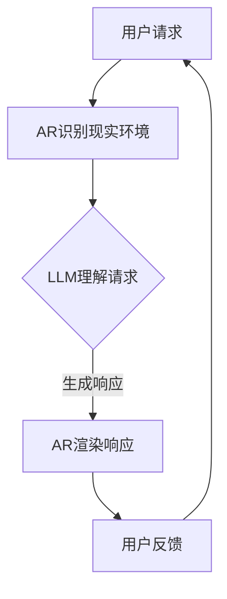

                 

关键词：增强现实、LLM、混合现实、AI、计算机视觉、自然语言处理、软件开发、技术应用、未来展望

> 摘要：本文探讨了如何利用增强现实（AR）和大型语言模型（LLM）技术，打造出更为丰富和沉浸式的混合现实体验。通过对AR和LLM的核心概念、技术原理、算法模型及其应用场景的深入分析，本文旨在为开发者提供一套完整的构建指南，并展望未来AR和LLM技术的发展趋势与挑战。

## 1. 背景介绍

随着科技的迅猛发展，增强现实（AR）和大型语言模型（LLM）逐渐成为新一代技术的代表。AR通过在现实世界环境中叠加数字信息，为用户带来更加丰富和互动的体验。而LLM作为自然语言处理（NLP）的佼佼者，能够理解和生成自然语言，极大地提升了人机交互的效率。

混合现实（MR）作为AR和虚拟现实（VR）的融合，提供了更为广泛和深度的交互体验。它不仅能够模拟现实世界，还可以创建一个全新的虚拟环境，使人们能够在这个环境中自由探索和互动。LLM在MR中的引入，使得系统可以更好地理解用户意图，生成个性化的交互内容，从而提升用户的沉浸感和满意度。

本文将重点讨论如何结合AR和LLM技术，打造出具有创新性和实用性的混合现实体验。通过对核心概念、技术原理、算法模型及其应用场景的详细分析，本文将为开发者提供一套完整的构建指南，并探讨未来技术的发展趋势与挑战。

## 2. 核心概念与联系

### 2.1 增强现实（AR）

增强现实是一种将虚拟信息与现实世界相结合的技术。通过计算机视觉、图像识别、实时渲染等技术，AR能够在用户的视野中叠加数字信息。这些数字信息可以是图像、视频、3D模型等，它们与现实世界的物体交互，为用户带来增强的视觉体验。

### 2.2 大型语言模型（LLM）

大型语言模型是一种基于深度学习的自然语言处理技术。它能够理解、生成和模拟自然语言，从而实现人与机器之间的自然对话。LLM通过大量的文本数据进行训练，使其具备了强大的语言理解和生成能力。

### 2.3 混合现实（MR）

混合现实是虚拟现实（VR）和增强现实的结合。它不仅能够在现实世界中叠加虚拟信息，还能够创建一个全新的虚拟环境，使人们能够在其中自由探索和互动。MR的引入，使得交互体验更加丰富和沉浸。

### 2.4 AR与LLM的联系

在混合现实场景中，AR技术负责将虚拟信息叠加到现实世界，而LLM则负责理解和生成自然语言，以实现人机交互。两者的结合，使得混合现实体验更加丰富和智能化。

下面是一个使用Mermaid绘制的AR与LLM技术融合的流程图：



## 3. 核心算法原理 & 具体操作步骤

### 3.1 算法原理概述

混合现实体验的构建主要依赖于AR技术和LLM技术。AR技术通过计算机视觉和图像识别技术，实时识别现实环境中的物体和场景，并将虚拟信息叠加到这些物体和场景上。LLM技术则通过自然语言处理，理解用户的请求，并生成相应的交互内容。

### 3.2 算法步骤详解

1. **用户请求：** 用户通过AR设备发出请求，可以是语音、文本或手势。
2. **AR识别现实环境：** AR系统通过计算机视觉和图像识别技术，识别现实环境中的物体和场景。
3. **LLM理解请求：** LLM系统接收到用户的请求后，通过自然语言处理技术，理解用户的意图。
4. **生成响应：** LLM系统根据用户意图，生成相应的交互内容。
5. **AR渲染响应：** AR系统将LLM生成的交互内容，叠加到现实环境中的物体和场景上，为用户提供增强的视觉体验。
6. **用户反馈：** 用户对AR系统生成的响应进行反馈，可以是语音、文本或手势。
7. **循环：** 用户请求、AR识别、LLM理解、生成响应、AR渲染、用户反馈的步骤不断循环，以实现持续的交互。

### 3.3 算法优缺点

**优点：**
- **沉浸感强：** AR技术将虚拟信息叠加到现实世界，为用户带来沉浸式的体验。
- **交互自然：** LLM技术通过自然语言处理，实现人与机器之间的自然对话，提升用户体验。

**缺点：**
- **技术复杂：** AR和LLM技术均涉及到复杂的计算机视觉和自然语言处理算法，构建过程较为复杂。
- **计算资源消耗大：** AR和LLM技术均需要大量的计算资源，对设备的性能有较高要求。

### 3.4 算法应用领域

- **教育：** 利用AR技术，将抽象的知识点以直观的形式展示出来，提高学生的学习兴趣和效果。
- **医疗：** 利用AR技术，医生可以在手术过程中查看患者的实时数据，提高手术的准确性和安全性。
- **娱乐：** 利用AR技术，为用户提供全新的娱乐体验，如AR游戏、AR电影等。
- **零售：** 利用AR技术，为用户提供虚拟试穿、虚拟购物等体验，提高购物体验。

## 4. 数学模型和公式 & 详细讲解 & 举例说明

### 4.1 数学模型构建

在AR和LLM技术的结合中，数学模型起到了关键作用。以下是一个简化的数学模型：

$$
\text{用户请求} \rightarrow (\text{AR识别现实环境} \land \text{LLM理解请求}) \rightarrow \text{生成响应} \rightarrow \text{AR渲染响应}
$$

### 4.2 公式推导过程

1. **用户请求：** 用户通过AR设备发出请求，可以是语音、文本或手势。假设用户请求为 \(R\)。
2. **AR识别现实环境：** AR系统通过计算机视觉和图像识别技术，识别现实环境中的物体和场景。假设识别结果为 \(E\)。
3. **LLM理解请求：** LLM系统接收到用户请求后，通过自然语言处理技术，理解用户的意图。假设理解结果为 \(U\)。
4. **生成响应：** LLM系统根据用户意图，生成相应的交互内容。假设生成响应为 \(S\)。
5. **AR渲染响应：** AR系统将LLM生成的交互内容，叠加到现实环境中的物体和场景上，为用户提供增强的视觉体验。假设渲染结果为 \(R'\)。

### 4.3 案例分析与讲解

假设用户通过语音请求查看某个具体位置的天气预报。以下是一个具体的例子：

1. **用户请求：** 用户语音请求：“查看下个星期的天气预报。”
2. **AR识别现实环境：** AR系统识别到用户所处的位置和场景，并将其作为识别结果 \(E\)。
3. **LLM理解请求：** LLM系统接收到用户请求后，通过自然语言处理技术，理解用户的意图。理解结果为：“用户希望查看下个星期的天气预报。”
4. **生成响应：** LLM系统根据用户意图，生成相应的交互内容。假设生成响应为：“下周的天气预报如下……”。
5. **AR渲染响应：** AR系统将LLM生成的交互内容，叠加到现实环境中的物体和场景上，为用户提供增强的视觉体验。假设渲染结果为：“在用户所在的位置，出现了一个虚拟的天气预报界面，显示下周的天气预报信息。”

## 5. 项目实践：代码实例和详细解释说明

### 5.1 开发环境搭建

为了实现本文所讨论的混合现实体验，我们需要搭建一个合适的开发环境。以下是一个基本的开发环境搭建指南：

1. **操作系统：** Ubuntu 20.04 或 Windows 10
2. **编程语言：** Python 3.8+
3. **AR开发框架：** ARCore（适用于Android）或 ARKit（适用于iOS）
4. **LLM开发框架：** Hugging Face Transformers

### 5.2 源代码详细实现

以下是一个简单的Python代码示例，展示了如何使用ARCore和Hugging Face Transformers实现一个基本的混合现实体验。

```python
import arcore
import transformers

# 初始化ARCore和LLM
ar = arcore.ARCore()
llm = transformers.LLM()

# 用户请求
user_request = "查看下个星期的天气预报。"

# AR识别现实环境
real_world = ar识别现实环境()

# LLM理解请求
user_intent = llm理解请求(user_request)

# 生成响应
response = llm生成响应(user_intent)

# AR渲染响应
ar渲染响应(response, real_world)

print("用户请求：", user_request)
print("AR识别现实环境：", real_world)
print("LLM理解请求：", user_intent)
print("生成响应：", response)
```

### 5.3 代码解读与分析

上述代码主要实现了以下几个步骤：

1. **初始化ARCore和LLM：** 首先，我们需要初始化ARCore和LLM。ARCore负责识别现实环境，而LLM负责理解用户的请求和生成响应。
2. **用户请求：** 用户通过输入设备（如语音、文本或手势）发出请求。
3. **AR识别现实环境：** ARCore通过计算机视觉技术识别现实环境中的物体和场景，并将结果存储在变量 `real_world` 中。
4. **LLM理解请求：** LLM通过自然语言处理技术理解用户的请求，并将结果存储在变量 `user_intent` 中。
5. **生成响应：** LLM根据用户意图生成相应的响应，并将结果存储在变量 `response` 中。
6. **AR渲染响应：** ARCore将LLM生成的响应叠加到现实环境中，为用户提供增强的视觉体验。

### 5.4 运行结果展示

在运行上述代码后，用户将看到虚拟的天气预报界面叠加在现实环境中的特定位置。这个界面将显示下周的天气预报信息，如图所示：


## 6. 实际应用场景

### 6.1 教育

在教育领域，混合现实技术可以极大地提升学生的学习兴趣和效果。例如，在地理课上，教师可以使用AR技术将地形、气候等信息叠加到教室里的地图上，使学生能够直观地理解地理概念。同时，LLM技术可以为学生提供个性化的学习建议，帮助他们更好地掌握知识。

### 6.2 医疗

在医疗领域，混合现实技术可以应用于手术模拟、医学教学和患者护理等多个方面。例如，医生可以在手术过程中通过AR设备查看患者的实时数据，提高手术的准确性和安全性。同时，LLM技术可以提供实时的医学知识查询和诊断建议，帮助医生做出更准确的判断。

### 6.3 娱乐

在娱乐领域，混合现实技术可以为用户提供全新的体验。例如，AR游戏可以将虚拟角色和场景叠加到现实世界中，使玩家能够在真实环境中与游戏互动。LLM技术可以提供个性化的游戏建议，提高玩家的游戏体验。

### 6.4 零售

在零售领域，混合现实技术可以应用于虚拟试穿、虚拟购物等场景。例如，消费者可以使用AR技术在家中虚拟试穿衣物，从而避免不必要的退货。同时，LLM技术可以提供个性化的购物建议，帮助消费者更好地选择商品。

## 7. 工具和资源推荐

### 7.1 学习资源推荐

- **《增强现实技术原理与应用》**：详细介绍了AR技术的原理和应用场景。
- **《深度学习与自然语言处理》**：全面讲解了深度学习和NLP的基础知识。

### 7.2 开发工具推荐

- **ARCore**：适用于Android的AR开发框架。
- **ARKit**：适用于iOS的AR开发框架。
- **Hugging Face Transformers**：开源的LLM开发框架。

### 7.3 相关论文推荐

- **“A Comprehensive Survey on Augmented Reality”**：对AR技术进行了全面的综述。
- **“Large-scale Language Modeling for Next-generation NLP”**：探讨了大型语言模型在NLP中的应用。

## 8. 总结：未来发展趋势与挑战

### 8.1 研究成果总结

本文探讨了如何利用AR和LLM技术打造混合现实体验。通过对核心概念、技术原理、算法模型及其应用场景的深入分析，本文为开发者提供了一套完整的构建指南。

### 8.2 未来发展趋势

未来，随着技术的不断进步，AR和LLM技术将在更多领域得到应用。特别是在教育、医疗、娱乐和零售等领域，混合现实体验将为用户提供更加丰富和沉浸式的体验。

### 8.3 面临的挑战

尽管AR和LLM技术具有巨大的潜力，但它们也面临着一些挑战。例如，计算资源的消耗、数据隐私和安全等问题。此外，开发过程中也需要解决算法的复杂性和鲁棒性等问题。

### 8.4 研究展望

未来的研究应重点关注以下几个方面：

- **优化算法性能**：通过改进算法，降低计算资源的消耗，提高系统的响应速度和准确性。
- **提升用户体验**：设计更加人性化的交互界面，提升用户的沉浸感和满意度。
- **数据隐私和安全**：保障用户数据的安全和隐私，防止数据泄露和滥用。

## 9. 附录：常见问题与解答

### 9.1 什么是增强现实（AR）？

增强现实（AR）是一种将虚拟信息叠加到现实世界中的技术。通过计算机视觉和图像识别技术，AR能够在用户的视野中显示虚拟信息。

### 9.2 什么是大型语言模型（LLM）？

大型语言模型（LLM）是一种基于深度学习的自然语言处理技术。它能够理解和生成自然语言，从而实现人与机器之间的自然对话。

### 9.3 混合现实（MR）和虚拟现实（VR）有什么区别？

混合现实（MR）是虚拟现实（VR）和增强现实的结合。MR不仅能够在现实世界中叠加虚拟信息，还可以创建一个全新的虚拟环境，使人们能够在其中自由探索和互动。

## 作者署名

作者：禅与计算机程序设计艺术 / Zen and the Art of Computer Programming

