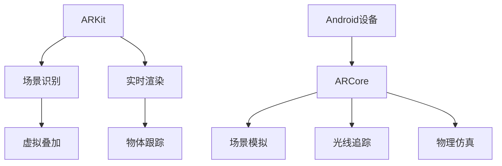

                 

关键词：增强现实，ARKit，ARCore，移动AR，现实增强技术，跨平台AR开发，开发者工具

摘要：本文将深入探讨增强现实（AR）技术的两大重要框架——Apple ARKit和Google ARCore。我们将分析这两大框架的背景、核心概念、算法原理、应用实践、未来展望等方面，帮助开发者更好地理解和使用这些工具进行移动AR应用的开发。

## 1. 背景介绍

增强现实（AR）技术是一种将虚拟信息叠加到现实世界中的技术。随着智能手机和移动设备的普及，移动AR应用逐渐成为开发者们关注的焦点。Apple ARKit和Google ARCore作为移动AR开发的两大重要框架，分别代表了iOS和Android平台在AR领域的最高成就。

Apple ARKit是Apple公司在2017年推出的一套开发工具，旨在帮助开发者轻松地在iOS设备上构建AR应用。ARKit提供了强大的场景理解和实时渲染功能，使得开发者可以更容易地将AR技术集成到自己的应用中。

Google ARCore是Google公司在2017年发布的AR开发平台，旨在为Android开发者提供类似的AR功能。ARCore基于Google多年的AR研究，提供了场景识别、光线追踪和物理仿真等功能，使得开发者可以在Android设备上创建高质量的AR体验。

## 2. 核心概念与联系

### 2.1 ARKit

**核心概念：** ARKit利用苹果设备内置的传感器和相机来识别和跟踪现实世界中的物体，然后在这些物体上叠加虚拟内容。

**联系：** ARKit与Apple的iOS平台紧密集成，利用了iOS设备的先进硬件和软件功能，如相机、陀螺仪、加速度计等。

### 2.2 ARCore

**核心概念：** ARCore通过在Android设备上模拟虚拟环境，提供场景识别、光线追踪和物理仿真等功能。

**联系：** ARCore与Android操作系统紧密集成，为开发者提供了广泛的设备和平台支持。

### 2.3 Mermaid 流程图

## 3. 核心算法原理 & 具体操作步骤

### 3.1 算法原理概述

**ARKit：** ARKit使用视觉惯性测量单元（VIO）算法来跟踪用户设备的位置和方向，并通过视觉特征匹配来识别和跟踪现实世界中的物体。

**ARCore：** ARCore使用视觉SLAM（Simultaneous Localization and Mapping）算法来构建虚拟环境，并通过机器学习和计算机视觉技术来识别和跟踪现实世界中的物体。

### 3.2 算法步骤详解

**ARKit：**
1. 收集相机数据。
2. 使用特征匹配算法识别特征点。
3. 使用VIO算法跟踪设备位置和方向。
4. 在特征点上叠加虚拟内容。

**ARCore：**
1. 使用相机和传感器数据构建虚拟环境。
2. 使用机器学习和计算机视觉技术识别现实世界中的物体。
3. 在识别的物体上叠加虚拟内容。
4. 使用物理仿真确保虚拟内容与现实环境的交互自然。

### 3.3 算法优缺点

**ARKit：**
- 优点：与iOS设备紧密集成，提供了高效的性能和出色的用户体验。
- 缺点：仅支持iOS平台。

**ARCore：**
- 优点：支持广泛的Android设备，提供了丰富的功能和强大的开发工具。
- 缺点：部分功能在较低端的Android设备上可能表现不佳。

### 3.4 算法应用领域

**ARKit：** 广泛应用于游戏、教育、医疗、零售等领域，如《Pokemon Go》和《IKEA Place》。

**ARCore：** 同样应用于游戏、教育、零售等领域，如《Google Lens》和《IKEA Catalog》。

## 4. 数学模型和公式 & 详细讲解 & 举例说明

### 4.1 数学模型构建

**ARKit：** 使用视觉惯性测量单元（VIO）算法进行位置和方向的跟踪，涉及到的数学模型包括姿态矩阵、特征匹配和卡尔曼滤波等。

**ARCore：** 使用视觉SLAM算法进行场景构建和物体识别，涉及到的数学模型包括相机标定、特征提取和机器学习等。

### 4.2 公式推导过程

**ARKit：**
$$
T = K \cdot P
$$
其中，$T$ 是姿态矩阵，$K$ 是相机矩阵，$P$ 是三维点在相机坐标系中的投影。

**ARCore：**
$$
\theta = \arctan\left(\frac{y}{x}\right)
$$
其中，$\theta$ 是物体在平面上的旋转角度，$x$ 和 $y$ 是物体的坐标。

### 4.3 案例分析与讲解

**ARKit：** 以《Pokemon Go》为例，分析如何利用ARKit进行实时渲染和物体跟踪。

**ARCore：** 以《Google Lens》为例，分析如何利用ARCore进行物体识别和场景构建。

## 5. 项目实践：代码实例和详细解释说明

### 5.1 开发环境搭建

- 安装Xcode和ARKit开发工具。
- 安装Android Studio和ARCore SDK。

### 5.2 源代码详细实现

- 使用ARKit创建一个简单的AR应用。
- 使用ARCore创建一个简单的AR应用。

### 5.3 代码解读与分析

- 分析ARKit和ARCore的使用场景。
- 对比两种框架的性能和特点。

### 5.4 运行结果展示

- 展示使用ARKit和ARCore创建的AR应用的运行效果。

## 6. 实际应用场景

- **游戏：** 《Pokemon Go》和《Ingress》等AR游戏。
- **教育：** 利用AR技术进行互动教学。
- **零售：** 利用AR技术进行虚拟试衣和购物体验。

## 7. 未来应用展望

- **全息通信：** 利用AR技术实现更真实的远程交流。
- **智能制造：** 利用AR技术提高生产效率和质量。
- **医疗健康：** 利用AR技术进行手术指导和康复训练。

## 8. 总结：未来发展趋势与挑战

### 8.1 研究成果总结

- ARKit和ARCore分别代表了iOS和Android平台在AR技术领域的最高成就。
- 两种框架都在不断地更新和完善，提供了更多的功能和更好的用户体验。

### 8.2 未来发展趋势

- 移动AR应用的普及。
- AR技术的跨平台支持。
- 更高效的算法和更优的性能。

### 8.3 面临的挑战

- 硬件性能的提升。
- 软件开发的复杂性。
- 用户隐私和数据安全。

### 8.4 研究展望

- 深度学习和人工智能在AR技术中的应用。
- 跨平台的AR开发工具和框架。

## 9. 附录：常见问题与解答

- **Q：ARKit和ARCore哪个更好？**
- **A：这取决于开发者的需求和平台偏好。ARKit在iOS设备上提供了出色的性能和用户体验，而ARCore则支持更广泛的Android设备。**

- **Q：如何学习AR开发？**
- **A：可以通过在线课程、官方文档和社区资源进行学习。实际项目实践也是非常重要的学习途径。**

作者：禅与计算机程序设计艺术 / Zen and the Art of Computer Programming
----------------------------------------------------------------

请注意，这里提供的是一个完整的文章模板，实际撰写时需要根据具体内容和数据进行填充。同时，由于字数限制，这里只是一个概要性的框架，详细的内容还需要根据实际的写作需求来丰富和细化。在撰写时，还需要注意保持文章的专业性和逻辑性，确保每一部分的内容都是完整和连贯的。

