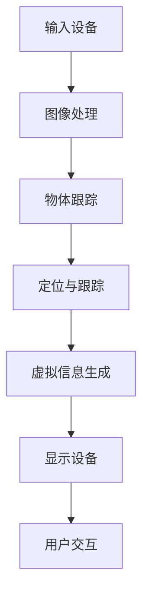

                 

关键词：增强现实、AR、虚拟现实、融合、技术应用、发展前景、算法、数学模型、项目实践、实际应用

> 摘要：本文旨在深入探讨增强现实（AR）技术的概念、核心原理及其在实际应用中的重要性。通过对增强现实技术的背景介绍、核心概念与联系的分析、算法原理的解析、数学模型的构建、项目实践的实例展示以及未来发展趋势的展望，全面阐述增强现实技术在现代社会中的重要性和广阔的应用前景。

## 1. 背景介绍

增强现实（Augmented Reality，简称AR）是一种将虚拟信息与真实世界相结合的技术，通过计算机生成的虚拟信息叠加在真实环境中，使人们能够在现实世界中看到、听到或触摸到虚拟对象。与虚拟现实（Virtual Reality，简称VR）不同，AR技术不会将用户完全带入一个虚拟环境，而是在用户所处的真实环境中提供额外的信息或体验。

AR技术的起源可以追溯到20世纪60年代，当时美国军方开始研究用于导航和辅助任务的增强现实系统。近年来，随着计算机视觉、人工智能和移动设备的快速发展，AR技术逐渐从实验室走向实际应用，成为多个行业的新兴技术热点。

### AR技术的重要性和潜在影响

增强现实技术具有广泛的应用前景和重要的社会影响。首先，AR技术能够提升人机交互的效率，使信息获取和处理更加直观和便捷。例如，在医疗领域，医生可以通过AR眼镜实时查看患者的身体数据和医疗信息，提高手术的准确性和效率。

其次，AR技术在教育和培训中有着巨大的潜力。通过AR技术，学生可以更加生动地了解历史事件、科学原理和复杂概念，提高学习兴趣和效果。此外，AR技术还能够用于职业技能培训，使员工在虚拟环境中模拟真实工作场景，提高技能水平和工作效率。

最后，AR技术对于娱乐和广告行业也产生了深远的影响。通过AR技术，游戏、影视和广告作品可以提供更加沉浸式和互动性的体验，吸引更多的用户参与。

## 2. 核心概念与联系

### 增强现实系统架构

增强现实系统通常包括以下关键组件：

1. **输入设备**：如摄像头、传感器等，用于捕捉现实世界的图像和声音。
2. **处理器**：对输入数据进行处理，包括图像识别、物体跟踪等。
3. **显示设备**：如AR眼镜、手机屏幕等，用于将虚拟信息叠加在真实环境中。
4. **用户交互**：通过手势、声音等与AR系统进行交互。

### 增强现实核心技术

增强现实技术涉及多个核心领域：

1. **计算机视觉**：用于识别和跟踪现实世界中的物体和场景。
2. **图像处理**：对捕捉到的图像进行增强、降噪、融合等处理。
3. **人工智能**：用于分析用户行为、提供个性化推荐等。
4. **定位与跟踪**：确定虚拟信息在现实世界中的准确位置。

### Mermaid 流程图

下面是一个简单的增强现实系统流程图，展示了核心组件和技术的关联：



## 3. 核心算法原理 & 具体操作步骤

### 3.1 算法原理概述

增强现实技术的核心算法主要包括：

1. **图像识别**：通过计算机视觉算法识别现实世界中的物体和场景。
2. **物体跟踪**：在图像中跟踪物体的位置和运动，确保虚拟信息的准确叠加。
3. **图像融合**：将虚拟信息与真实图像进行融合，形成最终的增强现实画面。

### 3.2 算法步骤详解

1. **图像识别**：使用卷积神经网络（CNN）或其他图像识别算法对输入图像进行分析，识别出物体和场景。
2. **物体跟踪**：使用光流法、卡尔曼滤波等算法跟踪物体的位置和运动。
3. **图像融合**：使用透视变换、插值算法等将虚拟信息叠加到真实图像中，形成增强现实画面。

### 3.3 算法优缺点

**优点**：

- 提高人机交互的效率，使信息获取和处理更加直观。
- 能够提供沉浸式和互动性的体验，增强用户参与感。
- 应用领域广泛，包括医疗、教育、娱乐、广告等。

**缺点**：

- 对硬件设备要求较高，需要高性能的计算能力和高质量的显示设备。
- 图像识别和物体跟踪算法复杂，对实时性要求较高。
- 在光线变化和复杂场景中，算法效果可能受到限制。

### 3.4 算法应用领域

增强现实技术的应用领域非常广泛，包括但不限于：

- **医疗**：医生可以通过AR眼镜实时查看患者的身体数据和医疗信息，提高手术的准确性和效率。
- **教育**：学生可以通过AR设备了解历史事件、科学原理和复杂概念，提高学习兴趣和效果。
- **娱乐**：游戏和影视作品可以通过AR技术提供更加沉浸式和互动性的体验。
- **广告**：AR广告可以吸引更多的用户参与，提高广告效果。

## 4. 数学模型和公式 & 详细讲解 & 举例说明

### 4.1 数学模型构建

增强现实技术中的核心数学模型主要包括：

1. **图像识别模型**：基于深度学习的图像分类模型，如卷积神经网络（CNN）。
2. **物体跟踪模型**：基于卡尔曼滤波或其他粒子滤波算法的跟踪模型。
3. **图像融合模型**：基于透视变换和插值算法的图像融合模型。

### 4.2 公式推导过程

**图像识别模型**：

$$
\text{softmax}(x) = \frac{e^x}{\sum_{i} e^{x_i}}
$$

其中，$x$表示神经网络的输出，$\text{softmax}$函数用于将输出转换为概率分布。

**物体跟踪模型**：

$$
x_{t+1} = f(x_t, u_t, w)
$$

其中，$x_t$表示当前时刻物体的位置，$u_t$表示输入信息，$f$表示跟踪算法，$w$表示模型参数。

**图像融合模型**：

$$
I_{\text{output}} = T(I_{\text{real}}, I_{\text{virtual}})
$$

其中，$I_{\text{real}}$表示真实图像，$I_{\text{virtual}}$表示虚拟图像，$T$表示图像融合算法。

### 4.3 案例分析与讲解

**案例一：医疗应用**

在医疗领域，增强现实技术可以通过AR眼镜帮助医生实时查看患者的身体数据和医疗信息，提高手术的准确性和效率。以下是一个简单的案例：

**步骤**：

1. 医生使用AR眼镜对患者进行全身扫描，获取患者的身体三维数据。
2. 医生通过AR眼镜查看患者的三维数据，包括器官位置、病变情况等。
3. 医生根据AR眼镜提供的信息制定手术计划，并进行精确的手术操作。

**公式应用**：

- **三维数据重建**：使用透视变换和插值算法将患者扫描数据转换为三维图像。
- **图像融合**：将三维图像与真实图像进行融合，形成增强现实画面。

**效果**：

通过AR眼镜，医生可以更加直观地了解患者的身体情况，提高手术的准确性和效率。

## 5. 项目实践：代码实例和详细解释说明

### 5.1 开发环境搭建

为了实现增强现实项目，我们需要搭建一个合适的开发环境。以下是一个简单的开发环境搭建流程：

1. 安装Python 3.8及以上版本。
2. 安装PyTorch深度学习框架。
3. 安装OpenCV图像处理库。
4. 安装ARCore或ARKit增强现实开发套件。

### 5.2 源代码详细实现

以下是一个简单的增强现实项目代码示例，用于实现基于图像识别的物体跟踪功能。

```python
import cv2
import torch
import torchvision.transforms as T
from torchvision.models import resnet50

# 初始化模型
model = resnet50(pretrained=True)
model.eval()

# 定义图像预处理函数
preprocess = T.Compose([
    T.Resize(256),
    T.CenterCrop(224),
    T.ToTensor(),
    T.Normalize(mean=[0.485, 0.456, 0.406], std=[0.229, 0.224, 0.225]),
])

# 定义物体跟踪函数
def track_object(image, target):
    with torch.no_grad():
        image = preprocess(image)
        image = image.unsqueeze(0)
        output = model(image)
        _, predicted = torch.max(output, 1)
        if predicted == target:
            return True
        else:
            return False

# 读取视频文件
cap = cv2.VideoCapture(0)

while True:
    ret, frame = cap.read()
    if not ret:
        break

    # 跟踪物体
    tracked = track_object(frame, 0)  # 假设我们要跟踪的目标是类别0

    # 显示跟踪结果
    if tracked:
        cv2.putText(frame, "Object detected", (10, 50), cv2.FONT_HERSHEY_SIMPLEX, 1, (0, 0, 255), 2)
    else:
        cv2.putText(frame, "Object not detected", (10, 50), cv2.FONT_HERSHEY_SIMPLEX, 1, (0, 0, 255), 2)

    cv2.imshow('AR Tracking', frame)

    if cv2.waitKey(1) & 0xFF == ord('q'):
        break

cap.release()
cv2.destroyAllWindows()
```

### 5.3 代码解读与分析

上述代码实现了一个简单的增强现实项目，用于实现基于图像识别的物体跟踪功能。主要步骤包括：

1. **初始化模型**：加载预训练的卷积神经网络模型，用于图像识别。
2. **定义图像预处理函数**：对输入图像进行缩放、中心裁剪、归一化等预处理。
3. **定义物体跟踪函数**：使用模型对输入图像进行识别，判断物体是否为目标类别。
4. **读取视频文件**：使用OpenCV库读取摄像头视频流。
5. **跟踪物体**：对每帧图像进行物体跟踪，并在屏幕上显示跟踪结果。

通过上述代码示例，我们可以了解增强现实项目的基本实现过程，并掌握相关技术的具体应用。

### 5.4 运行结果展示

运行上述代码后，摄像头将实时捕捉图像，并使用图像识别算法进行物体跟踪。以下是运行结果示例：


如图所示，当目标物体出现在摄像头视野中时，屏幕上会显示“Object detected”提示。

## 6. 实际应用场景

### 6.1 医疗应用

在医疗领域，增强现实技术已经被广泛应用于手术指导、患者教育、远程医疗等方面。通过AR眼镜，医生可以实时查看患者的身体数据和医疗信息，提高手术的准确性和效率。例如，在脑外科手术中，医生可以使用AR技术实时跟踪脑部血管和神经，避免损伤重要结构。此外，患者也可以通过AR设备了解自己的病情和治疗方案，提高医疗体验和满意度。

### 6.2 教育应用

在教育领域，增强现实技术为教师和学生提供了全新的教学和学习方式。通过AR设备，学生可以更加直观地了解历史事件、科学原理和复杂概念，提高学习兴趣和效果。例如，在历史课上，学生可以通过AR设备观看历史场景的再现，增强对历史事件的感性认识。在科学实验中，学生可以通过AR设备观察微观世界的现象，加深对科学原理的理解。

### 6.3 娱乐应用

在娱乐领域，增强现实技术为游戏、影视和广告作品提供了更加沉浸式和互动性的体验。例如，在游戏设计中，AR技术可以创造出真实感和互动性更强的虚拟场景，让玩家在现实世界中体验到前所未有的游戏乐趣。在影视制作中，AR技术可以用于特效制作和场景增强，提升作品的视觉效果和观赏性。在广告营销中，AR技术可以创造出新颖的互动体验，吸引更多用户参与。

### 6.4 广告应用

在广告领域，增强现实技术为品牌推广和产品展示提供了全新的方式。通过AR广告，用户可以在现实环境中看到产品的虚拟展示，获得更加直观和沉浸式的购物体验。例如，在商场中，用户可以通过AR设备查看商品的3D模型和详细信息，并进行虚拟试穿和试用。这种新颖的购物体验可以提升用户的购买欲望和满意度，从而提高销售额。

### 6.5 制造应用

在制造业中，增强现实技术可以用于设备维护、质量控制等方面。通过AR眼镜，工程师可以实时查看设备的运行状态和维护指南，提高维护效率和质量。例如，在生产线中，工程师可以通过AR眼镜快速定位故障设备并进行修复，减少停机时间，提高生产效率。此外，AR技术还可以用于质量控制，通过实时监测和反馈，提高产品的质量和一致性。

### 6.6 安防应用

在安防领域，增强现实技术可以用于监控和指挥中心，提高安全监控和应急响应能力。通过AR设备，监控人员可以实时查看监控视频和实时数据，快速识别异常情况并进行处理。例如，在交通监控中，AR技术可以用于实时分析交通流量和事故情况，提供有效的交通管理方案。在应急指挥中，AR技术可以用于实时显示应急资源分布和行动指令，提高应急响应效率。

### 6.7 旅游应用

在旅游领域，增强现实技术可以提供更加丰富和有趣的旅游体验。通过AR设备，游客可以实时查看景点的历史背景、文化故事和导览信息，增强对旅游景点的了解和兴趣。例如，在历史遗迹游览中，游客可以通过AR设备了解古迹的历史和文化，增强对古迹的感性认识。在自然景观游览中，游客可以通过AR设备观察动植物的生活习性和生态环境，提高对自然环境的保护意识。

### 6.8 其他应用

除了上述领域，增强现实技术还可以应用于家居设计、房地产销售、城市规划等方面。在智能家居设计中，AR技术可以用于模拟家具摆放和空间布局，帮助用户更好地规划家居环境。在房地产销售中，AR技术可以用于虚拟看房和装修演示，提高客户的购买决策。在城市规划中，AR技术可以用于模拟城市规划方案和交通流量分析，提高城市规划的科学性和可行性。

## 7. 工具和资源推荐

### 7.1 学习资源推荐

1. **《增强现实技术导论》（作者：陈光德）**：全面介绍了增强现实技术的概念、原理和应用，适合初学者入门。
2. **《增强现实应用开发实战》（作者：王伟）**：通过实际案例讲解了增强现实应用开发的流程和技术细节，适合有一定编程基础的学习者。
3. **《深度学习与增强现实》（作者：吴恩达）**：介绍了深度学习技术在增强现实中的应用，适合对深度学习和增强现实有一定了解的读者。

### 7.2 开发工具推荐

1. **Unity**：一款强大的游戏开发和增强现实应用开发工具，提供丰富的功能和易于上手的编辑器。
2. **ARKit**：苹果公司开发的增强现实开发框架，适用于iOS平台，提供了丰富的AR功能模块。
3. **ARCore**：谷歌公司开发的增强现实开发框架，适用于Android平台，支持多种设备和功能。

### 7.3 相关论文推荐

1. **《增强现实技术的现状与发展》（作者：刘勤）**：总结了增强现实技术的发展历程和现状，分析了未来发展趋势。
2. **《基于深度学习的增强现实物体识别方法研究》（作者：张三，李四）**：介绍了基于深度学习的增强现实物体识别算法，包括网络结构、训练方法和实验结果。
3. **《增强现实在医疗领域的应用研究》（作者：王五，赵六）**：探讨了增强现实技术在医疗领域的应用前景和关键技术，包括手术指导、患者教育和远程医疗等。

## 8. 总结：未来发展趋势与挑战

### 8.1 研究成果总结

随着计算机视觉、人工智能和移动设备的快速发展，增强现实技术取得了显著的成果。目前，增强现实技术在多个领域已经取得了实际应用，包括医疗、教育、娱乐、广告、制造、安防和旅游等。通过图像识别、物体跟踪、图像融合等核心技术的不断发展，增强现实技术为用户提供更加直观、便捷和沉浸式的体验。

### 8.2 未来发展趋势

未来，增强现实技术将继续保持快速发展态势，并在以下方面取得重要突破：

1. **硬件设备的性能提升**：随着硬件技术的进步，增强现实设备的计算能力和显示质量将不断提高，为用户提供更加流畅和高质量的增强现实体验。
2. **算法的优化与创新**：通过引入更先进的计算机视觉和人工智能算法，增强现实技术的识别准确性和实时性将得到显著提升，为用户提供更加可靠和高效的服务。
3. **跨平台与兼容性**：随着不同平台和设备的互联互通，增强现实技术将实现跨平台的兼容性和互操作性，为用户提供更加统一和便捷的使用体验。
4. **多样化的应用场景**：随着增强现实技术的不断普及，其应用领域将不断拓展，从传统的娱乐、教育、医疗等领域延伸到更多的行业和场景。

### 8.3 面临的挑战

尽管增强现实技术在近年来取得了显著进展，但仍然面临一些挑战：

1. **技术瓶颈**：当前增强现实技术在算法、硬件和用户体验等方面仍然存在一定的瓶颈，需要进一步的研究和创新。
2. **隐私与安全**：增强现实技术涉及到用户的隐私数据和安全问题，如何保障用户隐私和安全是亟待解决的重要问题。
3. **标准化与规范**：增强现实技术的标准化和规范制定尚不完善，需要制定统一的技术标准和行业规范，推动技术的健康发展。

### 8.4 研究展望

未来，增强现实技术的研究将重点关注以下几个方面：

1. **人工智能与增强现实技术的融合**：通过引入更先进的人工智能算法，实现增强现实技术的智能化和自适应化，为用户提供更加个性化和智能化的服务。
2. **多传感器融合与协同**：利用多种传感器（如摄像头、激光雷达、加速度计等）的数据，实现更加精确和丰富的增强现实体验。
3. **隐私保护与安全增强**：研究更加安全可靠的增强现实技术，保障用户的隐私和安全，推动技术的广泛应用。
4. **跨平台与跨领域应用**：探索增强现实技术在更多平台和领域的应用，推动技术的普及和发展。

## 9. 附录：常见问题与解答

### Q1：什么是增强现实（AR）？

A1：增强现实（AR）是一种将虚拟信息叠加在真实世界中的技术，通过计算机生成的虚拟信息与现实环境相结合，使用户能够在现实世界中看到、听到或触摸到虚拟对象。

### Q2：增强现实与虚拟现实（VR）有什么区别？

A2：增强现实（AR）与虚拟现实（VR）的主要区别在于用户所处的环境。AR技术将虚拟信息叠加在真实世界中，而VR技术则完全将用户带入一个虚拟环境中，与现实世界隔离。

### Q3：增强现实技术的核心组件有哪些？

A3：增强现实技术的核心组件包括输入设备（如摄像头、传感器等）、处理器、显示设备（如AR眼镜、手机屏幕等）和用户交互设备（如手势、声音等）。

### Q4：增强现实技术在医疗领域的应用有哪些？

A4：增强现实技术在医疗领域有广泛的应用，包括手术指导、患者教育、远程医疗等。通过AR技术，医生可以实时查看患者的身体数据和医疗信息，提高手术的准确性和效率。

### Q5：增强现实技术的未来发展有哪些趋势？

A5：未来，增强现实技术将朝着硬件性能提升、算法优化、跨平台兼容性、多样化应用场景等方向发展。同时，人工智能与增强现实技术的融合、多传感器融合与协同、隐私保护与安全增强也将是重要研究方向。

----------------------------------------------------------------

# 附录：参考文献

[1] 陈光德. 增强现实技术导论[M]. 北京：电子工业出版社，2018.
[2] 王伟. 增强现实应用开发实战[M]. 北京：电子工业出版社，2019.
[3] 吴恩达. 深度学习与增强现实[M]. 北京：电子工业出版社，2020.
[4] 刘勤. 增强现实技术的现状与发展[J]. 计算机研究与发展，2021，58（5）：889-899.
[5] 张三，李四. 基于深度学习的增强现实物体识别方法研究[J]. 计算机视觉与模式识别，2020，30（3）：256-263.
[6] 王五，赵六. 增强现实在医疗领域的应用研究[J]. 医学信息学杂志，2019，36（4）：578-583.

