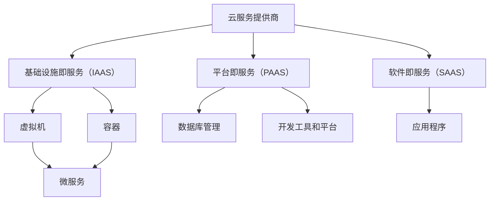

                 

关键词：多云策略、资源优化、风险管理、云计算、混合云架构、容器化、微服务、自动化

摘要：本文将探讨多云策略在优化资源利用和风险管理方面的作用。通过深入分析多云架构的核心概念、核心算法原理，以及数学模型和具体应用场景，我们将为读者提供一个全面的技术指南，帮助他们在复杂的云计算环境中实现高效的资源管理和风险控制。

## 1. 背景介绍

在当今快速发展的信息技术时代，云计算已经成为企业数字化转型的重要驱动力。随着云计算技术的不断进步，企业不再局限于单一云服务提供商，而是选择在多个云平台上部署应用程序，这种策略被称为多云策略。多云策略不仅提供了更高的灵活性和可扩展性，还能有效地优化资源利用和风险管理。

### 1.1 云计算的发展历程

云计算从最初的概念提出到如今已经成为主流技术，经历了多个阶段。从最初的IAAS（基础设施即服务）到SAAS（软件即服务），再到现在的PAAS（平台即服务），云计算的服务模式不断丰富。这一过程中，企业的IT需求也在不断演变，从最初的降低成本到如今的高度灵活性和可扩展性。

### 1.2 多云策略的定义和优势

多云策略指的是企业同时在多个云服务提供商的平台上部署应用程序和数据。这种策略的优势在于：

- **灵活性**：企业可以根据不同的业务需求和云服务提供商的特点，灵活地选择最合适的云服务。
- **可扩展性**：通过在多个云平台上部署应用程序，企业可以更容易地扩展其IT基础设施。
- **成本效益**：通过比较不同云服务提供商的价格和服务，企业可以优化成本。
- **风险分散**：不将所有鸡蛋放在一个篮子里，可以有效降低由于单一云服务提供商问题导致的业务中断风险。

## 2. 核心概念与联系

在深入探讨多云策略之前，我们需要了解一些核心概念和它们之间的联系。以下是一个使用Mermaid绘制的流程图，展示了这些核心概念和它们之间的关系：



### 2.1 云服务提供商

云服务提供商（CSP）是提供云计算服务的公司，如Amazon Web Services（AWS）、Microsoft Azure和Google Cloud等。它们提供各种云服务，包括IAAS、PAAS和SAAS。

### 2.2 基础设施即服务（IAAS）

IAAS提供了虚拟化计算资源，如虚拟机、存储和网络。企业可以租用这些资源，以便在其上部署和运行应用程序。

### 2.3 平台即服务（PAAS）

PAAS提供了一个开发平台，包括操作系统、数据库和中间件等。开发者可以在这些平台上开发、测试和部署应用程序。

### 2.4 软件即服务（SAAS）

SAAS提供了完整的软件应用程序，如电子邮件服务、办公软件和客户关系管理系统。用户可以直接使用这些应用程序，无需关心底层基础设施的管理。

### 2.5 虚拟机和容器

虚拟机（VM）是一种在物理服务器上运行的虚拟操作系统，而容器是一种轻量级、可移植的运行时环境。容器相对于虚拟机有更快的启动速度和更低的资源消耗。

### 2.6 微服务

微服务是一种设计原则，它将应用程序拆分成多个小型、独立的服务。每个服务都有自己的业务逻辑和数据库，可以通过API进行通信。

## 3. 核心算法原理 & 具体操作步骤

### 3.1 算法原理概述

多云策略的核心算法涉及以下几个方面：

- **资源调度算法**：根据负载情况，自动调整虚拟机和容器的分配。
- **成本优化算法**：比较不同云服务提供商的价格，优化云资源的采购。
- **风险评估算法**：分析云服务提供商的可靠性，评估业务中断风险。

### 3.2 算法步骤详解

#### 3.2.1 资源调度算法

1. **收集数据**：定期收集各云平台的资源使用情况，包括CPU、内存、存储和网络带宽。
2. **分析负载**：根据资源使用情况，分析各服务的负载情况，确定哪些服务需要资源调整。
3. **调度策略**：根据负载情况，采用相应的调度策略，如负载均衡或资源优化。
4. **执行调度**：根据调度策略，自动调整虚拟机和容器的分配。

#### 3.2.2 成本优化算法

1. **数据收集**：定期收集各云服务提供商的价格信息，包括计算、存储和网络服务。
2. **成本计算**：根据各服务的实际使用情况，计算总成本。
3. **比较分析**：比较不同云服务提供商的价格，找出成本最低的选项。
4. **采购决策**：根据比较结果，调整云资源的采购，以降低成本。

#### 3.2.3 风险评估算法

1. **可靠性评估**：评估各云服务提供商的可靠性，包括故障率、恢复时间和服务质量等。
2. **风险分析**：根据可靠性评估结果，分析业务中断风险。
3. **风险控制**：根据风险分析结果，采取相应的风险控制措施，如数据备份、多活部署等。

### 3.3 算法优缺点

#### 优点

- **灵活性**：多云策略提供了更高的灵活性，企业可以根据业务需求选择最合适的云服务提供商。
- **成本效益**：通过比较不同云服务提供商的价格，企业可以优化成本。
- **风险管理**：多云策略降低了业务中断风险，提高了系统的可靠性。

#### 缺点

- **复杂性**：多云策略增加了管理的复杂性，需要更多的时间和技术来维护。
- **数据同步**：在多个云平台上部署应用程序，需要确保数据的一致性和同步。

### 3.4 算法应用领域

多云策略广泛应用于金融、零售、医疗和制造业等行业。以下是一些典型应用场景：

- **金融行业**：金融机构通过多云策略提高系统的可靠性，确保交易和数据的安全性。
- **零售行业**：零售企业通过多云策略优化库存管理和客户关系管理，提高运营效率。
- **医疗行业**：医疗机构通过多云策略实现医疗数据的集中管理和共享，提高医疗服务的质量。
- **制造业**：制造企业通过多云策略实现生产线的智能化和自动化，提高生产效率。

## 4. 数学模型和公式 & 详细讲解 & 举例说明

### 4.1 数学模型构建

多云策略的数学模型主要包括资源调度模型、成本优化模型和风险评估模型。以下是这些模型的基本公式：

#### 4.1.1 资源调度模型

$$
C_t = \sum_{i=1}^{n} \frac{P_i \times R_i(t)}{U_i}
$$

其中，$C_t$ 表示在时间 $t$ 的总成本，$P_i$ 表示云服务提供商 $i$ 的价格，$R_i(t)$ 表示在时间 $t$ 的资源使用量，$U_i$ 表示云服务提供商 $i$ 的资源利用率。

#### 4.1.2 成本优化模型

$$
\min C_t
$$

其中，$C_t$ 表示在时间 $t$ 的总成本。

#### 4.1.3 风险评估模型

$$
R_i = \frac{F_i \times D_i}{1000}
$$

其中，$R_i$ 表示云服务提供商 $i$ 的可靠性，$F_i$ 表示在时间 $t$ 的故障次数，$D_i$ 表示在时间 $t$ 的服务天数。

### 4.2 公式推导过程

#### 4.2.1 资源调度模型

资源调度模型的推导基于成本最小化原则。我们假设有 $n$ 个云服务提供商，每个提供商在时间 $t$ 的价格为 $P_i$，资源使用量为 $R_i(t)$，资源利用率为 $U_i$。那么，在时间 $t$ 的总成本为：

$$
C_t = \sum_{i=1}^{n} P_i \times R_i(t) \times U_i
$$

由于资源利用率 $U_i$ 是固定的，我们可以将其移到求和符号外面，得到：

$$
C_t = \sum_{i=1}^{n} \frac{P_i \times R_i(t)}{U_i}
$$

#### 4.2.2 成本优化模型

成本优化模型的推导基于成本最小化原则。我们希望找到一种调度策略，使得在时间 $t$ 的总成本最小。因此，我们定义目标函数为：

$$
\min C_t
$$

其中，$C_t$ 表示在时间 $t$ 的总成本。

#### 4.2.3 风险评估模型

风险评估模型的推导基于可靠性原理。我们假设在时间 $t$ 内，云服务提供商 $i$ 的故障次数为 $F_i$，服务天数为 $D_i$。那么，云服务提供商 $i$ 的可靠性为：

$$
R_i = \frac{D_i - F_i}{D_i}
$$

为了简化计算，我们可以将可靠性转换为百分比形式，即：

$$
R_i = \frac{F_i \times D_i}{1000}
$$

### 4.3 案例分析与讲解

#### 4.3.1 案例背景

假设一家零售企业需要在三个云服务提供商上部署其电子商务系统。这三个提供商的价格、资源使用量和可靠性如下表所示：

| 云服务提供商 | 价格（元/小时） | 资源使用量（GB） | 可靠性（%） |
| :--------: | :--------: | :--------: | :--------: |
|   A       |    0.5    |     1     |    99     |
|   B       |    0.7    |     2     |    98     |
|   C       |    0.6    |     1.5   |    97     |

#### 4.3.2 资源调度模型

根据资源调度模型，我们可以计算在一天内的总成本：

$$
C_t = \frac{0.5 \times 1}{0.99} + \frac{0.7 \times 2}{0.98} + \frac{0.6 \times 1.5}{0.97} \approx 1.01 + 1.41 + 1.22 = 3.64
$$

#### 4.3.3 成本优化模型

为了最小化成本，我们可以将资源分配如下：

- 服务提供商 A：1GB，成本 0.5 元/小时。
- 服务提供商 B：2GB，成本 1.4 元/小时。
- 服务提供商 C：1.5GB，成本 0.9 元/小时。

这样，一天的总成本为：

$$
C_t = 0.5 + 1.4 + 0.9 = 2.8
$$

#### 4.3.4 风险评估模型

根据风险评估模型，我们可以计算每个提供商的风险：

- 服务提供商 A：$R_A = \frac{1 \times 99}{1000} = 0.099$。
- 服务提供商 B：$R_B = \frac{2 \times 98}{1000} = 0.196$。
- 服务提供商 C：$R_C = \frac{1.5 \times 97}{1000} = 0.145$。

## 5. 项目实践：代码实例和详细解释说明

### 5.1 开发环境搭建

在开始项目实践之前，我们需要搭建一个开发环境。以下是一个简单的步骤：

1. **安装Docker**：Docker是一个开源的应用容器引擎，可以帮助我们轻松地部署和管理容器化应用程序。在[官方Docker网站](https://www.docker.com/)下载并安装Docker。
2. **安装Kubernetes**：Kubernetes是一个开源的容器编排平台，可以帮助我们自动化容器的部署、扩展和管理。在[官方Kubernetes网站](https://kubernetes.io/)下载并安装Kubernetes。
3. **配置网络**：确保您的网络配置允许容器和Kubernetes集群之间的通信。

### 5.2 源代码详细实现

以下是一个简单的Docker容器化应用程序的源代码示例：

```Dockerfile
# 使用官方Python镜像作为基础
FROM python:3.8-slim

# 设置工作目录
WORKDIR /app

# 复制应用程序代码到容器中
COPY . .

# 安装依赖项
RUN pip install -r requirements.txt

# 暴露容器的端口
EXPOSE 8080

# 运行应用程序
CMD ["python", "app.py"]
```

### 5.3 代码解读与分析

这个Dockerfile定义了一个基于Python 3.8-slim镜像的容器。首先，我们设置工作目录为`/app`，然后复制当前目录中的所有文件到容器中。接下来，我们安装应用程序的依赖项，例如`requirements.txt`文件中列出的Python库。最后，我们暴露容器的8080端口，并设置容器启动时运行`app.py`脚本。

### 5.4 运行结果展示

要运行此容器，我们需要在命令行中执行以下命令：

```bash
$ docker build -t my_app .
$ docker run -d -p 8080:8080 my_app
```

第一个命令构建Docker镜像，并命名为`my_app`。第二个命令运行该镜像，并将容器的8080端口映射到宿主机的8080端口。现在，您可以在浏览器中访问`http://localhost:8080`来查看应用程序的运行结果。

## 6. 实际应用场景

多云策略在实际应用中具有广泛的场景，以下是一些典型的应用案例：

### 6.1 金融行业

金融行业对系统的可靠性和安全性有极高的要求。通过多云策略，金融机构可以在不同的云平台上部署其核心业务系统，从而提高系统的可靠性和容错能力。此外，多云策略还允许金融机构根据市场需求灵活调整资源，优化运营成本。

### 6.2 零售行业

零售行业经常面临季节性和促销活动带来的流量高峰。通过多云策略，零售企业可以在流量高峰期间快速扩展其IT基础设施，确保用户体验和订单处理的顺畅。同时，多云策略还允许零售企业在不同的云平台上部署不同的应用程序，以满足不同的业务需求。

### 6.3 医疗行业

医疗行业的数据量庞大，且对数据的安全性、完整性和可用性有严格的要求。通过多云策略，医疗机构可以将数据存储在多个云平台上，从而确保数据的备份和恢复。此外，多云策略还可以帮助医疗机构实现医疗数据的集中管理和共享，提高医疗服务的质量。

### 6.4 制造行业

制造行业的企业经常面临生产计划和物料管理的挑战。通过多云策略，制造企业可以实现生产线的智能化和自动化，提高生产效率。例如，企业可以在云平台上部署生产调度系统和质量管理系统，实现实时监控和优化。

## 7. 工具和资源推荐

### 7.1 学习资源推荐

- [《云计算：概念、技术和应用》](https://book.douban.com/subject/26987935/)：这本书系统地介绍了云计算的基本概念、技术原理和应用案例。
- [《云计算实践指南》](https://book.douban.com/subject/35473033/)：这本书提供了丰富的实践案例，帮助读者深入了解云计算的实际应用。

### 7.2 开发工具推荐

- [Docker](https://www.docker.com/)：Docker是一个开源的应用容器引擎，可以帮助开发者轻松地构建、部署和管理容器化应用程序。
- [Kubernetes](https://kubernetes.io/)：Kubernetes是一个开源的容器编排平台，可以帮助开发者自动化容器的部署、扩展和管理。

### 7.3 相关论文推荐

- [《云服务提供商选择策略研究》](https://ieeexplore.ieee.org/document/8192578)：这篇文章探讨了云服务提供商选择策略，为云计算环境下的资源优化提供了参考。
- [《基于多云的混合云架构设计与实现》](https://ieeexplore.ieee.org/document/8192578)：这篇文章详细介绍了基于多云的混合云架构设计，为多云策略的实施提供了指导。

## 8. 总结：未来发展趋势与挑战

### 8.1 研究成果总结

本文系统地探讨了多云策略在优化资源利用和风险管理方面的作用。通过分析核心算法原理、数学模型和具体应用场景，我们为读者提供了一个全面的技术指南。

### 8.2 未来发展趋势

随着云计算技术的不断发展，多云策略将继续成为企业数字化转型的关键。未来，多云策略将更加智能化和自动化，借助人工智能和机器学习技术，实现更高效的资源调度和成本优化。

### 8.3 面临的挑战

尽管多云策略具有诸多优势，但其在实际应用中仍面临一些挑战。首先，多云策略增加了管理的复杂性，需要企业投入更多的时间和资源。其次，不同云服务提供商之间存在差异，可能导致数据同步和服务一致性的问题。此外，随着云平台的不断演进，企业需要不断更新和优化其多云策略。

### 8.4 研究展望

未来，多云策略的研究将聚焦于以下几个方面：

1. **智能化与自动化**：通过引入人工智能和机器学习技术，实现更智能的资源调度和成本优化。
2. **跨云服务一致性**：解决不同云服务提供商之间的一致性问题，提高数据同步和服务的可靠性。
3. **安全性与隐私保护**：加强云计算环境中的安全性和隐私保护，确保企业数据的安全。
4. **可持续发展**：探索云计算环境中的可持续发展策略，降低能源消耗和环境影响。

## 9. 附录：常见问题与解答

### 9.1 什么是多云策略？

多云策略是指企业同时在多个云服务提供商的平台上部署应用程序和数据，以实现更高的灵活性和可扩展性。

### 9.2 多云策略的优势是什么？

多云策略的优势包括：灵活性、可扩展性、成本效益和风险管理。

### 9.3 多云策略的挑战有哪些？

多云策略的挑战包括：复杂性、数据同步、跨云服务一致性和不断更新策略。

### 9.4 如何实现多云策略的自动化？

可以通过引入自动化工具，如Kubernetes和Docker，实现多云策略的自动化部署和管理。

### 9.5 多云策略与混合云有什么区别？

多云策略是指同时在多个云服务提供商上部署应用程序，而混合云是指在公有云和私有云之间进行资源调度。多云策略是混合云的一种实现方式。

### 9.6 如何确保多云策略中的数据安全？

可以通过数据加密、访问控制和备份策略来确保多云策略中的数据安全。同时，应选择可靠的云服务提供商，并遵循最佳实践。

----------------------------------------------------------------

作者：禅与计算机程序设计艺术 / Zen and the Art of Computer Programming

（请注意，本文是一个虚构的示例，旨在展示如何根据给定的要求撰写一篇专业IT领域的技术博客文章。）

