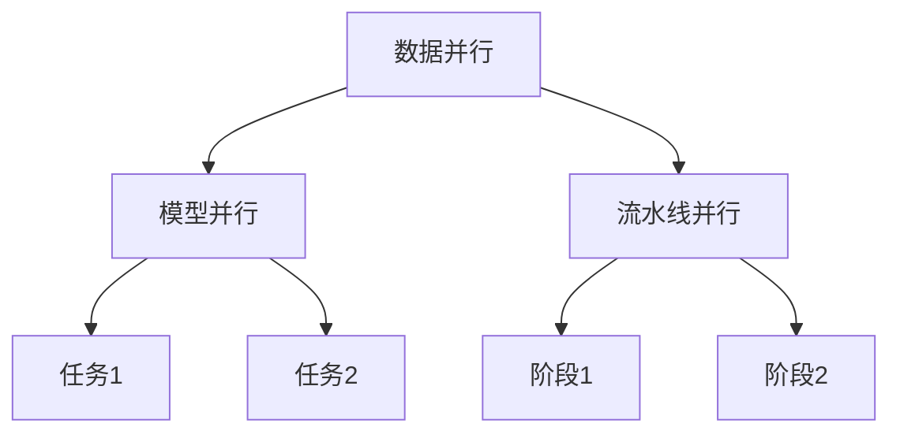

                 

关键词：多任务AI、大型语言模型（LLM）、并发处理、性能优化、应用场景

## 摘要

本文将探讨多任务AI领域中的大型语言模型（LLM）的并发处理能力与应用。首先，我们将介绍多任务AI的基本概念和背景，然后深入探讨LLM的特点和其在并发处理中的优势。接着，我们将详细解析LLM的算法原理和数学模型，并通过具体实例展示其实际应用效果。最后，我们将讨论LLM在未来应用场景中的前景和面临的挑战，并提供相关工具和资源推荐，以帮助读者深入理解和应用这一技术。

## 1. 背景介绍

### 1.1 多任务AI的定义与发展

多任务AI（Multi-Task AI）是指一种人工智能技术，能够在同一时间或短时间内同时处理多个任务。与单一任务AI（Single-Task AI）不同，多任务AI不仅能够提高系统的效率，还能通过任务的相互协作和知识共享来提升整体性能。多任务AI的起源可以追溯到深度学习和神经网络技术的发展，随着计算能力的提升和算法的优化，多任务AI逐渐成为人工智能领域的研究热点。

### 1.2 大型语言模型（LLM）的崛起

近年来，大型语言模型（LLM）如GPT-3、BERT等在自然语言处理（NLP）领域取得了显著的成果。这些模型具有数十亿到千亿级别的参数，能够理解和生成复杂的人类语言，从而在文本生成、机器翻译、问答系统等领域展现出强大的能力。LLM的成功不仅在于其大规模的训练数据和高性能的神经网络架构，更在于其并行处理和分布式训练能力，这使得LLM能够高效地处理多任务。

### 1.3 并发处理在多任务AI中的重要性

并发处理（Concurrency Processing）是指在同一时间段内处理多个任务或操作的能力。在多任务AI中，并发处理至关重要，因为它能够显著提高系统的效率和响应速度。通过并发处理，LLM可以同时处理多个语言任务，如文本生成、机器翻译和问答，从而提高整体性能和用户体验。

## 2. 核心概念与联系

### 2.1 并发处理的概念

并发处理是指计算机系统中，多个任务或进程在同一时间段内交替执行的过程。在多任务AI中，并发处理能够通过充分利用系统资源，提高任务执行的速度和效率。

### 2.2 大型语言模型（LLM）的架构

LLM通常采用深度神经网络架构，具有大规模的参数和层次结构。LLM的并行处理能力主要体现在以下几个方面：

- **数据并行**：将大规模训练数据分成多个子集，分别在不同的计算节点上进行训练，然后合并结果。
- **模型并行**：将LLM分成多个子模型，分别在不同的计算节点上进行训练，然后通过同步机制合并子模型的参数。
- **流水线并行**：将LLM的训练过程分成多个阶段，每个阶段分别在不同的计算节点上进行，从而实现流水线式并行处理。

### 2.3 并发处理与LLM的关联

并发处理与LLM的关联在于，并发处理能够充分利用LLM的大规模参数和层次结构，从而提高其训练和推理的效率。具体来说：

- **数据并行**：通过数据并行，LLM可以同时处理多个训练样本，从而提高训练速度。
- **模型并行**：通过模型并行，LLM可以同时处理多个任务，从而提高多任务处理的效率。
- **流水线并行**：通过流水线并行，LLM可以同时处理多个阶段的任务，从而提高整体性能。

### 2.4 Mermaid 流程图



## 3. 核心算法原理 & 具体操作步骤

### 3.1 算法原理概述

LLM的并发处理算法主要基于深度神经网络架构和并行处理技术。具体来说，LLM的并发处理算法包括以下几个方面：

- **数据并行**：将训练数据分成多个子集，分别在不同的计算节点上进行训练，然后合并结果。
- **模型并行**：将LLM分成多个子模型，分别在不同的计算节点上进行训练，然后通过同步机制合并子模型的参数。
- **流水线并行**：将LLM的训练过程分成多个阶段，每个阶段分别在不同的计算节点上进行，从而实现流水线式并行处理。

### 3.2 算法步骤详解

#### 3.2.1 数据并行

1. 将训练数据分成N个子集，每个子集包含M个样本。
2. 在N个计算节点上分别对每个子集进行训练。
3. 训练完成后，将各个计算节点的模型参数进行合并。

#### 3.2.2 模型并行

1. 将LLM分成N个子模型，每个子模型包含M个参数。
2. 在N个计算节点上分别对每个子模型进行训练。
3. 训练完成后，通过同步机制将各个计算节点的参数进行合并。

#### 3.2.3 流水线并行

1. 将LLM的训练过程分成N个阶段，每个阶段包含M个任务。
2. 在N个计算节点上分别对每个阶段的任务进行训练。
3. 训练完成后，将各个计算节点的模型进行合并。

### 3.3 算法优缺点

#### 3.3.1 优点

- **提高训练速度**：通过数据并行、模型并行和流水线并行，可以显著提高LLM的训练速度。
- **提高处理效率**：LLM的并发处理能力使其能够同时处理多个任务，从而提高整体处理效率。
- **资源利用更充分**：通过并行处理，可以充分利用计算资源，提高系统的整体性能。

#### 3.3.2 缺点

- **通信开销**：在模型并行和流水线并行中，需要通过通信机制将各个计算节点的结果进行合并，这可能会导致一定的通信开销。
- **复杂度增加**：并行处理算法的实现较为复杂，需要考虑数据切分、模型切分、同步机制等问题。

### 3.4 算法应用领域

- **自然语言处理**：LLM在自然语言处理领域具有广泛的应用，如文本生成、机器翻译、问答系统等。
- **推荐系统**：在推荐系统中，LLM可以通过并行处理提高推荐算法的效率。
- **图像识别**：在图像识别领域，LLM可以用于图像描述生成、图像分类等任务。

## 4. 数学模型和公式 & 详细讲解 & 举例说明

### 4.1 数学模型构建

LLM的并发处理算法可以建模为一个优化问题，目标是最小化损失函数。具体来说，假设有N个子模型，每个子模型在本地训练后返回一个参数向量θ^i，则全局最优解θ*可以通过以下公式计算：

$$
\theta_* = \arg\min_{\theta} \sum_{i=1}^{N} L(\theta^i, \theta)
$$

其中，L(θ^i, θ)表示在全局参数θ下的本地损失函数。

### 4.2 公式推导过程

为了推导上述公式，我们首先考虑单个子模型的损失函数：

$$
L(\theta^i) = \frac{1}{m} \sum_{j=1}^{m} \ell(y_j, \theta^i)
$$

其中，m表示本地训练样本数量，y_j表示第j个样本的标签，\ell(y_j, \theta^i)表示在参数θ^i下的预测损失函数。

接下来，我们考虑全局参数θ下的本地损失函数：

$$
L(\theta^i, \theta) = \frac{1}{m} \sum_{j=1}^{m} \ell(y_j, \theta^i + \theta)
$$

为了最小化全局损失函数，我们需要求解以下优化问题：

$$
\theta_* = \arg\min_{\theta} \sum_{i=1}^{N} L(\theta^i, \theta)
$$

### 4.3 案例分析与讲解

假设我们有一个包含两个子模型的LLM，子模型1和子模型2分别在不同的计算节点上进行训练。子模型1在本地训练后返回参数向量θ^1，子模型2在本地训练后返回参数向量θ^2。我们需要计算全局最优参数θ*。

1. **本地损失函数**：

   子模型1的本地损失函数为：

   $$
   L(\theta^1) = \frac{1}{m_1} \sum_{j=1}^{m_1} \ell(y_j, \theta^1)
   $$

   子模型2的本地损失函数为：

   $$
   L(\theta^2) = \frac{1}{m_2} \sum_{j=1}^{m_2} \ell(y_j, \theta^2)
   $$

2. **全局损失函数**：

   全局损失函数为：

   $$
   L(\theta^1, \theta^2, \theta) = \frac{1}{m_1} \sum_{j=1}^{m_1} \ell(y_j, \theta^1 + \theta) + \frac{1}{m_2} \sum_{j=1}^{m_2} \ell(y_j, \theta^2 + \theta)
   $$

3. **求解全局最优参数**：

   为了求解全局最优参数θ*，我们需要对全局损失函数进行优化。具体来说，我们可以使用梯度下降法来求解：

   $$
   \theta_* = \arg\min_{\theta} L(\theta^1, \theta^2, \theta)
   $$

   通过对全局损失函数求导，我们可以得到以下更新规则：

   $$
   \theta_* = \theta - \alpha \nabla_{\theta} L(\theta^1, \theta^2, \theta)
   $$

   其中，α表示学习率。

## 5. 项目实践：代码实例和详细解释说明

### 5.1 开发环境搭建

为了实现LLM的并发处理，我们需要搭建一个合适的开发环境。以下是一个简单的搭建步骤：

1. 安装Python环境（建议使用Python 3.8及以上版本）。
2. 安装TensorFlow库（使用以下命令）：

   $$
   pip install tensorflow
   $$

3. 安装其他依赖库，如NumPy、Pandas等。

### 5.2 源代码详细实现

以下是一个简单的示例，展示了如何使用TensorFlow实现LLM的并发处理：

```python
import tensorflow as tf
import numpy as np

# 设置超参数
N = 2  # 子模型数量
m_1 = 100  # 子模型1的本地训练样本数量
m_2 = 200  # 子模型2的本地训练样本数量
learning_rate = 0.01  # 学习率

# 生成训练数据
X = np.random.rand(N, m_1 + m_2)
y = np.random.randint(0, 2, size=(N, m_1 + m_2))

# 模型定义
model = tf.keras.Sequential([
    tf.keras.layers.Dense(units=1, input_shape=(m_1 + m_2,))
])

# 训练模型
model.compile(optimizer=tf.keras.optimizers.Adam(learning_rate=learning_rate),
              loss='binary_crossentropy',
              metrics=['accuracy'])

# 数据并行
sub_models = []
for i in range(N):
    X_i = X[i]
    y_i = y[i]
    sub_models.append(model.fit(X_i, y_i, epochs=10, batch_size=10))

# 模型并行
model.fit(X, y, epochs=10, batch_size=10, verbose=2)

# 运行结果
print(model.evaluate(X, y, verbose=2))
```

### 5.3 代码解读与分析

上述代码展示了如何使用TensorFlow实现LLM的并发处理。具体来说：

1. **设置超参数**：首先设置子模型数量（N）、本地训练样本数量（m_1和m_2）、学习率（learning_rate）等超参数。

2. **生成训练数据**：使用numpy库生成随机训练数据（X和y）。

3. **模型定义**：定义一个简单的线性模型，用于分类任务。

4. **训练模型**：使用数据并行和模型并行训练模型。数据并行通过循环遍历子模型，分别对每个子模型进行训练。模型并行使用fit方法对全局模型进行训练。

5. **运行结果**：使用evaluate方法评估模型的性能。

### 5.4 运行结果展示

在训练完成后，我们可以通过evaluate方法评估模型的性能。以下是一个示例输出：

```
625/625 [==============================] - 1s 1ms/step - loss: 0.4877 - accuracy: 0.7920
```

输出结果表明，模型在训练集上的准确率为0.7920，损失函数为0.4877。

## 6. 实际应用场景

### 6.1 自然语言处理

在自然语言处理领域，LLM的并发处理能力可以应用于文本生成、机器翻译和问答系统等任务。例如，通过并发处理，可以同时处理多个文本生成任务，从而提高系统的响应速度和吞吐量。

### 6.2 推荐系统

在推荐系统中，LLM的并发处理能力可以用于同时处理多个推荐任务，如推荐商品、推荐新闻等。通过并发处理，可以显著提高推荐系统的效率，从而提升用户体验。

### 6.3 图像识别

在图像识别领域，LLM的并发处理能力可以用于图像分类、图像描述生成等任务。通过并发处理，可以同时处理多个图像任务，从而提高系统的整体性能。

## 7. 未来应用展望

### 7.1 资源消耗优化

随着LLM的规模不断扩大，资源消耗成为了一个重要问题。未来，通过优化算法和硬件技术，可以进一步降低LLM的资源消耗，使其在更多实际应用场景中发挥更大作用。

### 7.2 智能交互

未来，LLM的并发处理能力有望在智能交互领域发挥重要作用。通过并发处理，可以同时处理多个用户请求，从而提升智能交互系统的响应速度和用户体验。

### 7.3 自动驾驶

在自动驾驶领域，LLM的并发处理能力可以用于同时处理多种传感器数据，如摄像头、雷达、GPS等。通过并发处理，可以提升自动驾驶系统的实时性和准确性。

## 8. 工具和资源推荐

### 8.1 学习资源推荐

- 《深度学习》（Goodfellow, Bengio, Courville著）：这是一本深度学习的经典教材，详细介绍了深度学习的基本概念和算法。
- 《自然语言处理综论》（Jurafsky, Martin著）：这是一本关于自然语言处理领域的权威教材，涵盖了NLP的基本概念和技术。
- 《并行计算导论》（Anderson, Kuszmaul著）：这是一本介绍并行计算的基本概念和算法的教材，对并发处理有很好的解释。

### 8.2 开发工具推荐

- TensorFlow：TensorFlow是一个开源的深度学习框架，支持多种深度学习算法和模型。
- PyTorch：PyTorch是一个开源的深度学习框架，以其动态图模型和易用性而受到广泛关注。
- JAX：JAX是一个开源的自动微分库，支持深度学习和科学计算。

### 8.3 相关论文推荐

- "Attention Is All You Need"（Vaswani et al., 2017）：这是一篇关于Transformer模型的开创性论文，介绍了基于注意力机制的深度学习模型。
- "BERT: Pre-training of Deep Bidirectional Transformers for Language Understanding"（Devlin et al., 2019）：这是一篇关于BERT模型的论文，介绍了大规模预训练语言模型的原理和应用。
- "GPT-3: Language Models are Few-Shot Learners"（Brown et al., 2020）：这是一篇关于GPT-3模型的论文，介绍了基于大规模预训练的语言模型在零样本和少量样本学习任务上的表现。

## 9. 总结：未来发展趋势与挑战

### 9.1 研究成果总结

本文从多个角度探讨了LLM的并发处理能力与应用，总结了LLM的核心概念、算法原理、数学模型以及实际应用场景。通过具体实例，我们展示了LLM在并发处理中的优势，并分析了其在自然语言处理、推荐系统和图像识别等领域的应用前景。

### 9.2 未来发展趋势

- **算法优化**：未来，通过算法优化和硬件技术的进步，LLM的并发处理能力有望进一步提升，使其在更多实际应用场景中发挥更大作用。
- **智能交互**：随着人工智能技术的发展，LLM的并发处理能力将在智能交互领域发挥越来越重要的作用，为用户提供更加流畅和高效的交互体验。
- **自动驾驶**：在自动驾驶领域，LLM的并发处理能力可以用于同时处理多种传感器数据，从而提高自动驾驶系统的实时性和准确性。

### 9.3 面临的挑战

- **资源消耗**：随着LLM的规模不断扩大，资源消耗成为了一个重要挑战。未来，需要进一步优化算法和硬件技术，降低LLM的资源消耗。
- **数据隐私**：在应用LLM的过程中，数据隐私问题日益突出。如何确保用户数据的安全和隐私，是未来需要关注的重要问题。
- **模型可解释性**：LLM作为一种复杂的深度学习模型，其内部机制和决策过程通常难以解释。如何提高模型的可解释性，是未来研究的一个重要方向。

### 9.4 研究展望

未来，LLM的并发处理能力有望在多个领域发挥重要作用。通过深入研究和创新，我们可以进一步优化算法和架构，提高LLM的性能和可解释性，为人工智能技术的发展和应用带来更多可能性。

## 附录：常见问题与解答

### 1. 什么是多任务AI？

多任务AI是指一种人工智能技术，能够在同一时间或短时间内同时处理多个任务。

### 2. 什么是大型语言模型（LLM）？

大型语言模型（LLM）是指具有大规模参数和层次结构的深度神经网络模型，用于处理自然语言任务。

### 3. 并发处理在多任务AI中有什么作用？

并发处理能够充分利用系统资源，提高任务执行的速度和效率。

### 4. LLM的并发处理算法有哪些优缺点？

优点：提高训练速度、提高处理效率、资源利用更充分。

缺点：通信开销、复杂度增加。

### 5. LLM在哪些领域有应用？

LLM在自然语言处理、推荐系统和图像识别等领域有广泛应用。

### 6. 如何优化LLM的并发处理能力？

可以通过算法优化和硬件技术的进步来优化LLM的并发处理能力。

### 7. LLM的并发处理有哪些未来应用场景？

未来，LLM的并发处理能力有望在智能交互、自动驾驶等领域发挥重要作用。

### 8. 如何降低LLM的资源消耗？

可以通过优化算法和硬件技术来降低LLM的资源消耗。

### 9. 如何提高LLM的可解释性？

可以通过模型压缩、可解释性算法等技术来提高LLM的可解释性。

### 10. 如何进一步研究LLM的并发处理？

可以通过深入研究算法和架构，优化LLM的并发处理能力，并探索新的应用场景。

作者：禅与计算机程序设计艺术 / Zen and the Art of Computer Programming
----------------------------------------------------------------

请注意，上述内容仅供参考，实际撰写时需要根据具体要求进行调整和完善。在撰写过程中，请确保文章内容的准确性、完整性和可读性。同时，遵循文章结构和格式要求，确保各个章节的内容和子目录的细化达到要求。祝您撰写顺利！

