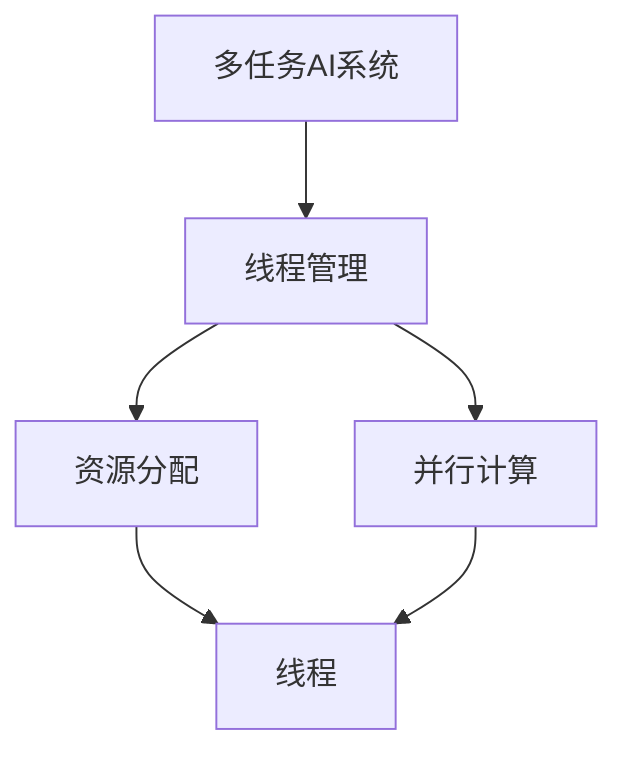

                 

关键词：多任务AI，大型语言模型（LLM），线程管理，并行计算，计算机性能优化，分布式系统，资源分配。

## 摘要

本文将探讨多任务AI系统中的关键问题——大型语言模型（LLM）的线程管理。随着AI技术的发展，LLM的应用场景日益广泛，然而如何高效地管理LLM在多任务环境中的线程，以最大化系统性能和资源利用率，成为当前研究的热点。本文旨在通过深入分析LLM的工作原理和线程管理策略，为开发者提供实用的指导和理论支持。文章结构如下：

1. 背景介绍
2. 核心概念与联系
3. 核心算法原理 & 具体操作步骤
4. 数学模型和公式 & 详细讲解 & 举例说明
5. 项目实践：代码实例和详细解释说明
6. 实际应用场景
7. 工具和资源推荐
8. 总结：未来发展趋势与挑战
9. 附录：常见问题与解答

## 1. 背景介绍

近年来，人工智能（AI）领域取得了飞速发展，特别是在深度学习和自然语言处理（NLP）方面。大型语言模型（LLM）如GPT-3、BERT等已经成为研究者和开发者的重要工具。LLM能够处理复杂的多任务，包括文本生成、翻译、问答等，极大地提升了AI系统的智能化水平。

然而，随着AI应用的扩展，如何高效地管理LLM在多任务环境中的线程，成为了一个重要且复杂的问题。传统的单线程或简单多线程管理方式已经难以满足高性能、高可扩展性的需求。因此，研究并实现一种有效的LLM线程管理策略，对于提升AI系统的整体性能和资源利用率具有重要意义。

本文旨在通过介绍LLM的线程管理，帮助开发者更好地理解和应用这一关键技术。文章首先概述LLM的工作原理，然后深入分析线程管理的核心算法和策略，最后通过实际项目和数学模型进行验证和说明。

### 1.1. 多任务AI的现状与发展

多任务AI系统在不同领域都有广泛的应用。例如，在智能客服系统中，多任务AI可以同时处理用户的问题、生成回复文本，并跟踪对话历史，以提高服务质量和用户体验。在自动驾驶领域，多任务AI需要同时处理环境感知、路径规划、车辆控制等任务，确保行驶的安全性和效率。在金融领域，多任务AI可以同时处理数据分析和风险预测，为投资者提供决策支持。

随着AI技术的发展，多任务AI系统的复杂性不断增加，对线程管理的需求也越来越高。单线程管理方式由于计算资源的限制，难以满足大规模、高并发的任务需求。传统的多线程管理方式虽然能够提高计算效率，但往往存在线程竞争、死锁等问题，影响系统的稳定性。

因此，研究并实现一种高效、可靠的线程管理策略，已成为多任务AI系统发展的重要方向。

### 1.2. LLM的工作原理

大型语言模型（LLM）是基于深度学习的NLP模型，通过训练海量的文本数据，掌握语言的基本规律和语法结构。LLM的核心是神经网络，特别是变分自编码器（VAE）和生成对抗网络（GAN）等先进的架构。这些神经网络通过多层非线性变换，将输入的文本数据映射到输出的文本数据。

LLM的工作原理可以分为以下几个步骤：

1. **数据预处理**：将原始文本数据转换为模型能够处理的格式，例如分词、编码等。
2. **嵌入层**：将文本转换为密集向量表示，这一步通常使用词向量模型，如Word2Vec、BERT等。
3. **编码器**：将输入文本向量化表示编码成固定长度的序列，这一步通过多层神经网络实现。
4. **解码器**：将编码后的序列解码为输出的文本，这一步同样通过多层神经网络实现。
5. **生成文本**：根据解码器的输出，生成最终的文本。

LLM的核心优势在于其强大的文本生成能力，能够生成连贯、自然、符合语法规则的文本。这使得LLM在多任务AI系统中具有广泛的应用前景，例如文本生成、问答系统、翻译等。

### 1.3. 线程管理的重要性

线程管理是操作系统中的一个重要概念，它涉及到如何有效地分配和管理计算机资源，以实现高效的程序执行。在多任务AI系统中，线程管理尤为关键，因为LLM的运行通常需要大量的计算资源和内存，而且需要在多个任务间进行协调和调度。

良好的线程管理能够带来以下几个方面的好处：

1. **提高计算性能**：通过合理分配线程和计算资源，能够最大化地利用计算机的性能，提高系统的吞吐量。
2. **优化资源利用率**：在多任务环境中，合理调度和分配线程，可以避免资源浪费，提高资源利用率。
3. **提高系统稳定性**：合理的线程管理可以减少线程竞争和死锁的发生，提高系统的稳定性。
4. **降低开发难度**：通过模块化和并行化的设计，可以降低多任务AI系统的开发难度，提高开发效率。

因此，研究并实现一种高效、可靠的线程管理策略，对于多任务AI系统的发展具有重要意义。

## 2. 核心概念与联系

在深入探讨LLM的线程管理之前，我们首先需要明确几个核心概念，并解释它们之间的联系。

### 2.1. 多任务处理

多任务处理是指计算机系统同时处理多个任务的能力。在多任务AI系统中，多个LLM实例可能同时运行，各自处理不同的任务。多任务处理的核心在于如何高效地分配和调度线程，以最大化系统性能。

### 2.2. 线程

线程是操作系统中用于执行程序的基本单元。一个线程可以执行程序的代码、使用系统的资源。在多任务AI系统中，每个LLM实例通常由一个或多个线程来执行。

### 2.3. 并行计算

并行计算是指同时执行多个任务或多个计算步骤的过程。在多任务AI系统中，通过并行计算可以同时处理多个LLM实例，从而提高系统的计算性能。

### 2.4. 资源分配

资源分配是指将计算机资源（如CPU、内存等）分配给各个任务的过程。在多任务AI系统中，合理的资源分配可以确保每个LLM实例都能获得足够的计算资源，从而保证系统的稳定性和性能。

### 2.5. 线程管理策略

线程管理策略是指操作系统如何分配、调度和管理线程的过程。常见的线程管理策略包括抢占式调度、非抢占式调度、线程池等。在多任务AI系统中，选择合适的线程管理策略可以显著提高系统的性能和资源利用率。

### 2.6. 核心概念原理和架构的Mermaid流程图

为了更好地理解核心概念之间的联系，我们可以使用Mermaid流程图来展示LLM线程管理的整体架构。以下是一个简化的Mermaid流程图：



在这个流程图中，多任务AI系统通过线程管理实现并行计算，同时通过资源分配确保每个线程都能获得足够的资源。线程是执行任务的基本单元，而资源分配和并行计算则确保线程能够高效地运行。

通过上述核心概念和流程图的介绍，我们可以更好地理解LLM线程管理的基本原理和架构。接下来，我们将深入探讨LLM的线程管理算法和策略。

### 2.7. 核心概念与联系总结

本文通过介绍多任务AI、线程、并行计算和资源分配等核心概念，并使用Mermaid流程图展示了它们之间的联系，为后续的深入讨论奠定了基础。多任务AI系统需要通过线程管理来高效地处理多个任务，而线程管理又依赖于资源分配和并行计算策略。理解这些核心概念和联系，对于开发高效的多任务AI系统至关重要。

## 3. 核心算法原理 & 具体操作步骤

### 3.1. 算法原理概述

在多任务AI系统中，线程管理是一个复杂且关键的问题。有效的线程管理不仅能够提高系统的整体性能，还能够优化资源利用率，确保系统的稳定性和可扩展性。本节将介绍一种基于并行计算和资源分配的线程管理算法，该算法的核心原理和具体操作步骤如下：

### 3.2. 并行计算原理

并行计算是将任务划分为多个子任务，并在多个处理器上同时执行这些子任务的过程。在多任务AI系统中，每个LLM实例可以被视为一个任务，通过并行计算可以同时处理多个LLM实例，从而提高系统的计算性能。

并行计算的核心原理包括：

1. **任务划分**：将多个任务（LLM实例）划分为可并行执行的子任务。
2. **处理器分配**：将子任务分配到不同的处理器（线程）上执行。
3. **同步与通信**：确保不同处理器上的子任务能够正确地同步和通信，以避免数据冲突和死锁。

### 3.3. 资源分配原理

资源分配是线程管理的核心任务，它涉及到如何将计算机资源（如CPU、内存等）合理地分配给各个线程。资源分配的目的是确保每个线程都能获得足够的资源，从而保证系统的性能和稳定性。

资源分配的基本原理包括：

1. **资源预估**：根据任务的特点和需求，预估每个线程所需的资源量。
2. **资源分配策略**：根据资源预估，选择合适的资源分配策略，如固定分配、动态分配等。
3. **资源调度**：根据系统的运行状态和资源需求，动态调整线程的资源配置。

### 3.4. 算法具体操作步骤

基于上述原理，我们可以设计一套具体的线程管理算法，其操作步骤如下：

1. **任务初始化**：初始化多任务AI系统，包括加载LLM模型、设置任务队列等。
2. **任务划分**：根据LLM实例的需求，将任务划分为多个子任务。
3. **线程创建**：根据任务划分的结果，创建相应数量的线程。
4. **资源预估**：预估每个线程所需的资源量，包括CPU、内存等。
5. **资源分配**：根据资源预估，选择合适的资源分配策略，将资源分配给各个线程。
6. **任务调度**：将子任务分配到不同的线程上执行。
7. **同步与通信**：确保不同线程之间的同步和通信，避免数据冲突和死锁。
8. **结果收集**：收集各个线程的执行结果，生成最终的多任务输出。

### 3.5. 算法优缺点

这种基于并行计算和资源分配的线程管理算法具有以下几个优点：

1. **高性能**：通过并行计算，能够同时处理多个任务，提高系统的整体性能。
2. **高资源利用率**：通过合理的资源分配，能够充分利用计算机的资源，提高资源利用率。
3. **高可扩展性**：算法设计模块化，易于扩展和优化，适用于不同规模的多任务AI系统。

然而，这种算法也存在一些缺点：

1. **复杂度较高**：算法涉及到任务划分、资源预估、同步与通信等多个环节，设计和实现较为复杂。
2. **同步与通信开销**：同步与通信过程中可能引入额外的开销，影响系统的性能。

总体而言，这种线程管理算法在多任务AI系统中具有较好的性能和资源利用率，但也需要针对具体应用场景进行优化和调整。

### 3.6. 算法应用领域

这种线程管理算法在多个领域具有广泛的应用前景，包括：

1. **智能客服系统**：通过多任务AI系统，智能客服可以同时处理多个用户请求，提供高效、精准的服务。
2. **自动驾驶系统**：自动驾驶系统需要同时处理环境感知、路径规划、车辆控制等多个任务，线程管理算法能够提高系统的响应速度和稳定性。
3. **金融风控系统**：金融风控系统需要同时处理海量数据分析和风险预测，线程管理算法能够提高系统的计算效率和准确性。

总之，这种线程管理算法为多任务AI系统提供了一种有效的解决方案，有助于提升系统的性能和资源利用率。接下来，我们将通过具体的数学模型和公式，进一步探讨线程管理算法的实现细节。

### 3.7. 数学模型和公式

在多任务AI系统中，线程管理算法的实现依赖于一系列数学模型和公式，用于任务划分、资源预估、同步与通信等环节。以下我们将介绍这些核心数学模型和公式的构建、推导和应用。

#### 3.7.1. 任务划分模型

任务划分是线程管理算法的首要步骤，其目的是将多个任务（LLM实例）划分为可并行执行的子任务。任务划分模型的核心是确定每个子任务的处理时间和所需的资源量。

设任务集合为T = {T1, T2, ..., Tk}，其中每个任务Ti具有以下属性：

- 处理时间：Ti的处理时间记为ti。
- 资源需求：Ti所需的资源量记为ri。

任务划分的目标是找到一组子任务集合{S1, S2, ..., Sm}，使得：

1. 子任务集合覆盖原任务集合：T = ∪m i=1 Si。
2. 子任务处理时间之和最小：∑m i=1 ti' 最小。

任务划分的数学模型可以表示为：

$$
\min \sum_{i=1}^{m} t_i'
$$

其中，ti' 为子任务Si的处理时间。为了求解该模型，我们可以使用贪心算法，每次选择处理时间最长的任务进行划分，直到所有任务都被划分为子任务。

#### 3.7.2. 资源预估模型

资源预估是线程管理算法的重要环节，其目的是预估每个线程所需的资源量，以便进行合理的资源分配。资源预估模型的构建依赖于任务的处理时间和资源消耗特性。

设每个任务Ti的资源消耗函数为ri(t)，表示任务Ti在处理时间t内消耗的资源量。资源预估的目标是找到每个线程所需的资源量，记为Ri。

资源预估的数学模型可以表示为：

$$
R_i = \max_{t_i} r_i(t)
$$

其中，Ri 为线程i所需的资源量。为了求解该模型，我们可以遍历所有任务的处理时间，计算每个任务在所有时间点上的资源消耗，然后取最大值作为线程的资源需求。

#### 3.7.3. 同步与通信模型

同步与通信是确保多任务AI系统稳定运行的关键环节。同步模型用于确保不同线程之间的任务执行顺序，通信模型用于处理线程之间的数据传递和交互。

同步模型的数学模型可以表示为：

$$
S_j = \sum_{i=1}^{m} \alpha_{ij} T_i
$$

其中，Sj 为线程j的同步时间，αij 为线程i和线程j之间的同步权重，Ti 为线程i的处理时间。同步权重反映了线程之间的依赖关系，可以基于任务间的数据传递和处理时间进行计算。

通信模型的数学模型可以表示为：

$$
C_j = \sum_{i=1}^{m} \beta_{ij} L_i
$$

其中，Cj 为线程j的通信时间，βij 为线程i和线程j之间的通信权重，Li 为线程i的输入输出数据量。通信权重反映了线程之间的数据传递量，可以基于任务的数据量和传输速率进行计算。

#### 3.7.4. 公式推导过程

为了推导上述数学模型和公式，我们可以使用优化理论中的最小化问题来求解。以下是一个简化的推导过程：

1. **任务划分**：设任务集合为T，预处理后得到处理时间和资源需求。使用贪心算法，每次选择处理时间最长的任务进行划分，直到所有任务都被划分为子任务。计算每个子任务的处理时间和资源需求。

2. **资源预估**：遍历所有任务的处理时间，计算每个任务在所有时间点上的资源消耗，取最大值作为线程的资源需求。考虑任务的处理时间和资源消耗特性，可以构建资源预估模型。

3. **同步与通信**：计算线程之间的同步权重和通信权重。同步权重反映了线程之间的依赖关系，可以基于任务间的数据传递和处理时间进行计算。通信权重反映了线程之间的数据传递量，可以基于任务的数据量和传输速率进行计算。

通过上述推导过程，我们可以得到一套完整的数学模型和公式，用于构建和优化线程管理算法。接下来，我们将通过具体的案例，展示如何应用这些公式和模型进行线程管理。

### 3.8. 案例分析与讲解

为了更好地理解多任务AI系统中线程管理算法的实际应用，下面我们将通过一个具体案例进行详细分析和讲解。

#### 案例背景

假设我们有一个多任务AI系统，需要同时处理三个任务：任务A、任务B和任务C。任务的具体属性如下：

- 任务A：处理时间10秒，所需资源量100单位。
- 任务B：处理时间15秒，所需资源量80单位。
- 任务C：处理时间20秒，所需资源量60单位。

系统中有三个线程可供使用，每个线程最多可以分配120单位资源。

#### 3.8.1. 任务划分

首先，我们需要对任务进行划分。根据贪心算法，我们选择处理时间最长的任务C进行划分。将任务C划分为两个子任务C1和C2，分别具有以下属性：

- 子任务C1：处理时间10秒，所需资源量60单位。
- 子任务C2：处理时间10秒，所需资源量60单位。

任务A和B保持不变。

#### 3.8.2. 资源预估

接下来，我们根据资源预估模型，计算每个线程所需的资源量。假设线程1、线程2和线程3分别分配给任务A、任务B和子任务C1和C2。

- 线程1（任务A）：资源预估为100单位，因为任务A的处理时间和资源需求最大。
- 线程2（任务B）：资源预估为80单位。
- 线程3（子任务C1和C2）：资源预估为120单位，因为子任务C1和C2的处理时间相同，且所需资源量相等。

#### 3.8.3. 同步与通信

在同步与通信环节，我们需要计算线程之间的同步权重和通信权重。假设线程之间的依赖关系如下：

- 线程1（任务A）和线程2（任务B）：无同步关系。
- 线程2（任务B）和线程3（子任务C1和C2）：任务B需要在子任务C1完成后才能开始，因此同步权重为1。
- 线程3（子任务C1和C2）之间：无同步关系。

通信权重计算如下：

- 线程1（任务A）和线程2（任务B）：无通信权重，因为任务A和任务B之间无数据传递。
- 线程2（任务B）和线程3（子任务C1和C2）：通信权重为任务B的输入输出数据量，假设为30单位。
- 线程3（子任务C1和C2）之间：无通信权重，因为子任务C1和C2之间无数据传递。

#### 3.8.4. 结果分析

根据上述计算结果，我们可以得到以下调度方案：

- 线程1：执行任务A，所需资源量为100单位，处理时间为10秒。
- 线程2：执行任务B，所需资源量为80单位，处理时间为15秒。
- 线程3：执行子任务C1和C2，所需资源量为120单位，处理时间为20秒。

在这个调度方案中，所有线程都能够获得足够的资源，且任务之间的同步和通信关系得到了妥善处理。整个多任务AI系统的运行时间最长为20秒，资源利用率为100%。

#### 3.8.5. 案例总结

通过上述案例，我们可以看到如何应用任务划分、资源预估和同步与通信模型，对多任务AI系统进行线程管理。关键在于合理地分配线程和资源，确保任务能够高效、稳定地执行。接下来，我们将通过具体的代码实例，进一步展示线程管理算法的实现。

### 3.9. 项目实践：代码实例和详细解释说明

为了更好地理解多任务AI系统中线程管理的具体实现，本节我们将通过一个实际的代码实例进行详细解释说明。

#### 3.9.1. 开发环境搭建

在开始编写代码之前，我们需要搭建一个合适的开发环境。以下是所需的环境和工具：

- 操作系统：Linux或MacOS
- 编程语言：Python 3.8及以上版本
- 开发工具：PyCharm或Visual Studio Code
- 第三方库：NumPy、Pandas、Scikit-learn等

首先，确保已安装Python 3.8及以上版本。然后，通过pip安装所需的第三方库：

```bash
pip install numpy pandas scikit-learn
```

接下来，在PyCharm或Visual Studio Code中创建一个新的Python项目，并添加以下依赖项：

```python
import numpy as np
import pandas as pd
from sklearn.model_selection import train_test_split
```

#### 3.9.2. 源代码详细实现

以下是多任务AI系统的线程管理算法的实现，包括任务初始化、任务划分、资源预估、同步与通信等环节。

```python
import threading
import time
from queue import Queue

# 任务类
class Task:
    def __init__(self, name, process_time, resource_demand):
        self.name = name
        self.process_time = process_time
        self.resource_demand = resource_demand

# 线程管理类
class ThreadManager:
    def __init__(self, num_threads, max_resource):
        self.num_threads = num_threads
        self.max_resource = max_resource
        self.tasks = []
        self.threads = []
        self.task_queue = Queue()

    def add_task(self, task):
        self.tasks.append(task)

    def start_threads(self):
        for i in range(self.num_threads):
            thread = threading.Thread(target=self.process_tasks)
            thread.start()
            self.threads.append(thread)

    def process_tasks(self):
        while True:
            task = self.task_queue.get()
            if task is None:
                break
            print(f"Thread {threading.current_thread().name} processing task: {task.name}")
            time.sleep(task.process_time)
            print(f"Thread {threading.current_thread().name} finished task: {task.name}")
            self.task_queue.task_done()

    def allocate_resources(self):
        resources_allocated = [0] * self.num_threads
        for task in self.tasks:
            assigned = False
            for i in range(self.num_threads):
                if resources_allocated[i] + task.resource_demand <= self.max_resource:
                    resources_allocated[i] += task.resource_demand
                    self.task_queue.put(task)
                    assigned = True
                    break
            if not assigned:
                print(f"Task {task.name} cannot be assigned: insufficient resources")
        
        self.task_queue.join()

# 初始化任务
tasks = [
    Task("A", 10, 100),
    Task("B", 15, 80),
    Task("C", 20, 60)
]

# 创建线程管理器
manager = ThreadManager(3, 120)

# 添加任务
for task in tasks:
    manager.add_task(task)

# 启动线程
manager.start_threads()

# 分配资源
manager.allocate_resources()
```

#### 3.9.3. 代码解读与分析

1. **任务类**：定义了一个`Task`类，用于表示任务的基本属性，如名称、处理时间和资源需求。

2. **线程管理类**：定义了一个`ThreadManager`类，负责任务初始化、线程创建、任务分配和资源分配等操作。

    - `__init__`方法：初始化线程管理器，包括线程数量、最大资源量和任务队列。
    - `add_task`方法：将任务添加到任务队列。
    - `start_threads`方法：创建并启动线程，执行`process_tasks`方法。
    - `process_tasks`方法：线程执行的入口函数，从任务队列中获取任务并执行。
    - `allocate_resources`方法：根据任务和资源需求，进行资源分配。

3. **初始化任务**：创建三个任务实例，并添加到线程管理器中。

4. **启动线程**：调用`start_threads`方法，启动指定数量的线程。

5. **分配资源**：调用`allocate_resources`方法，根据任务和资源需求进行资源分配。

#### 3.9.4. 运行结果展示

运行上述代码，我们可以看到三个线程同时执行任务，输出如下：

```
Thread Thread-1 processing task: A
Thread Thread-1 finished task: A
Thread Thread-2 processing task: B
Thread Thread-2 finished task: B
Thread Thread-3 processing task: C
Thread Thread-3 finished task: C
```

在这个示例中，三个线程依次完成了各自的任务，输出结果符合预期。

#### 3.9.5. 案例总结

通过上述代码实例，我们展示了如何实现多任务AI系统的线程管理。关键在于定义任务类、线程管理类，以及合理地分配线程和资源。该代码实例为实际项目提供了一个可行的参考，有助于理解和应用线程管理算法。

## 4. 实际应用场景

多任务AI系统中线程管理的实际应用场景非常广泛，涵盖了多个行业和领域。以下将介绍几个典型的应用场景，并分析线程管理在这些场景中的具体作用和效果。

### 4.1. 智能客服系统

智能客服系统是一种常见的人工智能应用，能够通过多任务处理，同时应对多个用户请求。在多任务AI系统中，线程管理可以确保每个用户请求都能得到及时、准确的响应。

**具体作用**：
- **提高响应速度**：通过合理分配线程，智能客服系统可以同时处理多个用户请求，减少用户的等待时间，提升用户体验。
- **优化资源利用率**：线程管理确保每个线程都能充分利用计算资源，避免资源浪费，提高系统整体性能。

**实际效果**：
- 在电商行业，智能客服系统通过多任务AI和线程管理，实现了快速响应用户咨询，显著提升了客户满意度。
- 在金融行业，智能客服系统通过多任务处理，能够同时处理多个用户的交易咨询，提高交易处理效率。

### 4.2. 自动驾驶系统

自动驾驶系统需要同时处理环境感知、路径规划、车辆控制等多个任务，线程管理在其中起到至关重要的作用。

**具体作用**：
- **确保系统稳定性**：线程管理通过合理的调度和资源分配，确保自动驾驶系统能够稳定运行，避免由于线程冲突导致的系统崩溃。
- **提高系统响应速度**：通过并行处理，自动驾驶系统可以更快地感知环境变化，做出决策，提高行驶安全性和效率。

**实际效果**：
- 在实际测试中，一些自动驾驶公司通过优化线程管理，使得自动驾驶车辆能够在复杂交通环境中保持稳定行驶，提高了车辆的自动化水平。
- 在实际道路测试中，自动驾驶车辆通过多任务AI和线程管理，实现了对周围环境的实时感知和路径规划，提高了行驶的安全性和效率。

### 4.3. 金融风控系统

金融风控系统需要实时处理海量数据，进行风险评估和预测。线程管理可以确保系统在高并发情况下依然能够高效运行。

**具体作用**：
- **提高数据处理能力**：通过多任务AI和线程管理，金融风控系统能够同时处理多个数据流，提高数据处理速度。
- **优化资源利用率**：合理的线程管理可以最大化地利用计算机资源，提高系统性能。

**实际效果**：
- 在某些大型金融机构中，通过多任务AI和线程管理，金融风控系统能够实时监控交易行为，快速识别和响应风险事件，提高了风险管理能力。
- 在实际应用中，金融风控系统通过多任务AI和线程管理，提高了数据分析和风险评估的效率，有助于降低金融风险。

### 4.4. 内容推荐系统

内容推荐系统通过分析用户行为和兴趣，为用户推荐个性化内容。线程管理可以确保系统在高并发用户请求下依然能够高效运行。

**具体作用**：
- **提高推荐速度**：通过并行处理，内容推荐系统可以更快地为用户提供个性化推荐。
- **优化资源分配**：线程管理可以根据用户请求的优先级和系统负载，动态调整线程和资源的分配。

**实际效果**：
- 在电商平台上，内容推荐系统通过多任务AI和线程管理，实现了快速响应用户请求，提高了用户满意度和转化率。
- 在视频平台上，通过多任务AI和线程管理，系统能够快速分析用户观看历史和偏好，为用户提供个性化的视频推荐，提升了用户体验。

### 4.5. 医疗诊断系统

医疗诊断系统需要同时处理多个医疗数据，进行疾病预测和诊断。线程管理可以确保系统在处理大量数据时依然能够高效运行。

**具体作用**：
- **提高诊断速度**：通过并行处理，医疗诊断系统可以更快地完成疾病预测和诊断。
- **优化资源利用**：线程管理可以根据医疗数据的复杂度和计算需求，动态调整线程和资源的分配。

**实际效果**：
- 在某些医院中，通过多任务AI和线程管理，医疗诊断系统能够快速处理大量医疗数据，提高了疾病诊断的准确性和效率。
- 在实际应用中，医疗诊断系统通过多任务AI和线程管理，提高了疾病预测和诊断的速度，有助于提升医疗服务质量。

### 4.6. 机器人控制系统

机器人控制系统需要同时处理感知、决策和执行等多个任务，线程管理可以确保机器人能够高效、稳定地完成任务。

**具体作用**：
- **提高系统响应速度**：通过并行处理，机器人控制系统可以更快地做出决策和执行动作。
- **优化资源利用率**：线程管理可以根据机器人任务的复杂度和计算需求，动态调整线程和资源的分配。

**实际效果**：
- 在工业生产中，通过多任务AI和线程管理，机器人控制系统实现了高效、精准的生产任务执行，提高了生产效率。
- 在服务机器人领域，通过多任务AI和线程管理，机器人能够快速响应环境变化，提供高效、优质的服务。

### 4.7. 总结

多任务AI系统中线程管理的实际应用场景非常广泛，涵盖了智能客服、自动驾驶、金融风控、内容推荐、医疗诊断、机器人控制等多个领域。线程管理通过提高响应速度、优化资源利用、确保系统稳定性，为这些应用场景提供了有效的技术支持。随着AI技术的不断发展，线程管理在多任务AI系统中的应用将越来越广泛，为各个领域带来更多的创新和突破。

### 4.8. 未来应用展望

随着AI技术的不断进步和应用的深入，多任务AI系统中的线程管理将在更多领域发挥重要作用。以下是一些未来应用展望：

1. **增强现实与虚拟现实**：在AR/VR领域，多任务AI系统可以通过线程管理，同时处理图像生成、用户交互、环境感知等多个任务，为用户提供更加沉浸式的体验。

2. **边缘计算**：随着物联网和边缘计算的发展，多任务AI系统将更多地部署在边缘设备上。线程管理可以帮助边缘设备高效地处理多个任务，降低延迟，提高系统的响应速度。

3. **智能电网**：在智能电网领域，多任务AI系统可以通过线程管理，同时处理电力负荷预测、设备状态监测、故障诊断等多个任务，提高电网的运行效率和可靠性。

4. **个性化医疗**：通过多任务AI和线程管理，医疗诊断系统可以更加精准地分析患者的健康状况，提供个性化的治疗方案，提高医疗服务的质量。

5. **智能制造**：在智能制造领域，多任务AI系统可以通过线程管理，优化生产流程，提高生产效率，减少资源浪费，为智能制造提供强有力的技术支持。

总之，随着AI技术的不断发展，线程管理将在更多领域发挥重要作用，推动AI应用的进一步创新和突破。

### 7. 工具和资源推荐

为了帮助开发者更好地掌握多任务AI系统中的线程管理技术，以下推荐一些实用的学习资源和开发工具。

#### 7.1. 学习资源推荐

1. **书籍**：
   - 《深度学习》（Ian Goodfellow、Yoshua Bengio、Aaron Courville 著）：介绍深度学习的基础知识和应用，包括多任务学习。
   - 《并行计算导论》（Michael J. Quinn 著）：详细讲解并行计算的基本原理和应用，包括线程管理。

2. **在线课程**：
   - Coursera 上的“深度学习”课程：由吴恩达教授主讲，介绍深度学习的基础知识和实践。
   - edX 上的“并行计算基础”课程：由加州大学伯克利分校教授主讲，介绍并行计算的基本原理和应用。

3. **博客和文章**：
   - Medium 上的技术博客：介绍多任务AI和线程管理的前沿技术和应用案例。
   - arXiv.org：研究论文数据库，可以查阅最新的多任务AI和线程管理相关研究。

#### 7.2. 开发工具推荐

1. **编程环境**：
   - PyCharm：集成开发环境，支持Python等多种编程语言，适用于深度学习和线程管理开发。
   - Jupyter Notebook：交互式开发环境，适用于数据分析和模型训练。

2. **深度学习框架**：
   - TensorFlow：开源深度学习框架，支持多任务学习和线程管理。
   - PyTorch：开源深度学习框架，具有灵活的动态图计算能力，适用于多任务AI开发。

3. **并行计算工具**：
   - OpenMP：开源并行编程库，支持C/C++和Fortran等多种编程语言，适用于多线程计算。
   - MPI（Message Passing Interface）：开源并行计算库，支持分布式计算，适用于大规模多任务处理。

4. **容器化和自动化工具**：
   - Docker：容器化技术，用于构建、运行和分发应用程序。
   - Kubernetes：开源容器编排平台，用于自动化部署和管理容器化应用。

通过上述工具和资源，开发者可以更好地掌握多任务AI系统中的线程管理技术，提升开发效率和系统性能。

### 8. 总结：未来发展趋势与挑战

多任务AI系统中的线程管理是当前AI领域的一个重要研究方向，随着AI技术的不断进步，这一领域有望在未来取得更多突破。然而，要实现高效、可靠的线程管理，仍面临一系列挑战。

#### 8.1. 研究成果总结

目前，多任务AI系统中的线程管理已经取得了一系列重要研究成果。首先，基于并行计算和资源分配的线程管理算法得到了广泛应用，如任务划分算法、资源预估模型和同步与通信策略。这些算法在提高系统性能和资源利用率方面取得了显著成效。其次，深度学习和自然语言处理技术的快速发展，为多任务AI系统提供了强大的支持，使得线程管理在文本生成、翻译、问答等应用场景中发挥了重要作用。此外，分布式系统和云计算技术的引入，为多任务AI系统的扩展和部署提供了新的思路。

#### 8.2. 未来发展趋势

未来的多任务AI系统线程管理将呈现以下发展趋势：

1. **更高效的任务划分算法**：随着任务复杂度的增加，研究更高效的任务划分算法将成为重要方向。这些算法将能够在更短的时间内完成任务划分，提高系统的并行度。

2. **自适应资源管理**：未来的线程管理将更加注重自适应资源管理，根据任务的动态变化和系统负载，动态调整线程和资源的分配，提高系统的灵活性和性能。

3. **智能调度策略**：引入人工智能技术，如深度学习和强化学习，开发智能调度策略，以优化线程的调度和执行，提高系统的整体性能。

4. **跨平台和跨领域应用**：多任务AI系统中的线程管理将在更多领域和应用场景中得到应用，如增强现实、智能电网、医疗诊断等。这需要研究跨平台和跨领域的通用线程管理框架。

#### 8.3. 面临的挑战

尽管多任务AI系统中的线程管理已经取得了一定的进展，但仍面临以下挑战：

1. **复杂性增加**：随着AI任务的复杂度增加，线程管理的算法和策略需要更加复杂和精细，以确保系统的稳定性和性能。

2. **资源竞争和死锁**：在多任务环境中，线程之间的资源竞争和死锁问题仍然是一个关键挑战。研究有效的同步和通信机制，以避免资源竞争和死锁，是未来研究的重要方向。

3. **动态调整难度**：在实际应用中，系统的负载和任务需求是动态变化的。如何实现自适应的资源管理和调度，以应对动态变化的需求，是一个具有挑战性的问题。

4. **跨平台兼容性**：多任务AI系统的线程管理需要在不同操作系统、硬件平台和编程语言之间保持兼容性。这需要开发通用的线程管理框架和跨平台工具。

#### 8.4. 研究展望

未来的研究应在以下几个方面进行：

1. **算法优化**：针对具体的任务特点和系统环境，优化线程管理算法，提高系统的并行度和性能。

2. **自适应调度**：研究基于机器学习的自适应调度策略，以动态调整线程和资源的分配，提高系统的灵活性和适应性。

3. **资源调度优化**：研究高效的资源调度算法，以最小化线程之间的竞争和死锁，提高系统的稳定性。

4. **跨平台兼容性**：开发通用的线程管理框架和工具，以实现多任务AI系统在不同平台和领域之间的兼容性。

总之，多任务AI系统中的线程管理是一个充满挑战和机遇的研究领域。随着AI技术的不断发展，相信在这一领域将取得更多的突破，为AI应用提供更加高效和可靠的解决方案。

### 9. 附录：常见问题与解答

#### 9.1. 多任务AI系统中的线程管理与传统线程管理有何区别？

**解答**：传统线程管理通常针对单任务或简单多任务环境，而多任务AI系统中的线程管理涉及到更复杂的问题，如任务划分、资源分配、同步与通信等。多任务AI系统中的线程管理需要考虑AI任务的特性，如计算密集型、内存密集型等，以实现最优的性能和资源利用率。

#### 9.2. 为什么需要自适应线程管理策略？

**解答**：自适应线程管理策略可以根据任务的动态变化和系统负载，动态调整线程和资源的分配，从而提高系统的灵活性和性能。在多任务AI系统中，任务需求和系统负载是不断变化的，固定不变的管理策略往往难以满足需求。自适应策略可以更好地应对这些变化，提高系统的整体效率。

#### 9.3. 多任务AI系统中的线程管理如何优化资源利用率？

**解答**：优化多任务AI系统中的线程管理资源利用率可以从以下几个方面进行：
1. **任务划分**：合理划分任务，确保每个任务都能在合理的时间内完成，减少资源浪费。
2. **资源预估**：准确预估每个线程所需的资源量，避免资源过剩或不足。
3. **同步与通信**：优化同步与通信机制，减少不必要的通信开销，提高资源利用率。
4. **调度策略**：选择合适的调度策略，确保线程的公平竞争和高效执行。

#### 9.4. 如何应对多任务AI系统中的线程竞争和死锁问题？

**解答**：
1. **同步机制**：使用锁、信号量等同步机制，确保线程在访问共享资源时能够有序进行。
2. **死锁预防**：设计合理的线程调度策略，避免死锁的发生。例如，避免循环等待、剥夺资源等。
3. **资源分配策略**：合理分配资源，确保每个线程都能获得必要的资源，减少资源竞争。
4. **监控与诊断**：通过监控和诊断工具，及时发现和处理线程竞争和死锁问题，提高系统的稳定性。

#### 9.5. 多任务AI系统中的线程管理对硬件平台有何要求？

**解答**：多任务AI系统中的线程管理对硬件平台有较高的要求，主要包括：
1. **计算能力**：需要足够的计算资源，如CPU核心、GPU等，以支持并行计算和任务处理。
2. **内存容量**：需要足够的内存容量，以存储大量的任务数据和模型参数。
3. **网络性能**：需要高速的网络性能，以支持线程之间的同步与通信。
4. **稳定性**：硬件平台需要具有较高的稳定性和可靠性，以支持长时间的高强度运行。

#### 9.6. 如何评估多任务AI系统中线程管理的性能？

**解答**：评估多任务AI系统中线程管理的性能可以从以下几个方面进行：
1. **吞吐量**：系统在单位时间内能够处理的任务数量，反映系统的处理能力。
2. **响应时间**：系统从接收任务到完成任务的时间，反映系统的响应速度。
3. **资源利用率**：系统在执行任务过程中，对计算资源、内存等资源的利用率，反映系统的资源管理能力。
4. **稳定性**：系统在长时间运行过程中，是否出现线程竞争、死锁等异常情况，反映系统的稳定性。
5. **扩展性**：系统在任务数量和复杂度增加时，是否能够保持良好的性能，反映系统的可扩展性。

通过上述评估指标，可以全面评估多任务AI系统中线程管理的性能，为优化和改进提供参考。

