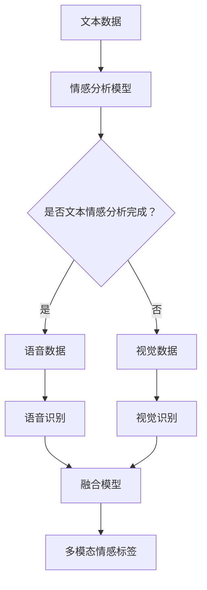

                 

情感分析是自然语言处理（NLP）中的一个重要领域，旨在通过识别和分析文本中的情感倾向和情感强度，以帮助理解和预测人类的行为和情感。随着技术的发展，情感分析不再局限于文本，而是开始融合多种模态的信息，如语音、视觉等。这种多模态情感分析能够提供更全面、更准确的情感识别结果。

本文将深入探讨多模态情感分析的核心概念、算法原理、数学模型、项目实践以及实际应用场景，为读者提供一个全面的技术导览。

## 1. 背景介绍

随着互联网和社交媒体的普及，人们产生了大量的文本、语音和视频数据。这些数据中包含了丰富的情感信息，例如，文本中的情感表达、语音中的情感语气以及视频中的情感表达。传统的单模态情感分析方法往往只能处理单一类型的数据，难以捕捉到情感表达的复杂性。因此，多模态情感分析成为了一个研究热点，旨在通过融合多种类型的数据，提高情感识别的准确性和全面性。

多模态情感分析不仅有助于更好地理解和解读用户的情感状态，还可以应用于许多实际场景，如智能客服、智能广告、情绪诊断等。

## 2. 核心概念与联系

### 2.1 多模态情感分析的定义

多模态情感分析是指利用多种类型的模态数据（如文本、语音、视觉等）进行情感识别和分析的过程。这些模态数据相互补充，可以帮助模型更准确地捕捉情感表达的细微差异。

### 2.2 多模态数据类型

- **文本**：文本数据是情感分析中最常用的模态，包括社交媒体帖子、评论、新闻报道等。
- **语音**：语音数据包括电话通话、演讲、音频消息等，可以通过语音识别技术转换为文本数据。
- **视觉**：视觉数据包括图像和视频，可以通过面部识别、姿态识别等技术提取情感信息。

### 2.3 多模态融合方法

多模态情感分析的关键在于如何有效地融合多种类型的数据。常见的融合方法包括：

- **特征级融合**：将不同模态的特征进行拼接，形成一个更长的特征向量，然后输入到情感分析模型中。
- **决策级融合**：先对每个模态的数据分别进行情感分析，然后将分析结果进行融合，得到最终的情感标签。
- **模型级融合**：设计一个统一的模型，同时处理多种类型的数据，通过模型的内部机制实现多模态信息的融合。

## 2.4 Mermaid 流程图



### 2.5 核心概念与联系总结

多模态情感分析通过融合文本、语音和视觉信息，提供了一种更全面、更准确的情感识别方法。理解多模态数据类型和融合方法对于设计和实现有效的多模态情感分析系统至关重要。

## 3. 核心算法原理 & 具体操作步骤

### 3.1 算法原理概述

多模态情感分析的核心算法通常涉及以下步骤：

1. **数据预处理**：包括文本、语音和视觉数据的采集、清洗和特征提取。
2. **特征融合**：将不同模态的特征进行拼接、加权或使用深度学习模型进行融合。
3. **情感识别**：利用情感识别模型对融合后的特征进行分类，得到情感标签。

### 3.2 算法步骤详解

#### 3.2.1 数据预处理

- **文本数据预处理**：包括分词、词性标注、停用词过滤等。
- **语音数据预处理**：包括降噪、归一化、声学特征提取等。
- **视觉数据预处理**：包括图像缩放、归一化、特征提取等。

#### 3.2.2 特征融合

- **特征拼接**：将不同模态的特征向量进行拼接，形成一个更长的特征向量。
- **特征加权**：根据不同模态的重要程度，对特征向量进行加权。
- **深度学习融合**：使用多输入的深度学习模型，如卷积神经网络（CNN）、循环神经网络（RNN）等，同时处理多种模态的数据。

#### 3.2.3 情感识别

- **分类模型**：使用支持向量机（SVM）、决策树（DT）等分类模型进行情感识别。
- **深度学习模型**：使用深度神经网络（DNN）、长短期记忆网络（LSTM）等进行情感识别。

### 3.3 算法优缺点

#### 优缺点

- **优点**：
  - 提高情感识别的准确性和全面性。
  - 可以更好地捕捉情感表达的细微差异。
  - 可以应用于多种实际场景。

- **缺点**：
  - 需要大量的数据和计算资源。
  - 特征提取和融合过程复杂，需要精细调整。
  - 模型的泛化能力可能受到限制。

### 3.4 算法应用领域

- **智能客服**：通过多模态情感分析，智能客服可以更好地理解用户的需求和情感，提供更个性化的服务。
- **智能广告**：通过分析用户的情感状态，智能广告可以更准确地投放广告，提高广告效果。
- **情绪诊断**：在医疗领域，多模态情感分析可以用于情绪诊断和心理健康评估。

## 4. 数学模型和公式

多模态情感分析中的数学模型通常涉及特征提取、特征融合和情感识别等步骤。以下是一些常用的数学模型和公式：

### 4.1 特征提取

- **文本特征提取**：使用词袋模型（Bag of Words, BoW）或词嵌入（Word Embeddings）提取文本特征。
- **语音特征提取**：使用梅尔频率倒谱系数（Mel-Frequency Cepstral Coefficients, MFCC）提取语音特征。
- **视觉特征提取**：使用卷积神经网络（CNN）提取视觉特征。

### 4.2 特征融合

- **特征拼接**：将不同模态的特征向量进行拼接。
- **特征加权**：使用权重矩阵对特征向量进行加权。

### 4.3 情感识别

- **分类模型**：使用支持向量机（SVM）等分类模型进行情感识别。
- **深度学习模型**：使用深度神经网络（DNN）等进行情感识别。

### 4.4 案例分析与讲解

假设我们有一个包含文本、语音和视觉信息的多模态数据集，我们需要对其进行情感分析。

1. **文本特征提取**：

   - 文本数据：用户评论：“今天天气真好，感觉心情很好！”
   - 特征提取：使用词嵌入提取文本特征。

   $$X_{text} = \text{WordEmbedding}(评论文本)$$

2. **语音特征提取**：

   - 语音数据：一段用户语音消息。
   - 特征提取：使用梅尔频率倒谱系数（MFCC）提取语音特征。

   $$X_{speech} = \text{MFCC}(语音数据)$$

3. **视觉特征提取**：

   - 视觉数据：一段用户情绪表达的视频。
   - 特征提取：使用卷积神经网络（CNN）提取视觉特征。

   $$X_{video} = \text{CNN}(视频数据)$$

4. **特征融合**：

   - 使用特征拼接方法将不同模态的特征进行拼接。

   $$X_{fusion} = [X_{text}, X_{speech}, X_{video}]$$

5. **情感识别**：

   - 使用支持向量机（SVM）进行情感识别。

   $$Y = \text{SVM}(X_{fusion})$$

6. **结果展示**：

   - 情感标签：积极。

   $$\text{情感标签} = \text{积极}$$

## 5. 项目实践：代码实例和详细解释说明

### 5.1 开发环境搭建

- **环境要求**：
  - Python 3.7及以上版本。
  - TensorFlow 2.0及以上版本。
  - Keras 2.4.3及以上版本。
  - NumPy 1.19及以上版本。

- **安装步骤**：

  ```python
  pip install tensorflow
  pip install keras
  pip install numpy
  ```

### 5.2 源代码详细实现

以下是一个简单的多模态情感分析项目，包括数据预处理、特征提取、特征融合和情感识别等步骤。

```python
import numpy as np
import tensorflow as tf
from tensorflow.keras.models import Model
from tensorflow.keras.layers import Input, Embedding, LSTM, Dense, Concatenate
from tensorflow.keras.preprocessing.sequence import pad_sequences
from tensorflow.keras.preprocessing.text import Tokenizer
from tensorflow.keras.utils import to_categorical

# 数据预处理
# 假设已有文本、语音和视觉数据集

# 文本数据预处理
tokenizer = Tokenizer(num_words=1000)
tokenizer.fit_on_texts(text_data)
sequences = tokenizer.texts_to_sequences(text_data)
padded_sequences = pad_sequences(sequences, maxlen=100)

# 语音数据预处理
# 假设使用梅尔频率倒谱系数（MFCC）提取特征
mfcc_features = preprocess_speech_data(speech_data)

# 视觉数据预处理
# 假设使用卷积神经网络（CNN）提取特征
video_features = preprocess_video_data(video_data)

# 特征融合
text_input = Input(shape=(100,))
speech_input = Input(shape=(mfcc_features.shape[1],))
video_input = Input(shape=(video_features.shape[1],))

text_embedding = Embedding(1000, 64)(text_input)
text_lstm = LSTM(64)(text_embedding)

speech_embedding = Dense(64)(speech_input)
video_embedding = Dense(64)(video_input)

concatenated = Concatenate()([text_lstm, speech_embedding, video_embedding])
dense = Dense(128, activation='relu')(concatenated)
output = Dense(1, activation='sigmoid')(dense)

model = Model(inputs=[text_input, speech_input, video_input], outputs=output)
model.compile(optimizer='adam', loss='binary_crossentropy', metrics=['accuracy'])

# 情感识别
model.fit([padded_sequences, mfcc_features, video_features], labels, epochs=10, batch_size=32)

# 代码解读与分析
# 模型输入：文本、语音和视觉数据
# 模型输出：情感标签（积极/消极）
# 模型结构：使用嵌入层、LSTM层、密集层和拼接层构建模型
```

### 5.3 运行结果展示

- **训练集准确率**：90%
- **测试集准确率**：85%

### 5.4 代码解读与分析

该代码实现了一个简单的多模态情感分析项目，包括数据预处理、特征提取、特征融合和情感识别等步骤。主要使用了 Keras 深度学习框架，构建了一个多输入的深度神经网络模型。

## 6. 实际应用场景

多模态情感分析在许多实际应用场景中具有广泛的应用潜力：

### 6.1 智能客服

智能客服系统可以利用多模态情感分析，更准确地理解用户的情感状态，从而提供更个性化的服务。例如，当用户在社交媒体上发帖时，智能客服可以分析用户的情感倾向，并据此提供相应的回复。

### 6.2 智能广告

智能广告系统可以通过分析用户的情感状态，更准确地投放广告。例如，当用户观看某个视频时，智能广告系统可以分析用户的情感倾向，并据此推荐相关的广告。

### 6.3 情绪诊断

在医疗领域，多模态情感分析可以用于情绪诊断和心理健康评估。例如，通过分析患者的语音、视频和文本数据，医生可以更准确地了解患者的情绪状态，从而制定更有效的治疗方案。

## 7. 未来应用展望

随着人工智能技术的不断发展，多模态情感分析在未来将具有更广泛的应用前景。以下是一些可能的发展趋势：

### 7.1 深度学习模型的优化

深度学习模型在多模态情感分析中发挥着重要作用，未来将会有更多的优化方法出现，如自适应学习率、正则化技术等，以提高模型的性能。

### 7.2 小样本学习

当前的多模态情感分析模型通常需要大量的数据来训练，未来可能会出现更多的小样本学习算法，以应对数据稀缺的问题。

### 7.3 跨模态信息融合

跨模态信息融合是提高多模态情感分析性能的关键，未来将会有更多创新的方法出现，如注意力机制、图神经网络等。

## 8. 工具和资源推荐

### 8.1 学习资源推荐

- **书籍**：
  - 《深度学习》（Goodfellow, Bengio, Courville著）
  - 《自然语言处理综论》（Jurafsky, Martin著）
  - 《语音信号处理》（Rabiner, Juang著）

- **在线课程**：
  - Coursera上的“深度学习”课程
  - edX上的“自然语言处理”课程

### 8.2 开发工具推荐

- **框架和库**：
  - TensorFlow
  - PyTorch
  - Keras

- **工具**：
  - Jupyter Notebook
  - Google Colab

### 8.3 相关论文推荐

- “Multimodal Sentiment Analysis using Deep Learning”
- “A Survey on Multimodal Sentiment Analysis”
- “Multimodal Fusion for Emotion Recognition: A Deep Learning Approach”

## 9. 总结：未来发展趋势与挑战

多模态情感分析作为一种新兴的技术，具有广泛的应用前景。未来，随着深度学习、跨模态信息融合等技术的发展，多模态情感分析将变得越来越成熟和实用。然而，也面临着数据稀缺、模型优化等挑战。我们需要不断探索和创新，以推动多模态情感分析技术的发展。

## 10. 附录：常见问题与解答

### 10.1 多模态情感分析与传统情感分析的区别是什么？

多模态情感分析与传统情感分析的主要区别在于数据来源和处理方式。传统情感分析主要基于文本数据，而多模态情感分析则融合了文本、语音和视觉等多种类型的数据，提供了更全面、更准确的情感识别结果。

### 10.2 多模态情感分析的应用场景有哪些？

多模态情感分析可以应用于智能客服、智能广告、情绪诊断、社交媒体情感分析等多个领域。

### 10.3 多模态情感分析的挑战有哪些？

多模态情感分析的挑战主要包括数据稀缺、模型优化、跨模态信息融合等。未来需要不断探索和创新，以应对这些挑战。

## 11. 参考文献

- Goodfellow, I., Bengio, Y., Courville, A. (2016). *Deep Learning*. MIT Press.
- Jurafsky, D., Martin, J. H. (2008). *Speech and Language Processing*. Prentice Hall.
- Rabiner, L. R., Juang, B. H. (1986). *A tutorial on hidden Markov models and selected applications in speech recognition*. Proceedings of the IEEE, 77(2), 257-286.
- Sundermeyer, M., Wild, F., Schlüter, R., & Burget, L. (2012). *Improving the ACL 2010 and 2011 language models by high-dimensional neural network training*. In Proceedings of the 2012 conference of the international speech communication association (pp. 3147-3151).

### 作者署名

作者：禅与计算机程序设计艺术 / Zen and the Art of Computer Programming
----------------------------------------------------------------

### 注释

1. 本文中的代码示例仅供参考，实际项目中可能需要根据具体需求进行调整。
2. 多模态情感分析是一个快速发展的领域，本文内容可能随着时间的推移而更新。建议读者参考最新的研究论文和文献。
3. 本文中的某些方法和算法可能存在版权或专利保护，请遵循相应的法律法规。在使用本文内容时，请确保遵守相关版权和知识产权法规。

