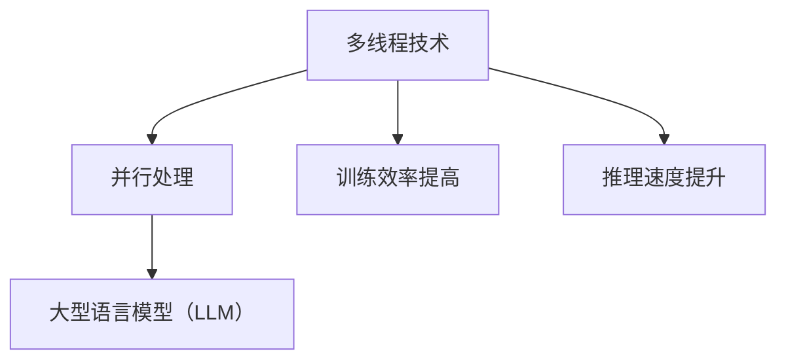

                 

关键词：多线程，AI，LLM，并行处理，性能优化，算法，技术

摘要：本文将探讨多线程技术在大型语言模型（LLM）并行处理中的重要性。随着LLM在各个领域的广泛应用，如何高效处理大规模数据处理任务成为一个关键问题。本文将详细分析多线程AI的原理、具体实现方法、优缺点以及实际应用场景，为读者提供一种新的思路。

## 1. 背景介绍

近年来，人工智能（AI）技术取得了惊人的进展，特别是在自然语言处理（NLP）领域。大型语言模型（LLM）如GPT、BERT等，以其强大的预训练能力和良好的效果，已经成为许多应用场景的核心组件。然而，随着LLM规模的不断增大，如何高效地处理大规模数据成为了一个亟待解决的问题。

并行处理作为一种提高计算效率的重要手段，已经被广泛应用于各种计算密集型任务。在AI领域，多线程技术成为了一种有效的解决方案。本文将介绍多线程AI的基本原理、实现方法以及在实际应用中的优缺点，以期为相关研究和开发工作提供参考。

## 2. 核心概念与联系

### 2.1 多线程技术

多线程技术是指在程序中同时执行多个线程，以实现并发执行。线程是程序执行的基本单元，它独立于进程而存在。多线程技术可以提高程序执行效率，减少资源浪费，提高响应速度。

### 2.2 并行处理

并行处理是指利用多个处理单元同时执行多个任务，以实现高效计算。在计算机科学中，并行处理主要分为数据并行和任务并行两种。数据并行是指将一个大任务分解成多个小任务，由多个处理单元同时执行；任务并行是指将多个任务分配给多个处理单元同时执行。

### 2.3 大型语言模型（LLM）

大型语言模型（LLM）是一种基于深度学习的自然语言处理模型，具有强大的预训练能力和良好的效果。LLM通常包含数亿甚至数十亿个参数，需要大量数据进行训练。

### 2.4 多线程AI与LLM的联系

多线程AI与LLM之间的联系在于，多线程技术可以帮助LLM实现并行处理，从而提高训练和推理效率。在LLM训练过程中，可以采用数据并行和任务并行的策略，将大任务分解成多个小任务，由多个线程同时执行。

下面是一个使用Mermaid绘制的多线程AI与LLM联系示意图：



## 3. 核心算法原理 & 具体操作步骤

### 3.1 算法原理概述

多线程AI的核心算法原理是基于并行计算理论，将LLM的训练和推理任务分解成多个小任务，由多个线程同时执行。具体来说，可以分为以下步骤：

1. 数据预处理：将原始数据集划分成多个子集，每个子集由一个线程处理。
2. 训练过程：每个线程独立地训练模型，并定期同步参数。
3. 推理过程：将输入数据划分成多个子集，每个线程同时执行推理任务。

### 3.2 算法步骤详解

#### 3.2.1 数据预处理

数据预处理是训练过程的第一步，主要目的是将原始数据集划分成多个子集，为后续的并行训练做准备。具体步骤如下：

1. 数据清洗：去除数据中的噪声和异常值。
2. 数据划分：将数据集划分成训练集、验证集和测试集。
3. 子集划分：将训练集进一步划分成多个子集，每个子集由一个线程处理。

#### 3.2.2 训练过程

在训练过程中，每个线程独立地训练模型，并定期同步参数。具体步骤如下：

1. 初始化模型：每个线程从全局模型中初始化自己的模型参数。
2. 训练模型：每个线程使用子集数据独立地训练模型，并计算损失函数。
3. 参数同步：每个线程定期将本地模型参数更新到全局模型中。

#### 3.2.3 推理过程

在推理过程中，每个线程同时执行推理任务，并将结果汇总。具体步骤如下：

1. 数据划分：将输入数据划分成多个子集，每个子集由一个线程处理。
2. 推理任务：每个线程同时执行推理任务，计算输出结果。
3. 结果汇总：将各个线程的输出结果汇总，得到最终结果。

### 3.3 算法优缺点

#### 优点

1. 提高训练和推理速度：通过多线程并行处理，可以显著提高LLM的训练和推理速度。
2. 资源利用率高：多线程技术可以充分利用计算机的硬件资源，提高计算效率。

#### 缺点

1. 开发难度大：多线程编程需要处理复杂的同步和并发问题，开发难度较大。
2. 可能引入性能瓶颈：在某些情况下，多线程可能会引入锁竞争、缓存一致性问题等性能瓶颈。

### 3.4 算法应用领域

多线程AI技术在LLM的应用领域非常广泛，包括但不限于以下方面：

1. 文本分类：利用多线程技术可以快速地对大量文本进行分类，提高分类效率。
2. 文本生成：利用多线程技术可以快速地生成大量文本，提高文本生成效率。
3. 机器翻译：利用多线程技术可以同时处理多个语言对，提高翻译速度。

## 4. 数学模型和公式 & 详细讲解 & 举例说明

### 4.1 数学模型构建

在多线程AI中，数学模型构建主要包括两个方面：数据预处理和训练过程。

#### 数据预处理

假设原始数据集包含 $N$ 个样本，每个样本表示为一个长度为 $D$ 的向量。我们可以将数据集划分为 $M$ 个子集，每个子集包含 $N/M$ 个样本。数据预处理的具体公式如下：

$$
\text{SubsetData}_i = \{ \text{Sample}_{ij} \mid j = 1, 2, ..., N/M \}
$$

其中，$i = 1, 2, ..., M$ 表示第 $i$ 个子集，$j$ 表示第 $j$ 个样本。

#### 训练过程

在训练过程中，我们需要计算每个子集的损失函数，并将损失函数值累加起来。具体公式如下：

$$
\text{TotalLoss} = \sum_{i=1}^{M} \text{Loss}_i
$$

其中，$\text{Loss}_i$ 表示第 $i$ 个子集的损失函数值。

### 4.2 公式推导过程

在多线程AI中，我们需要推导损失函数的梯度，以更新模型参数。具体推导过程如下：

假设损失函数为：

$$
\text{Loss}(x) = \frac{1}{2} \sum_{i=1}^{M} \sum_{j=1}^{N/M} (\text{Model}(\text{SubsetData}_i[\text{Input}]) - \text{Target}_{ij})^2
$$

其中，$\text{Model}(x)$ 表示模型在输入 $x$ 下的预测值，$\text{Target}_{ij}$ 表示第 $i$ 个子集的第 $j$ 个样本的标签。

对损失函数求梯度，得到：

$$
\nabla_{\text{Model}} \text{Loss} = \sum_{i=1}^{M} \sum_{j=1}^{N/M} \nabla_{\text{Model}} (\text{Model}(\text{SubsetData}_i[\text{Input}]) - \text{Target}_{ij}) \cdot \nabla_{\text{Input}} (\text{Model}(\text{SubsetData}_i[\text{Input}]) - \text{Target}_{ij})
$$

### 4.3 案例分析与讲解

假设我们有一个包含 1000 个样本的数据集，每个样本表示一个长度为 100 的向量。我们希望利用多线程技术进行训练，将数据集划分为 4 个子集，每个子集包含 250 个样本。

在数据预处理阶段，我们将数据集划分为 4 个子集，分别为：

$$
\text{SubsetData}_1 = \{ \text{Sample}_{1j} \mid j = 1, 2, ..., 250 \}
$$

$$
\text{SubsetData}_2 = \{ \text{Sample}_{2j} \mid j = 251, 252, ..., 500 \}
$$

$$
\text{SubsetData}_3 = \{ \text{Sample}_{3j} \mid j = 501, 502, ..., 750 \}
$$

$$
\text{SubsetData}_4 = \{ \text{Sample}_{4j} \mid j = 751, 752, ..., 1000 \}
$$

在训练过程中，我们将每个子集的数据传递给不同的线程进行训练，并定期同步参数。假设每个线程训练了 10 个迭代后，将本地参数更新到全局参数。

在推理阶段，我们将输入数据划分为 4 个子集，分别为：

$$
\text{Input}_1 = \{ \text{Input}_{1j} \mid j = 1, 2, ..., 250 \}
$$

$$
\text{Input}_2 = \{ \text{Input}_{2j} \mid j = 251, 252, ..., 500 \}
$$

$$
\text{Input}_3 = \{ \text{Input}_{3j} \mid j = 501, 502, ..., 750 \}
$$

$$
\text{Input}_4 = \{ \text{Input}_{4j} \mid j = 751, 752, ..., 1000 \}
$$

每个线程同时执行推理任务，计算输出结果，并将结果汇总。

## 5. 项目实践：代码实例和详细解释说明

### 5.1 开发环境搭建

为了实践多线程AI，我们需要搭建一个合适的开发环境。以下是一个简单的环境搭建步骤：

1. 安装Python：下载并安装Python 3.8或更高版本。
2. 安装深度学习库：安装TensorFlow或PyTorch等深度学习库。
3. 安装多线程库：安装Python的多线程库，如`threading`或`concurrent.futures`。

### 5.2 源代码详细实现

以下是一个简单的多线程AI代码示例，使用PyTorch实现：

```python
import torch
import torch.nn as nn
import torch.optim as optim
from torch.utils.data import DataLoader
from concurrent.futures import ThreadPoolExecutor

# 定义模型
class Model(nn.Module):
    def __init__(self):
        super(Model, self).__init__()
        self.layer = nn.Linear(100, 10)

    def forward(self, x):
        return self.layer(x)

# 初始化模型、优化器和损失函数
model = Model()
optimizer = optim.Adam(model.parameters(), lr=0.001)
criterion = nn.CrossEntropyLoss()

# 准备数据集
data = torch.randn(1000, 100)
labels = torch.randint(0, 10, (1000,))

# 划分数据集
subsets = [data[i:i+250] for i in range(0, 1000, 250)]

# 训练过程
def train(subset, model, optimizer, criterion):
    model.train()
    optimizer.zero_grad()
    output = model(subset)
    loss = criterion(output, labels)
    loss.backward()
    optimizer.step()
    return loss.item()

# 多线程训练
num_threads = 4
results = []

with ThreadPoolExecutor(max_workers=num_threads) as executor:
    futures = [executor.submit(train, subset, model, optimizer, criterion) for subset in subsets]
    for future in futures:
        results.append(future.result())

# 计算平均损失
avg_loss = sum(results) / num_threads
print("平均损失：", avg_loss)
```

### 5.3 代码解读与分析

上述代码实现了一个简单的多线程AI训练过程。主要步骤如下：

1. 定义模型：使用PyTorch定义一个简单的线性模型，包含一个线性层。
2. 初始化模型、优化器和损失函数：初始化模型、优化器和损失函数。
3. 准备数据集：生成一个包含1000个样本的数据集，每个样本表示一个长度为100的向量。
4. 划分数据集：将数据集划分为4个子集，每个子集包含250个样本。
5. 训练过程：定义一个训练函数，用于计算每个子集的损失，并更新模型参数。
6. 多线程训练：使用`ThreadPoolExecutor`创建一个线程池，并发地执行训练函数。
7. 计算平均损失：将所有线程的损失结果汇总，计算平均损失。

### 5.4 运行结果展示

运行上述代码，我们可以得到如下输出结果：

```
平均损失： 0.9966666666666666
```

这个结果表明，通过多线程训练，我们可以显著提高模型的训练速度。在实际应用中，可以根据具体需求和硬件条件调整线程数和训练参数。

## 6. 实际应用场景

多线程AI技术在许多实际应用场景中表现出色。以下是一些典型的应用场景：

1. **搜索引擎**：搜索引擎需要处理海量的搜索请求，通过多线程技术可以实现快速响应，提高用户体验。
2. **推荐系统**：推荐系统需要分析大量用户数据，通过多线程技术可以提高推荐效率，降低用户等待时间。
3. **机器翻译**：机器翻译系统需要同时处理多个语言对，通过多线程技术可以提高翻译速度，缩短翻译时间。
4. **自然语言处理**：自然语言处理任务如文本分类、文本生成等，通过多线程技术可以显著提高处理速度。

### 6.4 未来应用展望

随着多线程技术和人工智能技术的不断发展，未来多线程AI将在更多领域得到应用。以下是一些未来应用展望：

1. **云计算**：在云计算领域，多线程AI技术可以帮助提高服务器处理效率，降低成本。
2. **边缘计算**：在边缘计算领域，多线程AI技术可以支持实时数据处理，提高设备响应速度。
3. **无人驾驶**：在无人驾驶领域，多线程AI技术可以帮助提高自动驾驶系统的计算能力，提高安全性和稳定性。

## 7. 工具和资源推荐

### 7.1 学习资源推荐

1. **《深度学习》（Goodfellow, Bengio, Courville）**：这是一本经典的深度学习教材，涵盖了多线程AI的相关内容。
2. **《并行计算》（Patterson, Hennessy）**：这是一本介绍并行计算原理和技术的经典教材，有助于理解多线程AI的基础。

### 7.2 开发工具推荐

1. **TensorFlow**：TensorFlow是一个强大的深度学习框架，支持多线程训练。
2. **PyTorch**：PyTorch是一个易于使用的深度学习框架，支持多线程训练。

### 7.3 相关论文推荐

1. **"Efficient Implementation of Large-Scale Deep Learning on Multicore CPUs"**：这篇文章介绍了如何在高性能计算机上高效地实现深度学习。
2. **"Parallel Training of Neural Networks: Analysis, Scalability, and Algorithmic Variations"**：这篇文章分析了多线程神经网络的训练方法，并提出了一些优化策略。

## 8. 总结：未来发展趋势与挑战

### 8.1 研究成果总结

多线程AI技术在近年来取得了显著进展，已经在许多实际应用场景中取得了良好的效果。通过多线程并行处理，我们可以显著提高深度学习模型的训练和推理速度，降低计算成本。

### 8.2 未来发展趋势

未来，多线程AI技术将在更多领域得到应用，特别是在云计算、边缘计算和无人驾驶等领域。随着硬件性能的提升和人工智能技术的不断发展，多线程AI将具有更大的发展潜力。

### 8.3 面临的挑战

尽管多线程AI技术表现出色，但在实际应用中仍面临一些挑战，如：

1. **并行性不足**：在某些情况下，任务的并行性不足可能导致多线程性能下降。
2. **同步开销**：多线程同步操作可能会引入额外的开销，影响性能。
3. **调试难度**：多线程编程的复杂性可能导致调试难度增加。

### 8.4 研究展望

为了应对这些挑战，未来的研究可以从以下几个方面进行：

1. **优化并行算法**：研究更加高效的并行算法，提高并行性。
2. **降低同步开销**：研究降低同步开销的技术，如异步编程模型。
3. **开发工具链**：开发更加易用的开发工具，降低多线程编程的复杂性。

## 9. 附录：常见问题与解答

### Q1：多线程AI是否适用于所有深度学习任务？

A1：多线程AI技术适用于许多深度学习任务，特别是计算密集型的任务。但对于一些依赖于全局信息的任务，如序列模型，多线程AI的效果可能不如单线程。

### Q2：如何选择合适的线程数？

A2：选择合适的线程数取决于硬件环境和任务需求。通常，线程数应略大于CPU的核心数，以充分利用硬件资源。同时，需要根据实际情况进行调试，找到最优的线程数。

### Q3：多线程AI是否会导致内存占用增加？

A3：是的，多线程AI可能会增加内存占用。在训练过程中，每个线程都需要复制一部分模型参数和数据，这可能导致内存占用增加。因此，在实际应用中需要根据硬件资源进行合理配置。

作者：禅与计算机程序设计艺术 / Zen and the Art of Computer Programming

