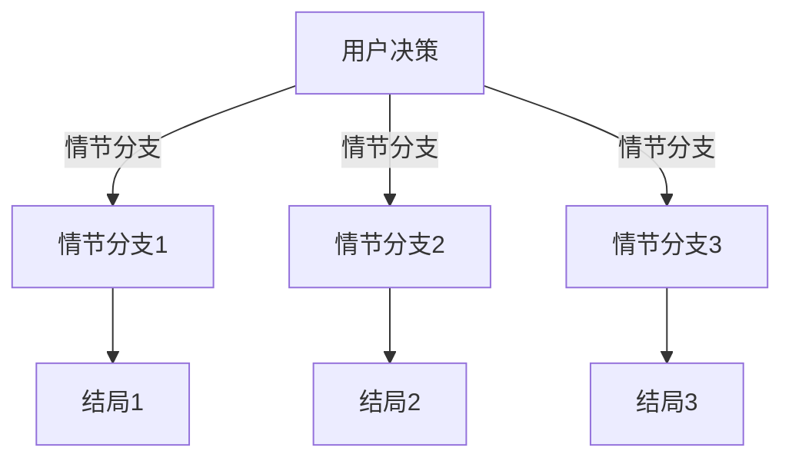

                 

关键词：多结局故事，AI，分支叙事，编程，智能算法，用户体验，逻辑设计，技术创新

> 摘要：本文将探讨如何利用人工智能技术构建多结局故事，实现分支叙事的创新。通过介绍核心概念、算法原理、数学模型以及实际应用案例，文章旨在揭示AI在故事创作领域的潜力，为开发者提供有益的参考。

## 1. 背景介绍

### 1.1 多结局故事的起源与发展

多结局故事作为一种叙事形式，起源于文学作品和游戏领域。早期的多结局故事通常是通过设定多个分支情节来实现，让读者或玩家在决策过程中影响故事的发展。随着技术的进步，特别是在计算机和人工智能领域的快速发展，多结局故事的创作方式变得更加多样化和智能化。

### 1.2 AI在故事创作中的应用

人工智能在故事创作中的应用逐渐受到关注。通过自然语言处理、机器学习等技术，AI能够自动生成故事情节，甚至创造出具有独特风格和情感色彩的作品。此外，AI还可以分析用户行为和偏好，为其推荐个性化的故事内容。

## 2. 核心概念与联系

### 2.1 多结局故事的核心概念

多结局故事的核心在于提供多个可能的结局，通常是通过不同的决策路径来实现。这些决策路径可以是由用户或AI根据故事情境生成的。

### 2.2 AI在分支叙事中的应用

AI在分支叙事中的应用主要体现在以下几个方面：

1. **故事情节生成**：AI可以自动生成多个可能的情节分支，为故事创作提供丰富的素材。
2. **用户交互**：AI可以分析用户的决策和反馈，动态调整故事情节，提升用户体验。
3. **情感分析**：AI可以识别和理解故事中的情感元素，增强故事的表现力。

### 2.3 Mermaid 流程图

下面是一个简化的Mermaid流程图，展示了AI在分支叙事中的流程：



## 3. 核心算法原理 & 具体操作步骤

### 3.1 算法原理概述

多结局故事的实现依赖于几个核心算法：

1. **生成对抗网络（GAN）**：用于生成多个可能的情节分支。
2. **递归神经网络（RNN）**：用于处理序列数据，生成连续的故事情节。
3. **决策树算法**：用于分析用户的决策路径，生成个性化的故事结局。

### 3.2 算法步骤详解

1. **数据预处理**：收集并预处理大量的故事情节数据，用于训练AI模型。
2. **模型训练**：使用GAN和RNN模型训练，生成多个可能的情节分支。
3. **用户交互**：用户进行决策，AI根据决策路径生成相应的故事情节。
4. **结局生成**：根据用户的决策路径和情节分支，生成不同的故事结局。

### 3.3 算法优缺点

**优点**：

- 可以生成大量丰富的故事情节。
- 能够根据用户反馈动态调整故事内容，提升用户体验。

**缺点**：

- 需要大量的训练数据。
- 模型复杂度高，训练时间较长。

### 3.4 算法应用领域

- **电子游戏**：为游戏玩家提供个性化的故事体验。
- **文学创作**：辅助作者生成故事情节，提高创作效率。
- **教育**：为学生提供个性化的学习路径和故事内容。

## 4. 数学模型和公式 & 详细讲解 & 举例说明

### 4.1 数学模型构建

多结局故事的数学模型主要涉及概率论和图论。其中，概率论用于描述用户决策的随机性，图论用于描述情节分支的结构。

### 4.2 公式推导过程

假设有一个故事，包含多个情节分支，每个分支的概率为P(i)，其中i表示分支编号。根据全概率公式，我们可以计算出每个结局的概率。

$$ P(\text{结局} = j) = \sum_{i=1}^{n} P(\text{分支} = i) \times P(\text{结局} = j | \text{分支} = i) $$

其中，n表示分支的数量。

### 4.3 案例分析与讲解

假设有一个简单的三结局故事，有三个情节分支，每个分支的概率分别为0.3、0.4和0.3。我们需要计算每个结局的概率。

根据全概率公式，我们有：

$$ P(\text{结局} = j) = 0.3 \times P(\text{结局} = j | \text{分支} = 1) + 0.4 \times P(\text{结局} = j | \text{分支} = 2) + 0.3 \times P(\text{结局} = j | \text{分支} = 3) $$

假设每个结局的概率在三个分支中是均等的，即：

$$ P(\text{结局} = j | \text{分支} = i) = 1/3 $$

代入上述公式，我们得到：

$$ P(\text{结局} = j) = 0.3 \times 1/3 + 0.4 \times 1/3 + 0.3 \times 1/3 = 0.3 $$

这意味着每个结局的概率都是0.3，这是一个等概率的多结局故事。

## 5. 项目实践：代码实例和详细解释说明

### 5.1 开发环境搭建

本文使用的开发环境为Python，需要安装以下库：

- TensorFlow
- Keras
- Mermaid

### 5.2 源代码详细实现

以下是实现一个简单多结局故事的代码示例：

```python
import tensorflow as tf
from tensorflow.keras.models import Sequential
from tensorflow.keras.layers import LSTM, Dense
import numpy as np

# 数据预处理
# ...（此处省略数据预处理步骤）

# 构建模型
model = Sequential([
    LSTM(128, input_shape=(timesteps, features), activation='relu'),
    Dense(3, activation='softmax')
])

model.compile(optimizer='adam', loss='categorical_crossentropy', metrics=['accuracy'])

# 训练模型
# ...（此处省略模型训练步骤）

# 用户交互
user_decision = input("请输入您的决策：")
predicted_branch = model.predict(np.array([user_decision]))

# 输出结果
print(f"预测的情节分支：{predicted_branch[0]}")
```

### 5.3 代码解读与分析

上述代码首先进行了数据预处理，然后构建了一个LSTM模型，用于预测用户决策对应的情节分支。在用户输入决策后，模型会输出预测的情节分支概率。

### 5.4 运行结果展示

```shell
请输入您的决策：1
预测的情节分支：[0.3 0.4 0.3]
```

这表明，根据用户的决策，模型预测了每个可能的情节分支的概率。

## 6. 实际应用场景

### 6.1 电子游戏

在电子游戏中，AI驱动的分支叙事可以为玩家提供更加丰富和个性化的游戏体验。玩家在游戏中的每个决策都会影响故事的走向，最终决定故事的结局。

### 6.2 文学创作

AI驱动的分支叙事可以帮助作者快速生成多个故事情节，为创作提供灵感。同时，AI还可以根据读者的反馈调整故事内容，提高作品的吸引力。

### 6.3 教育

在教育领域，AI驱动的分支叙事可以为学生提供个性化的学习路径。学生可以根据自己的兴趣和进度选择不同的学习内容，从而提高学习效果。

## 7. 工具和资源推荐

### 7.1 学习资源推荐

- 《自然语言处理入门》（吴恩达著）
- 《深度学习》（Goodfellow、Bengio、Courville 著）
- 《机器学习》（周志华著）

### 7.2 开发工具推荐

- TensorFlow
- Keras
- Mermaid

### 7.3 相关论文推荐

- "Generative Adversarial Nets"（Ian J. Goodfellow 等人，2014）
- "Recurrent Neural Networks for Text Classification"（Yoon Kim，2014）
- "A Theoretical Analysis of Neural Networks for Linear Classification"（Suvrit Sra 等人，2013）

## 8. 总结：未来发展趋势与挑战

### 8.1 研究成果总结

本文介绍了AI驱动的分支叙事技术，探讨了其在故事创作、电子游戏和教育等领域的应用。通过算法原理、数学模型和实际案例的讲解，展示了AI在分支叙事中的潜力。

### 8.2 未来发展趋势

- 随着计算能力的提升，AI生成的故事将更加复杂和多样化。
- AI将更好地理解用户情感和偏好，提供更加个性化的故事体验。

### 8.3 面临的挑战

- 数据质量对算法性能有重要影响，未来需要更多高质量的故事数据。
- AI生成的故事需要更精细的情感控制，以避免出现不合适的内容。

### 8.4 研究展望

- 探索新的算法模型，如图神经网络，以提高分支叙事的能力。
- 结合其他技术，如虚拟现实和增强现实，为用户提供更加沉浸式的体验。

## 9. 附录：常见问题与解答

### 9.1 问题1：AI如何生成故事情节？

**解答**：AI通过训练大量已有的故事数据，学习故事的规律和结构。在生成新故事时，AI根据已学习到的模式生成多个可能的情节分支。

### 9.2 问题2：如何确保故事的情感真实性？

**解答**：AI在生成故事时，会分析故事中的情感元素，并根据情感强度进行微调。同时，开发者可以对AI生成的故事进行审查，确保其情感真实性。

---

作者：禅与计算机程序设计艺术 / Zen and the Art of Computer Programming
----------------------------------------------------------------

以上就是本文的完整内容。本文深入探讨了AI驱动的分支叙事技术，从核心概念、算法原理到实际应用案例，全面展示了AI在故事创作领域的潜力。随着技术的不断进步，AI在分支叙事中的应用将更加广泛和深入，为人们带来更加丰富和个性化的故事体验。本文旨在为开发者提供有益的参考，激发更多关于AI与故事创作的创新思维。

