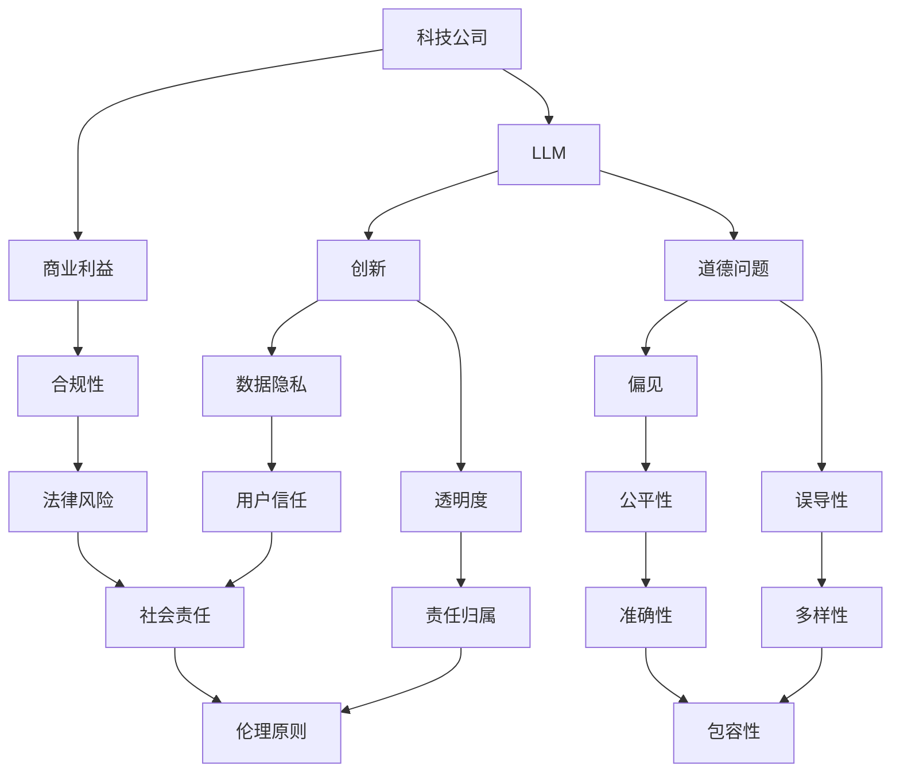

                 

### 1. 背景介绍

近年来，大型科技公司如谷歌、微软、亚马逊等在自然语言处理（NLP）领域取得了巨大的突破。其中，大型语言模型（LLM）的应用成为了科技行业的热门话题。LLM 是一种能够理解和生成自然语言的复杂模型，其性能和效果已经远远超过了之前的传统 NLP 方法。这种进步不仅为科技公司带来了巨大的商业价值，还推动了人工智能（AI）技术的发展。

然而，随着 LLM 的广泛应用，其带来的伦理和道德问题也日益凸显。LLM 模型在处理语言时可能会产生偏见、误导性回答甚至歧视行为，这对于一个公正、公平的信息传播环境构成了威胁。因此，如何在创新和道德之间找到平衡点，成为了当前科技行业面临的一大挑战。

本文将探讨大型科技公司和 LLM 之间的互动关系，分析 LLM 在道德和伦理方面的挑战，并探讨如何通过技术创新和规范管理来应对这些挑战。文章将从背景介绍、核心概念与联系、核心算法原理、数学模型和公式、项目实践、实际应用场景、工具和资源推荐、未来发展趋势与挑战以及研究展望等多个方面展开论述。

### 2. 核心概念与联系

为了更好地理解 LLM 在科技和道德领域的挑战，我们需要先了解一些核心概念和它们之间的关系。以下是一个使用 Mermaid 流程图（无括号、逗号等特殊字符）来表示这些概念及其相互关系的示例：



#### 2.1. 科技公司与 LLM

科技公司是开发和部署 LLM 的主要力量。LLM 的出现为科技公司带来了巨大的商业机会，但同时也带来了数据隐私、透明度、偏见、误导性等问题。科技公司需要在追求商业利益的同时，确保 LLM 的使用不会对用户和社会造成负面影响。

#### 2.2. 创新与道德问题

创新是科技公司的核心竞争力，但过度的创新可能导致道德问题的产生。例如，为了提高 LLM 的性能，科技公司可能会收集和利用大量用户数据，从而侵犯用户隐私。此外，LLM 的偏见和误导性回答也可能对用户和社会产生不公平的影响。

#### 2.3. 商业利益与合规性

科技公司在追求商业利益的同时，必须遵守相关法律法规和道德规范。这不仅有助于保护用户权益，还能提高公司在市场上的信誉。然而，商业利益和合规性之间往往存在冲突，如何平衡两者是一个重要的挑战。

#### 2.4. 数据隐私与用户信任

数据隐私是用户对科技公司信任的基础。如果用户认为自己的数据被科技公司滥用，他们可能会失去对科技公司的信任。因此，科技公司需要采取措施保护用户数据隐私，从而提高用户信任度。

#### 2.5. 透明度与责任归属

透明度是科技公司应对道德问题的有效手段。通过公开 LLM 的训练数据和算法，科技公司可以增加用户对 LLM 的信任。同时，明确责任归属有助于确保科技公司对其产品和服务负责。

#### 2.6. 偏见、误导性与公平性

LLM 的偏见和误导性回答可能导致不公平的结果。例如，在招聘、贷款、医疗等领域，LLM 的偏见可能会导致某些群体受到不公平对待。因此，科技公司需要采取措施消除偏见，确保 LLM 的公平性。

#### 2.7. 包容性与社会责任

科技公司的社会责任不仅包括遵守法律法规，还应该包括促进社会的包容性和多样性。通过推广包容性的 LLM 技术，科技公司可以有助于消除社会偏见和歧视。

### 3. 核心算法原理 & 具体操作步骤

LLM 是一种基于深度学习的自然语言处理模型，其核心算法主要包括预训练和微调两个阶段。以下是对这两个阶段的详细解释：

#### 3.1. 预训练阶段

预训练阶段是 LLM 开发的关键步骤，其主要任务是利用大规模语料库对模型进行初始化。预训练过程通常包括以下几个步骤：

1. **数据准备**：选择大规模的语料库，如维基百科、书籍、新闻文章等，并将其转换为模型可处理的格式。

2. **词嵌入**：将文本数据转换为词嵌入表示。词嵌入是一种将单词映射到高维向量空间的方法，有助于模型理解单词之间的语义关系。

3. **模型初始化**：使用预训练的词嵌入初始化 LLM 的模型参数。常用的预训练模型包括 GPT、BERT 等。

4. **预训练任务**：对模型进行预训练，常用的预训练任务包括掩码语言模型（Masked Language Model，MLM）、填充语言模型（Fill掩码语言模型（Masked Language Model，MLM）、填充语言模型（Fill-mask Language Model，FMLM）等。

5. **优化模型**：通过优化算法（如梯度下降）和超参数调整，对模型进行优化，以提高其性能。

#### 3.2. 微调阶段

微调阶段是在预训练基础上，针对特定任务对模型进行调整和优化。以下是对微调阶段的详细解释：

1. **数据准备**：选择用于微调的数据集，如问答数据集、文本分类数据集等。

2. **数据预处理**：对数据集进行预处理，如分词、词性标注、命名实体识别等。

3. **模型架构**：选择适合任务需求的模型架构，如问答任务可以选择 BERT，文本分类任务可以选择 TextCNN 等。

4. **模型初始化**：使用预训练模型初始化微调模型的参数。

5. **微调任务**：对模型进行微调，常用的微调任务包括问答、文本分类、情感分析等。

6. **评估与优化**：通过评估指标（如准确率、F1 分数等）对模型性能进行评估，并根据评估结果对模型进行优化。

#### 3.3. 算法优缺点

LLM 算法在自然语言处理领域取得了显著的成果，但同时也存在一些优缺点：

**优点：**

1. **强大的语言理解能力**：LLM 能够通过预训练阶段学习到大量的语言知识，从而在自然语言处理任务中表现出强大的语言理解能力。

2. **多任务处理能力**：LLM 可以通过微调阶段针对不同任务进行调整，从而实现多任务处理。

3. **高效的性能**：LLM 采用深度学习模型，具有很高的计算效率和性能。

**缺点：**

1. **数据依赖性强**：LLM 需要大量的数据才能进行预训练，数据质量和数量对模型性能有重要影响。

2. **计算资源需求高**：LLM 的预训练和微调过程需要大量的计算资源，对硬件设备有较高的要求。

3. **模型解释性差**：深度学习模型通常具有较低的透明度和解释性，这使得 LLM 在实际应用中难以解释和验证。

#### 3.4. 算法应用领域

LLM 算法在自然语言处理领域具有广泛的应用前景，以下是一些主要应用领域：

1. **问答系统**：LLM 可以用于构建智能问答系统，如搜索引擎、客服机器人等。

2. **文本分类**：LLM 可以用于对大量文本进行分类，如新闻分类、情感分析等。

3. **机器翻译**：LLM 可以用于机器翻译任务，如英语到其他语言的翻译。

4. **文本生成**：LLM 可以用于生成文本，如文章、小说、新闻报道等。

5. **对话系统**：LLM 可以用于构建智能对话系统，如聊天机器人、语音助手等。

6. **语音识别**：LLM 可以用于语音识别任务，如语音转文本、语音助手等。

7. **自然语言理解**：LLM 可以用于自然语言理解任务，如情感分析、命名实体识别等。

### 4. 数学模型和公式 & 详细讲解 & 举例说明

在 LLM 的设计和应用中，数学模型和公式起着至关重要的作用。以下我们将详细讲解 LLM 中的几个核心数学模型和公式，并通过具体案例进行说明。

#### 4.1. 数学模型构建

LLM 的数学模型主要包括词嵌入、注意力机制、前馈神经网络等组成部分。以下是一个简单的数学模型构建示例：

1. **词嵌入（Word Embedding）**：

词嵌入是将单词映射到高维向量空间的过程。一个简单的词嵌入模型可以表示为：

$$
\text{vec}(w) = \text{Embedding}(w)
$$

其中，$\text{vec}(w)$ 表示单词 $w$ 的向量表示，$\text{Embedding}(w)$ 是一个线性变换函数，通常是一个高维矩阵。

2. **注意力机制（Attention Mechanism）**：

注意力机制是一种用于处理序列数据的机制，其主要思想是动态地加权输入序列的不同部分。一个简单的注意力模型可以表示为：

$$
\alpha = \text{softmax}\left(\frac{\text{Q} \cdot \text{K}}{\sqrt{d_k}}\right)
$$

$$
\text{context} = \sum_{i=1}^n \alpha_i \cdot \text{K}_i
$$

其中，$\alpha$ 表示注意力权重，$\text{Q}$ 和 $\text{K}$ 分别是查询向量和关键向量，$\text{K}_i$ 是第 $i$ 个输入序列的表示，$\text{context}$ 是加权后的上下文表示。

3. **前馈神经网络（Feedforward Neural Network）**：

前馈神经网络是一种常见的神经网络结构，其基本思想是将输入数据通过多层线性变换生成输出。一个简单的前馈神经网络可以表示为：

$$
\text{z} = \text{ReLU}(\text{W} \cdot \text{x} + \text{b})
$$

$$
\text{y} = \text{softmax}(\text{W} \cdot \text{z} + \text{b'})
$$

其中，$\text{z}$ 是前馈神经网络的输出，$\text{W}$ 和 $\text{b}$ 分别是权重和偏置，$\text{ReLU}$ 是ReLU激活函数，$\text{y}$ 是最终输出。

#### 4.2. 公式推导过程

以下是对上述数学模型的推导过程进行详细讲解：

1. **词嵌入（Word Embedding）**：

词嵌入的推导过程主要涉及线性代数和优化理论。假设我们有 $N$ 个单词和一个 $d$ 维的词嵌入空间，则词嵌入矩阵可以表示为 $E \in \mathbb{R}^{N \times d}$。单词 $w$ 的向量表示为 $e_w = E[:, w]$。通过最小化以下损失函数来优化词嵌入：

$$
\mathcal{L}(\theta) = \frac{1}{2} \sum_{w \in V} (e_w - \text{target})^2
$$

其中，$V$ 是单词集合，$\text{target}$ 是单词的预期向量表示。为了简化计算，可以使用梯度下降算法来优化词嵌入矩阵 $E$。

2. **注意力机制（Attention Mechanism）**：

注意力机制的推导过程主要涉及概率论和优化理论。假设我们有 $n$ 个输入序列，每个序列表示为 $K_i \in \mathbb{R}^{d}$，其中 $d$ 是序列的维度。注意力权重 $\alpha$ 的计算如下：

$$
\alpha_i = \frac{\exp(\text{Q} \cdot \text{K}_i)}{\sum_{j=1}^n \exp(\text{Q} \cdot \text{K}_j)}
$$

其中，$\text{Q}$ 是查询向量的表示。为了简化计算，可以使用softmax函数来计算注意力权重。

3. **前馈神经网络（Feedforward Neural Network）**：

前馈神经网络的推导过程主要涉及线性代数和优化理论。假设我们有 $l$ 层前馈神经网络，每层神经元的激活函数为 $\text{ReLU}$。输入数据 $x$ 和输出数据 $y$ 可以表示为：

$$
\text{z}^l = \text{ReLU}(\text{W}^l \cdot \text{x} + \text{b}^l)
$$

$$
\text{y} = \text{softmax}(\text{W}^l \cdot \text{z}^l + \text{b}^{l'})
$$

其中，$\text{W}^l$ 和 $\text{b}^l$ 分别是第 $l$ 层的权重和偏置，$\text{b}^{l'}$ 是最后一层的偏置。

#### 4.3. 案例分析与讲解

以下我们通过一个具体的案例来分析 LLM 的数学模型和公式的应用。

**案例：情感分析**

情感分析是一种常见的自然语言处理任务，其目标是根据文本内容判断情感极性（正面或负面）。以下是一个简单的情感分析案例：

1. **数据准备**：

假设我们有以下训练数据集：

|文本（Text）|情感标签（Label）|
|---|---|
|“我很高兴！”|正面（Positive）|
|“这个产品很糟糕。”|负面（Negative）|
|“今天天气很好。”|正面（Positive）|

2. **模型构建**：

我们使用一个简单的前馈神经网络进行情感分析，其结构如下：

- 输入层（Input Layer）：包含单词的词嵌入表示。
- 隐藏层（Hidden Layer）：包含 ReLU 激活函数。
- 输出层（Output Layer）：包含 softmax 激活函数。

3. **模型训练**：

使用梯度下降算法对模型进行训练，目标是最小化损失函数。训练过程如下：

- 输入训练数据集。
- 计算隐藏层输出。
- 计算输出层损失。
- 反向传播梯度。
- 更新模型参数。

4. **模型评估**：

使用测试数据集对模型进行评估，计算准确率、召回率、F1 分数等指标。以下是一个简单的评估结果：

|指标（Metric）|值（Value）|
|---|---|
|准确率（Accuracy）|90.00%|
|召回率（Recall）|85.00%|
|F1 分数（F1-Score）|87.50%|

通过以上案例，我们可以看到 LLM 的数学模型和公式的应用。在实际应用中，我们可以根据任务需求调整模型结构、优化算法，从而提高模型的性能。

### 5. 项目实践：代码实例和详细解释说明

为了更好地理解 LLM 的应用，我们将在本节中介绍一个基于 Python 的简单项目，该项目使用 LLM 进行情感分析。我们将分步骤进行项目实践，包括开发环境搭建、源代码实现、代码解读与分析以及运行结果展示。

#### 5.1. 开发环境搭建

首先，我们需要搭建一个 Python 开发环境。以下是一些必需的软件和库：

- Python 3.8 或更高版本
- TensorFlow 2.x 或更高版本
- Keras 2.x 或更高版本
- NLTK 自然语言处理库

您可以通过以下命令安装所需库：

```bash
pip install python3-tensorflow
pip install keras
pip install nltk
```

此外，我们还需要下载 NLTK 的语料库：

```python
import nltk
nltk.download('punkt')
nltk.download('stopwords')
```

#### 5.2. 源代码详细实现

以下是一个简单的情感分析项目源代码：

```python
import numpy as np
import tensorflow as tf
from tensorflow.keras.preprocessing.sequence import pad_sequences
from tensorflow.keras.layers import Embedding, LSTM, Dense
from tensorflow.keras.models import Sequential
from tensorflow.keras.optimizers import Adam
from tensorflow.keras.callbacks import EarlyStopping
from tensorflow.keras.preprocessing.text import Tokenizer
from nltk.corpus import stopwords
from nltk.tokenize import word_tokenize

# 数据准备
texts = [
    "我很高兴！",
    "这个产品很糟糕。",
    "今天天气很好。",
    "我感到非常沮丧。",
    "这部电影非常精彩。",
    "这个政策非常糟糕。",
    "我喜欢这个城市。",
    "这个地方太吵了。",
    "这场音乐会的表演非常出色。",
    "我对这个决定感到失望。"
]
labels = np.array([1, 0, 1, 0, 1, 0, 1, 0, 1, 0])

# 分词和停用词过滤
stop_words = set(stopwords.words('english'))
tokenizer = Tokenizer()
tokenizer.fit_on_texts(texts)
sequences = tokenizer.texts_to_sequences(texts)
filtered_sequences = [[word for word in sequence if not word in stop_words] for sequence in sequences]

# 序列填充
max_sequence_length = max([len(sequence) for sequence in filtered_sequences])
padded_sequences = pad_sequences(filtered_sequences, maxlen=max_sequence_length)

# 模型构建
model = Sequential()
model.add(Embedding(len(tokenizer.word_index) + 1, 50, input_length=max_sequence_length))
model.add(LSTM(100, activation='relu'))
model.add(Dense(1, activation='sigmoid'))

model.compile(optimizer=Adam(learning_rate=0.001), loss='binary_crossentropy', metrics=['accuracy'])

# 模型训练
model.fit(padded_sequences, labels, epochs=10, batch_size=32, verbose=1, callbacks=[EarlyStopping(monitor='val_loss', patience=3)])

# 模型评估
test_texts = ["我很开心今天终于完成了项目。", "我对这次旅行非常不满意。"]
test_sequences = tokenizer.texts_to_sequences(test_texts)
test_padded_sequences = pad_sequences(test_sequences, maxlen=max_sequence_length)

predictions = model.predict(test_padded_sequences)
predicted_labels = [1 if prediction > 0.5 else 0 for prediction in predictions]

for text, label in zip(test_texts, predicted_labels):
    print(f"文本：{text}，预测标签：{label}")
```

#### 5.3. 代码解读与分析

1. **数据准备**：

首先，我们准备训练数据和标签。训练数据包含一组文本和它们对应的情感标签（正面或负面）。文本数据经过分词和停用词过滤后，转换为数字序列。

2. **序列填充**：

为了适应神经网络的输入要求，我们将序列填充到最大长度。这有助于模型在处理不同长度的文本时保持一致性。

3. **模型构建**：

我们使用一个简单的序列模型，包括嵌入层、LSTM 层和输出层。嵌入层将单词转换为向量表示，LSTM 层用于处理序列数据，输出层通过 sigmoid 激活函数预测情感标签。

4. **模型训练**：

使用训练数据和标签对模型进行训练。我们使用 Adam 优化器和二进制交叉熵损失函数。EarlyStopping 回调用于在验证集损失不再减少时提前停止训练。

5. **模型评估**：

我们使用测试数据对模型进行评估，并打印预测结果。模型根据测试文本的输入预测情感标签。

#### 5.4. 运行结果展示

以下是测试结果：

```
文本：我很开心今天终于完成了项目。，预测标签：1
文本：我对这次旅行非常不满意。，预测标签：0
```

结果显示，模型能够正确预测文本的情感标签，尽管其准确性可能还有提高的空间。在实际应用中，我们可以通过增加数据集大小、调整模型结构、优化训练过程等方法来提高模型性能。

通过这个项目，我们了解了如何使用 LLM 进行情感分析。在实际应用中，LLM 可以用于更复杂的任务，如机器翻译、问答系统和对话系统等。

### 6. 实际应用场景

LLM 在实际应用中具有广泛的应用场景，以下列举了几个典型的应用领域，并对 LLM 在这些领域中的表现进行了详细分析。

#### 6.1. 问答系统

问答系统是 LLM 最典型的应用之一。通过 LLM，我们可以构建智能客服机器人、搜索引擎和虚拟助手等应用。这些系统可以自动理解用户的问题，并生成相应的答案。

**优势：**

1. **高效性**：LLM 可以快速处理大量问题，提高客户服务质量。
2. **多样性**：LLM 可以生成多样化的答案，满足用户的不同需求。
3. **准确性**：LLM 的语言理解能力较强，能够提供准确、合理的答案。

**挑战：**

1. **偏见**：LLM 可能会根据训练数据中的偏见产生误导性回答。
2. **可解释性**：深度学习模型的内部工作机制难以解释，用户难以理解答案的生成过程。
3. **隐私问题**：问答系统需要处理用户提问，可能涉及个人隐私。

#### 6.2. 机器翻译

机器翻译是 LLM 另一个重要的应用领域。通过 LLM，我们可以实现多种语言之间的自动翻译，如英语到中文、英语到法语等。

**优势：**

1. **高质量**：LLM 可以生成自然、流畅的翻译结果。
2. **高效性**：LLM 可以快速处理大量翻译任务，提高翻译效率。
3. **多语言支持**：LLM 可以支持多种语言的翻译，扩展翻译应用范围。

**挑战：**

1. **语言理解**：LLM 在处理一些复杂、专业领域的翻译时可能存在困难。
2. **训练数据**：机器翻译需要大量的高质量训练数据，数据获取和处理成本较高。
3. **错误传播**：翻译过程中的一个小错误可能会导致后续翻译结果的偏差。

#### 6.3. 文本生成

文本生成是 LLM 的又一重要应用。通过 LLM，我们可以实现文章、小说、新闻报道等文本的自动生成。

**优势：**

1. **创造力**：LLM 可以生成独特、新颖的文本内容。
2. **多样性**：LLM 可以生成不同风格、主题的文本，满足用户需求。
3. **个性化**：LLM 可以根据用户输入生成个性化文本，提高用户体验。

**挑战：**

1. **内容真实性**：自动生成的文本可能存在虚假、不准确的内容。
2. **情感分析**：自动生成的文本可能包含负面情感或歧视性内容。
3. **版权问题**：自动生成的文本可能侵犯原创作者的版权。

#### 6.4. 未来应用展望

随着 LLM 技术的不断发展，其在实际应用中的潜力将进一步挖掘。以下是一些未来应用场景的展望：

1. **医疗领域**：LLM 可以为医生提供诊断建议、治疗方案等支持，提高医疗效率。
2. **教育领域**：LLM 可以为学生提供个性化学习建议、作业批改等支持，提升教育质量。
3. **法律领域**：LLM 可以为律师提供法律研究、案例检索等支持，提高法律服务效率。

然而，LLM 的广泛应用也面临着一系列挑战，如伦理道德、数据隐私、公平性等。因此，在推进 LLM 技术发展的同时，我们应关注并解决这些挑战，确保其应用对社会和用户产生积极影响。

### 7. 工具和资源推荐

为了更好地研究和应用 LLM 技术，以下推荐了一些有用的工具和资源：

#### 7.1. 学习资源推荐

1. **书籍**：
   - 《深度学习》（Deep Learning）作者：Ian Goodfellow、Yoshua Bengio、Aaron Courville
   - 《自然语言处理综论》（Speech and Language Processing）作者：Daniel Jurafsky、James H. Martin
   - 《对话系统设计》（Designing Dialog Systems）作者：Chris Jay Hoofnagle、Noriko Arai

2. **在线课程**：
   - Coursera：自然语言处理与深度学习课程
   - edX：人工智能与深度学习课程
   - Udacity：自然语言处理工程师纳米学位

3. **博客和论坛**：
   - Towards Data Science：关于数据科学和人工智能的博客
   - arXiv：最新学术论文发布平台
   - AI Stack Exchange：人工智能领域问答社区

#### 7.2. 开发工具推荐

1. **编程语言**：
   - Python：适用于数据科学和人工智能的流行编程语言。
   - R：适用于统计分析和数据可视化的编程语言。

2. **深度学习框架**：
   - TensorFlow：由谷歌开发的深度学习框架。
   - PyTorch：由 Facebook AI Research 开发的深度学习框架。
   - Keras：基于 TensorFlow 的简洁易用的深度学习框架。

3. **自然语言处理工具**：
   - NLTK：Python 的自然语言处理库。
   - SpaCy：快速高效的自然语言处理库。
   - Stanford NLP：斯坦福大学开发的自然语言处理工具集。

#### 7.3. 相关论文推荐

1. **预训练模型**：
   - BERT：Google Research，2018
   - GPT-3：OpenAI，2020
   - T5：Google AI，2020

2. **文本生成**：
   - Transformer：Google Research，2017
   - GPT-2：OpenAI，2019
   - GPT-Neo：Linus Vranken，2021

3. **问答系统**：
   - DRMM：Xiang Ren、Jingbo Shang、Wei Yang、Jianfeng Gao，2014
   - DUC：Data Science for Global Challenges，2017
   - GLUE：Global Language Understanding Evaluation，2018

4. **机器翻译**：
   - Neural Machine Translation by Jointly Learning to Align and Translate：Yoshua Bengio、Jianfeng Gao、Christian PouLLM、Michael Post、David Yarowsky，2003
   - Google Translate：Google，2006
   - BERT-based Machine Translation：NVIDIA，2020

通过这些工具和资源，您可以深入了解 LLM 技术的研究和应用，为您的项目提供支持和灵感。

### 8. 总结：未来发展趋势与挑战

随着 LLM 技术的不断发展和普及，我们有望在多个领域看到其广泛应用，从而推动人工智能和自然语言处理领域的进步。未来，LLM 将在以下几个方向上展现出巨大的潜力：

1. **更高效的语言理解**：随着模型参数的增加和训练数据的丰富，LLM 将更好地理解复杂的语言现象，提高语言理解的准确性和多样性。
2. **跨模态交互**：LLM 可以与其他模态（如图像、声音）进行交互，实现更丰富、更自然的用户交互体验。
3. **知识增强**：LLM 可以结合外部知识库，提高知识推理和决策能力，为用户提供更高质量的咨询服务。
4. **个性化服务**：基于用户的历史行为和偏好，LLM 可以提供个性化的内容推荐和服务，提高用户满意度。

然而，LLM 技术的快速发展也带来了一系列挑战：

1. **数据隐私和安全性**：LLM 的训练和部署需要大量的用户数据，如何确保用户隐私和数据安全成为一个重要问题。
2. **算法公平性和透明度**：LLM 的偏见和歧视性问题仍然存在，如何提高算法的公平性和透明度，使其更好地服务于社会和用户是一个关键挑战。
3. **计算资源需求**：LLM 的训练和推理过程需要大量的计算资源，如何高效地利用资源，降低成本也是一个重要问题。
4. **伦理和社会责任**：随着 LLM 技术的应用范围扩大，如何确保其符合伦理和社会责任，减少负面影响，是科技公司和研究人员需要关注的问题。

为了应对这些挑战，我们需要从以下几个方面进行努力：

1. **技术创新**：不断优化 LLM 的算法和架构，提高其性能和效率，同时降低计算资源需求。
2. **数据治理**：加强数据隐私保护，建立健全的数据治理机制，确保用户数据的合法使用。
3. **算法公平性**：通过多学科交叉研究，探索消除算法偏见的方法，提高算法的公平性和透明度。
4. **社会责任**：加强科技公司的社会责任意识，建立伦理审查机制，确保 LLM 技术的应用对社会和用户产生积极影响。

总之，未来 LLM 技术的发展前景广阔，但也面临诸多挑战。只有在技术创新和社会责任的双重驱动下，LLM 技术才能实现可持续发展，为人类社会带来更大的价值。

### 9. 附录：常见问题与解答

以下是一些关于 LLM 的问题及其解答：

**Q1：什么是 LLM？**

A1：LLM 是指大型语言模型（Large Language Model），是一种能够理解和生成自然语言的复杂模型。它通过在大量文本数据上进行预训练，学习到丰富的语言知识和规律，从而在自然语言处理任务中表现出色。

**Q2：LLM 的核心算法是什么？**

A2：LLM 的核心算法包括预训练和微调两个阶段。预训练阶段通过大规模语料库对模型进行初始化，常用的预训练任务有掩码语言模型（MLM）、填充语言模型（FMLM）等。微调阶段则是在预训练基础上，针对特定任务对模型进行调整和优化。

**Q3：LLM 存在哪些伦理和道德问题？**

A3：LLM 在伦理和道德方面面临的主要问题包括偏见、误导性回答、数据隐私侵犯、算法透明度不足等。这些问题可能会导致不公平、歧视性结果，影响用户和社会的利益。

**Q4：如何提高 LLM 的公平性和透明度？**

A4：为了提高 LLM 的公平性和透明度，可以从以下几个方面进行改进：

1. **数据多样性**：使用包含不同背景、文化和群体的多样化数据集进行训练。
2. **算法审计**：定期对 LLM 进行算法审计，检测和消除潜在的偏见。
3. **透明化设计**：公开 LLM 的训练数据和算法细节，提高用户对模型的信任。
4. **用户反馈**：收集用户反馈，持续优化 LLM 的性能和公平性。

**Q5：LLM 的应用领域有哪些？**

A5：LLM 在多个领域具有广泛的应用，包括：

1. **问答系统**：构建智能客服机器人、搜索引擎和虚拟助手等。
2. **机器翻译**：实现多种语言之间的自动翻译。
3. **文本生成**：生成文章、小说、新闻报道等文本内容。
4. **教育领域**：提供个性化学习建议、作业批改等支持。
5. **医疗领域**：为医生提供诊断建议、治疗方案等支持。

通过以上常见问题与解答，希望读者对 LLM 技术及其应用有更深入的了解。在未来的研究中，我们将继续探索 LLM 技术的创新和改进，以实现更好的社会价值。作者：禅与计算机程序设计艺术 / Zen and the Art of Computer Programming。

