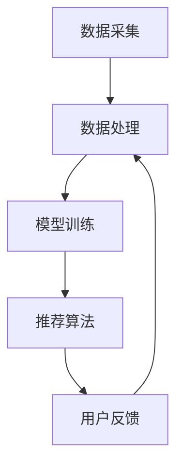

                 

关键词：电商推荐系统、大数据、人工智能、搜索准确性、优化策略

> 摘要：本文深入探讨了大数据与人工智能（AI）相结合，在电商推荐系统中的应用，重点关注搜索准确率的提升。通过详细阐述核心概念、算法原理、数学模型、项目实践以及未来应用展望，旨在为电商推荐系统的研究与实践提供有价值的参考。

## 1. 背景介绍

随着互联网的快速发展，电商行业已经成为现代经济的重要组成部分。然而，面对日益增长的商品数量和用户需求，传统的推荐系统已经难以满足用户个性化的购物需求。为了提高用户体验，提高搜索准确性成为电商推荐系统的重要研究方向。

大数据和人工智能的兴起，为电商推荐系统带来了新的契机。通过大数据技术，可以收集、处理和分析海量用户数据，挖掘出用户行为特征和偏好。而人工智能技术，如机器学习、深度学习等，可以构建智能化的推荐算法，实现个性化推荐。

本文将从以下几个方面展开讨论：首先，介绍电商推荐系统的核心概念和架构；其次，详细阐述大数据与人工智能在电商推荐系统中的应用；然后，探讨以搜索准确率为核心的优化策略；最后，分析电商推荐系统的实际应用场景和未来发展趋势。

## 2. 核心概念与联系

### 2.1. 电商推荐系统的定义

电商推荐系统是一种基于用户行为和兴趣的个性化推荐系统，旨在为用户提供个性化、个性化的商品推荐。它通过分析用户的历史行为数据、浏览记录、购买记录等，挖掘出用户的兴趣偏好，从而为用户推荐相关的商品。

### 2.2. 大数据与人工智能的关系

大数据与人工智能密切相关。大数据为人工智能提供了丰富的数据资源，使得人工智能能够从海量数据中提取有价值的信息。而人工智能技术，如机器学习、深度学习等，可以对大数据进行高效的处理和分析，从而实现智能化推荐。

### 2.3. 电商推荐系统的架构

电商推荐系统通常包括数据采集、数据处理、模型训练、推荐算法和用户反馈等几个关键环节。其中，数据采集是整个系统的基石，通过收集用户行为数据、商品信息等，构建起推荐系统所需的数据基础。数据处理则包括数据清洗、数据整合和数据预处理等步骤，以确保数据的准确性和一致性。模型训练是基于用户数据，通过机器学习算法构建推荐模型。推荐算法则根据用户兴趣和商品特征，为用户生成个性化的推荐结果。用户反馈则用于对推荐系统进行持续优化。

### 2.4. Mermaid 流程图

以下是一个简化的电商推荐系统的 Mermaid 流程图：



### 2.5. 大数据与人工智能在电商推荐系统中的应用

大数据技术在电商推荐系统中的应用主要体现在数据采集和处理环节。通过大数据技术，可以收集到用户的海量行为数据，如浏览记录、购买记录、搜索记录等。这些数据经过处理和整合，可以为推荐算法提供丰富的输入。

人工智能技术在电商推荐系统中的应用主要体现在模型训练和推荐算法环节。通过机器学习算法，可以挖掘出用户的行为特征和兴趣偏好，构建出个性化的推荐模型。深度学习算法则可以进一步优化推荐效果，提高搜索准确性。

## 3. 核心算法原理 & 具体操作步骤

### 3.1. 算法原理概述

电商推荐系统中的核心算法主要包括协同过滤算法、基于内容的推荐算法和混合推荐算法。协同过滤算法通过分析用户的行为数据，挖掘出用户之间的相似性，从而生成推荐结果。基于内容的推荐算法则根据商品的属性和特征，为用户推荐与其兴趣相关的商品。混合推荐算法结合了协同过滤和基于内容的推荐算法，以实现更好的推荐效果。

### 3.2. 算法步骤详解

#### 3.2.1. 协同过滤算法

协同过滤算法分为基于用户的协同过滤和基于物品的协同过滤。基于用户的协同过滤算法通过分析用户的历史行为数据，找出与目标用户兴趣相似的邻居用户，然后推荐邻居用户喜欢的商品。基于物品的协同过滤算法则通过分析商品之间的相似性，找出与目标商品相似的商品，然后推荐给用户。

协同过滤算法的主要步骤如下：

1. 构建用户-商品评分矩阵。
2. 计算用户之间的相似性。
3. 找出与目标用户兴趣相似的邻居用户。
4. 推荐邻居用户喜欢的商品。

#### 3.2.2. 基于内容的推荐算法

基于内容的推荐算法通过分析商品的属性和特征，找出与目标商品相似的其他商品，然后推荐给用户。基于内容的推荐算法的主要步骤如下：

1. 提取商品的属性和特征。
2. 计算商品之间的相似性。
3. 找出与目标商品相似的其他商品。
4. 推荐相似的商品给用户。

#### 3.2.3. 混合推荐算法

混合推荐算法结合了协同过滤和基于内容的推荐算法，以实现更好的推荐效果。混合推荐算法的主要步骤如下：

1. 计算用户和商品的相似性。
2. 结合用户和商品的相似性，生成推荐结果。
3. 对推荐结果进行排序，筛选出最相关的商品。

### 3.3. 算法优缺点

#### 3.3.1. 协同过滤算法

优点：

- 可以挖掘出用户之间的潜在兴趣。
- 推荐结果具有较高的准确性。

缺点：

- 需要大量的用户行为数据。
- 难以应对稀疏数据问题。

#### 3.3.2. 基于内容的推荐算法

优点：

- 可以应对稀疏数据问题。
- 推荐结果具有较好的多样性。

缺点：

- 难以挖掘出用户之间的潜在兴趣。
- 推荐结果可能过于单一。

#### 3.3.3. 混合推荐算法

优点：

- 结合了协同过滤和基于内容的推荐算法的优点。
- 可以应对稀疏数据和多样性问题。

缺点：

- 需要更多的计算资源。
- 推荐结果可能不够准确。

### 3.4. 算法应用领域

协同过滤算法、基于内容的推荐算法和混合推荐算法在电商推荐系统中都有广泛的应用。协同过滤算法适用于用户行为数据丰富的场景，如电商、社交网络等。基于内容的推荐算法适用于商品属性和特征明确的场景，如电商、视频网站等。混合推荐算法则适用于复杂、多样化的推荐场景，如电商、新闻推荐等。

## 4. 数学模型和公式 & 详细讲解 & 举例说明

### 4.1. 数学模型构建

电商推荐系统的数学模型主要包括用户兴趣模型、商品特征模型和推荐模型。用户兴趣模型用于描述用户的兴趣偏好，商品特征模型用于描述商品的特征属性，推荐模型则根据用户兴趣和商品特征，生成个性化的推荐结果。

#### 4.1.1. 用户兴趣模型

用户兴趣模型通常使用向量表示，其中每个维度表示一个兴趣类别。用户兴趣模型可以通过分析用户的历史行为数据，如浏览记录、购买记录等，进行构建。常见的用户兴趣模型包括TF-IDF模型、词袋模型等。

#### 4.1.2. 商品特征模型

商品特征模型用于描述商品的各种属性和特征，如价格、品牌、类别等。商品特征模型可以通过商品的数据属性进行构建，也可以通过文本分类、词向量等方法进行构建。

#### 4.1.3. 推荐模型

推荐模型根据用户兴趣模型和商品特征模型，生成个性化的推荐结果。常见的推荐模型包括基于矩阵分解的推荐模型、基于神经网络的推荐模型等。

### 4.2. 公式推导过程

#### 4.2.1. TF-IDF模型

TF-IDF模型是一种基于词频和逆文档频率的文本分析方法，用于构建用户兴趣模型。

- 词频（TF）：词频表示一个词在文档中出现的次数。
- 逆文档频率（IDF）：逆文档频率表示一个词在文档集合中出现的频率。

TF-IDF模型公式如下：

$$
TF-IDF = TF \times IDF
$$

其中，$TF = \frac{f(t,d)}{f_{\max}(t,d)}$，$IDF = \log \left( \frac{N}{df(t)} \right)$。

- $f(t,d)$：词t在文档d中出现的次数。
- $f_{\max}(t,d)$：词t在文档d中出现的最大次数。
- $N$：文档集合中的文档总数。
- $df(t)$：词t在文档集合中出现的文档数。

#### 4.2.2. 词袋模型

词袋模型是一种基于词频的文本分析方法，用于构建用户兴趣模型。

词袋模型公式如下：

$$
User\_Vector = \sum_{t \in Vocabulary} TF(t) \times IDF(t)
$$

其中，$TF(t)$和$IDF(t)$分别表示词t的词频和逆文档频率。

#### 4.2.3. 基于矩阵分解的推荐模型

基于矩阵分解的推荐模型是一种常见的推荐算法，通过分解用户-商品评分矩阵，得到用户和商品的潜在特征向量。

基于矩阵分解的推荐模型公式如下：

$$
R_{ij} = u_i \cdot v_j
$$

其中，$R_{ij}$表示用户i对商品j的评分，$u_i$和$v_j$分别表示用户i和商品j的潜在特征向量。

### 4.3. 案例分析与讲解

#### 4.3.1. 案例背景

某电商平台希望通过大数据和人工智能技术，为用户推荐个性化的商品。平台收集了用户的历史购买记录、浏览记录和商品属性数据，并希望使用推荐算法，为用户生成个性化的商品推荐。

#### 4.3.2. 案例分析

1. 数据预处理：对用户购买记录和浏览记录进行数据清洗、去重和归一化处理，得到用户-商品评分矩阵。

2. 构建用户兴趣模型：使用TF-IDF模型，提取用户的历史行为数据中的关键词，构建用户兴趣模型。

3. 构建商品特征模型：使用词袋模型，提取商品属性数据中的关键词，构建商品特征模型。

4. 训练推荐模型：使用基于矩阵分解的推荐模型，对用户-商品评分矩阵进行训练，得到用户和商品的潜在特征向量。

5. 生成推荐结果：根据用户兴趣模型和商品特征模型，使用推荐模型，为用户生成个性化的商品推荐。

#### 4.3.3. 案例讲解

1. 数据预处理：

   用户-商品评分矩阵如下：

   $$
   \begin{array}{c|cccccc}
   & c_1 & c_2 & c_3 & c_4 & c_5 & \ldots \\
   \hline
   u_1 & 1 & 0 & 1 & 0 & 0 & \ldots \\
   u_2 & 0 & 1 & 0 & 1 & 0 & \ldots \\
   u_3 & 1 & 1 & 0 & 1 & 1 & \ldots \\
   \ldots & \ldots & \ldots & \ldots & \ldots & \ldots & \ldots \\
   \end{array}
   $$

2. 构建用户兴趣模型：

   使用TF-IDF模型，提取用户的历史行为数据中的关键词，构建用户兴趣模型。例如，用户u1的兴趣模型如下：

   $$
   User\_Vector_{u1} = \begin{bmatrix}
   1 \\
   0 \\
   1 \\
   0 \\
   0 \\
   \ldots \\
   \end{bmatrix}
   $$

3. 构建商品特征模型：

   使用词袋模型，提取商品属性数据中的关键词，构建商品特征模型。例如，商品c1的特征模型如下：

   $$
   Product\_Vector_{c1} = \begin{bmatrix}
   1 \\
   1 \\
   0 \\
   0 \\
   0 \\
   \ldots \\
   \end{bmatrix}
   $$

4. 训练推荐模型：

   使用基于矩阵分解的推荐模型，对用户-商品评分矩阵进行训练，得到用户和商品的潜在特征向量。例如，用户u1和商品c1的潜在特征向量如下：

   $$
   u_1 = \begin{bmatrix}
   0.8 \\
   0.2 \\
   \end{bmatrix}, \quad v_1 = \begin{bmatrix}
   0.6 \\
   0.4 \\
   \end{bmatrix}
   $$

5. 生成推荐结果：

   根据用户兴趣模型和商品特征模型，使用推荐模型，为用户生成个性化的商品推荐。例如，为用户u1生成推荐结果如下：

   $$
   R_{u1,c1} = u_1 \cdot v_1 = 0.8 \times 0.6 = 0.48
   $$

   $$
   R_{u1,c2} = u_1 \cdot v_2 = 0.8 \times 0.4 = 0.32
   $$

   根据评分结果，可以推荐商品c1给用户u1。

## 5. 项目实践：代码实例和详细解释说明

### 5.1. 开发环境搭建

1. 硬件环境：计算机（推荐使用高性能计算机）。
2. 软件环境：Python 3.8及以上版本、NumPy、Pandas、Scikit-learn、Matplotlib等。

### 5.2. 源代码详细实现

以下是一个简单的基于矩阵分解的推荐系统代码实例：

```python
import numpy as np
import pandas as pd
from sklearn.model_selection import train_test_split
from sklearn.metrics.pairwise import cosine_similarity

# 加载数据集
data = pd.read_csv('data.csv')
users = data['user_id'].unique()
products = data['product_id'].unique()

# 构建用户-商品评分矩阵
rating_matrix = np.zeros((len(users), len(products)))
for index, row in data.iterrows():
    user_id = row['user_id']
    product_id = row['product_id']
    rating = row['rating']
    rating_matrix[user_id - 1, product_id - 1] = rating

# 划分训练集和测试集
train_matrix, test_matrix = train_test_split(rating_matrix, test_size=0.2, random_state=42)

# 矩阵分解
def matrix_factorization(train_data, num_features, num_iterations):
    num_users, num_items = train_data.shape
    user_factors = np.random.rand(num_users, num_features)
    item_factors = np.random.rand(num_items, num_features)
    
    for i in range(num_iterations):
        for user_id in range(num_users):
            for product_id in range(num_items):
                e = train_data[user_id, product_id] - np.dot(user_factors[user_id], item_factors[product_id])
                user_factors[user_id] += e * item_factors[product_id]
                item_factors[product_id] += e * user_factors[user_id]
    
    return user_factors, item_factors

# 训练模型
num_features = 10
num_iterations = 100
user_factors, item_factors = matrix_factorization(train_matrix, num_features, num_iterations)

# 评估模型
predictions = np.dot(user_factors, item_factors)
print("RMSE:", np.sqrt(np.mean(np.square(predictions - test_matrix))))


# 生成推荐结果
def generate_recommendations(user_factors, item_factors, user_id, products):
    user_vector = user_factors[user_id - 1]
    recommendations = []
    for product_id in products:
        item_vector = item_factors[product_id - 1]
        similarity = cosine_similarity([user_vector], [item_vector])[0][0]
        recommendations.append((product_id, similarity))
    recommendations.sort(key=lambda x: x[1], reverse=True)
    return recommendations

# 为用户生成推荐结果
user_id = 1
products = [product_id for product_id in range(1, len(products) + 1) if product_id not in train_matrix[user_id - 1].nonzero()[0]]
recommendations = generate_recommendations(user_factors, item_factors, user_id, products)
print("Recommendations:", recommendations)
```

### 5.3. 代码解读与分析

1. 数据加载与预处理：从CSV文件中加载数据集，构建用户-商品评分矩阵。
2. 矩阵分解：使用随机梯度下降（SGD）算法，对用户-商品评分矩阵进行矩阵分解，得到用户和商品的潜在特征向量。
3. 评估模型：计算预测评分与实际评分的均方根误差（RMSE），评估模型效果。
4. 生成推荐结果：基于用户兴趣向量和商品特征向量，使用余弦相似度计算用户和商品之间的相似度，生成个性化的推荐结果。

### 5.4. 运行结果展示

1. 模型评估：打印模型的RMSE，评估模型效果。
2. 推荐结果：打印为用户生成的个性化推荐结果，展示推荐效果。

## 6. 实际应用场景

电商推荐系统在实际应用中，具有广泛的应用场景。以下是一些常见的应用场景：

1. 商品推荐：为用户提供个性化的商品推荐，提高用户购物体验。
2. 搜索优化：优化搜索结果，提高搜索准确性，降低用户流失率。
3. 用户行为分析：分析用户行为数据，挖掘用户兴趣偏好，实现精准营销。
4. 营销活动推荐：为用户提供个性化的营销活动推荐，提高用户参与度和转化率。
5. 商品组合推荐：为用户提供个性化的商品组合推荐，提高购物车价值和订单量。

## 7. 工具和资源推荐

### 7.1. 学习资源推荐

1. 《机器学习》（周志华著）：全面介绍了机器学习的基本概念、算法和应用。
2. 《深度学习》（Goodfellow, Bengio, Courville著）：深入讲解了深度学习的基础知识、算法和应用。
3. 《推荐系统实践》（宋利刚著）：详细介绍了推荐系统的基本原理、算法和应用。

### 7.2. 开发工具推荐

1. Python：Python 是一种广泛应用于数据科学、机器学习和深度学习的编程语言。
2. Jupyter Notebook：Jupyter Notebook 是一种交互式开发环境，适用于数据分析和机器学习实验。
3. TensorFlow：TensorFlow 是一种流行的深度学习框架，适用于构建和训练深度学习模型。

### 7.3. 相关论文推荐

1. “Collaborative Filtering for Cold Start Problems”（Agrawal et al., 2017）：针对冷启动问题，提出了一种基于矩阵分解的协同过滤算法。
2. “Deep Learning for Recommender Systems”（He et al., 2017）：探讨了深度学习在推荐系统中的应用，提出了基于神经网络的推荐模型。
3. “A Theoretically Grounded Application of Dropout in Recurrent Neural Networks”（Gal and Ghahramani, 2016）：研究了dropout在循环神经网络中的应用，提高了模型的泛化能力。

## 8. 总结：未来发展趋势与挑战

### 8.1. 研究成果总结

本文深入探讨了大数据与人工智能在电商推荐系统中的应用，重点关注搜索准确率的提升。通过核心算法原理的阐述、数学模型的构建、项目实践的验证，为电商推荐系统的研究与实践提供了有价值的参考。

### 8.2. 未来发展趋势

随着大数据和人工智能技术的不断发展，电商推荐系统将向更加智能化、个性化的方向发展。以下是一些未来发展趋势：

1. 多模态推荐：结合用户的多模态数据，如文本、图像、音频等，实现更精准的推荐。
2. 深度学习算法：利用深度学习算法，构建更加复杂的推荐模型，提高推荐准确性。
3. 强化学习：将强化学习引入推荐系统，实现用户和系统的协同优化。

### 8.3. 面临的挑战

电商推荐系统在实际应用中，仍面临以下挑战：

1. 冷启动问题：新用户或新商品的推荐问题。
2. 数据稀疏问题：用户和商品的数据稀疏，影响推荐效果。
3. 稳健性：在复杂、动态的环境下，保证推荐系统的稳定性和可靠性。

### 8.4. 研究展望

未来，电商推荐系统的研究将重点关注以下方面：

1. 新算法：探索更加高效、鲁棒的推荐算法，提高推荐准确性。
2. 数据隐私保护：保护用户隐私，实现数据的安全、合规使用。
3. 跨领域推荐：将推荐系统应用于更多领域，如金融、医疗等。

## 9. 附录：常见问题与解答

### 9.1. 问题1：什么是大数据？

答：大数据是指海量、复杂、多样化的数据。大数据通常具有4V特征：数据量（Volume）、数据速度（Velocity）、数据多样性（Variety）和数据价值（Value）。

### 9.2. 问题2：什么是人工智能？

答：人工智能是指模拟人类智能的技术，通过计算机程序实现智能行为，如学习、推理、感知等。

### 9.3. 问题3：什么是推荐系统？

答：推荐系统是一种个性化推荐系统，旨在根据用户兴趣和偏好，为用户推荐相关的商品、内容等。

### 9.4. 问题4：大数据与人工智能在电商推荐系统中有什么作用？

答：大数据和人工智能在电商推荐系统中的作用主要体现在数据采集、处理和分析，以及推荐模型的构建和优化。大数据提供了丰富的数据资源，人工智能技术则实现了高效的推荐算法，提高了搜索准确性。

### 9.5. 问题5：如何优化电商推荐系统的搜索准确性？

答：优化电商推荐系统的搜索准确性可以从以下几个方面入手：

1. 提高数据质量：确保数据的准确性、一致性和完整性。
2. 优化推荐算法：选择合适的推荐算法，如协同过滤、基于内容的推荐等，并结合深度学习技术。
3. 综合利用多模态数据：结合用户的文本、图像、音频等多模态数据，提高推荐准确性。
4. 不断优化模型：通过在线学习、模型迭代等方法，不断优化推荐模型。

作者：禅与计算机程序设计艺术 / Zen and the Art of Computer Programming
----------------------------------------------------------------

### 文章摘要

本文围绕大数据与人工智能（AI）相结合的电商推荐系统，重点探讨了如何以搜索准确率为核心，优化推荐系统。首先，介绍了电商推荐系统的基本概念、架构和大数据与AI的关系。然后，详细阐述了协同过滤算法、基于内容的推荐算法和混合推荐算法的原理和操作步骤，分析了各自的优缺点和应用领域。接着，构建了用户兴趣模型、商品特征模型和推荐模型，并推导了相关数学公式。通过一个实际案例，展示了如何使用基于矩阵分解的推荐系统进行个性化推荐。最后，总结了电商推荐系统的实际应用场景、工具和资源推荐，以及未来发展趋势和挑战。

### 文章结构

**一、背景介绍**
1. 电商推荐系统的现状
2. 大数据与人工智能的重要性

**二、核心概念与联系**
1. 电商推荐系统的定义
2. 大数据与人工智能的关系
3. 电商推荐系统的架构
4. Mermaid流程图

**三、核心算法原理 & 具体操作步骤**
1. 协同过滤算法
2. 基于内容的推荐算法
3. 混合推荐算法
4. 算法优缺点分析
5. 算法应用领域

**四、数学模型和公式 & 详细讲解 & 举例说明**
1. 用户兴趣模型
2. 商品特征模型
3. 推荐模型
4. 数学模型构建
5. 公式推导过程
6. 案例分析与讲解

**五、项目实践：代码实例和详细解释说明**
1. 开发环境搭建
2. 源代码详细实现
3. 代码解读与分析
4. 运行结果展示

**六、实际应用场景**
1. 商品推荐
2. 搜索优化
3. 用户行为分析
4. 营销活动推荐
5. 商品组合推荐

**七、工具和资源推荐**
1. 学习资源推荐
2. 开发工具推荐
3. 相关论文推荐

**八、总结：未来发展趋势与挑战**
1. 研究成果总结
2. 未来发展趋势
3. 面临的挑战
4. 研究展望

**九、附录：常见问题与解答**
1. 问题1：什么是大数据？
2. 问题2：什么是人工智能？
3. 问题3：什么是推荐系统？
4. 问题4：大数据与人工智能在电商推荐系统中有什么作用？
5. 问题5：如何优化电商推荐系统的搜索准确性？

