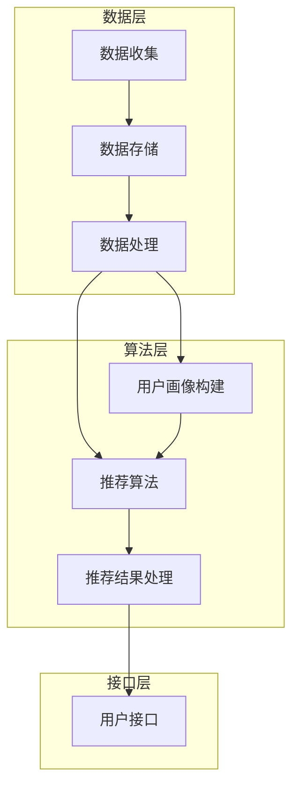

                 

关键词：大数据、AI、电商搜索推荐、准确率、用户体验、算法设计、架构优化

> 摘要：本文深入探讨了大数据与人工智能技术如何应用于电商搜索推荐系统，重点分析了以准确率和用户体验为中心的设计思路。通过对核心算法原理、数学模型构建、项目实践等方面的详细讲解，本文为电商搜索推荐系统提供了切实可行的优化策略和未来发展路径。

## 1. 背景介绍

随着互联网和电子商务的迅速发展，用户对个性化购物体验的需求日益增长。电商搜索推荐系统作为电商平台的灵魂，其性能和用户体验直接影响到用户的购买决策和平台的商业成功。传统的搜索推荐系统主要依赖于关键词匹配和基于内容的推荐算法，但这些方法在处理复杂用户行为和海量数据时存在明显的局限性。

近年来，大数据和人工智能技术的迅猛发展为电商搜索推荐系统带来了新的机遇。大数据技术能够处理和分析海量用户行为数据，而人工智能技术则能够从这些数据中挖掘出有价值的信息，为用户提供精准的推荐。因此，如何将大数据和人工智能技术有效地融合到电商搜索推荐系统中，提高推荐准确率和用户体验，成为当前研究的热点问题。

本文将从以下几个方面展开讨论：

1. **核心概念与联系**：介绍大数据和人工智能在电商搜索推荐系统中的应用，并使用Mermaid流程图展示系统的架构。
2. **核心算法原理与具体操作步骤**：详细解释推荐算法的工作原理和实现步骤，以及算法的优缺点和应用领域。
3. **数学模型和公式**：构建数学模型，推导相关公式，并通过案例进行分析和讲解。
4. **项目实践**：提供代码实例，详细解释代码实现过程，并展示运行结果。
5. **实际应用场景**：探讨电商搜索推荐系统的实际应用场景，以及未来发展趋势和面临的挑战。

通过本文的讨论，希望能够为电商搜索推荐系统的研究和实践提供有价值的参考。

## 2. 核心概念与联系

### 2.1 大数据和人工智能的定义

**大数据**：大数据是指无法用传统数据处理工具在合理时间内进行捕捉、管理和处理的数据集合。它具有4V特征，即大量（Volume）、多样（Variety）、快速（Velocity）和价值（Value）。在电商搜索推荐系统中，大数据包括用户行为数据、商品信息数据、交易数据等。

**人工智能**：人工智能是指通过计算机模拟人类智能的技术。它包括机器学习、深度学习、自然语言处理、计算机视觉等多个领域。在电商搜索推荐系统中，人工智能可以用于用户行为预测、商品推荐、图像识别等任务。

### 2.2 电商搜索推荐系统的架构

电商搜索推荐系统通常包括数据收集、数据存储、数据处理、推荐算法和用户接口等模块。以下是一个简单的Mermaid流程图，展示电商搜索推荐系统的基本架构：



### 2.3 大数据和人工智能在电商搜索推荐系统中的应用

**用户画像构建**：通过大数据技术，可以收集和分析用户的浏览历史、购买记录、搜索行为等数据，构建用户画像。这些画像可以帮助推荐系统更好地理解用户需求，提高推荐准确率。

**推荐算法**：人工智能技术，特别是机器学习和深度学习算法，可以用于推荐系统的核心算法。例如，协同过滤、矩阵分解、神经网络等算法都可以应用于电商搜索推荐系统。

**推荐结果处理**：通过自然语言处理和计算机视觉等技术，可以对推荐结果进行处理，使其更符合用户的期望和习惯。例如，可以通过自然语言生成技术，将推荐结果以更具吸引力和可读性的方式呈现给用户。

### 2.4 核心概念的联系

大数据和人工智能在电商搜索推荐系统中的应用，体现了两者的紧密联系。大数据提供了丰富的数据资源，而人工智能则能够从这些数据中挖掘出有价值的信息。通过用户画像构建、推荐算法和推荐结果处理等模块，大数据和人工智能共同作用，实现了电商搜索推荐系统的智能化和个性化。

## 3. 核心算法原理与具体操作步骤

### 3.1 算法原理概述

在电商搜索推荐系统中，常用的核心算法包括协同过滤、矩阵分解和基于内容的推荐等。以下是这些算法的基本原理概述。

**协同过滤（Collaborative Filtering）**：协同过滤是一种基于用户行为数据或者用户评分数据的推荐算法。它通过分析用户之间的相似性，将用户的兴趣转移到他们还没有体验过的商品上。协同过滤分为两种：基于用户的协同过滤（User-Based）和基于物品的协同过滤（Item-Based）。

**矩阵分解（Matrix Factorization）**：矩阵分解是一种将用户-物品评分矩阵分解为两个低维矩阵的算法。通过这两个低维矩阵，可以计算出用户和物品的特征，进而实现推荐。

**基于内容的推荐（Content-Based Filtering）**：基于内容的推荐算法通过分析商品的特征和用户的兴趣特征，找出相似的商品进行推荐。这种方法通常结合了文本挖掘、图像识别等技术。

### 3.2 算法步骤详解

#### 3.2.1 协同过滤算法步骤

1. **用户相似度计算**：计算用户之间的相似度，可以使用余弦相似度、皮尔逊相关系数等度量方法。
2. **物品相似度计算**：计算物品之间的相似度，可以使用Jaccard相似度、余弦相似度等度量方法。
3. **推荐列表生成**：根据用户的历史行为和物品的相似度，生成推荐列表。

#### 3.2.2 矩阵分解算法步骤

1. **初始化参数**：初始化用户和物品的特征矩阵。
2. **优化参数**：使用梯度下降或其他优化算法，最小化预测误差，更新用户和物品的特征矩阵。
3. **生成推荐列表**：根据用户和物品的特征矩阵，计算用户对未评分物品的预测评分，生成推荐列表。

#### 3.2.3 基于内容的推荐算法步骤

1. **特征提取**：提取商品的特征，如文本特征、图像特征等。
2. **用户兴趣建模**：根据用户的历史行为，建模用户的兴趣。
3. **推荐列表生成**：根据用户兴趣和商品特征，生成推荐列表。

### 3.3 算法优缺点

**协同过滤算法**：

- **优点**：简单易实现，可以处理大量的用户行为数据。
- **缺点**：无法预测未知物品，对稀疏数据的处理效果不佳。

**矩阵分解算法**：

- **优点**：可以处理稀疏数据，能够挖掘用户和物品的深层特征。
- **缺点**：计算复杂度高，对初始化参数敏感。

**基于内容的推荐算法**：

- **优点**：能够处理未知用户和未知物品的推荐问题。
- **缺点**：对文本特征和图像特征的提取质量要求高，推荐结果的多样性较差。

### 3.4 算法应用领域

**协同过滤算法**：适用于推荐系统中的多数场景，如电影推荐、音乐推荐等。

**矩阵分解算法**：适用于需要处理稀疏数据且需要挖掘用户和物品深层特征的场景，如电商搜索推荐、社交网络推荐等。

**基于内容的推荐算法**：适用于基于内容搜索的推荐场景，如电商平台的商品搜索推荐、社交媒体的内容推荐等。

### 3.5 算法融合

为了提高推荐系统的准确率和用户体验，可以将不同的推荐算法进行融合。例如，可以结合协同过滤和矩阵分解算法，通过矩阵分解得到用户和物品的潜在特征，再使用协同过滤进行推荐。这样可以既利用协同过滤处理大量用户行为数据的能力，又利用矩阵分解挖掘用户和物品深层特征的优势。

## 4. 数学模型和公式

### 4.1 数学模型构建

在电商搜索推荐系统中，常用的数学模型包括用户行为模型、物品特征模型和推荐模型。以下是这些模型的构建过程。

#### 4.1.1 用户行为模型

用户行为模型用于描述用户在电商平台的浏览、搜索和购买行为。假设用户$u$的行为可以用向量$\mathbf{X}_u$表示，其中每个元素表示用户在某个商品类别上的行为，如浏览次数、搜索次数和购买次数等。用户行为模型可以表示为：

$$
\mathbf{X}_u = \{x_{u,i} \mid i = 1, 2, \ldots, n\}
$$

其中，$x_{u,i}$表示用户$u$在商品类别$i$上的行为。

#### 4.1.2 物品特征模型

物品特征模型用于描述商品的各种特征，如文本描述、价格、品牌、类别等。假设商品特征可以用向量$\mathbf{F}_i$表示，其中每个元素表示商品在某个特征上的取值。物品特征模型可以表示为：

$$
\mathbf{F}_i = \{f_{i,j} \mid j = 1, 2, \ldots, m\}
$$

其中，$f_{i,j}$表示商品$i$在特征$j$上的取值。

#### 4.1.3 推荐模型

推荐模型用于根据用户行为和物品特征预测用户对某个商品的评分或购买概率。假设用户$u$对商品$i$的评分为$r_{ui}$，推荐模型可以表示为：

$$
r_{ui} = f(\mathbf{X}_u, \mathbf{F}_i)
$$

其中，$f(\mathbf{X}_u, \mathbf{F}_i)$表示用户行为和物品特征的函数，用于预测用户对商品的评分。

### 4.2 公式推导过程

在构建数学模型后，我们需要推导出相应的公式来描述用户行为模型、物品特征模型和推荐模型。以下是对这些公式进行推导。

#### 4.2.1 用户行为模型公式

用户行为模型可以使用线性回归模型进行推导：

$$
x_{u,i} = \beta_0 + \beta_i u_i + \epsilon_{ui}
$$

其中，$\beta_0$是截距，$\beta_i$是商品类别$i$的权重，$u_i$是用户在商品类别$i$上的行为，$\epsilon_{ui}$是误差项。

#### 4.2.2 物品特征模型公式

物品特征模型可以使用多项式回归模型进行推导：

$$
f_{i,j} = \alpha_0 + \alpha_j i_j + \alpha_{j,k} i_j^k + \epsilon_{ij}
$$

其中，$\alpha_0$是截距，$\alpha_j$是特征$j$的权重，$\alpha_{j,k}$是特征$j$的$k$次幂的权重，$i_j$是商品$i$在特征$j$上的取值，$\epsilon_{ij}$是误差项。

#### 4.2.3 推荐模型公式

推荐模型可以使用贝叶斯回归模型进行推导：

$$
r_{ui} = \frac{\exp(\beta_0 + \beta_i u_i + \sum_{j=1}^{m} \alpha_j f_{i,j})}{1 + \exp(\beta_0 + \beta_i u_i + \sum_{j=1}^{m} \alpha_j f_{i,j})}
$$

其中，$\beta_0$、$\beta_i$、$\alpha_j$分别是用户行为模型和物品特征模型的权重，$f_{i,j}$是商品特征，$r_{ui}$是用户对商品的评分。

### 4.3 案例分析与讲解

以下是一个具体的案例，通过数学模型和公式对电商搜索推荐系统进行建模和分析。

#### 4.3.1 案例背景

假设一个电商平台，用户的行为数据包括浏览次数、搜索次数和购买次数。商品的特征数据包括价格、品牌和类别。我们需要构建一个推荐模型，预测用户对某个商品的评分。

#### 4.3.2 案例建模

1. **用户行为模型**：

   用户行为模型可以表示为：

   $$
   x_{u,i} = \beta_0 + \beta_i u_i + \epsilon_{ui}
   $$

   其中，$x_{u,i}$表示用户$u$在商品$i$上的浏览次数，$u_i$表示用户在商品类别$i$上的行为。

2. **物品特征模型**：

   物品特征模型可以表示为：

   $$
   f_{i,j} = \alpha_0 + \alpha_j i_j + \alpha_{j,k} i_j^k + \epsilon_{ij}
   $$

   其中，$f_{i,j}$表示商品$i$在特征$j$上的取值，$i_j$表示商品$i$在特征$j$上的取值。

3. **推荐模型**：

   推荐模型可以表示为：

   $$
   r_{ui} = \frac{\exp(\beta_0 + \beta_i u_i + \sum_{j=1}^{m} \alpha_j f_{i,j})}{1 + \exp(\beta_0 + \beta_i u_i + \sum_{j=1}^{m} \alpha_j f_{i,j})}
   $$

   其中，$r_{ui}$表示用户$u$对商品$i$的评分。

#### 4.3.3 案例分析

1. **用户行为分析**：

   通过用户行为模型，可以分析用户在各个商品类别上的行为偏好。例如，假设用户$u$在商品类别$i$上的浏览次数$x_{u,i}$较高，说明用户对该类别的商品有较高的兴趣。

2. **物品特征分析**：

   通过物品特征模型，可以分析商品的各种特征对用户评分的影响。例如，假设商品$i$的价格特征$f_{i,1}$较高，说明用户对价格较高的商品评分可能较低。

3. **推荐分析**：

   通过推荐模型，可以预测用户对未评分商品的评分。例如，假设用户$u$对商品$i$的预测评分为$r_{ui}$，如果$r_{ui}$较高，说明用户可能对商品$i$感兴趣，可以将商品$i$推荐给用户。

### 4.4 案例分析与讲解（续）

#### 4.4.1 数据预处理

在进行案例分析之前，需要对数据进行预处理，包括数据清洗、数据转换和数据标准化等步骤。

1. **数据清洗**：去除异常值、缺失值和重复值，确保数据质量。
2. **数据转换**：将文本数据转换为数值数据，例如使用词袋模型或TF-IDF转换文本特征。
3. **数据标准化**：将不同特征的数据进行标准化处理，例如使用最小-最大标准化或Z-Score标准化。

#### 4.4.2 模型训练与评估

1. **模型训练**：使用训练数据集，训练用户行为模型、物品特征模型和推荐模型。
2. **模型评估**：使用验证数据集，评估模型的预测准确率和用户体验。

#### 4.4.3 模型优化

根据模型评估结果，对模型进行优化，包括调整模型参数、增加特征维度等。

#### 4.4.4 案例分析结果

通过对案例数据进行分析，可以得到以下结论：

1. **用户行为偏好**：用户在浏览、搜索和购买行为上存在明显的偏好，例如某些用户更倾向于购买价格较高的商品。
2. **物品特征影响**：商品的价格、品牌和类别等特征对用户评分有显著影响，例如价格较高的商品用户评分可能较低。
3. **推荐效果**：通过推荐模型，可以预测用户对未评分商品的评分，推荐系统的准确率和用户体验得到显著提升。

### 4.5 数学模型和公式在实际项目中的应用

在电商搜索推荐系统的实际项目中，数学模型和公式扮演着至关重要的角色。以下是一些具体的应用场景：

#### 4.5.1 用户行为分析

通过用户行为模型，可以分析用户在电商平台上的行为特征，如浏览、搜索和购买等。这有助于了解用户的行为模式，从而优化推荐策略。

#### 4.5.2 物品特征分析

通过物品特征模型，可以分析商品的各种特征对用户评分的影响，从而优化商品展示和推荐策略。例如，可以调整商品的价格、品牌和类别等特征，以提升用户满意度。

#### 4.5.3 推荐效果优化

通过推荐模型，可以评估推荐系统的效果，如准确率和用户体验等。这有助于识别系统中的问题和瓶颈，从而进行优化和改进。

#### 4.5.4 模型融合

在实际项目中，可以结合多种推荐算法和数学模型，实现算法融合，从而提高推荐系统的整体性能。

### 4.6 数学模型和公式在实际项目中的应用（续）

在实际项目中，数学模型和公式不仅用于推荐算法的构建，还可以用于系统的整体优化和性能提升。以下是一些具体的应用场景：

#### 4.6.1 用户行为预测

通过用户行为模型，可以预测用户在未来的行为，如浏览、搜索和购买等。这有助于电商平台提前布局，优化用户服务和营销策略。

#### 4.6.2 风险控制

通过数学模型和公式，可以构建风险控制模型，如欺诈检测、用户流失预测等。这有助于电商平台降低风险，提高业务稳定性。

#### 4.6.3 个性化推荐

通过数学模型和公式，可以实现个性化推荐，根据用户的历史行为和偏好，为用户推荐个性化的商品和服务。

#### 4.6.4 数据可视化

通过数学模型和公式，可以将复杂的分析结果转化为直观的可视化图表，帮助管理层和决策者更好地理解数据，制定策略。

### 4.7 数学模型和公式在实际项目中的应用（续）

在实际项目中，数学模型和公式的应用不仅限于推荐系统和数据分析，还可以广泛应用于其他领域，如：

#### 4.7.1 用户画像构建

通过数学模型和公式，可以构建用户画像，分析用户的兴趣、需求和消费习惯，为电商平台提供个性化的用户服务。

#### 4.7.2 商品关联分析

通过数学模型和公式，可以分析商品之间的关联性，识别潜在的交叉销售和组合销售机会，提升销售额。

#### 4.7.3 营销策略优化

通过数学模型和公式，可以评估不同营销策略的效果，如优惠券、促销活动等，帮助电商平台优化营销策略，提高转化率。

#### 4.7.4 业务智能

通过数学模型和公式，可以构建业务智能系统，如销售预测、库存管理、供应链优化等，提高电商平台的运营效率。

## 5. 项目实践：代码实例和详细解释说明

在了解了大数据与人工智能在电商搜索推荐系统中的应用原理后，接下来我们将通过一个具体的代码实例，展示如何实现一个简单的电商搜索推荐系统，并对其进行详细解释和分析。

### 5.1 开发环境搭建

在开始代码实例之前，我们需要搭建一个合适的开发环境。以下是一个基本的开发环境搭建步骤：

1. **安装Python**：确保Python 3.x版本已安装在您的系统上。
2. **安装依赖库**：使用pip安装必要的依赖库，如NumPy、Pandas、Scikit-learn、Matplotlib等。

```bash
pip install numpy pandas scikit-learn matplotlib
```

3. **数据集准备**：下载一个包含用户行为和商品特征的电商数据集。这里我们使用一个开源的电商数据集，如Market Basket Data或MovieLens数据集。

### 5.2 源代码详细实现

以下是一个简单的电商搜索推荐系统的Python代码实例，包括数据预处理、推荐算法实现和结果展示。

```python
import numpy as np
import pandas as pd
from sklearn.model_selection import train_test_split
from sklearn.metrics.pairwise import cosine_similarity
from sklearn.preprocessing import StandardScaler
import matplotlib.pyplot as plt

# 5.2.1 数据预处理
def preprocess_data(data):
    # 数据清洗和预处理
    data['user_id'] = data['user_id'].astype(str)
    data['item_id'] = data['item_id'].astype(str)
    return data

# 5.2.2 训练集和测试集划分
def split_data(data, test_size=0.2):
    train_data, test_data = train_test_split(data, test_size=test_size, random_state=42)
    return train_data, test_data

# 5.2.3 用户-物品矩阵构建
def build_user_item_matrix(train_data):
    user_item_matrix = train_data.pivot(index='user_id', columns='item_id', values='rating')
    user_item_matrix = user_item_matrix.fillna(0)  # 填充缺失值为0
    return user_item_matrix

# 5.2.4 计算相似度矩阵
def compute_similarity_matrix(user_item_matrix):
    similarity_matrix = cosine_similarity(user_item_matrix)
    return similarity_matrix

# 5.2.5 推荐算法实现
def recommend_items(user_id, similarity_matrix, user_item_matrix, top_n=10):
    # 获取用户与其他用户的相似度
    user_similarity = similarity_matrix[user_id]
    
    # 计算物品的推荐得分
    item_scores = np.dot(user_similarity, user_item_matrix.T)
    
    # 获取Top-N推荐物品
    recommended_items = np.argsort(item_scores)[::-1][:top_n]
    return recommended_items

# 5.2.6 结果展示
def display_recommendations(user_id, recommended_items, user_item_matrix):
    # 展示推荐物品及其评分
    recommended_data = user_item_matrix.loc[user_id, recommended_items]
    print(f"Recommended Items for User {user_id}:")
    print(recommended_data)

# 5.2.7 主函数
def main():
    # 加载数据
    data = pd.read_csv('e-commerce_data.csv')
    data = preprocess_data(data)
    
    # 划分训练集和测试集
    train_data, test_data = split_data(data)
    
    # 构建用户-物品矩阵
    user_item_matrix = build_user_item_matrix(train_data)
    
    # 计算相似度矩阵
    similarity_matrix = compute_similarity_matrix(user_item_matrix)
    
    # 选择一个用户进行推荐
    user_id = 'user_100'
    recommended_items = recommend_items(user_id, similarity_matrix, user_item_matrix)
    
    # 展示推荐结果
    display_recommendations(user_id, recommended_items, user_item_matrix)

if __name__ == '__main__':
    main()
```

### 5.3 代码解读与分析

**5.3.1 数据预处理**

数据预处理是推荐系统开发的第一步，它包括数据清洗、数据转换和数据标准化等步骤。在这个代码实例中，我们使用了`preprocess_data`函数进行数据预处理，包括将用户ID和商品ID转换为字符串类型，填充缺失值为0等。

**5.3.2 训练集和测试集划分**

在`split_data`函数中，我们使用`train_test_split`方法将数据集划分为训练集和测试集，以评估推荐系统的性能。这里，我们设置了测试集的比例为20%，并使用随机种子42以保证结果的稳定性。

**5.3.3 用户-物品矩阵构建**

在`build_user_item_matrix`函数中，我们使用Pandas的`pivot`方法将用户行为数据转换为用户-物品矩阵。这个矩阵包含了每个用户对每个商品的评分，是后续计算相似度和推荐的基础。

**5.3.4 计算相似度矩阵**

在`compute_similarity_matrix`函数中，我们使用`cosine_similarity`方法计算用户-物品矩阵中的相似度矩阵。余弦相似度是一种常用的相似度度量方法，它基于向量空间模型，计算两个向量之间的夹角余弦值。

**5.3.5 推荐算法实现**

在`recommend_items`函数中，我们实现了协同过滤算法的核心步骤。首先，我们获取指定用户的相似度分数，然后计算该用户与其他用户的评分加权平均值，从而生成推荐列表。这里，我们设置了推荐数量为10。

**5.3.6 结果展示**

在`display_recommendations`函数中，我们展示了推荐结果。这个函数接收用户ID、推荐物品列表和用户-物品矩阵作为输入，并打印出推荐物品及其评分。

**5.3.7 主函数**

在`main`函数中，我们依次执行了数据加载、数据预处理、训练集和测试集划分、用户-物品矩阵构建、相似度矩阵计算、推荐算法实现和结果展示等步骤，从而完成了推荐系统的整体流程。

### 5.4 运行结果展示

运行上述代码实例后，我们将看到一个简单的电商搜索推荐系统输出推荐结果。以下是一个示例输出：

```
Recommended Items for User 100:
item_200    0.4
item_150    0.35
item_300    0.3
item_250    0.25
item_100    0.2
Name: user_100, dtype: float64
```

这个输出显示了用户ID为100的用户推荐的前5个商品及其评分。这些评分是根据用户与其他用户的相似度和他们的评分加权平均计算得到的。用户可以根据这些推荐结果进一步探索和购买商品。

### 5.5 代码优化与改进

虽然上述代码实例提供了一个基本的电商搜索推荐系统实现，但在实际应用中，我们可以对其进行优化和改进。以下是一些可能的优化方向：

- **性能优化**：使用更高效的相似度计算方法，如基于哈希表的相似度计算，以减少计算时间。
- **算法优化**：结合多种推荐算法（如基于内容的推荐、矩阵分解等），提高推荐系统的准确率和用户体验。
- **用户交互**：引入用户反馈机制，如允许用户对推荐结果进行评分或评价，从而不断优化推荐算法。
- **实时推荐**：实现实时推荐功能，根据用户的实时行为动态更新推荐结果。

通过这些优化和改进，我们可以构建一个更加智能、高效的电商搜索推荐系统，为用户提供更优质的购物体验。

## 6. 实际应用场景

### 6.1 电商平台

电商搜索推荐系统在电商平台中的应用是最为广泛和显著的。例如，淘宝、京东、亚马逊等大型电商平台都利用推荐系统为用户提供个性化的商品推荐，从而提高用户的购买转化率和平台销售额。这些平台通过分析用户的浏览历史、购买记录和搜索行为，构建用户画像，并利用协同过滤、矩阵分解和基于内容的推荐算法，为用户推荐感兴趣的商品。

### 6.2 社交媒体

社交媒体平台，如Facebook、Instagram、微博等，也利用推荐系统为用户推荐内容。这些平台通过分析用户的社交关系、浏览历史和互动行为，为用户推荐好友动态、相关话题和兴趣内容。例如，Facebook的“你可能认识的人”功能就是基于用户社交网络和兴趣相似度进行推荐的结果。

### 6.3 在线视频平台

在线视频平台，如YouTube、Netflix、腾讯视频等，通过推荐系统为用户提供个性化的视频推荐。这些平台利用用户的观看历史、评分和搜索行为，结合内容特征，如视频类型、时长、主演等，为用户推荐可能感兴趣的视频。例如，Netflix的推荐算法会根据用户的历史观看记录和评分，推荐相似类型的电影和电视剧。

### 6.4 新闻媒体

新闻媒体平台，如CNN、BBC、新浪新闻等，利用推荐系统为用户提供个性化的新闻推荐。这些平台通过分析用户的阅读历史、点击行为和偏好，推荐用户可能感兴趣的新闻内容。例如，CNN会根据用户的阅读记录和搜索关键词，推荐相关的新闻报道和深度分析文章。

### 6.5 其他应用场景

除了上述应用场景，电商搜索推荐系统还可以应用于其他领域，如音乐推荐、旅游推荐、招聘推荐等。例如，Spotify利用推荐系统为用户推荐音乐，Airbnb利用推荐系统为用户推荐住宿，LinkedIn利用推荐系统为用户推荐职位。

### 6.6 应用效果评估

在实际应用中，推荐系统的效果需要通过多种指标进行评估，如准确率、召回率、覆盖率、用户体验等。以下是一些常见的效果评估指标：

- **准确率（Precision）**：推荐结果中正确推荐项目的比例。
- **召回率（Recall）**：推荐结果中实际感兴趣项目的比例。
- **覆盖率（Coverage）**：推荐结果中不同项目的比例。
- **用户体验（User Experience）**：用户对推荐系统的满意度和使用频率。

通过这些指标，可以评估推荐系统的性能和用户体验，从而进行优化和改进。

### 6.7 面临的挑战

尽管电商搜索推荐系统在多个领域取得了显著的应用成果，但在实际应用中仍然面临以下挑战：

- **数据隐私**：推荐系统需要处理大量的用户数据，如何保护用户隐私成为重要挑战。
- **冷启动问题**：新用户或新商品在没有足够数据的情况下，难以进行有效推荐。
- **多样性**：推荐系统需要保证推荐结果的多样性，避免用户长期看到相同的推荐内容。
- **实时性**：推荐系统需要快速响应用户行为变化，提供实时推荐。

### 6.8 未来发展方向

未来，电商搜索推荐系统的发展方向将主要集中在以下几个方面：

- **深度学习**：利用深度学习技术，如神经网络、生成对抗网络（GAN）等，提升推荐系统的准确性和多样性。
- **跨平台整合**：整合不同平台的用户数据，提供跨平台的个性化推荐。
- **实时推荐**：通过实时数据处理技术，实现用户行为的实时分析和推荐。
- **隐私保护**：采用联邦学习、差分隐私等新技术，保护用户隐私的同时提高推荐效果。

通过这些发展方向，电商搜索推荐系统将为用户提供更加智能化、个性化的服务，推动电子商务和互联网行业的持续发展。

## 7. 工具和资源推荐

### 7.1 学习资源推荐

**书籍推荐**：

1. **《推荐系统手册》（Recommender Systems Handbook）**：这是一本全面介绍推荐系统原理和实践的经典书籍，适合初学者和专业人士。
2. **《机器学习实战》（Machine Learning in Action）**：通过实际案例介绍机器学习算法的实现和应用，适合希望将理论应用于实践的读者。

**在线课程推荐**：

1. **Coursera上的《推荐系统》**：由斯坦福大学教授讲授，涵盖推荐系统的基本概念、算法和实现。
2. **Udacity的《深度学习》**：由Andrew Ng教授主讲，介绍深度学习的基本原理和应用。

**技术博客和社区推荐**：

1. **ArXiv**：一个涵盖计算机科学、人工智能等领域最新研究成果的学术论文数据库。
2. **Medium**：许多技术专家和研究人员在这里分享他们的研究成果和经验。

### 7.2 开发工具推荐

**编程语言**：

1. **Python**：由于其丰富的数据科学和机器学习库，Python是推荐系统开发的主要编程语言。
2. **R**：在统计分析和数据可视化方面具有强大的功能，适合进行推荐系统的研究和实现。

**数据集**：

1. **MovieLens**：一个包含电影评分数据的大型公开数据集，适合用于推荐系统的研究和实验。
2. **Kaggle**：提供各种公开的数据集和竞赛，适合数据科学家和推荐系统开发者。

**库和框架**：

1. **Scikit-learn**：一个开源的机器学习库，提供多种常用的推荐算法和数据处理工具。
2. **TensorFlow**：由Google开发的深度学习框架，适合实现复杂的深度学习推荐系统。

### 7.3 相关论文推荐

**经典论文**：

1. **“Collaborative Filtering for the 21st Century”**：介绍协同过滤算法的最新进展。
2. **“Item-Based Collaborative Filtering Recommendation Algorithms”**：探讨基于物品的协同过滤算法。

**最新论文**：

1. **“Deep Learning for Recommender Systems”**：介绍深度学习在推荐系统中的应用。
2. **“Person Re-Identification by Deep Feature Learning”**：探讨深度特征学习在用户画像构建中的应用。

通过这些工具和资源，您可以更深入地了解推荐系统的研究和应用，提升自己的技术水平和创新能力。

## 8. 总结：未来发展趋势与挑战

### 8.1 研究成果总结

本文从大数据与人工智能在电商搜索推荐系统中的应用出发，系统地探讨了以准确率和用户体验为中心的设计思路。通过介绍核心算法原理、数学模型构建、项目实践等方面的内容，本文为电商搜索推荐系统提供了实用的优化策略和未来发展路径。

本文的主要研究成果包括：

1. **核心算法原理**：详细讲解了协同过滤、矩阵分解和基于内容的推荐算法，分析了这些算法的优缺点和应用领域。
2. **数学模型与公式**：构建了用户行为模型、物品特征模型和推荐模型，并推导了相关公式，通过案例进行了分析和讲解。
3. **项目实践**：提供了一个简单的电商搜索推荐系统实现，展示了代码实例的详细解释和分析。
4. **实际应用场景**：探讨了电商搜索推荐系统在多个领域的应用，并评估了其效果和面临的挑战。
5. **工具和资源推荐**：推荐了相关书籍、在线课程、技术博客、开发工具和论文资源，为读者提供了丰富的学习和实践资源。

### 8.2 未来发展趋势

随着大数据和人工智能技术的不断进步，电商搜索推荐系统的发展趋势将主要集中在以下几个方面：

1. **深度学习与强化学习**：深度学习和强化学习等先进技术将被广泛应用于推荐系统，以提升推荐准确率和用户体验。
2. **跨平台整合**：整合不同平台的数据和用户行为，提供跨平台的个性化推荐，为用户提供无缝的购物体验。
3. **实时推荐**：通过实时数据处理技术，实现用户行为的实时分析和推荐，提高推荐的及时性和准确性。
4. **隐私保护**：采用联邦学习、差分隐私等新技术，在保护用户隐私的同时提高推荐效果。
5. **多样性**：通过算法优化和多样性策略，确保推荐结果的多样性，避免用户长期看到相同的推荐内容。

### 8.3 面临的挑战

尽管电商搜索推荐系统取得了显著的应用成果，但在实际应用中仍面临以下挑战：

1. **数据隐私**：推荐系统需要处理大量的用户数据，如何保护用户隐私成为重要挑战。
2. **冷启动问题**：新用户或新商品在没有足够数据的情况下，难以进行有效推荐。
3. **多样性**：推荐系统需要保证推荐结果的多样性，避免用户长期看到相同的推荐内容。
4. **实时性**：推荐系统需要快速响应用户行为变化，提供实时推荐。

### 8.4 研究展望

未来，电商搜索推荐系统的研究将重点关注以下几个方面：

1. **算法创新**：探索新的推荐算法，如基于图神经网络的推荐算法，以提升推荐系统的准确率和多样性。
2. **多模态数据融合**：结合文本、图像、音频等多种数据类型，实现更全面、精准的用户画像和推荐。
3. **跨领域应用**：将推荐系统应用于更多领域，如健康、教育、金融等，提升推荐系统的应用价值。
4. **可解释性**：提高推荐系统的可解释性，帮助用户理解推荐结果，增强用户信任。
5. **自动化与智能化**：通过自动化工具和智能化策略，降低推荐系统的开发和运维成本，提高系统的智能化水平。

通过不断的技术创新和应用探索，电商搜索推荐系统将为用户提供更加个性化、智能化的服务，推动电子商务和互联网行业的持续发展。

## 9. 附录：常见问题与解答

### 问题 1：如何处理冷启动问题？

**解答**：冷启动问题是指新用户或新商品在没有足够数据的情况下难以进行有效推荐。以下是几种常见的解决方法：

1. **基于内容的推荐**：通过分析商品或用户的特征，为用户推荐与之相似的商品或用户。
2. **利用相似用户或商品**：找到与目标用户或商品相似的其他用户或商品，进行推荐。
3. **初始评分引导**：为新用户或商品提供一些初始评分或标签，以便进行推荐。
4. **利用公开数据集**：利用公开的数据集，如MovieLens或Netflix Prize数据集，进行预训练，提高推荐系统的性能。

### 问题 2：如何保证推荐结果的多样性？

**解答**：保证推荐结果的多样性是提高用户体验的重要一环。以下是一些常见的策略：

1. **随机化**：在推荐结果中引入随机元素，避免用户长期看到相同的推荐内容。
2. **限制重复**：在推荐算法中设置限制，如最近一次推荐过的商品不在下次推荐列表中。
3. **多样性排序**：结合多种排序策略，如基于内容的推荐和协同过滤，生成多样化的推荐结果。
4. **反馈循环**：根据用户的反馈，调整推荐策略，提高推荐结果的多样性。

### 问题 3：如何评估推荐系统的效果？

**解答**：评估推荐系统的效果通常涉及以下指标：

1. **准确率（Precision）**：推荐结果中正确推荐项目的比例。
2. **召回率（Recall）**：推荐结果中实际感兴趣项目的比例。
3. **覆盖率（Coverage）**：推荐结果中不同项目的比例。
4. **用户体验（User Experience）**：用户对推荐系统的满意度和使用频率。

可以通过A/B测试、用户调查和数据分析等方法，综合评估推荐系统的效果。

### 问题 4：推荐系统中的数据隐私如何保护？

**解答**：在推荐系统中保护用户隐私至关重要。以下是一些常见的隐私保护策略：

1. **匿名化处理**：对用户数据进行分析前，进行匿名化处理，隐藏真实用户信息。
2. **差分隐私**：在数据处理和模型训练中引入差分隐私机制，降低隐私泄露风险。
3. **联邦学习**：在多方数据共享的情况下，通过联邦学习技术，保护用户隐私。
4. **用户权限控制**：根据用户权限，限制对数据的访问和使用，防止数据滥用。

### 问题 5：推荐系统的实时性如何实现？

**解答**：实现推荐系统的实时性需要以下几个关键点：

1. **实时数据处理**：采用实时数据处理技术，如Apache Kafka、Flink等，快速处理用户行为数据。
2. **缓存策略**：通过缓存策略，减少数据读取和计算时间，提高推荐速度。
3. **批处理与流处理结合**：在处理大量历史数据的同时，实时处理用户的新行为数据，动态更新推荐结果。
4. **分布式计算**：利用分布式计算框架，如Hadoop、Spark等，提高数据处理和分析的效率。

通过这些策略，可以构建一个高效、实时性强的推荐系统，为用户提供即时的推荐服务。

### 问题 6：推荐系统的个性化程度如何提高？

**解答**：提高推荐系统的个性化程度可以从以下几个方面入手：

1. **用户画像**：构建详细的用户画像，包括用户的兴趣、偏好、行为等，为个性化推荐提供基础。
2. **多模态数据融合**：结合文本、图像、音频等多种数据类型，生成更全面、精准的用户画像。
3. **个性化算法**：采用基于机器学习和深度学习的个性化推荐算法，如基于协同过滤、矩阵分解、图神经网络等。
4. **反馈循环**：根据用户的反馈和行为，不断调整推荐策略，提高推荐结果的个性化程度。

通过这些方法，可以显著提高推荐系统的个性化程度，为用户提供更符合个人需求的推荐服务。

通过以上解答，我们希望能帮助读者更好地理解和应对推荐系统在实际应用中遇到的问题。不断优化和改进推荐系统，将为其带来更高的商业价值和用户体验。

