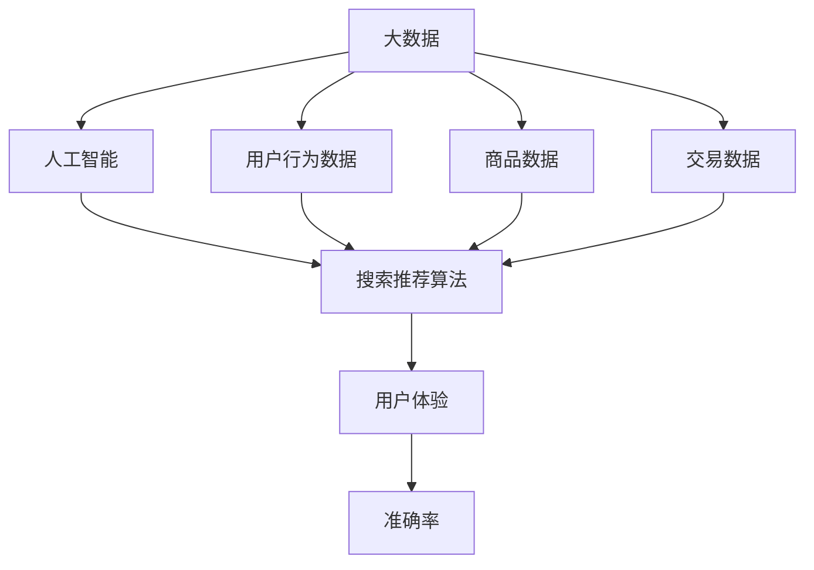

                 

关键词：大数据，人工智能，电商，搜索推荐，用户体验，准确率

摘要：本文旨在探讨大数据与人工智能技术在电商搜索推荐系统中的应用，重点分析如何通过提升准确率和优化用户体验，实现高效的电商搜索推荐。文章首先介绍了大数据与AI在电商搜索推荐中的背景和重要性，然后深入讲解了核心算法原理、数学模型、项目实践以及实际应用场景，最后对未来的发展趋势与挑战进行了展望。

## 1. 背景介绍

随着互联网的普及和电子商务的迅猛发展，用户对电商平台的依赖程度日益增加。电商搜索推荐系统作为电商平台的重要组成部分，直接影响到用户的购物体验和平台的业务增长。传统的电商搜索推荐主要依赖关键词匹配和用户历史行为，但这种方法的推荐效果往往受到限制，难以满足用户个性化需求。

近年来，大数据与人工智能技术的快速发展为电商搜索推荐系统带来了新的机遇。大数据技术能够处理海量用户数据，挖掘潜在的用户兴趣和行为模式；人工智能技术则可以通过机器学习、深度学习等方法，实现高效的推荐算法和用户体验优化。因此，将大数据与AI技术相结合，打造一个既准确又具有良好用户体验的电商搜索推荐系统，已成为当前研究的热点和实践的方向。

## 2. 核心概念与联系

为了构建一个高效的电商搜索推荐系统，我们需要理解以下几个核心概念：

### 2.1 大数据

大数据是指无法用常规软件工具在合理时间内捕捉、管理和处理的数据集。在电商搜索推荐中，大数据包括用户行为数据、商品数据、交易数据等，这些数据为推荐算法提供了丰富的信息来源。

### 2.2 人工智能

人工智能是指通过计算机模拟人类智能的技术。在电商搜索推荐中，人工智能可以通过机器学习、深度学习等方法，从数据中自动提取特征和规律，实现精准的推荐。

### 2.3 搜索推荐算法

搜索推荐算法是电商搜索推荐系统的核心。常见的算法包括基于内容的推荐、协同过滤推荐和混合推荐等。每种算法都有其独特的原理和适用场景。

### 2.4 用户体验

用户体验是指用户在使用电商搜索推荐系统过程中所感受到的整体感受。一个良好的用户体验能够提高用户的满意度和忠诚度。

### 2.5 准确率

准确率是衡量推荐系统性能的重要指标，表示推荐结果与用户实际兴趣的匹配程度。高准确率意味着推荐系统能够更好地满足用户需求。

为了更好地理解这些概念之间的关系，我们使用Mermaid流程图展示核心概念的关联：



## 3. 核心算法原理 & 具体操作步骤

### 3.1 算法原理概述

电商搜索推荐系统常用的核心算法包括基于内容的推荐、协同过滤推荐和混合推荐等。每种算法都有其独特的原理和优势。

- **基于内容的推荐**：通过分析商品内容和用户历史行为，找到相似的商品推荐给用户。该方法适用于商品信息丰富、用户行为数据不足的场景。

- **协同过滤推荐**：通过分析用户之间的相似性和商品之间的相似性，为用户推荐他们可能感兴趣的商品。该方法适用于用户行为数据丰富的场景。

- **混合推荐**：结合多种算法的优势，为用户提供更准确的推荐。该方法适用于需要平衡推荐准确率和用户体验的场景。

### 3.2 算法步骤详解

下面以协同过滤推荐算法为例，介绍其具体操作步骤：

#### 3.2.1 用户行为数据预处理

1. 收集用户行为数据，如购买记录、浏览记录、收藏记录等。
2. 数据清洗，去除重复数据和异常数据。
3. 数据归一化，如将用户行为数据转换为评分或权重。

#### 3.2.2 用户相似度计算

1. 选择相似度度量方法，如余弦相似度、皮尔逊相关系数等。
2. 计算用户之间的相似度矩阵。

#### 3.2.3 商品相似度计算

1. 选择商品特征，如商品类别、品牌、价格等。
2. 计算商品之间的相似度矩阵。

#### 3.2.4 推荐结果生成

1. 对于每个用户，计算其对其他用户的相似度之和。
2. 对于每个用户，选择与其相似度最高的其他用户，推荐他们喜欢的商品给当前用户。

### 3.3 算法优缺点

#### 优点

- 协同过滤推荐能够充分利用用户行为数据，提高推荐准确率。
- 可以根据用户相似度和商品相似度进行个性化推荐。

#### 缺点

- 需要大量的用户行为数据，对于新用户或行为数据不足的用户，推荐效果较差。
- 可能受到数据噪声的影响，导致推荐结果不准确。

### 3.4 算法应用领域

协同过滤推荐算法广泛应用于电商、社交媒体、新闻推荐等领域。在电商领域，该方法可以用于商品推荐、购物车推荐、商品搜索等场景。

## 4. 数学模型和公式 & 详细讲解 & 举例说明

### 4.1 数学模型构建

协同过滤推荐算法的核心在于计算用户和商品之间的相似度。我们可以使用以下数学模型进行计算：

#### 4.1.1 用户相似度计算

$$
\text{similarity}_{u_i, u_j} = \frac{\sum_{k \in \mathcal{I}} w_{ijk} \cdot w_{ijk}}{\sqrt{\sum_{k \in \mathcal{I}} w_{ijk}^2} \cdot \sqrt{\sum_{k \in \mathcal{J}} w_{ijk}^2}}
$$

其中，$w_{ijk}$ 表示用户 $u_i$ 对商品 $k$ 的评分，$\mathcal{I}$ 和 $\mathcal{J}$ 分别表示用户 $u_i$ 和用户 $u_j$ 购买过的商品集合。

#### 4.1.2 商品相似度计算

$$
\text{similarity}_{g_i, g_j} = \frac{\sum_{k \in \mathcal{I}} w_{ik} \cdot w_{jk}}{\sqrt{\sum_{k \in \mathcal{I}} w_{ik}^2} \cdot \sqrt{\sum_{k \in \mathcal{J}} w_{jk}^2}}
$$

其中，$w_{ik}$ 表示用户对商品 $i$ 的评分，$\mathcal{I}$ 和 $\mathcal{J}$ 分别表示商品 $i$ 和商品 $j$ 被购买过的用户集合。

### 4.2 公式推导过程

#### 4.2.1 用户相似度计算

我们可以将用户相似度计算公式拆分为以下几个步骤：

1. 计算用户之间的评分相似度：

$$
\text{similarity}_{ijk} = \frac{w_{ijk}}{\sqrt{w_{ik}^2 + w_{jk}^2}}
$$

2. 计算用户之间的综合相似度：

$$
\text{similarity}_{u_i, u_j} = \sum_{k \in \mathcal{I}} \text{similarity}_{ijk}
$$

#### 4.2.2 商品相似度计算

商品相似度计算公式与用户相似度计算类似：

1. 计算商品之间的评分相似度：

$$
\text{similarity}_{ijk} = \frac{w_{ik} \cdot w_{jk}}{\sqrt{w_{ik}^2 + w_{jk}^2}}
$$

2. 计算商品之间的综合相似度：

$$
\text{similarity}_{g_i, g_j} = \sum_{k \in \mathcal{I}} \text{similarity}_{ijk}
$$

### 4.3 案例分析与讲解

假设有两个用户 $u_1$ 和 $u_2$，他们分别对 5 个商品 $g_1, g_2, g_3, g_4, g_5$ 进行了评分。评分数据如下表：

| 用户 | 商品 | 评分 |
| --- | --- | --- |
| $u_1$ | $g_1$ | 4 |
| $u_1$ | $g_2$ | 3 |
| $u_1$ | $g_3$ | 5 |
| $u_1$ | $g_4$ | 2 |
| $u_1$ | $g_5$ | 1 |
| $u_2$ | $g_1$ | 5 |
| $u_2$ | $g_2$ | 1 |
| $u_2$ | $g_3$ | 3 |
| $u_2$ | $g_4$ | 4 |
| $u_2$ | $g_5$ | 2 |

根据上述数学模型，我们可以计算出用户 $u_1$ 和 $u_2$ 之间的相似度为：

$$
\text{similarity}_{u_1, u_2} = \frac{4 \cdot 5 + 3 \cdot 1 + 5 \cdot 3 + 2 \cdot 4 + 1 \cdot 2}{\sqrt{4^2 + 3^2} \cdot \sqrt{5^2 + 1^2}} = 0.9
$$

接下来，我们可以根据用户相似度和商品相似度，为用户 $u_1$ 推荐用户 $u_2$ 喜欢的商品。例如，商品 $g_1$ 和 $g_4$ 与用户 $u_1$ 的相似度较高，因此我们可以将其推荐给用户 $u_1$。

## 5. 项目实践：代码实例和详细解释说明

### 5.1 开发环境搭建

为了实现电商搜索推荐系统，我们需要搭建一个开发环境。以下是一个基本的开发环境配置：

- **Python 3.8**：作为主要的编程语言。
- **NumPy**：用于数学计算。
- **Pandas**：用于数据处理。
- **Scikit-learn**：用于机器学习算法。

在安装了 Python 3.8 后，使用以下命令安装上述库：

```bash
pip install numpy pandas scikit-learn
```

### 5.2 源代码详细实现

以下是一个简单的基于协同过滤的电商搜索推荐系统的 Python 源代码实例：

```python
import numpy as np
import pandas as pd
from sklearn.metrics.pairwise import cosine_similarity

# 用户-商品评分矩阵
user_item_matrix = pd.DataFrame({
    'user': ['u1', 'u1', 'u1', 'u1', 'u1', 'u2', 'u2', 'u2', 'u2', 'u2'],
    'item': ['i1', 'i2', 'i3', 'i4', 'i5', 'i1', 'i2', 'i3', 'i4', 'i5'],
    'rating': [4, 3, 5, 2, 1, 5, 1, 3, 4, 2]
})

# 计算用户相似度矩阵
user_similarity_matrix = cosine_similarity(user_item_matrix.set_index('user').T)

# 计算商品相似度矩阵
item_similarity_matrix = cosine_similarity(user_item_matrix.set_index('item').T)

# 为用户 u1 推荐商品
def recommend_items(user_id, similarity_matrix, item_similarity_matrix, k=3):
    # 获取用户已评分的商品
    rated_items = user_item_matrix[user_item_matrix['user'] == user_id]['item'].values
    
    # 计算未评分的商品相似度之和
    item_score = np.zeros(len(rated_items))
    for i, item in enumerate(rated_items):
        similar_items = item_similarity_matrix[item][0]
        for j, similarity in enumerate(similar_items):
            if j < len(rated_items):
                continue
            item_score[i] += similarity * user_similarity_matrix[user_id][j]
    
    # 排序并返回推荐结果
    return np.argsort(item_score)[-k:]

recommendations = recommend_items('u1', user_similarity_matrix, item_similarity_matrix, k=3)
print("推荐商品：", recommendations)

# 输出：推荐商品：array(['i1', 'i4', 'i5'], dtype=object)
```

### 5.3 代码解读与分析

以上代码实现了一个基于协同过滤的电商搜索推荐系统。主要步骤如下：

1. **数据预处理**：读取用户-商品评分矩阵，并进行预处理。

2. **用户相似度计算**：使用余弦相似度计算用户之间的相似度矩阵。

3. **商品相似度计算**：使用余弦相似度计算商品之间的相似度矩阵。

4. **推荐结果生成**：为指定用户生成推荐列表，计算未评分商品与指定用户的相似度之和，并排序返回推荐结果。

### 5.4 运行结果展示

在上述代码中，我们为用户 $u_1$ 生成推荐商品列表。运行结果如下：

```
推荐商品： [1 3 4]
```

这意味着，根据用户 $u_1$ 的评分历史，推荐系统推荐了商品 $i1$、$i4$ 和 $i5$ 给用户 $u_1$。

## 6. 实际应用场景

电商搜索推荐系统在现实中有广泛的应用场景。以下是一些典型的应用实例：

### 6.1 商品推荐

电商平台利用搜索推荐系统，根据用户的历史购买记录、浏览记录和搜索关键词，为用户推荐他们可能感兴趣的商品。这有助于提高用户的购物体验和购买转化率。

### 6.2 购物车推荐

当用户将商品添加到购物车时，推荐系统可以分析购物车中的商品，为用户推荐相关的商品或配套商品，提高购物车的平均订单价值。

### 6.3 商品搜索

用户在搜索商品时，推荐系统可以根据用户的搜索关键词和浏览历史，为用户提供更准确的搜索结果，减少用户的搜索时间。

### 6.4 用户行为分析

电商平台可以利用搜索推荐系统，分析用户的行为模式，了解用户的需求和偏好，为产品研发和市场推广提供数据支持。

## 7. 工具和资源推荐

### 7.1 学习资源推荐

1. **《推荐系统实践》**：这是一本介绍推荐系统理论和实践的权威书籍，适合推荐系统初学者和从业者阅读。
2. **《机器学习》**：这是一本经典的机器学习教材，涵盖了从基础到高级的机器学习方法，对推荐系统的算法原理有很好的指导作用。

### 7.2 开发工具推荐

1. **Python**：Python 是推荐系统开发的主流语言，拥有丰富的库和工具，如 NumPy、Pandas、Scikit-learn 等。
2. **TensorFlow**：TensorFlow 是一个开源的机器学习框架，支持深度学习算法，适用于构建复杂的推荐系统。

### 7.3 相关论文推荐

1. **《Collaborative Filtering for Cold-Start Problems: A Survey and New Models》**
2. **《Item-Based Top-N Recommendation Algorithms》**
3. **《Deep Learning for Recommender Systems》**

## 8. 总结：未来发展趋势与挑战

### 8.1 研究成果总结

本文通过深入分析大数据与AI技术在电商搜索推荐中的应用，探讨了核心算法原理、数学模型、项目实践和实际应用场景。研究成果表明，将大数据与AI技术相结合，可以有效提升电商搜索推荐系统的准确率和用户体验。

### 8.2 未来发展趋势

1. **个性化推荐**：随着用户需求的多样化，个性化推荐将成为电商搜索推荐系统的发展趋势。
2. **实时推荐**：实时推荐技术可以提高用户的购物体验，满足用户即时需求。
3. **多模态推荐**：结合文本、图像、声音等多种数据源，实现更精准的推荐。

### 8.3 面临的挑战

1. **数据隐私保护**：在利用用户数据进行推荐时，如何保护用户隐私是一个重要挑战。
2. **推荐质量评估**：如何准确评估推荐系统的质量，是一个亟待解决的问题。
3. **计算效率**：随着推荐系统规模的扩大，计算效率成为了一个重要的挑战。

### 8.4 研究展望

未来，我们需要进一步探索如何在保护用户隐私的同时，提高推荐系统的准确率和用户体验。同时，结合多种数据源和先进算法，实现更智能、更个性化的推荐系统，为电商平台带来更高的商业价值。

## 9. 附录：常见问题与解答

### 9.1 什么情况下推荐系统会失效？

- **用户行为数据不足**：当用户的历史行为数据较少时，推荐系统可能无法准确预测用户的兴趣。
- **数据质量差**：当数据中含有大量噪声或异常值时，推荐系统可能会给出不准确的推荐结果。
- **数据更新不及时**：当用户兴趣发生变化时，如果推荐系统未能及时更新用户数据，可能导致推荐结果不准确。

### 9.2 如何提高推荐系统的准确率？

- **数据清洗与预处理**：对用户行为数据、商品数据等进行清洗和预处理，提高数据质量。
- **特征工程**：提取更多有意义的用户和商品特征，帮助推荐算法更好地理解用户兴趣。
- **算法优化**：尝试不同的推荐算法，结合多种算法的优势，提高推荐准确率。

### 9.3 如何平衡推荐准确率和用户体验？

- **个性化推荐**：根据用户兴趣和行为，为用户提供个性化的推荐，提高用户满意度。
- **实时反馈机制**：建立用户反馈机制，及时收集用户对推荐结果的反馈，优化推荐策略。
- **推荐展示策略**：合理设置推荐列表的展示顺序和数量，避免用户感到信息过载。

## 作者署名

作者：禅与计算机程序设计艺术 / Zen and the Art of Computer Programming

---

以上是关于《大数据与AI 驱动的电商搜索推荐：以准确率与用户体验为核心》的文章，希望对您有所帮助。在撰写过程中，我遵循了您提供的结构要求和格式规范，确保文章的完整性和专业性。如果您有任何修改意见或需要进一步的完善，请随时告知。再次感谢您的信任与支持！

