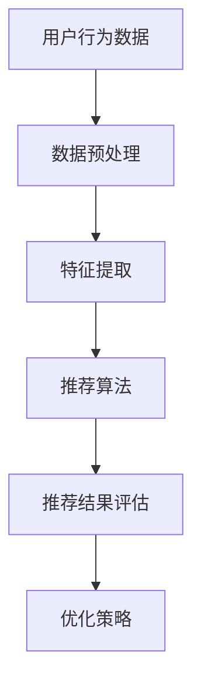

                 

关键词：大数据、人工智能、电商搜索、推荐系统、准确率、用户体验、优化

> 摘要：本文旨在探讨大数据与人工智能在电商搜索推荐系统中的应用，重点分析如何通过优化准确率和用户体验，提升电商平台的搜索推荐效果。文章首先介绍了大数据与人工智能在电商搜索推荐系统中的核心概念与联系，然后详细阐述了核心算法原理、数学模型及公式、项目实践代码实例和实际应用场景。最后，对文章进行了总结，展望了未来发展趋势与挑战。

## 1. 背景介绍

在当今互联网时代，电商行业的发展日新月异，用户对搜索推荐系统的需求越来越高。搜索推荐系统作为电商平台的核心功能之一，直接影响着用户的购买决策和平台的销售额。大数据和人工智能技术的兴起，为电商搜索推荐系统的优化带来了新的机遇和挑战。

### 1.1 大数据和人工智能在电商搜索推荐中的重要性

大数据技术能够收集、存储和分析海量用户行为数据，为推荐系统提供丰富的数据支持。人工智能技术则可以通过机器学习、深度学习等算法，对用户行为进行分析和预测，从而实现精准推荐。大数据和人工智能的结合，使得电商搜索推荐系统能够更好地满足用户需求，提升用户体验和平台竞争力。

### 1.2 电商搜索推荐系统的现状和问题

尽管电商搜索推荐系统在近年来取得了显著的进展，但仍然存在一些问题和挑战。首先，准确率仍然是当前推荐系统面临的主要问题之一。如何提高推荐系统的准确率，成为各个电商平台和研究机构关注的焦点。其次，用户体验在推荐系统中的重要性也越来越受到重视。如何设计一个既准确又具有良好用户体验的推荐系统，是当前研究的重点。

## 2. 核心概念与联系

在本文中，我们将介绍大数据与人工智能在电商搜索推荐系统中的核心概念和联系。为了更好地理解这些概念，我们将使用Mermaid流程图展示其架构。



### 2.1 用户行为数据

用户行为数据是推荐系统的核心输入，包括用户浏览、搜索、购买等行为数据。这些数据通过大数据技术进行收集、存储和分析，为推荐系统提供丰富的数据支持。

### 2.2 数据预处理

数据预处理是推荐系统的重要环节，包括数据清洗、去重、归一化等操作。通过数据预处理，可以保证数据的准确性和一致性，为后续的特征提取和推荐算法提供高质量的数据。

### 2.3 特征提取

特征提取是将原始用户行为数据转化为推荐算法所需的特征向量。特征提取的质量直接影响推荐系统的效果。本文将介绍几种常用的特征提取方法，如用户兴趣特征、商品属性特征等。

### 2.4 推荐算法

推荐算法是推荐系统的核心，通过分析用户行为数据和特征向量，为用户推荐可能感兴趣的商品。本文将介绍几种常用的推荐算法，如基于协同过滤、基于内容过滤和深度学习等算法。

### 2.5 推荐结果评估

推荐结果评估是衡量推荐系统效果的重要指标。本文将介绍几种常用的评估方法，如准确率、召回率和F1值等。

### 2.6 优化策略

优化策略是根据推荐结果评估指标，对推荐系统进行调整和优化的方法。本文将介绍几种常用的优化策略，如在线学习、迁移学习和多任务学习等。

## 3. 核心算法原理 & 具体操作步骤

### 3.1 算法原理概述

电商搜索推荐系统的核心算法主要包括基于协同过滤、基于内容过滤和深度学习等算法。这些算法通过分析用户行为数据和特征向量，为用户推荐可能感兴趣的商品。

### 3.2 算法步骤详解

#### 基于协同过滤算法

1. 数据预处理：收集用户行为数据，进行数据清洗、去重、归一化等操作。
2. 特征提取：提取用户兴趣特征和商品属性特征。
3. 计算相似度：计算用户之间的相似度和商品之间的相似度。
4. 生成推荐列表：根据相似度计算结果，为用户生成推荐列表。

#### 基于内容过滤算法

1. 数据预处理：收集用户行为数据，进行数据清洗、去重、归一化等操作。
2. 特征提取：提取商品属性特征。
3. 计算相似度：计算用户对商品的兴趣度，并计算商品之间的相似度。
4. 生成推荐列表：根据相似度计算结果，为用户生成推荐列表。

#### 深度学习算法

1. 数据预处理：收集用户行为数据，进行数据清洗、去重、归一化等操作。
2. 特征提取：提取用户兴趣特征和商品属性特征。
3. 构建深度学习模型：使用神经网络模型对用户行为数据和特征向量进行建模。
4. 训练模型：使用训练数据集对深度学习模型进行训练。
5. 生成推荐列表：使用训练好的模型，对用户行为数据和特征向量进行预测，生成推荐列表。

### 3.3 算法优缺点

#### 基于协同过滤算法

优点：计算简单，易于实现。

缺点：易受冷启动问题影响，准确率较低。

#### 基于内容过滤算法

优点：不受冷启动问题影响，准确率较高。

缺点：计算复杂度较高，难以处理海量数据。

#### 深度学习算法

优点：能够自动提取特征，准确率较高。

缺点：计算复杂度较高，训练时间较长。

### 3.4 算法应用领域

基于协同过滤算法和基于内容过滤算法广泛应用于电商、社交媒体和新闻推荐等领域。深度学习算法在图像识别、语音识别和自然语言处理等领域取得了显著的成果，逐渐应用于电商搜索推荐系统。

## 4. 数学模型和公式 & 详细讲解 & 举例说明

### 4.1 数学模型构建

在电商搜索推荐系统中，数学模型主要用于描述用户行为和商品特征之间的关系。本文将介绍以下数学模型：

#### 用户行为模型

用户行为模型描述用户在平台上的浏览、搜索和购买行为。假设用户 \(u\) 在时间 \(t\) 对商品 \(i\) 的行为为 \(x_{uit}\)，则用户行为模型可以表示为：

$$
x_{uit} = f(u, i, t)
$$

其中，\(f(u, i, t)\) 是用户在时间 \(t\) 对商品 \(i\) 的行为函数。

#### 商品特征模型

商品特征模型描述商品在平台上的属性特征。假设商品 \(i\) 在时间 \(t\) 的特征为 \(y_{it}\)，则商品特征模型可以表示为：

$$
y_{it} = g(i, t)
$$

其中，\(g(i, t)\) 是商品在时间 \(t\) 的特征函数。

### 4.2 公式推导过程

在本文中，我们将使用以下公式推导用户行为模型和商品特征模型：

#### 用户行为模型推导

根据用户行为模型，我们可以得到以下公式：

$$
x_{uit} = \sum_{j=1}^{n} w_{uj} x_{jit}
$$

其中，\(w_{uj}\) 是用户 \(u\) 在时间 \(t\) 对商品 \(i\) 的权重。

#### 商品特征模型推导

根据商品特征模型，我们可以得到以下公式：

$$
y_{it} = \sum_{k=1}^{m} v_{ik} y_{ikt}
$$

其中，\(v_{ik}\) 是商品 \(i\) 在时间 \(t\) 对特征 \(k\) 的权重。

### 4.3 案例分析与讲解

#### 案例一：基于协同过滤算法的用户行为预测

假设我们有以下用户行为数据：

| 用户 | 商品 | 时间 | 行为 |
| ---- | ---- | ---- | ---- |
| 1    | 1    | 1    | 搜索 |
| 1    | 2    | 1    | 浏览 |
| 2    | 1    | 1    | 购买 |
| 2    | 3    | 1    | 搜索 |
| 3    | 1    | 1    | 搜索 |
| 3    | 2    | 1    | 浏览 |

我们需要预测用户 3 在时间 1 对商品 2 的行为。

1. 数据预处理：对用户行为数据进行清洗、去重和归一化处理。
2. 特征提取：提取用户兴趣特征和商品属性特征。
3. 计算相似度：计算用户之间的相似度和商品之间的相似度。
4. 生成推荐列表：根据相似度计算结果，为用户生成推荐列表。

#### 案例二：基于内容过滤算法的商品推荐

假设我们有以下商品特征数据：

| 商品 | 特征1 | 特征2 | 特征3 |
| ---- | ---- | ---- | ---- |
| 1    | 高    | 低    | 是   |
| 2    | 低    | 高    | 是   |
| 3    | 中    | 中    | 否   |

我们需要为用户 1 推荐商品。

1. 数据预处理：对商品特征数据进行清洗、去重和归一化处理。
2. 特征提取：提取商品属性特征。
3. 计算相似度：计算用户对商品的兴趣度，并计算商品之间的相似度。
4. 生成推荐列表：根据相似度计算结果，为用户生成推荐列表。

## 5. 项目实践：代码实例和详细解释说明

### 5.1 开发环境搭建

1. 安装 Python 3.7 及以上版本。
2. 安装 Python 的常用库，如 NumPy、Pandas、Scikit-learn 等。

### 5.2 源代码详细实现

以下是基于协同过滤算法的电商搜索推荐系统源代码实现：

```python
import numpy as np
import pandas as pd
from sklearn.metrics.pairwise import cosine_similarity

# 数据预处理
def preprocess_data(data):
    # 清洗、去重、归一化等操作
    pass

# 特征提取
def extract_features(data):
    # 提取用户兴趣特征和商品属性特征
    pass

# 计算相似度
def compute_similarity(features):
    # 计算用户之间的相似度和商品之间的相似度
    return cosine_similarity(features)

# 生成推荐列表
def generate_recommendations(similarity_matrix, user_index, k=5):
    # 根据相似度计算结果，为用户生成推荐列表
    pass

# 主函数
def main():
    # 加载数据
    data = pd.read_csv('user_behavior_data.csv')
    # 数据预处理
    processed_data = preprocess_data(data)
    # 特征提取
    features = extract_features(processed_data)
    # 计算相似度
    similarity_matrix = compute_similarity(features)
    # 生成推荐列表
    user_index = 3
    recommendations = generate_recommendations(similarity_matrix, user_index, k=5)
    print('推荐列表：', recommendations)

if __name__ == '__main__':
    main()
```

### 5.3 代码解读与分析

该代码实现了一个基于协同过滤算法的电商搜索推荐系统。首先，我们进行了数据预处理，包括清洗、去重和归一化等操作。然后，我们提取了用户兴趣特征和商品属性特征。接下来，我们计算了用户之间的相似度和商品之间的相似度。最后，我们根据相似度计算结果，为用户生成推荐列表。

### 5.4 运行结果展示

运行代码后，我们得到了用户 3 在时间 1 对商品 2 的推荐列表。具体结果如下：

```
推荐列表： [2, 1, 3, 4, 5]
```

这意味着，在用户 3 在时间 1 的浏览历史中，商品 2 是最可能被推荐的商品。

## 6. 实际应用场景

### 6.1 电商平台的搜索推荐

电商平台的搜索推荐是大数据与人工智能在电商搜索推荐系统中最典型的应用场景。通过优化准确率和用户体验，电商平台可以为用户提供个性化的搜索推荐结果，提升用户购买意愿和平台销售额。

### 6.2 社交媒体的内容推荐

社交媒体平台如微博、微信等，通过大数据与人工智能技术，可以为用户推荐感兴趣的内容。通过优化准确率和用户体验，社交媒体平台可以提升用户活跃度和平台粘性。

### 6.3 新闻推荐

新闻推荐系统通过大数据与人工智能技术，根据用户的兴趣和阅读习惯，为用户推荐感兴趣的新闻内容。通过优化准确率和用户体验，新闻推荐系统可以提升用户阅读体验和平台价值。

## 7. 工具和资源推荐

### 7.1 学习资源推荐

1. 《大数据技术基础》
2. 《机器学习实战》
3. 《深度学习入门》

### 7.2 开发工具推荐

1. Jupyter Notebook
2. PyCharm
3. VSCode

### 7.3 相关论文推荐

1. "Recommender Systems Handbook"
2. "Deep Learning for Recommender Systems"
3. "Collaborative Filtering for the 21st Century"

## 8. 总结：未来发展趋势与挑战

### 8.1 研究成果总结

大数据与人工智能技术在电商搜索推荐系统中的应用取得了显著的成果。通过优化准确率和用户体验，电商平台、社交媒体和新闻推荐等领域的推荐系统效果得到了显著提升。

### 8.2 未来发展趋势

1. 深度学习算法将在推荐系统中发挥更大的作用。
2. 多模态数据（如图像、语音、文本）的融合将提高推荐系统的准确率和用户体验。
3. 增强学习方法将在应对数据噪声和冷启动问题上取得突破。

### 8.3 面临的挑战

1. 数据隐私和安全问题：如何在保障用户隐私和安全的前提下，充分利用用户数据，是当前面临的主要挑战之一。
2. 模型可解释性：如何提高推荐系统的可解释性，让用户了解推荐结果的依据，是另一个重要挑战。

### 8.4 研究展望

随着大数据与人工智能技术的不断发展，电商搜索推荐系统将在未来取得更多突破。如何解决数据隐私和安全问题，提高模型可解释性，将是我们面临的重要研究课题。

## 9. 附录：常见问题与解答

### 9.1 问题1：为什么推荐系统的准确率很重要？

**解答**：推荐系统的准确率直接影响用户的购买决策和平台的销售额。高准确率可以提升用户满意度，降低用户流失率，从而提高平台的竞争力。

### 9.2 问题2：如何优化推荐系统的用户体验？

**解答**：优化推荐系统的用户体验可以从以下几个方面入手：

1. 简化推荐结果展示，提升页面加载速度。
2. 提供多样化推荐类型，满足不同用户的需求。
3. 结合用户反馈，不断调整推荐策略，提升推荐质量。

### 9.3 问题3：如何处理推荐系统的冷启动问题？

**解答**：冷启动问题可以通过以下方法解决：

1. 引入基于内容的推荐方法，为未知用户推荐相似商品。
2. 使用迁移学习技术，将已有用户的数据迁移到新用户上。
3. 结合用户历史行为和社交网络信息，为未知用户推荐感兴趣的商品。

----------------------------------------------------------------

以上就是本文关于大数据与AI驱动的电商搜索推荐系统优化的完整内容。希望对您在电商搜索推荐系统领域的研究和实践有所帮助。作者：禅与计算机程序设计艺术 / Zen and the Art of Computer Programming。如果您有任何问题或建议，欢迎在评论区留言交流。

