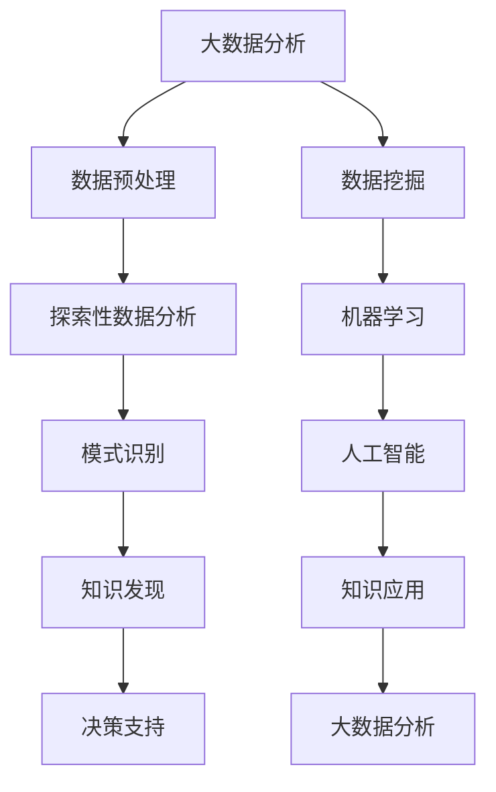

                 

关键词：大数据分析，知识发现，数据挖掘，机器学习，人工智能

摘要：本文旨在探讨大数据分析与知识发现之间的关系，阐述大数据分析在知识发现过程中的重要作用，以及知识发现如何反过来促进大数据分析的发展。通过对核心概念、算法原理、数学模型、实际应用和未来展望的深入剖析，本文为读者提供了一个全面而系统的视角，以理解这两大领域如何相互作用，共同推动科技进步和社会发展。

## 1. 背景介绍

### 大数据的兴起

随着互联网的迅猛发展，我们每天生成和接收的数据量呈指数级增长。这些数据包含了各种形式的信息，从文本、图片到音频和视频。大数据的兴起源于对这种海量数据的有效管理和分析的需求。大数据分析旨在从这些海量数据中提取有价值的信息和洞察。

### 知识发现的定义

知识发现（Knowledge Discovery in Databases，简称KDD）是指从大量数据中提取出有用信息的过程，这些信息通常以模式、关联、趋势或规律的形式呈现。知识发现的目标是发现数据背后的隐藏知识和规律，从而帮助决策和解决问题。

### 大数据分析与知识发现的关系

大数据分析为知识发现提供了强有力的工具和方法。通过大数据分析，我们可以对海量数据进行预处理、探索性数据分析、模式识别等操作，从而发现潜在的知识。同时，知识发现的结果又可以指导大数据分析的方向和目标，形成一个闭环的反馈过程。

## 2. 核心概念与联系

### 大数据

- **定义**：大数据通常指的是数据量巨大、数据类型多样、数据生成速度极快的数据集。
- **特点**：4V特性，即大量（Volume）、多样（Variety）、快速（Velocity）和真实（Veracity）。
- **处理方法**：分布式计算、并行处理、存储优化等技术。

### 知识发现

- **定义**：知识发现是从大量数据中提取出有用信息和知识的过程。
- **步骤**：数据清洗、数据集成、数据选择、数据变换、模式识别、模式评估、知识表示和解释。
- **目的**：帮助用户更好地理解数据，支持决策制定。

### 关系图（使用Mermaid绘制）



## 3. 核心算法原理 & 具体操作步骤

### 3.1 算法原理概述

大数据分析与知识发现涉及多种算法，包括但不限于：

- **数据挖掘算法**：如K-均值聚类、Apriori算法、关联规则学习等。
- **机器学习算法**：如线性回归、决策树、神经网络等。
- **深度学习算法**：如卷积神经网络（CNN）、循环神经网络（RNN）等。

### 3.2 算法步骤详解

1. **数据预处理**：
   - 数据清洗：处理缺失值、异常值、重复值等。
   - 数据集成：合并来自不同源的数据。
   - 数据转换：将数据转换为适合分析的格式。

2. **探索性数据分析**：
   - 数据可视化：通过图表展示数据特征。
   - 数据分布分析：了解数据的基本统计信息。

3. **模式识别**：
   - 聚类分析：将数据分为多个类别。
   - 关联规则学习：发现数据之间的关联性。
   - 异常检测：识别数据中的异常点。

4. **知识发现**：
   - 模式评估：评估发现的模式是否具有实际意义。
   - 知识表示：将发现的模式表示为可解释的知识。
   - 知识解释：对知识进行解释，以便用户理解。

### 3.3 算法优缺点

- **数据挖掘算法**：
  - 优点：简单易用，适合处理结构化数据。
  - 缺点：对复杂数据的处理能力有限。

- **机器学习算法**：
  - 优点：自适应能力强，适合处理非结构化数据。
  - 缺点：对数据质量要求较高。

- **深度学习算法**：
  - 优点：高度自动化的特征提取，适合处理大规模数据。
  - 缺点：计算资源需求高，对数据质量要求较高。

### 3.4 算法应用领域

- **金融**：风险评估、信用评分、市场预测等。
- **医疗**：疾病诊断、个性化治疗、药物研发等。
- **电商**：客户行为分析、推荐系统、广告投放等。
- **社交网络**：用户行为分析、社交图谱构建、情感分析等。

## 4. 数学模型和公式 & 详细讲解 & 举例说明

### 4.1 数学模型构建

在知识发现过程中，常用的数学模型包括：

- **聚类模型**：
  - 奇异值分解（SVD）
  - 主成分分析（PCA）

- **关联规则学习模型**：
  - Apriori算法
  - FP-Growth算法

- **分类模型**：
  - 决策树
  - 线性回归

### 4.2 公式推导过程

以主成分分析（PCA）为例，其基本思想是将原始数据映射到新的坐标系中，使得新的坐标轴能够最大化数据的方差。PCA的推导过程如下：

- **协方差矩阵**：
  $$\Sigma = \frac{1}{n-1}XX^T$$

- **特征值和特征向量**：
  $$\Sigma v = \lambda v$$

- **主成分**：
  $$z = PV$$

其中，$P$是对角矩阵，对角线上的元素是特征值，$V$是特征向量矩阵。

### 4.3 案例分析与讲解

假设我们有100个数据点，每个数据点有10个特征。我们使用PCA来降维，目标是保留80%的信息。

1. **计算协方差矩阵**：
   $$\Sigma = \frac{1}{99}XX^T$$

2. **计算特征值和特征向量**：
   使用SVD分解协方差矩阵，得到：
   $$\Sigma = U\Lambda V^T$$

   其中，$U$和$V$是正交矩阵，$\Lambda$是对角矩阵，对角线上的元素是特征值。

3. **选择主成分**：
   计算特征值的累积和，选择前两个特征值对应的特征向量作为主成分。

4. **降维**：
   将原始数据映射到新的二维空间：
   $$z = PV$$

   结果显示，大部分数据点在新的二维空间中仍然保持良好的分布，只有少数数据点发生了较大的位移，这表明PCA成功地减少了数据的冗余，保留了主要的信息。

## 5. 项目实践：代码实例和详细解释说明

### 5.1 开发环境搭建

为了进行大数据分析和知识发现，我们使用Python作为主要编程语言，结合以下库：

- Pandas：用于数据处理。
- NumPy：用于数学计算。
- Scikit-learn：用于机器学习和数据挖掘。
- Matplotlib：用于数据可视化。

安装这些库后，即可开始编写代码。

### 5.2 源代码详细实现

以下是一个使用PCA进行降维的示例代码：

```python
import numpy as np
import pandas as pd
from sklearn.decomposition import PCA
import matplotlib.pyplot as plt

# 加载数据
data = pd.read_csv('data.csv')

# 计算协方差矩阵
cov_matrix = np.cov(data.values.T)

# 使用SVD分解协方差矩阵
U, S, V = np.linalg.svd(cov_matrix)

# 选择主成分
cumulative_variance = np.cumsum(S / S.sum())
plt.plot(cumulative_variance)
plt.xlabel('Number of Components')
plt.ylabel('Cumulative Variance')
plt.show()

# 选择保留80%信息的两个主成分
pca = PCA(n_components=2)
X_pca = pca.fit_transform(data.values)

# 可视化降维后的数据
plt.scatter(X_pca[:, 0], X_pca[:, 1])
plt.xlabel('Principal Component 1')
plt.ylabel('Principal Component 2')
plt.show()
```

### 5.3 代码解读与分析

1. **加载数据**：使用Pandas加载CSV文件，这是我们的输入数据。
2. **计算协方差矩阵**：计算数据的协方差矩阵，这是PCA的基础。
3. **使用SVD分解**：使用SVD分解协方差矩阵，得到特征值和特征向量。
4. **选择主成分**：根据累积方差，选择保留80%信息的两个主成分。
5. **降维**：将原始数据映射到新的二维空间。
6. **可视化**：使用Matplotlib绘制降维后的数据点。

### 5.4 运行结果展示

运行上述代码后，我们首先会看到特征值的累积方差图，该图展示了保留不同数量主成分时累积的方差比例。接下来，我们会看到降维后的数据点分布图，大部分数据点仍然在二维空间中保持良好的分布。

## 6. 实际应用场景

### 6.1 金融领域

- **风险评估**：通过大数据分析，金融机构可以评估贷款申请者的信用风险，从而制定更精确的贷款策略。
- **市场预测**：利用历史交易数据和新闻文本，分析市场趋势，帮助投资者做出更明智的决策。

### 6.2 医疗领域

- **疾病诊断**：通过分析患者的电子健康记录和生物标志物数据，辅助医生进行疾病诊断。
- **个性化治疗**：根据患者的基因数据和生活习惯，制定个性化的治疗方案。

### 6.3 电商领域

- **客户行为分析**：通过分析客户的购买历史和搜索行为，推荐相关商品。
- **供应链优化**：通过大数据分析，优化库存管理和物流配送。

### 6.4 社交网络

- **用户行为分析**：通过分析用户在社交网络上的行为，了解用户兴趣和需求。
- **社交图谱构建**：通过分析用户关系数据，构建社交图谱，用于社交推荐和社区管理。

## 7. 工具和资源推荐

### 7.1 学习资源推荐

- **书籍**：
  - 《大数据时代》
  - 《数据挖掘：实用工具与技术》
  - 《机器学习实战》

- **在线课程**：
  - Coursera上的《大数据分析》
  - edX上的《数据科学基础》

### 7.2 开发工具推荐

- **编程语言**：Python、R、Java
- **数据处理工具**：Pandas、NumPy、SciPy
- **机器学习库**：Scikit-learn、TensorFlow、Keras

### 7.3 相关论文推荐

- “The Fourth Paradigm: Data-Intensive Scientific Discovery”
- “Data-Driven Knowledge Discovery in Big Data”
- “Deep Learning for Knowledge Discovery”

## 8. 总结：未来发展趋势与挑战

### 8.1 研究成果总结

大数据分析和知识发现已经成为现代科技的重要支柱，推动了金融、医疗、电商等多个领域的发展。通过不断的算法创新和工具优化，这两大领域已经取得了显著的成果。

### 8.2 未来发展趋势

- **算法优化**：更高效的算法将不断出现，以处理更大量的数据。
- **实时分析**：随着计算能力的提升，实时大数据分析将成为可能。
- **跨领域融合**：大数据分析和知识发现将继续与其他领域（如物联网、区块链）融合，推动新技术的诞生。

### 8.3 面临的挑战

- **数据隐私**：如何保护用户隐私，确保数据安全，是一个重要挑战。
- **计算资源**：处理大规模数据需要大量计算资源，如何优化资源使用是一个难题。
- **算法透明性**：如何确保算法的公平性和透明性，避免偏见和错误，是一个重要的研究课题。

### 8.4 研究展望

随着技术的不断进步，大数据分析和知识发现将在更多领域发挥作用，为社会带来更多价值。未来，我们将见证这两大领域如何共同推动科技和社会的进步。

## 9. 附录：常见问题与解答

### Q1. 大数据分析与数据挖掘有何区别？

大数据分析是一个更广泛的概念，它包括数据预处理、探索性数据分析、模式识别等多个步骤。而数据挖掘是大数据分析中的一个阶段，旨在从大量数据中提取出有价值的信息和知识。

### Q2. 知识发现是如何工作的？

知识发现是一个从数据中提取知识和模式的过程，通常包括数据预处理、数据挖掘、模式评估、知识表示和解释等多个步骤。通过这些步骤，知识发现可以从海量数据中提取出有用的信息。

### Q3. 大数据分析和知识发现为什么重要？

大数据分析和知识发现为我们提供了从海量数据中提取有价值信息的能力，这对决策制定、问题解决、创新推动等具有重要作用。随着数据量的不断增长，这两大领域的重要性将日益凸显。

### Q4. 大数据分析和知识发现的应用领域有哪些？

大数据分析和知识发现的应用领域非常广泛，包括金融、医疗、电商、社交网络等多个领域。在这些领域，大数据分析和知识发现可以帮助我们更好地理解数据，支持决策制定，提高业务效率。

### Q5. 如何开始学习大数据分析和知识发现？

学习大数据分析和知识发现可以从以下几个方面入手：

- 学习基本的数据结构和算法。
- 学习Python、R等编程语言。
- 学习Pandas、NumPy、Scikit-learn等数据处理和分析库。
- 阅读相关书籍和论文，了解最新的研究进展。
- 参加在线课程和研讨会，与他人交流学习经验。

---

作者：禅与计算机程序设计艺术 / Zen and the Art of Computer Programming
----------------------------------------------------------------

这篇文章通过对大数据分析与知识发现的核心概念、算法原理、数学模型、实际应用和未来展望的深入剖析，为读者提供了一个全面而系统的视角，以理解这两大领域如何相互作用，共同推动科技进步和社会发展。希望这篇文章能帮助您更好地理解大数据分析与知识发现的关系，并在相关领域取得更多的成就。

