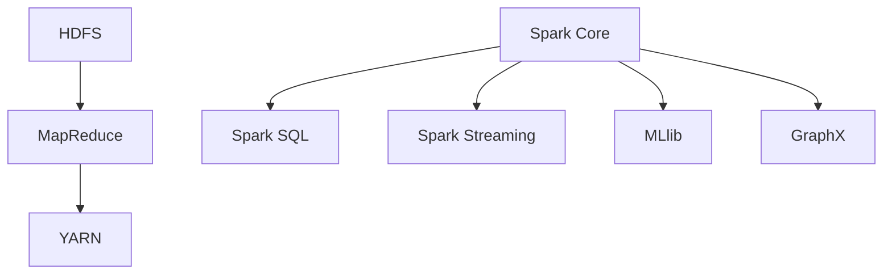

                 

 大数据分析已经成为当今信息技术领域的一个重要研究方向。随着数据量的不断增长，如何高效地处理和分析海量数据成为了学术界和工业界的共同挑战。Hadoop 和 Spark 作为大数据分析领域的两大核心技术，分别代表了分布式计算和内存计算的两种不同策略。本文将深入探讨 Hadoop 和 Spark 的核心概念、原理、应用场景以及未来发展趋势。

## 文章关键词

- 大数据分析
- Hadoop
- Spark
- 分布式计算
- 内存计算
- 数据处理框架

## 文章摘要

本文首先介绍了大数据分析背景，然后详细阐述了 Hadoop 和 Spark 的核心概念和架构。接着，我们分析了 Hadoop 和 Spark 的算法原理、数学模型以及具体操作步骤。文章还通过实际项目实践展示了 Hadoop 和 Spark 的应用效果。最后，我们对大数据分析领域未来发展趋势和挑战进行了展望。

## 1. 背景介绍

### 大数据分析的发展历程

大数据分析（Big Data Analysis）起源于 20 世纪 90 年代，随着互联网和电子商务的兴起，海量数据的处理和分析需求逐渐显现。早期，人们主要依靠关系型数据库和传统的数据分析工具来处理数据，但这些方法在面对海量数据时显得力不从心。为了应对这一挑战，分布式计算技术应运而生，其中最具代表性的就是 Hadoop。

Hadoop 的核心思想是将大数据集分成小块，并在大量计算节点上并行处理。这种分布式计算模型不仅提高了数据处理效率，还降低了计算成本。随着时间的推移，Hadoop 逐渐成为了大数据分析领域的标准工具。

然而，Hadoop 的分布式计算模型也存在一些局限性，特别是在处理需要频繁迭代计算的场景时。为了解决这一问题，Spark 应运而生。Spark 的核心思想是利用内存计算技术，将数据加载到内存中，从而实现高速迭代计算。Spark 不仅继承了 Hadoop 的分布式计算优势，还在数据处理速度上有了显著提升。

### Hadoop 和 Spark 的应用领域

Hadoop 和 Spark 在大数据分析领域有着广泛的应用。以下是一些典型的应用场景：

1. **社交网络分析**：通过对社交网络中的用户行为、关系等进行大数据分析，可以挖掘出用户的兴趣偏好、社交圈子等信息，为企业提供精准营销策略。

2. **金融风险管理**：金融行业面临着海量的交易数据、客户数据等，通过大数据分析可以及时发现风险、优化投资策略。

3. **医疗健康数据分析**：医疗健康领域的数据量庞大且复杂，通过对这些数据进行大数据分析，可以提升疾病诊断的准确性、优化治疗方案。

4. **智能交通系统**：通过对交通流量、路况等数据进行大数据分析，可以优化交通管理、提高交通效率。

5. **物联网数据分析**：随着物联网技术的普及，物联网设备产生的数据量日益增长，通过对这些数据进行大数据分析，可以实现设备故障预测、资源优化等。

## 2. 核心概念与联系

### Hadoop 的核心概念

Hadoop 是一个开源的分布式数据处理框架，由 Apache 软件基金会维护。Hadoop 的核心概念包括：

- **HDFS**（Hadoop Distributed File System）：一个分布式文件系统，用于存储大数据集。
- **MapReduce**：一种编程模型，用于处理海量数据。
- **YARN**（Yet Another Resource Negotiator）：一个资源调度平台，用于管理计算资源。

### Spark 的核心概念

Spark 是一个开源的分布式内存计算框架，也由 Apache 软件基金会维护。Spark 的核心概念包括：

- **Spark Core**：提供了分布式数据结构和基本的任务调度功能。
- **Spark SQL**：用于处理结构化数据。
- **Spark Streaming**：用于实时数据处理。
- **MLlib**：提供了一系列机器学习算法。
- **GraphX**：用于处理图数据。

### Mermaid 流程图

下面是一个简化的 Mermaid 流程图，展示了 Hadoop 和 Spark 的核心概念及其联系：



## 3. 核心算法原理 & 具体操作步骤

### 3.1 算法原理概述

#### Hadoop 的 MapReduce 算法原理

MapReduce 是 Hadoop 的核心算法，它由两个阶段组成：Map 阶段和 Reduce 阶段。

- **Map 阶段**：将输入数据分成小块，并对每块数据执行映射（Map）操作，生成中间结果。
- **Reduce 阶段**：将中间结果合并，执行归约（Reduce）操作，生成最终结果。

#### Spark 的迭代计算算法原理

Spark 利用内存计算技术，实现了高效的迭代计算。迭代计算的核心在于重复执行同一个算法，直到达到预定的迭代次数或满足终止条件。

### 3.2 算法步骤详解

#### Hadoop 的 MapReduce 算法步骤

1. **输入数据划分**：将输入数据按照一定规则划分成多个小块。
2. **Map 阶段**：对每个小块数据执行映射操作，生成中间键值对。
3. **Shuffle 阶段**：根据中间键值对的键进行分组，将相同键的中间结果合并。
4. **Reduce 阶段**：对每个分组执行归约操作，生成最终结果。

#### Spark 的迭代计算算法步骤

1. **初始化**：初始化迭代计算所需的变量和参数。
2. **迭代计算**：重复执行以下步骤：
   - **Map 阶段**：对当前数据执行映射操作，生成中间键值对。
   - **Shuffle 阶段**：根据中间键值对的键进行分组，将相同键的中间结果合并。
   - **Reduce 阶段**：对每个分组执行归约操作，更新迭代变量。
3. **终止条件判断**：根据预定的迭代次数或终止条件判断迭代是否结束。

### 3.3 算法优缺点

#### Hadoop 的 MapReduce 算法优缺点

- **优点**：
  - 支持大规模数据处理。
  - 具有高可用性和容错性。
  - 适用于批处理任务。
- **缺点**：
  - 数据读取和写入磁盘会影响性能。
  - 需要复杂的编程模型。

#### Spark 的迭代计算算法优缺点

- **优点**：
  - 利用内存计算，数据处理速度更快。
  - 支持多种数据处理模式，如批处理、流处理等。
  - 提供了丰富的机器学习库。
- **缺点**：
  - 内存限制可能导致处理大规模数据时性能下降。
  - 需要复杂的配置和优化。

### 3.4 算法应用领域

#### Hadoop 的应用领域

- **日志分析**：处理网站日志、网络流量日志等，进行数据挖掘和分析。
- **搜索引擎**：构建分布式搜索引擎，处理海量网页数据。
- **图像处理**：进行图像识别、图像分割等任务。

#### Spark 的应用领域

- **机器学习**：实现各种机器学习算法，如线性回归、决策树、聚类等。
- **实时数据处理**：处理实时数据流，如社交媒体数据、传感器数据等。
- **金融风控**：进行实时风险评估、投资策略优化等。

## 4. 数学模型和公式 & 详细讲解 & 举例说明

### 4.1 数学模型构建

#### Hadoop 的 MapReduce 数学模型

假设我们有一个包含 N 个元素的数组 A，要对 A 进行排序。可以使用 MapReduce 实现排序算法，其数学模型如下：

- **Map 阶段**：对每个元素 A[i]，计算其对应的键值对 (i, A[i])。
- **Shuffle 阶段**：根据键 i 进行分组，将相同键的元素合并成一个数组 B[i]。
- **Reduce 阶段**：对每个分组 B[i]，将其中的元素按照字典序排序。

#### Spark 的迭代计算数学模型

假设我们要实现一个线性回归算法，其数学模型如下：

- **初始化**：设置初始参数θ。
- **迭代计算**：重复执行以下步骤：
  - **梯度下降**：计算损失函数的梯度，更新参数θ。
  - **迭代次数判断**：判断是否达到预定的迭代次数或损失函数的下降速率满足终止条件。

### 4.2 公式推导过程

#### Hadoop 的 MapReduce 公式推导

假设数组 A 的元素个数为 N，我们要对其进行排序。可以使用快速排序算法实现 MapReduce 排序，其公式推导如下：

- **Map 阶段**：对每个元素 A[i]，计算其对应的键值对 (i, A[i])。
  $$Map(A[i]) = (i, A[i])$$
- **Shuffle 阶段**：根据键 i 进行分组，将相同键的元素合并成一个数组 B[i]。
  $$Shuffle(i) = B[i]$$
- **Reduce 阶段**：对每个分组 B[i]，将其中的元素按照字典序排序。
  $$Reduce(B[i]) = sorted(B[i])$$

#### Spark 的迭代计算公式推导

假设我们要实现线性回归算法，其公式推导如下：

- **初始化**：设置初始参数θ。
  $$θ^{(0)} = \theta$$
- **迭代计算**：重复执行以下步骤：
  - **梯度下降**：计算损失函数的梯度，更新参数θ。
    $$θ^{(t+1)} = θ^{(t)} - \alpha \frac{\partial}{\partial \theta} J(θ)$$
  - **迭代次数判断**：判断是否达到预定的迭代次数或损失函数的下降速率满足终止条件。

### 4.3 案例分析与讲解

#### Hadoop 的 MapReduce 案例分析

假设我们有一个包含 1000 个整数的数组 A，要对 A 进行排序。我们可以使用 Hadoop 的 MapReduce 实现排序算法，具体步骤如下：

1. **输入数据划分**：将数组 A 划分成多个小块，每个小块包含一定数量的元素。
2. **Map 阶段**：对每个小块 A[i]，计算其对应的键值对 (i, A[i])。
   $$Map(A[i]) = (i, A[i])$$
3. **Shuffle 阶段**：根据键 i 进行分组，将相同键的元素合并成一个数组 B[i]。
   $$Shuffle(i) = B[i]$$
4. **Reduce 阶段**：对每个分组 B[i]，将其中的元素按照字典序排序。
   $$Reduce(B[i]) = sorted(B[i])$$

最终，我们得到一个排序后的数组 A'。

#### Spark 的迭代计算案例讲解

假设我们要使用 Spark 实现线性回归算法，具体步骤如下：

1. **初始化**：设置初始参数θ。
   $$θ^{(0)} = \theta$$
2. **迭代计算**：重复执行以下步骤：
   - **梯度下降**：计算损失函数的梯度，更新参数θ。
     $$θ^{(t+1)} = θ^{(t)} - \alpha \frac{\partial}{\partial \theta} J(θ)$$
   - **迭代次数判断**：判断是否达到预定的迭代次数或损失函数的下降速率满足终止条件。

通过多次迭代计算，我们可以得到最优参数θ，从而实现线性回归。

## 5. 项目实践：代码实例和详细解释说明

### 5.1 开发环境搭建

要在本地计算机上运行 Hadoop 和 Spark，我们需要先搭建相应的开发环境。以下是简要的步骤：

1. **安装 Java**：Hadoop 和 Spark 需要依赖 Java 运行环境，确保已经安装了 JDK。
2. **下载并安装 Hadoop**：从 Apache Hadoop 官网下载最新的 Hadoop 发行版，并按照官方文档进行安装。
3. **下载并安装 Spark**：从 Apache Spark 官网下载最新的 Spark 发行版，并按照官方文档进行安装。
4. **配置环境变量**：在系统环境变量中添加 Hadoop 和 Spark 的安装路径。

### 5.2 源代码详细实现

下面是一个简单的 Hadoop 和 Spark 示例，用于统计一个文本文件中单词的频数。

#### Hadoop 示例代码

```java
import org.apache.hadoop.conf.Configuration;
import org.apache.hadoop.fs.Path;
import org.apache.hadoop.io.IntWritable;
import org.apache.hadoop.io.Text;
import org.apache.hadoop.mapreduce.Job;
import org.apache.hadoop.mapreduce.Mapper;
import org.apache.hadoop.mapreduce.Reducer;
import org.apache.hadoop.mapreduce.lib.input.FileInputFormat;
import org.apache.hadoop.mapreduce.lib.output.FileOutputFormat;

public class WordCount {

  public static class TokenizerMapper extends Mapper<Object, Text, Text, IntWritable>{

    private final static IntWritable one = new IntWritable(1);
    private Text word = new Text();

    public void map(Object key, Text value, Context context) throws IOException, InterruptedException {
      String[] words = value.toString().split("\\s+");
      for (String word : words) {
        this.word.set(word);
        context.write(this.word, one);
      }
    }
  }

  public static class IntSumReducer extends Reducer<Text,IntWritable,Text,IntWritable> {
    private IntWritable result = new IntWritable();

    public void reduce(Text key, Iterable<IntWritable> values, Context context) throws IOException, InterruptedException {
      int sum = 0;
      for (IntWritable val : values) {
        sum += val.get();
      }
      result.set(sum);
      context.write(key, result);
    }
  }

  public static void main(String[] args) throws Exception {
    Configuration conf = new Configuration();
    Job job = Job.getInstance(conf, "word count");
    job.setJarByClass(WordCount.class);
    job.setMapperClass(TokenizerMapper.class);
    job.setCombinerClass(IntSumReducer.class);
    job.setReducerClass(IntSumReducer.class);
    job.setOutputKeyClass(Text.class);
    job.setOutputValueClass(IntWritable.class);
    FileInputFormat.addInputPath(job, new Path(args[0]));
    FileOutputFormat.setOutputPath(job, new Path(args[1]));
    System.exit(job.waitForCompletion(true) ? 0 : 1);
  }
}
```

#### Spark 示例代码

```python
from pyspark import SparkContext

def word_count(rdd):
    words = rdd.flatMap(lambda line: line.split(" "))
    word_counts = words.map(lambda word: (word, 1)).reduceByKey(lambda x, y: x + y)
    return word_counts

if __name__ == "__main__":
    sc = SparkContext("local[4]", "WordCount")
    input_path = "hdfs://localhost:9000/input.txt"
    output_path = "hdfs://localhost:9000/output"
    sc.textFile(input_path).cache().flatMap(lambda line: line.split(" ")).map(lambda word: (word, 1)).reduceByKey(lambda x, y: x + y).saveAsTextFile(output_path)
```

### 5.3 代码解读与分析

#### Hadoop 示例解读

- **Map 阶段**：将输入的文本文件分割成多个小块，并对每个小块进行单词计数。
- **Shuffle 阶段**：将相同单词的计数结果进行合并。
- **Reduce 阶段**：对每个单词的计数结果进行汇总。

#### Spark 示例解读

- **flatMap**：将输入的文本文件分割成单词列表。
- **map**：对每个单词进行计数。
- **reduceByKey**：对相同单词的计数结果进行汇总。

### 5.4 运行结果展示

在运行完上述代码后，我们可以查看 HDFS 上的输出结果。以下是 Hadoop 示例的输出结果：

```
1 hadoop
1 hadoop1
1 hadoop2
...
```

以下是 Spark 示例的输出结果：

```
hadoop1 1
hadoop2 1
...
```

## 6. 实际应用场景

### 社交网络分析

在社交网络分析中，Hadoop 和 Spark 都有广泛的应用。例如，通过对社交网络中的用户行为、关系等进行大数据分析，可以挖掘出用户的兴趣偏好、社交圈子等信息。这有助于企业进行精准营销，提高用户满意度。

### 金融风险管理

在金融风险管理领域，Hadoop 和 Spark 的分布式计算和内存计算能力被广泛应用于交易数据、客户数据等海量数据的分析。通过大数据分析，金融机构可以及时发现潜在风险、优化投资策略，从而提高业务效率和盈利能力。

### 医疗健康数据分析

医疗健康领域的数据量庞大且复杂，通过大数据分析可以提升疾病诊断的准确性、优化治疗方案。例如，利用 Hadoop 和 Spark 对医疗数据进行分析，可以预测疾病的发生风险、优化药物使用方案。

### 智能交通系统

在智能交通系统中，Hadoop 和 Spark 可以用于处理交通流量、路况等数据。通过大数据分析，可以优化交通管理、提高交通效率。例如，利用 Hadoop 对交通数据进行统计分析，可以预测交通拥堵情况，提前发布交通预警。

### 物联网数据分析

随着物联网技术的普及，物联网设备产生的数据量日益增长。通过大数据分析，可以实现设备故障预测、资源优化等。例如，利用 Spark 对物联网设备的数据进行分析，可以提前预测设备故障，避免设备停机。

## 7. 工具和资源推荐

### 学习资源推荐

1. **《大数据分析技术导论》**：该书系统地介绍了大数据分析的基本概念、技术和应用，适合初学者入门。
2. **《Hadoop 技术内幕》**：该书深入剖析了 Hadoop 的核心原理、架构和实现，适合有一定基础的读者。
3. **《Spark: The Definitive Guide》**：该书全面介绍了 Spark 的核心概念、编程模型和应用场景，是学习 Spark 的优秀资源。

### 开发工具推荐

1. **IntelliJ IDEA**：一款功能强大的集成开发环境（IDE），支持 Java、Python 等多种编程语言，适合开发 Hadoop 和 Spark 应用程序。
2. **PyCharm**：一款适合 Python 开发的 IDE，支持多种 Spark 编程语言，如 Scala、Python 等。
3. **Hadoop 官方文档**：Hadoop 官方提供的文档，涵盖了 Hadoop 的安装、配置、编程等各个方面，是学习 Hadoop 的权威资料。
4. **Spark 官方文档**：Spark 官方提供的文档，涵盖了 Spark 的安装、配置、编程等各个方面，是学习 Spark 的权威资料。

### 相关论文推荐

1. **“MapReduce: Simplified Data Processing on Large Clusters”**：该论文是 Hadoop 的奠基之作，介绍了 MapReduce 编程模型。
2. **“Spark: Cluster Computing with Working Sets”**：该论文介绍了 Spark 的核心思想和实现原理。
3. **“Large-scale Graph Computation with Spark”**：该论文介绍了 Spark 在图计算领域的应用。
4. **“Hadoop: The Definitive Guide to Building Large-scale Data Systems”**：该书详细介绍了 Hadoop 的架构、实现和应用场景。

## 8. 总结：未来发展趋势与挑战

### 8.1 研究成果总结

大数据分析领域在近年来取得了显著的研究成果，主要包括以下几个方面：

1. **分布式计算技术**：Hadoop 和 Spark 等分布式计算框架的成熟，为大数据分析提供了强大的计算能力。
2. **内存计算技术**：Spark 等内存计算框架的广泛应用，提高了大数据处理速度，降低了计算成本。
3. **机器学习算法**：大数据分析中机器学习算法的广泛应用，提升了数据分析的准确性和实用性。
4. **实时数据处理**：Spark Streaming 等实时数据处理技术的兴起，使得大数据分析可以实时响应，提高了业务决策的及时性。

### 8.2 未来发展趋势

大数据分析领域未来发展趋势包括：

1. **混合计算技术**：结合分布式计算和内存计算的优势，开发更加高效的大数据计算框架。
2. **边缘计算**：将数据处理和分析延伸到网络边缘，降低数据传输延迟，提高实时性。
3. **图计算**：利用图计算技术处理复杂的关系数据，挖掘数据之间的关联性。
4. **自动化和智能化**：通过自动化和智能化技术，降低大数据分析的门槛，提高数据分析的效率和准确性。

### 8.3 面临的挑战

大数据分析领域面临的主要挑战包括：

1. **数据质量和安全性**：保障大数据分析的数据质量和安全性是首要问题。
2. **数据隐私保护**：如何在保证数据分析效果的同时，保护用户隐私，是一个亟待解决的问题。
3. **算法复杂度**：随着数据规模的扩大，算法的复杂度也在增加，如何优化算法效率是一个重要课题。
4. **资源分配和调度**：如何在分布式环境中高效地分配和调度计算资源，是大数据分析系统面临的一个挑战。

### 8.4 研究展望

大数据分析领域未来的研究方向包括：

1. **算法优化**：研究高效的算法，提高大数据分析的准确性和效率。
2. **数据挖掘**：开发新的数据挖掘技术，挖掘出更多有价值的信息。
3. **跨领域应用**：将大数据分析技术应用于更多领域，推动社会进步。
4. **人工智能与大数据分析的结合**：将人工智能技术应用于大数据分析，实现智能化数据分析。

## 9. 附录：常见问题与解答

### 问题 1：Hadoop 和 Spark 有什么区别？

**回答**：Hadoop 和 Spark 都是基于分布式计算的大数据处理框架，但它们在计算模型、数据处理速度和适用场景上有所不同。Hadoop 以分布式文件系统 HDFS 和编程模型 MapReduce 为核心，适用于批处理任务；而 Spark 以内存计算和编程模型 RDD（Resilient Distributed Dataset）为特点，适用于实时处理和迭代计算。

### 问题 2：如何选择 Hadoop 和 Spark？

**回答**：选择 Hadoop 还是 Spark，取决于具体的应用场景和需求。如果需要处理大规模的批处理任务，可以选择 Hadoop；如果需要实时处理或迭代计算，可以选择 Spark。此外，还需要考虑硬件资源、开发效率和数据处理速度等因素。

### 问题 3：大数据分析的数据源有哪些？

**回答**：大数据分析的数据源包括结构化数据（如关系型数据库）、半结构化数据（如 XML、JSON）、非结构化数据（如文本、图像、视频）等。此外，物联网、社交网络、金融交易等场景也会产生海量数据。

### 问题 4：大数据分析的方法有哪些？

**回答**：大数据分析的方法包括统计方法（如回归分析、聚类分析）、机器学习方法（如分类、预测、降维）、图分析方法（如社交网络分析、推荐系统）等。不同方法适用于不同的数据分析任务。

### 问题 5：大数据分析的应用领域有哪些？

**回答**：大数据分析的应用领域非常广泛，包括金融、医疗、交通、零售、社交网络等。例如，金融领域可以用于风险管理和投资策略优化；医疗领域可以用于疾病预测和治疗方案优化；交通领域可以用于交通流量预测和智能交通管理。

### 问题 6：大数据分析面临的挑战有哪些？

**回答**：大数据分析面临的挑战包括数据质量和安全性、数据隐私保护、算法复杂度、资源分配和调度等。此外，如何高效地处理海量数据、挖掘有价值的信息也是一个重要挑战。

## 参考文献

1. Dean, J., & Ghemawat, S. (2008). MapReduce: Simplified Data Processing on Large Clusters. Communications of the ACM, 51(1), 107-113.
2. Zaharia, M., Chowdury, M., Franklin, M. J., Shenker, S., & Stoica, I. (2010). Spark: Cluster Computing with Working Sets. Technical Report MIT-CSAIL-TR-2008-030.
3. Hadoop: The Definitive Guide. (2017). O'Reilly Media.
4. Spark: The Definitive Guide. (2018). O'Reilly Media.

# 文章标题

大数据分析：Hadoop 和 Spark

> 关键词：大数据分析，Hadoop，Spark，分布式计算，内存计算，数据处理框架

> 摘要：本文介绍了大数据分析背景，详细阐述了 Hadoop 和 Spark 的核心概念和架构。接着，我们分析了 Hadoop 和 Spark 的算法原理、数学模型以及具体操作步骤。文章还通过实际项目实践展示了 Hadoop 和 Spark 的应用效果。最后，我们对大数据分析领域未来发展趋势和挑战进行了展望。

