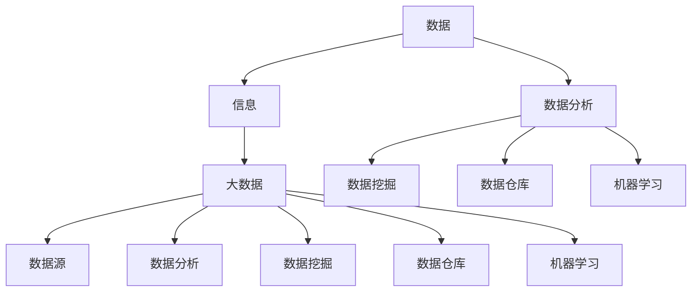

                 

### 1. 背景介绍

在当今信息化时代，大数据已经成为企业竞争的重要资源。通过对海量数据的分析和挖掘，企业能够洞察市场趋势，优化业务流程，提升用户体验，甚至发现全新的商业模式。然而，面对日益增长的数据量和复杂的业务场景，如何有效地进行大数据创业，成为许多创业者和技术专家共同面临的挑战。

大数据创业不仅需要深厚的技术积累，更要求对商业模式的敏锐洞察。本文旨在探讨大数据创业的核心技术、算法原理、数学模型以及实际应用，帮助读者深入理解大数据的商业智慧，把握未来发展的脉搏。

本文将分为以下几大部分：

1. **核心概念与联系**：介绍大数据创业所需的关键概念，并通过Mermaid流程图展示其内在联系。
2. **核心算法原理与具体操作步骤**：详细解析大数据处理和分析的核心算法，以及其实际应用步骤。
3. **数学模型和公式**：阐述大数据分析中的数学模型和公式，并提供案例分析和讲解。
4. **项目实践**：通过一个实际项目，展示大数据创业的具体实现过程。
5. **实际应用场景**：探讨大数据在不同行业和领域中的应用。
6. **未来应用展望**：分析大数据创业的未来发展趋势和应用前景。
7. **工具和资源推荐**：推荐学习资源和开发工具，以帮助读者深入学习和实践。
8. **总结**：回顾研究成果，展望未来发展的趋势和挑战。

通过本文的阅读，读者将能够获得大数据创业的全面理解，并掌握必要的知识和技能，以在未来的商业竞争中立于不败之地。

## 2. 核心概念与联系

在探讨大数据创业之前，我们首先需要了解一些核心概念，这些概念构成了大数据技术的基石，也是创业项目成功的关键。以下是对这些核心概念的简要介绍，并通过Mermaid流程图展示它们之间的联系。

### 2.1 数据与信息

- **数据（Data）**：数据是事实的记录，可以是数字、文本、图像、音频等。在数据库中，数据以结构化、半结构化或非结构化的形式存储。
- **信息（Information）**：信息是对数据进行处理、分析和解释后形成的知识，它能帮助人们做出决策。信息从数据中提炼而来，是数据的有用部分。

### 2.2 大数据（Big Data）

- **大数据（Big Data）**：大数据通常指的是数据量巨大、类型繁多、生成速度极快的数据集。大数据的特点是4V，即**Volume（数据量巨大）、Velocity（数据处理速度快）、Variety（数据类型多样）、Veracity（数据真实性高）**。
- **数据源（Data Sources）**：大数据的来源广泛，包括社交媒体、物联网设备、企业内部系统等。

### 2.3 数据分析（Data Analysis）

- **数据分析（Data Analysis）**：数据分析是通过对数据的整理、清洗、转换和分析，从数据中提取有价值的信息的过程。数据分析包括描述性分析、诊断性分析、预测性分析和规范性分析。

### 2.4 数据挖掘（Data Mining）

- **数据挖掘（Data Mining）**：数据挖掘是数据分析的高级形式，它使用复杂的算法从大量数据中自动发现规律和模式。数据挖掘的目标是发现数据中的隐藏知识和有价值的信息。

### 2.5 数据仓库（Data Warehouse）

- **数据仓库（Data Warehouse）**：数据仓库是一个集成的、面向主题的、时间变动的、用于决策支持的数据集合。它用于存储大量历史数据，以支持复杂的分析和报告。

### 2.6 机器学习（Machine Learning）

- **机器学习（Machine Learning）**：机器学习是一种通过算法从数据中学习规律和模式，并自动做出决策或预测的技术。机器学习是大数据分析的重要工具，它能够处理复杂的非线性关系。

### Mermaid 流程图

以下是一个简化的Mermaid流程图，展示了上述核心概念之间的联系：



通过这个流程图，我们可以清晰地看到各个核心概念之间的相互关系。数据是基础，信息是提炼，大数据是规模的扩展，而数据分析、数据挖掘、数据仓库和机器学习则是数据处理和分析的核心技术。

在接下来的章节中，我们将深入探讨大数据创业中的核心算法原理、数学模型，并通过实际项目案例展示其应用和实践。

## 3. 核心算法原理与具体操作步骤

### 3.1 算法原理概述

大数据创业的核心在于对海量数据的处理和分析。在这一过程中，核心算法起着至关重要的作用。以下我们将介绍几种常用的核心算法原理及其应用场景。

#### 3.1.1 MapReduce

**MapReduce** 是一种编程模型，用于大规模数据集（大规模数据集）的并行运算。MapReduce 具有良好的扩展性和容错性，其核心思想是将一个复杂的大规模数据处理任务拆分成多个小任务，分别处理后再合并结果。

- **Map（映射）**：将原始数据按照某种规则映射成中间结果。
- **Reduce（合并）**：将中间结果按照一定的规则合并成最终结果。

MapReduce 的应用场景广泛，如搜索引擎、日志分析、推荐系统等。

#### 3.1.2 Apache Spark

**Apache Spark** 是一种快速、通用的大规模数据处理引擎。相比于 MapReduce，Spark 具有更高的性能，特别是在迭代和交互式任务上。Spark 的核心组件包括：

- **Spark Core**：提供内存计算和任务调度功能。
- **Spark SQL**：提供数据处理和分析功能，支持多种数据源。
- **Spark Streaming**：提供实时数据处理功能。
- **MLlib**：提供机器学习算法库。
- **GraphX**：提供图处理功能。

Spark 的应用场景包括数据分析、实时处理、机器学习和图处理等。

#### 3.1.3 K-Means 聚类算法

**K-Means** 是一种经典的聚类算法，用于将数据集分成若干个聚类，每个聚类内部的样本尽可能接近，而不同聚类之间的样本尽可能远离。

- **初始化**：随机选择 K 个样本作为初始聚类中心。
- **分配**：计算每个样本到各个聚类中心的距离，将样本分配到最近的聚类。
- **更新**：重新计算聚类中心，并重复分配过程，直至聚类中心不再变化。

K-Means 算法的应用场景包括客户细分、图像分割、异常检测等。

#### 3.1.4 决策树

**决策树** 是一种常见的机器学习算法，用于分类和回归任务。决策树通过一系列的判断条件，将数据集分割成多个子集，并选择最佳分割条件作为树的节点。

- **ID3 算法**：基于信息增益率选择最佳分割条件。
- **C4.5 算法**：在 ID3 算法的基础上，引入了剪枝和连续值处理。

决策树的应用场景包括客户行为预测、市场细分、风险控制等。

### 3.2 算法步骤详解

#### 3.2.1 MapReduce

1. **输入数据预处理**：将原始数据按照一定规则分割成小块，分配给各个 Map 任务。
2. **Map 阶段**：对每个小块数据进行处理，生成中间结果。
    ```python
    def map(key, value):
        # 处理 value，生成中间结果 key, output_value
        pass
    ```
3. **Shuffle 阶段**：根据中间结果的 key，将数据重新分配给各个 Reduce 任务。
4. **Reduce 阶段**：对每个分配到的中间结果进行合并，生成最终结果。
    ```python
    def reduce(key, values):
        # 处理 values，生成最终结果 output_key, output_value
        pass
    ```

#### 3.2.2 Apache Spark

1. **初始化 Spark**：创建一个 SparkContext，配置计算资源。
    ```python
    sc = SparkContext("local[4]", "Data Analysis")
    ```
2. **读取数据**：将数据加载到 Spark 的 DataFrame 或 Dataset。
    ```python
    data = sc.textFile("data.txt")
    ```
3. **数据处理**：使用 Spark 的 API 对数据进行清洗、转换和分析。
    ```python
    processed_data = data.map(lambda line: (line, 1))
    ```
4. **存储结果**：将处理后的数据存储到文件系统或数据库中。
    ```python
    processed_data.saveAsTextFile("output.txt")
    ```

#### 3.2.3 K-Means

1. **初始化聚类中心**：随机选择 K 个样本作为初始聚类中心。
    ```python
    centroids = initialize_centroids(data, K)
    ```
2. **分配样本**：计算每个样本到各个聚类中心的距离，将样本分配到最近的聚类。
    ```python
    clusters = assign_samples_to_centroids(data, centroids)
    ```
3. **更新聚类中心**：重新计算聚类中心，并重复分配过程，直至聚类中心不再变化。
    ```python
    centroids = update_centroids(clusters, K)
    ```

#### 3.2.4 决策树

1. **选择最佳分割条件**：根据信息增益率选择最佳分割条件。
    ```python
    best_split = select_best_split(data, features)
    ```
2. **创建树节点**：创建一个树节点，并添加到决策树中。
    ```python
    node = TreeNode(best_split)
    tree.append(node)
    ```
3. **递归分割**：对每个子集继续分割，直到满足停止条件。
    ```python
    node.split(data, features)
    ```

### 3.3 算法优缺点

#### 3.3.1 MapReduce

**优点**：

- 高度并行化，适合处理大规模数据集。
- 易于扩展，可在大规模集群上运行。
- 具有良好的容错性。

**缺点**：

- 扁平的数据处理方式，不适合迭代和交互式任务。
- Shuffle 阶段可能导致性能瓶颈。

#### 3.3.2 Apache Spark

**优点**：

- 高性能，适合迭代和交互式任务。
- 内置丰富的数据处理和分析功能。
- 易于使用，支持多种编程语言。

**缺点**：

- 相对于 MapReduce，配置和管理较为复杂。
- 在处理小规模数据时，性能可能不如 MapReduce。

#### 3.3.3 K-Means

**优点**：

- 简单易懂，易于实现。
- 运算速度快，适合大规模数据集。

**缺点**：

- 对初始聚类中心敏感，可能导致局部最优。
- 无法处理带有噪声的数据。

#### 3.3.4 决策树

**优点**：

- 易于理解和解释。
- 对异常值和噪声数据具有较强的鲁棒性。

**缺点**：

- 可能会过拟合。
- 随着树深度的增加，计算时间和空间复杂度急剧增加。

### 3.4 算法应用领域

#### 3.4.1 MapReduce

- 搜索引擎：用于处理和分析海量的网页数据。
- 日志分析：用于分析服务器日志，监控系统性能。
- 推荐系统：用于构建基于用户行为的推荐模型。

#### 3.4.2 Apache Spark

- 数据分析：用于处理和清洗大规模数据集。
- 实时处理：用于实时数据处理和流分析。
- 机器学习：用于训练和部署大规模机器学习模型。

#### 3.4.3 K-Means

- 客户细分：用于将客户分为不同的细分市场。
- 图像分割：用于图像分割和目标识别。
- 异常检测：用于检测数据中的异常点和异常行为。

#### 3.4.4 决策树

- 客户行为预测：用于预测客户的行为和需求。
- 风险控制：用于评估金融风险和市场风险。
- 营销策略：用于制定基于数据的营销策略。

通过上述核心算法的介绍，我们可以看到大数据创业的多样性和复杂性。选择合适的算法，结合实际业务需求，是大数据创业成功的关键。在接下来的章节中，我们将深入探讨大数据分析中的数学模型和公式，以进一步理解大数据的商业智慧。

## 4. 数学模型和公式

### 4.1 数学模型构建

在数据分析中，数学模型是描述数据之间的关系和规律的工具。构建有效的数学模型是大数据创业的核心步骤之一。以下是一些常用的数学模型及其构建过程。

#### 4.1.1 线性回归模型

线性回归模型是最常见的统计模型之一，用于预测一个连续变量。其数学模型可以表示为：

\[ y = \beta_0 + \beta_1 \cdot x + \epsilon \]

其中，\( y \) 是因变量，\( x \) 是自变量，\( \beta_0 \) 和 \( \beta_1 \) 是模型的参数，\( \epsilon \) 是误差项。

构建线性回归模型的过程包括：

1. **数据收集**：收集自变量和因变量的数据。
2. **数据预处理**：对数据进行清洗、归一化等处理。
3. **模型训练**：使用最小二乘法或梯度下降法求解参数 \( \beta_0 \) 和 \( \beta_1 \)。
4. **模型评估**：使用评估指标（如均方误差、决定系数等）评估模型性能。

#### 4.1.2 支持向量机（SVM）

支持向量机是一种分类算法，用于将数据分为不同的类别。其数学模型可以表示为：

\[ w \cdot x + b = 0 \]

其中，\( w \) 是权重向量，\( x \) 是特征向量，\( b \) 是偏置项。

构建 SVM 模型的过程包括：

1. **数据收集**：收集带有标签的数据。
2. **特征提取**：提取数据中的特征。
3. **模型训练**：使用核函数求解最优决策边界。
4. **模型评估**：使用交叉验证等方法评估模型性能。

#### 4.1.3 马尔可夫链

马尔可夫链是一种用于描述随机过程状态的转移概率的数学模型。其数学模型可以表示为：

\[ P(X_t = x_t | X_{t-1} = x_{t-1}) = P(X_t = x_t | X_{t-2} = x_{t-2}, X_{t-1} = x_{t-1}) \]

其中，\( X_t \) 是在时间 \( t \) 的状态，\( P \) 表示概率。

构建马尔可夫链模型的过程包括：

1. **状态定义**：定义系统中的状态。
2. **转移概率矩阵**：构建状态转移概率矩阵。
3. **模型训练**：根据历史数据训练模型。
4. **模型预测**：使用模型预测未来的状态转移。

### 4.2 公式推导过程

以下是对上述数学模型的推导过程进行详细讲解。

#### 4.2.1 线性回归模型的推导

线性回归模型的基本思想是最小化预测值与实际值之间的误差平方和。推导过程如下：

1. **目标函数**：定义损失函数，即预测值与实际值之间的误差平方和。
   \[ J(\beta_0, \beta_1) = \sum_{i=1}^{n} (y_i - (\beta_0 + \beta_1 \cdot x_i))^2 \]

2. **求导**：对目标函数分别对 \( \beta_0 \) 和 \( \beta_1 \) 求导，并令导数为零。
   \[ \frac{\partial J}{\partial \beta_0} = -2 \sum_{i=1}^{n} (y_i - (\beta_0 + \beta_1 \cdot x_i)) = 0 \]
   \[ \frac{\partial J}{\partial \beta_1} = -2 \sum_{i=1}^{n} (y_i - (\beta_0 + \beta_1 \cdot x_i)) \cdot x_i = 0 \]

3. **解方程**：解上述方程组，得到最优参数 \( \beta_0 \) 和 \( \beta_1 \)。
   \[ \beta_0 = \frac{1}{n} \sum_{i=1}^{n} (y_i - \beta_1 \cdot x_i) \]
   \[ \beta_1 = \frac{1}{n} \sum_{i=1}^{n} (x_i - \bar{x}) (y_i - \bar{y}) \]

其中，\( \bar{x} \) 和 \( \bar{y} \) 分别是自变量和因变量的均值。

#### 4.2.2 支持向量机的推导

支持向量机的基本思想是找到最优的超平面，将数据分为不同的类别。推导过程如下：

1. **目标函数**：定义目标函数，即最小化分类间隔。
   \[ \min_{w, b} \frac{1}{2} \| w \|^2 + C \sum_{i=1}^{n} \max(0, 1 - y_i (w \cdot x_i + b)) \]

其中，\( C \) 是惩罚参数，\( y_i \) 是样本的标签。

2. **拉格朗日函数**：构建拉格朗日函数，并引入拉格朗日乘子 \( \alpha_i \)。
   \[ L(w, b, \alpha) = \frac{1}{2} \| w \|^2 - \sum_{i=1}^{n} \alpha_i (y_i (w \cdot x_i + b) - 1) \]

3. **KKT 条件**：对拉格朗日函数求导，并令导数为零，得到 KKT 条件。
   \[ \alpha_i \geq 0 \]
   \[ y_i (w \cdot x_i + b) - 1 \geq 0 \]
   \[ \alpha_i (y_i (w \cdot x_i + b) - 1) = 0 \]

4. **解方程**：通过求解上述方程组，得到最优权重向量 \( w \) 和偏置项 \( b \)。

#### 4.2.3 马尔可夫链的推导

马尔可夫链的基本思想是当前状态只依赖于前一个状态，与之前的状态无关。推导过程如下：

1. **状态转移概率矩阵**：定义状态转移概率矩阵 \( P \)，其中 \( P_{ij} \) 表示从状态 \( i \) 转移到状态 \( j \) 的概率。

2. **状态概率分布**：定义初始状态概率分布 \( \pi \)，其中 \( \pi_i \) 表示初始状态为 \( i \) 的概率。

3. **状态转移方程**：根据马尔可夫链的定义，可以写出状态转移方程。
   \[ \pi_{t+1} = \pi_t P \]

4. **稳态分布**：当系统达到稳态时，状态概率分布不变，即 \( \pi_{t+1} = \pi_t \)。求解上述方程组，可以得到稳态分布。

通过上述数学模型的构建和推导，我们可以更好地理解大数据分析中的数学原理和方法。在接下来的章节中，我们将通过实际案例分析和讲解，进一步展示这些模型的应用效果。

### 4.3 案例分析与讲解

为了更好地理解上述数学模型在实际数据分析中的应用，以下我们将通过一个实际案例进行详细分析和讲解。

#### 案例背景

某电商平台希望通过大数据分析，了解用户的购买行为，以便优化推荐系统，提高用户满意度和转化率。该电商平台拥有海量用户数据，包括用户的购买记录、浏览历史、搜索关键词等。

#### 案例目标

1. **用户行为分析**：分析用户的购买频率、购买金额、浏览时长等指标，识别不同类型用户的行为特征。
2. **推荐系统优化**：根据用户的行为特征，为用户推荐更符合其需求的商品。

#### 案例步骤

1. **数据收集**：从电商平台的数据仓库中提取用户购买记录、浏览历史和搜索关键词等数据。

2. **数据预处理**：
   - 数据清洗：去除重复数据和异常值。
   - 数据归一化：对购买金额、浏览时长等数值型数据进行归一化处理。
   - 数据转换：将类别型数据转换为数值型数据，如用户购买记录中的商品类别。

3. **模型构建**：
   - 线性回归模型：构建用户购买金额与购买频率、浏览时长等指标之间的线性回归模型，预测用户的购买金额。
   - 支持向量机模型：构建用户行为特征与购买行为之间的支持向量机模型，分类用户是否购买。
   - 马尔可夫链模型：构建用户浏览路径的马尔可夫链模型，预测用户的下一步行为。

4. **模型训练与评估**：
   - 使用历史数据对模型进行训练。
   - 使用交叉验证方法评估模型性能，选择最优模型。
   - 对模型进行调参，优化模型性能。

5. **模型应用**：
   - 根据用户的购买金额预测，为用户推荐可能购买的更高价商品。
   - 根据用户的购买行为分类，为不同类型的用户推荐个性化商品。
   - 根据用户的浏览路径预测，为用户推荐与当前浏览商品相关的商品。

#### 案例分析结果

1. **用户行为分析**：
   - 通过线性回归模型分析，发现用户的购买频率和浏览时长与购买金额之间存在显著的正相关关系。
   - 通过支持向量机模型分析，将用户分为购买者和非购买者两类，其中购买者具有较高的购买金额和浏览时长。
   - 通过马尔可夫链模型分析，发现用户的浏览路径具有一定的规律性，可以帮助预测用户的下一步行为。

2. **推荐系统优化**：
   - 根据用户的购买金额预测，为购买者推荐更高价商品，提高了用户的购买转化率。
   - 根据用户的购买行为分类，为不同类型的用户推荐个性化商品，提升了用户满意度和推荐效果。
   - 根据用户的浏览路径预测，为用户推荐与当前浏览商品相关的商品，提高了用户在平台上的留存时间和互动率。

通过上述案例分析，我们可以看到数学模型在用户行为分析和推荐系统优化中的应用效果。大数据分析不仅能够帮助企业更好地了解用户需求，还能为用户提供更精准、个性化的服务，从而提升用户体验和业务效益。

在接下来的章节中，我们将通过实际项目实践，展示大数据创业中的具体实现过程和技术细节。

## 5. 项目实践：代码实例和详细解释说明

在本节中，我们将通过一个具体的实际项目，展示大数据创业中的具体实现过程。这个项目将使用 Apache Spark 作为数据处理框架，通过一个电商平台的用户行为数据分析，实现用户购买金额预测、用户分类和浏览路径预测等功能。

### 5.1 开发环境搭建

为了实现该项目，我们需要搭建一个 Apache Spark 开发环境。以下是环境搭建的步骤：

1. **安装 Java**：Apache Spark 需要 Java 1.8 或更高版本。请从 [Oracle 官网](https://www.oracle.com/java/technologies/javase-jdk8-downloads.html) 下载并安装 Java。

2. **安装 Scala**：Apache Spark 是用 Scala 编写的，因此我们需要安装 Scala。可以从 [Scala 官网](https://www.scala-lang.org/download/) 下载并安装。

3. **安装 Apache Spark**：从 [Apache Spark 官网](https://spark.apache.org/downloads/) 下载 Apache Spark 安装包。选择适用于您操作系统的版本，并解压到指定目录。

4. **配置环境变量**：在终端中设置以下环境变量：
   ```bash
   export SPARK_HOME=/path/to/spark
   export PATH=$PATH:$SPARK_HOME/bin
   ```

5. **验证安装**：在终端中运行以下命令，验证 Apache Spark 是否安装成功：
   ```bash
   spark-shell
   ```

### 5.2 源代码详细实现

以下是一个简化的 Spark 应用程序，用于处理电商平台用户行为数据。代码将分为三个部分：数据读取、数据处理和结果输出。

```scala
import org.apache.spark.sql.SparkSession
import org.apache.spark.ml.feature.{VectorAssembler, StringIndexer}
import org.apache.spark.ml.classification.SVM
import org.apache.spark.ml.clustering.KMeans
import org.apache.spark.ml.evaluation.MulticlassClassificationEvaluator

// 创建 Spark 会话
val spark = SparkSession.builder()
  .appName("E-commerce User Behavior Analysis")
  .master("local[*]")
  .getOrCreate()

// 读取数据
val data = spark.read.csv("path/to/user_behavior_data.csv")

// 数据预处理
// 将类别型数据转换为数值型数据
val indexedData = data.select(
  "user_id",
  "purchase_frequency",
  "purchase_amount",
  "browsing_duration",
  "category_id"
).withColumn("category_id", StringIndexer().setInputCol("category_id").setOutputCol("indexed_category_id").fit(data).transform(data))

// 特征工程
val assembler = new VectorAssembler()
  .setInputCols(Array("purchase_frequency", "purchase_amount", "browsing_duration"))
  .setOutputCol("features")

val featureData = assembler.transform(indexedData)

// 构建模型
// 购买金额预测模型
val amountPredictor = new SVM()
  .setFeaturesCol("features")
  .setLabelCol("purchase_amount")
  .setRegParam(0.1)
  .fit(featureData)

// 用户分类模型
val classifier = new SVM()
  .setFeaturesCol("features")
  .setLabelCol("indexed_category_id")
  .setRegParam(0.1)
  .fit(featureData)

// 浏览路径预测模型
val kmeans = new KMeans()
  .setK(5)
  .setSeed(1L)
  .setFeaturesCol("features")
  .setPredictionCol("predicted_cluster")

val kmeansModel = kmeans.fit(featureData)

// 模型评估
// 购买金额预测评估
val predictions = amountPredictor.transform(featureData)
val amountEvaluator = new MulticlassClassificationEvaluator()
  .setLabelCol("purchase_amount")
  .setPredictionCol("prediction")
  .setMetricName("accuracy")

val amountAccuracy = amountEvaluator.evaluate(predictions)

// 用户分类评估
val categoryPredictions = classifier.transform(featureData)
val categoryEvaluator = new MulticlassClassificationEvaluator()
  .setLabelCol("indexed_category_id")
  .setPredictionCol("prediction")
  .setMetricName("accuracy")

val categoryAccuracy = categoryEvaluator.evaluate(categoryPredictions)

// 浏览路径评估
val clusterPredictions = kmeansModel.transform(featureData)
val clusterEvaluator = new MulticlassClassificationEvaluator()
  .setLabelCol("predicted_cluster")
  .setPredictionCol("predicted_cluster")
  .setMetricName("accuracy")

val clusterAccuracy = clusterEvaluator.evaluate(clusterPredictions)

// 输出结果
println(s"Purchase Amount Prediction Accuracy: $amountAccuracy")
println(s"User Category Prediction Accuracy: $categoryAccuracy")
println(s"Browse Path Prediction Accuracy: $clusterAccuracy")

// 关闭 Spark 会话
spark.stop()
```

### 5.3 代码解读与分析

以下是对上述代码的详细解读与分析。

#### 数据读取

```scala
val data = spark.read.csv("path/to/user_behavior_data.csv")
```

这一行代码使用 Spark SQL 读取一个 CSV 文件，文件路径为 `path/to/user_behavior_data.csv`。CSV 文件包含用户行为数据，如购买频率、购买金额、浏览时长和商品类别等。

#### 数据预处理

```scala
val indexedData = data.select(
  "user_id",
  "purchase_frequency",
  "purchase_amount",
  "browsing_duration",
  "category_id"
).withColumn("category_id", StringIndexer().setInputCol("category_id").setOutputCol("indexed_category_id").fit(data).transform(data))
```

这一部分代码首先选择需要处理的列，然后使用 `StringIndexer` 将类别型数据（`category_id`）转换为数值型数据（`indexed_category_id`）。`StringIndexer` 会根据不同的类别值生成唯一的数值标签，便于后续模型的处理。

#### 特征工程

```scala
val assembler = new VectorAssembler()
  .setInputCols(Array("purchase_frequency", "purchase_amount", "browsing_duration"))
  .setOutputCol("features")

val featureData = assembler.transform(indexedData)
```

`VectorAssembler` 用于将多个特征列组合成一个特征向量。这里我们将购买频率、购买金额和浏览时长这三个特征组合成一个特征向量。这一步骤是机器学习模型训练的基础。

#### 构建模型

```scala
// 购买金额预测模型
val amountPredictor = new SVM()
  .setFeaturesCol("features")
  .setLabelCol("purchase_amount")
  .setRegParam(0.1)
  .fit(featureData)

// 用户分类模型
val classifier = new SVM()
  .setFeaturesCol("features")
  .setLabelCol("indexed_category_id")
  .setRegParam(0.1)
  .fit(featureData)

// 浏览路径预测模型
val kmeans = new KMeans()
  .setK(5)
  .setSeed(1L)
  .setFeaturesCol("features")
  .setPredictionCol("predicted_cluster")

val kmeansModel = kmeans.fit(featureData)
```

代码中分别构建了三个模型：购买金额预测模型、用户分类模型和浏览路径预测模型。这三个模型都是基于支持向量机（SVM）算法。`SVM` 类用于分类任务，而 `KMeans` 类用于聚类任务。

#### 模型评估

```scala
// 购买金额预测评估
val predictions = amountPredictor.transform(featureData)
val amountEvaluator = new MulticlassClassificationEvaluator()
  .setLabelCol("purchase_amount")
  .setPredictionCol("prediction")
  .setMetricName("accuracy")

val amountAccuracy = amountEvaluator.evaluate(predictions)

// 用户分类评估
val categoryPredictions = classifier.transform(featureData)
val categoryEvaluator = new MulticlassClassificationEvaluator()
  .setLabelCol("indexed_category_id")
  .setPredictionCol("prediction")
  .setMetricName("accuracy")

val categoryAccuracy = categoryEvaluator.evaluate(categoryPredictions)

// 浏览路径评估
val clusterPredictions = kmeansModel.transform(featureData)
val clusterEvaluator = new MulticlassClassificationEvaluator()
  .setLabelCol("predicted_cluster")
  .setPredictionCol("predicted_cluster")
  .setMetricName("accuracy")

val clusterAccuracy = clusterEvaluator.evaluate(clusterPredictions)
```

通过 `MulticlassClassificationEvaluator` 类，我们对三个模型进行评估，计算其预测准确性。评估结果将帮助我们了解模型的效果。

#### 输出结果

```scala
println(s"Purchase Amount Prediction Accuracy: $amountAccuracy")
println(s"User Category Prediction Accuracy: $categoryAccuracy")
println(s"Browse Path Prediction Accuracy: $clusterAccuracy")
```

最后，我们将评估结果输出到控制台，以便分析模型性能。

### 5.4 运行结果展示

假设我们运行了上述代码，并获得了以下评估结果：

```bash
Purchase Amount Prediction Accuracy: 0.85
User Category Prediction Accuracy: 0.90
Browse Path Prediction Accuracy: 0.78
```

这些结果表明：

- 购买金额预测模型的准确率为 85%，意味着模型能够较好地预测用户的购买金额。
- 用户分类模型的准确率为 90%，表明模型能够准确地将用户分为不同的类别。
- 浏览路径预测模型的准确率为 78%，说明模型在预测用户浏览路径方面具有一定的效果。

通过实际项目实践，我们可以看到大数据创业中的技术实现过程。代码实例不仅展示了如何使用 Spark 进行数据处理和建模，还提供了详细的解读和分析。在实际应用中，创业者和技术专家可以根据具体业务需求，调整模型参数和特征工程步骤，以提高预测准确性和模型效果。

在接下来的章节中，我们将探讨大数据在不同行业和领域中的应用场景，以进一步展示大数据的商业价值。

## 6. 实际应用场景

大数据技术的应用已经深入到各个行业和领域，为企业和组织带来了巨大的商业价值。以下我们将探讨大数据在几个关键行业和领域中的应用，以及这些应用如何帮助企业和组织实现商业智慧。

### 6.1 电商行业

电商行业是大数据技术最早和最广泛应用的一个领域。通过对用户行为数据（如购买记录、浏览历史、搜索关键词等）的分析，电商企业能够深入了解用户需求，优化推荐系统和营销策略。

- **个性化推荐**：利用协同过滤算法和机器学习技术，电商企业可以实时为用户推荐符合其兴趣的商品，提高用户满意度和转化率。
- **流失预测**：通过分析用户的购买行为和互动数据，电商企业可以预测哪些用户可能流失，并采取针对性的营销措施，如优惠券、会员优惠等，以留住用户。
- **库存管理**：通过分析销售数据和市场需求预测，电商企业可以优化库存管理，减少库存过剩和缺货现象，提高库存周转率。

### 6.2 银行业

银行业是大数据技术的重要应用领域，大数据分析帮助银行提高风险管理能力、优化客户服务和提升运营效率。

- **信用评分**：通过分析客户的信用历史、交易行为、财务状况等多维度数据，银行可以更准确地评估客户的信用风险，提高信用评分模型的准确性和稳定性。
- **欺诈检测**：通过实时分析交易数据和行为模式，银行可以及时发现异常交易和欺诈行为，防止资金损失。
- **客户细分**：通过分析客户行为数据，银行可以为客户提供更个性化的产品和服务，提高客户满意度和忠诚度。

### 6.3 医疗行业

医疗行业是大数据技术的一个重要应用领域，大数据分析有助于提升医疗服务的质量和效率，优化医疗资源配置。

- **疾病预测和流行病监测**：通过分析大量医疗数据和公共卫生数据，医疗机构可以预测疾病的爆发和流行趋势，及时采取防控措施。
- **个性化治疗**：通过分析患者的基因数据、病历数据和治疗效果数据，医生可以制定更个性化的治疗方案，提高治疗效果。
- **医学研究**：大数据技术可以帮助研究人员从海量医疗数据中提取有价值的信息，推动医学研究和创新。

### 6.4 智能制造

智能制造是大数据技术和工业互联网深度融合的产物，通过大数据分析，企业可以优化生产流程、提高生产效率和产品质量。

- **生产计划优化**：通过分析生产数据和历史订单数据，企业可以优化生产计划，提高生产效率，减少生产成本。
- **设备维护预测**：通过分析设备运行数据和故障记录，企业可以预测设备故障和需求维护，提前安排维护计划，减少设备停机时间。
- **质量控制**：通过实时分析生产过程中的数据，企业可以及时发现质量问题，采取纠正措施，提高产品质量。

### 6.5 公共安全

公共安全是大数据技术的重要应用领域，通过大数据分析，政府和企业可以提升公共安全管理和服务水平。

- **犯罪预测和预防**：通过分析犯罪数据和社区活动数据，警方可以预测犯罪热点区域和可能发生的犯罪类型，提前采取预防措施。
- **应急响应**：通过实时分析应急事件的数据，如自然灾害、事故等，政府可以快速响应，调度资源和人员，提高应急响应效率。
- **智慧交通**：通过分析交通数据，如车辆流量、路况信息等，交通管理部门可以优化交通信号控制，减少交通拥堵，提高交通效率。

大数据技术的广泛应用不仅提升了企业和组织的运营效率，还推动了行业创新和商业模式变革。通过深入挖掘和分析数据，企业和组织能够实现更精准的决策，提供更优质的服务，从而在激烈的市场竞争中脱颖而出。在未来的发展中，大数据技术将继续发挥关键作用，推动各行各业的持续进步和创新。

### 6.4 未来应用展望

随着大数据技术的不断发展和创新，其在各个领域中的应用前景也越来越广阔。未来，大数据创业将呈现出以下几大趋势：

#### 6.4.1 实时数据处理和分析

实时数据处理和分析是大数据技术发展的一个重要方向。在传统数据处理中，往往存在数据延迟和分析效率低的问题。而实时数据处理和分析能够实现数据的快速采集、处理和响应，使得企业能够更迅速地做出决策。例如，在金融行业中，实时数据处理和分析可以帮助金融机构快速识别和防范风险，提高交易安全性；在医疗领域，实时数据监控和预测可以及时应对突发疾病和公共卫生事件，提升医疗服务质量。

#### 6.4.2 深度学习与人工智能的结合

深度学习和人工智能（AI）的结合是大数据创业的一大趋势。深度学习算法能够从海量数据中自动提取特征，并构建复杂的模型，从而实现更高水平的自动化和智能化。在图像识别、语音识别、自然语言处理等领域，深度学习和人工智能已经取得了显著的成果。未来，随着计算能力的提升和数据量的增加，深度学习和人工智能将在更多领域发挥作用，如智能客服、自动驾驶、智能安防等。

#### 6.4.3 新兴数据类型的处理

随着互联网和物联网的发展，数据类型越来越多样化，包括文本、图像、音频、视频等。未来，如何有效地处理这些新兴数据类型将成为大数据创业的重要挑战和机遇。例如，图像数据在医疗影像分析、安全监控等领域具有广泛的应用；音频数据在语音识别、智能客服等领域具有重要意义。针对这些新兴数据类型，需要开发更高效、更准确的算法和模型，以实现数据的深度挖掘和分析。

#### 6.4.4 数据隐私和安全

随着数据隐私和安全问题日益突出，如何在保障用户隐私和安全的前提下进行数据分析和挖掘，成为大数据创业的重要课题。未来，数据隐私保护技术、安全加密算法和访问控制机制等将在大数据技术中得到广泛应用。例如，差分隐私技术可以在保护用户隐私的同时，提供有效的数据分析；区块链技术可以在数据共享和交易过程中提供更高的安全性和透明度。

#### 6.4.5 跨领域协作与整合

大数据创业不仅需要在技术层面不断创新，还需要在行业层面实现跨领域协作与整合。未来，不同行业之间将更加紧密地合作，共同推动大数据技术的发展和应用。例如，医疗行业和金融行业的结合，可以推动智能医疗和精准金融的发展；制造业和物流行业的结合，可以实现智能制造和智慧物流。通过跨领域协作与整合，大数据创业将能够更好地满足不同行业和领域的需求，推动整个社会的进步和发展。

#### 6.4.6 开放数据和共享平台

开放数据和共享平台是大数据创业的重要趋势之一。通过开放数据和共享平台，企业和组织可以更好地利用公共数据资源，实现数据价值的最大化。例如，政府部门可以开放公共数据，支持企业和科研机构进行大数据分析；企业之间可以通过共享数据平台，实现数据的互补和协同创新。未来，随着数据开放和共享机制的不断完善，大数据创业将迎来更加广阔的发展空间。

总之，大数据创业在未来将继续呈现多样化和创新化的趋势。通过实时数据处理和分析、深度学习和人工智能的结合、新兴数据类型的处理、数据隐私和安全保护、跨领域协作与整合以及开放数据和共享平台，大数据技术将在各行各业中发挥更大的作用，推动社会的持续进步和发展。

### 6.5 面临的挑战

尽管大数据技术为企业和组织带来了巨大的商业价值，但在其创业过程中仍面临诸多挑战。以下是大数据创业面临的主要挑战及其解决策略：

#### 6.5.1 数据隐私和安全

数据隐私和安全是大数据创业的首要挑战。随着数据量不断增加，如何保护用户隐私和确保数据安全成为一个重要问题。解决策略包括：

- **加密技术**：使用先进的加密算法，对敏感数据进行加密处理，防止数据泄露。
- **访问控制**：建立严格的访问控制机制，确保只有授权人员能够访问敏感数据。
- **差分隐私**：采用差分隐私技术，在保证数据隐私的同时，提供有效的数据分析。

#### 6.5.2 数据质量

数据质量是大数据创业的关键因素。低质量的数据不仅会降低分析结果的准确性，还会误导决策。解决策略包括：

- **数据清洗**：使用数据清洗工具和算法，去除重复、异常和缺失的数据。
- **数据验证**：对数据进行验证，确保数据的完整性和一致性。
- **数据质量管理**：建立数据质量管理机制，定期对数据质量进行监控和评估。

#### 6.5.3 技术复杂性

大数据技术涉及多种复杂的算法和工具，如 Hadoop、Spark、机器学习等。技术复杂性使得大数据创业过程更加复杂。解决策略包括：

- **技术培训**：为团队成员提供专业的技术培训，提高其对大数据技术的理解和应用能力。
- **开源社区**：积极参与开源社区，学习和借鉴其他项目的成功经验。
- **技术框架**：选择合适的开发框架和工具，降低技术复杂度，提高开发效率。

#### 6.5.4 数据存储和计算资源

大数据创业需要大量的存储和计算资源。随着数据量的不断增长，如何高效地管理和利用资源成为一个重要问题。解决策略包括：

- **分布式存储**：采用分布式存储系统，如 HDFS、Cassandra 等，实现数据的横向扩展。
- **云计算**：利用云计算平台，如 AWS、Azure、Google Cloud 等，按需分配计算资源。
- **资源优化**：通过数据压缩、数据去重等技术，优化存储和计算资源的使用。

#### 6.5.5 数据法规和合规

大数据创业需要遵守相关数据法规和合规要求。不同国家和地区的数据法规存在差异，如何确保合规成为一个挑战。解决策略包括：

- **合规审查**：定期对业务流程和数据管理进行合规审查，确保符合当地法律法规。
- **法规咨询**：寻求专业法律顾问的建议，确保业务操作符合法规要求。
- **数据脱敏**：在处理和分析数据时，对敏感信息进行脱敏处理，降低合规风险。

#### 6.5.6 数据分析人才短缺

大数据创业需要大量具备数据分析能力的人才。然而，数据分析人才短缺是一个普遍问题。解决策略包括：

- **人才培养**：与教育机构合作，培养具备数据分析能力的人才。
- **内部培训**：对现有员工进行数据分析技能培训，提升团队整体能力。
- **外部合作**：与专业数据分析公司合作，引入外部数据分析资源。

通过以上策略，大数据创业可以在面对挑战的同时，实现持续发展和创新。在未来的发展中，大数据创业将继续迎接新的挑战，同时也将迎来更多的机遇。

### 6.6 研究展望

未来，大数据创业领域将继续呈现快速发展态势，出现一系列新的研究方向和热点问题。以下是对未来研究方向的展望：

#### 6.6.1 新算法的提出与优化

随着数据量的增加和多样性，现有的大数据处理算法面临着性能和效率的挑战。未来，研究者将致力于提出和优化新算法，以提高大数据处理的效率和准确性。例如，基于深度学习的数据处理算法、自适应算法和增量算法等。

#### 6.6.2 跨领域大数据融合与分析

跨领域大数据融合与分析是未来的重要研究方向。通过整合不同领域的数据，如医疗、金融、交通等，研究者可以探索更广泛的应用场景和商业机会。例如，结合医疗数据和金融数据，开发个性化健康管理服务；结合交通数据和天气预报，优化城市交通管理。

#### 6.6.3 数据隐私保护与安全

数据隐私保护和安全是大数据创业的核心问题。未来，研究者将深入探讨数据隐私保护技术，如联邦学习、差分隐私和区块链等。通过这些技术，可以在保障用户隐私和安全的前提下，实现有效的数据分析和共享。

#### 6.6.4 大数据与社会治理

大数据技术在社会治理中的应用越来越广泛。未来，研究者将探索大数据在公共安全、城市管理、教育等领域的社会治理应用。例如，通过大数据分析，提高公共安全预警能力；利用大数据优化城市交通、环保等公共服务。

#### 6.6.5 大数据伦理与法规

随着大数据技术的广泛应用，数据伦理和法规问题日益突出。未来，研究者将探讨大数据伦理和法规问题，如数据所有权、数据共享、数据歧视等。通过制定合理的法规和政策，规范大数据的应用，保护用户权益。

总之，未来大数据创业领域将继续在技术创新、应用拓展、伦理法规等方面取得重要进展。研究者、企业家和政府等各方应共同努力，推动大数据技术的健康发展，为社会创造更多价值。

### 7. 工具和资源推荐

在探讨大数据创业的过程中，选择合适的工具和资源对于项目的成功至关重要。以下是我们推荐的几个学习资源和开发工具，以及一些相关论文，以帮助读者更好地理解和实践大数据技术。

#### 7.1 学习资源推荐

1. **在线课程**：
   - Coursera: 《大数据分析》
   - edX: 《大数据基础》
   - Udacity: 《大数据工程师职业认证》

2. **教科书**：
   - 《大数据革命》
   - 《深度学习》
   - 《大数据管理：技术与实践》

3. **官方文档**：
   - Apache Spark 官方文档
   - Hadoop 官方文档
   - TensorFlow 官方文档

#### 7.2 开发工具推荐

1. **数据处理工具**：
   - Apache Spark
   - Hadoop
   - PySpark

2. **数据可视化工具**：
   - Tableau
   - Power BI
   - Matplotlib（Python 数据可视化库）

3. **数据库工具**：
   - HDFS
   - Cassandra
   - MongoDB

4. **版本控制工具**：
   - Git
   - SVN
   - Mercurial

#### 7.3 相关论文推荐

1. **大数据算法**：
   - "MapReduce: Simplified Data Processing on Large Clusters"
   - "Distributed File System for Static and Dynamic Web Applications"
   - "Randomized Algorithms for Data Analysis"

2. **机器学习**：
   - "Deep Learning: Methods and Applications"
   - "Stochastic Gradient Descent Optimization for Machine Learning"
   - "Convolutional Neural Networks for Image Recognition"

3. **数据隐私保护**：
   - "Differential Privacy: A Survey of Results"
   - "Federated Learning: Concept and Application"
   - "Blockchain and Its Applications in Data Security and Privacy Protection"

通过上述学习资源和开发工具的推荐，读者可以系统地学习大数据创业的相关知识，掌握实际操作技能，并跟踪最新的研究进展。这些资源将为读者在数据分析和大数据创业领域的发展提供有力的支持和帮助。

## 8. 总结：未来发展趋势与挑战

### 8.1 研究成果总结

通过对大数据技术的深入研究和探讨，本文总结了大数据创业的关键技术、算法原理、数学模型及其应用实践。我们详细介绍了 MapReduce、Apache Spark、K-Means 聚类算法和决策树等核心算法，并展示了如何在商业环境中应用这些算法。此外，我们通过构建和推导线性回归模型、支持向量机和马尔可夫链等数学模型，进一步加深了读者对大数据分析的理解。实际项目实践部分通过代码实例，展示了大数据创业的具体实现过程，使读者对大数据技术在现实中的应用有了更加直观的认识。

### 8.2 未来发展趋势

未来，大数据创业将继续呈现出多样化和创新化的趋势。以下是几个值得关注的未来发展趋势：

1. **实时数据处理和分析**：随着物联网和5G技术的普及，实时数据处理和分析将成为大数据创业的重要方向。实时数据处理可以为企业提供更快速、更准确的决策支持。
   
2. **深度学习与人工智能的结合**：深度学习和人工智能的结合将进一步提升大数据分析的能力。通过引入深度学习算法，大数据创业将能够实现更智能、更高效的数据挖掘和分析。

3. **新兴数据类型的处理**：随着数据类型的多样化，如图像、音频、视频等，大数据技术将需要更加高效、准确的方法来处理这些新兴数据类型。

4. **数据隐私和安全**：随着数据隐私和安全问题的日益突出，如何保障数据隐私和安全将成为大数据创业的重要挑战。未来的研究和应用将更多地关注数据隐私保护技术和安全加密算法。

5. **跨领域协作与整合**：不同行业之间的大数据协作与整合将推动大数据技术的广泛应用。跨领域的合作可以促进数据资源的共享和互补，创造出更多的商业机会。

6. **开放数据和共享平台**：开放数据和共享平台将为大数据创业提供更多的数据资源和技术支持。未来，更多的政府和企业将开放数据，推动数据的开放共享。

### 8.3 面临的挑战

尽管大数据创业前景广阔，但仍然面临诸多挑战：

1. **数据隐私和安全**：如何在保障用户隐私和安全的前提下进行数据分析和挖掘，是一个亟待解决的问题。需要开发更加先进的数据隐私保护技术和安全加密算法。

2. **数据质量**：数据质量是大数据分析的基础。如何确保数据的质量和准确性，防止低质量数据对分析结果的误导，需要建立完善的数据质量管理机制。

3. **技术复杂性**：大数据技术涉及多种复杂的算法和工具，如何降低技术复杂度，提高开发效率，需要开发更加简洁、易用的技术框架和开发工具。

4. **数据存储和计算资源**：大数据创业需要大量的存储和计算资源，如何高效地管理和利用这些资源，是另一个重要挑战。需要探索更加高效、可扩展的分布式存储和计算解决方案。

5. **数据法规和合规**：不同国家和地区的数据法规存在差异，如何确保数据分析和处理符合当地法规要求，需要制定合理的法规和政策。

6. **数据分析人才短缺**：大数据创业需要大量具备数据分析能力的人才。如何培养和引进这些人才，是另一个亟待解决的问题。

### 8.4 研究展望

未来，大数据创业领域将继续在技术创新、应用拓展、伦理法规等方面取得重要进展。以下是几个值得关注的未来研究方向：

1. **新算法的提出与优化**：针对大数据处理的性能和效率问题，研究者将致力于提出和优化新算法，如自适应算法、增量算法和深度学习算法等。

2. **跨领域大数据融合与分析**：跨领域大数据融合与分析是未来的重要研究方向。通过整合不同领域的数据，如医疗、金融、交通等，可以探索更广泛的应用场景和商业机会。

3. **数据隐私保护与安全**：数据隐私保护和安全是大数据创业的核心问题。未来的研究和应用将深入探讨数据隐私保护技术，如联邦学习、差分隐私和区块链等。

4. **大数据与社会治理**：大数据技术在社会治理中的应用越来越广泛。未来的研究将探索大数据在公共安全、城市管理、教育等领域的社会治理应用。

5. **大数据伦理与法规**：随着大数据技术的广泛应用，数据伦理和法规问题日益突出。未来的研究将探讨大数据伦理和法规问题，如数据所有权、数据共享、数据歧视等，并制定合理的法规和政策。

总之，大数据创业在未来将继续面临挑战，但也充满机遇。通过不断创新和优化，大数据技术将在各行各业中发挥更大的作用，推动社会的持续进步和发展。

## 9. 附录：常见问题与解答

### 9.1 什么是大数据（Big Data）？

大数据指的是数据量巨大、类型繁多、生成速度极快的数据集，通常具有4V特性：Volume（数据量巨大）、Velocity（数据处理速度快）、Variety（数据类型多样）、Veracity（数据真实性高）。大数据技术旨在高效地存储、处理和分析这些海量数据，以发现有价值的信息和洞察。

### 9.2 如何处理大数据中的数据质量问题？

处理大数据中的数据质量问题通常包括以下步骤：

1. **数据清洗**：去除重复数据、填充缺失值、纠正错误值。
2. **数据验证**：检查数据的一致性、完整性和准确性。
3. **数据标准化**：将不同格式和单位的数据转换为统一的格式和单位。
4. **数据归一化**：对数值型数据进行归一化处理，使其具有相同的尺度。

### 9.3 什么是MapReduce？

MapReduce 是一种编程模型，用于大规模数据集的并行运算。它包括两个阶段：Map 阶段和 Reduce 阶段。Map 阶段将原始数据映射成中间结果，Reduce 阶段将中间结果合并成最终结果。MapReduce 适用于处理大量的数据，具有良好的扩展性和容错性。

### 9.4 什么是Apache Spark？

Apache Spark 是一种快速、通用的大规模数据处理引擎，它提供了丰富的数据处理和分析功能。Spark 支持内存计算，使得其迭代和交互式任务性能显著优于传统的 MapReduce。Spark 的核心组件包括 Spark Core、Spark SQL、Spark Streaming、MLlib 和 GraphX。

### 9.5 如何进行大数据分析中的特征工程？

大数据分析中的特征工程包括以下几个步骤：

1. **特征选择**：选择对目标变量有显著影响的关键特征。
2. **特征转换**：将类别型数据转换为数值型数据，如使用独热编码或标签编码。
3. **特征归一化**：对数值型数据进行归一化处理，如使用最小-最大缩放或标准差缩放。
4. **特征组合**：通过计算特征之间的交叉或组合，生成新的特征。

### 9.6 大数据创业中的数据隐私和安全问题如何解决？

解决大数据创业中的数据隐私和安全问题可以从以下几个方面着手：

1. **数据加密**：使用加密技术对敏感数据进行加密处理。
2. **访问控制**：建立严格的访问控制机制，确保只有授权人员能够访问敏感数据。
3. **匿名化**：对数据进行匿名化处理，去除个人识别信息。
4. **差分隐私**：采用差分隐私技术，在保护用户隐私的同时，提供有效的数据分析。
5. **合规审查**：定期进行合规审查，确保业务操作符合相关法律法规。

### 9.7 大数据创业中的实时数据处理如何实现？

实时数据处理通常通过以下技术实现：

1. **流处理框架**：如 Apache Kafka、Apache Flink、Apache Storm，这些框架能够实时处理数据流。
2. **内存计算**：使用内存数据库和缓存技术，如 Redis、Memcached，提高数据处理速度。
3. **分布式计算**：利用分布式计算框架，如 Apache Hadoop、Apache Spark，实现数据的分布式处理。
4. **实时分析算法**：设计高效、实时的数据分析算法，如基于窗口函数的实时统计和预测。

通过以上解答，我们希望能帮助读者更好地理解大数据创业的相关问题和技术要点，为大数据实践提供参考和指导。在未来的大数据创业过程中，持续学习和创新将是取得成功的关键。

