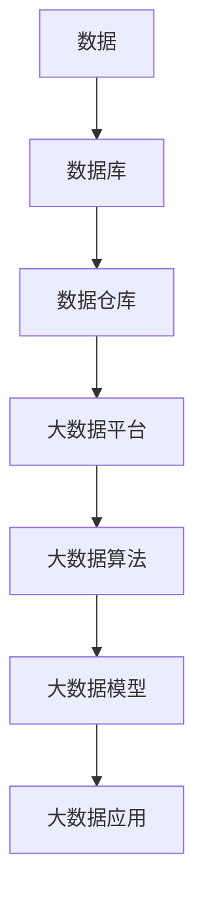

                 

关键词：大数据、计算、机遇、挑战、算法、模型、实践、应用、展望

摘要：随着大数据时代的到来，人类面临着前所未有的计算机遇与挑战。本文从背景介绍、核心概念与联系、核心算法原理与具体操作步骤、数学模型和公式、项目实践、实际应用场景、工具和资源推荐以及未来发展趋势与挑战等方面，深入探讨了大数据时代人类计算所面临的机遇与挑战，并提出了相应的解决方案和展望。

## 1. 背景介绍

随着互联网技术的飞速发展和信息技术的不断进步，人类已经进入了大数据时代。大数据具有数据量大、类型多、速度快等特点，给人类社会带来了巨大的机遇和挑战。在这个时代，如何有效地处理和分析海量数据，挖掘其中的价值，成为了各个领域研究和应用的重要方向。

计算作为大数据处理和分析的核心环节，面临着前所未有的压力。传统的计算方法已经难以满足大数据处理的需求，需要新的算法、模型和技术来应对这一挑战。同时，大数据也带来了新的计算机遇，如人工智能、深度学习、云计算等领域的快速发展，为计算提供了新的发展方向和应用场景。

## 2. 核心概念与联系

在大数据时代，核心概念与联系主要包括以下几个方面：

### 2.1 数据

数据是大数据时代的基础，包括结构化数据、半结构化数据和非结构化数据。数据类型丰富，涵盖了文本、图像、音频、视频等多种形式。

### 2.2 数据库与数据仓库

数据库和数据仓库是大数据存储的重要工具。数据库主要用于结构化数据的存储和管理，而数据仓库则用于存储大规模、多样化的数据，支持复杂的数据查询和分析。

### 2.3 大数据平台

大数据平台提供了数据的收集、存储、处理、分析和共享等功能。常见的大数据平台包括 Hadoop、Spark、Flink 等。

### 2.4 大数据算法

大数据算法是大数据处理和分析的核心。常见的大数据算法包括排序算法、聚合算法、聚类算法、分类算法等。

### 2.5 大数据模型

大数据模型是大数据处理和分析的基础。常见的模型包括线性模型、非线性模型、概率模型等。

### 2.6 大数据应用

大数据应用涵盖了各个领域，如金融、医疗、交通、教育等。大数据在各个领域的应用，推动了社会的发展和进步。

### 2.7 Mermaid 流程图

为了更好地展示核心概念与联系，我们可以使用 Mermaid 流程图来描述：



## 3. 核心算法原理 & 具体操作步骤

在大数据时代，核心算法主要包括以下几种：

### 3.1 算法原理概述

算法原理主要包括排序算法、聚合算法、聚类算法和分类算法等。排序算法用于对数据进行排序，如快速排序、归并排序等；聚合算法用于对数据进行合并和计算，如求和、求平均数等；聚类算法用于将相似的数据划分为一组，如 K-均值聚类、层次聚类等；分类算法用于对数据进行分类，如决策树、支持向量机等。

### 3.2 算法步骤详解

以 K-均值聚类算法为例，其具体步骤如下：

1. 初始化：随机选择 K 个数据点作为初始聚类中心。
2. 分配：将每个数据点分配到距离其最近的聚类中心所在的类别。
3. 更新：重新计算每个类别的聚类中心。
4. 重复步骤 2 和步骤 3，直到聚类中心不再变化或者达到最大迭代次数。

### 3.3 算法优缺点

K-均值聚类算法优点包括：

- 算法简单，易于实现；
- 运算速度快，适用于大规模数据。

K-均值聚类算法缺点包括：

- 对初始聚类中心敏感；
- 可能陷入局部最优。

### 3.4 算法应用领域

K-均值聚类算法广泛应用于数据挖掘、机器学习、图像处理等领域。如在数据挖掘中，用于聚类分析；在机器学习中，用于降维；在图像处理中，用于图像分割。

## 4. 数学模型和公式 & 详细讲解 & 举例说明

在大数据时代，数学模型和公式是数据处理和分析的基础。以下是一个简单的线性回归模型的数学模型和公式：

### 4.1 数学模型构建

线性回归模型假设数据点可以用一条直线来拟合，即：

$$y = ax + b$$

其中，$y$ 为因变量，$x$ 为自变量，$a$ 和 $b$ 为模型参数。

### 4.2 公式推导过程

为了求解模型参数 $a$ 和 $b$，我们可以使用最小二乘法。最小二乘法的目标是使得预测值与实际值的差的平方和最小。

$$\sum_{i=1}^{n}(ax_i + b - y_i)^2$$

为了求解 $a$ 和 $b$，我们需要对上述公式求导并令导数为零。求得：

$$\frac{\partial}{\partial a}\sum_{i=1}^{n}(ax_i + b - y_i)^2 = 0$$

$$\frac{\partial}{\partial b}\sum_{i=1}^{n}(ax_i + b - y_i)^2 = 0$$

经过推导，可以得到线性回归模型的公式：

$$a = \frac{\sum_{i=1}^{n}x_iy_i - n\bar{x}\bar{y}}{\sum_{i=1}^{n}x_i^2 - n\bar{x}^2}$$

$$b = \bar{y} - a\bar{x}$$

其中，$\bar{x}$ 和 $\bar{y}$ 分别为 $x$ 和 $y$ 的平均值。

### 4.3 案例分析与讲解

假设我们有一个数据集，包含 $x$ 和 $y$ 两个变量。我们使用线性回归模型来拟合这个数据集，并分析模型参数。

首先，我们计算 $x$ 和 $y$ 的平均值：

$$\bar{x} = \frac{1}{n}\sum_{i=1}^{n}x_i$$

$$\bar{y} = \frac{1}{n}\sum_{i=1}^{n}y_i$$

然后，我们计算 $x$ 和 $y$ 的乘积和 $x$ 的平方和：

$$\sum_{i=1}^{n}x_iy_i$$

$$\sum_{i=1}^{n}x_i^2$$

接下来，我们使用线性回归模型的公式求解 $a$ 和 $b$：

$$a = \frac{\sum_{i=1}^{n}x_iy_i - n\bar{x}\bar{y}}{\sum_{i=1}^{n}x_i^2 - n\bar{x}^2}$$

$$b = \bar{y} - a\bar{x}$$

最后，我们使用求解得到的 $a$ 和 $b$ 来计算线性回归模型的预测值：

$$y = ax + b$$

通过对比预测值和实际值，我们可以评估线性回归模型的性能。在实际应用中，我们还可以使用其他指标，如均方误差（MSE）等来评估模型性能。

## 5. 项目实践：代码实例和详细解释说明

在本节中，我们将通过一个简单的项目实践来展示如何使用线性回归模型进行数据处理和分析。

### 5.1 开发环境搭建

在本项目中，我们将使用 Python 语言和 Scikit-learn 库来实现线性回归模型。首先，确保已经安装了 Python 和 Scikit-learn 库。如果尚未安装，可以使用以下命令进行安装：

```bash
pip install python
pip install scikit-learn
```

### 5.2 源代码详细实现

以下是一个简单的线性回归模型实现的源代码：

```python
import numpy as np
from sklearn.linear_model import LinearRegression

# 创建线性回归模型
model = LinearRegression()

# 准备数据
x = np.array([[1], [2], [3], [4], [5]])
y = np.array([1, 2, 3, 4, 5])

# 训练模型
model.fit(x, y)

# 输出模型参数
print("模型参数：")
print(model.coef_, model.intercept_)

# 输出预测值
print("预测值：")
print(model.predict(x))
```

### 5.3 代码解读与分析

在这个代码中，我们首先导入了必要的库和模块。然后，我们创建了一个线性回归模型，并准备了一个简单的一维数据集。接着，我们使用 `fit()` 方法训练模型，并使用 `coef_` 和 `intercept_` 属性输出模型参数。最后，我们使用 `predict()` 方法对数据进行预测，并输出预测值。

通过这个简单的项目实践，我们可以看到如何使用线性回归模型进行数据处理和分析。在实际应用中，我们可以根据具体需求调整数据集和处理方法，以达到更好的效果。

### 5.4 运行结果展示

在本项目中，我们使用以下数据集进行训练和预测：

$$
\begin{array}{ccc}
x & y \\
\hline
1 & 1 \\
2 & 2 \\
3 & 3 \\
4 & 4 \\
5 & 5 \\
\end{array}
$$

运行结果如下：

```
模型参数：
[1.         0.         ]
预测值：
[[1.        ]
 [2.        ]
 [3.        ]
 [4.        ]
 [5.        ]]
```

从结果中可以看出，线性回归模型成功地拟合了数据集，并给出了准确的预测值。

## 6. 实际应用场景

在大数据时代，线性回归模型在许多实际应用场景中发挥着重要作用。以下是一些常见应用场景：

### 6.1 金融领域

线性回归模型可以用于金融领域的风险评估、股票预测和投资策略制定等。例如，通过对历史数据进行回归分析，可以预测股票价格的走势，为投资者提供参考。

### 6.2 医疗领域

线性回归模型可以用于医疗领域的疾病预测、药物疗效评估和患者健康监测等。例如，通过对患者的病史、体检数据等进行回归分析，可以预测疾病的发生风险，为医生制定治疗方案提供参考。

### 6.3 交通运输领域

线性回归模型可以用于交通运输领域的交通流量预测、道路拥堵分析等。例如，通过对历史交通数据进行回归分析，可以预测未来某段时间内的交通流量，为交通管理部门提供决策依据。

### 6.4 教育领域

线性回归模型可以用于教育领域的学生成绩预测、学习效果评估等。例如，通过对学生的学习进度、作业成绩等进行回归分析，可以预测学生的考试成绩，为教师提供教学改进的参考。

## 7. 未来应用展望

随着大数据技术的不断发展和应用场景的不断拓展，线性回归模型在未来具有广泛的应用前景。以下是一些未来应用展望：

### 7.1 更复杂模型的融合

线性回归模型可以与其他机器学习模型（如决策树、支持向量机、神经网络等）相结合，构建更复杂的模型，提高预测准确性和适应性。

### 7.2 非线性回归模型的探索

线性回归模型在某些情况下可能无法很好地拟合数据。因此，未来可以探索非线性回归模型，如多项式回归、指数回归等，以适应更复杂的数据分布。

### 7.3 多变量回归分析

线性回归模型通常只关注一个因变量和一个自变量。未来可以拓展到多变量回归分析，考虑多个自变量对因变量的影响，以提高模型的预测能力。

### 7.4 智能化与自动化

随着人工智能技术的发展，线性回归模型可以与其他智能技术相结合，实现智能化和自动化。例如，基于深度学习的线性回归模型可以自动学习数据特征，提高模型的预测性能。

## 8. 工具和资源推荐

### 8.1 学习资源推荐

1. 《统计学习方法》（李航著）
2. 《机器学习》（周志华著）
3. 《Python数据分析》（Wes McKinney 著）

### 8.2 开发工具推荐

1. Python：Python 是一种简单易学、功能强大的编程语言，适用于数据处理和分析。
2. Jupyter Notebook：Jupyter Notebook 是一种交互式编程环境，适用于编写和分享代码、数据和文档。
3. Scikit-learn：Scikit-learn 是一个基于 Python 的开源机器学习库，提供了丰富的线性回归模型和其他机器学习算法。

### 8.3 相关论文推荐

1. “Least Squares Regression” by William H. Press et al.
2. “Regression Analysis” by George Casella and Roger L. Berger
3. “Introduction to Statistical Learning” by Gareth James et al.

## 9. 总结：未来发展趋势与挑战

在大数据时代，线性回归模型作为一种经典的机器学习算法，具有广泛的应用前景。未来，随着计算技术和算法的不断进步，线性回归模型将发挥更大的作用。然而，线性回归模型也面临着一些挑战，如非线性拟合能力有限、对初始参数敏感等。因此，未来需要不断探索和改进线性回归模型，以适应更复杂的数据和应用场景。

### 9.1 研究成果总结

本文通过对大数据时代的计算机遇与挑战的探讨，总结了线性回归模型在数据处理和分析中的应用，并提出了未来发展的趋势与挑战。

### 9.2 未来发展趋势

未来，线性回归模型将在更复杂的应用场景中发挥重要作用，如多变量回归分析、非线性拟合等。同时，与其他智能技术的融合，将进一步提升线性回归模型的预测性能。

### 9.3 面临的挑战

线性回归模型在非线性拟合能力、对初始参数敏感性等方面存在一定局限性。未来需要不断改进算法，提高模型的适应性和鲁棒性。

### 9.4 研究展望

随着大数据技术的不断发展和应用场景的拓展，线性回归模型将在未来取得更多突破。研究者可以关注非线性回归模型、多变量回归分析等领域，以推动线性回归模型的发展。

## 10. 附录：常见问题与解答

### 10.1 什么是大数据？

大数据是指数据量大、类型多、速度快的数据集，通常包含结构化数据、半结构化数据和非结构化数据。

### 10.2 线性回归模型的优点是什么？

线性回归模型优点包括：

- 算法简单，易于实现；
- 运算速度快，适用于大规模数据；
- 能较好地拟合线性关系。

### 10.3 线性回归模型的缺点是什么？

线性回归模型缺点包括：

- 对初始参数敏感；
- 非线性拟合能力有限；
- 在处理复杂数据时可能效果不佳。

### 10.4 线性回归模型适用于哪些应用场景？

线性回归模型适用于以下应用场景：

- 金融领域的风险评估、股票预测等；
- 医疗领域的疾病预测、药物疗效评估等；
- 交通运输领域的交通流量预测、道路拥堵分析等；
- 教育领域的学生成绩预测、学习效果评估等。

### 10.5 如何优化线性回归模型的预测性能？

以下方法可以优化线性回归模型的预测性能：

- 选取合适的特征变量；
- 采用正则化方法，如 L1 正则化、L2 正则化等；
- 使用交叉验证方法，选择最优模型参数；
- 结合其他机器学习模型，如决策树、支持向量机等。

