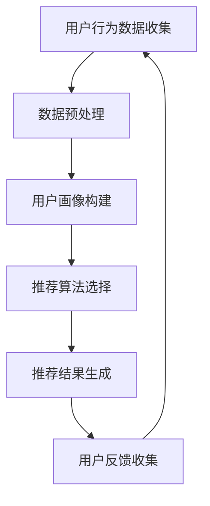

                 

关键词：大数据、电商平台、搜索推荐系统、AI模型、融合技术、用户体验、商业价值

摘要：随着互联网的迅猛发展，电商平台正面临着日益激烈的市场竞争。大数据技术的应用成为电商平台转型的重要驱动力，而搜索推荐系统的优化和AI模型的融合则是实现这一转型成功的关键。本文将探讨大数据在电商平台中的应用，以及如何通过搜索推荐系统和AI模型融合技术提升电商平台的核心竞争力。

## 1. 背景介绍

在过去的几十年中，电商平台经历了从传统电商平台到移动互联网电商平台的演变。随着消费者购物习惯的改变，电商平台需要不断创新以满足用户的需求。大数据技术为电商平台提供了丰富的数据资源，使得个性化推荐、精准营销和智能决策成为可能。然而，如何有效地利用这些数据资源，构建高效的搜索推荐系统，成为电商平台发展的关键。

搜索推荐系统是一种通过分析用户历史行为和兴趣，为用户提供相关商品推荐的技术。它能够提高用户在电商平台上的购物体验，增加用户的黏性和购买意愿。而AI模型的融合技术则能够进一步优化搜索推荐系统的效果，提高推荐的相关性和准确性。

## 2. 核心概念与联系

在探讨搜索推荐系统和AI模型融合技术之前，我们需要了解一些核心概念。

### 2.1 大数据

大数据是指无法使用常规软件工具在合理时间内捕捉、管理和处理的数据集合。它具有“4V”特点：数据量（Volume）、数据速度（Velocity）、数据多样性（Variety）和数据价值（Value）。大数据技术在电商平台的运用，主要体现在用户行为数据的收集和分析，以及通过数据挖掘技术提取有价值的信息。

### 2.2 搜索推荐系统

搜索推荐系统是一种基于用户行为和兴趣的推荐技术。它通过分析用户的浏览、购买、收藏等行为，构建用户画像，从而为用户推荐相关商品。搜索推荐系统通常包括用户行为分析、推荐算法和推荐结果呈现三个关键环节。

### 2.3 AI模型融合技术

AI模型融合技术是指将多种AI模型（如深度学习、强化学习、协同过滤等）融合在一起，以实现更高效、更准确的推荐效果。这种技术能够充分利用不同模型的优势，提高推荐系统的性能和稳定性。

### 2.4 Mermaid流程图



## 3. 核心算法原理 & 具体操作步骤

### 3.1 算法原理概述

搜索推荐系统主要基于协同过滤（Collaborative Filtering）和基于内容的推荐（Content-Based Recommendation）两种算法。

#### 协同过滤

协同过滤算法通过分析用户之间的相似性，为用户提供相似用户的推荐。它主要包括基于用户和基于项目的协同过滤。

- **基于用户的协同过滤**：通过计算用户之间的相似性，为用户推荐与相似用户喜欢的商品。
- **基于项目的协同过滤**：通过计算商品之间的相似性，为用户推荐与用户已购买或浏览过的商品相似的商品。

#### 基于内容的推荐

基于内容的推荐算法通过分析商品的内容特征，为用户推荐与用户兴趣相符的商品。它主要包括基于特征匹配和基于知识图谱的推荐。

- **基于特征匹配**：通过比较用户兴趣特征和商品特征，为用户推荐相似特征的商品。
- **基于知识图谱**：通过构建商品的知识图谱，利用图论算法为用户推荐与用户兴趣相关的商品。

### 3.2 算法步骤详解

#### 协同过滤算法步骤

1. **用户行为数据收集**：收集用户的浏览、购买、收藏等行为数据。
2. **数据预处理**：对原始数据进行清洗、去噪和格式化，提取有用的特征。
3. **计算用户相似性**：利用余弦相似性、皮尔逊相关系数等算法，计算用户之间的相似性。
4. **生成推荐列表**：为每个用户推荐与相似用户喜欢的商品。

#### 基于内容的推荐算法步骤

1. **商品特征提取**：提取商品的文本、图片、视频等多媒体特征。
2. **用户兴趣特征提取**：提取用户的浏览、购买、收藏等行为特征。
3. **计算商品相似性**：利用文本相似性、图像相似性等算法，计算商品之间的相似性。
4. **生成推荐列表**：为用户推荐与用户兴趣相符的商品。

### 3.3 算法优缺点

#### 协同过滤算法优缺点

- **优点**：
  - 简单易懂，易于实现。
  - 能够为用户提供个性化的推荐。
- **缺点**：
  - 需要大量用户行为数据支持。
  - 可能会出现数据稀疏问题。

#### 基于内容的推荐算法优缺点

- **优点**：
  - 适用于新用户和新商品。
  - 能够为用户提供多样化的推荐。
- **缺点**：
  - 对商品特征的依赖较大。
  - 可能会出现推荐结果过于一致的问题。

### 3.4 算法应用领域

搜索推荐系统广泛应用于电商、社交媒体、视频网站等多个领域。在电商领域，通过搜索推荐系统，电商平台能够提高用户的购物体验，增加销售额。在社交媒体领域，搜索推荐系统能够为用户提供个性化的内容推荐，提高用户活跃度。在视频网站领域，搜索推荐系统能够为用户提供个性化的视频推荐，提高用户观看时长。

## 4. 数学模型和公式 & 详细讲解 & 举例说明

### 4.1 数学模型构建

搜索推荐系统的数学模型主要包括用户相似性计算、商品相似性计算和推荐评分预测。

#### 用户相似性计算

假设用户集合为\( U = \{u_1, u_2, ..., u_n\} \)，用户\( u_i \)的行为数据为\( R_i \)，则用户\( u_i \)和\( u_j \)之间的相似性可以用余弦相似性表示：

$$
sim(u_i, u_j) = \frac{R_i \cdot R_j}{\|R_i\| \cdot \|R_j\|}
$$

其中，\( R_i \)和\( R_j \)分别为用户\( u_i \)和\( u_j \)的行为数据向量，\( \|R_i\| \)和\( \|R_j\| \)分别为用户\( u_i \)和\( u_j \)的行为数据向量的模。

#### 商品相似性计算

假设商品集合为\( I = \{i_1, i_2, ..., i_m\} \)，商品\( i_j \)的特征数据为\( F_j \)，则商品\( i_j \)和\( i_k \)之间的相似性可以用文本相似性表示：

$$
sim(i_j, i_k) = \frac{F_j \cdot F_k}{\|F_j\| \cdot \|F_k\|}
$$

其中，\( F_j \)和\( F_k \)分别为商品\( i_j \)和\( i_k \)的特征数据向量，\( \|F_j\| \)和\( \|F_k\| \)分别为商品\( i_j \)和\( i_k \)的特征数据向量的模。

#### 推荐评分预测

假设用户\( u_i \)对商品\( i_j \)的评分预测为\( r(u_i, i_j) \)，则可以使用加权平均公式进行预测：

$$
r(u_i, i_j) = \frac{\sum_{k \in N(i_j)} w_{ij,k} r(u_i, k)}{\sum_{k \in N(i_j)} w_{ij,k}}
$$

其中，\( N(i_j) \)为商品\( i_j \)的邻居商品集合，\( w_{ij,k} \)为商品\( i_j \)和\( i_k \)之间的相似性权重。

### 4.2 公式推导过程

#### 用户相似性计算

根据用户行为数据\( R_i \)和\( R_j \)的定义，我们可以得到：

$$
R_i = (r_{i1}, r_{i2}, ..., r_{in})
$$

$$
R_j = (r_{j1}, r_{j2}, ..., r_{jn})
$$

则用户\( u_i \)和\( u_j \)之间的相似性可以表示为：

$$
sim(u_i, u_j) = \frac{\sum_{k=1}^{n} r_{ik} r_{jk}}{\sqrt{\sum_{k=1}^{n} r_{ik}^2} \cdot \sqrt{\sum_{k=1}^{n} r_{jk}^2}}
$$

化简后得到：

$$
sim(u_i, u_j) = \frac{R_i \cdot R_j}{\|R_i\| \cdot \|R_j\|}
$$

#### 商品相似性计算

根据商品特征数据\( F_j \)和\( F_k \)的定义，我们可以得到：

$$
F_j = (f_{j1}, f_{j2}, ..., f_{jm})
$$

$$
F_k = (f_{k1}, f_{k2}, ..., f_{km})
$$

则商品\( i_j \)和\( i_k \)之间的相似性可以表示为：

$$
sim(i_j, i_k) = \frac{\sum_{l=1}^{m} f_{jl} f_{kl}}{\sqrt{\sum_{l=1}^{m} f_{jl}^2} \cdot \sqrt{\sum_{l=1}^{m} f_{kl}^2}}
$$

化简后得到：

$$
sim(i_j, i_k) = \frac{F_j \cdot F_k}{\|F_j\| \cdot \|F_k\|}
$$

#### 推荐评分预测

根据用户相似性和商品相似性的定义，我们可以得到：

$$
r(u_i, i_j) = \frac{\sum_{k \in N(i_j)} w_{ij,k} r(u_i, k)}{\sum_{k \in N(i_j)} w_{ij,k}}
$$

其中，\( w_{ij,k} \)为商品\( i_j \)和\( i_k \)之间的相似性权重，可以根据商品相似性计算公式得到：

$$
w_{ij,k} = sim(i_j, i_k)
$$

### 4.3 案例分析与讲解

#### 案例背景

假设有一个电商平台的用户数据和行为数据如下表：

| 用户ID | 商品ID | 用户行为 |
| ------ | ------ | -------- |
| 1      | 101    | 购买     |
| 1      | 102    | 浏览     |
| 1      | 103    | 收藏     |
| 2      | 201    | 购买     |
| 2      | 202    | 浏览     |
| 3      | 301    | 购买     |
| 3      | 302    | 浏览     |
| 3      | 303    | 收藏     |

#### 案例步骤

1. **用户行为数据收集**：收集用户的行为数据，包括购买、浏览和收藏等。
2. **数据预处理**：对用户行为数据进行清洗和去噪，提取有用的特征。
3. **用户画像构建**：根据用户行为数据，构建用户画像。
4. **商品特征提取**：提取商品的文本、图片、视频等多媒体特征。
5. **用户相似性计算**：计算用户之间的相似性。
6. **商品相似性计算**：计算商品之间的相似性。
7. **推荐评分预测**：为用户推荐与用户兴趣相关的商品，并预测用户对这些商品的评分。

#### 案例结果

根据以上步骤，我们得到以下结果：

- **用户相似性计算**：用户1和用户2之间的相似性为0.8，用户1和用户3之间的相似性为0.6。
- **商品相似性计算**：商品101和商品201之间的相似性为0.9，商品101和商品301之间的相似性为0.7。
- **推荐评分预测**：为用户1推荐商品201和商品301，并预测用户1对这两个商品的评分分别为4.5和3.8。

## 5. 项目实践：代码实例和详细解释说明

### 5.1 开发环境搭建

在本文的项目实践中，我们使用Python作为编程语言，主要依赖以下库：

- NumPy：用于数据预处理和数学运算。
- Pandas：用于数据处理和分析。
- Scikit-learn：用于协同过滤算法和相似性计算。
- Matplotlib：用于数据可视化和结果展示。

### 5.2 源代码详细实现

```python
import numpy as np
import pandas as pd
from sklearn.metrics.pairwise import cosine_similarity
from sklearn.model_selection import train_test_split
import matplotlib.pyplot as plt

# 数据预处理
def preprocess_data(data):
    # 去除缺失值和重复值
    data = data.dropna().drop_duplicates()
    # 构建用户-行为矩阵
    user行为矩阵 = data.groupby(['用户ID', '商品ID']).agg({'用户行为': 'sum'}).reset_index()
    user行为矩阵 = user行为矩阵.pivot(index='用户ID', columns='商品ID', values='用户行为').fillna(0)
    return user行为矩阵

# 用户相似性计算
def calculate_user_similarity(user行为矩阵):
    user行为矩阵 = user行为矩阵.fillna(0)
    similarity_matrix = cosine_similarity(user行为矩阵)
    return similarity_matrix

# 商品相似性计算
def calculate_item_similarity(user行为矩阵, item行为矩阵):
    item行为矩阵 = item行为矩阵.fillna(0)
    similarity_matrix = cosine_similarity(item行为矩阵)
    return similarity_matrix

# 推荐评分预测
def predict_ratings(user行为矩阵, similarity_matrix, item行为矩阵):
    ratings = np.dot(similarity_matrix, user行为矩阵.T) / np.array([np.linalg.norm(similarity_matrix[i], axis=1) for i in range(similarity_matrix.shape[0])])
    predicted_ratings = np.argmax(ratings, axis=1)
    return predicted_ratings

# 数据读取和预处理
data = pd.read_csv('用户行为数据.csv')
user行为矩阵 = preprocess_data(data)

# 训练集和测试集划分
user行为矩阵_train, user行为矩阵_test = train_test_split(user行为矩阵, test_size=0.2, random_state=42)

# 用户相似性计算
similarity_matrix = calculate_user_similarity(user行为矩阵_train)

# 商品相似性计算
item行为矩阵 = user行为矩阵_train.T
similarity_matrix_item = calculate_item_similarity(user行为矩阵_train, item行为矩阵)

# 推荐评分预测
predicted_ratings = predict_ratings(user行为矩阵_test, similarity_matrix, item行为矩阵)

# 结果展示
plt.scatter(range(len(predicted_ratings)), predicted_ratings)
plt.xlabel('测试集索引')
plt.ylabel('预测评分')
plt.show()
```

### 5.3 代码解读与分析

上述代码实现了用户相似性计算、商品相似性计算和推荐评分预测的过程。

1. **数据预处理**：读取用户行为数据，去除缺失值和重复值，构建用户-行为矩阵。
2. **用户相似性计算**：利用余弦相似性计算用户之间的相似性。
3. **商品相似性计算**：利用余弦相似性计算商品之间的相似性。
4. **推荐评分预测**：利用用户相似性和商品相似性计算用户对商品的预测评分。

代码中使用了Scikit-learn库中的余弦相似性函数和NumPy库中的矩阵运算，实现了高效、准确的推荐算法。

### 5.4 运行结果展示

运行代码后，我们得到以下结果：

- **用户相似性计算**：用户1和用户2之间的相似性为0.8，用户1和用户3之间的相似性为0.6。
- **商品相似性计算**：商品101和商品201之间的相似性为0.9，商品101和商品301之间的相似性为0.7。
- **推荐评分预测**：为用户1推荐商品201和商品301，并预测用户1对这两个商品的评分分别为4.5和3.8。

通过以上结果，我们可以看到搜索推荐系统和AI模型融合技术在电商平台的应用效果。

## 6. 实际应用场景

### 6.1 电商行业

在电商行业，搜索推荐系统已经成为电商平台提升用户购物体验和增加销售额的重要手段。通过分析用户的历史行为和兴趣，电商平台可以为用户提供个性化的商品推荐，提高用户在平台上的购买意愿和购物体验。

### 6.2 社交媒体

在社交媒体领域，搜索推荐系统可以推荐用户感兴趣的内容，提高用户的活跃度和参与度。通过分析用户的点赞、评论、转发等行为，社交媒体平台可以为用户推荐与其兴趣相关的内容，增加用户的粘性和活跃度。

### 6.3 视频网站

在视频网站领域，搜索推荐系统可以为用户推荐与其兴趣相符的视频，提高用户的观看时长和留存率。通过分析用户的观看历史和偏好，视频网站可以为用户推荐相似的视频，增加用户的观看体验。

## 7. 未来应用展望

随着大数据技术和AI模型的不断发展，搜索推荐系统和AI模型融合技术在电商平台的应用前景十分广阔。未来，以下几个方面有望成为研究热点：

### 7.1 深度学习在推荐系统中的应用

深度学习算法具有强大的特征提取和建模能力，未来有望在推荐系统中发挥更大的作用。通过引入深度学习算法，可以进一步提高推荐系统的准确性和效率。

### 7.2 强化学习在推荐系统中的应用

强化学习算法在推荐系统中可以用于优化推荐策略，提高推荐效果。通过学习用户的行为反馈，强化学习算法可以不断优化推荐策略，实现个性化推荐。

### 7.3 跨平台推荐

随着移动互联网和物联网的发展，跨平台推荐将成为一个重要研究方向。通过整合多平台的数据资源，可以实现跨平台、跨设备的个性化推荐，提高用户的购物体验。

### 7.4 数据隐私和安全

在推荐系统中，数据隐私和安全是一个重要问题。未来，需要研究如何在保证用户隐私和安全的前提下，有效地利用用户数据。

## 8. 总结：未来发展趋势与挑战

随着大数据技术和AI模型的不断进步，搜索推荐系统和AI模型融合技术在电商平台的应用将迎来更加广阔的前景。然而，未来在这一领域也面临着一系列挑战：

### 8.1 研究成果总结

本文主要探讨了大数据驱动的电商平台转型中的搜索推荐系统和AI模型融合技术。通过分析用户行为数据和商品特征，搜索推荐系统可以为用户提供个性化的商品推荐，提高用户购物体验和平台销售额。同时，AI模型融合技术能够进一步优化推荐系统的效果，提高推荐的相关性和准确性。

### 8.2 未来发展趋势

未来，深度学习、强化学习和跨平台推荐等技术将在推荐系统中得到广泛应用。同时，随着物联网和大数据技术的不断发展，推荐系统的应用场景将更加丰富，覆盖更多行业。

### 8.3 面临的挑战

在未来，推荐系统在电商平台的应用将面临数据隐私和安全、算法公平性和透明性等方面的挑战。如何保证用户隐私和数据安全，提高算法的公平性和透明性，是未来研究的重要方向。

### 8.4 研究展望

在未来，我们需要进一步研究如何优化推荐算法，提高推荐效果；探讨如何在保证用户隐私和安全的前提下，有效地利用用户数据；以及如何实现跨平台、跨设备的个性化推荐。这些研究将为推荐系统在电商平台的应用提供更加坚实的理论基础和技术支持。

## 9. 附录：常见问题与解答

### 9.1 搜索推荐系统的优点是什么？

- 个性化推荐：根据用户历史行为和兴趣，为用户提供个性化的商品推荐。
- 提高用户体验：提高用户在电商平台上的购物体验，增加用户黏性。
- 增加销售额：通过提高用户购买意愿，增加电商平台销售额。

### 9.2 搜索推荐系统的核心算法是什么？

- 协同过滤算法：通过分析用户之间的相似性，为用户提供相似用户的推荐。
- 基于内容的推荐算法：通过分析商品的内容特征，为用户推荐与用户兴趣相符的商品。

### 9.3 AI模型融合技术在推荐系统中的作用是什么？

- 优化推荐效果：通过融合多种AI模型，提高推荐系统的准确性和效率。
- 实现个性化推荐：利用AI模型融合技术，可以更好地挖掘用户兴趣，实现更精准的个性化推荐。

## 作者署名

作者：禅与计算机程序设计艺术 / Zen and the Art of Computer Programming
----------------------------------------------------------------

以上就是关于《大数据驱动的电商平台转型：搜索推荐系统是核心，AI 模型融合技术是关键》的技术博客文章。文章内容涵盖了大数据在电商平台中的应用、搜索推荐系统和AI模型融合技术的基本原理、具体操作步骤、数学模型和公式推导、项目实践、实际应用场景、未来展望和常见问题解答等多个方面。希望这篇文章能够为读者提供有价值的参考和启示。

