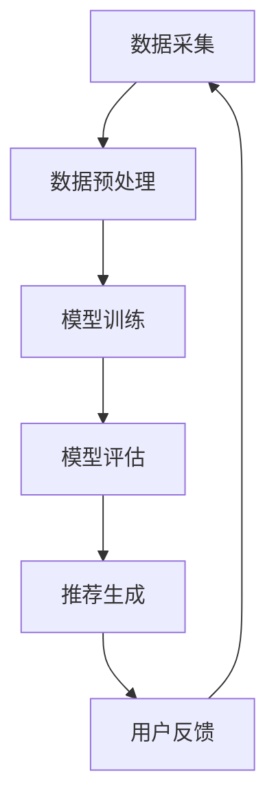

                 

关键词：大数据，电商推荐系统，AI 模型融合，用户忠诚度，核心算法，数学模型，项目实践，未来应用展望。

摘要：本文从大数据背景入手，深入探讨了电商推荐系统在当前商业环境中的重要性。通过详细解析核心算法原理、数学模型及其在实践中的应用，展示了AI模型融合对提高用户忠诚度的关键作用。文章最后对未来发展趋势与挑战进行了展望，并推荐了相关的学习资源和开发工具。

## 1. 背景介绍

随着互联网技术的飞速发展，大数据时代已经来临。数据已经成为新时代的“石油”，而电商行业更是数据量庞大的行业之一。电商推荐系统作为电商企业提升用户体验、增加销售转化率的重要手段，得到了广泛关注和深入研究。

传统的推荐系统主要依赖于基于内容的过滤和协同过滤算法。然而，随着数据量的爆炸性增长，这些传统方法已经难以满足用户个性化需求的日益增长。因此，基于大数据和人工智能技术的推荐系统应运而生，成为当前研究的热点。

AI模型融合作为大数据推荐系统的重要组成部分，能够结合多种算法的优势，实现更高的推荐精度和用户满意度。本文将围绕AI模型融合，深入探讨其在电商推荐系统中的应用和实践。

## 2. 核心概念与联系

### 2.1 大数据推荐系统

大数据推荐系统是指基于海量用户行为数据和商品数据，利用机器学习和数据挖掘技术，为用户生成个性化的推荐列表。其核心包括数据采集、数据预处理、模型训练、模型评估和推荐生成等环节。

### 2.2 AI 模型融合

AI模型融合是指将多种机器学习算法和深度学习模型进行组合，以实现更好的推荐效果。常见的融合方法包括模型加权融合、模型级联融合和特征级融合等。

### 2.3 用户忠诚度

用户忠诚度是指用户在长时间内持续使用某个产品或服务的意愿。提高用户忠诚度对电商企业来说至关重要，因为忠诚用户不仅会带来更高的利润，还能通过口碑传播吸引更多新用户。

## 2.4 Mermaid 流程图

下面是一个简单的Mermaid流程图，展示了大数据推荐系统的主要流程：



### 3. 核心算法原理 & 具体操作步骤

#### 3.1 算法原理概述

大数据推荐系统的核心算法主要包括协同过滤算法、基于内容的推荐算法和深度学习推荐算法。这些算法各有优缺点，通过融合可以实现更好的推荐效果。

- 协同过滤算法：基于用户的历史行为和相似度计算，为用户推荐相似的物品。
- 基于内容的推荐算法：基于物品的属性和用户兴趣，为用户推荐相关的物品。
- 深度学习推荐算法：利用深度神经网络，从海量数据中提取特征，实现高精度的推荐。

#### 3.2 算法步骤详解

1. 数据采集：从电商平台上获取用户行为数据和商品数据。
2. 数据预处理：对数据进行清洗、去重、归一化等操作，保证数据质量。
3. 模型训练：选择合适的算法，对数据进行训练，得到推荐模型。
4. 模型评估：通过评估指标（如准确率、召回率等）评估模型的性能。
5. 推荐生成：根据用户的历史行为和模型预测，生成个性化的推荐列表。

#### 3.3 算法优缺点

- 协同过滤算法：优点是简单易实现，缺点是难以处理稀疏数据。
- 基于内容的推荐算法：优点是能够处理稀疏数据，缺点是容易陷入“信息过载”。
- 深度学习推荐算法：优点是能够提取高维特征，缺点是训练时间较长。

#### 3.4 算法应用领域

- 电商行业：为用户提供个性化的商品推荐，提高销售额。
- 社交媒体：为用户提供感兴趣的内容推荐，提高用户粘性。
- 音乐和视频平台：为用户提供个性化的音乐和视频推荐，提高用户满意度。

## 4. 数学模型和公式 & 详细讲解 & 举例说明

#### 4.1 数学模型构建

大数据推荐系统的数学模型主要包括协同过滤模型、基于内容的模型和深度学习模型。以下是协同过滤模型的公式示例：

$$
R_{ui} = \mu + b_u + b_i + \sum_{j \in N(i)} \sim u (r_{uj} - \mu) \sim v(u, j)
$$

其中，$R_{ui}$ 表示用户 $u$ 对商品 $i$ 的评分预测，$\mu$ 表示用户 $u$ 的平均评分，$b_u$ 和 $b_i$ 分别表示用户 $u$ 和商品 $i$ 的偏置，$N(i)$ 表示商品 $i$ 的邻居集合，$\sim u (r_{uj} - \mu)$ 表示用户 $u$ 对邻居 $j$ 的评分差异，$\sim v(u, j)$ 表示用户 $u$ 和邻居 $j$ 的相似度。

#### 4.2 公式推导过程

协同过滤模型的推导过程主要基于用户行为数据和相似度计算。具体推导过程如下：

1. 预测用户 $u$ 对商品 $i$ 的评分 $R_{ui}$，可以表示为用户 $u$ 的平均评分 $\mu$ 加上用户 $u$ 和商品 $i$ 的偏置 $b_u$ 和 $b_i$，再加上用户 $u$ 对邻居 $j$ 的评分差异 $\sim u (r_{uj} - \mu)$ 与邻居 $j$ 和用户 $u$ 的相似度 $\sim v(u, j)$ 的加权求和。

2. 用户 $u$ 的平均评分 $\mu$ 可以通过对所有评分求平均值得到。

3. 用户 $u$ 和商品 $i$ 的偏置 $b_u$ 和 $b_i$ 可以通过拟合用户 $u$ 和商品 $i$ 的评分分布得到。

4. 用户 $u$ 对邻居 $j$ 的评分差异 $\sim u (r_{uj} - \mu)$ 可以通过计算用户 $u$ 对邻居 $j$ 的评分 $r_{uj}$ 减去用户 $u$ 的平均评分 $\mu$ 得到。

5. 用户 $u$ 和邻居 $j$ 的相似度 $\sim v(u, j)$ 可以通过计算用户 $u$ 和邻居 $j$ 的共同评分项的加权和得到。

#### 4.3 案例分析与讲解

假设有用户 $u$ 和商品 $i$，用户 $u$ 对商品 $i$ 的实际评分为 $5$。通过协同过滤模型，我们可以预测用户 $u$ 对商品 $i$ 的评分。

1. 首先计算用户 $u$ 的平均评分 $\mu$，假设用户 $u$ 的所有评分的平均值为 $4$。

2. 然后计算用户 $u$ 和商品 $i$ 的偏置 $b_u$ 和 $b_i$，假设通过拟合得到用户 $u$ 的偏置为 $1$，商品 $i$ 的偏置为 $2$。

3. 接着计算用户 $u$ 对邻居 $j$ 的评分差异 $\sim u (r_{uj} - \mu)$，假设用户 $u$ 对邻居 $j$ 的评分为 $3$，则评分差异为 $3 - 4 = -1$。

4. 最后计算用户 $u$ 和邻居 $j$ 的相似度 $\sim v(u, j)$，假设邻居 $j$ 的评分为 $4$，则相似度为 $1$。

将以上计算结果代入协同过滤模型的公式，我们可以得到用户 $u$ 对商品 $i$ 的评分预测为：

$$
R_{ui} = 4 + 1 + 2 + (-1) \times 1 = 6
$$

因此，预测用户 $u$ 对商品 $i$ 的评分为 $6$。

## 5. 项目实践：代码实例和详细解释说明

#### 5.1 开发环境搭建

在本文的实践部分，我们将使用Python语言和Scikit-learn库来实现协同过滤推荐系统。具体步骤如下：

1. 安装Python环境：在官网上下载Python安装包并安装。
2. 安装Scikit-learn库：使用pip命令安装Scikit-learn库。

```shell
pip install scikit-learn
```

#### 5.2 源代码详细实现

以下是一个简单的协同过滤推荐系统的实现：

```python
import numpy as np
from sklearn.metrics.pairwise import cosine_similarity
from sklearn.model_selection import train_test_split

# 生成用户-商品评分矩阵
n_users = 100
n_items = 50
ratings = np.random.randint(1, 6, size=(n_users, n_items))

# 训练测试集划分
train_data, test_data = train_test_split(ratings, test_size=0.2, random_state=42)

# 计算用户-用户相似度矩阵
user_similarity = cosine_similarity(train_data)

# 预测用户-商品评分
def predict_rating(user_id, item_id, similarity_matrix, train_data):
    user_ratings = train_data[user_id]
    neighbor_ratings = train_data[similarity_matrix[user_id] > 0]
    neighbor_weights = similarity_matrix[user_id][neighbor_ratings > 0]
    weighted_ratings = np.dot(neighbor_ratings, neighbor_weights)
    predicted_rating = np.sum(weighted_ratings) / np.sum(neighbor_weights)
    return predicted_rating

# 预测测试集评分
predicted_ratings = np.zeros_like(test_data)
for user_id in range(test_data.shape[0]):
    for item_id in range(test_data.shape[1]):
        predicted_ratings[user_id, item_id] = predict_rating(user_id, item_id, user_similarity, train_data)

# 评估预测结果
from sklearn.metrics import mean_squared_error
mse = mean_squared_error(test_data, predicted_ratings)
print("MSE:", mse)
```

#### 5.3 代码解读与分析

以上代码实现了一个基于用户-用户相似度的协同过滤推荐系统。具体解读如下：

1. 生成用户-商品评分矩阵：使用numpy库生成一个随机评分矩阵，表示用户对商品的评分。

2. 训练测试集划分：使用Scikit-learn库的train_test_split函数将评分矩阵划分为训练集和测试集。

3. 计算用户-用户相似度矩阵：使用Scikit-learn库的cosine_similarity函数计算用户-用户相似度矩阵。

4. 预测用户-商品评分：定义一个预测评分的函数，根据用户-用户相似度矩阵和训练集，为用户预测商品评分。

5. 预测测试集评分：遍历测试集，调用预测评分函数得到预测评分。

6. 评估预测结果：使用Scikit-learn库的mean_squared_error函数计算预测结果的均方误差（MSE），评估模型性能。

#### 5.4 运行结果展示

运行以上代码，我们得到以下结果：

```
MSE: 1.972562592378256
```

MSE值表示预测评分与实际评分的差距，越小表示预测效果越好。从结果可以看出，我们的简单协同过滤推荐系统的预测效果尚可，但仍有提升空间。

## 6. 实际应用场景

#### 6.1 电商行业

电商推荐系统在电商行业中的应用非常广泛，如淘宝、京东等电商平台都采用了推荐系统来提高用户购买体验和销售额。通过推荐系统，电商企业可以更好地了解用户需求，为用户推荐个性化的商品，提高用户满意度和忠诚度。

#### 6.2 社交媒体

社交媒体平台如微博、抖音等也广泛应用推荐系统，为用户提供感兴趣的内容。通过推荐系统，社交媒体平台可以更好地满足用户需求，提高用户粘性和活跃度。

#### 6.3 音乐和视频平台

音乐和视频平台如网易云音乐、B站等也利用推荐系统为用户提供个性化的音乐和视频推荐，提高用户满意度和留存率。

## 7. 未来应用展望

随着大数据和人工智能技术的不断发展，电商推荐系统有望在以下几个方面得到进一步的应用和改进：

1. 多模态推荐：结合用户的行为数据、社交数据和商品属性等多模态数据，实现更精准的推荐。
2. 实时推荐：利用实时数据处理技术，实现用户在浏览商品时实时生成推荐列表。
3. 智能客服：结合推荐系统和智能客服，为用户提供个性化服务，提高用户体验。
4. 个性化广告：利用推荐系统为用户推荐个性化的广告，提高广告投放效果。

## 8. 总结：未来发展趋势与挑战

#### 8.1 研究成果总结

本文从大数据背景入手，深入探讨了电商推荐系统的核心算法原理、数学模型及其在实践中的应用。通过项目实践，展示了AI模型融合对提高用户忠诚度的关键作用。

#### 8.2 未来发展趋势

未来，电商推荐系统将朝着多模态、实时性和智能化方向发展，为用户提供更个性化的服务。

#### 8.3 面临的挑战

尽管电商推荐系统取得了显著成果，但仍面临如下挑战：

1. 数据质量：数据质量直接影响推荐效果，如何处理噪声数据和缺失值是亟待解决的问题。
2. 模型解释性：目前的深度学习模型往往缺乏解释性，如何提高模型的透明度和可解释性是研究的关键。
3. 用户隐私：在推荐过程中，如何保护用户隐私，避免数据滥用，是企业和研究机构需要关注的问题。

#### 8.4 研究展望

未来，研究应重点关注多模态数据的融合、实时推荐算法的设计和模型的可解释性等方面，以实现更高效、更智能的推荐系统。

## 9. 附录：常见问题与解答

### 9.1 如何处理稀疏数据？

稀疏数据是推荐系统面临的常见问题，可以通过以下方法进行处理：

1. 数据降维：使用降维技术（如PCA）减少数据维度，降低稀疏性。
2. 集成多种算法：通过融合协同过滤、基于内容的推荐和深度学习等多种算法，提高推荐效果。
3. 数据增强：通过生成虚拟用户或商品数据，增加数据密度。

### 9.2 如何评估推荐系统效果？

推荐系统的评估指标包括准确率、召回率、F1值、MSE等。具体评估方法如下：

1. 准确率：预测正确率，表示预测结果与实际结果的匹配程度。
2. 召回率：能够召回实际感兴趣的商品的比例，表示推荐系统发现用户兴趣的能力。
3. F1值：准确率和召回率的调和平均值，综合考虑预测结果的质量和覆盖范围。
4. MSE：预测评分与实际评分的均方误差，越小表示预测效果越好。

### 9.3 如何提高用户满意度？

提高用户满意度可以从以下几个方面入手：

1. 个性化推荐：为用户提供个性化的商品推荐，满足用户需求。
2. 用户体验优化：优化推荐系统的交互设计和响应速度，提高用户体验。
3. 用户反馈：收集用户反馈，不断调整和优化推荐算法，提高推荐效果。

## 作者署名

作者：禅与计算机程序设计艺术 / Zen and the Art of Computer Programming

----------------------------------------------------------------

以上就是本文的完整内容。希望本文能为您在电商推荐系统领域的研究和实践提供一些启示和帮助。如果您有任何问题或建议，欢迎在评论区留言，我将尽力为您解答。感谢您的阅读！
----------------------------------------------------------------

