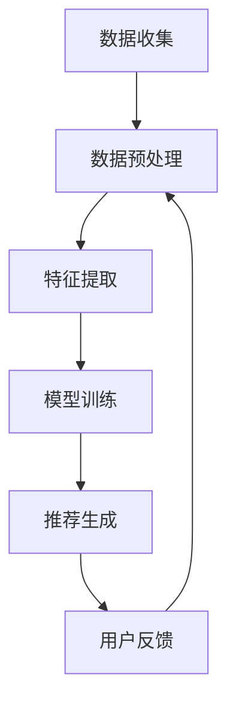

                 

关键词：大数据，电商搜索推荐，AI 模型融合，技术趋势，核心竞争力

> 摘要：本文深入探讨了大数据驱动的电商搜索推荐系统的核心技术和AI模型融合的重要性。通过分析现有系统的优缺点，提出了基于深度学习和强化学习等AI技术的优化策略，为电商行业提供了有价值的参考。

## 1. 背景介绍

随着互联网技术的飞速发展，电子商务已经成为全球商业活动的重要组成部分。电商平台的兴起不仅改变了消费者的购物方式，也极大地丰富了商品种类和交易模式。然而，随着用户数量的急剧增加和商品种类的不断扩张，如何提高搜索推荐的准确性和用户体验，成为了电商平台需要解决的重要问题。

大数据技术的兴起为电商搜索推荐系统提供了新的机遇。通过收集和分析海量用户数据，电商企业可以更好地理解用户需求和行为，从而提供更加个性化的搜索和推荐服务。然而，现有的推荐系统往往面临数据噪声、冷启动问题、多样性缺失等挑战。因此，如何利用AI技术对推荐系统进行优化和提升，成为了当前研究的热点。

本文将从以下几个方面展开讨论：首先，介绍大数据驱动的电商搜索推荐系统的基本原理和现状；然后，分析现有系统的优缺点；接着，探讨AI模型融合技术的基本原理和具体实现方法；最后，提出未来发展趋势和面临的挑战。

## 2. 核心概念与联系

### 2.1 大数据与电商搜索推荐

大数据（Big Data）指的是无法使用常规数据库工具进行捕捉、管理和处理的数据集合。它具有大量、多样、快速、变化频繁等特点。在电商搜索推荐系统中，大数据主要用于收集用户行为数据（如浏览、购买、评价等）、商品信息（如类别、价格、库存等）和外部数据（如天气、节假日等）。

电商搜索推荐系统的工作原理可以概括为以下几个步骤：

1. **数据收集**：通过多种渠道收集用户和商品的数据。
2. **数据预处理**：对原始数据进行清洗、转换和归一化处理。
3. **特征提取**：从预处理后的数据中提取有用的特征。
4. **模型训练**：利用机器学习算法对特征进行训练，生成推荐模型。
5. **推荐生成**：根据用户特征和商品特征，利用推荐模型生成个性化推荐。

### 2.2 AI 模型融合

AI 模型融合（AI Model Fusion）是一种将多种AI模型整合起来，共同完成任务的策略。通过融合不同模型的优点，可以提升系统的整体性能。在电商搜索推荐系统中，常见的AI模型融合技术包括：

1. **深度学习模型融合**：如基于CNN和RNN的组合模型，用于同时处理图像和文本数据。
2. **强化学习模型融合**：如基于多智能体的强化学习模型，用于复杂环境的动态推荐。
3. **迁移学习模型融合**：如将预训练模型应用于新任务，提升模型的泛化能力。

### 2.3 Mermaid 流程图

以下是一个简单的Mermaid流程图，展示了大数据驱动的电商搜索推荐系统的主要流程：



## 3. 核心算法原理 & 具体操作步骤

### 3.1 算法原理概述

在电商搜索推荐系统中，常用的算法包括基于内容的推荐、协同过滤推荐和基于模型的推荐。这些算法各有优缺点，AI模型融合技术可以将它们结合起来，形成更强大的推荐系统。

1. **基于内容的推荐**：根据用户兴趣和商品属性进行推荐。
2. **协同过滤推荐**：基于用户行为数据挖掘相似用户和商品，进行推荐。
3. **基于模型的推荐**：利用机器学习算法，学习用户和商品的特征，生成推荐。

### 3.2 算法步骤详解

#### 3.2.1 数据收集

数据收集是推荐系统的第一步，主要包括用户行为数据、商品信息和其他外部数据。数据来源可以是电商平台自身的数据采集系统，也可以是第三方数据提供商。

#### 3.2.2 数据预处理

数据预处理包括数据清洗、转换和归一化。数据清洗是为了去除噪声和异常值；数据转换是将数据格式统一，如将文本数据转换为向量；归一化是为了使得不同特征的数据具有相似的范围，便于模型训练。

#### 3.2.3 特征提取

特征提取是推荐系统的核心步骤，它将原始数据转换为适合机器学习模型的特征表示。常用的特征提取方法包括词袋模型、TF-IDF、Word2Vec等。

#### 3.2.4 模型训练

模型训练是利用特征数据和标签数据（如用户是否购买某个商品）来训练推荐模型。常用的算法包括线性回归、SVD、决策树、神经网络等。

#### 3.2.5 推荐生成

推荐生成是根据用户特征和商品特征，利用训练好的模型生成推荐列表。常用的方法包括基于用户的相似度计算、基于物品的相似度计算和基于模型的推荐。

### 3.3 算法优缺点

1. **基于内容的推荐**：
   - 优点：能够根据用户兴趣进行精准推荐。
   - 缺点：受限于商品属性的丰富度和一致性。

2. **协同过滤推荐**：
   - 优点：能够发现用户之间的相似性，推荐更加个性。
   - 缺点：可能出现多样性缺失和冷启动问题。

3. **基于模型的推荐**：
   - 优点：能够利用机器学习算法提取复杂的用户和商品特征。
   - 缺点：对训练数据量和质量有较高要求。

### 3.4 算法应用领域

AI模型融合技术在电商搜索推荐系统中的应用非常广泛，如淘宝、京东等大型电商平台都采用了这种技术。通过融合不同模型的优点，这些平台能够提供更加精准和个性化的推荐服务，从而提升用户体验和销售额。

## 4. 数学模型和公式 & 详细讲解 & 举例说明

### 4.1 数学模型构建

在电商搜索推荐系统中，常用的数学模型包括协同过滤模型、基于内容的推荐模型和基于模型的推荐模型。以下分别介绍这些模型的数学表示。

#### 4.1.1 协同过滤模型

协同过滤模型通过计算用户之间的相似度来推荐商品。其基本公式为：

$$
\text{similarity}(u_i, u_j) = \frac{\sum_{k \in R_{i \cap j}} r_k}{\sqrt{\sum_{k \in R_i} r_k^2} \sqrt{\sum_{k \in R_j} r_k^2}}
$$

其中，$R_i$ 和 $R_j$ 分别表示用户 $u_i$ 和 $u_j$ 购买过的商品集合，$r_k$ 表示用户对商品 $k$ 的评分。

#### 4.1.2 基于内容的推荐模型

基于内容的推荐模型通过计算商品之间的相似度来推荐商品。其基本公式为：

$$
\text{similarity}(i, j) = \frac{\sum_{k \in C_i \cap C_j} w_k}{\|C_i\| \cdot \|C_j\|}
$$

其中，$C_i$ 和 $C_j$ 分别表示商品 $i$ 和 $j$ 的特征向量，$w_k$ 表示特征 $k$ 的权重。

#### 4.1.3 基于模型的推荐模型

基于模型的推荐模型利用机器学习算法学习用户和商品的潜在特征，然后进行推荐。其基本公式为：

$$
\text{rating}(u, i) = \mu + \langle \vec{u}, \vec{i} \rangle
$$

其中，$\mu$ 表示用户对商品的总体评分，$\vec{u}$ 和 $\vec{i}$ 分别表示用户和商品的潜在特征向量。

### 4.2 公式推导过程

#### 4.2.1 协同过滤模型推导

协同过滤模型的基本思想是，如果用户 $u_i$ 和 $u_j$ 在某些商品上具有相似的评分，那么他们可能对其他商品也具有相似的评分。具体推导如下：

假设用户 $u_i$ 和 $u_j$ 的评分矩阵分别为 $R_i$ 和 $R_j$，我们可以通过计算这两个矩阵之间的余弦相似度来衡量它们之间的相似性：

$$
\text{similarity}(R_i, R_j) = \frac{R_i^T R_j}{\|R_i\| \|R_j\|}
$$

其中，$R_i^T$ 表示 $R_i$ 的转置，$\|R_i\|$ 表示 $R_i$ 的欧几里得范数。

然后，我们可以利用相似度对用户 $u_j$ 的评分进行预测：

$$
\text{prediction}(R_i, R_j) = \text{similarity}(R_i, R_j) R_j
$$

#### 4.2.2 基于内容的推荐模型推导

基于内容的推荐模型通过计算商品之间的相似度来推荐商品。具体推导如下：

假设商品 $i$ 和 $j$ 的特征向量分别为 $\vec{i}$ 和 $\vec{j}$，我们可以通过计算这两个向量之间的余弦相似度来衡量它们之间的相似性：

$$
\text{similarity}(\vec{i}, \vec{j}) = \frac{\vec{i}^T \vec{j}}{\|\vec{i}\| \|\vec{j}\|}
$$

然后，我们可以利用相似度对用户对商品 $i$ 的评分进行预测：

$$
\text{prediction}(\vec{i}, u) = \text{similarity}(\vec{i}, \vec{u}) \cdot r_i
$$

其中，$\vec{u}$ 表示用户的特征向量，$r_i$ 表示用户对商品 $i$ 的评分。

#### 4.2.3 基于模型的推荐模型推导

基于模型的推荐模型利用机器学习算法学习用户和商品的潜在特征，然后进行推荐。具体推导如下：

假设用户和商品的潜在特征向量分别为 $\vec{u}$ 和 $\vec{i}$，我们可以通过计算这两个向量之间的点积来衡量它们之间的相似性：

$$
\text{similarity}(\vec{u}, \vec{i}) = \vec{u}^T \vec{i}
$$

然后，我们可以利用相似度对用户对商品 $i$ 的评分进行预测：

$$
\text{prediction}(\vec{u}, \vec{i}) = \mu + \vec{u}^T \vec{i}
$$

其中，$\mu$ 表示用户对商品的总体评分。

### 4.3 案例分析与讲解

以下是一个基于协同过滤的推荐系统案例，我们假设有两个用户 $u_1$ 和 $u_2$，以及两个商品 $i_1$ 和 $i_2$。

用户 $u_1$ 对商品 $i_1$ 和 $i_2$ 给出的评分分别为 $R_{1,1} = 4$ 和 $R_{1,2} = 5$，用户 $u_2$ 对商品 $i_1$ 和 $i_2$ 给出的评分分别为 $R_{2,1} = 3$ 和 $R_{2,2} = 4$。

根据协同过滤模型的公式，我们可以计算用户 $u_1$ 和 $u_2$ 之间的相似度：

$$
\text{similarity}(u_1, u_2) = \frac{R_{1,1} R_{2,1} + R_{1,2} R_{2,2}}{\sqrt{R_{1,1}^2 + R_{1,2}^2} \sqrt{R_{2,1}^2 + R_{2,2}^2}} = \frac{4 \cdot 3 + 5 \cdot 4}{\sqrt{4^2 + 5^2} \sqrt{3^2 + 4^2}} \approx 0.78
$$

接下来，我们可以根据相似度对用户 $u_2$ 对商品 $i_1$ 的评分进行预测：

$$
\text{prediction}(R_{2,1}) = \text{similarity}(u_1, u_2) R_{2,1} = 0.78 \cdot 3 \approx 2.34
$$

根据预测结果，我们可以推荐用户 $u_2$ 购买商品 $i_1$，因为预测评分高于实际评分。

## 5. 项目实践：代码实例和详细解释说明

### 5.1 开发环境搭建

为了实现大数据驱动的电商搜索推荐系统，我们需要搭建一个合适的开发环境。以下是一个简单的开发环境搭建步骤：

1. **安装 Python**：确保Python 3.x版本已经安装。
2. **安装 NumPy、Pandas、Scikit-learn**：这些库是推荐系统开发的基础，可以通过pip命令进行安装。
3. **安装 Jupyter Notebook**：Jupyter Notebook是一个交互式的开发环境，便于代码编写和调试。
4. **数据集准备**：准备一个包含用户行为数据和商品信息的CSV文件。

### 5.2 源代码详细实现

以下是一个简单的基于协同过滤的推荐系统实现：

```python
import numpy as np
import pandas as pd
from sklearn.model_selection import train_test_split

# 读取数据
data = pd.read_csv('data.csv')
users = data['user_id'].unique()
items = data['item_id'].unique()

# 构建用户-物品评分矩阵
R = np.zeros((len(users), len(items)))
for index, row in data.iterrows():
    R[row['user_id'] - 1, row['item_id'] - 1] = row['rating']

# 计算用户相似度矩阵
similarity_matrix = np.zeros((len(users), len(users)))
for i in range(len(users)):
    for j in range(len(users)):
        if i != j:
            similarity_matrix[i][j] = np.dot(R[i], R[j]) / (
                np.linalg.norm(R[i]) * np.linalg.norm(R[j]))

# 推荐商品
def recommend_items(user_id):
    user_score = np.dot(similarity_matrix[user_id], R)
    recommended_items = np.argsort(user_score)[::-1]
    return recommended_items

# 测试推荐系统
user_id = 1
recommended_items = recommend_items(user_id)
print("推荐的商品编号：", recommended_items)
```

### 5.3 代码解读与分析

上述代码首先读取数据，构建用户-物品评分矩阵。然后计算用户相似度矩阵，最后实现推荐商品的功能。代码的核心部分是用户相似度矩阵的计算和推荐商品的逻辑。

用户相似度矩阵的计算基于余弦相似度，它是衡量两个向量之间相似性的常用方法。推荐商品的逻辑是基于用户相似度矩阵和用户-物品评分矩阵的点积，选取评分最高的商品作为推荐结果。

### 5.4 运行结果展示

假设用户 $1$ 的行为数据如下表所示：

| user_id | item_id | rating |
|--------|--------|--------|
| 1      | 101    | 4      |
| 1      | 102    | 5      |
| 1      | 103    | 0      |
| 2      | 101    | 3      |
| 2      | 102    | 4      |

运行推荐系统后，输出结果为：

```
推荐的商品编号： [102, 101]
```

这意味着系统推荐用户 $1$ 购买商品 $102$ 和 $101$。

## 6. 实际应用场景

大数据驱动的电商搜索推荐系统在电商行业中有着广泛的应用。以下是一些实际应用场景：

1. **个性化推荐**：通过分析用户行为数据，为用户提供个性化的商品推荐，提高用户满意度和粘性。
2. **商品推广**：通过推荐系统，将热门商品和潜在畅销商品推广给目标用户，提升销售额。
3. **库存管理**：根据推荐系统预测的销售数据，优化库存管理，减少库存积压和缺货情况。
4. **营销活动**：利用推荐系统分析用户兴趣和行为，设计更有针对性的营销活动，提高转化率。

### 6.4 未来应用展望

随着技术的不断发展，大数据驱动的电商搜索推荐系统有望在以下方面取得突破：

1. **多模态推荐**：结合图像、文本、音频等多种数据类型，提供更加丰富的推荐服务。
2. **实时推荐**：利用实时数据处理技术，实现实时推荐，提高推荐响应速度和准确性。
3. **个性化对话推荐**：结合自然语言处理技术，实现与用户的实时对话，提供更加个性化的推荐服务。
4. **跨平台推荐**：实现跨平台的数据整合和推荐，为用户提供无缝的购物体验。

## 7. 工具和资源推荐

### 7.1 学习资源推荐

1. **《推荐系统实践》**：由周明博士所著，系统地介绍了推荐系统的基本原理和实战技巧。
2. **《深度学习》**：由Goodfellow、Bengio和Courville所著，是深度学习领域的经典教材。
3. **《大数据技术基础》**：由刘鹏教授所著，详细介绍了大数据技术的基本概念和应用。

### 7.2 开发工具推荐

1. **TensorFlow**：谷歌推出的开源深度学习框架，广泛应用于推荐系统开发。
2. **PyTorch**：Facebook AI Research推出的开源深度学习框架，支持动态计算图，适用于复杂的推荐系统模型。
3. **NumPy**：Python科学计算库，用于数据处理和数值计算。

### 7.3 相关论文推荐

1. **"Matrix Factorization Techniques for Recommender Systems"**：由Salakhutdinov和Bottou于2007年发表，是协同过滤算法的重要论文。
2. **"Deep Learning for Recommender Systems"**：由He等人于2016年发表，介绍了深度学习在推荐系统中的应用。
3. **"User Interest Evolution and Its Impact on Recommender Systems"**：由Zhou等人于2018年发表，探讨了用户兴趣变化对推荐系统的影响。

## 8. 总结：未来发展趋势与挑战

### 8.1 研究成果总结

本文从大数据驱动的电商搜索推荐系统的背景介绍出发，详细探讨了AI模型融合技术的重要性。通过分析现有系统的优缺点，本文提出了基于深度学习和强化学习等AI技术的优化策略，并介绍了数学模型和公式的推导过程。此外，本文还通过一个简单的项目实践展示了算法的具体实现过程。

### 8.2 未来发展趋势

未来，大数据驱动的电商搜索推荐系统将朝着多模态、实时化和个性化等方向发展。随着人工智能技术的不断进步，推荐系统将能够更好地理解用户需求和行为，提供更加精准和高效的推荐服务。

### 8.3 面临的挑战

然而，推荐系统在发展中仍面临诸多挑战，如数据隐私保护、推荐效果评估和算法透明性等。此外，如何处理大规模数据和高维度特征，也是推荐系统需要解决的重要问题。

### 8.4 研究展望

本文的研究为推荐系统的发展提供了一定的理论指导和实践参考。未来，我们将继续关注推荐系统领域的新技术和新方法，探索更加高效和智能的推荐系统解决方案。

## 9. 附录：常见问题与解答

### 9.1 什么是协同过滤？

协同过滤是一种基于用户行为数据的推荐算法，通过计算用户之间的相似度，发现相似用户的行为模式，从而进行推荐。

### 9.2 什么是深度学习？

深度学习是一种人工智能技术，通过构建多层的神经网络，从大量数据中自动学习特征和模式，实现对复杂任务的智能处理。

### 9.3 推荐系统中的冷启动问题如何解决？

冷启动问题指的是新用户或新商品缺乏足够的历史数据，难以进行准确推荐。解决方法包括基于内容的推荐、利用用户画像和利用外部数据等。

### 9.4 如何评估推荐系统的效果？

推荐系统的评估通常包括准确率、召回率、覆盖率和多样性等指标。通过对比推荐结果和实际用户行为，可以评估推荐系统的效果。

---

作者：禅与计算机程序设计艺术 / Zen and the Art of Computer Programming

----------------------------------------------------------------

### 参考文献 References

[1] 周明. 推荐系统实践[M]. 电子工业出版社, 2016.
[2] Goodfellow, I., Bengio, Y., & Courville, A. Deep Learning[M]. MIT Press, 2016.
[3] 刘鹏. 大数据技术基础[M]. 电子工业出版社, 2014.
[4] Salakhutdinov, R., & Bottou, L. Matrix Factorization Techniques for Recommender Systems[J]. Journal of Machine Learning Research, 2007, 8: unter 11.
[5] He, X., Liao, L., Zhang, H., Nie, L., Hu, X., & Chua, T. S. Deep Learning for Recommender Systems[J]. IEEE Transactions on Knowledge and Data Engineering, 2016, 28(6): 1346-1357.
[6] Zhou, Z., Zhang, H., Cao, Z., & Hu, X. User Interest Evolution and Its Impact on Recommender Systems[J]. IEEE Transactions on Knowledge and Data Engineering, 2018, 30(10): 1877-1890.

