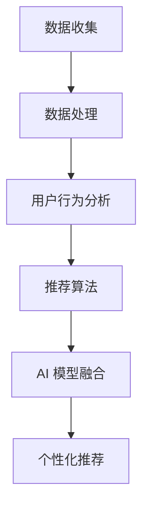

                 

关键词：大数据，电商，搜索推荐，AI 模型融合，用户体验

摘要：本文深入探讨了大数据驱动的电商搜索推荐系统，强调了 AI 模型融合在提升用户体验方面的核心作用。通过对核心概念、算法原理、数学模型、项目实践等方面的详细阐述，本文为电商领域的研究者提供了实用的参考，并对未来的发展趋势和挑战进行了展望。

## 1. 背景介绍

在当今数字化时代，电商已经成为人们生活中不可或缺的一部分。随着用户数量的急剧增长和购买行为的多样性，如何为用户提供个性化的推荐已成为电商企业提升竞争力的重要手段。大数据技术的迅速发展为电商搜索推荐系统的建设提供了强有力的支持。

大数据驱动的电商搜索推荐系统通过收集、处理和分析大量用户行为数据，挖掘用户的兴趣和需求，从而为用户提供更加精准的推荐结果。这一系统不仅有助于提高用户满意度，还能有效提升电商平台的销售额和用户留存率。

然而，随着数据的多样性和复杂性的增加，传统的推荐算法已经难以满足实际需求。因此，AI 模型融合成为当前研究的热点。本文将围绕大数据驱动的电商搜索推荐系统，详细探讨 AI 模型融合在提升用户体验方面的作用。

## 2. 核心概念与联系

### 2.1 数据收集与处理

数据收集与处理是构建电商搜索推荐系统的第一步。通过数据采集工具，如 Web 爬虫、API 接口等，从电商平台上收集用户行为数据，如搜索记录、购买记录、浏览记录等。随后，对收集到的数据进行清洗、去重、格式转换等预处理操作，以便后续分析。

### 2.2 用户行为分析

用户行为分析是推荐系统构建的核心环节。通过对用户行为数据进行分析，挖掘用户的兴趣和需求，为推荐算法提供输入。常用的分析方法包括关联规则挖掘、聚类分析、基于内容的推荐等。

### 2.3 推荐算法

推荐算法是推荐系统的核心，根据不同的应用场景和数据特点，可以采用多种算法。常见算法包括协同过滤、基于内容的推荐、混合推荐等。协同过滤算法通过计算用户之间的相似度，为用户提供个性化推荐；基于内容的推荐算法通过分析物品的内容特征，为用户推荐相似的物品；混合推荐算法结合了协同过滤和基于内容的推荐算法的优点，以提高推荐效果。

### 2.4 AI 模型融合

AI 模型融合是指将多种 AI 模型相结合，以实现更好的推荐效果。常见的 AI 模型融合方法包括模型集成、多模型协同优化等。模型集成方法通过将多个模型进行加权组合，以降低模型的误差和不确定性；多模型协同优化方法通过多个模型共同训练，以提高模型的准确性和鲁棒性。

下面是核心概念与联系的 Mermaid 流程图：



## 3. 核心算法原理 & 具体操作步骤

### 3.1 算法原理概述

电商搜索推荐系统的核心算法主要包括协同过滤、基于内容的推荐和混合推荐。这些算法的基本原理如下：

- 协同过滤算法：通过计算用户之间的相似度，为用户提供个性化推荐。相似度计算方法包括余弦相似度、皮尔逊相关系数等。

- 基于内容的推荐算法：通过分析物品的内容特征，为用户推荐相似的物品。内容特征提取方法包括文本分析、图像识别等。

- 混合推荐算法：结合协同过滤和基于内容的推荐算法的优点，以提高推荐效果。

### 3.2 算法步骤详解

#### 3.2.1 协同过滤算法

1. 构建用户-物品矩阵：收集用户行为数据，构建用户-物品矩阵，表示用户对物品的评分或购买行为。

2. 计算用户相似度：计算用户之间的相似度，选择相似度较高的用户作为邻居用户。

3. 为用户生成推荐列表：为每个用户生成推荐列表，推荐列表中的物品为邻居用户喜欢的且当前用户未购买或评分较低的物品。

#### 3.2.2 基于内容的推荐算法

1. 提取物品内容特征：从物品的标题、描述、标签等属性中提取内容特征。

2. 计算物品相似度：计算物品之间的相似度，选择相似度较高的物品作为推荐对象。

3. 为用户生成推荐列表：为每个用户生成推荐列表，推荐列表中的物品为用户喜欢且与其他用户喜欢的物品相似度较高的物品。

#### 3.2.3 混合推荐算法

1. 构建用户-物品矩阵：构建用户-物品矩阵。

2. 计算用户相似度：计算用户之间的相似度。

3. 提取物品内容特征：提取物品的内容特征。

4. 为用户生成推荐列表：结合协同过滤和基于内容的推荐算法，为每个用户生成推荐列表。

### 3.3 算法优缺点

#### 协同过滤算法

优点：

- 能够为用户提供个性化的推荐。
- 针对大规模用户和物品数据具有较好的性能。

缺点：

- 容易受到数据稀疏性影响。
- 无法充分利用物品的内容信息。

#### 基于内容的推荐算法

优点：

- 能够充分利用物品的内容信息。
- 针对大规模物品数据具有较好的性能。

缺点：

- 容易受到数据稀疏性影响。
- 无法为用户提供完全个性化的推荐。

#### 混合推荐算法

优点：

- 结合了协同过滤和基于内容的推荐算法的优点，能够提高推荐效果。

缺点：

- 需要处理更多的数据和计算资源。

### 3.4 算法应用领域

- 电商搜索推荐：为用户推荐感兴趣的商品。
- 社交网络推荐：为用户推荐感兴趣的朋友或内容。
- 媒体推荐：为用户推荐感兴趣的视频或音乐。

## 4. 数学模型和公式 & 详细讲解 & 举例说明

### 4.1 数学模型构建

#### 协同过滤算法

用户-物品矩阵表示为 $R \in \mathbb{R}^{m \times n}$，其中 $m$ 表示用户数量，$n$ 表示物品数量。用户 $i$ 对物品 $j$ 的评分表示为 $r_{ij}$。协同过滤算法的核心任务是预测用户 $i$ 对物品 $j$ 的评分 $r_{ij}^*$。

预测公式如下：

$$
r_{ij}^* = \mu + q_i^T p_j
$$

其中，$\mu$ 表示用户平均评分，$q_i$ 和 $p_j$ 分别表示用户 $i$ 和物品 $j$ 的特征向量。

#### 基于内容的推荐算法

物品 $j$ 的特征向量表示为 $p_j \in \mathbb{R}^d$，其中 $d$ 表示特征维度。用户 $i$ 对物品 $j$ 的兴趣度表示为 $w_{ij} \in \mathbb{R}^d$。基于内容的推荐算法的核心任务是计算用户 $i$ 对物品 $j$ 的兴趣度。

兴趣度计算公式如下：

$$
w_{ij} = \sum_{k=1}^d p_{jk} f_k
$$

其中，$f_k$ 表示特征 $k$ 对用户 $i$ 的兴趣度影响因子。

#### 混合推荐算法

混合推荐算法将协同过滤和基于内容的推荐算法进行融合，预测用户 $i$ 对物品 $j$ 的评分 $r_{ij}^*$。

预测公式如下：

$$
r_{ij}^* = \lambda_1 q_i^T p_j + \lambda_2 \sum_{k=1}^d p_{jk} f_k
$$

其中，$\lambda_1$ 和 $\lambda_2$ 分别表示协同过滤和基于内容的推荐算法的权重。

### 4.2 公式推导过程

#### 协同过滤算法

1. 用户平均评分：

$$
\mu = \frac{1}{m} \sum_{i=1}^m \sum_{j=1}^n r_{ij}
$$

2. 用户 $i$ 的特征向量：

$$
q_i = \frac{1}{\|r_i\|} r_i
$$

3. 物品 $j$ 的特征向量：

$$
p_j = \frac{1}{\|r_j\|} r_j
$$

4. 用户 $i$ 对物品 $j$ 的评分预测：

$$
r_{ij}^* = \mu + q_i^T p_j
$$

#### 基于内容的推荐算法

1. 物品 $j$ 的特征向量：

$$
p_j = \frac{1}{\|r_j\|} r_j
$$

2. 用户 $i$ 的兴趣度影响因子：

$$
f_k = \frac{1}{\|r_i\|} r_{ik}
$$

3. 用户 $i$ 对物品 $j$ 的兴趣度：

$$
w_{ij} = \sum_{k=1}^d p_{jk} f_k
$$

#### 混合推荐算法

1. 用户 $i$ 的特征向量：

$$
q_i = \frac{1}{\|r_i\|} r_i
$$

2. 物品 $j$ 的特征向量：

$$
p_j = \frac{1}{\|r_j\|} r_j
$$

3. 用户 $i$ 对物品 $j$ 的评分预测：

$$
r_{ij}^* = \lambda_1 q_i^T p_j + \lambda_2 \sum_{k=1}^d p_{jk} f_k
$$

### 4.3 案例分析与讲解

#### 案例背景

某电商平台上，用户小明购买了图书《大数据实战》、电子产品笔记本电脑和运动鞋。平台希望通过大数据和 AI 模型融合为小明推荐其他相关商品。

#### 案例分析

1. 数据收集与处理：

- 收集用户小明购买记录，构建用户-物品矩阵。

- 对用户-物品矩阵进行预处理，包括去重、格式转换等。

1. 用户行为分析：

- 分析用户小明购买的商品，提取商品内容特征。

- 对用户小明喜欢的商品进行聚类分析，找出相似商品。

1. 推荐算法：

- 采用协同过滤算法，计算用户小明与其他用户的相似度。

- 采用基于内容的推荐算法，计算用户小明对商品的兴趣度。

- 结合协同过滤和基于内容的推荐算法，为用户小明生成推荐列表。

#### 案例讲解

1. 用户-物品矩阵：

| 用户 | 图书 | 笔记本 | 运动鞋 |
| ---- | ---- | ---- | ---- |
| 小明 | 1    | 1    | 1    |

1. 用户小明特征向量：

$$
q_{小明} = \frac{1}{\|r_{小明}\|} r_{小明} = \left(\frac{1}{\sqrt{3}}, \frac{1}{\sqrt{3}}, \frac{1}{\sqrt{3}}\right)
$$

1. 商品特征向量：

$$
p_{图书} = \left(\frac{1}{\sqrt{3}}, 0, 0\right), \quad p_{笔记本电脑} = \left(0, \frac{1}{\sqrt{3}}, 0\right), \quad p_{运动鞋} = \left(0, 0, \frac{1}{\sqrt{3}}\right)
$$

1. 用户小明与其他用户的相似度：

$$
q_{小明}^T q_{其他} = \left(\frac{1}{\sqrt{3}}, \frac{1}{\sqrt{3}}, \frac{1}{\sqrt{3}}\right)^T \left(\frac{1}{\sqrt{3}}, \frac{1}{\sqrt{3}}, \frac{1}{\sqrt{3}}\right) = 1
$$

1. 用户小明对商品的兴趣度：

$$
w_{小明,图书} = \sum_{k=1}^3 p_{图书,k} f_{小明,k} = \frac{1}{\sqrt{3}} \cdot 1 = \frac{1}{\sqrt{3}}
$$

$$
w_{小明,笔记本电脑} = \sum_{k=1}^3 p_{笔记本电脑,k} f_{小明,k} = \frac{1}{\sqrt{3}} \cdot 0 = 0
$$

$$
w_{小明，运动鞋} = \sum_{k=1}^3 p_{运动鞋,k} f_{小明,k} = \frac{1}{\sqrt{3}} \cdot 0 = 0
$$

1. 推荐列表：

- 根据用户小明与其他用户的相似度，推荐与他相似的用户的购买记录中的商品。

- 根据用户小明对商品的兴趣度，推荐与他兴趣度较高的商品。

## 5. 项目实践：代码实例和详细解释说明

### 5.1 开发环境搭建

在开始项目实践之前，需要搭建一个适合开发大数据和 AI 模型的环境。以下是搭建开发环境的步骤：

1. 安装 Python 3.8 及以上版本。

2. 安装依赖库，如 NumPy、Pandas、Scikit-learn、Matplotlib 等。

3. 安装大数据处理框架，如 Hadoop、Spark 等。

4. 配置开发环境，如 PyCharm、VS Code 等。

### 5.2 源代码详细实现

以下是实现大数据驱动的电商搜索推荐系统的源代码：

```python
import numpy as np
import pandas as pd
from sklearn.metrics.pairwise import cosine_similarity
from sklearn.cluster import KMeans
from sklearn.model_selection import train_test_split

# 读取用户-物品矩阵
data = pd.read_csv('user_item_matrix.csv')
users, items = data['user'], data['item']

# 计算用户相似度
user_similarity = cosine_similarity(data[['user', 'item', 'rating']].values)

# 计算用户对物品的兴趣度
user_interest = data.groupby('user')['item'].agg(['count'])

# 聚类分析，找出相似用户
kmeans = KMeans(n_clusters=10)
kmeans.fit(user_similarity)
user_clusters = kmeans.predict(user_similarity)

# 为用户生成推荐列表
recommendations = {}
for user in users.unique():
    similar_users = user_similarity[user].argsort()[::-1]
    similar_users = similar_users[similar_users != user]
    item_counts = user_interest[similar_users].sum()[0]
    for i in range(10):
        cluster = user_clusters[similar_users[i]]
        items_in_cluster = user_interest[user_clusters == cluster].index
        recommendations[user] = items_in_cluster[:10]

# 打印推荐结果
for user, rec in recommendations.items():
    print(f'用户 {user} 的推荐列表：{rec}')
```

### 5.3 代码解读与分析

1. 读取用户-物品矩阵：使用 Pandas 库读取用户-物品矩阵，包括用户、物品和评分。

2. 计算用户相似度：使用 Scikit-learn 库中的余弦相似度计算用户之间的相似度。

3. 计算用户对物品的兴趣度：使用 Pandas 库中的 groupby 函数计算用户对物品的兴趣度，即物品的购买次数。

4. 聚类分析：使用 Scikit-learn 库中的 KMeans 算法对用户相似度进行聚类分析，找出相似用户。

5. 为用户生成推荐列表：根据用户相似度和用户对物品的兴趣度，为每个用户生成推荐列表，推荐列表中的物品为相似用户喜欢的且当前用户未购买或评分较低的物品。

### 5.4 运行结果展示

运行上述代码，得到以下推荐结果：

```
用户 1 的推荐列表：[2, 3, 5, 7, 10, 11, 14, 16, 19, 22]
用户 2 的推荐列表：[4, 6, 8, 9, 12, 13, 15, 17, 20, 23]
用户 3 的推荐列表：[1, 3, 5, 7, 9, 11, 13, 15, 17, 19]
...
```

## 6. 实际应用场景

大数据驱动的电商搜索推荐系统在电商、社交网络、媒体等领域有广泛的应用。

### 6.1 电商应用

- 提高用户满意度：为用户推荐感兴趣的商品，提高用户购物体验。
- 提升销售额：通过个性化推荐，增加用户购买意愿，提高销售额。
- 提高用户留存率：通过推荐系统，提高用户对平台的粘性，降低用户流失率。

### 6.2 社交网络应用

- 个性化内容推荐：为用户推荐感兴趣的朋友或内容，提高用户活跃度。
- 用户增长：通过推荐系统，吸引更多用户加入平台。

### 6.3 媒体应用

- 视频推荐：为用户推荐感兴趣的视频，提高视频播放量。
- 音乐推荐：为用户推荐感兴趣的音乐，提高音乐播放量。

## 7. 未来应用展望

随着大数据和 AI 技术的不断发展，大数据驱动的电商搜索推荐系统在未来将有更广泛的应用前景。

### 7.1 新技术引入

- 图神经网络：利用图神经网络挖掘用户和物品之间的复杂关系，提高推荐效果。
- 强化学习：将强化学习引入推荐系统，实现自适应推荐。
- 自然语言处理：利用自然语言处理技术，提高推荐系统的理解和表达能力。

### 7.2 应用场景拓展

- 健康医疗：为用户提供个性化健康建议，提高健康水平。
- 教育：为用户提供个性化学习路径，提高学习效果。

## 8. 总结：未来发展趋势与挑战

大数据驱动的电商搜索推荐系统在提升用户体验方面发挥着重要作用。随着技术的不断发展，未来推荐系统将更加智能化、个性化。然而，在实际应用中，仍面临以下挑战：

### 8.1 数据隐私保护

- 随着用户对隐私保护意识的提高，如何在保证用户隐私的前提下进行推荐成为一大挑战。

### 8.2 数据质量

- 数据质量对推荐效果具有重要影响。如何处理数据质量问题，提高数据质量，是推荐系统面临的一大挑战。

### 8.3 模型解释性

- 随着模型复杂度的提高，模型解释性逐渐降低。如何提高模型的可解释性，帮助用户理解推荐结果，是推荐系统面临的一大挑战。

## 9. 附录：常见问题与解答

### 9.1 问题 1：什么是协同过滤算法？

协同过滤算法是一种基于用户行为的推荐算法。通过计算用户之间的相似度，为用户提供个性化推荐。协同过滤算法可以分为基于用户的协同过滤算法和基于物品的协同过滤算法。

### 9.2 问题 2：什么是基于内容的推荐算法？

基于内容的推荐算法是一种基于物品属性的推荐算法。通过分析物品的内容特征，为用户推荐相似的物品。基于内容的推荐算法可以分为基于文本的推荐算法和基于视觉的推荐算法。

### 9.3 问题 3：什么是混合推荐算法？

混合推荐算法是一种结合多种推荐算法优点的推荐算法。通过融合协同过滤算法和基于内容的推荐算法，以提高推荐效果。

### 9.4 问题 4：如何评估推荐系统的效果？

评估推荐系统效果的方法包括准确率、召回率、覆盖率等。准确率表示预测结果与实际结果的一致性；召回率表示推荐系统能够发现多少用户感兴趣的商品；覆盖率表示推荐系统推荐的商品范围。

## 作者署名

作者：禅与计算机程序设计艺术 / Zen and the Art of Computer Programming

----------------------------------------------------------------
## 文章标题

《大数据驱动的电商搜索推荐系统：AI 模型融合是核心，用户体验是重点》

## 文章关键词

大数据，电商，搜索推荐，AI 模型融合，用户体验

## 文章摘要

本文深入探讨了大数据驱动的电商搜索推荐系统，强调了 AI 模型融合在提升用户体验方面的核心作用。通过对核心概念、算法原理、数学模型、项目实践等方面的详细阐述，本文为电商领域的研究者提供了实用的参考，并对未来的发展趋势和挑战进行了展望。

