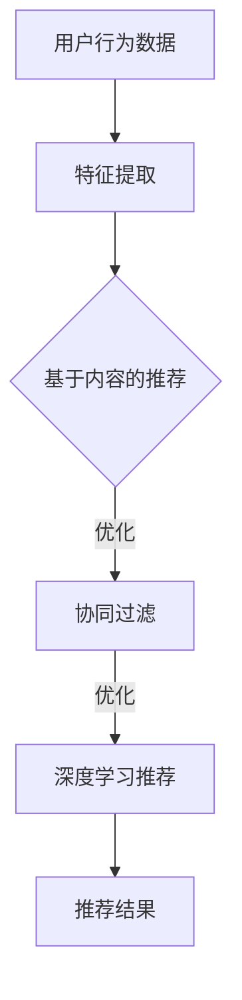

                 

关键词：大数据、电商搜索推荐、AI 模型、融合技术、应用与优化

> 摘要：本文旨在探讨大数据驱动的电商搜索推荐系统中，AI 模型融合技术的应用与优化。文章首先介绍了电商搜索推荐系统的背景和重要性，随后深入分析了AI模型融合技术的核心概念和原理，包括协同过滤、内容推荐和基于深度学习的推荐算法等。通过具体案例和实践，详细阐述了AI模型融合在电商搜索推荐中的实际应用，并对算法的优缺点、数学模型、代码实例和未来展望进行了全面解析。

## 1. 背景介绍

随着互联网的普及和电商行业的迅速发展，用户对个性化推荐的需求日益增长。电商搜索推荐系统作为提升用户体验和促进销售的重要工具，已经成为电商企业竞争的关键点。然而，传统的基于规则和统计学的推荐方法已经难以满足现代用户多样化的需求，如何利用先进的人工智能技术优化推荐系统成为亟待解决的问题。

大数据技术为推荐系统的发展提供了强大的支持。通过收集和分析海量用户行为数据、商品数据等，大数据技术能够挖掘出用户兴趣和行为模式，从而实现更加精准的个性化推荐。而AI模型融合技术，则是在大数据基础上，通过整合多种推荐算法，进一步提升推荐效果和用户体验。

本文将围绕大数据驱动的电商搜索推荐系统，探讨AI模型融合技术的应用与优化。具体包括以下内容：

- 电商搜索推荐系统的背景和重要性
- AI模型融合技术的核心概念和原理
- AI模型融合在电商搜索推荐中的实际应用
- 算法的优缺点分析
- 数学模型和公式的详细讲解
- 项目实践：代码实例和详细解释说明
- 实际应用场景分析
- 未来应用展望
- 工具和资源推荐
- 总结：未来发展趋势与挑战

## 2. 核心概念与联系

### 2.1. 推荐系统概述

推荐系统是一种信息过滤技术，通过预测用户对某些项目（如商品、电影、新闻等）的兴趣，向用户推荐他们可能感兴趣的内容。推荐系统主要分为以下几种类型：

- 基于内容的推荐（Content-based Recommendation）：根据用户的历史行为和兴趣，推荐具有相似特征的内容。
- 协同过滤推荐（Collaborative Filtering）：通过分析用户之间的行为相似性，推荐用户可能感兴趣的内容。
- 混合推荐（Hybrid Recommendation）：结合基于内容和协同过滤的推荐方法，以提高推荐效果。

### 2.2. AI模型融合技术

AI模型融合技术是一种将多种AI模型整合在一起，以实现更优推荐效果的方法。在电商搜索推荐系统中，常见的AI模型融合技术包括：

- 协同过滤与基于内容的融合：结合用户行为数据与商品特征，提高推荐准确度。
- 协同过滤与深度学习的融合：利用深度学习模型对用户行为数据进行特征提取，进一步优化推荐效果。
- 多模型融合：将协同过滤、基于内容和深度学习等不同模型进行组合，以实现多维度、全方位的推荐。

### 2.3. Mermaid 流程图

下面是一个简单的Mermaid流程图，展示电商搜索推荐系统中AI模型融合技术的基本架构：

在这个流程图中，用户行为数据首先经过特征提取，然后根据不同模型（基于内容、协同过滤和深度学习）进行推荐，最终输出推荐结果。通过融合多种模型，可以实现更加精准的个性化推荐。

## 3. 核心算法原理 & 具体操作步骤

### 3.1. 算法原理概述

在电商搜索推荐系统中，AI模型融合技术主要包括以下核心算法：

- 协同过滤推荐：通过分析用户行为数据，发现用户之间的相似性，实现个性化推荐。
- 基于内容的推荐：根据用户兴趣和商品特征，推荐具有相似特征的商品。
- 深度学习推荐：利用深度学习模型，对用户行为数据进行特征提取和预测，实现精准推荐。

### 3.2. 算法步骤详解

#### 3.2.1. 协同过滤推荐

协同过滤推荐可以分为基于用户的协同过滤（User-based Collaborative Filtering）和基于物品的协同过滤（Item-based Collaborative Filtering）两种类型。

1. 基于用户的协同过滤：
   - 根据用户历史行为数据，计算用户之间的相似性。
   - 对于目标用户，找到与其相似的用户群体，推荐这些用户喜欢且目标用户未购买的商品。

2. 基于物品的协同过滤：
   - 根据用户历史行为数据，计算商品之间的相似性。
   - 对于目标用户，推荐与用户已购买或感兴趣的物品相似的商品。

#### 3.2.2. 基于内容的推荐

基于内容的推荐主要通过分析用户兴趣和商品特征，推荐具有相似特征的商品。

1. 用户兴趣分析：
   - 通过用户历史行为数据，提取用户兴趣特征。
   - 建立用户兴趣模型，用于后续推荐。

2. 商品特征提取：
   - 对商品进行分类、标签化等处理，提取商品特征。
   - 建立商品特征库，用于推荐。

3. 推荐生成：
   - 根据用户兴趣模型和商品特征库，计算用户对商品的相似度。
   - 推荐用户兴趣度高的商品。

#### 3.2.3. 深度学习推荐

深度学习推荐主要通过构建深度学习模型，对用户行为数据进行特征提取和预测。

1. 用户行为数据预处理：
   - 对用户行为数据（如点击、购买、浏览等）进行清洗和转换。
   - 建立用户行为数据集，用于训练深度学习模型。

2. 深度学习模型构建：
   - 选择合适的深度学习模型（如卷积神经网络、循环神经网络等）。
   - 对用户行为数据进行特征提取和预测。

3. 模型训练与优化：
   - 使用用户行为数据集，对深度学习模型进行训练和优化。
   - 评估模型性能，调整模型参数。

4. 推荐生成：
   - 根据训练好的深度学习模型，预测用户对商品的感兴趣程度。
   - 推荐用户可能感兴趣的商品。

### 3.3. 算法优缺点

#### 协同过滤推荐

**优点**：

- 简单易懂，易于实现。
- 能够处理冷启动问题，对未知用户和物品进行推荐。

**缺点**：

- 推荐效果受限于用户历史行为数据的稀疏性。
- 容易陷入局部最优，推荐结果可能过于保守。

#### 基于内容的推荐

**优点**：

- 能够根据用户兴趣和商品特征进行个性化推荐。
- 能够应对冷启动问题，推荐效果相对稳定。

**缺点**：

- 推荐结果受限于商品特征的提取和匹配。
- 推荐结果可能过于单一，缺乏多样性。

#### 深度学习推荐

**优点**：

- 能够自动提取用户行为数据的特征。
- 具有较强的泛化能力和适应性。

**缺点**：

- 需要大量的训练数据和计算资源。
- 模型训练和优化过程较为复杂。

### 3.4. 算法应用领域

AI模型融合技术广泛应用于电商搜索推荐、新闻推荐、社交媒体推荐等多个领域。在电商搜索推荐中，AI模型融合技术能够提高推荐准确度和用户满意度，从而提升电商平台的销售额和用户留存率。

## 4. 数学模型和公式 & 详细讲解 & 举例说明

### 4.1. 数学模型构建

在电商搜索推荐系统中，常见的数学模型包括用户相似度计算、商品相似度计算和推荐分数计算等。

#### 4.1.1. 用户相似度计算

用户相似度计算是基于用户行为数据，分析用户之间的相似程度。常用的方法包括余弦相似度、皮尔逊相关系数等。

余弦相似度公式如下：

$$
sim(u_i, u_j) = \frac{u_i \cdot u_j}{\|u_i\| \cdot \|u_j\|}
$$

其中，$u_i$和$u_j$分别表示用户$i$和用户$j$的行为向量，$\cdot$表示向量的点积，$\|\|$表示向量的模。

#### 4.1.2. 商品相似度计算

商品相似度计算是基于商品特征数据，分析商品之间的相似程度。常用的方法包括余弦相似度、欧氏距离等。

余弦相似度公式如下：

$$
sim(i_k, i_l) = \frac{i_k \cdot i_l}{\|i_k\| \cdot \|i_l\|}
$$

其中，$i_k$和$i_l$分别表示商品$k$和商品$l$的特征向量，$\cdot$和$\|\|$的含义同上。

#### 4.1.3. 推荐分数计算

推荐分数计算是基于用户相似度和商品相似度，为用户推荐商品。常用的方法包括基于用户相似度的加权平均、基于商品相似度的加权和等。

基于用户相似度的加权平均公式如下：

$$
r_{ui} = \sum_{j \in N(u_i)} w_{ij} \cdot r_{uj}
$$

其中，$r_{ui}$表示用户$i$对商品$j$的推荐分数，$N(u_i)$表示与用户$i$相似的用户集合，$w_{ij}$表示用户$i$和用户$j$之间的相似度权重，$r_{uj}$表示用户$j$对商品$k$的评分。

### 4.2. 公式推导过程

在本节中，我们将详细推导用户相似度、商品相似度和推荐分数的计算公式。

#### 4.2.1. 用户相似度推导

假设用户$i$和用户$j$的行为数据可以表示为向量$u_i$和$u_j$，其中向量元素表示用户对商品的评分。根据余弦相似度的定义，用户相似度公式可以表示为：

$$
sim(u_i, u_j) = \frac{u_i \cdot u_j}{\|u_i\| \cdot \|u_j\|}
$$

其中，$u_i \cdot u_j$表示用户$i$和用户$j$行为数据的点积，$\|u_i\|$和$\|u_j\|$表示用户$i$和用户$j$行为数据的模。

#### 4.2.2. 商品相似度推导

假设商品$k$和商品$l$的特征数据可以表示为向量$i_k$和$i_l$，其中向量元素表示商品的特征值。根据余弦相似度的定义，商品相似度公式可以表示为：

$$
sim(i_k, i_l) = \frac{i_k \cdot i_l}{\|i_k\| \cdot \|i_l\|}
$$

其中，$i_k \cdot i_l$表示商品$k$和商品$l$的特征数据的点积，$\|i_k\|$和$\|i_l\|$表示商品$k$和商品$l$的特征数据的模。

#### 4.2.3. 推荐分数推导

假设用户$i$对商品$k$的推荐分数为$r_{ui}$，用户$j$对商品$k$的评分

