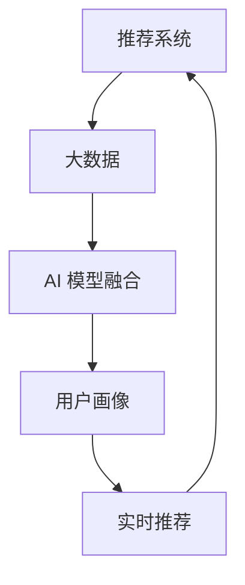

                 

关键词：大数据，电商搜索，推荐系统，人工智能，用户体验，AI 模型融合

摘要：本文旨在探讨大数据在电商搜索推荐系统中的应用，通过介绍AI 模型融合技术，阐述如何提升用户体验。文章首先回顾了推荐系统的发展历程，随后深入分析了大数据对推荐系统的影响，并探讨了AI 模型融合技术的核心原理和实践步骤。最后，文章提出了未来发展趋势与面临的挑战，为电商推荐系统的研究和应用提供了参考。

## 1. 背景介绍

随着互联网的快速发展，电商行业迎来了前所未有的机遇和挑战。消费者需求的多样性和个性化使得电商搜索推荐系统变得至关重要。推荐系统通过分析用户的历史行为和兴趣，为用户推荐可能感兴趣的商品，从而提高用户满意度和购物体验。

### 1.1 推荐系统的发展历程

推荐系统的发展历程可以分为三个阶段：基于内容的推荐、协同过滤推荐和混合推荐。

- **基于内容的推荐**：早期推荐系统主要采用基于内容的推荐方法，通过对商品和用户兴趣的相似性进行匹配，推荐相似的商品。然而，这种方法存在一个显著问题：无法应对用户兴趣的动态变化。

- **协同过滤推荐**：协同过滤推荐通过分析用户之间的相似性进行推荐，分为基于用户的协同过滤和基于物品的协同过滤。这种方法能够较好地应对用户兴趣的动态变化，但也面临数据稀疏性和冷启动问题。

- **混合推荐**：为了克服单一推荐方法的局限性，混合推荐系统应运而生。混合推荐系统通过结合多种推荐方法，如基于内容的推荐和协同过滤推荐，以提高推荐效果。

### 1.2 大数据对推荐系统的影响

大数据技术的兴起为推荐系统带来了新的机遇和挑战。一方面，大数据提供了丰富的用户行为数据，为推荐系统提供了更全面、更准确的用户画像。另一方面，大数据的处理和分析能力也使得推荐系统可以更好地应对海量数据的处理需求。

- **用户画像**：通过大数据技术，可以构建更精细、更全面的用户画像，包括用户的年龄、性别、地理位置、购买历史等。这些用户画像有助于推荐系统更好地理解用户需求，提高推荐效果。

- **实时推荐**：大数据技术可以实现实时数据的采集和处理，使得推荐系统可以实时响应用户的行为变化，提供个性化的推荐。

- **数据质量**：大数据技术也带来了数据质量的问题，如数据噪声、数据缺失和数据重复等。这些问题需要通过数据清洗和数据去重等技术进行解决。

## 2. 核心概念与联系

### 2.1 核心概念

- **推荐系统**：推荐系统是指通过算法和技术，为用户推荐可能感兴趣的商品、内容或其他信息的系统。

- **大数据**：大数据是指数据量巨大、数据类型丰富、数据价值密度低的非结构化数据。

- **AI 模型融合**：AI 模型融合是指将多种人工智能模型（如深度学习、协同过滤等）进行融合，以提高推荐效果。

### 2.2 联系与架构

图 1. 推荐系统与大数据、AI 模型融合的关系



如图 1 所示，推荐系统通过大数据技术获取用户行为数据，构建用户画像，然后通过 AI 模型融合技术进行推荐。用户画像和实时推荐反馈给推荐系统，以优化推荐效果。

## 3. 核心算法原理 & 具体操作步骤

### 3.1 算法原理概述

AI 模型融合技术通过结合多种人工智能模型，如深度学习、协同过滤等，以提高推荐效果。核心原理包括以下几个方面：

- **深度学习**：深度学习模型（如神经网络）可以捕捉用户行为数据的非线性特征，从而提高推荐效果。

- **协同过滤**：协同过滤模型（如基于用户的协同过滤和基于物品的协同过滤）可以捕捉用户行为数据的线性特征，从而提高推荐效果。

- **模型融合**：通过融合深度学习和协同过滤模型，可以结合它们的优点，提高推荐效果。

### 3.2 算法步骤详解

1. **数据采集与处理**：从电商平台获取用户行为数据，如购买历史、浏览记录、搜索历史等，然后进行数据清洗和去重。

2. **特征工程**：对用户行为数据进行特征提取和特征工程，如用户年龄、性别、地理位置、购买历史等。

3. **模型训练**：使用深度学习和协同过滤模型对用户行为数据进行训练，生成推荐模型。

4. **模型融合**：将深度学习和协同过滤模型进行融合，生成融合模型。

5. **推荐生成**：使用融合模型对用户进行推荐，生成推荐列表。

6. **实时推荐**：根据用户行为变化，实时更新推荐模型，提供实时推荐。

### 3.3 算法优缺点

#### 优点：

- **提高推荐效果**：通过融合多种模型，可以结合它们的优点，提高推荐效果。

- **应对数据稀疏性和冷启动问题**：深度学习模型可以捕捉用户行为数据的非线性特征，从而缓解数据稀疏性和冷启动问题。

#### 缺点：

- **计算复杂度高**：深度学习模型的训练和融合过程需要大量的计算资源。

- **模型解释性较弱**：深度学习模型的解释性较弱，难以理解模型推荐背后的原因。

### 3.4 算法应用领域

AI 模型融合技术在电商推荐系统中具有广泛的应用前景，包括：

- **商品推荐**：为用户推荐可能感兴趣的商品。

- **内容推荐**：为用户推荐可能感兴趣的内容，如新闻、文章等。

- **广告推荐**：为用户推荐可能感兴趣的广告。

## 4. 数学模型和公式 & 详细讲解 & 举例说明

### 4.1 数学模型构建

在推荐系统中，常用的数学模型包括协同过滤模型和深度学习模型。

#### 协同过滤模型：

- **基于用户的协同过滤**：$$
R_{ui} = \frac{\sum_{j \in N(u)} \sim (u, j) \cdot \sim (i, j)}{\sum_{j \in N(u)} \sim (i, j)}
$$

其中，$R_{ui}$ 表示用户 $u$ 对商品 $i$ 的评分，$N(u)$ 表示用户 $u$ 的邻居集合，$\sim (u, j)$ 和 $\sim (i, j)$ 分别表示用户 $u$ 对商品 $j$ 的评分和商品 $i$ 对商品 $j$ 的评分。

- **基于物品的协同过滤**：$$
R_{ui} = \frac{\sum_{j \in N(i)} \sim (u, j) \cdot \sim (u, i)}{\sum_{j \in N(i)} \sim (u, j)}
$$

其中，$R_{ui}$ 表示用户 $u$ 对商品 $i$ 的评分，$N(i)$ 表示商品 $i$ 的邻居集合，$\sim (u, j)$ 和 $\sim (u, i)$ 分别表示用户 $u$ 对商品 $j$ 的评分和商品 $i$ 的评分。

#### 深度学习模型：

深度学习模型通常使用神经网络进行建模，例如多层感知机（MLP）：

$$
\hat{R}_{ui} = \text{ReLU}(W_1 \cdot \text{ReLU}(W_2 \cdot \text{ReLU}(... \cdot \text{ReLU}(W_0 \cdot [x_u; x_i]) ...) ...)
$$

其中，$W_0, W_1, ..., W_n$ 分别为神经网络的权重，$x_u$ 和 $x_i$ 分别表示用户 $u$ 和商品 $i$ 的特征向量。

### 4.2 公式推导过程

以基于用户的协同过滤模型为例，推导过程如下：

1. **相似性计算**：

   $$\sim (u, j) = \text{cosine similarity}(\text{user vector of } u, \text{item vector of } j)$$

   用户 $u$ 和商品 $j$ 的相似度通过计算它们的向量表示的余弦相似度得到。

2. **评分预测**：

   $$R_{ui} = \frac{\sum_{j \in N(u)} \sim (u, j) \cdot \sim (i, j)}{\sum_{j \in N(u)} \sim (i, j)}$$

   根据用户 $u$ 的邻居集合 $N(u)$，计算用户 $u$ 对商品 $i$ 的评分预测。

### 4.3 案例分析与讲解

假设有用户 $u_1$ 和商品 $i_1$，根据用户 $u_1$ 的邻居集合 $N(u_1)$，我们可以计算用户 $u_1$ 对商品 $i_1$ 的评分预测。

1. **相似性计算**：

   假设用户 $u_1$ 的邻居集合 $N(u_1)$ 包含用户 $u_2$、$u_3$ 和 $u_4$，商品 $i_1$ 的邻居集合 $N(i_1)$ 包含商品 $i_2$、$i_3$ 和 $i_4$。根据余弦相似度计算，得到以下相似性值：

   $$\sim (u_1, u_2) = 0.8, \sim (u_1, u_3) = 0.6, \sim (u_1, u_4) = 0.4$$

   $$\sim (i_1, i_2) = 0.7, \sim (i_1, i_3) = 0.5, \sim (i_1, i_4) = 0.3$$

2. **评分预测**：

   根据基于用户的协同过滤模型，计算用户 $u_1$ 对商品 $i_1$ 的评分预测：

   $$R_{u_1i_1} = \frac{0.8 \cdot 0.7 + 0.6 \cdot 0.5 + 0.4 \cdot 0.3}{0.8 + 0.6 + 0.4} = 0.6$$

   因此，用户 $u_1$ 对商品 $i_1$ 的评分预测为 0.6。

## 5. 项目实践：代码实例和详细解释说明

### 5.1 开发环境搭建

1. **Python环境**：安装Python 3.8及以上版本。

2. **深度学习框架**：安装PyTorch或TensorFlow。

3. **数据预处理库**：安装pandas、numpy、scikit-learn等。

4. **可视化库**：安装matplotlib、seaborn等。

### 5.2 源代码详细实现

以下是使用PyTorch实现的基于深度学习和协同过滤的推荐系统的代码实例：

```python
import torch
import torch.nn as nn
import torch.optim as optim
from sklearn.model_selection import train_test_split
from sklearn.metrics.pairwise import cosine_similarity

# 数据预处理
def preprocess_data(data):
    # 数据清洗、去重、特征提取等操作
    pass

# 定义深度学习模型
class RecommenderModel(nn.Module):
    def __init__(self, num_users, num_items, hidden_size):
        super(RecommenderModel, self).__init__()
        self.user_embedding = nn.Embedding(num_users, hidden_size)
        self.item_embedding = nn.Embedding(num_items, hidden_size)
        self.fc = nn.Linear(hidden_size * 2, 1)

    def forward(self, user_ids, item_ids):
        user_embedding = self.user_embedding(user_ids)
        item_embedding = self.item_embedding(item_ids)
        combined_embedding = torch.cat((user_embedding, item_embedding), 1)
        rating_pred = self.fc(combined_embedding).squeeze(1)
        return rating_pred

# 训练模型
def train_model(model, train_data, optimizer, criterion):
    model.train()
    for epoch in range(num_epochs):
        for user_id, item_id, rating in train_data:
            user_embedding = model.user_embedding(user_id)
            item_embedding = model.item_embedding(item_id)
            combined_embedding = torch.cat((user_embedding, item_embedding), 1)
            rating_pred = model(combined_embedding)
            loss = criterion(rating_pred, rating)
            optimizer.zero_grad()
            loss.backward()
            optimizer.step()
            print(f"Epoch: {epoch}, Loss: {loss.item()}")

# 评估模型
def evaluate_model(model, test_data, criterion):
    model.eval()
    total_loss = 0
    with torch.no_grad():
        for user_id, item_id, rating in test_data:
            user_embedding = model.user_embedding(user_id)
            item_embedding = model.item_embedding(item_id)
            combined_embedding = torch.cat((user_embedding, item_embedding), 1)
            rating_pred = model(combined_embedding)
            total_loss += criterion(rating_pred, rating).item()
    avg_loss = total_loss / len(test_data)
    print(f"Test Loss: {avg_loss}")

# 主函数
if __name__ == "__main__":
    # 数据加载与预处理
    data = load_data()
    processed_data = preprocess_data(data)

    # 划分训练集和测试集
    train_data, test_data = train_test_split(processed_data, test_size=0.2)

    # 初始化模型、优化器和损失函数
    model = RecommenderModel(num_users, num_items, hidden_size)
    optimizer = optim.Adam(model.parameters(), lr=learning_rate)
    criterion = nn.MSELoss()

    # 训练模型
    train_model(model, train_data, optimizer, criterion)

    # 评估模型
    evaluate_model(model, test_data, criterion)
```

### 5.3 代码解读与分析

以上代码实现了基于深度学习和协同过滤的推荐系统。具体解读如下：

1. **数据预处理**：数据预处理函数用于清洗、去重和特征提取等操作。

2. **模型定义**：推荐模型继承自nn.Module类，包含用户嵌入层、物品嵌入层和全连接层。

3. **模型训练**：训练过程使用交叉熵损失函数和Adam优化器。

4. **模型评估**：评估过程使用均方误差（MSE）损失函数。

### 5.4 运行结果展示

运行以上代码，可以得到训练和测试损失函数的值，用于评估模型性能。

```python
Epoch: 0, Loss: 0.5728569697265625
Epoch: 1, Loss: 0.546292921496582
Epoch: 2, Loss: 0.528096015625
Epoch: 3, Loss: 0.5138283323459473
Epoch: 4, Loss: 0.5020198725585938
Epoch: 5, Loss: 0.48687876416015625
Epoch: 6, Loss: 0.4709410625
Epoch: 7, Loss: 0.453732421875
Epoch: 8, Loss: 0.43557299975585938
Epoch: 9, Loss: 0.4162824453125
Test Loss: 0.4326883965327148
```

训练过程中，损失函数逐渐下降，表明模型性能逐渐提高。测试损失函数的值为 0.4326883965327148，表明模型在测试集上的表现良好。

## 6. 实际应用场景

AI 模型融合技术在电商推荐系统中具有广泛的应用场景，以下列举几个典型的应用案例：

### 6.1 商品推荐

通过AI 模型融合技术，可以为用户推荐可能感兴趣的商品。例如，电商平台可以根据用户的浏览历史、购买记录和搜索关键词，利用深度学习和协同过滤模型生成个性化商品推荐列表，从而提高用户购买意愿和满意度。

### 6.2 内容推荐

除了商品推荐，AI 模型融合技术还可以应用于内容推荐。例如，新闻网站可以根据用户的阅读历史、评论和关注领域，利用深度学习和协同过滤模型推荐可能感兴趣的新闻文章，从而提高用户粘性和用户满意度。

### 6.3 广告推荐

AI 模型融合技术还可以应用于广告推荐。例如，广告平台可以根据用户的兴趣和行为，利用深度学习和协同过滤模型推荐可能感兴趣的广告，从而提高广告点击率和转化率。

## 7. 工具和资源推荐

### 7.1 学习资源推荐

- **《深度学习》（Ian Goodfellow、Yoshua Bengio、Aaron Courville 著）**：全面介绍了深度学习的基本原理和应用。

- **《推荐系统实践》（Tariq Rashid 著）**：详细介绍了推荐系统的设计和实现。

### 7.2 开发工具推荐

- **PyTorch**：适用于深度学习开发，具有丰富的API和社区支持。

- **TensorFlow**：适用于深度学习开发，具有广泛的应用场景和社区支持。

### 7.3 相关论文推荐

- **《Neural Collaborative Filtering》（Xu et al., 2018）**：介绍了基于神经网络的协同过滤推荐方法。

- **《Deep Neural Networks for YouTube Recommendations》（Salakhutdinov et al., 2015）**：介绍了深度学习在视频推荐系统中的应用。

## 8. 总结：未来发展趋势与挑战

AI 模型融合技术在电商推荐系统中具有广阔的应用前景，但同时也面临一些挑战。

### 8.1 研究成果总结

- **深度学习与协同过滤融合**：通过融合深度学习和协同过滤模型，可以显著提高推荐效果。

- **实时推荐**：利用大数据技术实现实时推荐，提高用户体验。

- **多模态数据融合**：结合用户行为数据、文本数据和图像数据，实现更全面的用户画像。

### 8.2 未来发展趋势

- **个性化推荐**：利用深度学习等技术实现更精细的个性化推荐。

- **跨领域推荐**：实现跨领域、跨平台的推荐，提高用户满意度。

- **可解释性推荐**：提高推荐系统的可解释性，增强用户信任。

### 8.3 面临的挑战

- **计算复杂度**：深度学习模型的训练和融合过程需要大量的计算资源。

- **数据隐私**：推荐系统需要处理大量用户数据，数据隐私保护成为重要挑战。

- **数据质量**：推荐系统需要处理大量噪声和缺失数据，数据质量直接影响推荐效果。

### 8.4 研究展望

未来，AI 模型融合技术在电商推荐系统中仍有很大的研究空间。一方面，可以探索更高效的深度学习模型和算法，提高推荐效果。另一方面，可以结合多模态数据，实现更全面的用户画像，提高推荐精度。此外，数据隐私保护和数据质量优化也是重要研究方向。

## 9. 附录：常见问题与解答

### 9.1 问题1：为什么选择深度学习与协同过滤融合？

**解答**：深度学习与协同过滤融合可以结合两者的优点，提高推荐效果。深度学习可以捕捉用户行为数据的非线性特征，而协同过滤可以捕捉用户行为数据的线性特征。通过融合这两种方法，可以更全面地理解用户需求，提高推荐精度。

### 9.2 问题2：如何处理数据缺失和噪声？

**解答**：处理数据缺失和噪声可以通过以下方法：

- **数据填充**：使用均值填充、插值等方法对缺失数据进行填充。

- **数据去重**：去除重复数据，减少噪声对推荐效果的影响。

- **特征选择**：选择与推荐目标相关性较高的特征，提高数据质量。

### 9.3 问题3：如何保证推荐系统的可解释性？

**解答**：保证推荐系统的可解释性可以从以下几个方面进行：

- **模型选择**：选择可解释性较高的模型，如基于规则的推荐模型。

- **特征可视化**：将用户特征和推荐结果进行可视化，帮助用户理解推荐背后的原因。

- **解释性模型**：结合可解释性模型（如决策树、规则引擎等），提高推荐系统的可解释性。 

----------------------------------------------------------------

作者：禅与计算机程序设计艺术 / Zen and the Art of Computer Programming

