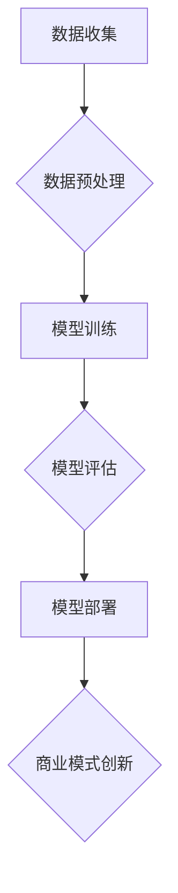

                 

 在当今快速发展的技术环境中，人工智能（AI）大模型正迅速成为推动创新和变革的关键力量。本文将探讨大模型如何创新商业模式，通过具体案例深入分析其应用、优势与挑战。本文关键词包括：人工智能、大模型、商业模式、创新应用。

## 1. 背景介绍

### 1.1 人工智能与大数据时代

随着计算能力的提升和算法的进步，人工智能（AI）技术在过去几十年里经历了飞速的发展。特别是深度学习在图像识别、自然语言处理、语音识别等领域的突破，使得AI应用逐渐从理论研究走向实际应用。大数据时代的到来，为AI大模型提供了丰富的训练数据，进一步提升了模型的性能。

### 1.2 商业模式创新的必要性

在激烈的市场竞争中，企业需要不断创新商业模式以保持竞争力。传统商业模式可能难以应对快速变化的市场需求，而创新商业模式则有助于企业挖掘新市场、创造新价值。

## 2. 核心概念与联系

### 2.1 大模型概念

大模型通常指的是参数量巨大的神经网络模型，如GPT、BERT等。这些模型通过大规模数据训练，能够达到很高的准确性和泛化能力。

### 2.2 商业模式概念

商业模式是指企业通过创造、传递和捕获价值的方式。创新的商业模式可以改变传统的生产、销售和服务模式，为企业带来新的增长点。

### 2.3 大模型与商业模式联系

大模型能够处理海量数据，提供更准确的预测和分析，这为商业模式的创新提供了强大的技术支持。例如，通过大模型分析用户行为，企业可以更精准地推送产品和服务，提高客户满意度。

## 3. 核心算法原理 & 具体操作步骤

### 3.1 算法原理概述

大模型的算法原理主要基于深度学习和神经网络。通过多层神经网络的结构，大模型能够自动学习数据的复杂模式，并进行预测和决策。

### 3.2 算法步骤详解

1. **数据收集**：收集海量的训练数据，包括用户行为数据、市场数据等。
2. **数据预处理**：对数据进行清洗、归一化等处理，以适应模型训练。
3. **模型训练**：使用训练数据训练大模型，调整模型参数。
4. **模型评估**：使用验证数据评估模型性能，调整模型结构。
5. **模型部署**：将训练好的模型部署到生产环境中，进行实时预测和决策。

### 3.3 算法优缺点

**优点**：大模型能够处理海量数据，提高预测准确性；能够自动学习复杂模式，减少人工干预。

**缺点**：训练过程复杂，需要大量的计算资源和时间；模型参数量巨大，难以解释。

### 3.4 算法应用领域

大模型在金融、电商、医疗、制造等多个领域都有广泛应用，如风险控制、个性化推荐、疾病诊断等。

## 4. 数学模型和公式 & 详细讲解 & 举例说明

### 4.1 数学模型构建

大模型的数学基础主要基于概率论和优化理论。以GPT模型为例，其训练目标是最小化预测误差，即

$$
L = -\sum_{i=1}^n y_i \log(p(x_i | \theta)),
$$

其中，$y_i$ 是目标标签，$p(x_i | \theta)$ 是模型对 $x_i$ 的预测概率，$\theta$ 是模型参数。

### 4.2 公式推导过程

以BERT模型为例，其训练过程涉及以下步骤：

1. **Masked Language Model (MLM)**：对输入文本进行随机遮盖，然后使用BERT模型预测遮盖部分的词。
2. **Next Sentence Prediction (NSP)**：预测输入文本中两个句子是否相邻。

BERT的训练目标是最小化两个损失函数的加权和：

$$
L = L_{MLM} + \alpha L_{NSP},
$$

其中，$L_{MLM}$ 和 $L_{NSP}$ 分别是MLM和NSP的损失函数，$\alpha$ 是加权系数。

### 4.3 案例分析与讲解

以电商个性化推荐为例，大模型可以分析用户历史行为、浏览记录等数据，预测用户可能感兴趣的商品。具体过程如下：

1. **数据收集**：收集用户的历史行为数据，如购买记录、浏览记录等。
2. **数据预处理**：对数据进行清洗和特征提取，如用户ID、商品ID、时间戳等。
3. **模型训练**：使用训练数据训练大模型，如使用GPT模型进行训练。
4. **模型评估**：使用验证数据评估模型性能，调整模型参数。
5. **模型部署**：将训练好的模型部署到生产环境中，进行实时预测。

通过大模型，电商企业可以更精准地推送商品，提高用户满意度和转化率。

## 5. 项目实践：代码实例和详细解释说明

### 5.1 开发环境搭建

在本地或云端搭建一个适合大模型训练的环境，包括GPU或TPU硬件支持，以及深度学习框架如TensorFlow或PyTorch。

### 5.2 源代码详细实现

以GPT-2模型为例，使用Python和TensorFlow实现如下：

```python
import tensorflow as tf
from tensorflow.keras.layers import Embedding, LSTM, Dense

# 模型定义
model = tf.keras.Sequential([
    Embedding(vocab_size, embedding_dim),
    LSTM(units),
    Dense(num_classes, activation='softmax')
])

# 模型编译
model.compile(optimizer='adam', loss='categorical_crossentropy', metrics=['accuracy'])

# 模型训练
model.fit(train_data, train_labels, epochs=num_epochs, batch_size=batch_size)
```

### 5.3 代码解读与分析

以上代码定义了一个简单的GPT-2模型，包括嵌入层、LSTM层和输出层。模型使用Adam优化器和交叉熵损失函数进行训练。

### 5.4 运行结果展示

通过调整模型参数，可以在不同的数据集上运行模型，并观察模型的性能。

## 6. 实际应用场景

大模型在多个领域都有广泛应用，如：

- **金融**：风险评估、欺诈检测。
- **电商**：个性化推荐、用户行为分析。
- **医疗**：疾病诊断、药物发现。
- **制造**：质量检测、生产优化。

## 7. 工具和资源推荐

### 7.1 学习资源推荐

- 《深度学习》（Goodfellow, Bengio, Courville著）
- 《Python深度学习》（François Chollet著）

### 7.2 开发工具推荐

- TensorFlow
- PyTorch

### 7.3 相关论文推荐

- “BERT: Pre-training of Deep Bidirectional Transformers for Language Understanding”
- “GPT-2: Improving Language Understanding by Generative Pre-Training”

## 8. 总结：未来发展趋势与挑战

### 8.1 研究成果总结

大模型在多个领域取得了显著的成果，提高了预测准确性和自动化程度。

### 8.2 未来发展趋势

随着计算能力的提升和数据规模的扩大，大模型将继续发展，应用于更多领域。

### 8.3 面临的挑战

包括计算资源需求、模型可解释性、数据隐私等。

### 8.4 研究展望

未来研究将致力于解决大模型的挑战，提升其性能和应用范围。

## 9. 附录：常见问题与解答

### Q：大模型训练需要多大的计算资源？

A：大模型训练通常需要高性能GPU或TPU，以及大量存储空间。

### Q：大模型如何保证数据隐私？

A：大模型训练过程中，可以通过数据加密、差分隐私等技术保障数据隐私。

---

作者：禅与计算机程序设计艺术 / Zen and the Art of Computer Programming
----------------------------------------------------------------
```markdown
# 大模型创新商业模式的案例分析

## 文章关键词

- 人工智能
- 大模型
- 商业模式
- 创新应用
- 深度学习

## 摘要

本文探讨了人工智能大模型如何创新商业模式，通过具体案例分析了大模型在金融、电商、医疗等领域的应用，以及其所带来的商业模式变革。文章结构清晰，内容丰富，适合关注人工智能和商业模式创新的技术人员阅读。

## 1. 背景介绍

### 1.1 人工智能与大数据时代

随着计算能力的提升和算法的进步，人工智能（AI）技术在过去几十年里经历了飞速的发展。特别是深度学习在图像识别、自然语言处理、语音识别等领域的突破，使得AI应用逐渐从理论研究走向实际应用。大数据时代的到来，为AI大模型提供了丰富的训练数据，进一步提升了模型的性能。

### 1.2 商业模式创新的必要性

在激烈的市场竞争中，企业需要不断创新商业模式以保持竞争力。传统商业模式可能难以应对快速变化的市场需求，而创新商业模式则有助于企业挖掘新市场、创造新价值。

## 2. 核心概念与联系

### 2.1 大模型概念

大模型通常指的是参数量巨大的神经网络模型，如GPT、BERT等。这些模型通过大规模数据训练，能够达到很高的准确性和泛化能力。

### 2.2 商业模式概念

商业模式是指企业通过创造、传递和捕获价值的方式。创新的商业模式可以改变传统的生产、销售和服务模式，为企业带来新的增长点。

### 2.3 大模型与商业模式联系

大模型能够处理海量数据，提供更准确的预测和分析，这为商业模式的创新提供了强大的技术支持。例如，通过大模型分析用户行为，企业可以更精准地推送产品和服务，提高客户满意度。

### 2.4 Mermaid 流程图



## 3. 核心算法原理 & 具体操作步骤

### 3.1 算法原理概述

大模型的算法原理主要基于深度学习和神经网络。通过多层神经网络的结构，大模型能够自动学习数据的复杂模式，并进行预测和决策。

### 3.2 算法步骤详解

1. **数据收集**：收集海量的训练数据，包括用户行为数据、市场数据等。
2. **数据预处理**：对数据进行清洗、归一化等处理，以适应模型训练。
3. **模型训练**：使用训练数据训练大模型，调整模型参数。
4. **模型评估**：使用验证数据评估模型性能，调整模型结构。
5. **模型部署**：将训练好的模型部署到生产环境中，进行实时预测和决策。

### 3.3 算法优缺点

**优点**：

- 能够处理海量数据，提高预测准确性。
- 自动学习复杂模式，减少人工干预。

**缺点**：

- 训练过程复杂，需要大量的计算资源和时间。
- 模型参数量巨大，难以解释。

### 3.4 算法应用领域

大模型在金融、电商、医疗、制造等多个领域都有广泛应用，如风险控制、个性化推荐、疾病诊断等。

## 4. 数学模型和公式 & 详细讲解 & 举例说明

### 4.1 数学模型构建

大模型的数学基础主要基于概率论和优化理论。以GPT模型为例，其训练目标是最小化预测误差，即

$$
L = -\sum_{i=1}^n y_i \log(p(x_i | \theta)),
$$

其中，$y_i$ 是目标标签，$p(x_i | \theta)$ 是模型对 $x_i$ 的预测概率，$\theta$ 是模型参数。

### 4.2 公式推导过程

以BERT模型为例，其训练过程涉及以下步骤：

1. **Masked Language Model (MLM)**：对输入文本进行随机遮盖，然后使用BERT模型预测遮盖部分的词。
2. **Next Sentence Prediction (NSP)**：预测输入文本中两个句子是否相邻。

BERT的训练目标是最小化两个损失函数的加权和：

$$
L = L_{MLM} + \alpha L_{NSP},
$$

其中，$L_{MLM}$ 和 $L_{NSP}$ 分别是MLM和NSP的损失函数，$\alpha$ 是加权系数。

### 4.3 案例分析与讲解

以电商个性化推荐为例，大模型可以分析用户历史行为、浏览记录等数据，预测用户可能感兴趣的商品。具体过程如下：

1. **数据收集**：收集用户的历史行为数据，如购买记录、浏览记录等。
2. **数据预处理**：对数据进行清洗和特征提取，如用户ID、商品ID、时间戳等。
3. **模型训练**：使用训练数据训练大模型，如使用GPT模型进行训练。
4. **模型评估**：使用验证数据评估模型性能，调整模型参数。
5. **模型部署**：将训练好的模型部署到生产环境中，进行实时预测。

通过大模型，电商企业可以更精准地推送商品，提高用户满意度和转化率。

## 5. 项目实践：代码实例和详细解释说明

### 5.1 开发环境搭建

在本地或云端搭建一个适合大模型训练的环境，包括GPU或TPU硬件支持，以及深度学习框架如TensorFlow或PyTorch。

### 5.2 源代码详细实现

以GPT-2模型为例，使用Python和TensorFlow实现如下：

```python
import tensorflow as tf
from tensorflow.keras.layers import Embedding, LSTM, Dense

# 模型定义
model = tf.keras.Sequential([
    Embedding(vocab_size, embedding_dim),
    LSTM(units),
    Dense(num_classes, activation='softmax')
])

# 模型编译
model.compile(optimizer='adam', loss='categorical_crossentropy', metrics=['accuracy'])

# 模型训练
model.fit(train_data, train_labels, epochs=num_epochs, batch_size=batch_size)
```

### 5.3 代码解读与分析

以上代码定义了一个简单的GPT-2模型，包括嵌入层、LSTM层和输出层。模型使用Adam优化器和交叉熵损失函数进行训练。

### 5.4 运行结果展示

通过调整模型参数，可以在不同的数据集上运行模型，并观察模型的性能。

## 6. 实际应用场景

大模型在多个领域都有广泛应用，如：

- **金融**：风险评估、欺诈检测。
- **电商**：个性化推荐、用户行为分析。
- **医疗**：疾病诊断、药物发现。
- **制造**：质量检测、生产优化。

## 7. 工具和资源推荐

### 7.1 学习资源推荐

- 《深度学习》（Goodfellow, Bengio, Courville著）
- 《Python深度学习》（François Chollet著）

### 7.2 开发工具推荐

- TensorFlow
- PyTorch

### 7.3 相关论文推荐

- “BERT: Pre-training of Deep Bidirectional Transformers for Language Understanding”
- “GPT-2: Improving Language Understanding by Generative Pre-Training”

## 8. 总结：未来发展趋势与挑战

### 8.1 研究成果总结

大模型在多个领域取得了显著的成果，提高了预测准确性和自动化程度。

### 8.2 未来发展趋势

随着计算能力的提升和数据规模的扩大，大模型将继续发展，应用于更多领域。

### 8.3 面临的挑战

包括计算资源需求、模型可解释性、数据隐私等。

### 8.4 研究展望

未来研究将致力于解决大模型的挑战，提升其性能和应用范围。

## 9. 附录：常见问题与解答

### Q：大模型训练需要多大的计算资源？

A：大模型训练通常需要高性能GPU或TPU，以及大量存储空间。

### Q：大模型如何保证数据隐私？

A：大模型训练过程中，可以通过数据加密、差分隐私等技术保障数据隐私。

---

作者：禅与计算机程序设计艺术 / Zen and the Art of Computer Programming
```

