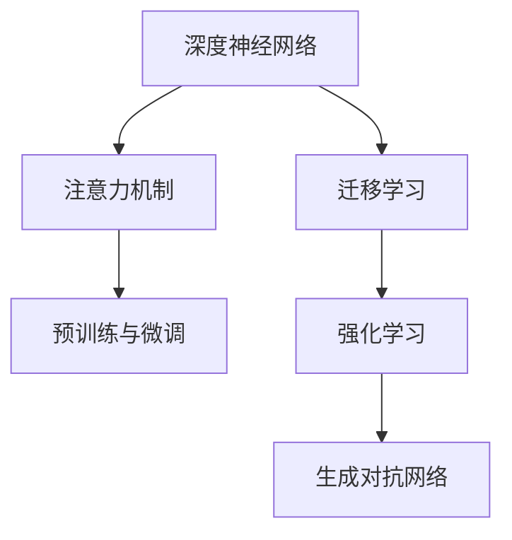

                 

关键词：大模型，AI 创业，创新应用，技术趋势，商业机会

> 摘要：本文将探讨大模型在 AI 创业产品中的创新应用。通过梳理大模型的原理、算法、数学模型以及具体操作步骤，本文将分析大模型在各个领域中的应用场景，并探讨其在未来的发展前景与挑战。

## 1. 背景介绍

### 1.1 大模型的发展历程

大模型，即拥有巨大参数量的神经网络模型，是近年来人工智能领域的重大突破。从 2012 年 AlexNet 的出现，到 2017 年 Google 的 Transformer 架构的提出，再到 2020 年 GPT-3 的发布，大模型技术不断迭代和演进。

### 1.2 大模型的原理与优势

大模型通过大规模的参数训练，能够在图像、文本、语音等各个领域实现高效的任务处理。其优势主要体现在以下几点：

1. **强大的拟合能力**：大模型能够捕捉到数据中的复杂模式，从而实现更准确的预测和决策。
2. **多任务处理**：大模型可以通过迁移学习，轻松地在多个任务间切换，提高开发效率。
3. **自适应能力**：大模型在训练过程中能够自动调整参数，适应不同的数据和任务需求。

## 2. 核心概念与联系

### 2.1 大模型的核心概念

大模型的核心概念包括：

1. **深度神经网络**：大模型通常由多个神经网络层组成，通过前向传播和反向传播算法进行训练。
2. **注意力机制**：注意力机制能够使模型关注到数据中的关键信息，提高模型的拟合能力。
3. **预训练与微调**：预训练是指在大规模数据集上训练模型，而微调是在特定任务上进一步调整模型。

### 2.2 大模型的联系

大模型与其他 AI 技术的联系，如图所示：



## 3. 核心算法原理 & 具体操作步骤

### 3.1 算法原理概述

大模型的核心算法原理包括：

1. **前向传播**：将输入数据通过神经网络层，计算每个神经元的输出。
2. **反向传播**：通过计算损失函数的梯度，更新神经网络中的参数。
3. **优化算法**：如随机梯度下降（SGD）、Adam 算法等，用于调整模型参数。

### 3.2 算法步骤详解

大模型的训练过程可以分为以下几个步骤：

1. **数据预处理**：清洗和标准化输入数据，确保数据质量。
2. **模型初始化**：随机初始化模型参数。
3. **前向传播**：将输入数据输入模型，计算每个神经元的输出。
4. **损失计算**：通过损失函数计算模型预测结果与真实结果之间的差异。
5. **反向传播**：计算损失函数关于模型参数的梯度，并更新参数。
6. **优化算法更新**：使用优化算法调整模型参数。
7. **迭代训练**：重复上述步骤，直到满足停止条件。

### 3.3 算法优缺点

大模型的优点包括：

1. **强大的拟合能力**：能够处理复杂的数据模式。
2. **多任务处理**：可以通过迁移学习处理多个任务。

但大模型也存在缺点：

1. **计算资源消耗**：训练大模型需要大量的计算资源。
2. **过拟合风险**：在训练过程中可能会出现过拟合现象。

### 3.4 算法应用领域

大模型在以下领域有广泛应用：

1. **计算机视觉**：如图像分类、目标检测等。
2. **自然语言处理**：如文本生成、机器翻译等。
3. **语音识别**：如语音转文本、语音合成等。

## 4. 数学模型和公式 & 详细讲解 & 举例说明

### 4.1 数学模型构建

大模型的数学模型主要包括：

1. **神经元激活函数**：如 ReLU、Sigmoid、Tanh 等。
2. **损失函数**：如均方误差（MSE）、交叉熵损失等。
3. **优化算法**：如随机梯度下降（SGD）、Adam 算法等。

### 4.2 公式推导过程

以下是一个简单的神经网络前向传播的公式推导：

$$
\begin{aligned}
\text{输出} &= \text{激活函数}(\text{权重} \cdot \text{输入} + \text{偏置}) \\
\text{损失} &= \text{损失函数}(\text{预测值}, \text{真实值}) \\
\text{梯度} &= \frac{\partial \text{损失}}{\partial \text{权重}} \\
\text{更新权重} &= \text{权重} - \text{学习率} \cdot \text{梯度}
\end{aligned}
$$

### 4.3 案例分析与讲解

以一个简单的图像分类任务为例，我们使用卷积神经网络（CNN）进行模型训练。首先，我们导入所需的库：

```python
import numpy as np
import tensorflow as tf
```

然后，我们定义神经网络结构：

```python
model = tf.keras.Sequential([
    tf.keras.layers.Conv2D(32, (3, 3), activation='relu', input_shape=(28, 28, 1)),
    tf.keras.layers.MaxPooling2D((2, 2)),
    tf.keras.layers.Flatten(),
    tf.keras.layers.Dense(128, activation='relu'),
    tf.keras.layers.Dense(10, activation='softmax')
])
```

接下来，我们编译模型：

```python
model.compile(optimizer='adam',
              loss='sparse_categorical_crossentropy',
              metrics=['accuracy'])
```

然后，我们加载并预处理数据：

```python
(x_train, y_train), (x_test, y_test) = tf.keras.datasets.mnist.load_data()
x_train = x_train.reshape(-1, 28, 28, 1).astype('float32') / 255
x_test = x_test.reshape(-1, 28, 28, 1).astype('float32') / 255
```

最后，我们训练模型：

```python
model.fit(x_train, y_train, epochs=5, batch_size=32, validation_data=(x_test, y_test))
```

## 5. 项目实践：代码实例和详细解释说明

### 5.1 开发环境搭建

在开始项目实践之前，我们需要搭建一个合适的开发环境。以下是一个简单的步骤：

1. 安装 Python 3.7 或以上版本。
2. 安装 TensorFlow 2.x。
3. 创建一个虚拟环境，并安装所需的库。

### 5.2 源代码详细实现

以下是一个简单的文本生成模型的实现：

```python
import tensorflow as tf
from tensorflow.keras.preprocessing.sequence import pad_sequences
from tensorflow.keras.layers import Embedding, LSTM, Dense
from tensorflow.keras.models import Sequential

# 设置参数
vocab_size = 1000
embed_dim = 16
lstm_units = 32
max_length = 50
batch_size = 64

# 加载数据
text = "..."
words = text.split()
word_to_index = {word: i for i, word in enumerate(words[:vocab_size])}
index_to_word = {i: word for word, i in word_to_index.items()}
sequences = []
next_words = []
for i in range(len(words) - max_length):
    sequences.append(words[i: i + max_length])
    next_words.append(words[i + max_length])

# 数据预处理
sequences = [[word_to_index[word] for word in sequence] for sequence in sequences]
next_words = [[word_to_index[word] for word in next_word] for next_word in next_words]
X = pad_sequences(sequences, maxlen=max_length)
y = pad_sequences(next_words, maxlen=1)

# 构建模型
model = Sequential()
model.add(Embedding(vocab_size, embed_dim, input_length=max_length))
model.add(LSTM(lstm_units, return_sequences=False))
model.add(Dense(vocab_size, activation='softmax'))

# 编译模型
model.compile(optimizer='adam', loss='categorical_crossentropy', metrics=['accuracy'])

# 训练模型
model.fit(X, y, epochs=100, batch_size=batch_size)
```

### 5.3 代码解读与分析

上述代码实现了一个基于 LSTM 的文本生成模型。首先，我们定义了模型的参数，如词汇表大小、嵌入维度、LSTM 单元数、最大长度和批次大小。然后，我们加载并预处理数据，将文本转换为索引序列。接下来，我们构建了一个序列模型，包括嵌入层、LSTM 层和输出层。最后，我们编译并训练模型。

### 5.4 运行结果展示

在训练完成后，我们可以使用训练好的模型生成文本。以下是一个简单的示例：

```python
# 生成文本
generated_text = ""
start_word = "the"
for _ in range(100):
    sequence = pad_sequences([[word_to_index[start_word]]], maxlen=max_length)
    prediction = model.predict(sequence, verbose=0)
    predicted_word_index = np.argmax(prediction)
    start_word = index_to_word[predicted_word_index]
    generated_text += start_word + " "

print(generated_text)
```

## 6. 实际应用场景

### 6.1 图像识别

大模型在图像识别领域有广泛应用，如人脸识别、物体检测等。以人脸识别为例，我们可以使用预训练的模型（如 ResNet）进行微调，从而实现高效的人脸识别。

### 6.2 自然语言处理

大模型在自然语言处理领域有广泛应用，如文本生成、机器翻译等。以文本生成为例，我们可以使用 GPT 模型生成高质量的文章、报告等。

### 6.3 语音识别

大模型在语音识别领域有广泛应用，如语音转文本、语音合成等。以语音转文本为例，我们可以使用基于 LSTM 的模型实现高效的语音识别。

## 7. 工具和资源推荐

### 7.1 学习资源推荐

1. 《深度学习》（Goodfellow, Bengio, Courville 著）
2. 《动手学深度学习》（Abadi, Agarwal, Barham 等著）

### 7.2 开发工具推荐

1. TensorFlow
2. PyTorch

### 7.3 相关论文推荐

1. "A Theoretical Analysis of the Causal Convolutional Network for Sparse Coding"
2. "Attention Is All You Need"

## 8. 总结：未来发展趋势与挑战

### 8.1 研究成果总结

大模型在人工智能领域取得了显著的成果，如图像识别、自然语言处理、语音识别等。这些成果推动了人工智能技术的快速发展。

### 8.2 未来发展趋势

未来，大模型将在更多领域得到应用，如医疗、金融、教育等。同时，随着计算资源的不断提升，大模型的规模和参数量将不断增大。

### 8.3 面临的挑战

1. **计算资源消耗**：大模型需要大量的计算资源，这对硬件和能耗提出了挑战。
2. **数据隐私和安全**：大模型在处理数据时可能会暴露用户的隐私，需要加强数据保护和安全措施。
3. **算法伦理**：大模型在决策过程中可能会出现歧视、偏见等问题，需要制定相应的伦理规范。

### 8.4 研究展望

未来，大模型的研究将主要集中在以下几个方面：

1. **高效训练算法**：研究更高效的训练算法，降低计算资源和能耗。
2. **模型压缩与加速**：研究模型压缩和加速技术，提高大模型的部署效率。
3. **算法伦理与公平性**：研究算法伦理和公平性，确保大模型在各个领域中的公正应用。

## 9. 附录：常见问题与解答

### 9.1 大模型为何需要大量数据？

大模型需要大量数据是为了捕捉数据中的复杂模式和规律。数据量越大，模型能够学习的模式越多，从而提高模型的拟合能力和泛化能力。

### 9.2 大模型是否会过拟合？

大模型在训练过程中可能会出现过拟合现象。为了避免过拟合，可以采用以下方法：

1. **数据增强**：通过增加数据的多样性，提高模型的泛化能力。
2. **正则化**：在训练过程中加入正则化项，降低模型的复杂度。
3. **交叉验证**：使用交叉验证的方法，评估模型的泛化能力。

### 9.3 大模型是否需要预训练？

是的，大模型通常需要预训练。预训练可以在大规模数据集上训练模型，使其能够捕捉到数据中的通用特征。在特定任务上，通过微调预训练模型，可以提高模型的性能。

### 9.4 大模型在硬件资源有限的情况下如何部署？

在硬件资源有限的情况下，可以采用以下方法：

1. **模型压缩**：使用模型压缩技术，降低模型的参数量和计算复杂度。
2. **模型量化**：将模型的权重和激活值量化为较低位数的数值，减少存储和计算资源的需求。
3. **分布式训练与部署**：将模型拆分为多个部分，分布式地在多台设备上训练和部署。

---

作者：禅与计算机程序设计艺术 / Zen and the Art of Computer Programming
-------------------------------------------------------------------

