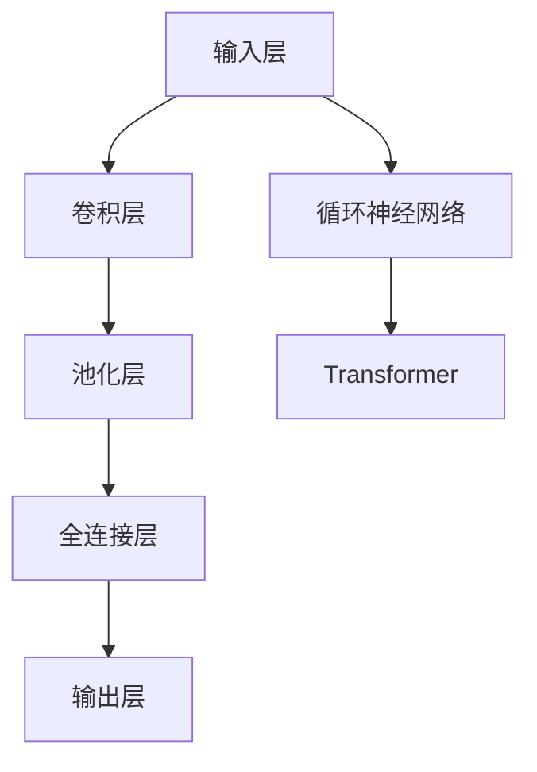

                 

关键词：大模型、AI 创业、产品路线图、规划、应用

> 摘要：本文探讨了大型神经网络模型（大模型）在 AI 创业产品路线图规划中的应用。通过对大模型的核心概念、算法原理、数学模型构建及其在不同领域中的应用进行分析，文章旨在为 AI 创业者提供实用指南，帮助他们更有效地规划产品路线图，并探讨未来发展的趋势与挑战。

## 1. 背景介绍

近年来，人工智能（AI）技术的迅猛发展，尤其是深度学习领域的突破，推动了 AI 应用的广泛应用。随着计算能力的提升和大数据的积累，大模型（Large Models）逐渐成为 AI 研究与开发的热点。大模型通常是指参数规模达到数十亿甚至数万亿的神经网络，它们在图像识别、自然语言处理、推荐系统等领域展现了强大的性能。

然而，大模型的开发与应用不仅需要巨大的计算资源，还需要高效的训练和推理算法，以及丰富的数据集。此外，AI 创业者在产品路线图规划中如何合理利用大模型，提升产品竞争力，也是一个值得探讨的问题。本文将围绕这些主题展开讨论，旨在为 AI 创业者提供有价值的参考。

## 2. 核心概念与联系

### 2.1 大模型定义与架构

大模型通常是指具有数十亿甚至数万亿参数的神经网络模型。这些模型通过多层神经网络结构来模拟人脑的思维方式，实现从简单输入到复杂输出的过程。典型的架构包括卷积神经网络（CNN）、循环神经网络（RNN）、Transformer 等。

Mermaid 流程图如下：



### 2.2 大模型的核心算法

#### 2.2.1 算法原理概述

大模型的核心算法主要包括深度学习的基础算法和优化技术，如反向传播算法、梯度下降法、Adam 优化器等。深度学习通过多层神经网络结构，将输入数据映射到输出，并通过反向传播算法不断调整网络权重，以优化模型性能。

#### 2.2.2 算法步骤详解

1. **初始化参数**：随机初始化神经网络参数。
2. **前向传播**：输入数据通过神经网络，计算输出。
3. **计算损失**：通过计算输出与真实值之间的差异，计算损失函数。
4. **反向传播**：利用梯度下降法调整网络参数，减少损失。
5. **更新参数**：重复前向传播和反向传播，直到满足收敛条件。

### 2.3 大模型优缺点与应用领域

#### 优点

- **强大的学习能力**：大模型可以通过学习大量数据，捕捉到复杂的数据特征，提高模型性能。
- **广泛的适用性**：大模型适用于各种领域，如图像识别、自然语言处理、推荐系统等。

#### 缺点

- **计算资源需求大**：大模型训练需要大量的计算资源和时间。
- **数据依赖性强**：大模型对数据质量有较高要求，数据不足或质量差会影响模型性能。

#### 应用领域

- **图像识别**：如人脸识别、物体检测等。
- **自然语言处理**：如文本分类、机器翻译、情感分析等。
- **推荐系统**：如电商推荐、音乐推荐等。

## 3. 核心算法原理 & 具体操作步骤

### 3.1 算法原理概述

大模型的核心算法基于深度学习的思想，通过多层神经网络结构对数据进行建模。深度学习模型的学习过程包括两个主要阶段：前向传播和反向传播。

### 3.2 算法步骤详解

#### 3.2.1 前向传播

1. **初始化参数**：随机初始化神经网络参数。
2. **输入数据**：将输入数据输入到网络中。
3. **逐层计算**：通过逐层计算，将输入数据映射到输出。
4. **输出结果**：计算网络输出结果。

#### 3.2.2 反向传播

1. **计算损失**：计算输出结果与真实值之间的差异，计算损失函数。
2. **计算梯度**：利用链式法则，计算各层参数的梯度。
3. **更新参数**：利用梯度下降法，更新网络参数，以减少损失。

#### 3.2.3 优化器选择

1. **梯度下降法**：最简单的优化器，通过固定步长更新参数。
2. **Adam 优化器**：结合了 AdaGrad 和 RMSprop 的优点，自适应调整学习率。
3. **SGD 优化器**：随机梯度下降，通过随机选取数据进行参数更新。

### 3.3 算法优缺点

#### 优点

- **强大的学习能力和适用性**：大模型可以学习复杂的数据特征，提高模型性能。
- **自适应调整**：优化器可以根据数据特点调整学习策略。

#### 缺点

- **计算资源需求大**：大模型训练需要大量的计算资源和时间。
- **数据依赖性强**：大模型对数据质量有较高要求。

### 3.4 算法应用领域

- **图像识别**：如人脸识别、物体检测等。
- **自然语言处理**：如文本分类、机器翻译、情感分析等。
- **推荐系统**：如电商推荐、音乐推荐等。

## 4. 数学模型和公式 & 详细讲解 & 举例说明

### 4.1 数学模型构建

大模型的数学模型主要基于深度学习的原理，包括输入层、隐藏层和输出层。输入层接收外部数据，隐藏层通过神经网络结构对数据进行处理，输出层生成最终结果。

### 4.2 公式推导过程

假设一个简单的神经网络模型，包括输入层、一个隐藏层和一个输出层。输入层有 m 个神经元，隐藏层有 n 个神经元，输出层有 p 个神经元。假设每个神经元之间的连接权重为 W，偏置为 b，激活函数为 f。

1. **前向传播**

   $$ a^{(2)} = f(W^{(1)} \cdot a^{(1)} + b^{(1)}) $$

   $$ a^{(3)} = f(W^{(2)} \cdot a^{(2)} + b^{(2)}) $$

   $$ y = f(W^{(3)} \cdot a^{(3)} + b^{(3)}) $$

2. **反向传播**

   $$ \delta^{(3)} = (y - \hat{y}) \cdot f'(W^{(3)} \cdot a^{(3)} + b^{(3)}) $$

   $$ \delta^{(2)} = (W^{(3)} \cdot \delta^{(3)}) \cdot f'(W^{(2)} \cdot a^{(2)} + b^{(2)}) $$

   $$ \delta^{(1)} = (W^{(2)} \cdot \delta^{(2)}) \cdot f'(W^{(1)} \cdot a^{(1)} + b^{(1)}) $$

3. **权重更新**

   $$ W^{(l)} \leftarrow W^{(l)} - \alpha \cdot \delta^{(l+1)} \cdot a^{(l)} $$

   $$ b^{(l)} \leftarrow b^{(l)} - \alpha \cdot \delta^{(l+1)} $$

### 4.3 案例分析与讲解

假设有一个简单的二分类问题，输入数据为 (x, y)，其中 x 是一个包含特征向量的向量，y 是二进制标签。我们需要使用神经网络模型进行预测。

1. **前向传播**

   $$ a^{(1)} = x $$

   $$ a^{(2)} = \sigma(W^{(1)} \cdot a^{(1)} + b^{(1)}) $$

   $$ y' = \sigma(W^{(2)} \cdot a^{(2)} + b^{(2)}) $$

2. **计算损失**

   $$ loss = -[y \cdot \log(y') + (1 - y) \cdot \log(1 - y')] $$

3. **反向传播**

   $$ \delta^{(2)} = (y' - y) \cdot \sigma'(W^{(2)} \cdot a^{(2)} + b^{(2)}) $$

   $$ \delta^{(1)} = (W^{(2)} \cdot \delta^{(2)}) \cdot \sigma'(W^{(1)} \cdot a^{(1)} + b^{(1)}) $$

4. **权重更新**

   $$ W^{(2)} \leftarrow W^{(2)} - \alpha \cdot \delta^{(2)} \cdot a^{(2)} $$

   $$ W^{(1)} \leftarrow W^{(1)} - \alpha \cdot \delta^{(1)} \cdot a^{(1)} $$

   $$ b^{(2)} \leftarrow b^{(2)} - \alpha \cdot \delta^{(2)} $$

   $$ b^{(1)} \leftarrow b^{(1)} - \alpha \cdot \delta^{(1)} $$

## 5. 项目实践：代码实例和详细解释说明

### 5.1 开发环境搭建

本文的代码实例使用 Python 编写，基于 TensorFlow 库实现。以下是搭建开发环境的基本步骤：

1. 安装 Python：确保 Python 版本为 3.7 或以上。
2. 安装 TensorFlow：使用 pip 命令安装 tensorflow 库。

   ```bash
   pip install tensorflow
   ```

3. 安装 Jupyter Notebook：用于编写和运行代码。

   ```bash
   pip install notebook
   ```

### 5.2 源代码详细实现

以下是一个简单的二分类问题的实现：

```python
import tensorflow as tf
import numpy as np

# 设置随机种子
tf.random.set_seed(42)

# 创建模拟数据集
x = np.random.rand(100, 10)
y = np.random.randint(0, 2, (100, 1))

# 定义神经网络结构
model = tf.keras.Sequential([
    tf.keras.layers.Dense(64, activation='relu', input_shape=(10,)),
    tf.keras.layers.Dense(64, activation='relu'),
    tf.keras.layers.Dense(1, activation='sigmoid')
])

# 编译模型
model.compile(optimizer='adam', loss='binary_crossentropy', metrics=['accuracy'])

# 训练模型
model.fit(x, y, epochs=10, batch_size=32)

# 预测
predictions = model.predict(x)
```

### 5.3 代码解读与分析

上述代码实现了一个简单的二分类神经网络。首先，我们导入 TensorFlow 和 NumPy 库。然后，我们创建一个模拟数据集，包含 100 个样本，每个样本有 10 个特征。接下来，我们定义神经网络结构，包括两个隐藏层，每个隐藏层有 64 个神经元，激活函数为 ReLU。输出层有 1 个神经元，激活函数为 sigmoid，用于生成二分类的概率。

在编译模型时，我们选择 Adam 优化器和 binary_crossentropy 损失函数。最后，我们使用 fit 函数训练模型，并使用 predict 函数进行预测。

## 6. 实际应用场景

大模型在 AI 创业产品路线图规划中的应用场景广泛，以下是一些典型的实际应用案例：

### 6.1 图像识别

图像识别是 AI 领域的重要应用之一。大模型，如卷积神经网络（CNN），在图像分类、物体检测、人脸识别等领域展现了强大的性能。例如，在人脸识别领域，大模型可以识别不同角度、光照条件甚至部分遮挡的人脸图像，提高了系统的鲁棒性和准确性。

### 6.2 自然语言处理

自然语言处理（NLP）是另一个大模型的重要应用领域。大模型，如 Transformer，在机器翻译、文本分类、情感分析等领域取得了显著的成果。例如，在机器翻译领域，大模型可以生成更加流畅、准确的翻译结果，减少了人工翻译的繁琐。

### 6.3 推荐系统

推荐系统是电商、社交媒体、音乐平台等应用中的重要组成部分。大模型，如基于矩阵分解的模型，可以通过学习用户的历史行为和偏好，为用户推荐个性化的商品、音乐或文章。

### 6.4 自动驾驶

自动驾驶是另一个大模型的重要应用领域。大模型，如基于深度学习的视觉感知系统，可以在复杂的环境中准确识别道路标志、行人、车辆等物体，提高了自动驾驶系统的安全性和可靠性。

## 7. 未来应用展望

随着大模型技术的不断进步，其应用领域将更加广泛。未来，大模型有望在以下领域取得重大突破：

### 7.1 医疗健康

大模型在医疗健康领域的应用前景广阔。例如，通过深度学习技术，可以对医学图像进行自动诊断，提高诊断准确性和效率。

### 7.2 金融领域

大模型在金融领域的应用，如信用评估、风险控制、投资决策等，具有很高的潜力。通过学习大量的金融数据，大模型可以预测市场趋势，为金融机构提供决策支持。

### 7.3 教育领域

大模型在教育领域的应用，如智能辅导、个性化教学等，将改变传统教育模式，提高教育质量和效率。

## 8. 总结：未来发展趋势与挑战

### 8.1 研究成果总结

大模型在 AI 创业产品路线图规划中的应用取得了显著成果，提高了产品的性能和竞争力。然而，大模型的开发与应用仍面临许多挑战。

### 8.2 未来发展趋势

未来，大模型技术将向更高效、更智能的方向发展。例如，模型压缩技术、推理优化技术等将有助于降低大模型的计算资源需求。

### 8.3 面临的挑战

- **计算资源需求**：大模型训练需要大量的计算资源和时间，这对企业和创业者来说是一个重大挑战。
- **数据质量**：大模型对数据质量有较高要求，数据不足或质量差会影响模型性能。
- **模型解释性**：大模型的内部结构复杂，难以解释，这对应用场景有较高的要求。

### 8.4 研究展望

未来，大模型研究应关注以下几个方面：

- **模型压缩与优化**：降低大模型的计算资源需求，提高模型推理效率。
- **模型可解释性**：提高大模型的解释性，使其在不同应用场景中更具可靠性。
- **跨领域迁移**：探索大模型在跨领域迁移中的潜力，提高其泛化能力。

## 9. 附录：常见问题与解答

### 9.1 什么是大模型？

大模型是指参数规模达到数十亿甚至数万亿的神经网络模型。它们通过多层神经网络结构模拟人脑的思维方式，实现从简单输入到复杂输出的过程。

### 9.2 大模型的优缺点是什么？

大模型的优点包括强大的学习能力和广泛的适用性。缺点包括计算资源需求大、数据依赖性强。

### 9.3 大模型在哪些领域有应用？

大模型在图像识别、自然语言处理、推荐系统、自动驾驶等领域有广泛应用。

### 9.4 如何优化大模型的训练？

优化大模型训练可以从以下几个方面入手：

- **数据增强**：通过数据增强技术提高模型对数据的适应性。
- **模型压缩**：通过模型压缩技术降低模型计算资源需求。
- **分布式训练**：通过分布式训练提高模型训练速度。

---

作者：禅与计算机程序设计艺术 / Zen and the Art of Computer Programming

本文介绍了大模型在 AI 创业产品路线图规划中的应用，包括核心概念、算法原理、数学模型、项目实践和实际应用场景。通过对大模型的研究和应用，AI 创业者可以更好地规划产品路线图，提高产品竞争力。同时，本文也展望了未来大模型技术的研究方向和挑战。希望本文能为 AI 创业者提供有价值的参考和启示。|

