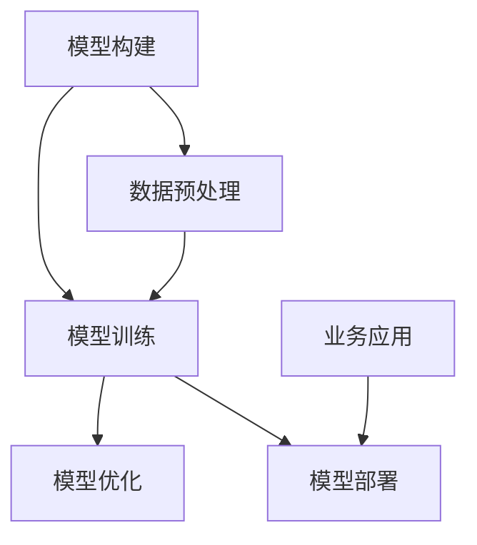

                 

关键词：大模型、AI 创业、产品路线图、应用趋势

> 摘要：本文将探讨大模型在 AI 创业产品路线图规划中的应用趋势。通过对大模型的背景介绍、核心概念与联系分析、算法原理详解、数学模型构建、项目实践、应用场景展望等多个方面的探讨，旨在为 AI 创业者提供实用的路线图规划指导，助力企业在人工智能领域的快速发展。

## 1. 背景介绍

随着人工智能技术的不断进步，大模型（Large Models）成为当前 AI 领域的研究热点。大模型具有参数规模巨大、结构复杂、数据处理能力强的特点，可以处理大规模数据集，实现高度复杂的任务。近年来，大模型在自然语言处理、计算机视觉、语音识别等多个领域取得了显著的成果。例如，GPT-3、BERT、GATV 等大模型在文本生成、图像分类、语音识别等方面达到了前所未有的水平。

在 AI 创业领域，大模型的应用趋势愈发明显。创业者可以利用大模型强大的数据处理能力，快速实现产品原型，降低研发成本，提高产品竞争力。同时，大模型在数据分析、模式识别、智能决策等方面具有广泛的应用潜力，有助于企业实现业务创新和商业模式变革。

## 2. 核心概念与联系

大模型在 AI 创业产品路线图规划中的应用涉及多个核心概念，包括模型构建、训练、优化、部署等。下面我们将使用 Mermaid 流程图（Mermaid is a lightweight diagram and flowchart scripting language based on Markdown）展示这些概念之间的联系。



### 2.1 模型构建

模型构建是 AI 创业产品路线图规划的第一步。创业者需要根据业务需求，选择合适的大模型架构，如 Transformer、CNN、RNN 等。同时，还需要考虑模型参数规模、计算资源等因素。

### 2.2 数据预处理

数据预处理是模型训练的基础。创业者需要对数据进行清洗、去重、归一化等操作，确保数据质量。此外，还需要对数据进行适当的扩充，以提高模型泛化能力。

### 2.3 模型训练

模型训练是利用大量数据进行迭代优化，使模型逐渐拟合训练数据的过程。创业者需要选择合适的训练策略，如梯度下降、Adam 等，以及超参数设置，如学习率、批次大小等。

### 2.4 模型优化

模型优化包括超参数调优、模型压缩、加速训练等。创业者可以通过调优超参数，提高模型性能。同时，还可以采用模型压缩技术，降低模型计算复杂度，提高模型部署效率。

### 2.5 模型部署

模型部署是将训练好的模型应用到实际业务场景的过程。创业者需要将模型集成到产品中，实现实时预测、决策等功能。

### 2.6 业务应用

业务应用是模型部署后的实际应用场景。创业者需要根据业务需求，对模型进行定制化开发，实现业务目标。

## 3. 核心算法原理 & 具体操作步骤

### 3.1 算法原理概述

大模型的算法原理主要涉及深度学习、神经网络、优化算法等领域。下面我们将分别介绍这些核心算法的原理。

#### 3.1.1 深度学习

深度学习是一种基于多层神经网络的机器学习技术。它通过模拟人脑的神经元结构，实现对数据的自动特征提取和表示。深度学习在图像识别、语音识别、自然语言处理等领域取得了显著的成果。

#### 3.1.2 神经网络

神经网络是一种由大量神经元组成的计算模型。每个神经元接收输入信号，通过权重和偏置进行加权求和，最后通过激活函数产生输出。神经网络通过不断调整权重和偏置，实现对输入数据的分类、回归等任务。

#### 3.1.3 优化算法

优化算法是一种用于求解最优化问题的数学方法。在深度学习中，优化算法用于调整模型参数，以使模型在训练过程中达到更好的性能。常见的优化算法有梯度下降、Adam、RMSprop 等。

### 3.2 算法步骤详解

下面我们以一个简单的大模型训练过程为例，介绍大模型的核心算法步骤。

#### 3.2.1 数据集准备

1. 收集并整理训练数据，包括图像、文本、音频等。
2. 对数据进行预处理，如图像缩放、文本分词、音频归一化等。

#### 3.2.2 模型定义

1. 根据业务需求，选择合适的大模型架构，如 CNN、RNN、Transformer 等。
2. 定义模型参数，包括权重、偏置、学习率等。

#### 3.2.3 模型训练

1. 将训练数据划分为训练集和验证集。
2. 使用训练集对模型进行迭代训练，调整模型参数。
3. 使用验证集对模型进行性能评估，调整超参数。

#### 3.2.4 模型优化

1. 调整模型结构，如增加层、增加神经元等。
2. 调整优化算法，如使用更高效的梯度下降算法。
3. 采用模型压缩技术，如剪枝、量化等，降低模型计算复杂度。

#### 3.2.5 模型部署

1. 将训练好的模型集成到产品中，实现实时预测、决策等功能。
2. 对模型进行持续优化，提高模型性能。

### 3.3 算法优缺点

#### 3.3.1 优点

1. 强大的数据处理能力，能够处理大规模数据集。
2. 高度的自动化，降低了模型训练和优化的复杂度。
3. 广泛的应用领域，可以应用于图像识别、自然语言处理、语音识别等任务。

#### 3.3.2 缺点

1. 计算资源需求高，需要大量的计算资源和存储空间。
2. 模型解释性差，难以理解模型决策过程。
3. 数据隐私和安全问题，需要确保模型训练和部署过程中的数据安全。

### 3.4 算法应用领域

大模型在 AI 创业产品路线图规划中的应用非常广泛，主要包括以下领域：

1. **自然语言处理**：包括文本分类、文本生成、机器翻译等。
2. **计算机视觉**：包括图像分类、目标检测、人脸识别等。
3. **语音识别**：包括语音识别、语音合成、语音翻译等。
4. **推荐系统**：包括商品推荐、内容推荐等。

## 4. 数学模型和公式 & 详细讲解 & 举例说明

### 4.1 数学模型构建

大模型的数学模型主要基于深度学习和神经网络。下面我们介绍深度学习中的基本数学模型。

#### 4.1.1 神经元模型

神经元模型是神经网络的基本单元，其数学表达式为：

$$
a_i = f(w_i \cdot x_i + b_i)
$$

其中，$a_i$ 表示神经元 $i$ 的激活值，$w_i$ 表示神经元 $i$ 的权重，$x_i$ 表示神经元 $i$ 的输入值，$b_i$ 表示神经元 $i$ 的偏置，$f$ 表示激活函数。

常见的激活函数有：

1. **Sigmoid 函数**：

$$
f(x) = \frac{1}{1 + e^{-x}}
$$

2. **ReLU 函数**：

$$
f(x) = \max(0, x)
$$

3. **Tanh 函数**：

$$
f(x) = \frac{e^x - e^{-x}}{e^x + e^{-x}}
$$

#### 4.1.2 损失函数

损失函数用于衡量模型预测值与真实值之间的差异。常见的损失函数有：

1. **均方误差损失函数**：

$$
L = \frac{1}{2} \sum_{i=1}^{n} (y_i - \hat{y}_i)^2
$$

其中，$y_i$ 表示真实值，$\hat{y}_i$ 表示预测值。

2. **交叉熵损失函数**：

$$
L = -\sum_{i=1}^{n} y_i \log \hat{y}_i
$$

其中，$y_i$ 表示真实值，$\hat{y}_i$ 表示预测值。

#### 4.1.3 优化算法

优化算法用于调整模型参数，以降低损失函数。常见的优化算法有：

1. **梯度下降算法**：

$$
w_i = w_i - \alpha \cdot \frac{\partial L}{\partial w_i}
$$

其中，$w_i$ 表示权重，$\alpha$ 表示学习率。

2. **Adam 算法**：

$$
m_t = \beta_1 m_{t-1} + (1 - \beta_1) \frac{\partial L}{\partial w_t} \\
v_t = \beta_2 v_{t-1} + (1 - \beta_2) \frac{\partial L}{\partial w_t} \\
w_t = w_{t-1} - \alpha \cdot \frac{m_t}{\sqrt{v_t} + \epsilon}
$$

其中，$m_t$ 和 $v_t$ 分别表示一阶矩估计和二阶矩估计，$\beta_1$ 和 $\beta_2$ 分别表示一阶矩和二阶矩的指数衰减率，$\alpha$ 表示学习率，$\epsilon$ 表示小常数。

### 4.2 公式推导过程

下面我们以一个简单的线性回归模型为例，介绍损失函数和优化算法的推导过程。

#### 4.2.1 线性回归模型

假设我们有一个线性回归模型，输入 $x$ 和输出 $y$ 之间的关系为：

$$
y = wx + b
$$

其中，$w$ 表示权重，$b$ 表示偏置。

#### 4.2.2 均方误差损失函数

均方误差损失函数为：

$$
L = \frac{1}{2} \sum_{i=1}^{n} (y_i - wx_i - b)^2
$$

其中，$y_i$ 表示真实值，$x_i$ 表示输入值。

#### 4.2.3 梯度下降算法

对损失函数进行求导，得到：

$$
\frac{\partial L}{\partial w} = \sum_{i=1}^{n} (y_i - wx_i - b) \cdot (-x_i) \\
\frac{\partial L}{\partial b} = \sum_{i=1}^{n} (y_i - wx_i - b) \cdot (-1)
$$

更新权重和偏置：

$$
w = w - \alpha \cdot \frac{\partial L}{\partial w} \\
b = b - \alpha \cdot \frac{\partial L}{\partial b}
$$

其中，$\alpha$ 表示学习率。

#### 4.2.4 Adam 算法

Adam 算法是一种自适应的优化算法，其公式推导过程较为复杂，这里不再展开。

### 4.3 案例分析与讲解

下面我们通过一个简单的案例，讲解大模型在自然语言处理中的应用。

#### 4.3.1 案例背景

假设我们有一个文本分类任务，需要将一组文本分类为两类：正面和负面。数据集包含 1000 篇文本，每篇文本都有对应的标签。

#### 4.3.2 数据预处理

1. 对文本进行分词，将文本转换为词序列。
2. 对词序列进行编码，将词转换为索引。
3. 对索引序列进行嵌入，将索引转换为向量。

#### 4.3.3 模型构建

1. 选择一个预训练的大模型，如 BERT。
2. 定义分类层，将嵌入向量映射为分类标签。

#### 4.3.4 模型训练

1. 使用训练数据对模型进行训练。
2. 调整超参数，如学习率、批次大小等。
3. 模型在验证集上的性能达到最优。

#### 4.3.5 模型部署

1. 将训练好的模型集成到产品中。
2. 实现实时文本分类功能。

## 5. 项目实践：代码实例和详细解释说明

### 5.1 开发环境搭建

1. 安装 Python（3.8 以上版本）。
2. 安装 PyTorch（1.8 以上版本）。
3. 安装 Hugging Face Transformers（4.5 以上版本）。

### 5.2 源代码详细实现

```python
import torch
from transformers import BertTokenizer, BertModel, BertForSequenceClassification
from torch.optim import Adam
from torch.utils.data import DataLoader
from torch.utils.data.sampler import SequentialSampler
from torch.nn import CrossEntropyLoss

# 数据预处理
tokenizer = BertTokenizer.from_pretrained('bert-base-uncased')
train_encodings = tokenizer(train_texts, truncation=True, padding=True)
val_encodings = tokenizer(val_texts, truncation=True, padding=True)

# 模型构建
model = BertForSequenceClassification.from_pretrained('bert-base-uncased', num_labels=2)
optimizer = Adam(model.parameters(), lr=5e-5)

# 模型训练
train_dataloader = DataLoader(train_encodings, sampler=SequentialSampler(train_encodings), batch_size=16)
val_dataloader = DataLoader(val_encodings, sampler=SequentialSampler(val_encodings), batch_size=16)

device = torch.device("cuda" if torch.cuda.is_available() else "cpu")
model.to(device)

for epoch in range(num_epochs):
    model.train()
    for batch in train_dataloader:
        batch = {k: v.to(device) for k, v in batch.items()}
        outputs = model(**batch)
        loss = outputs.loss
        loss.backward()
        optimizer.step()
        optimizer.zero_grad()

    model.eval()
    with torch.no_grad():
        for batch in val_dataloader:
            batch = {k: v.to(device) for k, v in batch.items()}
            outputs = model(**batch)
            logits = outputs.logits
            pred_ids = logits.argmax(-1)
            correct = pred_ids.eq(batch['labels'])
            acc = correct.sum().item() / len(correct)

    print(f"Epoch: {epoch+1}, Accuracy: {acc:.4f}")

# 模型部署
model.eval()
with torch.no_grad():
    for batch in test_dataloader:
        batch = {k: v.to(device) for k, v in batch.items()}
        outputs = model(**batch)
        logits = outputs.logits
        pred_ids = logits.argmax(-1)
        pred_labels = pred_ids.to('cpu').numpy()
```

### 5.3 代码解读与分析

1. 数据预处理：使用 Hugging Face Transformers 库对文本进行编码，将文本转换为序列。
2. 模型构建：选择 BERT 模型，并添加分类层。
3. 模型训练：使用 PyTorch 框架训练模型，采用 Adam 优化算法。
4. 模型部署：将训练好的模型部署到实际业务场景。

## 6. 实际应用场景

大模型在 AI 创业产品路线图规划中具有广泛的应用场景，下面我们列举几个典型案例。

### 6.1 自然语言处理

- **文本分类**：例如，将社交媒体评论分类为正面或负面。
- **文本生成**：例如，生成新闻报道、营销文案等。

### 6.2 计算机视觉

- **图像分类**：例如，将图像分类为动物、植物等。
- **目标检测**：例如，检测图像中的车辆、行人等。

### 6.3 语音识别

- **语音识别**：例如，将语音转换为文本。
- **语音合成**：例如，生成自然流畅的语音。

### 6.4 推荐系统

- **商品推荐**：例如，基于用户历史行为推荐商品。
- **内容推荐**：例如，基于用户兴趣推荐新闻、视频等。

## 7. 工具和资源推荐

### 7.1 学习资源推荐

- **在线课程**：例如，Coursera、edX 等平台上的深度学习和自然语言处理课程。
- **书籍**：例如，深度学习（Goodfellow et al.）、自然语言处理（Jurafsky & Martin）等。

### 7.2 开发工具推荐

- **框架**：例如，TensorFlow、PyTorch、Keras 等。
- **库**：例如，Hugging Face Transformers、NLTK、OpenCV 等。

### 7.3 相关论文推荐

- **自然语言处理**：例如，BERT、GPT-3、RoBERTa 等。
- **计算机视觉**：例如，ResNet、Inception、YOLO 等。

## 8. 总结：未来发展趋势与挑战

### 8.1 研究成果总结

大模型在 AI 创业产品路线图规划中取得了显著的成果，为创业者提供了强大的工具和资源。通过深度学习和神经网络等技术，大模型在多个领域取得了突破性进展，为创业企业提供了广阔的应用前景。

### 8.2 未来发展趋势

1. **模型压缩与优化**：为了降低计算资源和存储空间的消耗，未来的研究将重点关注模型压缩和优化技术。
2. **多模态学习**：随着人工智能技术的不断发展，多模态学习将成为热点，如将图像、文本、语音等多种数据源进行融合。
3. **模型解释性**：提高大模型的可解释性，使其在关键应用场景中得到更广泛的应用。

### 8.3 面临的挑战

1. **计算资源需求**：大模型对计算资源的需求巨大，如何高效地利用计算资源是一个重要挑战。
2. **数据隐私和安全**：在大规模数据处理过程中，如何确保数据隐私和安全是一个亟待解决的问题。
3. **模型泛化能力**：如何提高大模型的泛化能力，使其在不同领域和任务中具有更好的表现。

### 8.4 研究展望

未来，大模型在 AI 创业产品路线图规划中的应用将更加广泛和深入。通过不断创新和优化，大模型将为企业带来更大的价值，推动人工智能技术的发展和应用。

## 9. 附录：常见问题与解答

### 9.1 大模型与深度学习的区别是什么？

大模型和深度学习是密切相关的概念。深度学习是一种基于多层神经网络的机器学习技术，而大模型则是指具有巨大参数规模和结构复杂的模型。可以说，大模型是深度学习的一种特殊形式，具有更强的数据处理能力和模型性能。

### 9.2 如何选择合适的大模型？

选择合适的大模型需要考虑多个因素，如业务需求、数据规模、计算资源等。通常，可以从以下几个方面进行选择：

1. **任务类型**：根据具体任务选择合适的大模型，如文本生成、图像分类、语音识别等。
2. **数据规模**：选择与数据规模相匹配的大模型，避免过拟合。
3. **计算资源**：考虑计算资源限制，选择计算效率较高的大模型。
4. **开源资源**：参考开源社区中的大模型应用案例，选择成熟且具有广泛应用的大模型。

### 9.3 大模型的训练与优化有哪些常见方法？

大模型的训练与优化方法包括：

1. **超参数调优**：调整学习率、批次大小、迭代次数等超参数，提高模型性能。
2. **数据增强**：对训练数据进行扩充，提高模型泛化能力。
3. **模型压缩**：采用剪枝、量化等技术，降低模型计算复杂度和存储空间消耗。
4. **迁移学习**：利用预训练的大模型进行微调，快速适应新任务。
5. **分布式训练**：利用多台计算机进行分布式训练，提高训练效率。

### 9.4 大模型在商业应用中存在哪些挑战？

大模型在商业应用中存在以下挑战：

1. **计算资源需求**：大模型对计算资源的需求较高，可能需要大量计算资源和存储空间。
2. **数据隐私和安全**：在大规模数据处理过程中，如何确保数据隐私和安全是一个重要问题。
3. **模型解释性**：大模型的决策过程往往难以解释，可能影响商业决策的可靠性。
4. **模型部署**：如何将训练好的大模型高效地部署到产品中，实现实时预测和决策。

### 9.5 未来大模型的发展方向是什么？

未来大模型的发展方向包括：

1. **模型压缩与优化**：为了降低计算资源和存储空间的消耗，未来的研究将重点关注模型压缩和优化技术。
2. **多模态学习**：随着人工智能技术的不断发展，多模态学习将成为热点，如将图像、文本、语音等多种数据源进行融合。
3. **模型解释性**：提高大模型的可解释性，使其在关键应用场景中得到更广泛的应用。
4. **自动化机器学习**：结合自动化机器学习技术，实现更高效的大模型训练和优化。

----------------------------------------------------------------

以上是关于大模型在 AI 创业产品路线图规划中的应用趋势的详细探讨。希望本文能为您在 AI 创业的道路上提供有益的参考和启示。作者：禅与计算机程序设计艺术 / Zen and the Art of Computer Programming。

