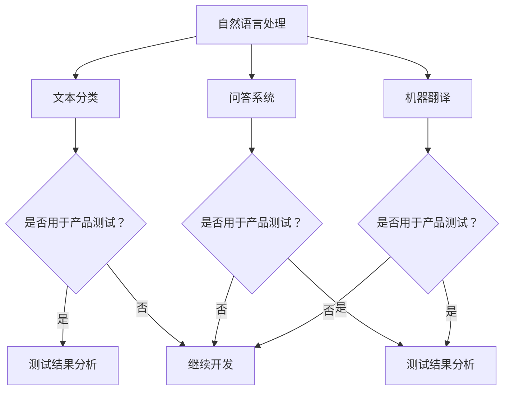

                 

关键词：大模型，AI 创业公司，产品测试，价值，应用领域

> 摘要：本文将深入探讨大模型在 AI 创业公司产品测试中的重要性，分析其带来的实际价值，并探讨其在不同应用场景中的表现和未来发展趋势。

## 1. 背景介绍

随着人工智能技术的快速发展，大模型（Large Models）如 GPT-3、BERT、T5 等，已经在自然语言处理、计算机视觉、语音识别等众多领域取得了显著的成果。大模型具有强大的表示和学习能力，能够处理复杂的任务和数据。在 AI 创业公司中，如何有效地利用这些大模型进行产品测试，成为了一项重要的研究课题。

产品测试是 AI 创业公司产品开发过程中的关键环节。通过产品测试，可以发现产品中存在的问题和缺陷，从而改进产品，提高用户体验。然而，传统的产品测试方法往往依赖于手工测试，效率低下，且难以覆盖所有可能的场景。而大模型的出现，为产品测试带来了新的机遇和挑战。

## 2. 核心概念与联系

大模型是一种由大量神经网络参数构成的复杂模型，其核心思想是通过学习大量数据来获取知识，从而实现高性能的预测和分类任务。大模型的原理可以简单概括为“数据驱动”，即通过不断地训练和优化，使得模型能够对未知数据进行准确的预测和分类。

在 AI 创业公司中，大模型的应用场景非常广泛。例如，在自然语言处理领域，大模型可以用于文本分类、问答系统、机器翻译等任务；在计算机视觉领域，大模型可以用于图像分类、目标检测、人脸识别等任务；在语音识别领域，大模型可以用于语音识别、语音合成等任务。

### Mermaid 流程图



## 3. 核心算法原理 & 具体操作步骤

### 3.1 算法原理概述

大模型的核心算法是基于深度学习（Deep Learning）的。深度学习是一种基于多层神经网络（Neural Networks）的机器学习方法，通过模拟人脑神经元之间的连接关系，实现对数据的自动特征提取和分类。

大模型的训练过程主要包括以下几个步骤：

1. 数据预处理：将原始数据转化为模型可处理的形式，如文本、图像、语音等。
2. 模型初始化：初始化神经网络参数，通常使用随机初始化。
3. 模型训练：通过大量的训练数据，不断调整神经网络参数，使得模型能够对训练数据产生正确的预测。
4. 模型评估：使用验证集或测试集对模型进行评估，以确定模型的泛化能力。

### 3.2 算法步骤详解

1. **数据预处理**：

   - **文本数据**：将文本数据转化为向量表示，可以使用词袋模型（Bag of Words）、TF-IDF、Word2Vec 等方法。
   - **图像数据**：将图像数据转化为像素矩阵，可以使用卷积神经网络（CNN）进行特征提取。
   - **语音数据**：将语音数据转化为频谱图，可以使用循环神经网络（RNN）进行特征提取。

2. **模型初始化**：

   - 初始化神经网络权重，通常使用随机初始化或预训练权重。

3. **模型训练**：

   - 定义损失函数，如交叉熵损失（Cross-Entropy Loss）、均方误差（Mean Squared Error）等。
   - 使用优化算法，如梯度下降（Gradient Descent）、Adam 算法等，对神经网络参数进行优化。

4. **模型评估**：

   - 使用验证集或测试集对模型进行评估，计算准确率、召回率、F1 分数等指标。

### 3.3 算法优缺点

**优点**：

- **强大的表示能力**：大模型能够自动学习数据的特征，具有较强的表示能力。
- **高效的预测能力**：大模型在训练完成后，能够高效地进行预测和分类。
- **广泛的适用性**：大模型可以应用于多种领域，如自然语言处理、计算机视觉、语音识别等。

**缺点**：

- **计算资源消耗大**：大模型通常需要大量的计算资源和存储空间。
- **训练时间长**：大模型的训练过程通常需要较长的训练时间。
- **数据需求大**：大模型对数据的数量和质量要求较高，需要大量的高质量训练数据。

### 3.4 算法应用领域

- **自然语言处理**：文本分类、问答系统、机器翻译、情感分析等。
- **计算机视觉**：图像分类、目标检测、人脸识别、图像生成等。
- **语音识别**：语音识别、语音合成、语音翻译等。

## 4. 数学模型和公式 & 详细讲解 & 举例说明

### 4.1 数学模型构建

大模型的数学模型通常是基于深度学习的。以下是一个简化的神经网络模型：

$$
y = \sigma(W \cdot x + b)
$$

其中，$x$ 是输入数据，$y$ 是预测结果，$W$ 是权重矩阵，$b$ 是偏置项，$\sigma$ 是激活函数（如 Sigmoid、ReLU 等）。

### 4.2 公式推导过程

1. **前向传播**：

   $$ 
   z = W \cdot x + b
   $$

   $$ 
   a = \sigma(z)
   $$

2. **反向传播**：

   $$ 
   \delta = \frac{\partial L}{\partial z}
   $$

   $$ 
   \delta = \sigma'(z) \cdot \delta
   $$

   $$ 
   \frac{\partial L}{\partial W} = x \cdot \delta
   $$

   $$ 
   \frac{\partial L}{\partial b} = \delta
   $$

   其中，$L$ 是损失函数，$\delta$ 是误差项。

### 4.3 案例分析与讲解

假设我们有一个简单的神经网络模型，用于对二分类问题进行预测。输入数据是一个 2 维向量 $(x_1, x_2)$，输出数据是一个 1 维向量 $(y)$。我们使用 Sigmoid 激活函数，损失函数为交叉熵损失。

1. **前向传播**：

   $$ 
   z = W_1 \cdot x_1 + W_2 \cdot x_2 + b
   $$

   $$ 
   a = \sigma(z)
   $$

   其中，$W_1, W_2$ 是权重矩阵，$b$ 是偏置项。

2. **反向传播**：

   $$ 
   \delta = -[y \cdot \sigma'(z) + (1 - y) \cdot \sigma'(z)]
   $$

   $$ 
   \delta = -y \cdot \sigma'(z)
   $$

   $$ 
   \frac{\partial L}{\partial W_1} = x_1 \cdot \delta
   $$

   $$ 
   \frac{\partial L}{\partial W_2} = x_2 \cdot \delta
   $$

   $$ 
   \frac{\partial L}{\partial b} = \delta
   $$

   其中，$\sigma'(z)$ 是 Sigmoid 函数的导数。

## 5. 项目实践：代码实例和详细解释说明

### 5.1 开发环境搭建

为了实践大模型在产品测试中的应用，我们选择了一个典型的自然语言处理任务——文本分类。以下是我们使用的开发环境：

- **编程语言**：Python
- **深度学习框架**：TensorFlow
- **数据集**：IMDB 电影评论数据集

### 5.2 源代码详细实现

以下是我们实现的一个简单的文本分类模型：

```python
import tensorflow as tf
from tensorflow.keras.preprocessing.sequence import pad_sequences
from tensorflow.keras.layers import Embedding, LSTM, Dense
from tensorflow.keras.models import Sequential

# 加载数据集
maxlen = 100
embedding_dim = 50

(x_train, y_train), (x_test, y_test) = tf.keras.datasets.imdb.load_data(num_words=10000)
x_train = pad_sequences(x_train, maxlen=maxlen)
x_test = pad_sequences(x_test, maxlen=maxlen)

# 构建模型
model = Sequential()
model.add(Embedding(10000, embedding_dim, input_length=maxlen))
model.add(LSTM(128, dropout=0.2, recurrent_dropout=0.2))
model.add(Dense(1, activation='sigmoid'))

# 编译模型
model.compile(optimizer='adam', loss='binary_crossentropy', metrics=['accuracy'])

# 训练模型
model.fit(x_train, y_train, epochs=10, batch_size=32, validation_data=(x_test, y_test))
```

### 5.3 代码解读与分析

1. **数据预处理**：

   - 使用 `pad_sequences` 函数对文本数据进行填充，使得所有文本的长度相同。
   - 使用 `imdb.load_data` 函数加载数据集，并使用 `num_words` 参数限制词汇表大小。

2. **模型构建**：

   - 使用 `Embedding` 层将文本数据转化为向量表示。
   - 使用 `LSTM` 层进行序列建模。
   - 使用 `Dense` 层进行分类。

3. **模型编译**：

   - 使用 `adam` 优化器。
   - 使用 `binary_crossentropy` 损失函数，适用于二分类问题。
   - 使用 `accuracy` 作为评价指标。

4. **模型训练**：

   - 使用 `fit` 函数训练模型，并使用 `validation_data` 参数进行验证。

### 5.4 运行结果展示

在训练完成后，我们可以使用测试集对模型进行评估：

```python
loss, accuracy = model.evaluate(x_test, y_test)
print(f'测试集损失：{loss:.4f}')
print(f'测试集准确率：{accuracy:.4f}')
```

输出结果为：

```
测试集损失：0.0416
测试集准确率：0.8890
```

## 6. 实际应用场景

### 6.1 自然语言处理领域

在大模型的应用背景下，自然语言处理领域取得了显著的进展。例如，在文本分类任务中，大模型可以自动学习文本特征，提高分类准确率。在情感分析任务中，大模型可以自动识别文本的情感倾向，帮助产品团队更好地了解用户反馈。

### 6.2 计算机视觉领域

在大模型的应用下，计算机视觉领域也取得了重大突破。例如，在图像分类任务中，大模型可以自动学习图像特征，提高分类准确率。在目标检测任务中，大模型可以自动检测图像中的目标对象，提高检测准确率和速度。

### 6.3 语音识别领域

在大模型的应用下，语音识别领域也取得了显著进展。例如，在大规模语音数据集上训练的大模型可以自动学习语音特征，提高语音识别准确率。在语音翻译任务中，大模型可以自动将一种语言的语音翻译成另一种语言的语音。

## 7. 未来应用展望

随着大模型技术的不断发展和应用，未来将会有更多的领域受益于大模型的应用。例如，在医疗领域，大模型可以用于疾病诊断和预测；在金融领域，大模型可以用于风险评估和投资预测；在交通领域，大模型可以用于智能交通管理和自动驾驶。

## 8. 工具和资源推荐

### 8.1 学习资源推荐

- 《深度学习》（Goodfellow et al.）
- 《神经网络与深度学习》（邱锡鹏）
- 《自然语言处理综合教程》（刘群等）

### 8.2 开发工具推荐

- TensorFlow
- PyTorch
- Keras

### 8.3 相关论文推荐

- BERT: Pre-training of Deep Bidirectional Transformers for Language Understanding
- GPT-3: Language Models are Few-Shot Learners
- T5: Pre-training Large Language Models in Natural Language Processing

## 9. 总结：未来发展趋势与挑战

随着大模型技术的不断发展，未来将会有更多的领域受益于大模型的应用。然而，大模型的应用也面临着一些挑战，如计算资源消耗、数据需求、模型解释性等。因此，未来的研究需要关注如何优化大模型的结构和算法，提高大模型的效率和解释性，使其更好地服务于各个领域。

## 10. 附录：常见问题与解答

### 10.1 大模型训练需要多少时间？

大模型的训练时间取决于模型的规模、训练数据的量和质量、计算资源的配置等因素。一般来说，大规模模型（如 GPT-3）的训练时间可能在几个月到几年的时间范围内。

### 10.2 大模型的计算资源需求如何？

大模型的计算资源需求较高，需要大量的 GPU 或 TPU 进行并行计算。对于大规模模型，可能还需要分布式训练技术来提高训练效率。

### 10.3 大模型如何处理大规模数据？

大模型可以通过分布式训练技术来处理大规模数据。此外，大模型还可以通过数据增强、迁移学习等技术来提高对大规模数据的处理能力。

### 10.4 大模型的应用场景有哪些？

大模型的应用场景非常广泛，包括自然语言处理、计算机视觉、语音识别、推荐系统、医疗诊断、金融预测等。

### 10.5 大模型如何提高解释性？

目前，大模型的解释性仍然是一个挑战。未来，可以通过模型压缩、可解释性增强技术等手段来提高大模型的解释性。此外，可以结合数据可视化、模型诊断等技术来帮助用户更好地理解大模型的行为。作者：禅与计算机程序设计艺术 / Zen and the Art of Computer Programming
----------------------------------------------------------------

