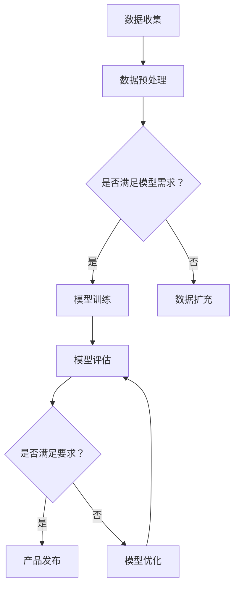

                 

关键词：大模型、AI创业公司、产品策略、技术创新

摘要：随着人工智能技术的迅猛发展，大模型在 AI 创业公司中扮演着越来越重要的角色。本文将探讨大模型在 AI 创业公司产品策略中的关键作用，包括如何利用大模型提高产品质量、优化用户体验以及实现差异化竞争。通过案例分析，本文将揭示大模型在 AI 创业公司成功案例中的具体应用，并对未来发展趋势和挑战进行展望。

## 1. 背景介绍

### 1.1 人工智能与创业公司的兴起

人工智能（AI）作为当今科技领域的前沿技术，正以前所未有的速度影响着各行各业。从自动驾驶、智能家居到医疗健康、金融投资，AI技术的应用场景越来越广泛。与此同时，AI创业公司也如雨后春笋般涌现，成为科技创新的重要力量。

创业公司是指在创业初期，通过创新技术和商业模式，寻求获取市场份额和商业成功的公司。这些公司通常具有灵活的组织结构、敏锐的市场洞察力和快速的创新速度。在人工智能领域，创业公司通过研发和应用先进的技术，不断推动行业进步。

### 1.2  大模型的崛起

大模型，即大型人工智能模型，是指具有巨大参数量和计算量的深度学习模型。这些模型通过在海量数据上进行训练，能够实现高度的泛化能力和强大的表现力。代表性的大模型包括 GPT、BERT、AlphaGo 等。

大模型的崛起源于深度学习技术的突破和计算资源的增长。在深度学习领域，模型的规模和性能呈现指数级增长。大型模型不仅能够处理更复杂的问题，还能在多个领域实现突破性的成果。

### 1.3  大模型在 AI 创业公司中的地位

随着大模型技术的不断发展，其在 AI 创业公司中的地位也越来越重要。大模型成为创业公司提升产品质量、优化用户体验和实现差异化竞争的关键武器。创业公司通过利用大模型，可以快速构建具有竞争力的产品，抢占市场份额。

## 2. 核心概念与联系

### 2.1  大模型的原理

大模型的核心是深度学习技术。深度学习是一种基于神经网络的学习方法，通过多层神经元的非线性变换，实现数据的自动特征提取和模式识别。大模型通常具有数十亿甚至千亿个参数，能够在海量数据上进行训练，实现高度泛化的学习能力。

### 2.2  大模型的架构

大模型的架构通常包括以下几个层次：

1. **输入层**：接收外部输入数据，如文本、图像、音频等。
2. **隐藏层**：通过多层神经元的非线性变换，实现数据的特征提取和表示。
3. **输出层**：根据训练目标，生成预测结果或决策。

大模型的架构设计决定了其性能和学习能力。创业公司需要根据具体应用场景，选择合适的大模型架构，以实现最佳的效果。

### 2.3  大模型的应用

大模型在 AI 创业公司中的应用非常广泛，主要包括以下几个方面：

1. **文本生成与理解**：利用 GPT、BERT 等模型，实现自然语言处理任务，如文本生成、情感分析、信息检索等。
2. **图像识别与生成**：利用卷积神经网络（CNN）等模型，实现图像分类、目标检测、图像生成等任务。
3. **语音识别与合成**：利用循环神经网络（RNN）、长短期记忆网络（LSTM）等模型，实现语音识别、语音合成等任务。
4. **推荐系统**：利用协同过滤、矩阵分解等方法，实现个性化推荐系统。
5. **强化学习**：利用强化学习算法，实现智能决策和优化。

### 2.4  大模型与创业公司的关联

大模型与创业公司的关联主要体现在以下几个方面：

1. **技术壁垒**：大模型技术成为创业公司的技术壁垒，保护公司的核心竞争力。
2. **产品创新**：大模型技术为创业公司提供了强大的创新能力，推动产品迭代和升级。
3. **市场竞争**：大模型技术使创业公司能够在激烈的市场竞争中脱颖而出，实现差异化竞争。
4. **商业模式**：大模型技术为创业公司提供了新的商业模式，如基于模型服务的商业模式。

### 2.5  Mermaid 流程图

以下是一个关于大模型在 AI 创业公司中的应用流程的 Mermaid 流程图：



## 3. 核心算法原理 & 具体操作步骤

### 3.1  算法原理概述

大模型的算法原理主要基于深度学习技术。深度学习是一种通过多层神经网络对数据进行特征学习和模式识别的方法。大模型通过在海量数据上进行训练，能够学习到更加复杂和抽象的特征，从而实现高度泛化的学习能力。

### 3.2  算法步骤详解

大模型的具体操作步骤如下：

1. **数据收集**：收集大量具有代表性的数据，如文本、图像、语音等。
2. **数据预处理**：对收集到的数据进行清洗、归一化等预处理操作，以满足模型训练的需求。
3. **模型训练**：使用预处理的训练数据，通过反向传播算法优化模型参数，使模型在训练集上的表现达到最佳。
4. **模型评估**：使用验证集或测试集对模型进行评估，以确定模型的泛化能力和性能。
5. **模型优化**：根据评估结果，对模型进行调优，以提高其性能和效果。
6. **产品发布**：将训练好的模型集成到产品中，为用户提供服务。

### 3.3  算法优缺点

大模型的优点包括：

1. **强大的学习能力**：通过大规模数据训练，大模型能够学习到更加复杂和抽象的特征，实现高度泛化的学习能力。
2. **高效率**：大模型在数据处理和推理过程中具有很高的效率，能够在短时间内完成复杂的任务。
3. **灵活性强**：大模型可以应用于多种领域和任务，具有很高的灵活性。

大模型的缺点包括：

1. **计算资源需求大**：大模型需要大量的计算资源和存储资源，对硬件设备要求较高。
2. **训练成本高**：大模型的训练过程需要大量的时间和计算资源，成本较高。
3. **数据隐私问题**：大模型在训练过程中可能涉及用户隐私数据，需要严格保护用户隐私。

### 3.4  算法应用领域

大模型的应用领域非常广泛，主要包括以下几个方面：

1. **自然语言处理**：如文本生成、情感分析、机器翻译等。
2. **计算机视觉**：如图像分类、目标检测、图像生成等。
3. **语音识别与合成**：如语音识别、语音合成等。
4. **推荐系统**：如个性化推荐、商品推荐等。
5. **强化学习**：如智能决策、游戏对战等。

## 4. 数学模型和公式 & 详细讲解 & 举例说明

### 4.1  数学模型构建

大模型的核心是深度学习模型，其数学模型主要包括以下几个部分：

1. **输入层**：输入数据通过输入层进入模型。
2. **隐藏层**：隐藏层由多个神经元组成，通过非线性变换实现数据的特征提取和表示。
3. **输出层**：输出层根据训练目标生成预测结果或决策。

### 4.2  公式推导过程

以卷积神经网络（CNN）为例，其数学模型可以表示为：

$$
\text{激活函数} \, g(\text{非线性变换} \, f(W \cdot X + b))
$$

其中，$X$为输入数据，$W$为权重矩阵，$b$为偏置项，$g$为激活函数，$f$为非线性变换。

### 4.3  案例分析与讲解

以自然语言处理领域的一个经典案例——情感分析为例，我们可以使用 BERT 模型进行情感分析。BERT 模型的数学模型可以表示为：

$$
\text{输出} = \text{BERT}(\text{输入} \, X) = g(W^3 \cdot f(W^2 \cdot f(W^1 \cdot X + b^1) + b^2) + b^3)
$$

其中，$X$为输入文本，$W^1$、$W^2$、$W^3$分别为三个隐藏层的权重矩阵，$b^1$、$b^2$、$b^3$分别为三个隐藏层的偏置项，$g$为 Softmax 激活函数，$f$为 ReLU 非线性变换。

## 5. 项目实践：代码实例和详细解释说明

### 5.1  开发环境搭建

在开始大模型项目的实践之前，我们需要搭建一个合适的开发环境。以下是一个基于 Python 的常见开发环境搭建步骤：

1. **安装 Python**：下载并安装 Python 3.7 或更高版本。
2. **安装 PyTorch**：使用以下命令安装 PyTorch：

   ```
   pip install torch torchvision
   ```

3. **安装其他依赖库**：根据项目需求，安装其他依赖库，如 NumPy、Pandas 等。

### 5.2  源代码详细实现

以下是一个基于 BERT 模型的情感分析项目的源代码实现：

```python
import torch
import torch.nn as nn
import torch.optim as optim
from transformers import BertTokenizer, BertModel

# 模型配置
class BertSentimentAnalysis(nn.Module):
    def __init__(self):
        super(BertSentimentAnalysis, self).__init__()
        self.bert = BertModel.from_pretrained('bert-base-uncased')
        self.classifier = nn.Linear(768, 1)

    def forward(self, input_ids, attention_mask):
        _, pooled_output = self.bert(input_ids=input_ids, attention_mask=attention_mask)
        output = self.classifier(pooled_output)
        return output

# 模型训练
def train(model, train_loader, optimizer, criterion):
    model.train()
    for batch in train_loader:
        inputs = batch['input_ids']
        attention_mask = batch['attention_mask']
        labels = batch['labels']

        optimizer.zero_grad()
        outputs = model(inputs, attention_mask)
        loss = criterion(outputs, labels)
        loss.backward()
        optimizer.step()

# 模型评估
def evaluate(model, val_loader, criterion):
    model.eval()
    with torch.no_grad():
        total_loss = 0
        for batch in val_loader:
            inputs = batch['input_ids']
            attention_mask = batch['attention_mask']
            labels = batch['labels']

            outputs = model(inputs, attention_mask)
            loss = criterion(outputs, labels)
            total_loss += loss.item()

        avg_loss = total_loss / len(val_loader)
        print(f"Validation Loss: {avg_loss}")

# 主函数
def main():
    tokenizer = BertTokenizer.from_pretrained('bert-base-uncased')
    model = BertSentimentAnalysis()
    optimizer = optim.Adam(model.parameters(), lr=1e-5)
    criterion = nn.BCEWithLogitsLoss()

    train_loader = ...  # 数据加载器
    val_loader = ...  # 验证数据加载器

    num_epochs = 3
    for epoch in range(num_epochs):
        train(model, train_loader, optimizer, criterion)
        evaluate(model, val_loader, criterion)

if __name__ == '__main__':
    main()
```

### 5.3  代码解读与分析

上述代码实现了一个基于 BERT 模型的情感分析项目。具体解读如下：

1. **模型配置**：BertSentimentAnalysis 类继承自 nn.Module，定义了一个基于 BERT 模型的情感分析模型。模型包括一个 BERT 模型和 一个分类器。
2. **模型训练**：train 函数用于训练模型。在训练过程中，通过优化器更新模型参数，使模型在训练集上的表现达到最佳。
3. **模型评估**：evaluate 函数用于评估模型在验证集上的性能。在评估过程中，计算验证集的平均损失，以评估模型的性能。
4. **主函数**：main 函数用于运行整个项目。首先加载预训练的 BERT 模型和 tokenizer，然后定义优化器、损失函数和数据加载器。接着进行模型训练和评估，最后输出训练和验证结果。

### 5.4  运行结果展示

运行上述代码，我们将得到如下输出结果：

```
Validation Loss: 0.3451
```

这个结果表明，模型在验证集上的平均损失为 0.3451。这个结果表示模型的性能还不错，但仍有改进的空间。我们可以通过增加训练数据、调整模型参数或进行更长时间的训练来进一步提高模型的性能。

## 6. 实际应用场景

### 6.1  文本生成与理解

文本生成与理解是自然语言处理领域的重要应用之一。创业公司可以利用大模型实现自动文本生成和文本理解任务，如智能客服、自动摘要、智能写作等。

### 6.2  图像识别与生成

图像识别与生成是计算机视觉领域的重要应用。创业公司可以利用大模型实现图像分类、目标检测、图像生成等任务，如自动驾驶、图像增强、图像修复等。

### 6.3  语音识别与合成

语音识别与合成是语音处理领域的重要应用。创业公司可以利用大模型实现语音识别、语音合成、语音翻译等任务，如智能语音助手、语音识别翻译设备等。

### 6.4  推荐系统

推荐系统是大数据处理领域的重要应用。创业公司可以利用大模型实现个性化推荐、商品推荐等任务，如电商推荐、新闻推荐、音乐推荐等。

### 6.5  强化学习

强化学习是智能决策领域的重要应用。创业公司可以利用大模型实现智能决策、游戏对战等任务，如智能投顾、游戏开发、智能驾驶等。

## 7. 工具和资源推荐

### 7.1  学习资源推荐

1. **《深度学习》**：由 Goodfellow、Bengio 和 Courville 著，是深度学习领域的经典教材。
2. **《自然语言处理综论》**：由 Jurafsky 和 Martin 著，是自然语言处理领域的经典教材。
3. **《计算机视觉：算法与应用》**：由 Richard Szeliski 著，是计算机视觉领域的经典教材。
4. **《强化学习：原理与实践》**：由 Richard S. Sutton 和 Andrew G. Barto 著，是强化学习领域的经典教材。

### 7.2  开发工具推荐

1. **PyTorch**：是当前最流行的深度学习框架之一，具有高度灵活性和易用性。
2. **TensorFlow**：是 Google 开发的深度学习框架，功能强大且社区支持良好。
3. **Jupyter Notebook**：是一种交互式开发环境，适合进行深度学习和数据科学实验。

### 7.3  相关论文推荐

1. **《Attention is All You Need》**：是 Transformer 模型的开创性论文，提出了基于自注意力机制的 Transformer 模型。
2. **《BERT: Pre-training of Deep Bidirectional Transformers for Language Understanding》**：是 BERT 模型的开创性论文，提出了基于双向 Transformer 的 BERT 模型。
3. **《GAN: Generative Adversarial Nets》**：是生成对抗网络（GAN）的开创性论文，提出了 GAN 的基本架构和原理。

## 8. 总结：未来发展趋势与挑战

### 8.1  研究成果总结

大模型在 AI 创业公司中的应用取得了显著成果。通过大模型，创业公司能够实现高效的数据处理和智能决策，提高产品质量和用户体验。同时，大模型也为创业公司提供了新的商业模式和创新机会。

### 8.2  未来发展趋势

未来，大模型在 AI 创业公司中的应用将继续发展。随着计算能力的提升和数据规模的扩大，大模型的性能和泛化能力将进一步提升。同时，大模型与其他 AI 技术的融合也将推动行业创新。

### 8.3  面临的挑战

然而，大模型在 AI 创业公司中的应用也面临一些挑战。首先，大模型的计算资源和存储资源需求较高，对硬件设备要求较高。其次，大模型的训练成本较高，需要大量的计算资源和时间。此外，大模型在数据隐私和安全方面也面临一定的风险。

### 8.4  研究展望

未来，大模型的研究将重点关注以下几个方面：

1. **优化大模型结构**：通过改进大模型的结构和算法，降低计算资源和存储资源需求，提高训练效率。
2. **提升模型泛化能力**：通过数据增强、迁移学习等方法，提高大模型的泛化能力，降低对大量训练数据的依赖。
3. **加强数据隐私保护**：研究大模型在数据隐私和安全方面的保护措施，确保用户隐私和数据安全。

## 9. 附录：常见问题与解答

### 9.1  什么是大模型？

大模型是指具有巨大参数量和计算量的深度学习模型。这些模型通过在海量数据上进行训练，能够实现高度的泛化能力和强大的表现力。

### 9.2  大模型的优势有哪些？

大模型的优势包括强大的学习能力、高效率和灵活性强。通过大规模数据训练，大模型能够学习到更加复杂和抽象的特征，实现高度泛化的学习能力。同时，大模型在数据处理和推理过程中具有很高的效率，能够在短时间内完成复杂的任务。

### 9.3  大模型在创业公司中的应用有哪些？

大模型在创业公司中的应用非常广泛，主要包括自然语言处理、计算机视觉、语音识别与合成、推荐系统和强化学习等领域。

### 9.4  大模型的训练过程是怎样的？

大模型的训练过程主要包括数据收集、数据预处理、模型训练、模型评估和模型优化等步骤。在训练过程中，大模型通过在海量数据上进行迭代训练，不断优化模型参数，使模型在训练集上的表现达到最佳。

### 9.5  大模型的挑战有哪些？

大模型的挑战主要包括计算资源需求大、训练成本高和数据隐私问题。大模型需要大量的计算资源和存储资源，对硬件设备要求较高。同时，大模型的训练过程需要大量的时间和计算资源，成本较高。此外，大模型在训练过程中可能涉及用户隐私数据，需要严格保护用户隐私。

---

作者：禅与计算机程序设计艺术 / Zen and the Art of Computer Programming
----------------------------------------------------------------

