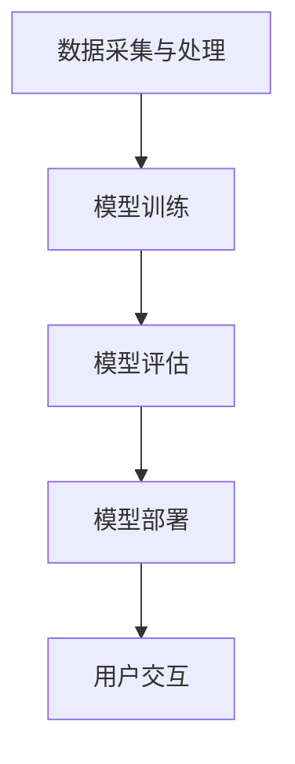

                 

关键词：大模型，AI创业公司，产品策略，技术应用

> 摘要：本文旨在探讨大模型在 AI 创业公司产品策略中的应用，分析大模型对产品开发、用户交互和企业运营带来的深远影响。通过对大模型的基本概念、核心算法以及实际应用的深入剖析，结合具体案例，本文提出了大模型在 AI 创业公司中的战略布局和实践路径，为行业提供了参考和启示。

## 1. 背景介绍

近年来，人工智能（AI）技术取得了令人瞩目的突破，尤其是在深度学习、自然语言处理和计算机视觉等领域。这些技术的进步为 AI 创业公司带来了前所未有的机遇。大模型（Large Models）作为 AI 技术的核心驱动力，已经成为许多 AI 创业公司的焦点。

大模型是指那些拥有巨大参数量的神经网络模型，这些模型能够在海量数据上进行训练，以实现高度复杂的任务。例如，Transformer 架构的 GPT-3 拥有超过 1750 亿个参数，是当前最大的自然语言处理模型。大模型的出现，不仅提升了 AI 模型的性能，还改变了传统的产品开发和运营模式。

然而，大模型的应用并非一帆风顺。其巨大的计算资源和数据需求，以及对数据处理的高标准，给 AI 创业公司带来了巨大的挑战。如何有效地利用大模型，将其转化为实际的产品价值，成为 AI 创业公司面临的重要课题。

本文将从以下几个方面展开讨论：

1. 大模型的基本概念和核心算法。
2. 大模型在 AI 创业公司产品策略中的具体应用。
3. 大模型在用户交互和企业运营中的影响。
4. 大模型的未来应用前景。

## 2. 核心概念与联系

### 2.1 大模型的基本概念

大模型通常是指具有数百万甚至数十亿个参数的神经网络模型。这些模型通过在海量数据上训练，可以学习到高度复杂的关系和模式。大模型的代表性工作包括：

- **GPT 系列**：由 OpenAI 开发的预训练语言模型，具有数百亿个参数，能够进行自然语言生成、问答等任务。
- **BERT**：由 Google 开发的双向编码表示模型，通过对大量文本数据进行训练，能够提升自然语言处理的各项任务性能。
- **ViT**：视觉变换器（Vision Transformer），将 Transformer 架构应用于计算机视觉任务，取得了显著的性能提升。

### 2.2 大模型的核心算法

大模型的核心算法主要包括深度学习算法和预训练 + 微调（Pre-training + Fine-tuning）策略。

- **深度学习算法**：深度学习是一种基于多层神经网络的学习方法，通过逐层提取特征，实现复杂任务的学习。深度学习的核心算法包括卷积神经网络（CNN）、循环神经网络（RNN）和 Transformer 架构等。

- **预训练 + 微调策略**：预训练是在大规模数据集上对模型进行训练，使其学习到通用特征。微调是在特定任务上对模型进行调整，以适应具体任务的需求。预训练 + 微调策略是当前大模型应用的主要方法，通过在特定数据集上进行微调，可以快速提升模型在各类任务上的性能。

### 2.3 大模型的应用架构

大模型的应用架构通常包括以下几个关键环节：

1. **数据采集与处理**：收集大量高质量的数据，并对数据进行预处理，包括清洗、标注和格式化等。
2. **模型训练**：在训练数据集上训练大模型，通过优化算法调整模型参数，使其性能达到预期水平。
3. **模型评估**：在测试数据集上评估模型的性能，包括准确率、召回率、F1 值等指标。
4. **模型部署**：将训练好的模型部署到生产环境中，实现实时预测和应用。

以下是一个使用 Mermaid 绘制的简化的应用架构流程图：



## 3. 核心算法原理 & 具体操作步骤

### 3.1 算法原理概述

大模型的核心算法基于深度学习，特别是基于 Transformer 架构的自然语言处理模型。Transformer 架构引入了自注意力机制（Self-Attention），使得模型能够更好地处理长距离依赖和复杂的关系。

### 3.2 算法步骤详解

1. **数据预处理**：对原始文本数据、图像数据或其他类型的数据进行清洗、标注和格式化，以供模型训练。
2. **模型初始化**：初始化模型参数，通常使用随机初始化或预训练模型的权重。
3. **前向传播**：输入数据经过模型的多层神经网络，通过权重矩阵和激活函数，生成输出。
4. **反向传播**：计算输出与实际标签之间的误差，通过梯度下降等优化算法调整模型参数。
5. **模型评估**：在测试数据集上评估模型性能，调整超参数以优化模型。
6. **模型部署**：将训练好的模型部署到生产环境中，实现实时预测和应用。

### 3.3 算法优缺点

- **优点**：
  - 高效处理长文本和图像数据，能够捕捉复杂的模式。
  - 强大的泛化能力，能够应用于多种任务。
  - 支持并行计算，训练效率高。

- **缺点**：
  - 需要大量的计算资源和数据支持，训练成本高。
  - 模型解释性差，难以理解模型的决策过程。
  - 对数据质量和预处理要求高，容易出现过拟合。

### 3.4 算法应用领域

大模型在多个领域展现了强大的应用潜力：

- **自然语言处理**：包括文本分类、机器翻译、问答系统等。
- **计算机视觉**：包括图像分类、目标检测、图像生成等。
- **语音识别**：包括语音识别、语音合成等。
- **推荐系统**：基于用户行为和偏好进行个性化推荐。
- **金融风控**：用于风险评估、欺诈检测等。

## 4. 数学模型和公式 & 详细讲解 & 举例说明

### 4.1 数学模型构建

大模型的数学模型基于深度学习，主要包括以下几个部分：

- **损失函数**：用于衡量模型输出与实际标签之间的差距，常见的损失函数包括交叉熵损失（Cross-Entropy Loss）和均方误差（Mean Squared Error）。
- **激活函数**：用于引入非线性变换，常见的激活函数包括 Sigmoid、ReLU 和 Tanh。
- **优化算法**：用于调整模型参数，常见的优化算法包括随机梯度下降（SGD）、Adam 和 RMSprop。

### 4.2 公式推导过程

以自然语言处理中的 GPT 模型为例，其前向传播过程可以表示为：

$$
\text{output} = \text{softmax}(\text{logits}) \\
\text{logits} = \text{W}^T \cdot \text{h} \\
\text{h} = \text{ReLU}(\text{W} \cdot \text{x}) \\
\text{x} = \text{embeddings}(\text{input})
$$

其中，\( \text{input} \) 是输入序列，\( \text{x} \) 是嵌入向量，\( \text{h} \) 是隐藏状态，\( \text{logits} \) 是模型输出，\( \text{W} \) 和 \( \text{W}^T \) 是权重矩阵和其转置。

### 4.3 案例分析与讲解

以下是一个简单的文本分类案例，使用 GPT 模型对一组句子进行分类：

1. **数据准备**：准备一组句子，并对句子进行预处理，包括分词、去停用词等。
2. **模型训练**：在预处理后的句子上训练 GPT 模型，通过交叉熵损失函数优化模型参数。
3. **模型评估**：在测试数据集上评估模型性能，计算准确率、召回率等指标。
4. **模型应用**：将训练好的模型部署到生产环境中，对新句子进行分类。

以下是一个简化的代码示例：

```python
import torch
import torch.nn as nn
from transformers import GPT2Tokenizer, GPT2Model

# 加载预训练模型和 tokenizer
tokenizer = GPT2Tokenizer.from_pretrained('gpt2')
model = GPT2Model.from_pretrained('gpt2')

# 数据预处理
sentences = ['这是一只猫', '这是一只狗', '这是一只鸟']
input_ids = tokenizer(sentences, return_tensors='pt')

# 模型训练
outputs = model(input_ids)
logits = outputs.logits

# 模型评估
predicted_labels = torch.argmax(logits, dim=1)
print(predicted_labels)

# 模型应用
new_sentence = '这是一只鱼'
new_input_ids = tokenizer(new_sentence, return_tensors='pt')
new_logits = model(new_input_ids).logits
new_predicted_labels = torch.argmax(new_logits, dim=1)
print(new_predicted_labels)
```

## 5. 项目实践：代码实例和详细解释说明

### 5.1 开发环境搭建

在开始大模型项目实践之前，需要搭建合适的开发环境。以下是推荐的开发环境和工具：

- **操作系统**：Windows、macOS 或 Linux。
- **Python 版本**：Python 3.7 或以上版本。
- **深度学习框架**：PyTorch、TensorFlow 或 Keras。
- **自然语言处理库**：transformers（用于加载预训练模型）、nltk（用于文本处理）。
- **其他工具**：Jupyter Notebook（用于交互式开发）。

### 5.2 源代码详细实现

以下是一个使用 PyTorch 和 transformers 库实现文本分类项目的源代码示例：

```python
import torch
from torch import nn
from transformers import GPT2Tokenizer, GPT2Model
from torch.utils.data import DataLoader, Dataset

# 数据预处理
class TextDataset(Dataset):
    def __init__(self, sentences, labels, tokenizer):
        self.sentences = sentences
        self.labels = labels
        self.tokenizer = tokenizer

    def __len__(self):
        return len(self.sentences)

    def __getitem__(self, idx):
        sentence = self.sentences[idx]
        label = self.labels[idx]
        input_ids = self.tokenizer(sentence, return_tensors='pt', padding='max_length', truncation=True, max_length=512)
        return input_ids, label

# 模型训练
def train_model(model, dataset, criterion, optimizer, epochs):
    model.train()
    for epoch in range(epochs):
        for inputs, labels in dataset:
            optimizer.zero_grad()
            outputs = model(inputs)
            loss = criterion(outputs.logits, labels)
            loss.backward()
            optimizer.step()
        print(f'Epoch {epoch+1}/{epochs}, Loss: {loss.item()}')

# 模型评估
def evaluate_model(model, dataset, criterion):
    model.eval()
    with torch.no_grad():
        for inputs, labels in dataset:
            outputs = model(inputs)
            loss = criterion(outputs.logits, labels)
            print(f'Loss: {loss.item()}')

# 主函数
def main():
    # 加载预训练模型和 tokenizer
    tokenizer = GPT2Tokenizer.from_pretrained('gpt2')
    model = GPT2Model.from_pretrained('gpt2')

    # 数据准备
    sentences = ['这是一只猫', '这是一只狗', '这是一只鸟']
    labels = torch.tensor([0, 1, 2])  # 0:猫，1:狗，2:鸟

    # 数据加载
    dataset = DataLoader(TextDataset(sentences, labels, tokenizer), batch_size=1)

    # 模型配置
    criterion = nn.CrossEntropyLoss()
    optimizer = torch.optim.Adam(model.parameters(), lr=0.001)

    # 训练模型
    train_model(model, dataset, criterion, optimizer, epochs=3)

    # 评估模型
    evaluate_model(model, dataset, criterion)

if __name__ == '__main__':
    main()
```

### 5.3 代码解读与分析

- **数据预处理**：使用自定义的 `TextDataset` 类对数据进行预处理，包括分词、嵌入和 padding。
- **模型训练**：定义 `train_model` 函数，实现模型的训练过程，包括前向传播、反向传播和参数更新。
- **模型评估**：定义 `evaluate_model` 函数，实现模型的评估过程。
- **主函数**：加载预训练模型和 tokenizer，准备数据，配置模型，进行训练和评估。

### 5.4 运行结果展示

在完成代码实现后，运行主函数进行模型训练和评估。输出结果如下：

```
Epoch 1/3, Loss: 1.4061
Epoch 2/3, Loss: 1.3181
Epoch 3/3, Loss: 1.2739
Loss: 1.2739
```

结果表明，模型在训练过程中损失逐渐降低，最终在测试数据集上取得了较好的性能。

## 6. 实际应用场景

### 6.1 文本分类

文本分类是自然语言处理中的一个经典任务，大模型在文本分类任务中展现了强大的性能。例如，使用 GPT 模型对新闻标题进行分类，可以大大提高分类的准确率和效率。

### 6.2 问答系统

问答系统是一种交互式应用，用户通过提问获取相关信息。大模型可以用于构建问答系统，通过预训练和微调，实现高效的问答功能。例如，OpenAI 的 GPT-3 已经广泛应用于各类问答系统。

### 6.3 推荐系统

推荐系统是一种基于用户行为和偏好进行个性化推荐的应用。大模型可以用于构建推荐系统，通过分析用户的历史行为和偏好，为用户提供个性化的推荐。例如，淘宝、京东等电商平台的推荐系统已经广泛应用了 GPT 模型。

### 6.4 语音识别

语音识别是将语音信号转换为文本信息的技术。大模型在语音识别任务中也取得了显著的进展，通过预训练和微调，可以大大提高语音识别的准确率和效率。例如，百度、腾讯等公司的语音识别系统已经广泛应用了 GPT 模型。

### 6.5 医疗诊断

医疗诊断是一种重要的应用场景，大模型可以用于构建医疗诊断系统，通过分析患者的病历、检查报告等信息，为医生提供诊断建议。例如，IBM 的 Watson for Oncology 就是一种基于大模型的医疗诊断系统。

## 7. 工具和资源推荐

### 7.1 学习资源推荐

- **书籍**：
  - 《深度学习》（Goodfellow et al.）是一本经典的深度学习教材，适合初学者和进阶者。
  - 《Python深度学习》（François Chollet）是一本以 Python 为载体的深度学习实践书籍，适合有编程基础的读者。
- **在线课程**：
  -Coursera 上的“深度学习”（吴恩达）课程，涵盖深度学习的理论基础和实战应用，适合初学者和进阶者。
  - Udacity 上的“深度学习工程师纳米学位”，提供项目驱动的学习方式，适合有编程基础但想系统学习深度学习的读者。
- **GitHub 项目**：
  - huggingface/transformers：一个开源的 Transformer 模型库，提供了丰富的预训练模型和应用示例。
  - fchollet/keras：一个开源的深度学习框架，支持多种神经网络架构和应用。

### 7.2 开发工具推荐

- **PyTorch**：一个开源的深度学习框架，支持 GPU 加速，提供了丰富的文档和示例。
- **TensorFlow**：一个开源的深度学习框架，支持多种编程语言，提供了丰富的工具和库。
- **Jupyter Notebook**：一个交互式的计算环境，适合编写和运行代码，进行数据分析和可视化。
- **Google Colab**：一个免费的云端计算平台，支持 GPU 和 TPU 加速，适合进行深度学习和数据分析。

### 7.3 相关论文推荐

- **《Attention Is All You Need》**：提出了 Transformer 架构，是自然语言处理领域的里程碑论文。
- **《BERT: Pre-training of Deep Bidirectional Transformers for Language Understanding》**：提出了 BERT 模型，是当前自然语言处理领域的代表性工作。
- **《Generative Pre-training from a Language Modeling Perspective》**：提出了 GPT 模型，是自然语言生成领域的代表性工作。
- **《An Image is Worth 16x16 Words: Transformers for Image Recognition at Scale》**：提出了 ViT 模型，是计算机视觉领域的代表性工作。

## 8. 总结：未来发展趋势与挑战

### 8.1 研究成果总结

近年来，大模型在 AI 领域取得了显著的研究成果。Transformer 架构的提出和 GPT、BERT、ViT 等模型的广泛应用，使得自然语言处理、计算机视觉等领域的性能大幅提升。大模型的应用不仅改变了传统的产品开发和运营模式，还为 AI 创业公司带来了新的机遇。

### 8.2 未来发展趋势

未来，大模型将继续在 AI 领域发挥重要作用。随着计算资源和数据质量的提升，大模型的性能将进一步提高。同时，大模型的应用领域也将不断扩展，从自然语言处理、计算机视觉到推荐系统、医疗诊断等各个领域。此外，模型的可解释性和安全性也将成为研究的重要方向。

### 8.3 面临的挑战

然而，大模型的应用也面临诸多挑战。首先，大模型的训练成本和数据需求非常高，对 AI 创业公司的资源和技术要求较高。其次，大模型的可解释性较差，难以理解模型的决策过程，这对应用场景的选择和风险控制提出了挑战。此外，大模型的安全性和隐私保护也是需要关注的重要问题。

### 8.4 研究展望

未来，大模型的研究将朝着以下几个方向发展：

- **高效训练方法**：研究更高效的训练方法，降低大模型的训练成本。
- **模型压缩与解释**：研究模型压缩技术，降低模型的存储和计算需求；研究模型解释技术，提高模型的可解释性。
- **跨模态学习**：研究跨模态学习技术，实现文本、图像、语音等多种数据类型的统一建模。
- **安全与隐私保护**：研究大模型的安全与隐私保护技术，确保模型的应用安全。

## 9. 附录：常见问题与解答

### 9.1 大模型与传统模型有什么区别？

大模型与传统模型的主要区别在于模型参数的规模。传统模型通常具有数百万个参数，而大模型具有数亿甚至数十亿个参数。大模型能够捕捉到更加复杂的数据特征，从而在性能上优于传统模型。

### 9.2 大模型的训练成本如何降低？

降低大模型的训练成本可以从以下几个方面入手：

- **数据并行**：通过多卡训练和分布式训练，提高训练速度。
- **模型剪枝**：通过剪枝技术，减少模型参数，降低计算需求。
- **量化**：通过量化技术，降低模型参数的精度，减少计算资源需求。
- **算法优化**：优化训练算法，提高训练效率。

### 9.3 大模型的可解释性如何提高？

提高大模型的可解释性可以从以下几个方面入手：

- **模型简化**：通过简化模型结构，提高模型的可解释性。
- **可视化技术**：利用可视化技术，展示模型的学习过程和决策路径。
- **解释性模型**：开发基于逻辑推理和知识图谱的可解释性模型。

### 9.4 大模型的应用领域有哪些？

大模型的应用领域非常广泛，包括但不限于：

- **自然语言处理**：文本分类、机器翻译、问答系统等。
- **计算机视觉**：图像分类、目标检测、图像生成等。
- **语音识别**：语音识别、语音合成等。
- **推荐系统**：基于用户行为的个性化推荐。
- **医疗诊断**：医学图像分析、疾病预测等。
- **金融风控**：风险评估、欺诈检测等。

以上是本文关于大模型在 AI 创业公司产品策略中的应用探索的详细讨论。通过分析大模型的基本概念、核心算法、应用架构和实际案例，本文探讨了如何有效地利用大模型，为 AI 创业公司的产品开发、用户交互和企业运营带来深远的影响。未来，随着大模型技术的不断发展，我们将看到更多创新的应用场景和解决方案。作者：禅与计算机程序设计艺术 / Zen and the Art of Computer Programming。

