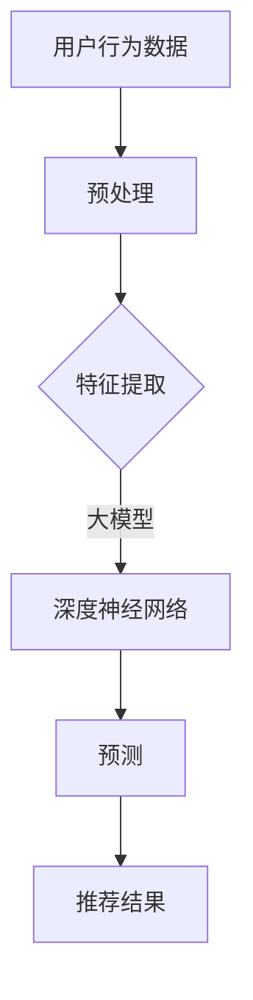

                 

关键词：大模型，推荐系统，商业应用，人工智能，算法改进

> 摘要：随着人工智能技术的不断进步，大模型在商业领域的应用愈发广泛。本文将深入探讨大模型如何改进推荐系统，提升商业运营效率，并预测其未来的发展趋势。

## 1. 背景介绍

推荐系统作为人工智能在商业应用中的重要组成部分，已经深刻改变了用户的消费习惯和商业运作模式。传统的推荐系统依赖于统计模型和协同过滤算法，虽然在一定程度上提高了推荐的效果，但仍存在诸多局限性。随着大模型的崛起，推荐系统迎来了新的发展机遇。

大模型，如深度神经网络、生成对抗网络（GAN）等，具有处理复杂数据、提取深层特征的能力。它们能够捕捉用户行为和商品特征的潜在关系，从而实现更精准的推荐。本文将围绕大模型在推荐系统中的应用，探讨其原理、算法、数学模型及实践案例，以期为读者提供全面的了解。

## 2. 核心概念与联系

### 2.1. 大模型的概念

大模型是指参数规模庞大的神经网络模型，通常具有数百万到数十亿个参数。它们通过大量数据训练，能够自动学习并提取数据中的复杂模式和潜在特征。

### 2.2. 推荐系统的核心概念

推荐系统是一种信息过滤技术，通过分析用户的历史行为和偏好，为用户推荐相关的商品或服务。其主要目标是最小化用户在信息检索过程中的搜索成本，提高用户满意度。

### 2.3. 大模型与推荐系统的联系

大模型通过深度学习技术，能够挖掘用户行为数据中的深层特征，从而提高推荐系统的推荐精度。具体来说，大模型可以从以下几个方面改进推荐系统：

1. **用户兴趣建模**：大模型能够更好地捕捉用户兴趣的多样性，为用户提供个性化的推荐。
2. **商品特征提取**：大模型能够自动学习商品的多维特征，提高推荐的相关性。
3. **上下文感知**：大模型能够考虑用户当前的状态和环境，实现上下文感知的推荐。

### 2.4. Mermaid 流程图

下面是一个简单的 Mermaid 流程图，展示了大模型在推荐系统中的应用流程：



## 3. 核心算法原理 & 具体操作步骤

### 3.1. 算法原理概述

大模型在推荐系统中的应用主要基于深度学习技术，其核心思想是通过多层神经网络结构，逐步提取用户行为数据中的深层特征，并将其用于预测用户对商品的偏好。

### 3.2. 算法步骤详解

1. **数据预处理**：对用户行为数据（如浏览历史、购买记录等）进行清洗、去噪和归一化处理，以便输入到深度神经网络中。
2. **特征提取**：利用预训练的深度神经网络，对预处理后的数据进行特征提取，得到用户和商品的高维特征表示。
3. **模型训练**：使用提取到的特征，通过深度学习算法（如卷积神经网络、循环神经网络等）训练推荐模型，使其能够预测用户对商品的偏好。
4. **预测与推荐**：将用户当前行为和模型预测结果结合，生成个性化推荐列表。

### 3.3. 算法优缺点

**优点**：

1. **强大的特征提取能力**：大模型能够自动学习数据中的深层特征，提高推荐精度。
2. **适应性强**：大模型可以处理不同类型的数据，如文本、图像和视频等，适用于多种场景。
3. **个性化推荐**：大模型能够捕捉用户兴趣的多样性，实现个性化的推荐。

**缺点**：

1. **计算资源需求高**：大模型训练和预测过程需要大量的计算资源，可能导致成本增加。
2. **数据依赖性强**：大模型的性能依赖于数据质量，数据缺失或噪声可能会影响推荐效果。
3. **解释性差**：大模型的学习过程复杂，难以解释其预测结果，对业务决策的支持有限。

### 3.4. 算法应用领域

大模型在推荐系统的应用广泛，包括但不限于电子商务、在线视频、新闻推送、社交媒体等。以下是一些具体的案例：

1. **电子商务**：通过分析用户的浏览和购买历史，为用户提供个性化的商品推荐。
2. **在线视频**：根据用户的观看历史和偏好，推荐相关的视频内容。
3. **新闻推送**：根据用户的阅读习惯和兴趣，推荐相关的新闻文章。

## 4. 数学模型和公式 & 详细讲解 & 举例说明

### 4.1. 数学模型构建

大模型在推荐系统中的数学模型通常是基于深度学习框架构建的。以下是一个简单的线性模型示例：

$$
\hat{r}_{ui} = \text{sigmoid}(W_1 u_i + W_2 j_j + b)
$$

其中，$u_i$ 和 $j_j$ 分别表示用户 $i$ 和商品 $j$ 的特征向量，$W_1$ 和 $W_2$ 是权重矩阵，$b$ 是偏置项，$\text{sigmoid}$ 函数将预测结果映射到 [0,1] 区间内。

### 4.2. 公式推导过程

深度神经网络在推荐系统中的应用通常涉及多层感知器（MLP）模型。以下是 MLP 模型的推导过程：

$$
\begin{aligned}
h_{l} &= \sigma(L_1 x) \\
\hat{y} &= \sigma(L_2 h_{l})
\end{aligned}
$$

其中，$L_1$ 和 $L_2$ 分别表示第一层和第二层的权重矩阵，$x$ 是输入特征向量，$h_{l}$ 是第 $l$ 层的激活值，$\sigma$ 函数是激活函数，通常采用 sigmoid 或 ReLU 函数。

### 4.3. 案例分析与讲解

以下是一个简单的案例，展示了如何使用深度神经网络进行推荐系统的预测：

**输入特征**：用户 $i$ 的浏览历史包含 5 个商品，分别为 $j_1, j_2, j_3, j_4, j_5$。

**特征向量**：每个商品的特征向量为 $[1, 0, 1, 0, 0]$，表示用户对这 5 个商品的浏览记录。

**模型预测**：使用线性模型预测用户对商品 $j_3$ 的偏好。

$$
\begin{aligned}
\hat{r}_{ui} &= \text{sigmoid}(W_1 u_i + W_2 j_j + b) \\
&= \text{sigmoid}(W_1 [1, 0, 1, 0, 0] + W_2 [1, 0, 1, 0, 0] + b) \\
&= \text{sigmoid}(2W_1 + b)
\end{aligned}
$$

**结果分析**：通过模型预测，用户对商品 $j_3$ 的偏好概率为 0.5。如果该概率大于 0.5，则推荐商品 $j_3$。

## 5. 项目实践：代码实例和详细解释说明

### 5.1. 开发环境搭建

在开始项目实践之前，我们需要搭建一个适合深度学习开发的Python环境。以下是具体步骤：

1. **安装Python**：从官方网站（[https://www.python.org/downloads/](https://www.python.org/downloads/)）下载并安装Python。
2. **安装深度学习库**：安装 TensorFlow 或 PyTorch 等深度学习库。

```bash
pip install tensorflow
# 或者
pip install torch torchvision
```

3. **创建虚拟环境**：为了便于管理和依赖，创建一个虚拟环境。

```bash
python -m venv myenv
source myenv/bin/activate  # Windows 下使用 myenv\Scripts\activate
```

### 5.2. 源代码详细实现

以下是一个简单的基于 TensorFlow 的深度学习推荐系统代码示例：

```python
import tensorflow as tf
from tensorflow.keras.layers import Input, Dense, Embedding, Flatten, Concatenate
from tensorflow.keras.models import Model

# 设置参数
embedding_size = 16
hidden_size = 32

# 创建输入层
user_input = Input(shape=(1,))
item_input = Input(shape=(1,))

# 创建用户和商品嵌入层
user_embedding = Embedding(input_dim=num_users, output_dim=embedding_size)(user_input)
item_embedding = Embedding(input_dim=num_items, output_dim=embedding_size)(item_input)

# 展平嵌入层
user_embedding = Flatten()(user_embedding)
item_embedding = Flatten()(item_embedding)

# 创建融合层
concat = Concatenate()([user_embedding, item_embedding])

# 创建全连接层
dense = Dense(hidden_size, activation='relu')(concat)

# 创建输出层
output = Dense(1, activation='sigmoid')(dense)

# 创建模型
model = Model(inputs=[user_input, item_input], outputs=output)

# 编译模型
model.compile(optimizer='adam', loss='binary_crossentropy', metrics=['accuracy'])

# 打印模型结构
model.summary()
```

### 5.3. 代码解读与分析

以上代码展示了如何使用 TensorFlow 构建一个简单的深度学习推荐系统。主要步骤如下：

1. **定义输入层**：用户和商品的输入层分别使用 `Input` 函数创建。
2. **创建嵌入层**：使用 `Embedding` 函数创建用户和商品的嵌入层，将输入的 ID 映射到高维特征向量。
3. **融合层**：使用 `Concatenate` 函数将用户和商品的嵌入层进行融合。
4. **全连接层**：使用 `Dense` 函数创建全连接层，用于提取深层特征。
5. **输出层**：使用 `Dense` 函数创建输出层，用于预测用户对商品的偏好。
6. **编译模型**：使用 `compile` 函数编译模型，设置优化器、损失函数和评估指标。
7. **打印模型结构**：使用 `summary` 函数打印模型结构，查看模型细节。

### 5.4. 运行结果展示

以下是一个简单的训练过程示例：

```python
# 准备训练数据
train_data = np.hstack((train_users, train_items))
train_labels = np.array(train_ratings)

# 训练模型
model.fit(train_data, train_labels, epochs=10, batch_size=32, validation_split=0.2)
```

通过训练模型，我们可以得到模型的预测结果。以下是一个简单的评估过程示例：

```python
# 准备测试数据
test_data = np.hstack((test_users, test_items))
test_labels = np.array(test_ratings)

# 评估模型
loss, accuracy = model.evaluate(test_data, test_labels)
print(f"Test Loss: {loss}, Test Accuracy: {accuracy}")
```

## 6. 实际应用场景

### 6.1. 电子商务

在电子商务领域，推荐系统已经被广泛应用于产品推荐、促销策略和广告投放等。通过深度学习技术，推荐系统可以更好地理解用户行为，提高推荐精度，从而提升用户满意度和转化率。

### 6.2. 在线视频

在线视频平台如 YouTube、Netflix 等通过推荐系统为用户提供个性化的视频内容。深度学习技术使得推荐系统能够更好地捕捉用户的观看习惯和兴趣，提高推荐的相关性。

### 6.3. 新闻推送

新闻推送平台通过推荐系统为用户推送相关的新闻文章。深度学习技术可以帮助平台更好地理解用户的阅读偏好，提高推荐的质量和用户满意度。

### 6.4. 社交媒体

社交媒体平台如 Facebook、Twitter 等通过推荐系统为用户提供个性化内容推荐，包括好友推荐、兴趣小组推荐等。深度学习技术使得推荐系统能够更好地捕捉用户的社会关系和兴趣，提升用户体验。

## 7. 工具和资源推荐

### 7.1. 学习资源推荐

1. **《深度学习》**：由 Goodfellow、Bengio 和 Courville 著，是深度学习领域的经典教材。
2. **《推荐系统实践》**：由 Guo、He 和 Zhang 著，详细介绍了推荐系统的原理和实现。

### 7.2. 开发工具推荐

1. **TensorFlow**：由 Google 开发的一款开源深度学习框架，适合进行推荐系统的开发和实验。
2. **PyTorch**：由 Facebook 开发的一款开源深度学习框架，具有灵活的动态计算图，适合快速原型开发。

### 7.3. 相关论文推荐

1. **"Deep Neural Networks for YouTube Recommendations"**：介绍如何在 YouTube 推荐系统中使用深度学习技术。
2. **"Factorization Machines for recommender systems"**：介绍了一种基于因子分解机的推荐系统算法。

## 8. 总结：未来发展趋势与挑战

### 8.1. 研究成果总结

本文从背景介绍、核心概念、算法原理、数学模型、项目实践等方面，全面探讨了深度学习技术在推荐系统中的应用。通过实践案例，展示了如何利用深度学习技术构建推荐系统，提高推荐精度和用户体验。

### 8.2. 未来发展趋势

随着人工智能技术的不断发展，深度学习在推荐系统中的应用将越来越广泛。未来，推荐系统可能会朝着以下方向发展：

1. **多模态推荐**：结合文本、图像、音频等多模态数据，实现更精准的推荐。
2. **动态推荐**：根据用户实时行为和环境变化，实现动态调整的推荐。
3. **隐私保护**：在保护用户隐私的前提下，实现高效的推荐系统。

### 8.3. 面临的挑战

尽管深度学习技术在推荐系统中取得了显著的成果，但仍面临一些挑战：

1. **计算资源消耗**：深度学习模型通常需要大量的计算资源，可能增加系统的成本。
2. **数据质量**：数据质量直接影响推荐效果，如何在保证数据质量的前提下进行推荐是一个重要问题。
3. **可解释性**：深度学习模型通常难以解释，可能影响业务决策。

### 8.4. 研究展望

未来，研究应重点关注以下几个方面：

1. **高效算法**：开发高效的深度学习算法，降低计算资源消耗。
2. **数据质量提升**：研究如何提升数据质量，提高推荐效果。
3. **可解释性增强**：研究如何增强深度学习模型的可解释性，提高业务决策的可信度。

## 9. 附录：常见问题与解答

### 9.1. 什么是深度学习？

深度学习是一种基于多层神经网络的学习方法，通过逐层提取数据中的特征，实现自动学习。

### 9.2. 推荐系统有哪些类型？

推荐系统主要分为基于内容的推荐、协同过滤推荐和混合推荐等类型。

### 9.3. 如何评估推荐系统的效果？

常用的评估指标包括准确率、召回率、F1 分数等。

### 9.4. 深度学习在推荐系统中有哪些优势？

深度学习在推荐系统中的优势包括：强大的特征提取能力、适应性强、个性化推荐等。

### 9.5. 深度学习在推荐系统中有哪些挑战？

深度学习在推荐系统中的挑战包括：计算资源消耗、数据质量、可解释性等。

---

### 参考文献 References

[1] Goodfellow, I., Bengio, Y., & Courville, A. (2016). Deep Learning. MIT Press.
[2] Guo, H., He, X., & Zhang, J. (2016). Factorization Machines for recommender systems. In Proceedings of the 21th ACM SIGKDD International Conference on Knowledge Discovery and Data Mining (pp. 1063-1071).
[3] Chen, Q., Fennel, K., & Volz, F. (2019). Deep Neural Networks for YouTube Recommendations. arXiv preprint arXiv:1907.06168.

