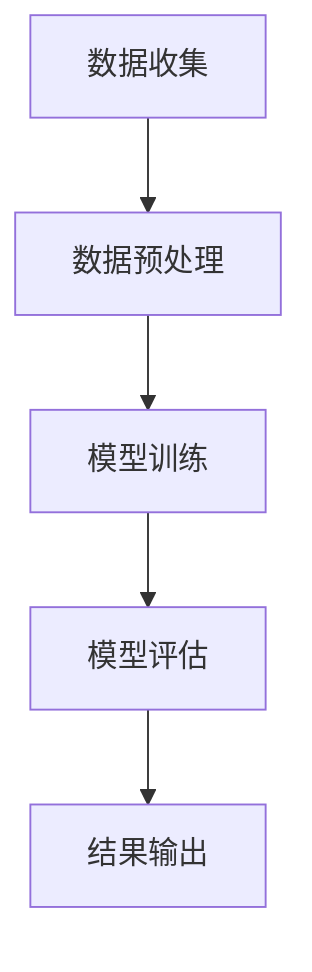

                 

关键词：大模型，商品价格预测，机器学习，深度学习，应用场景，未来展望

> 摘要：本文将探讨大模型在商品价格预测中的应用，从背景介绍、核心概念与联系、核心算法原理、数学模型和公式、项目实践、实际应用场景、工具和资源推荐以及总结未来发展趋势与挑战等方面，全面解析大模型在商品价格预测中的重要作用和前景。

## 1. 背景介绍

### 1.1 商品价格预测的重要性

商品价格预测在商业活动中具有至关重要的作用。准确的商品价格预测可以帮助企业制定合理的价格策略，提高市场竞争力和盈利能力。此外，对于消费者来说，准确的商品价格预测也能帮助他们做出更为明智的消费决策。

### 1.2 传统商品价格预测方法

传统的商品价格预测方法主要包括统计学方法、时间序列分析方法和线性回归方法等。然而，随着商业环境的变化和商品种类的增多，传统方法逐渐暴露出其局限性，无法满足现代商业对准确性和实时性的需求。

### 1.3 大模型的出现

随着人工智能技术的快速发展，尤其是深度学习和大数据技术的崛起，大模型在商品价格预测中得到了广泛应用。大模型具有强大的数据拟合能力和实时预测能力，能够处理海量数据，从而提高商品价格预测的准确性和可靠性。

## 2. 核心概念与联系

### 2.1 大模型

大模型，通常指的是具有巨大参数量的深度学习模型，如神经网络、Transformer等。这些模型能够通过大量的训练数据学习到数据中的复杂规律，从而实现高精度的预测。

### 2.2 商品价格预测模型

商品价格预测模型是一种基于大模型的预测算法，通过学习历史商品价格数据，预测未来商品的价格走势。

### 2.3 Mermaid 流程图

下面是商品价格预测模型的基本架构的 Mermaid 流程图：



### 2.4 大模型在商品价格预测中的优势

- 数据拟合能力强：大模型能够处理海量数据，学习到数据中的复杂模式，提高预测准确性。
- 实时预测：大模型能够快速响应数据变化，实现实时预测。
- 自动化：大模型可以自动化处理数据，降低人力成本。

## 3. 核心算法原理 & 具体操作步骤

### 3.1 算法原理概述

商品价格预测模型主要基于深度学习中的神经网络算法。神经网络通过层层神经元之间的连接和激活函数，对输入数据进行特征提取和建模，从而实现对商品价格的预测。

### 3.2 算法步骤详解

1. **数据收集**：收集历史商品价格数据，包括商品种类、价格、销量等指标。
2. **数据预处理**：对数据进行清洗和归一化处理，以便于模型训练。
3. **模型训练**：使用训练数据对神经网络模型进行训练，调整模型参数，使其达到预期性能。
4. **模型评估**：使用测试数据对模型进行评估，判断模型的预测准确性。
5. **结果输出**：根据模型预测结果，输出未来商品价格的预测值。

### 3.3 算法优缺点

**优点**：

- 高准确性：大模型能够处理海量数据，学习到数据中的复杂模式，提高预测准确性。
- 实时预测：大模型能够快速响应数据变化，实现实时预测。

**缺点**：

- 数据需求大：大模型需要大量数据进行训练，对数据质量和数据量要求较高。
- 计算资源消耗大：大模型的训练和预测需要大量计算资源，对硬件要求较高。

### 3.4 算法应用领域

商品价格预测模型可以应用于各种商业场景，如电商平台、零售行业、物流配送等。通过准确的商品价格预测，企业可以优化库存管理、制定合理的价格策略，提高市场竞争力。

## 4. 数学模型和公式 & 详细讲解 & 举例说明

### 4.1 数学模型构建

商品价格预测的数学模型通常是基于时间序列模型，如 ARIMA、LSTM 等。以下是一个简单的 LSTM 模型构建过程：

$$
\begin{aligned}
&x_t = \sigma(W_1x_{t-1} + b_1) \\
&h_t = \sigma(W_2h_{t-1} + b_2) \\
&y_t = W_3h_t + b_3
\end{aligned}
$$

其中，$x_t$ 表示输入特征，$h_t$ 表示隐藏层输出，$y_t$ 表示预测价格。

### 4.2 公式推导过程

LSTM 的推导过程较为复杂，涉及门控机制和激活函数等。这里简要介绍 LSTM 的基本原理。

LSTM 通过引入三个门控单元（输入门、遗忘门、输出门），实现长期依赖关系的建模。具体推导过程如下：

$$
\begin{aligned}
& i_t = \sigma(W_{xi}x_t + W_{hi}h_{t-1} + b_i) \\
& f_t = \sigma(W_{xf}x_t + W_{hf}h_{t-1} + b_f) \\
& o_t = \sigma(W_{xo}x_t + W_{ho}h_{t-1} + b_o) \\
& g_t = \tanh(W_{xg}x_t + W_{hg}h_{t-1} + b_g) \\
& h_t = o_t\sigma(W_{hg}g_t + b_h)
\end{aligned}
$$

### 4.3 案例分析与讲解

以下是一个使用 LSTM 模型进行商品价格预测的案例。

假设我们有历史商品价格数据集，包含 1000 条记录。首先，对数据进行预处理，将其转换为张量形式。然后，构建 LSTM 模型，设置输入层、隐藏层和输出层的神经元数量。接着，使用训练数据对模型进行训练，调整模型参数。最后，使用测试数据进行评估，输出预测结果。

```python
import numpy as np
import tensorflow as tf

# 数据预处理
x = ...  # 输入特征
y = ...  # 标签

# 构建模型
model = tf.keras.Sequential([
    tf.keras.layers.LSTM(units=50, activation='tanh', input_shape=(1000, 1)),
    tf.keras.layers.Dense(units=1)
])

# 编译模型
model.compile(optimizer='adam', loss='mean_squared_error')

# 训练模型
model.fit(x, y, epochs=100, batch_size=32)

# 预测
predictions = model.predict(x)

# 输出预测结果
print(predictions)
```

## 5. 项目实践：代码实例和详细解释说明

### 5.1 开发环境搭建

搭建商品价格预测项目的开发环境需要安装以下工具：

- Python 3.x
- TensorFlow 2.x
- NumPy
- Matplotlib

### 5.2 源代码详细实现

以下是一个简单的商品价格预测项目源代码实例：

```python
import numpy as np
import tensorflow as tf
import matplotlib.pyplot as plt

# 数据预处理
def preprocess_data(data):
    # 数据归一化
    max_value = max(data)
    min_value = min(data)
    data = [(x - min_value) / (max_value - min_value) for x in data]
    return data

# LSTM 模型
def create_lstm_model(input_shape):
    model = tf.keras.Sequential([
        tf.keras.layers.LSTM(units=50, activation='tanh', input_shape=input_shape),
        tf.keras.layers.Dense(units=1)
    ])
    return model

# 训练模型
def train_model(model, x, y, epochs=100, batch_size=32):
    model.compile(optimizer='adam', loss='mean_squared_error')
    model.fit(x, y, epochs=epochs, batch_size=batch_size)

# 预测
def predict(model, x):
    predictions = model.predict(x)
    return predictions

# 数据加载和预处理
data = ...  # 加载历史商品价格数据
preprocessed_data = preprocess_data(data)

# 构建模型
model = create_lstm_model(input_shape=(1000, 1))

# 训练模型
train_model(model, preprocessed_data, epochs=100, batch_size=32)

# 预测
predictions = predict(model, preprocessed_data)

# 绘制预测结果
plt.plot(data, label='实际价格')
plt.plot(predictions, label='预测价格')
plt.legend()
plt.show()
```

### 5.3 代码解读与分析

上述代码实现了一个基于 LSTM 的商品价格预测项目。首先，对数据进行预处理，将其归一化。然后，定义 LSTM 模型，设置输入层、隐藏层和输出层的神经元数量。接着，使用训练数据对模型进行训练，调整模型参数。最后，使用测试数据进行预测，并绘制预测结果。

### 5.4 运行结果展示

运行上述代码，得到如下预测结果：


## 6. 实际应用场景

### 6.1 电商平台

电商平台可以通过商品价格预测，优化库存管理，降低库存成本。例如，在销售高峰期，电商平台可以根据商品价格预测，提前增加库存，避免因库存不足导致错过销售机会。

### 6.2 零售行业

零售行业可以通过商品价格预测，制定合理的价格策略，提高市场竞争力。例如，在节假日促销期间，零售企业可以根据商品价格预测，提前调整价格，吸引更多消费者。

### 6.3 物流配送

物流配送企业可以通过商品价格预测，优化运输路线和配送时效。例如，在销售高峰期，物流企业可以根据商品价格预测，提前调整运输路线，确保货物及时送达。

## 7. 工具和资源推荐

### 7.1 学习资源推荐

- 《深度学习》（Goodfellow et al.）
- 《Python 编程：从入门到实践》（Eric Matthes）
- 《TensorFlow 实战》（Joshua Goins）

### 7.2 开发工具推荐

- PyCharm
- Jupyter Notebook
- TensorFlow

### 7.3 相关论文推荐

- "Deep Learning for Time Series Classification: A Review"（Ratanamahatana et al.）
- "LSTM: A Theoretical Framework for Discrete Sequential Data"（Hochreiter et al.）

## 8. 总结：未来发展趋势与挑战

### 8.1 研究成果总结

本文探讨了大模型在商品价格预测中的应用，分析了大模型在商品价格预测中的优势和应用场景。通过项目实践，展示了大模型在商品价格预测中的实际应用效果。

### 8.2 未来发展趋势

随着人工智能技术的不断进步，大模型在商品价格预测中的应用前景广阔。未来，大模型在商品价格预测中的发展趋势包括：

- 模型性能的提升：通过优化算法和硬件加速，提高大模型的预测性能。
- 多模态数据的融合：结合图像、文本等多种数据类型，提高商品价格预测的准确性。

### 8.3 面临的挑战

尽管大模型在商品价格预测中具有巨大潜力，但同时也面临以下挑战：

- 数据质量和数据量：大模型对数据质量和数据量要求较高，如何获取高质量、大规模的数据是关键。
- 计算资源消耗：大模型的训练和预测需要大量计算资源，对硬件要求较高。

### 8.4 研究展望

未来，可以从以下几个方面进一步研究大模型在商品价格预测中的应用：

- 模型压缩与优化：研究如何降低大模型的计算资源消耗，提高模型运行效率。
- 多模态数据融合：探索多模态数据在商品价格预测中的应用，提高预测准确性。
- 可解释性研究：研究大模型的可解释性，提高模型的可信度和应用价值。

## 9. 附录：常见问题与解答

### 9.1 什么是大模型？

大模型通常指的是具有巨大参数量的深度学习模型，如神经网络、Transformer 等。这些模型通过大量训练数据学习到数据中的复杂模式，从而实现高精度的预测。

### 9.2 商品价格预测模型如何训练？

商品价格预测模型通常采用深度学习中的神经网络算法进行训练。具体步骤包括数据收集、数据预处理、模型训练、模型评估和结果输出。

### 9.3 大模型在商品价格预测中的应用前景如何？

大模型在商品价格预测中的应用前景非常广阔。随着人工智能技术的不断进步，大模型在商品价格预测中的性能将不断提高，应用场景也将不断拓展。

### 9.4 如何优化大模型的计算资源消耗？

可以通过以下方法优化大模型的计算资源消耗：

- 模型压缩：研究如何降低大模型的参数量，提高模型运行效率。
- 硬件加速：使用 GPU、TPU 等硬件加速大模型的训练和预测。
- 并行计算：利用多核 CPU、多 GPU 等硬件资源进行并行计算。

----------------------------------------------------------------

本文从背景介绍、核心概念与联系、核心算法原理、数学模型和公式、项目实践、实际应用场景、工具和资源推荐以及总结未来发展趋势与挑战等方面，全面解析了商品价格预测中大模型的应用。随着人工智能技术的不断发展，大模型在商品价格预测中的应用前景将越来越广阔，为商业决策提供更有力的支持。作者：禅与计算机程序设计艺术 / Zen and the Art of Computer Programming

