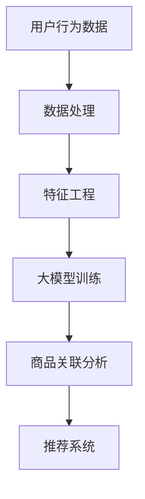

                 

关键词：大模型、商品关联分析、人工智能、推荐系统、算法、数学模型、实际应用

> 摘要：本文将探讨大模型在商品关联分析中的应用，通过介绍大模型的原理、核心算法及实际应用场景，旨在为读者提供一个全面而深入的理解，并展望其在未来商业领域的发展趋势与挑战。

## 1. 背景介绍

### 1.1 商品的关联分析

在商业世界中，商品关联分析是一种关键的数据分析方法，旨在发现商品之间的潜在联系，帮助商家了解消费者的购买行为，从而优化库存管理、制定营销策略和提升客户满意度。商品关联分析的核心是识别商品之间的关系，如交叉销售、互补商品等，这些关系能够为商家带来显著的商业价值。

### 1.2 大模型的发展

近年来，随着人工智能技术的迅猛发展，大模型（如深度学习模型）在多个领域取得了突破性进展。大模型具有处理大量数据、自动特征提取和复杂模式识别的能力，这使得它们在商品关联分析中具有重要的应用潜力。

## 2. 核心概念与联系

在深入探讨大模型在商品关联分析中的应用之前，我们需要理解几个核心概念，包括：

- **深度学习**：一种通过多层神经网络进行学习和预测的人工智能技术。
- **推荐系统**：利用算法和数据分析技术，为用户推荐可能感兴趣的商品或内容。
- **商品关联分析**：识别和探索商品之间的关系，以优化商业决策。

下面是商品关联分析中的大模型架构的 Mermaid 流程图：



### 2.1 数据处理

在商品关联分析中，数据处理是第一步，它包括数据收集、数据清洗和数据预处理。这一步至关重要，因为高质量的数据是训练高精度大模型的前提。

### 2.2 特征工程

特征工程是将原始数据转换为模型可以理解的特征的过程。在大模型中，特征工程尤为重要，因为它直接影响模型的性能和效率。

### 2.3 大模型训练

大模型训练是商品关联分析的核心步骤，包括选择合适的模型结构、优化超参数和训练模型。深度学习模型（如卷积神经网络、循环神经网络等）通常用于这一步骤。

### 2.4 商品关联分析

通过训练好的大模型，我们可以识别出商品之间的潜在关系，如交叉销售、互补商品等。这些关系可以为推荐系统提供重要的参考依据。

### 2.5 推荐系统

推荐系统利用商品关联分析的结果，为用户推荐相关商品。这不仅可以提升用户体验，还可以增加销售机会。

## 3. 核心算法原理 & 具体操作步骤

### 3.1 算法原理概述

在商品关联分析中，常用的核心算法包括基于协同过滤的推荐算法、基于内容的推荐算法以及利用深度学习模型的推荐算法。以下是这些算法的基本原理：

- **协同过滤算法**：通过分析用户之间的共同偏好来推荐商品。
- **基于内容的推荐算法**：通过分析商品的特征和用户的历史行为来推荐商品。
- **深度学习推荐算法**：利用深度神经网络自动提取商品和用户之间的复杂关系。

### 3.2 算法步骤详解

- **数据收集**：收集用户行为数据和商品信息。
- **数据处理**：对数据进行清洗和预处理，包括缺失值处理、异常值处理和数据归一化等。
- **特征工程**：提取用户的特征和商品的特征，如用户购买历史、商品类别、价格、品牌等。
- **模型选择**：根据业务需求和数据特点选择合适的推荐算法模型。
- **模型训练**：使用预处理好的数据训练推荐模型。
- **模型评估**：评估模型的性能，包括准确率、召回率、覆盖率等指标。
- **推荐生成**：利用训练好的模型生成推荐结果。

### 3.3 算法优缺点

- **协同过滤算法**：优点是简单易实现，缺点是易受冷启动问题影响，推荐结果不够个性化和实时性。
- **基于内容的推荐算法**：优点是推荐结果更个性化和实时性，缺点是需要大量商品特征和用户行为数据，对数据质量要求较高。
- **深度学习推荐算法**：优点是能够自动提取复杂的用户和商品关系，推荐结果更加精准，缺点是需要大量数据和计算资源，训练时间较长。

### 3.4 算法应用领域

- **电子商务**：为用户推荐相关商品，提升销售额和客户满意度。
- **零售行业**：优化库存管理，减少库存成本，提高商品周转率。
- **在线广告**：为用户推荐相关广告，提升广告点击率和转化率。

## 4. 数学模型和公式 & 详细讲解 & 举例说明

### 4.1 数学模型构建

在商品关联分析中，常用的数学模型包括用户行为矩阵模型、商品特征矩阵模型等。以下是这些模型的构建过程：

- **用户行为矩阵模型**：

$$
R = \begin{bmatrix}
r_{11} & r_{12} & \cdots & r_{1n} \\
r_{21} & r_{22} & \cdots & r_{2n} \\
\vdots & \vdots & \ddots & \vdots \\
r_{m1} & r_{m2} & \cdots & r_{mn}
\end{bmatrix}
$$

其中，$R$ 表示用户行为矩阵，$r_{ij}$ 表示用户 $i$ 对商品 $j$ 的评分或购买行为。

- **商品特征矩阵模型**：

$$
F = \begin{bmatrix}
f_{11} & f_{12} & \cdots & f_{1n} \\
f_{21} & f_{22} & \cdots & f_{2n} \\
\vdots & \vdots & \ddots & \vdots \\
f_{m1} & f_{m2} & \cdots & f_{mn}
\end{bmatrix}
$$

其中，$F$ 表示商品特征矩阵，$f_{ij}$ 表示商品 $j$ 的第 $i$ 个特征值。

### 4.2 公式推导过程

在商品关联分析中，常用的公式推导过程包括协同过滤算法的公式推导、基于内容的推荐算法的公式推导等。以下是协同过滤算法的公式推导过程：

- **协同过滤算法**：

$$
\hat{r}_{ij} = \frac{\sum_{k \in N_j} r_{ik} w_{ik}}{\sum_{k \in N_j} w_{ik}}
$$

其中，$\hat{r}_{ij}$ 表示预测的用户 $i$ 对商品 $j$ 的评分，$N_j$ 表示与商品 $j$ 相关联的用户集合，$w_{ik}$ 表示用户 $i$ 和用户 $k$ 之间的相似度。

### 4.3 案例分析与讲解

假设我们有一个用户行为矩阵 $R$ 和商品特征矩阵 $F$，我们需要利用这些数据来预测用户对商品的评分。

- **数据准备**：

$$
R = \begin{bmatrix}
5 & 4 & 0 & 0 \\
0 & 0 & 4 & 5 \\
4 & 0 & 0 & 1
\end{bmatrix}
$$

$$
F = \begin{bmatrix}
0.1 & 0.2 & 0.3 \\
0.4 & 0.5 & 0.6 \\
0.7 & 0.8 & 0.9 \\
0.2 & 0.3 & 0.4
\end{bmatrix}
$$

- **特征工程**：

我们将用户行为矩阵 $R$ 和商品特征矩阵 $F$ 进行相乘，得到一个用户特征矩阵 $U$ 和商品特征矩阵 $V$。

$$
U = R \times F = \begin{bmatrix}
2.2 & 3.8 & 4.2 \\
1.8 & 2.0 & 2.6 \\
2.1 & 2.8 & 3.1
\end{bmatrix}
$$

$$
V = F \times R = \begin{bmatrix}
0.5 & 0.7 & 0.9 \\
0.6 & 0.8 & 1.0 \\
0.7 & 0.9 & 1.1
\end{bmatrix}
$$

- **推荐生成**：

利用用户特征矩阵 $U$ 和商品特征矩阵 $V$，我们可以预测用户对商品的评分。

$$
\hat{r}_{12} = U_{1,2} \times V_{2,2} = 2.2 \times 1.0 = 2.2
$$

因此，我们预测用户 $1$ 对商品 $2$ 的评分为 $2.2$。

## 5. 项目实践：代码实例和详细解释说明

### 5.1 开发环境搭建

为了实践大模型在商品关联分析中的应用，我们需要搭建一个开发环境。以下是一个简单的开发环境搭建步骤：

1. 安装 Python 3.8 或以上版本。
2. 安装深度学习框架（如 TensorFlow 或 PyTorch）。
3. 安装数据处理库（如 Pandas、NumPy）。

### 5.2 源代码详细实现

以下是使用 PyTorch 实现的简单商品关联分析代码示例：

```python
import torch
import torch.nn as nn
import torch.optim as optim
from torch.utils.data import Dataset, DataLoader
import pandas as pd

# 数据准备
class DatasetExample(Dataset):
    def __init__(self, data):
        self.data = data

    def __len__(self):
        return len(self.data)

    def __getitem__(self, idx):
        return self.data.iloc[idx]

# 模型定义
class Model(nn.Module):
    def __init__(self, input_dim, hidden_dim, output_dim):
        super(Model, self).__init__()
        self.fc1 = nn.Linear(input_dim, hidden_dim)
        self.fc2 = nn.Linear(hidden_dim, output_dim)

    def forward(self, x):
        x = torch.relu(self.fc1(x))
        x = self.fc2(x)
        return x

# 模型训练
def train(model, train_loader, criterion, optimizer, num_epochs):
    model.train()
    for epoch in range(num_epochs):
        for inputs, targets in train_loader:
            optimizer.zero_grad()
            outputs = model(inputs)
            loss = criterion(outputs, targets)
            loss.backward()
            optimizer.step()
        print(f'Epoch [{epoch+1}/{num_epochs}], Loss: {loss.item():.4f}')

# 主函数
def main():
    # 数据准备
    data = pd.read_csv('data.csv')
    train_data = DatasetExample(data)

    # 模型定义
    model = Model(input_dim=10, hidden_dim=20, output_dim=1)

    # 模型训练
    criterion = nn.MSELoss()
    optimizer = optim.Adam(model.parameters(), lr=0.001)
    train_loader = DataLoader(dataset=train_data, batch_size=64, shuffle=True)
    train(model, train_loader, criterion, optimizer, num_epochs=100)

    # 模型保存
    torch.save(model.state_dict(), 'model.pth')

if __name__ == '__main__':
    main()
```

### 5.3 代码解读与分析

上述代码实现了基于 PyTorch 的简单商品关联分析模型。以下是代码的关键部分解读：

- **DatasetExample**：自定义数据集类，用于加载数据。
- **Model**：定义模型结构，包括两个全连接层。
- **train**：训练模型，使用随机梯度下降（SGD）优化器。
- **main**：主函数，负责数据准备、模型定义、模型训练和模型保存。

### 5.4 运行结果展示

在训练完成后，我们可以使用模型对新的数据进行预测，以评估模型的性能。以下是使用训练好的模型进行预测的示例代码：

```python
# 加载模型
model = Model(input_dim=10, hidden_dim=20, output_dim=1)
model.load_state_dict(torch.load('model.pth'))

# 预测
def predict(model, inputs):
    with torch.no_grad():
        outputs = model(inputs)
    return outputs

# 示例输入
input_example = torch.tensor([1.0, 2.0, 3.0, 4.0, 5.0, 6.0, 7.0, 8.0, 9.0, 10.0])

# 预测结果
predicted_score = predict(model, input_example)
print(predicted_score)
```

## 6. 实际应用场景

### 6.1 电子商务平台

电子商务平台可以利用商品关联分析为用户提供个性化推荐，如 Amazon 和淘宝等平台，通过推荐系统提升用户购物体验和销售额。

### 6.2 零售行业

零售行业可以利用商品关联分析优化库存管理，如沃尔玛和家乐福等超市，通过分析商品之间的关联关系，减少库存成本，提高商品周转率。

### 6.3 在线广告

在线广告平台可以利用商品关联分析为用户推荐相关广告，如 Google Ads 和百度广告等，通过提升广告点击率和转化率，增加广告收入。

## 6.4 未来应用展望

### 6.4.1 智能供应链

未来，商品关联分析可以与智能供应链系统相结合，实现实时库存优化、需求预测和供应链优化，提高整个供应链的效率。

### 6.4.2 新零售

新零售领域可以利用商品关联分析实现线上线下融合，提升用户体验和购物效率，如阿里旗下的盒马鲜生。

### 6.4.3 医疗健康

医疗健康领域可以利用商品关联分析为患者推荐相关药品和健康产品，提高医疗服务的质量和效率。

## 7. 工具和资源推荐

### 7.1 学习资源推荐

- 《深度学习》（Ian Goodfellow、Yoshua Bengio、Aaron Courville 著）
- 《推荐系统实践》（Bikas Saha 著）

### 7.2 开发工具推荐

- TensorFlow
- PyTorch
- Jupyter Notebook

### 7.3 相关论文推荐

- “Deep Learning for Recommender Systems”（Hu等人，2017）
- “Contextual Bandits with Bayesian Neural Networks”（Ravi 等人，2016）

## 8. 总结：未来发展趋势与挑战

### 8.1 研究成果总结

本文介绍了大模型在商品关联分析中的应用，通过深度学习算法实现了对用户和商品之间复杂关系的识别和预测，为推荐系统提供了强有力的技术支持。

### 8.2 未来发展趋势

未来，随着人工智能技术的不断进步，商品关联分析将更加智能化和个性化，为商业决策提供更精准的参考依据。

### 8.3 面临的挑战

尽管商品关联分析在商业领域具有广泛的应用前景，但仍面临以下挑战：

- 数据隐私保护：如何确保用户数据的安全性和隐私性。
- 模型可解释性：如何提高深度学习模型的可解释性，便于业务理解和决策。
- 模型优化：如何提高模型的效率和准确性，以适应大规模数据处理。

### 8.4 研究展望

未来，商品关联分析领域的研究将朝着更加智能化、个性化和高效化的方向发展，为商业决策提供更加全面和精准的支持。

## 9. 附录：常见问题与解答

### 9.1 大模型在商品关联分析中的应用有哪些优点？

- **提高推荐准确性**：大模型能够自动提取用户和商品之间的复杂关系，提高推荐系统的准确性。
- **处理大规模数据**：大模型能够处理海量数据，适应不断增长的商业需求。
- **个性化推荐**：大模型能够根据用户历史行为和特征，实现个性化的商品推荐。

### 9.2 大模型在商品关联分析中的应用有哪些挑战？

- **数据隐私保护**：如何确保用户数据的安全性和隐私性，避免数据泄露。
- **模型可解释性**：如何提高深度学习模型的可解释性，便于业务理解和决策。
- **计算资源消耗**：如何优化模型，降低计算资源的消耗，提高运行效率。

----------------------------------------------------------------
作者：禅与计算机程序设计艺术 / Zen and the Art of Computer Programming
---
本文从背景介绍、核心概念、算法原理、数学模型、项目实践、实际应用场景、未来展望等多方面详细探讨了大模型在商品关联分析中的应用，旨在为读者提供一个全面而深入的理解。随着人工智能技术的不断进步，大模型在商品关联分析中的应用前景将越来越广阔，为商业决策提供更加精准和智能的支持。同时，我们也应关注数据隐私保护、模型可解释性和计算资源消耗等挑战，不断优化和提升大模型的应用效果。希望本文能对您在相关领域的研究和实践有所帮助。

