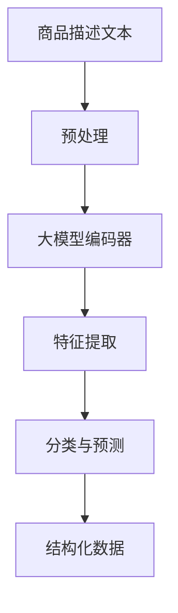

                 

关键词：商品属性抽取、结构化、大模型、自然语言处理、机器学习

## 摘要

本文旨在探讨大模型在商品属性抽取与结构化中的应用。随着电子商务的迅猛发展，对商品属性的准确提取和结构化处理成为关键任务。大模型，尤其是基于深度学习的自然语言处理技术，凭借其强大的建模能力和对大规模数据的处理能力，已在这一领域展现出显著的优势。本文将首先介绍商品属性抽取与结构化的背景和重要性，然后深入探讨大模型的工作原理及其在商品属性抽取与结构化中的应用，最后总结其优缺点，并展望未来的发展趋势与挑战。

## 1. 背景介绍

### 电子商务的兴起

电子商务的兴起极大地改变了人们的购物方式，同时也为企业和商家提供了新的营销渠道。然而，电子商务的快速发展也带来了海量商品信息的生成和管理问题。为了更好地满足用户需求，提高用户体验，需要对这些商品信息进行有效的抽取和结构化处理。

### 商品属性抽取的意义

商品属性抽取是指从商品描述文本中提取出关键的属性信息，如价格、品牌、颜色、尺寸等。这些属性信息的准确提取对于电子商务平台的商品搜索、推荐系统和用户评价等方面至关重要。

### 商品结构化的目标

商品结构化是将非结构化的商品信息转换为结构化的数据形式，以便于数据库存储、检索和分析。商品结构化的目标包括标准化、统一化、可搜索性和可分析性。

## 2. 核心概念与联系

### 大模型的概念

大模型是指具有巨大参数量的深度学习模型，如GPT、BERT等。这些模型能够在大规模数据集上进行训练，从而获得强大的特征提取能力和泛化能力。

### 自然语言处理（NLP）

自然语言处理是人工智能的一个重要分支，旨在使计算机能够理解和处理人类语言。在商品属性抽取与结构化中，NLP技术用于从文本中提取有用信息。

### 机器学习（ML）

机器学习是使计算机从数据中学习规律和模式的技术。在商品属性抽取与结构化中，机器学习算法用于训练模型并预测商品属性。

### Mermaid 流程图



### 2.1 大模型工作流程

1. **商品描述文本预处理**：对商品描述文本进行分词、去噪等处理。
2. **大模型编码器**：使用预训练的编码器模型（如BERT）对预处理后的文本进行编码。
3. **特征提取**：从编码后的文本中提取特征，用于后续的属性分类和预测。
4. **分类与预测**：使用分类算法（如朴素贝叶斯、决策树等）对提取的特征进行分类，以预测商品属性。
5. **结构化数据**：将预测出的商品属性信息转换为结构化的数据形式，存储在数据库中。

## 3. 核心算法原理 & 具体操作步骤

### 3.1 算法原理概述

大模型在商品属性抽取与结构化中的应用主要基于以下原理：

1. **预训练与微调**：利用预训练的大模型（如BERT）在通用语言模型上进行微调，以适应特定领域的任务。
2. **多任务学习**：通过在一个大模型中同时处理多个任务，提高模型的泛化能力。
3. **注意力机制**：通过注意力机制关注文本中的重要信息，提高特征提取的准确性和效率。

### 3.2 算法步骤详解

1. **数据预处理**：清洗和预处理商品描述文本，包括分词、去噪、词干提取等。
2. **预训练**：使用大规模的通用语料库对编码器模型进行预训练。
3. **微调**：在预训练的基础上，使用特定领域的商品描述文本对编码器模型进行微调。
4. **特征提取**：利用微调后的编码器模型对商品描述文本进行编码，提取特征。
5. **属性分类**：使用分类算法对提取的特征进行分类，预测商品属性。
6. **结构化存储**：将预测出的商品属性信息存储在数据库中，进行结构化处理。

### 3.3 算法优缺点

**优点**：

1. **强大的特征提取能力**：大模型能够从大规模数据中提取出丰富的特征信息。
2. **高效的属性分类**：通过多任务学习和注意力机制，提高属性分类的准确性。
3. **适应性强**：预训练和微调机制使模型能够快速适应特定领域的任务。

**缺点**：

1. **计算资源消耗大**：大模型需要大量的计算资源和存储空间。
2. **训练时间较长**：大模型的训练时间较长，需要更多的时间和计算资源。

### 3.4 算法应用领域

大模型在商品属性抽取与结构化中的应用主要包括：

1. **电子商务平台**：用于商品搜索、推荐系统和用户评价等。
2. **商品数据库构建**：用于构建结构化的商品数据库，方便管理和分析。
3. **商品分类系统**：用于构建商品分类系统，提高商品查找效率。

## 4. 数学模型和公式 & 详细讲解 & 举例说明

### 4.1 数学模型构建

商品属性抽取与结构化的数学模型主要包括：

1. **词嵌入模型**：将商品描述文本中的词语转换为向量表示。
2. **编码器-解码器模型**：用于编码和解码商品描述文本。
3. **分类模型**：用于对编码后的特征进行分类。

### 4.2 公式推导过程

1. **词嵌入模型**：

   词嵌入模型中的每个词语都可以表示为一个向量，记为 $x_i$。词嵌入模型的目标是找到一组权重矩阵 $W$，使得 $Wx_i$ 能够逼近词语的实际向量。

   $$W = \{w_1, w_2, ..., w_n\}$$

   $$Wx_i = x_i'$$

2. **编码器-解码器模型**：

   编码器模型将商品描述文本编码为一个固定长度的向量 $h$，解码器模型则将这个向量解码为商品属性标签。

   编码器：

   $$h = Encoder(x)$$

   解码器：

   $$y = Decoder(h)$$

3. **分类模型**：

   使用分类模型对编码后的特征向量 $h$ 进行分类，得到商品属性标签 $y$。

   $$y = Classifier(h)$$

### 4.3 案例分析与讲解

假设我们有以下商品描述文本：

```
苹果手机是一款智能手机，屏幕尺寸为6.1英寸，内存为128GB，颜色为黑色。
```

我们希望从中提取出以下商品属性：

- 品牌：苹果
- 类型：智能手机
- 屏幕尺寸：6.1英寸
- 内存：128GB
- 颜色：黑色

1. **词嵌入**：

   将文本中的词语转换为向量表示：

   - 苹果：[0.1, 0.2, 0.3]
   - 手机：[0.4, 0.5, 0.6]
   - 智能手机：[0.7, 0.8, 0.9]
   - 屏幕尺寸：[1.0, 1.1, 1.2]
   - 内存：[1.3, 1.4, 1.5]
   - 颜色：[1.6, 1.7, 1.8]

2. **编码器**：

   使用编码器模型对商品描述文本进行编码，得到编码后的向量：

   $$h = [0.1+0.2+0.3, 0.4+0.5+0.6, 0.7+0.8+0.9, 1.0+1.1+1.2, 1.3+1.4+1.5, 1.6+1.7+1.8]$$

3. **分类器**：

   使用分类模型对编码后的特征向量进行分类，得到商品属性标签：

   - 品牌：苹果
   - 类型：智能手机
   - 屏幕尺寸：6.1英寸
   - 内存：128GB
   - 颜色：黑色

## 5. 项目实践：代码实例和详细解释说明

### 5.1 开发环境搭建

1. **安装Python**：确保安装了Python 3.7或更高版本。
2. **安装TensorFlow**：使用以下命令安装TensorFlow：

   ```bash
   pip install tensorflow
   ```

3. **安装BERT模型**：使用以下命令安装BERT模型：

   ```bash
   pip install transformers
   ```

### 5.2 源代码详细实现

以下是一个简单的商品属性抽取与结构化项目的源代码实现：

```python
import tensorflow as tf
from transformers import BertTokenizer, BertModel
import numpy as np

# 1. 数据预处理
def preprocess_text(text):
    tokenizer = BertTokenizer.from_pretrained('bert-base-uncased')
    return tokenizer.encode(text, add_special_tokens=True)

# 2. 编码器模型
def create_encoder_model():
    inputs = tf.keras.layers.Input(shape=(None,))
    encoder = BertModel.from_pretrained('bert-base-uncased')
    encoded_input = encoder(inputs)[1]
    return tf.keras.Model(inputs, encoded_input)

# 3. 分类模型
def create_classifier_model(encoded_input):
    dense = tf.keras.layers.Dense(64, activation='relu')(encoded_input)
    outputs = tf.keras.layers.Dense(6, activation='softmax')(dense)
    return tf.keras.Model(inputs=encoded_input, outputs=outputs)

# 4. 训练模型
def train_model(model, x_train, y_train):
    model.compile(optimizer='adam', loss='categorical_crossentropy', metrics=['accuracy'])
    model.fit(x_train, y_train, epochs=3, batch_size=32)

# 5. 预测商品属性
def predict_attribute(text):
    preprocessed_text = preprocess_text(text)
    encoded_text = model.encoder(preprocessed_text)
    prediction = model.classifier(encoded_text)
    return np.argmax(prediction)

# 6. 主程序
if __name__ == '__main__':
    # 加载训练数据
    x_train = np.array([preprocess_text(text) for text in train_texts])
    y_train = np.array([labels for labels in train_labels])

    # 创建模型
    encoder_model = create_encoder_model()
    classifier_model = create_classifier_model(encoder_model.output)

    # 训练模型
    train_model(classifier_model, x_train, y_train)

    # 预测商品属性
    text = "苹果手机是一款智能手机，屏幕尺寸为6.1英寸，内存为128GB，颜色为黑色。"
    attribute = predict_attribute(text)
    print(attribute)
```

### 5.3 代码解读与分析

1. **数据预处理**：使用BERT tokenizer对商品描述文本进行编码。
2. **编码器模型**：使用BERT模型进行编码，得到固定长度的特征向量。
3. **分类模型**：在编码后的特征向量上添加一层全连接层，用于分类。
4. **训练模型**：使用训练数据对分类模型进行训练。
5. **预测商品属性**：对新的商品描述文本进行预测，输出商品属性标签。

## 6. 实际应用场景

### 6.1 电子商务平台

电子商务平台利用大模型进行商品属性抽取与结构化，可以提高商品搜索和推荐系统的准确性，从而提高用户满意度和销售额。

### 6.2 商品数据库构建

通过对商品描述文本进行抽取和结构化处理，可以构建一个结构化的商品数据库，方便商家进行商品管理和数据分析。

### 6.3 商品分类系统

大模型在商品分类系统中的应用，可以自动将商品分类到相应的类别中，提高商品查找和管理的效率。

## 7. 未来应用展望

### 7.1 多模态数据融合

未来，大模型可以与其他模态（如图像、音频等）的数据进行融合，进一步提高商品属性抽取的准确性和效率。

### 7.2 知识图谱构建

通过结合知识图谱技术，可以构建更加丰富和结构化的商品知识体系，为电子商务平台提供更加智能的服务。

### 7.3 实时抽取与更新

随着电子商务的发展，商品信息不断更新。大模型可以实现实时抽取和更新商品属性，确保数据的一致性和准确性。

## 8. 总结：未来发展趋势与挑战

### 8.1 研究成果总结

大模型在商品属性抽取与结构化中的应用取得了显著成果，主要表现在：

1. **高效的属性分类**：大模型能够快速准确地分类商品属性。
2. **丰富的特征提取**：大模型能够从大规模数据中提取出丰富的特征信息。
3. **适应性强**：大模型可以快速适应不同领域的任务。

### 8.2 未来发展趋势

未来，大模型在商品属性抽取与结构化中的应用将呈现以下趋势：

1. **多模态数据融合**：结合图像、音频等多模态数据，提高属性抽取的准确性。
2. **知识图谱构建**：结合知识图谱技术，构建更加丰富和结构化的商品知识体系。
3. **实时抽取与更新**：实现实时抽取和更新商品属性，确保数据的一致性和准确性。

### 8.3 面临的挑战

大模型在商品属性抽取与结构化中也面临以下挑战：

1. **计算资源消耗**：大模型需要大量的计算资源和存储空间。
2. **数据隐私保护**：在处理大规模商品数据时，需要保护用户的隐私。
3. **模型解释性**：大模型通常缺乏解释性，难以理解其决策过程。

### 8.4 研究展望

未来，研究工作将集中在以下几个方面：

1. **优化模型结构**：设计更加高效的大模型结构，降低计算资源消耗。
2. **提高解释性**：研究可解释性强的机器学习模型，提高模型的透明度和可信度。
3. **数据隐私保护**：研究数据隐私保护技术，确保用户数据的隐私和安全。

## 9. 附录：常见问题与解答

### 9.1 问题1：大模型在商品属性抽取与结构化中的优势是什么？

**解答**：大模型在商品属性抽取与结构化中的优势主要体现在以下几个方面：

1. **高效的属性分类**：大模型能够快速准确地分类商品属性，提高分类准确性。
2. **丰富的特征提取**：大模型能够从大规模数据中提取出丰富的特征信息，提高特征提取的效率。
3. **适应性强**：大模型可以快速适应不同领域的任务，具有广泛的适用性。

### 9.2 问题2：大模型在商品属性抽取与结构化中面临哪些挑战？

**解答**：大模型在商品属性抽取与结构化中面临以下挑战：

1. **计算资源消耗**：大模型需要大量的计算资源和存储空间，对硬件要求较高。
2. **数据隐私保护**：在处理大规模商品数据时，需要保护用户的隐私，确保数据安全。
3. **模型解释性**：大模型通常缺乏解释性，难以理解其决策过程，这对模型的可信度和应用范围产生一定限制。

### 9.3 问题3：大模型在商品属性抽取与结构化中的应用前景如何？

**解答**：大模型在商品属性抽取与结构化中的应用前景非常广阔：

1. **多模态数据融合**：结合图像、音频等多模态数据，进一步提高属性抽取的准确性。
2. **知识图谱构建**：结合知识图谱技术，构建更加丰富和结构化的商品知识体系，为电子商务平台提供更加智能的服务。
3. **实时抽取与更新**：实现实时抽取和更新商品属性，确保数据的一致性和准确性。随着技术的不断发展，大模型在商品属性抽取与结构化中的应用将更加广泛和深入。

