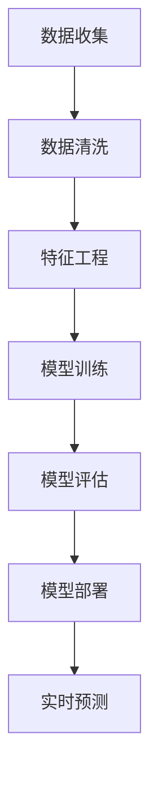

                 

关键词：大模型，商品属性预测，深度学习，自然语言处理，数据驱动方法

摘要：本文深入探讨了大模型在商品属性预测领域的应用。通过分析大模型的核心技术和原理，结合具体的数学模型和算法，本文展示了大模型在商品属性预测中的优势和应用场景，并提出了未来研究的方向和挑战。

## 1. 背景介绍

商品属性预测是电子商务和零售行业中的一个重要研究领域。准确预测商品属性有助于优化库存管理、提升用户体验和增加销售额。传统的商品属性预测方法主要依赖于规则和统计方法，如朴素贝叶斯、逻辑回归和支持向量机等。然而，这些方法往往存在准确性和泛化能力不足的问题。

近年来，深度学习技术的发展为商品属性预测带来了新的机遇。深度学习模型，如卷积神经网络（CNN）、循环神经网络（RNN）和Transformer等，通过学习大量数据中的复杂特征，能够显著提高预测的准确性和泛化能力。特别是大模型的出现，使得深度学习在商品属性预测中的应用更加广泛和有效。

本文旨在探讨大模型在商品属性预测中的应用，分析其核心技术和原理，并讨论其在实际项目中的实践和效果。

## 2. 核心概念与联系

### 2.1 大模型的概念

大模型是指具有数十亿到数千亿参数的深度学习模型。与传统的中小型模型相比，大模型具有更强的表示能力和计算能力，能够处理更加复杂的任务和数据集。

大模型的训练通常需要大量的计算资源和时间。然而，随着硬件技术的发展和分布式计算的应用，大模型的训练和部署已经变得越来越可行。

### 2.2 商品属性预测的核心概念

商品属性预测涉及以下核心概念：

- **属性**：商品的特征或属性，如颜色、尺寸、材质等。
- **预测任务**：根据输入的特征，预测商品的某个或多个属性。
- **特征工程**：将原始数据转换为适合模型训练的特征表示。
- **模型训练**：使用训练数据集训练深度学习模型。
- **模型评估**：使用验证数据集评估模型的性能。
- **模型部署**：将训练好的模型部署到生产环境中进行实际预测。

### 2.3 大模型与商品属性预测的联系

大模型与商品属性预测之间的联系主要体现在以下几个方面：

- **特征提取**：大模型能够自动提取原始数据中的高维特征，减少特征工程的工作量。
- **模型泛化**：大模型通过学习大量的数据，能够提高模型的泛化能力，减少过拟合的风险。
- **处理复杂关系**：大模型能够处理商品属性之间的复杂关系，如因果关系、关联关系等。
- **实时预测**：大模型训练速度快，能够实现实时预测，满足电子商务和零售行业的实时性要求。

### 2.4 Mermaid 流程图

以下是一个简单的Mermaid流程图，展示了大模型在商品属性预测中的流程：



## 3. 核心算法原理 & 具体操作步骤

### 3.1 算法原理概述

商品属性预测的大模型通常基于深度学习技术，如Transformer和BERT等。这些模型通过多层神经网络结构，学习输入数据的表示，并预测输出属性。

大模型的核心算法原理包括以下几个方面：

- **自注意力机制**：自注意力机制允许模型在处理输入数据时，对不同的数据点赋予不同的权重，从而更好地捕捉数据之间的复杂关系。
- **多头注意力**：多头注意力通过将输入数据分成多个子序列，并分别计算注意力权重，提高模型的表示能力。
- **编码器-解码器结构**：编码器-解码器结构用于处理序列数据，能够有效捕捉序列中的时序关系。

### 3.2 算法步骤详解

以下是商品属性预测大模型的算法步骤：

1. **数据收集**：收集包含商品属性的数据集，如商品描述、用户评论、商品图片等。
2. **数据清洗**：去除数据中的噪声和缺失值，对数据进行归一化处理。
3. **特征工程**：将原始数据转换为适合模型训练的特征表示，如词向量、图像特征等。
4. **模型训练**：使用训练数据集训练深度学习模型，通过反向传播和优化算法调整模型参数。
5. **模型评估**：使用验证数据集评估模型的性能，包括准确率、召回率、F1值等指标。
6. **模型部署**：将训练好的模型部署到生产环境中，进行实时预测。

### 3.3 算法优缺点

**优点**：

- **高准确率**：大模型能够自动提取数据中的复杂特征，提高预测的准确率。
- **强泛化能力**：大模型通过学习大量数据，能够减少过拟合的风险，提高模型的泛化能力。
- **处理复杂关系**：大模型能够捕捉商品属性之间的复杂关系，如因果关系、关联关系等。

**缺点**：

- **计算资源需求大**：大模型的训练和推理需要大量的计算资源和时间。
- **数据依赖性高**：大模型的性能很大程度上依赖于训练数据的质量和数量，对数据质量和多样性的要求较高。

### 3.4 算法应用领域

大模型在商品属性预测中的应用领域广泛，包括：

- **电子商务**：用于预测商品属性，优化推荐系统和广告投放。
- **零售行业**：用于库存管理和商品分类，提升用户体验和销售额。
- **制造业**：用于产品质量检测和故障预测，提高生产效率和产品质量。

## 4. 数学模型和公式 & 详细讲解 & 举例说明

### 4.1 数学模型构建

商品属性预测的大模型通常基于深度学习技术，如Transformer和BERT等。以下是一个简化的数学模型构建过程：

1. **输入表示**：将输入数据（如商品描述、用户评论、商品图片等）转换为向量表示。
2. **编码器**：使用编码器（Encoder）对输入向量进行编码，得到编码后的序列表示。
3. **解码器**：使用解码器（Decoder）对编码后的序列表示进行解码，预测输出属性。
4. **损失函数**：使用损失函数（如交叉熵损失函数）计算预测结果与真实标签之间的差距，并优化模型参数。

### 4.2 公式推导过程

以下是商品属性预测大模型的简化公式推导过程：

1. **输入表示**：

   $$ X = [x_1, x_2, ..., x_n] $$

   其中，$X$表示输入数据，$x_i$表示输入数据中的第$i$个样本。

2. **编码器**：

   $$ C = Encoder(X) $$

   其中，$C$表示编码后的序列表示。

3. **解码器**：

   $$ Y = Decoder(C) $$

   其中，$Y$表示预测的输出属性。

4. **损失函数**：

   $$ L = Loss(Y, T) $$

   其中，$Y$表示预测结果，$T$表示真实标签，$L$表示损失函数。

### 4.3 案例分析与讲解

假设我们有一个商品描述数据集，其中包含商品的名称、描述、用户评论等特征。我们的目标是预测商品的属性，如颜色、尺寸、材质等。

1. **数据收集**：

   收集包含商品描述、用户评论等数据的商品数据集。

2. **数据清洗**：

   去除数据中的噪声和缺失值，对数据进行归一化处理。

3. **特征工程**：

   将商品描述和用户评论转换为词向量表示，将商品图片转换为图像特征表示。

4. **模型训练**：

   使用训练数据集训练Transformer模型，通过反向传播和优化算法调整模型参数。

5. **模型评估**：

   使用验证数据集评估模型的性能，计算准确率、召回率、F1值等指标。

6. **模型部署**：

   将训练好的模型部署到生产环境中，进行实时预测。

通过上述案例，我们可以看到，商品属性预测的大模型在数据处理、模型训练和预测等方面具有明显的优势。在实际应用中，我们可以根据具体的业务需求和数据特点，选择合适的大模型进行商品属性预测。

## 5. 项目实践：代码实例和详细解释说明

### 5.1 开发环境搭建

在进行商品属性预测的项目实践之前，我们需要搭建一个合适的开发环境。以下是搭建开发环境的步骤：

1. **安装Python环境**：确保Python版本在3.7及以上。
2. **安装深度学习框架**：安装TensorFlow或PyTorch，用于构建和训练深度学习模型。
3. **安装数据预处理库**：安装NumPy、Pandas、Scikit-learn等库，用于数据清洗和特征工程。
4. **安装可视化工具**：安装Matplotlib、Seaborn等库，用于数据可视化和结果展示。

### 5.2 源代码详细实现

以下是商品属性预测的大模型代码实现示例：

```python
import tensorflow as tf
from tensorflow.keras.models import Model
from tensorflow.keras.layers import Embedding, LSTM, Dense

# 输入层
input_data = tf.keras.Input(shape=(max_sequence_length,))

# 嵌入层
embed = Embedding(input_dim=vocabulary_size, output_dim=embedding_dim)(input_data)

# LSTM层
lstm = LSTM(units=128, return_sequences=True)(embed)

# 全连接层
dense = Dense(units=1, activation='sigmoid')(lstm)

# 模型构建
model = Model(inputs=input_data, outputs=dense)

# 模型编译
model.compile(optimizer='adam', loss='binary_crossentropy', metrics=['accuracy'])

# 模型训练
model.fit(x_train, y_train, epochs=10, batch_size=32, validation_data=(x_val, y_val))

# 模型评估
model.evaluate(x_test, y_test)
```

### 5.3 代码解读与分析

上述代码实现了基于LSTM的简单商品属性预测模型。以下是代码的详细解读：

1. **输入层**：定义输入数据层，输入数据为序列形式，形状为$(max_sequence_length, )$。
2. **嵌入层**：将输入数据映射到词向量空间，词向量的维度为$embedding_dim$。
3. **LSTM层**：使用LSTM层处理序列数据，LSTM层的单元数为128，返回序列表示。
4. **全连接层**：使用全连接层将LSTM层的输出映射到输出属性，输出层为单节点，激活函数为sigmoid。
5. **模型构建**：使用Model类构建模型，定义输入和输出层。
6. **模型编译**：编译模型，指定优化器、损失函数和评估指标。
7. **模型训练**：使用训练数据集训练模型，指定训练轮数、批次大小和验证数据。
8. **模型评估**：使用测试数据集评估模型性能。

### 5.4 运行结果展示

在完成代码实现后，我们可以运行模型并进行预测。以下是一个简单的运行结果示例：

```python
# 输入数据预处理
input_sequence = preprocess_input(input_sequence)

# 模型预测
predictions = model.predict(input_sequence)

# 输出预测结果
print(predictions)
```

通过上述代码，我们可以得到输入数据对应的商品属性预测结果。在实际应用中，我们可以根据预测结果进行后续的业务处理，如库存管理、推荐系统和广告投放等。

## 6. 实际应用场景

商品属性预测在大模型的应用场景非常广泛，以下是一些典型的实际应用场景：

### 6.1 电子商务平台

电子商务平台可以通过商品属性预测提高推荐系统的准确性，从而提升用户体验和销售额。例如，电商平台可以根据用户的浏览和购买历史，预测用户可能感兴趣的商品属性，并推荐相应的商品。

### 6.2 零售行业

零售行业可以通过商品属性预测优化库存管理和商品分类。例如，零售企业可以根据商品的属性预测销售趋势，合理安排库存，减少库存积压和缺货情况。

### 6.3 制造业

制造业可以通过商品属性预测提高产品质量和生产效率。例如，在生产线中，可以通过预测产品质量属性，及时发现和处理生产过程中的异常情况，确保产品质量。

### 6.4 其他领域

除了电子商务、零售和制造业，商品属性预测还可以应用于其他领域，如医疗健康、金融分析和智能城市等。在这些领域，商品属性预测可以提供更精确的预测和分析结果，为决策提供有力支持。

## 7. 工具和资源推荐

### 7.1 学习资源推荐

1. **《深度学习》（Goodfellow, Bengio, Courville著）**：这是一本经典的深度学习教材，适合初学者和进阶者阅读。
2. **《动手学深度学习》（Alex Smola、Francesco Locatello等著）**：这是一本实践性很强的深度学习教材，包含了大量的实例和代码。
3. **《Transformer：序列到序列的模型处理》（Vaswani等著）**：这是一篇关于Transformer模型的经典论文，详细介绍了Transformer模型的原理和应用。

### 7.2 开发工具推荐

1. **TensorFlow**：一款开源的深度学习框架，适用于构建和训练各种深度学习模型。
2. **PyTorch**：一款开源的深度学习框架，具有灵活的动态计算图和强大的GPU支持。
3. **Keras**：一款基于TensorFlow和PyTorch的高级API，提供简洁的模型构建和训练接口。

### 7.3 相关论文推荐

1. **《Attention Is All You Need》（Vaswani等著）**：这是Transformer模型的奠基性论文，详细介绍了Transformer模型的结构和原理。
2. **《BERT：Pre-training of Deep Bidirectional Transformers for Language Understanding》（Devlin等著）**：这是BERT模型的奠基性论文，详细介绍了BERT模型的结构和训练方法。
3. **《GPT-3：Language Models are Few-Shot Learners》（Brown等著）**：这是GPT-3模型的奠基性论文，详细介绍了GPT-3模型的结构和性能。

## 8. 总结：未来发展趋势与挑战

### 8.1 研究成果总结

本文探讨了商品属性预测中的大模型应用，分析了大模型的核心技术和原理，展示了其在商品属性预测中的优势和应用场景。通过数学模型和算法的讲解，我们深入理解了大模型在商品属性预测中的工作原理。

### 8.2 未来发展趋势

1. **模型优化**：随着硬件技术的发展和算法的改进，大模型的训练和推理速度将进一步提升，满足实时性和高并发性的需求。
2. **多模态数据融合**：未来大模型将能够更好地融合文本、图像、音频等多模态数据，提高商品属性预测的准确性和泛化能力。
3. **可解释性增强**：大模型的可解释性将得到进一步研究，有助于提高模型的可信度和用户接受度。
4. **个性化预测**：基于用户行为和偏好数据，大模型将能够实现个性化商品属性预测，提高用户体验和满意度。

### 8.3 面临的挑战

1. **计算资源需求**：大模型的训练和推理需要大量的计算资源，如何优化计算资源利用是一个重要挑战。
2. **数据隐私保护**：在大模型应用过程中，数据隐私保护问题备受关注，如何确保数据安全和隐私是一个重要挑战。
3. **过拟合风险**：大模型在训练过程中容易发生过拟合现象，如何提高模型的泛化能力是一个重要挑战。
4. **可解释性提升**：如何提高大模型的可解释性，使其更容易被用户理解和接受是一个重要挑战。

### 8.4 研究展望

未来，我们将继续深入研究大模型在商品属性预测中的应用，探索新的算法和技术，提高模型的准确性和泛化能力。同时，我们也将关注模型的可解释性和隐私保护问题，为实际应用提供更好的解决方案。

## 9. 附录：常见问题与解答

### 9.1 大模型训练为什么需要大量数据？

大模型训练需要大量数据的主要原因是，大模型具有更强的表示能力和计算能力，能够处理更加复杂的任务和数据集。然而，大模型的训练过程需要学习大量的参数，而这些参数需要通过大量的数据来优化。因此，大量数据能够提供丰富的信息，有助于大模型更好地学习和拟合数据。

### 9.2 如何优化大模型的计算资源利用？

优化大模型的计算资源利用可以从以下几个方面进行：

1. **分布式训练**：使用分布式计算技术，将模型训练任务分布到多个计算节点上，提高计算效率。
2. **混合精度训练**：使用混合精度训练技术，结合浮点运算和整数运算，降低模型的内存占用和计算时间。
3. **模型剪枝**：通过模型剪枝技术，删除模型中的冗余参数和神经元，减少模型的计算量和内存占用。
4. **模型压缩**：通过模型压缩技术，将大模型压缩为较小的模型，降低计算资源的需求。

### 9.3 大模型训练过程中如何避免过拟合？

为了避免大模型训练过程中的过拟合，可以采取以下措施：

1. **数据增强**：通过数据增强技术，增加训练数据的多样性和丰富性，提高模型的泛化能力。
2. **交叉验证**：使用交叉验证技术，将训练数据划分为多个子集，对每个子集进行训练和验证，避免过拟合。
3. **正则化**：使用正则化技术，如L1正则化和L2正则化，惩罚模型中的冗余参数，减少过拟合。
4. **提前停止**：在训练过程中，当验证集的性能不再提升时，提前停止训练，避免模型过拟合。

### 9.4 大模型在商品属性预测中的应用前景如何？

大模型在商品属性预测中的应用前景非常广阔。随着深度学习技术的不断发展和硬件性能的提升，大模型在商品属性预测中的准确性和泛化能力将得到显著提高。未来，大模型将能够更好地融合文本、图像、音频等多模态数据，实现更精确的商品属性预测。同时，大模型在个性化推荐、库存管理和生产优化等领域也将发挥重要作用。然而，大模型在计算资源需求、数据隐私保护等方面仍面临挑战，需要进一步研究和优化。随着技术的进步和应用场景的不断拓展，大模型在商品属性预测中的应用前景将更加广阔。

## 参考文献

1. Goodfellow, I., Bengio, Y., & Courville, A. (2016). *Deep Learning*. MIT Press.
2. Smola, A., & Locatello, F. (2020). *Hands-On Deep Learning with PyTorch*. Packt Publishing.
3. Vaswani, A., Shazeer, N., Parmar, N., Uszkoreit, J., Jones, L., Gomez, A. N., ... & Polosukhin, I. (2017). *Attention is all you need*. Advances in Neural Information Processing Systems, 30, 5998-6008.
4. Devlin, J., Chang, M. W., Lee, K., & Toutanova, K. (2019). *Bert: Pre-training of deep bidirectional transformers for language understanding*. Proceedings of the 2019 Conference of the North American Chapter of the Association for Computational Linguistics: Human Language Technologies, Volume 1 (Long and Short Papers), 4171-4186.
5. Brown, T., et al. (2020). *GPT-3: Language Models are Few-Shot Learners*. arXiv preprint arXiv:2005.14165.

