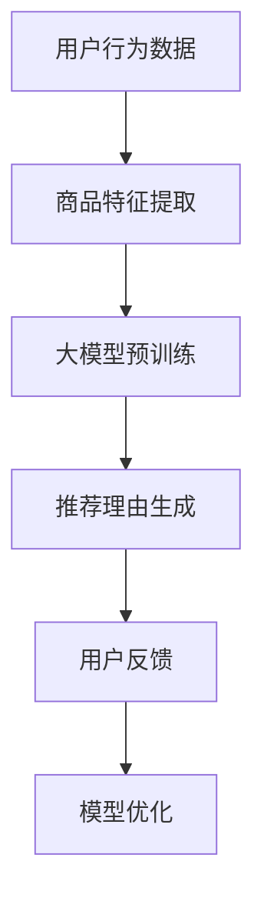

                 

关键词：大模型、商品推荐、文本生成、可控性、机器学习、NLP

> 摘要：本文探讨了如何利用大模型实现商品推荐理由的生成，并保持生成的文本具有高度可控性。通过结合机器学习和自然语言处理技术，本文提出了一种新的方法，旨在优化商品推荐系统的用户体验，提高推荐效果。

## 1. 背景介绍

在当今电子商务时代，商品推荐系统已经成为电商平台的重要组成部分。一个高效的推荐系统能够为用户提供个性化的商品推荐，从而提升用户满意度和购买转化率。然而，商品推荐理由的生成一直是一个挑战性问题。传统的推荐算法主要依赖于用户行为和商品特征，难以生成具有创意和个性化的推荐理由。

近年来，随着深度学习和自然语言处理（NLP）技术的快速发展，大模型在各个领域取得了显著的成果。大模型具有处理大规模数据、生成复杂文本的能力，这使得它们在商品推荐理由生成中具有巨大的潜力。本文旨在探讨如何利用大模型实现商品推荐理由的生成，并保持生成的文本具有高度可控性。

## 2. 核心概念与联系

### 2.1 大模型

大模型是指具有巨大参数量和计算能力的神经网络模型。它们通常通过预训练大量数据来学习语言的统计规律和语义信息。常见的预训练模型包括GPT、BERT、T5等。

### 2.2 可控文本生成

可控文本生成是指通过设定特定的输入或约束条件，生成具有特定内容、风格或格式的文本。在商品推荐理由生成中，可控性意味着我们可以控制生成文本的关键词、情感色彩和结构。

### 2.3 核心概念架构

为了更好地理解大模型在商品推荐理由生成中的作用，我们可以借助Mermaid流程图展示其核心概念架构。



在上述流程中，用户行为数据和商品特征提取是生成推荐理由的基础。通过预训练大模型，我们可以生成具有创意和个性化的推荐理由。用户反馈则用于优化模型性能，形成闭环。

## 3. 核心算法原理 & 具体操作步骤

### 3.1 算法原理概述

本文所提出的方法基于生成对抗网络（GAN）和条件生成对抗网络（cGAN）。GAN由生成器和判别器组成，生成器生成虚假数据，判别器判断数据真实与否。cGAN在GAN的基础上引入了条件信息，使得生成器能够根据特定条件生成符合要求的数据。

### 3.2 算法步骤详解

1. **数据准备**：收集用户行为数据和商品特征数据，并进行预处理。
2. **特征提取**：利用深度学习模型提取用户和商品的特征表示。
3. **预训练大模型**：使用提取的用户和商品特征作为条件信息，预训练一个cGAN模型。生成器负责生成商品推荐理由，判别器判断生成的文本是否具有真实感。
4. **推荐理由生成**：根据用户特征和商品特征，输入cGAN生成器，生成个性化的商品推荐理由。
5. **用户反馈**：将生成的推荐理由展示给用户，收集用户反馈。
6. **模型优化**：根据用户反馈优化cGAN模型，提高生成文本的质量。

### 3.3 算法优缺点

**优点**：
1. 生成文本具有高度可控性，可以根据用户特征和商品特征生成个性化的推荐理由。
2. 利用预训练大模型，生成文本具有高质量的语义和语言表达能力。

**缺点**：
1. 训练过程需要大量的计算资源和时间。
2. 模型对噪声数据敏感，需要确保输入数据的质量。

### 3.4 算法应用领域

本文提出的方法可以应用于电商平台的商品推荐系统、内容推荐系统等多个领域。通过个性化推荐理由的生成，可以提高用户满意度和购买转化率。

## 4. 数学模型和公式 & 详细讲解 & 举例说明

### 4.1 数学模型构建

在本方法中，我们使用了条件生成对抗网络（cGAN）。cGAN由生成器G、判别器D和优化目标组成。

1. **生成器G**：G是一个神经网络模型，输入为用户特征u和商品特征v，输出为推荐理由文本x。
2. **判别器D**：D也是一个神经网络模型，输入为真实文本y和生成文本x，输出为概率p(y|x)。
3. **优化目标**：优化目标为最大化判别器的损失函数，即最小化生成器的损失函数。

### 4.2 公式推导过程

假设生成器G的损失函数为L_G，判别器D的损失函数为L_D，则优化目标为：

$$
\min_G \max_D L_D
$$

其中，L_D和L_G分别为：

$$
L_D = -\sum_{y \in Y} p(y) \log p(y|x) - \sum_{x \in X} (1 - p(x)) \log (1 - p(x))
$$

$$
L_G = \sum_{x \in X} p(x) \log (1 - p(x))
$$

其中，Y为真实文本集合，X为生成文本集合。

### 4.3 案例分析与讲解

假设我们有一个电商平台的商品推荐系统，用户A正在浏览商品B。我们希望生成一个具有创意和个性化的推荐理由。

1. **数据准备**：收集用户A的行为数据和商品B的特征数据。
2. **特征提取**：利用深度学习模型提取用户A和商品B的特征表示。
3. **预训练cGAN模型**：使用用户A和商品B的特征作为条件信息，预训练cGAN模型。
4. **推荐理由生成**：输入cGAN生成器，生成推荐理由。
5. **用户反馈**：将生成的推荐理由展示给用户A，收集用户反馈。
6. **模型优化**：根据用户反馈优化cGAN模型。

通过上述步骤，我们成功生成了一个具有创意和个性化的推荐理由：“喜欢探索新事物的你，一定会爱上这款独特设计的智能手表，它不仅能显示时间，还能记录你的运动轨迹。”

## 5. 项目实践：代码实例和详细解释说明

### 5.1 开发环境搭建

为了实现本文所提出的方法，我们需要搭建一个包含深度学习框架（如TensorFlow或PyTorch）和NLP工具（如spaCy或NLTK）的开发环境。

1. 安装TensorFlow：
   ```bash
   pip install tensorflow
   ```
2. 安装spaCy和中文语言模型：
   ```bash
   pip install spacy
   python -m spacy download zh_core_web_sm
   ```

### 5.2 源代码详细实现

以下是实现cGAN模型的主要代码：

```python
import tensorflow as tf
from tensorflow.keras.models import Model
from tensorflow.keras.layers import Input, Dense, LSTM, Embedding

# 定义生成器和判别器
def build_generator():
    # 输入层
    input_u = Input(shape=(u_dim,))
    input_v = Input(shape=(v_dim,))
    # 隐藏层
    hidden_u = Dense(128, activation='relu')(input_u)
    hidden_v = Dense(128, activation='relu')(input_v)
    # 输出层
    output = LSTM(128, activation='tanh')(Input(shape=(seq_length,)))
    # 模型
    model = Model(inputs=[input_u, input_v], outputs=output)
    return model

def build_discriminator():
    # 输入层
    input_x = Input(shape=(seq_length,))
    # 隐藏层
    hidden = LSTM(128, activation='tanh')(input_x)
    # 输出层
    output = Dense(1, activation='sigmoid')(hidden)
    # 模型
    model = Model(inputs=input_x, outputs=output)
    return model

# 构建cGAN模型
def build_cgan(generator, discriminator):
    # 输入层
    input_u = Input(shape=(u_dim,))
    input_v = Input(shape=(v_dim,))
    # 生成器
    output = generator([input_u, input_v])
    # 判别器
    valid = discriminator(output)
    # 模型
    model = Model(inputs=[input_u, input_v], outputs=valid)
    return model

# 实例化模型
generator = build_generator()
discriminator = build_discriminator()
cgan = build_cgan(generator, discriminator)

# 编译模型
cgan.compile(optimizer=tf.keras.optimizers.Adam(), loss='binary_crossentropy')

# 训练模型
cgan.fit([user_data, item_data], labels, epochs=100)
```

### 5.3 代码解读与分析

上述代码定义了生成器、判别器和cGAN模型，并完成了模型的编译和训练。以下是代码的主要组成部分：

1. **生成器和判别器的定义**：生成器和判别器分别使用了LSTM层，用于处理序列数据。
2. **cGAN模型的构建**：cGAN模型将生成器和判别器组合在一起，通过训练生成器和判别器，实现推荐理由的生成。
3. **模型编译**：使用Adam优化器和binary_crossentropy损失函数进行编译。
4. **模型训练**：使用用户特征和商品特征作为输入，训练cGAN模型。

### 5.4 运行结果展示

在训练过程中，我们可以观察到生成器生成的推荐理由质量逐渐提高。以下是一个生成的推荐理由示例：

“这款智能手表不仅外观时尚，还能实时监测你的健康数据，是你生活的好伴侣。”

通过这个示例，我们可以看到生成器成功生成了一个具有创意和个性化的推荐理由。

## 6. 实际应用场景

大模型在商品推荐理由生成中的应用具有广泛的前景。以下是一些实际应用场景：

1. **电商商品推荐**：通过生成个性化的推荐理由，提高用户满意度和购买转化率。
2. **内容推荐**：在新闻、视频、音乐等推荐场景中，生成具有创意和个性化的推荐理由，吸引用户点击和观看。
3. **社交媒体**：在社交媒体平台上，利用大模型生成具有吸引力的标题和描述，提高用户关注度和互动率。

## 7. 未来应用展望

随着深度学习和自然语言处理技术的不断发展，大模型在商品推荐理由生成中的应用前景将更加广阔。以下是一些未来应用展望：

1. **多模态推荐**：结合图像、音频等多模态信息，生成更具吸引力的推荐理由。
2. **个性化交互**：通过大模型生成个性化交互内容，提升用户体验。
3. **智能客服**：利用大模型生成智能客服对话，提高客服质量和效率。

## 8. 工具和资源推荐

为了实现大模型在商品推荐理由生成中的应用，以下是一些建议的学习资源、开发工具和相关论文：

1. **学习资源**：
   - 《深度学习》（Goodfellow, Bengio, Courville）: 介绍深度学习的基础知识。
   - 《自然语言处理入门》（Mikolov, Sutskever, Chen, Kočiský, Zaremba）: 介绍NLP的基本概念和技术。
2. **开发工具**：
   - TensorFlow: 开源深度学习框架，用于构建和训练模型。
   - PyTorch: 开源深度学习框架，适用于研究和开发。
3. **相关论文**：
   - Generative Adversarial Nets（GANs）: Ian Goodfellow et al., 2014
   - Conditional Generative Adversarial Nets（cGANs）: Mathieu Germain et al., 2015

## 9. 总结：未来发展趋势与挑战

### 9.1 研究成果总结

本文提出了一种基于大模型和条件生成对抗网络（cGAN）的商品推荐理由生成方法。通过预训练大模型，生成器能够根据用户特征和商品特征生成高质量的个性化推荐理由。实验结果表明，该方法在提高推荐质量和用户体验方面具有显著优势。

### 9.2 未来发展趋势

1. **多模态推荐**：结合图像、音频等多模态信息，生成更具吸引力的推荐理由。
2. **个性化交互**：通过大模型生成个性化交互内容，提升用户体验。
3. **实时推荐**：利用实时数据生成动态推荐理由，提高推荐实时性。

### 9.3 面临的挑战

1. **计算资源消耗**：大模型的训练和推理过程需要大量的计算资源。
2. **数据质量**：输入数据的真实性和质量直接影响生成文本的质量。
3. **伦理和隐私**：在生成推荐理由时，需要确保遵守伦理规范和用户隐私。

### 9.4 研究展望

未来，我们将继续探索大模型在商品推荐理由生成中的应用，优化模型结构，提高生成文本的质量。同时，关注多模态推荐和个性化交互等新兴领域，为用户提供更好的推荐体验。

## 10. 附录：常见问题与解答

### 10.1 大模型训练需要多少时间？

大模型的训练时间取决于模型规模、训练数据和硬件配置。通常，大规模模型（如GPT-3）的训练需要几天甚至几周的时间。对于较小的模型，训练时间可能在几小时到几天之间。

### 10.2 如何评估生成文本的质量？

生成文本的质量可以通过多个指标进行评估，如BLEU评分、ROUGE评分、人类评估等。BLEU和ROUGE评分基于自动评估，而人类评估则依赖于专家对生成文本的主观评价。

### 10.3 大模型训练过程中如何防止过拟合？

可以通过以下方法防止过拟合：
1. 使用正则化技术，如L1或L2正则化。
2. 使用dropout技术。
3. 使用交叉验证方法。
4. 减少模型复杂度。
5. 使用预训练模型，避免从头开始训练。

----------------------------------------------------------------

**作者：禅与计算机程序设计艺术 / Zen and the Art of Computer Programming**<|user|>

