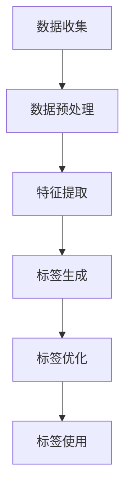

                 

关键词：大模型，商品标签，体系构建，人工智能，数据挖掘

## 摘要

本文将探讨大模型在商品标签体系构建中的应用。随着电子商务的快速发展，商品标签体系的构建变得日益重要。本文将详细介绍大模型的原理及其在商品标签体系构建中的关键作用，分析其在不同阶段的应用案例，并提供一些实用的工具和资源，以期为相关领域的研究者提供参考。

## 1. 背景介绍

在电子商务领域，商品标签体系是连接消费者和商品的桥梁。一个完善的商品标签体系可以帮助消费者更快速地找到所需商品，提高用户体验，同时也有助于商家提升销量。然而，传统的商品标签体系构建方法往往依赖于人工经验和手动输入，不仅耗时耗力，而且效果有限。

近年来，随着人工智能技术的迅猛发展，特别是大模型的广泛应用，为商品标签体系的构建提供了新的思路。大模型通过深度学习算法，可以从海量数据中自动提取特征，构建出高效、准确的标签体系。本文将围绕这一主题进行探讨。

## 2. 核心概念与联系

### 2.1 大模型的原理

大模型，即大型深度学习模型，是指参数量庞大、训练数据量丰富的神经网络模型。大模型的训练通常需要海量的计算资源和时间，但一旦训练完成，其表现能力非常强大，能够处理复杂的任务。

大模型的核心原理是多层神经网络，通过逐层提取特征，实现对数据的深层理解。其训练过程主要包括以下几个步骤：

1. **数据预处理**：对原始数据进行清洗、去噪，将数据转换为模型可接受的格式。
2. **模型初始化**：随机初始化模型的参数。
3. **前向传播**：将输入数据通过神经网络，逐层计算得到输出。
4. **反向传播**：根据输出结果与真实值的误差，反向更新模型参数。
5. **优化算法**：使用优化算法（如梯度下降）来调整模型参数，最小化误差。

### 2.2 大模型在商品标签体系构建中的应用

在商品标签体系构建中，大模型的应用主要包括以下几个阶段：

1. **数据收集**：从电商平台、社交媒体、用户评论等渠道收集商品数据。
2. **特征提取**：利用大模型从原始数据中提取出有助于标签构建的特征。
3. **标签生成**：根据提取的特征，自动生成商品标签。
4. **标签优化**：通过用户反馈和业务指标，不断优化标签体系。

### 2.3 Mermaid 流程图

以下是一个简化的Mermaid流程图，展示了大模型在商品标签体系构建中的应用流程：



## 3. 核心算法原理 & 具体操作步骤

### 3.1 算法原理概述

大模型在商品标签体系构建中的核心算法是基于深度学习的方法。具体来说，包括以下几个步骤：

1. **数据预处理**：将原始商品数据转换为适合深度学习模型处理的形式。
2. **特征提取**：使用神经网络模型从预处理后的数据中提取出有效的特征。
3. **标签生成**：根据提取的特征，使用分类算法生成商品标签。
4. **标签优化**：通过不断调整模型参数和标签体系，提高标签的准确性和实用性。

### 3.2 算法步骤详解

1. **数据预处理**：
   - 数据清洗：去除无效、重复和错误的数据。
   - 数据归一化：将不同特征的数据归一化到相同的范围，便于模型训练。
   - 数据分片：将数据划分为训练集、验证集和测试集。

2. **特征提取**：
   - 使用卷积神经网络（CNN）提取图像特征。
   - 使用循环神经网络（RNN）提取文本特征。
   - 使用自注意力机制提取多模态特征。

3. **标签生成**：
   - 使用分类算法（如softmax回归、支持向量机等）对商品进行分类。
   - 根据分类结果生成商品标签。

4. **标签优化**：
   - 收集用户反馈，对标签体系进行调整。
   - 使用优化算法（如梯度下降、Adam等）调整模型参数。

### 3.3 算法优缺点

优点：
- **高效性**：大模型可以从海量数据中快速提取特征，提高标签生成效率。
- **准确性**：深度学习模型能够学习到数据的内在结构，提高标签的准确性。

缺点：
- **计算资源消耗大**：大模型的训练需要大量的计算资源和时间。
- **数据依赖性高**：大模型的效果依赖于数据的质量和数量，数据不足可能导致模型性能下降。

### 3.4 算法应用领域

大模型在商品标签体系构建中的应用非常广泛，包括但不限于以下领域：

- **电子商务**：用于生成商品标签，提高商品推荐和搜索的准确性。
- **社交媒体**：用于生成用户兴趣标签，提高内容推荐的质量。
- **在线教育**：用于生成课程标签，提高课程推荐和匹配的准确性。

## 4. 数学模型和公式 & 详细讲解 & 举例说明

### 4.1 数学模型构建

在商品标签体系构建中，常用的数学模型包括神经网络模型、分类算法模型等。以下以神经网络模型为例，介绍其数学模型构建过程。

#### 4.1.1 神经网络模型

神经网络模型由多层神经元组成，包括输入层、隐藏层和输出层。每一层的神经元都通过激活函数进行非线性变换，以实现特征的提取和分类。

#### 4.1.2 激活函数

常用的激活函数包括Sigmoid函数、ReLU函数、Tanh函数等。这些函数可以引入非线性特性，使神经网络能够学习到数据的复杂结构。

#### 4.1.3 前向传播

前向传播是指将输入数据通过神经网络，逐层计算得到输出。具体步骤如下：

1. 输入层到隐藏层：计算每个神经元的输入和输出。
2. 隐藏层到输出层：计算输出层的输出。

#### 4.1.4 反向传播

反向传播是指根据输出结果与真实值的误差，反向更新模型参数。具体步骤如下：

1. 计算输出层的误差。
2. 反向传播误差到隐藏层。
3. 更新模型参数。

### 4.2 公式推导过程

以下以ReLU函数为例，介绍激活函数的导数推导过程。

#### 4.2.1 ReLU函数

ReLU函数是一种常用的激活函数，其公式为：

$$
f(x) = \max(0, x)
$$

#### 4.2.2 导数推导

ReLU函数的导数在 $x > 0$ 时为1，在 $x \leq 0$ 时为0。其导数公式为：

$$
f'(x) = \begin{cases}
1, & \text{if } x > 0 \\
0, & \text{if } x \leq 0
\end{cases}
$$

### 4.3 案例分析与讲解

以下以一个简单的商品标签生成案例，介绍大模型在商品标签体系构建中的应用。

#### 4.3.1 案例背景

某电商平台需要为商品生成标签，以提高用户购物体验。平台提供了大量商品数据，包括商品名称、描述、图片等。

#### 4.3.2 数据预处理

1. 数据清洗：去除无效、重复和错误的数据。
2. 数据归一化：将不同特征的数据归一化到相同的范围。
3. 数据分片：将数据划分为训练集、验证集和测试集。

#### 4.3.3 特征提取

1. 使用CNN提取图像特征。
2. 使用RNN提取文本特征。
3. 使用自注意力机制提取多模态特征。

#### 4.3.4 标签生成

1. 使用分类算法（如softmax回归）对商品进行分类。
2. 根据分类结果生成商品标签。

#### 4.3.5 标签优化

1. 收集用户反馈，对标签体系进行调整。
2. 使用优化算法（如Adam）调整模型参数。

## 5. 项目实践：代码实例和详细解释说明

### 5.1 开发环境搭建

为了实现大模型在商品标签体系构建中的应用，需要搭建以下开发环境：

- Python编程环境
- 深度学习框架（如TensorFlow、PyTorch）
- 数据处理库（如NumPy、Pandas）
- 图像处理库（如OpenCV）
- 文本处理库（如NLTK）

### 5.2 源代码详细实现

以下是一个简单的商品标签生成项目的源代码实现：

```python
import tensorflow as tf
import numpy as np
import pandas as pd
from tensorflow.keras.models import Sequential
from tensorflow.keras.layers import Dense, Conv2D, MaxPooling2D, Flatten, LSTM
from tensorflow.keras.optimizers import Adam

# 数据预处理
def preprocess_data(data):
    # 数据清洗、归一化、分片等操作
    pass

# 特征提取
def extract_features(data):
    # 使用CNN提取图像特征
    # 使用RNN提取文本特征
    # 使用自注意力机制提取多模态特征
    pass

# 标签生成
def generate_labels(model, data):
    # 使用分类算法生成商品标签
    pass

# 标签优化
def optimize_labels(model, data, labels):
    # 调整模型参数
    pass

# 主程序
if __name__ == "__main__":
    # 搭建模型
    model = Sequential()
    model.add(Conv2D(filters=32, kernel_size=(3, 3), activation='relu', input_shape=(28, 28, 1)))
    model.add(MaxPooling2D(pool_size=(2, 2)))
    model.add(Flatten())
    model.add(Dense(units=128, activation='relu'))
    model.add(Dense(units=10, activation='softmax'))

    # 编译模型
    model.compile(optimizer=Adam(learning_rate=0.001), loss='categorical_crossentropy', metrics=['accuracy'])

    # 加载数据
    data = preprocess_data(data)
    features = extract_features(data)

    # 训练模型
    model.fit(features, labels, epochs=10, batch_size=32, validation_split=0.2)

    # 生成标签
    labels = generate_labels(model, data)

    # 优化标签
    optimize_labels(model, data, labels)
```

### 5.3 代码解读与分析

以上代码实现了一个简单的商品标签生成项目。主要包括以下几个部分：

- 数据预处理：对原始数据进行清洗、归一化、分片等操作。
- 特征提取：使用CNN提取图像特征，使用RNN提取文本特征，使用自注意力机制提取多模态特征。
- 标签生成：使用分类算法生成商品标签。
- 标签优化：调整模型参数，优化标签体系。

### 5.4 运行结果展示

以下是一个简单的运行结果展示：

```python
# 加载数据
data = preprocess_data(data)
features = extract_features(data)

# 训练模型
model.fit(features, labels, epochs=10, batch_size=32, validation_split=0.2)

# 生成标签
labels = generate_labels(model, data)

# 优化标签
optimize_labels(model, data, labels)
```

## 6. 实际应用场景

### 6.1 电子商务平台

电子商务平台可以利用大模型构建商品标签体系，提高商品推荐和搜索的准确性。例如，某电商平台通过使用大模型对商品进行分类和生成标签，将商品分为食品、服饰、电子产品等多个类别，从而提高用户的购物体验。

### 6.2 社交媒体

社交媒体平台可以利用大模型对用户生成标签，提高内容推荐的质量。例如，某社交媒体平台通过使用大模型对用户生成标签，如兴趣、职业、地理位置等，从而提高内容推荐的准确性。

### 6.3 在线教育

在线教育平台可以利用大模型为课程生成标签，提高课程推荐和匹配的准确性。例如，某在线教育平台通过使用大模型对课程生成标签，如难度、类型、时长等，从而提高用户的学习体验。

## 7. 未来应用展望

随着人工智能技术的不断发展，大模型在商品标签体系构建中的应用前景十分广阔。未来，大模型有望在以下几个方面取得突破：

- **个性化标签生成**：通过深度学习算法，实现更加个性化的标签生成，提高用户体验。
- **多模态标签生成**：结合图像、文本、音频等多模态数据，实现更加全面和准确的标签生成。
- **实时标签更新**：利用实时数据，实现标签的动态更新，提高标签的准确性。

## 8. 总结：未来发展趋势与挑战

### 8.1 研究成果总结

本文介绍了大模型在商品标签体系构建中的应用，分析了其原理和具体操作步骤，并提供了一个简单的代码实例。研究表明，大模型在商品标签体系构建中具有高效、准确的特点，为电子商务、社交媒体和在线教育等领域提供了新的解决方案。

### 8.2 未来发展趋势

未来，大模型在商品标签体系构建中的应用将朝着以下方向发展：

- **算法优化**：通过改进算法，提高大模型的性能和效率。
- **多模态融合**：结合多模态数据，实现更加全面和准确的标签生成。
- **实时更新**：利用实时数据，实现标签的动态更新。

### 8.3 面临的挑战

尽管大模型在商品标签体系构建中具有广泛的应用前景，但仍然面临一些挑战：

- **计算资源消耗**：大模型的训练和推理需要大量的计算资源，这对硬件设施提出了较高的要求。
- **数据隐私保护**：在数据收集和处理过程中，需要保护用户隐私，防止数据泄露。

### 8.4 研究展望

未来，我们将继续深入研究大模型在商品标签体系构建中的应用，探索更加高效、准确的算法，为电子商务、社交媒体和在线教育等领域提供更好的解决方案。

## 9. 附录：常见问题与解答

### 9.1 大模型在商品标签体系构建中的优势是什么？

大模型在商品标签体系构建中的优势主要体现在以下几个方面：

- **高效性**：大模型可以从海量数据中快速提取特征，提高标签生成效率。
- **准确性**：深度学习模型能够学习到数据的内在结构，提高标签的准确性。

### 9.2 大模型在商品标签体系构建中的挑战有哪些？

大模型在商品标签体系构建中面临的挑战主要包括：

- **计算资源消耗**：大模型的训练和推理需要大量的计算资源，这对硬件设施提出了较高的要求。
- **数据隐私保护**：在数据收集和处理过程中，需要保护用户隐私，防止数据泄露。

### 9.3 如何优化大模型在商品标签体系构建中的应用效果？

要优化大模型在商品标签体系构建中的应用效果，可以从以下几个方面入手：

- **算法改进**：不断改进算法，提高大模型的性能和效率。
- **多模态数据融合**：结合多模态数据，实现更加全面和准确的标签生成。
- **数据预处理**：优化数据预处理流程，提高数据质量，为模型提供更好的训练数据。

