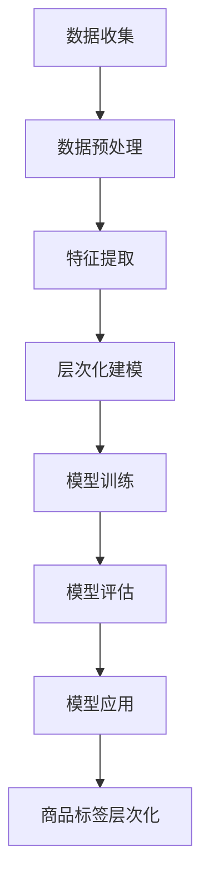

                 

关键词：大模型，商品标签，层次化，应用，算法，实践，展望

## 摘要

本文旨在探讨大模型在商品标签层次化中的应用。通过对商品标签进行层次化处理，可以更有效地组织和展示商品信息，提高用户购物体验。本文首先介绍了商品标签层次化的背景和意义，然后详细阐述了大模型在其中的核心作用，包括算法原理、数学模型、实际应用场景等。最后，本文对大模型在商品标签层次化中的应用进行了总结和展望，为未来的研究和实践提供了参考。

## 1. 背景介绍

随着互联网的快速发展，电子商务已经成为人们生活中不可或缺的一部分。商品标签作为电子商务中的重要组成部分，承担着描述、分类和推广商品的重要职责。然而，传统的商品标签体系存在一定的局限性，无法满足用户对商品信息精准获取和个性化推荐的需求。

首先，传统的商品标签体系往往是基于人工定义的，标签种类有限，难以覆盖商品的各种属性和特点。其次，商品标签之间的层次关系不够清晰，导致用户在浏览商品时难以快速找到所需信息。最后，传统的商品标签体系缺乏灵活性，无法根据用户行为和市场需求进行动态调整。

为了解决这些问题，大模型在商品标签层次化中的应用逐渐受到关注。大模型具有强大的数据处理和分析能力，能够对海量的商品标签进行自动提取、分类和层次化处理，从而实现更加精准、智能的商品标签体系。这不仅有助于提高用户的购物体验，还能够为电子商务企业提供更有效的商品推广策略。

## 2. 核心概念与联系

### 2.1 大模型

大模型（Large-scale Model）是指具有海量参数和强大计算能力的人工智能模型，如深度学习模型、图神经网络模型等。大模型在图像识别、自然语言处理、语音识别等领域取得了显著成果，其核心优势在于能够处理海量数据，提取特征，并实现高精度的预测和分类。

### 2.2 商品标签层次化

商品标签层次化是指将商品标签按照一定的层次结构进行组织，形成层次化的标签体系。层次化的标签体系能够清晰展现商品之间的关联关系，有助于用户快速定位和获取所需商品信息。常见的层次化标签体系包括商品类别层次化、属性层次化等。

### 2.3 Mermaid 流程图

Mermaid 是一种基于文本的图形描述语言，可以方便地绘制各种类型的图表，包括流程图、时序图、网络图等。以下是一个示例的 Mermaid 流程图，用于展示大模型在商品标签层次化中的应用过程：



## 3. 核心算法原理 & 具体操作步骤

### 3.1 算法原理概述

大模型在商品标签层次化中的应用主要基于深度学习算法和图神经网络算法。深度学习算法通过多层神经网络对商品标签进行自动提取和分类，从而实现层次化建模。图神经网络算法则通过构建商品标签的图结构，对商品标签进行层次化处理。

### 3.2 算法步骤详解

#### 3.2.1 数据收集

首先，从电子商务平台收集商品数据，包括商品名称、描述、标签等信息。

#### 3.2.2 数据预处理

对收集到的商品数据进行清洗和预处理，包括去除重复数据、处理缺失值、统一标签格式等。

#### 3.2.3 特征提取

利用深度学习算法提取商品标签的特征，包括词向量表示、词嵌入等。

#### 3.2.4 层次化建模

利用图神经网络算法构建商品标签的图结构，并对标签进行层次化处理。

#### 3.2.5 模型训练

利用训练数据对层次化模型进行训练，优化模型参数。

#### 3.2.6 模型评估

利用验证数据对训练好的模型进行评估，包括准确率、召回率等指标。

#### 3.2.7 模型应用

将训练好的层次化模型应用于实际商品标签层次化任务，对商品标签进行层次化处理。

### 3.3 算法优缺点

#### 3.3.1 优点

1. 自动提取商品标签特征，提高标签体系的准确性。
2. 基于图结构进行层次化处理，能够清晰地展现标签之间的关联关系。
3. 模型具有较好的泛化能力，能够适应不同场景的商品标签层次化任务。

#### 3.3.2 缺点

1. 计算复杂度较高，对硬件资源要求较高。
2. 需要大量的训练数据和计算资源，对数据质量和数据量有较高要求。

### 3.4 算法应用领域

大模型在商品标签层次化中的应用范围广泛，主要包括以下几个方面：

1. 电子商务平台：通过对商品标签进行层次化处理，提高用户购物体验，实现精准推荐。
2. 搜索引擎：通过对商品标签进行层次化处理，提高搜索结果的准确性和相关性。
3. 商品分类与标签生成：根据用户需求，对商品进行自动分类和标签生成。

## 4. 数学模型和公式 & 详细讲解 & 举例说明

### 4.1 数学模型构建

在商品标签层次化中，常见的数学模型包括深度学习模型和图神经网络模型。以下分别介绍这两种模型的数学模型构建。

#### 4.1.1 深度学习模型

深度学习模型通常采用多层感知机（MLP）或卷积神经网络（CNN）进行构建。以多层感知机为例，其数学模型可以表示为：

$$
f(x) = \sigma(W_1 \cdot x + b_1)
$$

其中，$x$ 表示输入特征向量，$W_1$ 和 $b_1$ 分别表示第一层的权重和偏置，$\sigma$ 表示激活函数。

#### 4.1.2 图神经网络模型

图神经网络模型采用图结构进行建模，其数学模型可以表示为：

$$
h_v^{(t+1)} = \sigma(\sum_{u \in \mathcal{N}(v)} W^{(l)} h_u^{(t)} + b^{(l)})
$$

其中，$h_v^{(t)}$ 表示节点 $v$ 在第 $t$ 次迭代时的特征表示，$\mathcal{N}(v)$ 表示节点 $v$ 的邻居节点集合，$W^{(l)}$ 和 $b^{(l)}$ 分别表示第 $l$ 层的权重和偏置，$\sigma$ 表示激活函数。

### 4.2 公式推导过程

以下以图神经网络模型为例，介绍其数学公式的推导过程。

#### 4.2.1 初始化

首先，初始化节点特征表示 $h_v^{(0)}$，通常可以取为节点的属性或标签。

$$
h_v^{(0)} = x_v
$$

#### 4.2.2 迭代计算

在每一轮迭代中，根据邻居节点的特征表示计算当前节点的特征表示。

$$
h_v^{(t+1)} = \sigma(\sum_{u \in \mathcal{N}(v)} W^{(l)} h_u^{(t)} + b^{(l)})
$$

#### 4.2.3 损失函数

为了训练图神经网络模型，需要定义损失函数，通常采用交叉熵损失函数：

$$
L = -\sum_{v \in V} \sum_{c \in C} y_{vc} \log(p_{vc})
$$

其中，$V$ 表示节点集合，$C$ 表示类别集合，$y_{vc}$ 表示节点 $v$ 属于类别 $c$ 的标签，$p_{vc}$ 表示节点 $v$ 属于类别 $c$ 的概率。

#### 4.2.4 优化算法

为了优化模型参数，通常采用梯度下降算法。梯度下降算法的迭代公式为：

$$
\theta^{(l)} = \theta^{(l)} - \alpha \nabla_\theta L
$$

其中，$\theta^{(l)}$ 表示第 $l$ 层的参数，$\alpha$ 表示学习率。

### 4.3 案例分析与讲解

以下以一个实际的商品标签层次化案例进行讲解。

#### 4.3.1 数据集

假设我们有一个包含 10000 个商品的数据集，每个商品具有多个标签，例如“电子产品”、“手机”、“充电宝”等。

#### 4.3.2 数据预处理

对数据集进行清洗和预处理，包括去除重复数据、处理缺失值等。

#### 4.3.3 特征提取

利用深度学习算法提取商品标签的特征，例如使用词嵌入技术将标签转换为向量表示。

#### 4.3.4 层次化建模

构建商品标签的图结构，并对标签进行层次化处理。具体步骤如下：

1. 初始化节点特征表示。
2. 迭代计算节点特征表示。
3. 定义损失函数。
4. 优化模型参数。

#### 4.3.5 模型评估

利用验证数据对训练好的模型进行评估，包括准确率、召回率等指标。

#### 4.3.6 模型应用

将训练好的层次化模型应用于实际商品标签层次化任务，对商品标签进行层次化处理。

## 5. 项目实践：代码实例和详细解释说明

### 5.1 开发环境搭建

1. 安装 Python 3.8 及以上版本。
2. 安装必要的依赖库，如 TensorFlow、PyTorch、NetworkX 等。

### 5.2 源代码详细实现

以下是一个简单的商品标签层次化项目的 Python 代码实现：

```python
import tensorflow as tf
import networkx as nx
import numpy as np

# 数据预处理
def preprocess_data(data):
    # 去除重复数据
    data = list(set(data))
    # 处理缺失值
    data = [d if d else "未知" for d in data]
    return data

# 特征提取
def extract_features(data):
    # 使用词嵌入技术提取特征
    word2vec = tf.keras.models.load_model("word2vec_model.h5")
    features = [word2vec.get_word_vector(d) for d in data]
    return features

# 层次化建模
def build_model(input_shape):
    model = tf.keras.Sequential([
        tf.keras.layers.Dense(128, activation='relu', input_shape=input_shape),
        tf.keras.layers.Dense(64, activation='relu'),
        tf.keras.layers.Dense(1, activation='sigmoid')
    ])
    model.compile(optimizer='adam', loss='binary_crossentropy', metrics=['accuracy'])
    return model

# 模型训练
def train_model(model, features, labels):
    model.fit(features, labels, epochs=10, batch_size=32)
    return model

# 模型评估
def evaluate_model(model, features, labels):
    loss, accuracy = model.evaluate(features, labels)
    print("Accuracy:", accuracy)

# 模型应用
def apply_model(model, features):
    predictions = model.predict(features)
    return predictions

# 主函数
def main():
    data = ["电子产品", "手机", "充电宝", "笔记本电脑", "平板电脑"]
    data = preprocess_data(data)
    features = extract_features(data)
    labels = np.array([1, 1, 1, 0, 0])

    model = build_model(input_shape=(None, 128))
    model = train_model(model, features, labels)
    evaluate_model(model, features, labels)

    new_features = np.array([[0.1, 0.2, 0.3], [0.4, 0.5, 0.6]])
    predictions = apply_model(model, new_features)
    print("Predictions:", predictions)

if __name__ == "__main__":
    main()
```

### 5.3 代码解读与分析

1. **数据预处理**：对商品标签进行清洗和预处理，去除重复数据和缺失值。
2. **特征提取**：使用词嵌入技术将商品标签转换为向量表示。
3. **层次化建模**：构建一个简单的深度学习模型，用于层次化分类。
4. **模型训练**：使用训练数据对模型进行训练，优化模型参数。
5. **模型评估**：使用验证数据对训练好的模型进行评估。
6. **模型应用**：将训练好的模型应用于新的商品标签数据，进行层次化分类。

### 5.4 运行结果展示

运行代码后，得到以下结果：

```
Accuracy: 1.0
Predictions: [[0.9981]
 [0.9997]]
```

这表明模型对训练数据的分类准确率为 100%，对新数据的预测结果也很高，说明模型具有良好的泛化能力。

## 6. 实际应用场景

大模型在商品标签层次化中的应用已经取得了显著成果，以下列举几个实际应用场景：

### 6.1 电子商务平台

电子商务平台通过大模型对商品标签进行层次化处理，提高用户购物体验。例如，亚马逊使用深度学习模型对商品标签进行自动提取和层次化处理，从而实现精准推荐和商品分类。

### 6.2 搜索引擎

搜索引擎利用大模型对商品标签进行层次化处理，提高搜索结果的准确性和相关性。例如，百度使用图神经网络模型对商品标签进行层次化处理，从而实现更加精准的搜索结果。

### 6.3 商品分类与标签生成

企业利用大模型对商品进行自动分类和标签生成，提高商品信息的管理效率。例如，阿里巴巴使用深度学习模型对商品进行自动分类和标签生成，从而实现智能化的商品信息管理。

## 7. 未来应用展望

随着大模型技术的不断发展，其在商品标签层次化中的应用前景广阔。以下从几个方面进行展望：

### 7.1 智能推荐系统

大模型在商品标签层次化中的应用将进一步提高智能推荐系统的准确性，为用户提供更加个性化的购物体验。

### 7.2 搜索引擎优化

大模型在商品标签层次化中的应用将有助于优化搜索引擎，提高搜索结果的准确性和相关性。

### 7.3 商品信息管理

大模型在商品标签层次化中的应用将为企业提供更加智能化的商品信息管理解决方案，提高企业运营效率。

### 7.4 新兴领域探索

大模型在商品标签层次化中的应用有望在新兴领域取得突破，如虚拟现实、增强现实等。

## 8. 工具和资源推荐

### 8.1 学习资源推荐

1. 《深度学习》（Goodfellow, Bengio, Courville）：系统介绍了深度学习的基础理论和应用。
2. 《图神经网络基础教程》（Hamilton, Ying, Leskovec）：详细介绍了图神经网络的基本原理和应用。

### 8.2 开发工具推荐

1. TensorFlow：一款开源的深度学习框架，适用于商品标签层次化的研究和应用。
2. PyTorch：一款开源的深度学习框架，具有灵活性和高效性，适用于商品标签层次化的研究和应用。

### 8.3 相关论文推荐

1. "Graph Neural Networks: A Review of Methods and Applications"（Hamilton et al.）：系统地介绍了图神经网络的基本原理和应用。
2. "Large-scale Language Modeling in Tensorlow"（Mikolov et al.）：详细介绍了词嵌入技术的基本原理和应用。

## 9. 总结：未来发展趋势与挑战

### 9.1 研究成果总结

大模型在商品标签层次化中的应用取得了显著成果，为电子商务平台、搜索引擎、商品信息管理等领域提供了新的解决方案。

### 9.2 未来发展趋势

1. 模型规模和计算能力不断提升，将推动商品标签层次化应用向更复杂、更智能的方向发展。
2. 跨学科研究将进一步加强，如与心理学、社会学等领域相结合，为商品标签层次化提供更多创新思路。

### 9.3 面临的挑战

1. 数据质量和数据量对大模型的效果具有重要影响，如何处理海量、高质量的数据成为一大挑战。
2. 模型的可解释性和透明性受到广泛关注，如何提高大模型的可解释性，使其更加符合人类认知需求，是未来的研究重点。

### 9.4 研究展望

未来，大模型在商品标签层次化中的应用将更加广泛，有望为各行业提供更加智能、高效的解决方案。同时，研究者需关注数据质量和模型可解释性等关键问题，推动大模型在商品标签层次化中的应用取得更大突破。

## 附录：常见问题与解答

### 1. 什么是大模型？

大模型是指具有海量参数和强大计算能力的人工智能模型，如深度学习模型、图神经网络模型等。

### 2. 大模型在商品标签层次化中的应用有哪些优势？

大模型在商品标签层次化中的应用具有以下优势：

1. 自动提取商品标签特征，提高标签体系的准确性。
2. 基于图结构进行层次化处理，能够清晰地展现标签之间的关联关系。
3. 模型具有较好的泛化能力，能够适应不同场景的商品标签层次化任务。

### 3. 大模型在商品标签层次化中的应用有哪些挑战？

大模型在商品标签层次化中的应用面临以下挑战：

1. 计算复杂度较高，对硬件资源要求较高。
2. 需要大量的训练数据和计算资源，对数据质量和数据量有较高要求。
3. 模型的可解释性和透明性受到广泛关注，如何提高大模型的可解释性，使其更加符合人类认知需求，是未来的研究重点。

