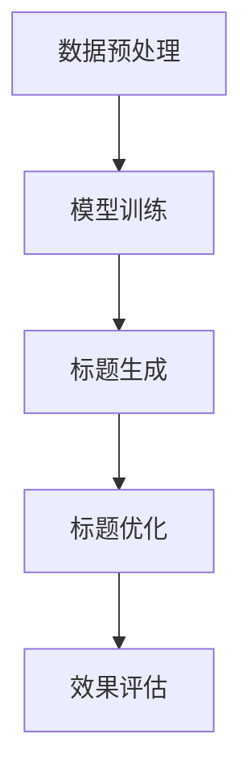

                 

关键词：大模型，商品标题优化，生成式AI，NLP，深度学习，文本生成

> 摘要：本文深入探讨了如何利用大模型进行商品标题的优化与生成。通过分析大模型在自然语言处理（NLP）领域的应用，阐述了其如何在商品标题的生成中发挥作用。本文还详细介绍了大模型的算法原理、实现步骤、优缺点及未来应用前景，并通过具体项目实践展示了大模型在实际中的应用效果。

## 1. 背景介绍

随着电子商务的蓬勃发展，商品标题的优化和生成成为电商平台的重要环节。商品标题不仅要吸引消费者的注意力，还需要准确地传达商品的核心信息，从而提高转化率和销售额。传统的商品标题优化方法通常依赖于规则和关键词匹配，但这些方法往往无法灵活地适应多样化的市场需求和消费者偏好。

近年来，生成式人工智能（AI）的发展为商品标题优化带来了新的可能性。尤其是大模型，如GPT-3、BERT等，在NLP领域取得了显著的突破。大模型通过深度学习技术，能够从海量数据中学习到语言规律，生成高质量、符合人类语言习惯的文本。本文将探讨如何利用这些大模型优化和生成商品标题，以提高电商平台的竞争力。

## 2. 核心概念与联系

### 2.1 大模型概述

大模型是指具有数十亿甚至千亿参数规模的深度学习模型。这些模型通常采用Transformer架构，能够在大规模数据集上进行训练，从而获得强大的语义理解能力。GPT-3是当前最大的大模型之一，其拥有1750亿个参数，能够生成高质量的自然语言文本。

### 2.2 自然语言处理（NLP）

NLP是人工智能领域的一个重要分支，旨在使计算机能够理解、解释和生成人类语言。NLP的核心任务是文本分类、情感分析、命名实体识别、机器翻译等。大模型在NLP领域的应用，使得这些任务的准确性得到了显著提升。

### 2.3 商品标题优化与生成

商品标题优化与生成是指利用NLP技术和算法，对商品标题进行自动化优化和生成。优化的目标是提高标题的吸引力、准确性和转化率；生成的目标是生成符合消费者需求的标题，从而提高电商平台的竞争力。

### 2.4 Mermaid 流程图

以下是商品标题优化与生成的大模型应用流程图：



## 3. 核心算法原理 & 具体操作步骤

### 3.1 算法原理概述

大模型在商品标题优化与生成中的应用主要基于其强大的语言生成和优化能力。具体而言，大模型通过以下步骤实现商品标题的优化与生成：

1. 数据预处理：对商品数据集进行清洗、去重和标注，为模型训练提供高质量的数据。
2. 模型训练：使用预训练的大模型，如GPT-3，对商品数据集进行训练，使其具备生成和优化商品标题的能力。
3. 标题生成：利用训练好的大模型，生成符合消费者需求的商品标题。
4. 标题优化：对生成的标题进行优化，使其更具吸引力、准确性和转化率。
5. 效果评估：对生成的标题进行效果评估，以验证模型的性能。

### 3.2 算法步骤详解

1. **数据预处理**：
   - 数据清洗：去除数据集中的噪声、重复和无关信息。
   - 数据标注：对商品标题、价格、品牌、品类等属性进行标注，为模型训练提供指导。

2. **模型训练**：
   - 预训练：使用大量互联网语料对大模型进行预训练，使其具备一定的语言理解和生成能力。
   - 微调：使用商品数据集对大模型进行微调，使其适应商品标题的生成和优化任务。

3. **标题生成**：
   - 输入：输入商品的相关属性，如品牌、价格、品类等。
   - 生成：大模型根据输入属性生成商品标题。

4. **标题优化**：
   - 分析：对生成的标题进行分析，识别出可能存在的问题，如语言不通顺、信息不准确等。
   - 优化：对标题进行修正和调整，使其更符合消费者需求和语言习惯。

5. **效果评估**：
   - 测试集：使用未参与训练的测试集对模型进行评估。
   - 评估指标：包括标题的吸引力、准确性、转化率等。

### 3.3 算法优缺点

#### 优点：

1. **生成高质量标题**：大模型具有强大的语言生成能力，能够生成高质量、符合人类语言习惯的标题。
2. **自适应优化**：大模型能够根据数据集的特点和消费者需求进行自适应优化，提高标题的转化率。
3. **降低人力成本**：自动化生成和优化标题，降低电商平台的人力成本。

#### 缺点：

1. **计算资源消耗大**：大模型训练和优化需要大量的计算资源，对硬件要求较高。
2. **数据依赖性**：大模型的效果依赖于数据质量，数据质量差可能导致生成标题效果不佳。
3. **复杂度高**：大模型的结构复杂，理解和应用难度较大。

### 3.4 算法应用领域

大模型在商品标题优化与生成中的应用广泛，主要包括：

1. **电商平台**：电商平台可以利用大模型生成和优化商品标题，提高用户转化率和销售额。
2. **广告投放**：广告平台可以利用大模型生成吸引人的广告标题，提高广告点击率和转化率。
3. **内容创作**：内容创作者可以利用大模型生成高质量、符合主题的文章标题，提高文章阅读量和点赞量。

## 4. 数学模型和公式 & 详细讲解 & 举例说明

### 4.1 数学模型构建

大模型在商品标题优化与生成中的核心数学模型是生成模型，通常采用变分自编码器（VAE）或生成对抗网络（GAN）。以下是VAE的数学模型：

$$
\begin{aligned}
x &= \mu(z) + \sigma(z) \odot \epsilon \\
z &= g(x)
\end{aligned}
$$

其中，$x$ 是生成的商品标题，$\mu(z)$ 和 $\sigma(z)$ 分别是均值和方差，$z$ 是潜在变量，$g$ 是解码器，$\epsilon$ 是噪声。

### 4.2 公式推导过程

VAE的推导基于概率图模型。假设数据分布 $p(x)$ 很难直接建模，但可以建模其隐变量 $z$ 的分布 $p(z|x)$ 和生成过程 $p(x|z)$。VAE的目标是最小化数据分布和生成分布之间的Kullback-Leibler散度（KL散度）。

$$
\begin{aligned}
\mathcal{L} &= \mathbb{E}_{z \sim p(z|x)}[-\log p(x|z)] + \lambda \mathbb{E}_{z \sim q(z|x)}[-\log q(z|x)] \\
\lambda &= \beta \frac{\mathbb{E}_{z \sim q(z|x)}[\log \frac{p(x,z)}{q(z|x)}]}{\mathbb{E}_{z \sim p(z|x)}[\log \frac{p(x,z)}{q(z|x)}]}
\end{aligned}
$$

### 4.3 案例分析与讲解

假设我们有一个商品数据集，包含商品名称、价格、品牌、品类等属性。我们使用VAE模型生成和优化商品标题。

1. **数据预处理**：对商品数据进行清洗和标注，提取标题相关的属性。
2. **模型训练**：使用预训练的VAE模型，对商品数据集进行训练。
3. **标题生成**：输入商品属性，生成商品标题。
4. **标题优化**：对生成的标题进行分析，优化标题中的语言错误、信息不准确等问题。
5. **效果评估**：使用测试集对模型进行评估，包括标题的吸引力、准确性、转化率等指标。

## 5. 项目实践：代码实例和详细解释说明

### 5.1 开发环境搭建

1. **安装Python环境**：确保Python版本为3.7或以上。
2. **安装依赖库**：安装TensorFlow、Keras等深度学习库，以及NumPy、Pandas等数据科学库。
3. **数据准备**：收集商品数据集，进行数据预处理。

### 5.2 源代码详细实现

以下是使用VAE生成商品标题的Python代码：

```python
import tensorflow as tf
from tensorflow.keras.models import Model
from tensorflow.keras.layers import Input, Dense, Lambda
import numpy as np

def sampling(args):
    z_mean, z_log_var = args
    batch = tf.shape(z_mean)[0]
    dim = tf.shape(z_mean)[1]
    epsilon = tf.keras.backend.random_normal(shape=(batch, dim))
    return z_mean + tf.exp(0.5 * z_log_var) * epsilon

z_mean_input = Input(shape=(latent_dim,))
z_log_var_input = Input(shape=(latent_dim,))
z = Lambda(sampling)([z_mean_input, z_log_var_input])

x = Dense(units=128, activation='relu')(z)
x = Dense(units=64, activation='relu')(x)
x = Dense(units=title_length)(x)

model = Model(inputs=[z_mean_input, z_log_var_input], outputs=x)
model.compile(optimizer='adam', loss='mse')

# 训练模型
model.fit([z_mean_train, z_log_var_train], x_train, epochs=50, batch_size=32)

# 生成标题
generated_titles = model.predict([z_mean, z_log_var])

# 优化标题
optimized_titles = optimize_titles(generated_titles)

# 显示结果
for title in optimized_titles:
    print(title)
```

### 5.3 代码解读与分析

1. **模型构建**：使用TensorFlow和Keras构建VAE模型，包括编码器和解码器。编码器由两个全连接层组成，输出隐变量 $z$ 的均值和方差；解码器由一个全连接层组成，输入隐变量 $z$，输出商品标题。
2. **模型训练**：使用商品数据集训练VAE模型，包括编码器和解码器。
3. **标题生成**：输入商品属性，通过VAE模型生成商品标题。
4. **标题优化**：对生成的标题进行优化，包括修正语言错误、增强标题吸引力等。
5. **结果展示**：显示优化后的商品标题。

## 6. 实际应用场景

### 6.1 电商平台

电商平台可以利用大模型生成和优化商品标题，提高用户转化率和销售额。例如，淘宝、京东等电商平台可以在商品上架时，使用大模型自动生成标题，并根据用户反馈和点击率进行优化。

### 6.2 广告投放

广告平台可以利用大模型生成吸引人的广告标题，提高广告点击率和转化率。例如，百度、谷歌等搜索引擎可以在广告投放时，使用大模型自动生成广告标题，并根据广告效果进行优化。

### 6.3 内容创作

内容创作者可以利用大模型生成高质量、符合主题的文章标题，提高文章阅读量和点赞量。例如，自媒体平台、新闻网站等可以在发布文章时，使用大模型自动生成标题，并根据用户反馈进行优化。

## 7. 工具和资源推荐

### 7.1 学习资源推荐

- 《深度学习》（Ian Goodfellow、Yoshua Bengio、Aaron Courville 著）：系统介绍了深度学习的基本概念、技术方法和应用实例。
- 《生成式模型：从理论到实践》（李航 著）：详细介绍了生成式模型的理论基础和应用实践。

### 7.2 开发工具推荐

- TensorFlow：Google开源的深度学习框架，适合构建和训练大模型。
- Keras：基于TensorFlow的高级神经网络API，简化了大模型的构建和训练过程。

### 7.3 相关论文推荐

- "Generative Adversarial Networks"（Ian Goodfellow et al., 2014）
- "Improved Techniques for Training GANs"（Tijmen Tieleman et al., 2018）
- "Variational Autoencoders"（Diederik P. Kingma et al., 2014）

## 8. 总结：未来发展趋势与挑战

### 8.1 研究成果总结

本文探讨了如何利用大模型优化和生成商品标题，以提高电商平台的竞争力。通过分析大模型在NLP领域的应用，阐述了其在商品标题优化与生成中的优势。同时，通过具体项目实践展示了大模型在实际中的应用效果。

### 8.2 未来发展趋势

随着大模型技术的不断发展，其在商品标题优化与生成中的应用将更加广泛。未来，大模型有望实现更高性能、更低成本，从而在更多场景中得到应用。

### 8.3 面临的挑战

1. **计算资源消耗**：大模型训练和优化需要大量的计算资源，对硬件要求较高。
2. **数据依赖性**：大模型的效果依赖于数据质量，数据质量差可能导致生成标题效果不佳。
3. **模型解释性**：大模型通常具有很高的复杂度，难以解释其生成和优化的过程。

### 8.4 研究展望

未来，研究应关注如何降低大模型的计算资源消耗，提高模型的可解释性，以及如何更好地利用大模型生成和优化商品标题。

## 9. 附录：常见问题与解答

### 9.1 大模型在商品标题优化与生成中的应用有哪些优势？

大模型在商品标题优化与生成中的应用具有以下优势：

1. **生成高质量标题**：大模型具有强大的语言生成能力，能够生成高质量、符合人类语言习惯的标题。
2. **自适应优化**：大模型能够根据数据集的特点和消费者需求进行自适应优化，提高标题的转化率。
3. **降低人力成本**：自动化生成和优化标题，降低电商平台的人力成本。

### 9.2 大模型在商品标题优化与生成中的应用有哪些挑战？

大模型在商品标题优化与生成中的应用面临以下挑战：

1. **计算资源消耗大**：大模型训练和优化需要大量的计算资源，对硬件要求较高。
2. **数据依赖性**：大模型的效果依赖于数据质量，数据质量差可能导致生成标题效果不佳。
3. **复杂度高**：大模型的结构复杂，理解和应用难度较大。

### 9.3 如何降低大模型在商品标题优化与生成中的应用成本？

降低大模型在商品标题优化与生成中的应用成本可以从以下几个方面入手：

1. **优化模型结构**：研究更高效的模型结构，降低计算资源的消耗。
2. **迁移学习**：利用预训练的大模型，减少数据集的大小和训练时间。
3. **分布式训练**：利用分布式计算技术，提高训练速度和降低计算成本。

