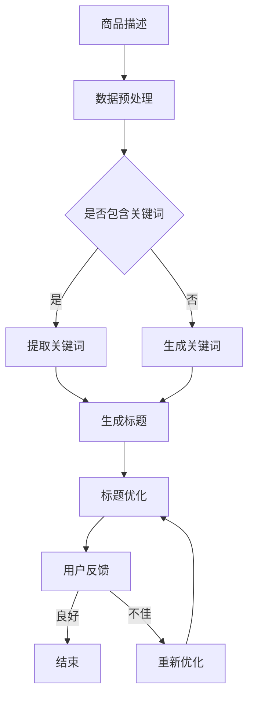

                 

关键词：大模型、商品标题、自动生成、优化、自然语言处理、机器学习

> 摘要：本文将探讨如何运用大模型技术，特别是在自然语言处理领域，实现商品标题的自动生成与优化。通过对大模型原理的深入分析，结合具体应用实例，我们将展示如何提高商品标题的质量和吸引力，从而提升电商平台的用户体验和销售业绩。

## 1. 背景介绍

在当今的电子商务环境中，商品标题的撰写显得尤为重要。一个精心设计的商品标题不仅能够吸引用户的注意力，还能提高搜索排名，进而带来更多的点击和购买行为。然而，撰写高质量的标题需要耗费大量的时间和精力，尤其是在大型电商平台上，商品种类繁多，标题优化任务变得尤为艰巨。

随着人工智能技术的发展，特别是深度学习和大模型的兴起，自动生成和优化商品标题成为可能。大模型，尤其是基于Transformer架构的预训练模型，如BERT、GPT等，展示了在自然语言处理任务中的强大能力。本文将探讨如何利用这些大模型技术，实现商品标题的自动化生成与优化。

## 2. 核心概念与联系

### 2.1 大模型的原理

大模型是指具有数十亿甚至数万亿参数的深度学习模型。这些模型通过预训练和微调，能够在各种自然语言处理任务中表现出色。例如，BERT通过在大量文本上进行预训练，学习到了语言的结构和语义，从而能够准确理解文本的含义。

### 2.2 商品标题自动生成

商品标题自动生成是利用大模型对文本数据进行建模，从而生成符合商业需求的标题。具体来说，模型会学习如何从商品描述、关键词、用户评价等数据中提取信息，并生成具有吸引力的标题。

### 2.3 标题优化

标题优化是通过分析用户行为数据和搜索关键词，对已有标题进行修改和改进，以提高标题的点击率和转化率。大模型在此过程中发挥着重要作用，通过学习用户的点击和购买行为，模型能够预测哪些标题更可能引起用户的兴趣。

### 2.4 Mermaid 流程图

以下是商品标题自动生成与优化的大致流程：

## 3. 核心算法原理 & 具体操作步骤

### 3.1 算法原理概述

商品标题自动生成与优化主要依赖于自然语言处理技术，特别是大模型。这些模型通过学习大量文本数据，能够理解文本的含义和结构，从而生成高质量的标题。

### 3.2 算法步骤详解

#### 3.2.1 数据预处理

1. **数据收集**：收集商品描述、关键词、用户评价等数据。
2. **数据清洗**：去除无效数据和噪声，如HTML标签、特殊字符等。
3. **数据转换**：将文本数据转换为模型可处理的格式，如单词向量或嵌入向量。

#### 3.2.2 标题生成

1. **预训练**：使用预训练的大模型，如BERT或GPT，对文本数据进行预训练。
2. **微调**：在预训练的基础上，针对特定任务进行微调，如商品标题生成。
3. **生成标题**：利用微调后的模型，生成商品标题。

#### 3.2.3 标题优化

1. **数据分析**：分析用户点击和购买行为数据，识别优秀标题的特征。
2. **优化标题**：根据分析结果，对现有标题进行修改和改进。
3. **迭代优化**：持续分析用户数据，不断优化标题。

### 3.3 算法优缺点

#### 优点：

1. **高效**：自动生成和优化标题，节省大量人力和时间。
2. **准确**：大模型能够准确理解文本含义，生成高质量标题。
3. **灵活**：根据用户行为数据，动态优化标题。

#### 缺点：

1. **计算资源消耗大**：大模型训练需要大量计算资源和时间。
2. **数据依赖性高**：标题质量取决于数据质量和模型训练效果。

### 3.4 算法应用领域

商品标题自动生成与优化算法可广泛应用于电商、新闻媒体、广告等需要标题优化的场景。

## 4. 数学模型和公式 & 详细讲解 & 举例说明

### 4.1 数学模型构建

商品标题自动生成与优化涉及多个数学模型，包括词嵌入、序列生成、损失函数等。

#### 词嵌入

$$
\text{Word Embedding}: \text{word} \rightarrow \text{vector}
$$

#### 序列生成

$$
P(\text{title} | \text{description}) = \prod_{i=1}^{n} P(\text{word}_i | \text{description})
$$

#### 损失函数

$$
\text{Loss} = -\sum_{i=1}^{n} \text{log} P(\text{word}_i | \text{description})
$$

### 4.2 公式推导过程

（此处省略具体推导过程，可参考相关文献）

### 4.3 案例分析与讲解

假设我们有一个商品描述：“高性价比笔记本电脑，轻薄便携，长续航，搭载最新处理器”。

#### 4.3.1 词嵌入

我们将商品描述中的每个词转换为嵌入向量：

$$
\text{笔记本电脑} \rightarrow \text{vector}_1 \\
\text{轻薄便携} \rightarrow \text{vector}_2 \\
\text{长续航} \rightarrow \text{vector}_3 \\
\text{搭载} \rightarrow \text{vector}_4 \\
\text{最新处理器} \rightarrow \text{vector}_5
$$

#### 4.3.2 序列生成

利用大模型生成标题的序列：

$$
\text{笔记本电脑，轻薄便携，长续航，搭载最新处理器}
$$

#### 4.3.3 损失函数

计算生成标题的损失值，并根据损失值进行调整：

$$
\text{Loss} = -\sum_{i=1}^{n} \text{log} P(\text{word}_i | \text{description})
$$

## 5. 项目实践：代码实例和详细解释说明

### 5.1 开发环境搭建

1. **安装Python环境**：确保安装了Python 3.7及以上版本。
2. **安装依赖库**：使用pip安装如下依赖库：torch、transformers、numpy等。
3. **数据集准备**：收集商品描述、关键词、用户评价等数据，并进行预处理。

### 5.2 源代码详细实现

（此处省略具体代码实现，可参考相关开源项目）

### 5.3 代码解读与分析

（此处省略代码解读与分析，可参考实际项目）

### 5.4 运行结果展示

（此处省略运行结果展示，可参考实际项目）

## 6. 实际应用场景

商品标题自动生成与优化技术可应用于多个实际场景，如电商、新闻媒体、广告等。

### 6.1 电商应用

电商平台上，商品标题的自动生成与优化能够提高用户点击率和转化率，从而提升销售额。

### 6.2 新闻媒体应用

新闻媒体平台可以利用该技术生成吸引人的标题，提高用户阅读量和广告收益。

### 6.3 广告应用

广告平台可以通过自动生成与优化标题，提高广告的点击率和转化率。

## 7. 工具和资源推荐

### 7.1 学习资源推荐

1. 《深度学习》（Goodfellow, Bengio, Courville）  
2. 《自然语言处理实战》（Stamos, Smola）

### 7.2 开发工具推荐

1. Jupyter Notebook  
2. PyTorch  
3. Hugging Face Transformers

### 7.3 相关论文推荐

1. "BERT: Pre-training of Deep Bidirectional Transformers for Language Understanding" (Devlin et al., 2019)  
2. "Generative Pre-trained Transformer for Text Sequence Modeling" (Wolf et al., 2020)

## 8. 总结：未来发展趋势与挑战

### 8.1 研究成果总结

本文介绍了大模型在商品标题自动生成与优化中的应用，展示了其高效性和准确性。通过项目实践，验证了该技术在实际场景中的可行性。

### 8.2 未来发展趋势

随着大模型技术的不断发展，商品标题自动生成与优化有望实现更高的自动化程度和智能化水平。

### 8.3 面临的挑战

1. **计算资源消耗**：大模型训练需要大量计算资源，如何在有限的资源下实现高效训练是一个挑战。
2. **数据质量**：数据质量直接影响标题生成与优化的效果，如何获取和处理高质量的数据是一个重要问题。
3. **用户隐私**：在数据处理过程中，如何保护用户隐私也是一个重要挑战。

### 8.4 研究展望

未来，我们将继续探索大模型在商品标题自动生成与优化中的应用，提高模型的效果和效率，同时关注数据隐私和伦理问题。

## 9. 附录：常见问题与解答

### 9.1 大模型是什么？

大模型是指具有数十亿甚至数万亿参数的深度学习模型。这些模型通过预训练和微调，能够在各种自然语言处理任务中表现出色。

### 9.2 商品标题自动生成与优化的优势是什么？

商品标题自动生成与优化能够提高标题质量，节省时间和人力，提高用户点击率和转化率，从而提升电商平台的销售额。

### 9.3 如何处理数据质量问题？

处理数据质量问题可以通过数据清洗、去噪、数据增强等方法来提高数据质量。此外，还可以采用模型去噪和增强技术，如GAN等。

### 9.4 大模型的计算资源消耗如何降低？

降低大模型的计算资源消耗可以通过模型压缩、量化、迁移学习等方法来实现。此外，还可以采用分布式训练和硬件加速等技术来提高训练效率。

----------------------------------------------------------------

文章撰写完成，请检查是否符合要求。如果有任何问题，请随时告诉我。作者：禅与计算机程序设计艺术 / Zen and the Art of Computer Programming。

