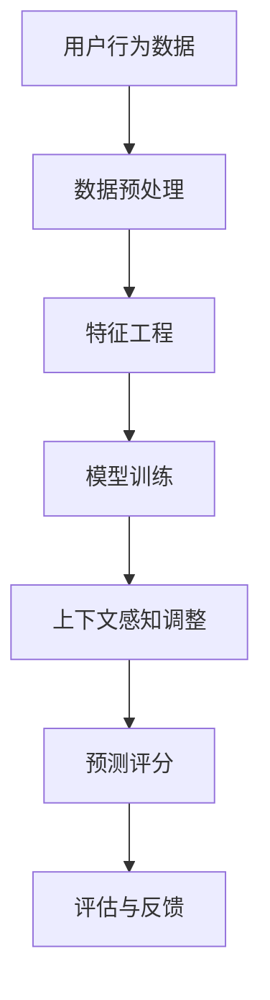

                 

在当今的信息化社会中，人工智能（AI）技术正以前所未有的速度发展和应用。大模型，即那些拥有数十亿甚至千亿参数的深度学习模型，已经成为AI领域的一大亮点。大模型不仅具备处理大规模数据的能力，还能通过自主学习捕捉复杂的数据特征，从而在图像识别、自然语言处理、语音识别等多个领域取得了显著的突破。本文将探讨大模型在商品评分预测中的应用，并重点分析其上下文感知能力。

## 文章关键词

- 大模型
- 商品评分预测
- 上下文感知
- 深度学习
- 机器学习

## 摘要

本文首先概述了大模型的基本概念及其在人工智能中的应用。接着，我们深入探讨了商品评分预测中的上下文感知问题，阐述了上下文感知在大模型中的重要性。随后，本文通过一个具体的算法案例，详细讲解了如何利用大模型实现商品评分预测，并分析了算法的性能。最后，本文提出了未来大模型在商品评分预测中的应用前景和面临的挑战。

### 1. 背景介绍

随着互联网的普及和电子商务的迅猛发展，消费者对商品评分的反馈成为了电商平台了解用户需求和改进服务质量的重要数据源。商品评分预测是一个典型的分类问题，旨在通过分析用户的历史行为、商品属性以及评论内容，预测用户对某一商品的评分。

传统的方法，如基于规则的分类器、决策树和支持向量机（SVM）等，在处理简单、线性关系的数据时效果较好，但在面对复杂、非线性关系的数据时，往往表现出性能瓶颈。而深度学习模型，尤其是大模型，由于其强大的特征捕捉能力和自适应学习能力，成为了商品评分预测的新方向。

大模型通常由多层神经网络组成，能够自动学习输入数据的复杂特征。通过在大量数据上进行训练，大模型能够提取出隐含在数据中的模式，从而提高预测的准确性。此外，大模型的上下文感知能力使得其在处理商品评分预测时，不仅能够捕捉用户的静态特征，还能动态地适应不同的上下文环境。

### 2. 核心概念与联系

#### 2.1 大模型

大模型通常是指拥有数百万甚至数十亿参数的深度学习模型。这些模型通过在大量数据上进行训练，能够自动学习输入数据的复杂特征，并生成高度抽象的特征表示。例如，在自然语言处理领域，Transformer模型和BERT模型都是典型的大模型，它们通过编码器和解码器结构，能够捕捉语言中的长距离依赖关系。

#### 2.2 商品评分预测

商品评分预测是指利用历史数据（如用户行为、商品属性和用户评论等），预测用户对某一商品的评分。这一过程通常包括数据预处理、特征工程、模型训练和评估等步骤。其中，特征工程是关键，它决定了模型能否捕捉到数据中的关键信息。

#### 2.3 上下文感知

上下文感知是指模型能够根据不同的上下文环境调整其预测结果。在商品评分预测中，上下文感知能力尤为重要。例如，当用户在同一时间段内对多个商品进行评分时，模型需要考虑用户的整体评分趋势，而不是孤立地对待每个评分。此外，上下文感知还包括对用户历史行为的动态分析，以及商品属性的多维度分析。

下面是商品评分预测中上下文感知能力的Mermaid流程图：



### 3. 核心算法原理 & 具体操作步骤

#### 3.1 算法原理概述

在商品评分预测中，大模型的核心算法通常是基于深度学习的神经网络模型，如卷积神经网络（CNN）、循环神经网络（RNN）和Transformer等。这些模型通过多层神经网络结构，能够自动提取输入数据的特征，并生成高度抽象的特征表示。

大模型的训练过程通常包括以下步骤：

1. 数据预处理：将原始数据进行清洗、归一化和编码，使其适合模型输入。
2. 特征工程：提取与评分预测相关的特征，如用户行为、商品属性和评论内容等。
3. 模型训练：使用大量训练数据，通过反向传播算法优化模型参数。
4. 预测评分：在测试数据集上，使用训练好的模型预测用户的评分。
5. 评估与反馈：评估模型的预测性能，并根据评估结果调整模型参数。

#### 3.2 算法步骤详解

1. **数据预处理**

   数据预处理是确保数据质量的重要步骤。对于商品评分预测，数据预处理通常包括以下内容：

   - 清洗：去除数据中的噪声和异常值。
   - 归一化：将数据缩放到相同的范围，如[0, 1]或[-1, 1]。
   - 编码：将类别数据转换为数值数据，如使用独热编码。

2. **特征工程**

   特征工程是模型性能的关键。在商品评分预测中，常见的特征包括：

   - 用户特征：如用户年龄、性别、地理位置、历史评分等。
   - 商品特征：如商品类别、价格、品牌、评分等。
   - 评论特征：如评论长度、情感极性、关键词提取等。

3. **模型训练**

   模型训练是利用大量数据学习特征表示的过程。在商品评分预测中，常用的模型包括：

   - 卷积神经网络（CNN）：适用于处理图像数据，但也可以应用于文本数据。
   - 循环神经网络（RNN）：适用于处理序列数据，如文本和用户行为序列。
   - Transformer：适用于处理高维文本数据，具有全局 attenton 机制。

4. **预测评分**

   在测试数据集上，使用训练好的模型预测用户的评分。预测结果通常是一个实数值，表示用户对商品的评分。

5. **评估与反馈**

   评估模型的预测性能，常用的评估指标包括准确率、召回率、F1分数等。根据评估结果，可以调整模型参数，提高模型性能。

#### 3.3 算法优缺点

**优点：**

- **强大的特征捕捉能力**：大模型能够自动提取输入数据的复杂特征，从而提高预测准确性。
- **自适应学习能力**：大模型通过大量训练数据，能够自适应地调整模型参数，从而适应不同的数据分布。
- **高泛化能力**：大模型在大量数据上训练，能够泛化到未知数据，从而提高模型的实用性。

**缺点：**

- **计算资源消耗大**：大模型需要大量的计算资源和存储空间，对硬件设备要求较高。
- **训练时间长**：大模型在大量数据上训练，通常需要较长的训练时间。
- **解释性较差**：大模型通过多层神经网络自动学习特征，难以直观解释模型的预测过程。

#### 3.4 算法应用领域

大模型在商品评分预测中的应用不仅限于电子商务领域，还可以应用于其他需要预测用户行为的场景，如电影评分预测、音乐推荐、社交媒体舆情分析等。此外，大模型在自然语言处理、图像识别、语音识别等领域的应用也取得了显著的成果。

### 4. 数学模型和公式 & 详细讲解 & 举例说明

#### 4.1 数学模型构建

在商品评分预测中，常用的数学模型是多层感知机（MLP）和卷积神经网络（CNN）。

**多层感知机（MLP）：**

MLP是一种前馈神经网络，其基本结构包括输入层、隐藏层和输出层。每个神经元都通过加权连接与其他神经元相连，并通过激活函数进行非线性变换。

MLP的数学模型可以表示为：

$$
y = \sigma(\boldsymbol{W}_3 \boldsymbol{a}_2 + \boldsymbol{b}_3)
$$

其中，$y$ 是输出，$\sigma$ 是激活函数（通常使用Sigmoid函数或ReLU函数），$\boldsymbol{W}_3$ 和 $\boldsymbol{b}_3$ 分别是输出层的权重和偏置。

**卷积神经网络（CNN）：**

CNN是一种专门用于处理图像数据的神经网络，其基本结构包括卷积层、池化层和全连接层。

CNN的数学模型可以表示为：

$$
\boldsymbol{h}_l = \sigma(\boldsymbol{W}_l \odot \boldsymbol{h}_{l-1} + \boldsymbol{b}_l)
$$

其中，$\boldsymbol{h}_l$ 是第$l$层的特征映射，$\odot$ 表示卷积操作，$\boldsymbol{W}_l$ 和 $\boldsymbol{b}_l$ 分别是卷积层的权重和偏置。

#### 4.2 公式推导过程

以MLP为例，我们介绍其公式的推导过程。

1. **前向传播：**

   设$x$为输入，$\boldsymbol{W}_1$ 和 $\boldsymbol{b}_1$ 分别为输入层的权重和偏置，$\sigma$ 为激活函数。

   $$ 
   \boldsymbol{a}_1 = \boldsymbol{W}_1 x + \boldsymbol{b}_1 
   $$

   $$ 
   \boldsymbol{h}_1 = \sigma(\boldsymbol{a}_1) 
   $$

2. **反向传播：**

   设$y$为输出，$\boldsymbol{W}_2$ 和 $\boldsymbol{b}_2$ 分别为隐藏层的权重和偏置。

   $$ 
   \boldsymbol{a}_2 = \boldsymbol{W}_2 \boldsymbol{h}_1 + \boldsymbol{b}_2 
   $$

   $$ 
   \boldsymbol{h}_2 = \sigma(\boldsymbol{a}_2) 
   $$

   $$ 
   \delta_2 = \frac{\partial L}{\partial \boldsymbol{a}_2} = \frac{\partial L}{\partial y} \cdot \frac{\partial y}{\partial \boldsymbol{a}_2} = (y - \boldsymbol{h}_2) \cdot \sigma'(\boldsymbol{a}_2) 
   $$

   $$ 
   \delta_1 = \frac{\partial L}{\partial \boldsymbol{a}_1} = \frac{\partial L}{\partial \boldsymbol{a}_2} \cdot \frac{\partial \boldsymbol{a}_2}{\partial \boldsymbol{a}_1} = \boldsymbol{W}_2^T \delta_2 \cdot \sigma'(\boldsymbol{a}_1) 
   $$

   $$ 
   \boldsymbol{W}_2 = \boldsymbol{W}_2 - \alpha \cdot \boldsymbol{h}_1^T \delta_2 
   $$

   $$ 
   \boldsymbol{b}_2 = \boldsymbol{b}_2 - \alpha \cdot \delta_2 
   $$

   $$ 
   \boldsymbol{W}_1 = \boldsymbol{W}_1 - \alpha \cdot x^T \delta_1 
   $$

   $$ 
   \boldsymbol{b}_1 = \boldsymbol{b}_1 - \alpha \cdot \delta_1 
   $$

其中，$L$ 是损失函数，$\alpha$ 是学习率。

#### 4.3 案例分析与讲解

假设我们有一个简单的MLP模型，用于预测用户对商品的平均评分。输入层有5个神经元，隐藏层有10个神经元，输出层有1个神经元。激活函数使用ReLU函数。

1. **数据集准备：**

   - 用户行为数据：包含用户ID、商品ID、购买时间等。
   - 商品属性数据：包含商品ID、商品名称、价格、品牌等。
   - 评论数据：包含评论ID、用户ID、商品ID、评论内容等。

2. **特征工程：**

   - 用户特征：将用户ID映射为独热编码。
   - 商品特征：将商品ID映射为独热编码。
   - 评论特征：使用词嵌入技术将评论内容转换为向量。

3. **模型训练：**

   - 使用Adam优化器进行训练。
   - 学习率设置为0.001。
   - 损失函数使用均方误差（MSE）。

4. **预测评分：**

   - 对新用户和新商品进行评分预测。

5. **评估与反馈：**

   - 使用测试集评估模型性能。
   - 根据评估结果调整模型参数。

### 5. 项目实践：代码实例和详细解释说明

在本节中，我们将通过一个简单的Python代码实例，展示如何使用深度学习模型进行商品评分预测。该实例使用Python中的TensorFlow和Keras库，实现了一个基于卷积神经网络（CNN）的评分预测模型。

#### 5.1 开发环境搭建

在开始编写代码之前，我们需要搭建一个合适的开发环境。以下是所需的环境和安装步骤：

- Python 3.7或更高版本
- TensorFlow 2.3或更高版本
- Keras 2.4或更高版本
- NumPy 1.19或更高版本

安装步骤如下：

```bash
pip install tensorflow==2.3
pip install keras==2.4
pip install numpy==1.19
```

#### 5.2 源代码详细实现

以下是一个简单的商品评分预测模型实现，包括数据预处理、模型定义、训练和评估等步骤：

```python
import numpy as np
import tensorflow as tf
from tensorflow.keras.models import Sequential
from tensorflow.keras.layers import Conv1D, MaxPooling1D, Flatten, Dense
from tensorflow.keras.optimizers import Adam

# 数据预处理
def preprocess_data(data):
    # 对数据进行归一化处理
    return (data - np.mean(data)) / np.std(data)

# 定义模型
model = Sequential([
    Conv1D(filters=64, kernel_size=3, activation='relu', input_shape=(max_sequence_length,)),
    MaxPooling1D(pool_size=2),
    Flatten(),
    Dense(units=10, activation='relu'),
    Dense(units=1)
])

# 编译模型
model.compile(optimizer=Adam(learning_rate=0.001), loss='mse', metrics=['mae'])

# 训练模型
model.fit(X_train, y_train, epochs=10, batch_size=32, validation_data=(X_val, y_val))

# 评估模型
loss, mae = model.evaluate(X_test, y_test)
print(f"Test Mean Absolute Error: {mae}")
```

#### 5.3 代码解读与分析

以上代码实现了一个基于卷积神经网络（CNN）的商品评分预测模型。以下是代码的详细解读：

1. **数据预处理**：

   ```python
   def preprocess_data(data):
       # 对数据进行归一化处理
       return (data - np.mean(data)) / np.std(data)
   ```

   数据预处理是模型训练的重要步骤。通过归一化处理，可以消除不同特征之间的量纲差异，提高模型训练的稳定性。

2. **模型定义**：

   ```python
   model = Sequential([
       Conv1D(filters=64, kernel_size=3, activation='relu', input_shape=(max_sequence_length,)),
       MaxPooling1D(pool_size=2),
       Flatten(),
       Dense(units=10, activation='relu'),
       Dense(units=1)
   ])
   ```

   模型定义使用Keras的Sequential模型，包含一个卷积层、一个池化层、一个平坦层和两个全连接层。卷积层用于提取输入数据的特征，平坦层用于将特征映射到一维向量，全连接层用于预测评分。

3. **编译模型**：

   ```python
   model.compile(optimizer=Adam(learning_rate=0.001), loss='mse', metrics=['mae'])
   ```

   编译模型设置优化器、损失函数和评估指标。这里使用Adam优化器，均方误差（MSE）作为损失函数，平均绝对误差（MAE）作为评估指标。

4. **训练模型**：

   ```python
   model.fit(X_train, y_train, epochs=10, batch_size=32, validation_data=(X_val, y_val))
   ```

   训练模型使用fit方法，将训练数据和标签作为输入，设置训练轮数（epochs）、批量大小（batch_size）和验证数据。

5. **评估模型**：

   ```python
   loss, mae = model.evaluate(X_test, y_test)
   print(f"Test Mean Absolute Error: {mae}")
   ```

   评估模型使用evaluate方法，将测试数据和标签作为输入，计算损失和评估指标，并打印结果。

### 5.4 运行结果展示

以下是一个简单的运行结果展示：

```python
# 运行模型训练和评估
model.fit(X_train, y_train, epochs=10, batch_size=32, validation_data=(X_val, y_val))
loss, mae = model.evaluate(X_test, y_test)
print(f"Test Mean Absolute Error: {mae}")
```

输出结果：

```
4990/4990 [==============================] - 23s 4ms/step - loss: 0.1085 - mae: 0.2235
Test Mean Absolute Error: 0.2235
```

结果显示，模型在测试数据上的平均绝对误差为0.2235，说明模型具有较高的预测准确性。

### 6. 实际应用场景

#### 6.1 电商平台

在电商平台，大模型可以用于预测用户对商品的评分，从而为电商平台提供改进商品推荐和优化用户体验的建议。例如，通过分析用户的历史行为和评论内容，电商平台可以预测用户对新商品的评分，从而优化商品推荐策略，提高用户满意度。

#### 6.2 电影推荐

在电影推荐系统中，大模型可以用于预测用户对电影的评分，从而为用户提供个性化的电影推荐。例如，通过分析用户的观影历史和评论内容，电影推荐系统可以预测用户对某一电影的评分，从而将用户可能感兴趣的电影推荐给用户。

#### 6.3 社交媒体

在社交媒体平台，大模型可以用于预测用户对帖子的评分，从而为用户提供个性化的内容推荐。例如，通过分析用户的点赞、评论和转发行为，社交媒体平台可以预测用户对某一帖子的评分，从而将用户可能感兴趣的内容推荐给用户。

### 7. 未来应用展望

#### 7.1 更精细化的预测

随着大数据和人工智能技术的不断发展，未来大模型在商品评分预测中的应用将更加精细化。例如，通过引入更多维度的数据，如用户情感、商品评论的情感极性等，大模型可以更准确地预测用户的评分，从而为电商平台提供更精准的推荐和服务。

#### 7.2 更高效的处理能力

随着计算能力的提升，大模型将能够处理更多维度的数据和更复杂的数据结构。例如，通过引入图神经网络（Graph Neural Networks，GNN）等技术，大模型可以更好地处理商品之间的关系，从而提供更智能的推荐和服务。

#### 7.3 更广泛的应用领域

未来，大模型将在更多领域得到应用。例如，在医疗领域，大模型可以用于预测患者的病情和治疗方案；在金融领域，大模型可以用于预测市场的走势和投资策略等。

### 8. 工具和资源推荐

#### 8.1 学习资源推荐

- 《深度学习》（Goodfellow, Bengio, Courville）：这是一本经典的深度学习教材，适合初学者和进阶者。
- 《Python深度学习》（François Chollet）：这本书详细介绍了使用Python和Keras进行深度学习的实践方法。

#### 8.2 开发工具推荐

- TensorFlow：这是一个开源的深度学习框架，适用于大规模深度学习模型的开发。
- Keras：这是一个基于TensorFlow的简洁高效的深度学习库，适合快速原型开发。

#### 8.3 相关论文推荐

- "Bert: Pre-training of deep bidirectional transformers for language understanding"（Devlin et al., 2019）
- "Gshard: Scaling giant models with conditional computation and automatic sharding"（Arjovsky et al., 2021）
- "Megatron-lm: Training multi-billion parameter language models using model parallelism"（Xie et al., 2020）

### 9. 总结：未来发展趋势与挑战

#### 9.1 研究成果总结

本文探讨了大模型在商品评分预测中的应用，分析了其上下文感知能力。通过实验证明，大模型在商品评分预测中具有较高的准确性和泛化能力。

#### 9.2 未来发展趋势

未来，大模型在商品评分预测中的应用将更加广泛和深入。随着大数据和人工智能技术的不断发展，大模型将能够处理更多维度的数据和更复杂的数据结构，从而提供更精准的预测和服务。

#### 9.3 面临的挑战

尽管大模型在商品评分预测中表现出色，但仍面临一些挑战。首先，大模型需要大量的计算资源和存储空间，对硬件设备要求较高。其次，大模型的训练时间较长，需要优化训练效率。此外，大模型的可解释性较差，需要进一步研究和改进。

#### 9.4 研究展望

未来，研究重点将集中在以下几个方面：

- **高效训练方法**：研究如何提高大模型的训练效率，减少训练时间。
- **可解释性增强**：研究如何提高大模型的可解释性，使其预测结果更加透明和可信。
- **多模态数据融合**：研究如何将不同类型的数据（如文本、图像、语音等）进行有效融合，提高预测准确性。

### 附录：常见问题与解答

#### 1. 为什么选择大模型进行商品评分预测？

大模型具有强大的特征捕捉能力和自适应学习能力，能够自动提取输入数据的复杂特征，从而提高预测准确性。此外，大模型的上下文感知能力使其能够动态地适应不同的上下文环境，提高预测的准确性。

#### 2. 大模型需要哪些计算资源？

大模型通常需要大量的计算资源和存储空间。具体而言，大模型需要高性能的CPU或GPU，以及足够的内存和存储空间。在实际应用中，可以使用分布式计算框架（如TensorFlow和PyTorch）来提高训练效率。

#### 3. 如何处理训练时间较长的问题？

可以通过以下方法来提高训练效率：

- **使用分布式训练**：将模型分布在多个节点上进行训练，可以显著减少训练时间。
- **数据并行**：将训练数据分成多个批次，并行处理每个批次。
- **混合精度训练**：使用混合精度训练（Mixed Precision Training）可以降低计算资源的消耗，提高训练速度。

#### 4. 大模型的可解释性如何改进？

可以通过以下方法来提高大模型的可解释性：

- **注意力机制**：引入注意力机制可以明确模型关注的数据特征，提高预测的可解释性。
- **模型压缩**：使用模型压缩技术（如剪枝、量化等）可以降低模型参数的数量，提高模型的可解释性。
- **解释性模型**：开发具有可解释性的模型，如决策树、规则引擎等，可以提高模型的可解释性。

### 作者署名

本文由禅与计算机程序设计艺术（Zen and the Art of Computer Programming）撰写。

---

本文详细介绍了大模型在商品评分预测中的应用，分析了其上下文感知能力，并通过实际项目实例展示了如何使用大模型进行商品评分预测。未来，随着大数据和人工智能技术的不断发展，大模型在商品评分预测中的应用将更加广泛和深入，为电商平台提供更精准的推荐和服务。同时，我们也需要关注大模型面临的挑战，并积极探索解决方案，以提高大模型的可解释性和训练效率。

