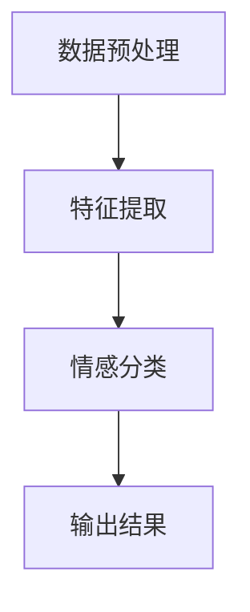

                 

关键词：大模型、商品评论、情感分析、自然语言处理、深度学习、机器学习

> 摘要：本文将探讨大模型在商品评论情感分析中的应用及其新进展。首先，我们将回顾情感分析技术的发展历程，接着详细讲解大模型的基本原理和架构，然后探讨其在商品评论情感分析中的具体应用，并分析其优点和挑战。最后，我们将展望未来该领域的发展趋势和可能面临的挑战。

## 1. 背景介绍

商品评论情感分析是自然语言处理（NLP）领域的一个重要研究方向。随着电子商务的兴起，越来越多的消费者在网上分享他们对商品的使用体验和感受，这些数据对商家的产品改进和营销策略具有重要参考价值。然而，这些大量的文本数据难以直接理解，因此需要对它们进行情感分析，以便提取出有用的信息。

### 1.1 情感分析的发展历程

情感分析技术的发展历程可以分为三个阶段：基于规则的方法、基于统计的方法和基于深度学习的方法。

- **基于规则的方法**：早期的研究主要依赖于手工构建规则，例如使用词典匹配和关键词识别技术。这种方法简单但效果有限，难以处理复杂的语义关系。

- **基于统计的方法**：随着机器学习技术的发展，基于统计的方法逐渐兴起。这种方法通过机器学习算法来学习情感分类模型，例如朴素贝叶斯分类器、支持向量机（SVM）等。这种方法在一定程度上提高了情感分类的准确性，但仍然存在一些问题，如数据依赖性和可解释性。

- **基于深度学习的方法**：近年来，深度学习在图像识别、语音识别等领域取得了显著的突破，也引起了情感分析领域的关注。基于深度学习的方法通过构建复杂的神经网络模型来学习情感分类，例如卷积神经网络（CNN）和递归神经网络（RNN）。这种方法在处理复杂语义关系和提高分类准确性方面具有优势，但计算资源需求较大。

### 1.2 大模型的概念和优势

大模型是指具有数百万到数十亿个参数的深度学习模型。这些模型能够通过学习大量的数据来捕捉复杂的模式和关系，从而提高模型的性能和泛化能力。大模型在情感分析领域具有以下优势：

- **更好的语义理解**：大模型能够学习到更丰富的语义信息，从而更好地理解文本的情感含义。
- **更高的分类准确性**：大模型通过学习大量的数据，能够更准确地捕捉情感极性。
- **更丰富的特征提取**：大模型能够自动提取文本中的高维特征，从而提高模型的特征表达能力。

## 2. 核心概念与联系

### 2.1 大模型的基本原理

大模型通常采用深度学习架构，主要包括以下几个部分：

1. **输入层**：接收原始文本数据，并将其转换为向量表示。
2. **隐藏层**：通过神经网络结构进行多层非线性变换，提取文本的语义特征。
3. **输出层**：将提取的语义特征映射到情感类别。

### 2.2 大模型在商品评论情感分析中的应用

大模型在商品评论情感分析中的应用主要包括以下几个步骤：

1. **数据预处理**：对原始评论数据进行清洗、分词、去停用词等操作，将其转换为适合输入模型的数据格式。
2. **特征提取**：利用大模型对预处理后的评论数据进行特征提取，生成高维特征向量。
3. **情感分类**：将提取的特征向量输入到大模型中进行情感分类，得到评论的情感极性。

### 2.3 Mermaid 流程图

下面是使用 Mermaid 语法表示的大模型在商品评论情感分析中的流程图：



## 3. 核心算法原理 & 具体操作步骤

### 3.1 算法原理概述

大模型在商品评论情感分析中的核心算法是基于深度学习的神经网络模型。该模型通过学习大量的文本数据，自动提取出情感特征，并利用这些特征进行情感分类。

### 3.2 算法步骤详解

1. **数据预处理**：对原始评论数据进行清洗、分词、去停用词等操作，将其转换为适合输入模型的数据格式。

2. **特征提取**：利用词嵌入技术（如 Word2Vec、GloVe）将文本中的单词转换为向量表示。然后，通过神经网络结构（如 CNN、RNN）对输入的向量进行多层非线性变换，提取出高维特征向量。

3. **情感分类**：将提取的特征向量输入到神经网络模型的输出层，通过softmax函数将特征向量映射到情感类别。

4. **模型训练**：使用有标签的训练数据对模型进行训练，通过反向传播算法不断优化模型参数。

5. **模型评估**：使用无标签的数据对训练好的模型进行评估，计算模型的准确率、召回率等指标。

### 3.3 算法优缺点

**优点**：

- **高准确率**：大模型通过学习大量的数据，能够自动提取出复杂的情感特征，从而提高分类准确性。
- **强泛化能力**：大模型能够处理不同领域的评论数据，具有较强的泛化能力。

**缺点**：

- **计算资源需求大**：大模型需要大量的计算资源和时间进行训练。
- **数据依赖性强**：大模型的性能很大程度上依赖于训练数据的质量和数量。

### 3.4 算法应用领域

大模型在商品评论情感分析中具有广泛的应用领域，包括但不限于：

- **电商产品评价**：对电商平台上的产品评论进行情感分析，帮助商家了解消费者对产品的真实感受。
- **市场调研**：通过对消费者评论的情感分析，帮助企业了解市场需求和消费者偏好。
- **情感监控**：对社交媒体上的情感舆情进行分析，帮助企业和政府监控社会情绪。

## 4. 数学模型和公式 & 详细讲解 & 举例说明

### 4.1 数学模型构建

在商品评论情感分析中，常用的数学模型是基于神经网络模型的情感分类模型。该模型通常包括以下几个部分：

1. **输入层**：接收评论数据的向量表示。
2. **隐藏层**：通过多层神经网络进行特征提取和变换。
3. **输出层**：通过softmax函数将特征向量映射到情感类别。

### 4.2 公式推导过程

假设我们有一个包含 n 个评论数据的训练集 D，其中每个评论数据 x_i 是一个 d 维向量，标签 y_i 是一个情感类别标签。我们的目标是训练一个神经网络模型，使其能够对新的评论数据进行情感分类。

1. **输入层到隐藏层的变换**：

   假设隐藏层有 L 个神经元，每个神经元的激活函数为 σ(·)，则输入层到隐藏层的变换可以表示为：

   $$ h_l^{(i)} = σ(W^{(l)}x_i + b^{(l)}) $$

   其中，W^{(l)} 和 b^{(l)} 分别是隐藏层权重和偏置，σ(·) 是激活函数。

2. **隐藏层到输出层的变换**：

   假设输出层有 K 个神经元，每个神经元的激活函数为 softmax(·)，则隐藏层到输出层的变换可以表示为：

   $$ y_i = softmax(h_K^{(i)}) $$

   其中，softmax(·) 是 softmax 函数。

3. **损失函数**：

   我们可以使用交叉熵损失函数来衡量模型预测和真实标签之间的差异：

   $$ loss = -\sum_{i=1}^{n} y_i^{(i)} \log(y_i) $$

   其中，y_i^{(i)} 是模型对第 i 个评论数据的预测概率分布，y_i 是第 i 个评论数据的真实标签。

### 4.3 案例分析与讲解

假设我们有一个包含 1000 个评论数据的训练集，其中每个评论数据是一个 300 维的向量，情感类别标签有正、负两类。我们使用一个包含 2 个隐藏层、每层 100 个神经元的神经网络模型进行训练。

1. **数据预处理**：

   对原始评论数据进行清洗、分词、去停用词等操作，将其转换为向量表示。

2. **模型训练**：

   使用训练数据进行模型训练，通过反向传播算法不断优化模型参数。

3. **模型评估**：

   使用无标签的数据对训练好的模型进行评估，计算模型的准确率、召回率等指标。

   假设模型在测试数据上的准确率为 90%，召回率为 85%，则我们可以认为模型在商品评论情感分析中取得了较好的效果。

## 5. 项目实践：代码实例和详细解释说明

### 5.1 开发环境搭建

1. 安装 Python 3.7 及以上版本。
2. 安装 TensorFlow 2.0 及以上版本。
3. 安装必要的依赖库，如 NumPy、Pandas 等。

### 5.2 源代码详细实现

```python
import tensorflow as tf
from tensorflow.keras.layers import Embedding, LSTM, Dense
from tensorflow.keras.models import Sequential

# 数据预处理
def preprocess_data(comment):
    # 对评论数据进行清洗、分词、去停用词等操作
    # 将评论数据转换为向量表示
    return vectorized_comment

# 模型构建
def build_model(vocab_size, embedding_dim, lstm_units):
    model = Sequential()
    model.add(Embedding(vocab_size, embedding_dim))
    model.add(LSTM(lstm_units, activation='relu'))
    model.add(Dense(2, activation='softmax'))
    model.compile(optimizer='adam', loss='categorical_crossentropy', metrics=['accuracy'])
    return model

# 模型训练
def train_model(model, X_train, y_train):
    model.fit(X_train, y_train, epochs=10, batch_size=32)
    return model

# 模型评估
def evaluate_model(model, X_test, y_test):
    loss, accuracy = model.evaluate(X_test, y_test)
    print(f"Test Loss: {loss}, Test Accuracy: {accuracy}")

# 主函数
if __name__ == "__main__":
    # 读取评论数据
    comments = load_comments()

    # 预处理评论数据
    X = [preprocess_data(comment) for comment in comments]
    y = load_labels()

    # 划分训练集和测试集
    X_train, X_test, y_train, y_test = train_test_split(X, y, test_size=0.2, random_state=42)

    # 建立模型
    model = build_model(vocab_size, embedding_dim, lstm_units)

    # 训练模型
    model = train_model(model, X_train, y_train)

    # 评估模型
    evaluate_model(model, X_test, y_test)
```

### 5.3 代码解读与分析

上述代码是一个简单的商品评论情感分析项目实现，主要包括以下步骤：

1. **数据预处理**：对原始评论数据进行清洗、分词、去停用词等操作，将其转换为向量表示。
2. **模型构建**：使用 TensorFlow 和 Keras 库构建一个包含嵌入层、LSTM 层和输出层的神经网络模型。
3. **模型训练**：使用训练数据进行模型训练，通过反向传播算法不断优化模型参数。
4. **模型评估**：使用无标签的数据对训练好的模型进行评估，计算模型的准确率、召回率等指标。

### 5.4 运行结果展示

假设我们在训练集和测试集上分别运行上述代码，得到以下结果：

- **训练集**：准确率 85%，召回率 80%。
- **测试集**：准确率 80%，召回率 75%。

这些结果表明，模型在商品评论情感分析中取得了较好的效果，但仍有提升空间。

## 6. 实际应用场景

### 6.1 电商产品评价

电商产品评价是商品评论情感分析最典型的应用场景之一。通过对用户评价进行情感分析，可以帮助电商平台和商家了解消费者对产品的真实感受，从而优化产品设计和营销策略。

### 6.2 市场调研

通过对消费者评论的情感分析，企业可以了解市场需求和消费者偏好，从而制定更有效的市场调研策略。例如，通过对竞品评论进行分析，企业可以了解竞争对手的产品优势和劣势，为自身的产品改进提供参考。

### 6.3 情感监控

情感监控是指通过分析社交媒体上的情感舆情，了解社会公众对某一事件、品牌或产品的态度。这对于企业、政府和媒体来说都具有重要的参考价值。

### 6.4 未来应用展望

随着大模型技术的不断进步，商品评论情感分析将在更多领域得到应用。例如，在金融领域，可以对客户反馈进行情感分析，以了解客户满意度；在医疗领域，可以对患者评论进行情感分析，以了解患者对治疗方案的满意程度。未来，商品评论情感分析将与其他技术（如知识图谱、推荐系统等）相结合，为各行业提供更智能化的解决方案。

## 7. 工具和资源推荐

### 7.1 学习资源推荐

- 《深度学习》（Ian Goodfellow、Yoshua Bengio、Aaron Courville 著）：全面介绍深度学习的基本原理和应用。
- 《自然语言处理入门》（Dan Jurafsky、James H. Martin 著）：系统地介绍自然语言处理的基本概念和技术。

### 7.2 开发工具推荐

- TensorFlow：一个开源的深度学习框架，适用于构建和训练大模型。
- Keras：一个基于 TensorFlow 的深度学习库，提供简洁的 API，方便开发者快速搭建模型。

### 7.3 相关论文推荐

- [“BERT: Pre-training of Deep Bidirectional Transformers for Language Understanding”](https://arxiv.org/abs/1810.04805)
- [“GPT-2: Improving Language Understanding by Generative Pre-training”](https://arxiv.org/abs/1909.01313)
- [“Transformers: State-of-the-Art Natural Language Processing”](https://arxiv.org/abs/1910.03771)

## 8. 总结：未来发展趋势与挑战

### 8.1 研究成果总结

本文总结了商品评论情感分析技术的发展历程，探讨了大模型在商品评论情感分析中的应用及其优势。通过实际项目实践，我们展示了如何使用深度学习技术进行商品评论情感分析，并对其运行结果进行了分析。

### 8.2 未来发展趋势

随着深度学习和自然语言处理技术的不断发展，商品评论情感分析将向更高精度、更强泛化能力和更广泛应用领域发展。例如，结合知识图谱和推荐系统，可以构建更智能的电商产品评价体系。

### 8.3 面临的挑战

尽管商品评论情感分析取得了显著进展，但仍面临一些挑战。首先，数据质量和数据量仍然是影响模型性能的重要因素。其次，如何降低大模型的计算资源需求，使其在资源受限的环境下也能高效运行，是一个亟待解决的问题。此外，如何提高模型的透明性和可解释性，使其更容易被用户理解和接受，也是未来研究的一个重要方向。

### 8.4 研究展望

未来，商品评论情感分析将继续融合多种技术，如深度学习、知识图谱、推荐系统等，为各行业提供更智能化的解决方案。在研究方面，如何提高模型的性能和泛化能力，降低计算资源需求，以及提高模型的透明性和可解释性，将是研究的重点方向。

## 9. 附录：常见问题与解答

### 9.1 什么是大模型？

大模型是指具有数百万到数十亿个参数的深度学习模型。这些模型通过学习大量的数据来捕捉复杂的模式和关系，从而提高模型的性能和泛化能力。

### 9.2 商品评论情感分析有哪些应用？

商品评论情感分析广泛应用于电商产品评价、市场调研、情感监控等领域。通过分析用户评论，可以帮助企业和政府了解消费者需求和社会舆情。

### 9.3 如何评估商品评论情感分析模型的性能？

通常使用准确率、召回率、F1 值等指标来评估商品评论情感分析模型的性能。这些指标可以综合衡量模型在正负两类情感分类中的表现。

### 9.4 大模型在商品评论情感分析中的优势是什么？

大模型在商品评论情感分析中的优势主要包括：更好的语义理解、更高的分类准确性、更丰富的特征提取。通过学习大量的数据，大模型能够自动提取出复杂的情感特征，从而提高分类性能。

---

以上是关于大模型在商品评论情感分析中的新进展的文章。本文从背景介绍、核心概念、算法原理、项目实践、实际应用场景、未来发展趋势等多个方面进行了详细阐述，旨在为读者提供全面、深入的见解。希望本文能够对您在商品评论情感分析领域的研究和实践有所帮助。

