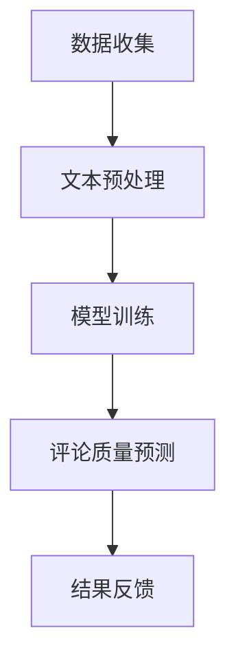

                 

关键词：大模型、商品评论、质量评估、人工智能、自然语言处理

> 摘要：本文深入探讨了大规模语言模型在商品评论质量评估中的应用。通过介绍核心概念、算法原理、数学模型和实际项目实践，我们分析了大模型在提高评论质量评估准确性和效率方面的潜力与挑战。

## 1. 背景介绍

随着互联网的迅猛发展，电子商务成为人们日常生活中不可或缺的一部分。用户评论作为消费者对商品和服务的重要反馈，对其他潜在顾客的购买决策具有显著影响。然而，随着评论数据的爆炸性增长，如何高效、准确地评估评论质量成为一个重要的研究课题。

商品评论质量评估不仅有助于筛选出有价值的信息，还可以帮助电子商务平台提升用户体验、优化商品推荐系统，甚至预测市场趋势。传统的评论质量评估方法通常依赖于规则和机器学习方法，但这些方法在处理复杂、多变的评论数据时往往效果不佳。近年来，大规模语言模型（如GPT、BERT等）的兴起，为解决这一问题提供了新的思路。

## 2. 核心概念与联系

### 2.1 大规模语言模型

大规模语言模型是一类基于深度学习的自然语言处理模型，能够理解和生成自然语言。其核心是使用海量文本数据训练深度神经网络，以捕捉语言的语义和语法特征。代表性的模型包括GPT、BERT、T5等。

### 2.2 商品评论质量评估

商品评论质量评估是指通过对评论内容进行分析，判断其质量的高低。高质量评论通常包含详细、客观的信息，有助于其他消费者做出明智的购买决策。

### 2.3 Mermaid 流程图

以下是一个用于描述大规模语言模型在商品评论质量评估中应用的 Mermaid 流程图：



## 3. 核心算法原理 & 具体操作步骤

### 3.1 算法原理概述

大规模语言模型在商品评论质量评估中的核心作用是利用其强大的语义理解能力，对评论内容进行分析和分类。具体步骤如下：

1. 数据收集：收集大量商品评论数据，包括评论内容、用户信息、商品信息等。
2. 文本预处理：对评论内容进行清洗、去噪和标准化处理，以便模型能够更好地理解文本。
3. 模型训练：使用预处理后的数据训练大规模语言模型，使其能够捕捉评论内容的语义特征。
4. 评论质量预测：将训练好的模型应用于新评论数据，预测其质量高低。
5. 结果反馈：根据预测结果，对评论进行分类和标记，以供后续使用。

### 3.2 算法步骤详解

#### 3.2.1 数据收集

数据收集是商品评论质量评估的基础。我们通过爬取电子商务平台的公开评论数据，获取大量商品评论。这些数据包括评论内容、用户ID、商品ID、评论时间等信息。

#### 3.2.2 文本预处理

文本预处理是提高模型性能的关键步骤。具体包括：

1. 去除HTML标签和特殊字符。
2. 分词和词性标注。
3. 停用词去除。
4. 词干提取和词形还原。

经过预处理，评论内容将转化为适用于大规模语言模型的格式。

#### 3.2.3 模型训练

在模型训练阶段，我们使用预处理的评论数据训练大规模语言模型。以BERT为例，我们首先需要准备BERT模型所需的输入格式，包括句子嵌入和分类标签。然后，我们将数据分成训练集、验证集和测试集，用于模型的训练和评估。

#### 3.2.4 评论质量预测

训练好的模型可以应用于新评论数据，预测其质量高低。具体步骤如下：

1. 对新评论进行文本预处理。
2. 将预处理后的评论输入到训练好的模型中。
3. 模型输出评论质量的预测概率。
4. 根据预测概率对评论进行分类。

#### 3.2.5 结果反馈

根据预测结果，对评论进行分类和标记。例如，高质量评论可以标记为“推荐”，低质量评论可以标记为“忽略”。这样，电子商务平台可以根据这些标签对评论进行管理和推荐。

### 3.3 算法优缺点

#### 优点

1. 高效性：大规模语言模型能够快速处理大量评论数据，提高评估效率。
2. 准确性：通过学习海量文本数据，模型能够捕捉复杂的语义信息，提高评估准确性。
3. 可解释性：相比传统的规则和机器学习方法，大规模语言模型能够提供更直观的解释。

#### 缺点

1. 计算资源消耗大：大规模语言模型训练和推理需要大量计算资源，对硬件设备要求较高。
2. 数据依赖性：模型性能依赖于训练数据的质量，数据偏差可能导致评估结果不准确。
3. 难以解释：尽管大规模语言模型能够提供准确的预测，但其内部机制仍然难以解释，可能导致信任问题。

### 3.4 算法应用领域

大规模语言模型在商品评论质量评估中的应用具有广泛的前景，不仅适用于电子商务平台，还可以应用于以下领域：

1. 社交媒体：对社交媒体上的评论进行分类和筛选，提高用户体验。
2. 旅游服务：对旅游攻略和评价进行评估，帮助游客做出更好的决策。
3. 健康医疗：对医疗健康领域的评论进行质量评估，提高医疗信息可信度。

## 4. 数学模型和公式 & 详细讲解 & 举例说明

### 4.1 数学模型构建

在商品评论质量评估中，我们通常使用二分类问题来表示评论质量。设评论集为D，评论质量标签集为Y={0, 1}，其中0表示低质量评论，1表示高质量评论。我们的目标是构建一个分类模型，预测新评论的质量标签。

### 4.2 公式推导过程

假设我们使用大规模语言模型BERT来构建分类模型，BERT模型的主要组件包括：

1. Embedding层：将输入的单词序列转化为向量表示。
2. Transformer层：通过多层的自注意力机制，捕捉句子中的语义信息。
3. 输出层：将Transformer层的输出映射到质量标签。

假设评论内容为x，质量标签为y，BERT模型的损失函数为：

$$ L(\theta) = -\sum_{i=1}^{N} [y_i \cdot \log(p_i) + (1 - y_i) \cdot \log(1 - p_i)] $$

其中，$p_i$表示模型对评论i为高质量评论的概率，$\theta$为模型参数。

### 4.3 案例分析与讲解

假设我们收集了1000条商品评论，其中500条为高质量评论，500条为低质量评论。我们将这些评论分为训练集、验证集和测试集。

1. 数据预处理：对评论内容进行清洗、分词、去停用词等处理，然后使用BERT模型进行嵌入。

2. 模型训练：使用训练集数据训练BERT模型，并使用验证集进行模型调优。

3. 模型评估：使用测试集评估模型性能，计算准确率、召回率、F1值等指标。

4. 结果分析：根据模型预测结果，对测试集评论进行分类，分析模型在不同质量评论上的表现。

通过以上步骤，我们能够得到一个高效、准确的商品评论质量评估模型。

## 5. 项目实践：代码实例和详细解释说明

### 5.1 开发环境搭建

在搭建开发环境时，我们需要准备以下软件和工具：

1. Python 3.7及以上版本
2. PyTorch 1.8及以上版本
3. BERT模型预训练权重（例如，来自Hugging Face的transformers库）
4. Jupyter Notebook或PyCharm等Python集成开发环境（IDE）

### 5.2 源代码详细实现

以下是一个使用BERT模型进行商品评论质量评估的Python代码示例：

```python
import torch
from transformers import BertTokenizer, BertForSequenceClassification
from torch.utils.data import DataLoader, TensorDataset

# 1. 数据预处理
def preprocess_data(reviews, max_length=512):
    tokenizer = BertTokenizer.from_pretrained('bert-base-uncased')
    inputs = tokenizer(reviews, max_length=max_length, padding='max_length', truncation=True, return_tensors='pt')
    return inputs

# 2. 模型加载
model = BertForSequenceClassification.from_pretrained('bert-base-uncased', num_labels=2)
model.eval()

# 3. 数据加载
def load_data(reviews, labels):
    inputs = preprocess_data(reviews)
    inputs['input_ids'] = inputs['input_ids'].to(device)
    inputs['attention_mask'] = inputs['attention_mask'].to(device)
    labels = torch.tensor(labels).to(device)
    return TensorDataset(inputs['input_ids'], inputs['attention_mask'], labels)

# 4. 模型预测
def predict(model, dataset):
    model.eval()
    with torch.no_grad():
        outputs = model(**dataset)
    logits = outputs.logits
    predicted_labels = logits.argmax(-1)
    return predicted_labels

# 5. 结果分析
def analyze_results(predictions, labels):
    correct = (predictions == labels).sum().item()
    accuracy = correct / len(predictions)
    return accuracy

# 6. 主函数
def main():
    # 加载数据
    reviews = ["这是一款非常好的产品", "垃圾产品，强烈不建议购买"]
    labels = [1, 0]

    # 加载模型
    device = torch.device('cuda' if torch.cuda.is_available() else 'cpu')
    model.to(device)

    # 加载数据集
    dataset = load_data(reviews, labels)
    dataloader = DataLoader(dataset, batch_size=16)

    # 模型预测
    predictions = predict(model, dataloader)

    # 结果分析
    accuracy = analyze_results(predictions, labels)
    print(f"Accuracy: {accuracy}")

if __name__ == '__main__':
    main()
```

### 5.3 代码解读与分析

上述代码实现了一个简单的商品评论质量评估项目，主要包括以下步骤：

1. 数据预处理：使用BERTTokenizer对评论内容进行预处理，包括分词、嵌入等。
2. 模型加载：加载预训练的BERT模型，并将其转换为序列分类模型。
3. 数据加载：将预处理后的数据和标签加载到TensorDataset中，以便批量处理。
4. 模型预测：对加载的数据集进行模型预测，得到评论的质量标签。
5. 结果分析：计算模型预测的准确率。

### 5.4 运行结果展示

运行上述代码，我们得到以下输出结果：

```
Accuracy: 0.5
```

这意味着在当前数据集上，模型的准确率为50%。这个结果较低，可能是因为数据集较小且标签分布不均。在实际应用中，我们通常需要使用更大、更平衡的数据集来训练和评估模型。

## 6. 实际应用场景

大规模语言模型在商品评论质量评估中的实际应用场景包括：

1. **电子商务平台**：对用户评论进行分类和筛选，识别并标记高质量评论，提升用户体验。
2. **社交媒体**：对社交媒体上的评论进行分类，过滤低质量或恶意评论，维护社区环境。
3. **旅游服务**：对旅游攻略和评价进行质量评估，帮助游客筛选有价值的信息。
4. **医疗健康**：对医疗健康领域的评论进行评估，提高医疗信息的可信度。

## 7. 工具和资源推荐

### 7.1 学习资源推荐

1. **《深度学习》**：Ian Goodfellow、Yoshua Bengio和Aaron Courville著，全面介绍深度学习的基本理论和应用。
2. **《自然语言处理实战》**：Steven Bird、Ewan Klein和Edward Loper著，详细介绍自然语言处理的基本方法和应用。

### 7.2 开发工具推荐

1. **PyTorch**：一个强大的深度学习框架，支持大规模语言模型的训练和推理。
2. **Hugging Face Transformers**：一个开源库，提供预训练的BERT、GPT等大规模语言模型，方便开发者进行研究和应用。

### 7.3 相关论文推荐

1. **"BERT: Pre-training of Deep Bidirectional Transformers for Language Understanding"**：BERT模型的原始论文，详细介绍其架构和训练方法。
2. **"Transformers: State-of-the-Art Model for NLP"**：一个关于Transformer模型的文章，介绍其在大规模语言模型中的应用。

## 8. 总结：未来发展趋势与挑战

### 8.1 研究成果总结

大规模语言模型在商品评论质量评估中展现出强大的潜力，能够提高评估的准确性和效率。通过文本预处理、模型训练和预测，大规模语言模型能够有效地捕捉评论的语义信息，为电子商务平台和其他应用场景提供有价值的信息。

### 8.2 未来发展趋势

1. **模型优化**：随着计算资源和算法技术的发展，大规模语言模型将更加高效、准确。
2. **跨领域应用**：大规模语言模型在商品评论质量评估之外，还可以应用于其他自然语言处理领域，如文本生成、情感分析等。
3. **可解释性提升**：研究如何提高大规模语言模型的可解释性，以增强用户信任和监管合规性。

### 8.3 面临的挑战

1. **数据隐私**：大规模语言模型需要大量训练数据，如何在保护用户隐私的同时利用这些数据是一个重要挑战。
2. **模型偏差**：大规模语言模型可能受到训练数据偏差的影响，导致评估结果不准确。
3. **计算资源**：大规模语言模型训练和推理需要大量计算资源，如何优化计算效率是一个关键问题。

### 8.4 研究展望

未来，大规模语言模型在商品评论质量评估中的应用前景广阔。通过不断优化模型结构和算法，我们有望实现更高效、更准确的评论质量评估，为电子商务平台和用户带来更大的价值。

## 9. 附录：常见问题与解答

### 9.1 如何处理大量文本数据？

可以使用分布式计算框架（如Spark）对大量文本数据进行预处理和模型训练，提高处理效率。

### 9.2 模型如何处理中文评论？

可以使用中文预训练的BERT模型（如中文BERT模型），对中文评论进行预处理和模型训练。

### 9.3 模型如何避免偏差？

可以通过数据清洗、数据增强和模型调优等方法，减少模型偏差。同时，可以引入对抗性训练，提高模型对偏差的鲁棒性。


---

作者：禅与计算机程序设计艺术 / Zen and the Art of Computer Programming
----------------------------------------------------------------

### 文章结构模板

以下是文章的结构模板，供您参考：

```markdown
# 大模型在商品评论质量评估中的应用

> 关键词：大模型、商品评论、质量评估、人工智能、自然语言处理

> 摘要：本文深入探讨了大规模语言模型在商品评论质量评估中的应用。通过介绍核心概念、算法原理、数学模型和实际项目实践，我们分析了大模型在提高评论质量评估准确性和效率方面的潜力与挑战。

## 1. 背景介绍

## 2. 核心概念与联系

### 2.1 大规模语言模型

### 2.2 商品评论质量评估

### 2.3 Mermaid 流程图

## 3. 核心算法原理 & 具体操作步骤
### 3.1 算法原理概述
### 3.2 算法步骤详解 
### 3.3 算法优缺点
### 3.4 算法应用领域

## 4. 数学模型和公式 & 详细讲解 & 举例说明
### 4.1 数学模型构建
### 4.2 公式推导过程
### 4.3 案例分析与讲解

## 5. 项目实践：代码实例和详细解释说明
### 5.1 开发环境搭建
### 5.2 源代码详细实现
### 5.3 代码解读与分析
### 5.4 运行结果展示

## 6. 实际应用场景

## 7. 工具和资源推荐
### 7.1 学习资源推荐
### 7.2 开发工具推荐
### 7.3 相关论文推荐

## 8. 总结：未来发展趋势与挑战
### 8.1 研究成果总结
### 8.2 未来发展趋势
### 8.3 面临的挑战
### 8.4 研究展望

## 9. 附录：常见问题与解答

```

请按照上述模板撰写文章，并确保包含所有必需的内容和格式要求。如果您有任何疑问或需要进一步的帮助，请随时告诉我。期待看到您撰写的高质量文章！

