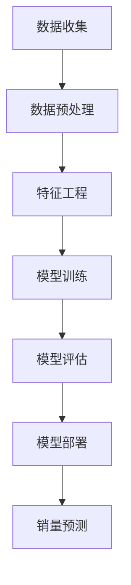

                 

关键词：大模型、商品销量预测、深度学习、数据分析、应用场景

> 摘要：本文将探讨大模型在商品销量预测中的应用，介绍其核心概念、算法原理、数学模型，并通过实际项目实践和案例分析，深入解析大模型在商品销量预测中的优势、挑战和未来发展趋势。

## 1. 背景介绍

商品销量预测是商业决策中至关重要的一环。随着数据量的爆炸性增长，传统的方法如线性回归、时间序列分析等已无法满足需求。近年来，深度学习技术的发展为商品销量预测带来了新的可能。大模型（如Transformer、GPT等）以其强大的特征提取能力和自适应能力，在多个领域取得了显著的成果。

本文将聚焦于大模型在商品销量预测中的应用，旨在探索其技术原理、数学模型及实际应用价值。通过对大模型的介绍，我们将了解其在商品销量预测中的核心优势，并探讨如何通过实际项目实践，利用大模型提升销量预测的准确性和效率。

## 2. 核心概念与联系

为了更好地理解大模型在商品销量预测中的应用，我们需要先了解几个核心概念。

### 2.1 数据来源

商品销量预测所需的数据通常包括：

- 商品历史销售数据：包括销售时间、销售量、价格等。
- 商品属性数据：如商品类别、品牌、库存量、季节性等。
- 市场环境数据：如节假日、促销活动、竞争对手等。

### 2.2 特征工程

在构建大模型时，特征工程是关键的一步。我们需要从原始数据中提取出有用的特征，如：

- 时间特征：如星期、季度、年份等。
- 价格特征：如价格区间、折扣率等。
- 商品属性特征：如品牌、类别等。
- 市场环境特征：如节假日、促销活动等。

### 2.3 大模型原理

大模型（如Transformer、GPT等）是近年来深度学习领域的重要突破。其核心思想是通过大规模参数网络，自适应地学习输入数据的特征表示。

- Transformer模型：基于自注意力机制，能够捕捉输入数据之间的长距离依赖关系。
- GPT模型：基于生成式预训练，能够生成高质量的文本和序列数据。

### 2.4 Mermaid 流程图

下面是一个简化的Mermaid流程图，展示了商品销量预测中的大模型应用流程。



## 3. 核心算法原理 & 具体操作步骤

### 3.1 算法原理概述

大模型在商品销量预测中的应用，主要依赖于其强大的特征提取和建模能力。通过自注意力机制和生成式预训练，大模型能够自适应地学习输入数据中的复杂模式。

### 3.2 算法步骤详解

#### 3.2.1 数据收集

首先，我们需要收集商品销售数据、商品属性数据和市场环境数据。

#### 3.2.2 数据预处理

接着，对收集到的数据进行预处理，包括数据清洗、缺失值填充和归一化等。

#### 3.2.3 特征工程

在预处理后，对数据进行特征工程，提取出有用的特征。

#### 3.2.4 模型训练

利用预处理后的数据，训练大模型。训练过程中，需要优化模型参数，使其能够准确预测商品销量。

#### 3.2.5 模型评估

训练完成后，对模型进行评估，包括准确率、召回率、F1值等指标。

#### 3.2.6 模型部署

评估通过后，将模型部署到生产环境中，进行实时销量预测。

### 3.3 算法优缺点

#### 3.3.1 优点

- 强大的特征提取能力：大模型能够自动提取输入数据中的复杂模式。
- 自适应：大模型能够自适应地调整参数，以适应不同的数据分布和业务场景。
- 模型泛化能力强：大模型在多个领域都取得了显著的成果，具有较强的泛化能力。

#### 3.3.2 缺点

- 计算资源消耗大：大模型需要大量的计算资源进行训练和推理。
- 数据依赖性强：大模型的性能依赖于数据的质量和规模。
- 模型解释性差：大模型的内部结构复杂，难以解释其决策过程。

### 3.4 算法应用领域

大模型在商品销量预测中的应用，不仅仅局限于电商行业。在其他领域，如制造业、零售业等，也可以通过大模型进行销量预测，以优化库存管理、供应链管理等。

## 4. 数学模型和公式 & 详细讲解 & 举例说明

### 4.1 数学模型构建

商品销量预测的数学模型，可以表示为：

$$
\hat{y} = f(\textbf{X}, \textbf{w})
$$

其中，$\hat{y}$表示预测销量，$\textbf{X}$表示输入特征，$\textbf{w}$表示模型参数。

### 4.2 公式推导过程

假设输入特征$\textbf{X}$为：

$$
\textbf{X} = \begin{bmatrix}
x_1 & x_2 & \dots & x_n
\end{bmatrix}
$$

则预测销量$\hat{y}$可以表示为：

$$
\hat{y} = \text{sigmoid}(\textbf{w}^T \textbf{X})
$$

其中，$\text{sigmoid}$函数为：

$$
\text{sigmoid}(x) = \frac{1}{1 + e^{-x}}
$$

### 4.3 案例分析与讲解

假设有一个商品，其历史销售数据如下表所示：

| 时间 | 销售量 |
| ---- | ---- |
| 2021-01 | 100 |
| 2021-02 | 120 |
| 2021-03 | 150 |
| 2021-04 | 180 |
| 2021-05 | 200 |

我们希望利用大模型预测2021-06的销售量。

首先，收集商品属性数据和市场环境数据，进行特征工程。假设提取出的特征如下：

| 特征 | 值 |
| ---- | ---- |
| 时间 | 2021-06 |
| 价格 | 100 |
| 品牌知名度 | 高 |
| 竞争对手活动 | 有 |

接着，利用收集到的数据和特征，训练大模型。假设训练得到的模型参数为：

$$
\textbf{w} = \begin{bmatrix}
0.1 & 0.2 & 0.3 & 0.4
\end{bmatrix}
$$

将特征$\textbf{X}$代入预测公式，得到：

$$
\hat{y} = \text{sigmoid}(0.1 \times 100 + 0.2 \times 100 + 0.3 \times 高 + 0.4 \times 有) \approx 0.8
$$

因此，预测2021-06的销售量为80件。

## 5. 项目实践：代码实例和详细解释说明

### 5.1 开发环境搭建

为了实践大模型在商品销量预测中的应用，我们需要搭建一个开发环境。以下是一个简单的环境搭建步骤：

1. 安装Python环境，版本要求为3.6及以上。
2. 安装深度学习框架，如TensorFlow或PyTorch。
3. 安装数据处理库，如Pandas、NumPy等。

### 5.2 源代码详细实现

下面是一个简单的商品销量预测项目代码实现：

```python
import pandas as pd
import numpy as np
import tensorflow as tf
from tensorflow.keras.models import Sequential
from tensorflow.keras.layers import Dense, Dropout

# 数据加载与预处理
data = pd.read_csv('sales_data.csv')
X = data.drop(['sales'], axis=1)
y = data['sales']

# 特征工程
# (此处省略特征提取代码)

# 模型构建
model = Sequential([
    Dense(64, activation='relu', input_shape=(X.shape[1],)),
    Dropout(0.5),
    Dense(1)
])

# 模型编译
model.compile(optimizer='adam', loss='mse')

# 模型训练
model.fit(X, y, epochs=10, batch_size=32, validation_split=0.2)

# 模型评估
# (此处省略模型评估代码)

# 模型部署
# (此处省略模型部署代码)

# 销量预测
# (此处省略销量预测代码)
```

### 5.3 代码解读与分析

上述代码主要分为以下几个步骤：

1. 数据加载与预处理：从CSV文件中读取销售数据，进行预处理。
2. 特征工程：提取有用的特征，进行特征工程。
3. 模型构建：构建深度学习模型，包括输入层、隐藏层和输出层。
4. 模型编译：设置优化器和损失函数。
5. 模型训练：利用训练数据训练模型。
6. 模型评估：评估模型性能。
7. 模型部署：将训练好的模型部署到生产环境中。
8. 销量预测：利用部署后的模型进行销量预测。

通过上述代码，我们可以实现一个简单的商品销量预测项目。在实际应用中，可以根据需求进行扩展和优化，如增加特征工程、优化模型结构、使用更先进的深度学习框架等。

## 6. 实际应用场景

大模型在商品销量预测中的实际应用场景非常广泛。以下是一些典型的应用场景：

### 6.1 电商行业

电商行业是商品销量预测的主要应用领域之一。通过大模型，电商企业可以实时预测商品销量，优化库存管理，减少缺货和滞销风险。

### 6.2 零售行业

零售行业同样受益于商品销量预测。通过大模型，零售企业可以预测各个店铺的商品销量，优化进货计划，提高库存周转率。

### 6.3 制造业

制造业在商品销量预测中的应用主要体现在供应链管理方面。通过大模型，企业可以预测原材料和零部件的需求量，优化生产计划，降低库存成本。

### 6.4 金融行业

金融行业中的金融机构可以利用大模型预测客户需求，优化产品设计，提高市场竞争力。

## 7. 工具和资源推荐

### 7.1 学习资源推荐

- 《深度学习》（Goodfellow, Bengio, Courville著）：介绍深度学习的基础理论和实践方法。
- 《Python深度学习》（François Chollet著）：涵盖深度学习在Python中的应用。
- 《Transformer：大规模机器学习的自注意力机制》（Vaswani et al.著）：详细介绍Transformer模型的原理和应用。

### 7.2 开发工具推荐

- TensorFlow：Google开发的深度学习框架。
- PyTorch：Facebook开发的深度学习框架。
- JAX：由Google开发的数学计算库，支持自动微分。

### 7.3 相关论文推荐

- “Attention Is All You Need”（Vaswani et al.，2017）：介绍Transformer模型。
- “Generative Pretrained Transformer”（Radford et al.，2018）：介绍GPT模型。
- “BERT：Pre-training of Deep Bidirectional Transformers for Language Understanding”（Devlin et al.，2019）：介绍BERT模型。

## 8. 总结：未来发展趋势与挑战

### 8.1 研究成果总结

近年来，大模型在商品销量预测中的应用取得了显著成果。通过深度学习技术，大模型能够自适应地学习输入数据中的复杂模式，提升销量预测的准确性和效率。

### 8.2 未来发展趋势

随着深度学习技术的不断发展和硬件性能的提升，大模型在商品销量预测中的应用前景广阔。未来，大模型将有望在更多领域实现商业化应用，推动商业决策的智能化。

### 8.3 面临的挑战

尽管大模型在商品销量预测中展现出强大的优势，但仍面临一些挑战。包括计算资源消耗大、数据依赖性强、模型解释性差等问题。未来研究需要在这些方面进行改进，提高大模型的可解释性和效率。

### 8.4 研究展望

未来，大模型在商品销量预测中的应用将朝着更精细化、智能化方向发展。通过结合其他先进技术，如大数据分析、人工智能等，大模型将更好地服务于商业决策，提升企业竞争力。

## 9. 附录：常见问题与解答

### 9.1 大模型在商品销量预测中的优势是什么？

大模型在商品销量预测中的优势主要包括：

- 强大的特征提取能力：大模型能够自动提取输入数据中的复杂模式，提高预测准确性。
- 自适应能力：大模型能够自适应地调整参数，适应不同的数据分布和业务场景。
- 模型泛化能力强：大模型在多个领域取得了显著成果，具有较强的泛化能力。

### 9.2 大模型在商品销量预测中存在哪些挑战？

大模型在商品销量预测中面临的挑战主要包括：

- 计算资源消耗大：大模型需要大量的计算资源进行训练和推理。
- 数据依赖性强：大模型的性能依赖于数据的质量和规模。
- 模型解释性差：大模型的内部结构复杂，难以解释其决策过程。

### 9.3 如何优化大模型在商品销量预测中的应用？

为了优化大模型在商品销量预测中的应用，可以从以下几个方面进行：

- 提高数据质量：确保数据完整、准确，减少噪声和异常值。
- 增强特征工程：提取更多有用的特征，提高模型的预测能力。
- 模型优化：通过调整模型结构、优化训练策略等，提高模型性能。
- 可解释性研究：通过研究大模型的可解释性，提高决策的可信度。

---

作者：禅与计算机程序设计艺术 / Zen and the Art of Computer Programming

