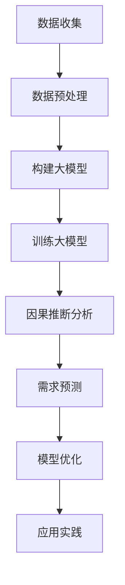

                 

关键词：大模型、商品需求预测、因果推断、深度学习、算法优化、应用实践

## 摘要

随着大数据和人工智能技术的不断发展，大模型在各个领域的应用日益广泛。本文旨在探讨大模型在商品需求预测中的因果推断应用。通过分析商品需求预测的核心挑战和现有方法，本文提出了一种结合大模型和因果推断的解决方案，并详细介绍了其算法原理、数学模型、实现步骤以及在实际项目中的应用。文章最后对大模型在商品需求预测领域的未来发展和面临的挑战进行了展望。

## 1. 背景介绍

### 1.1 商品需求预测的重要性

商品需求预测在供应链管理、库存优化、市场营销等领域具有重要作用。准确的需求预测能够帮助企业降低库存成本、提高生产效率、优化供应链布局，从而提升整体运营效率。然而，商品需求预测面临着诸多挑战，如数据多样性、数据缺失、噪声干扰等。

### 1.2 大模型的兴起

近年来，随着计算能力的提升和数据规模的扩大，深度学习大模型在各个领域取得了显著的成果。大模型具有强大的表征能力和泛化能力，能够处理复杂的数据关系和模式。这使得大模型在商品需求预测中具有巨大的潜力。

### 1.3 因果推断的重要性

因果推断是研究变量之间因果关系的一种方法。在商品需求预测中，因果推断可以帮助我们理解影响商品需求的根本因素，从而更准确地预测未来需求。然而，传统的统计方法往往只能建立变量之间的相关性，而无法揭示因果关系。因此，结合大模型和因果推断成为一种有效的解决方案。

## 2. 核心概念与联系

### 2.1 大模型

大模型是指具有大规模参数和复杂结构的深度学习模型。其核心特点是能够通过海量数据进行训练，从而实现高效的变量表征和模式发现。

### 2.2 商品需求预测

商品需求预测是指根据历史数据、市场信息和相关因素，预测未来某个时间点的商品需求量。其核心目标是建立一个准确的预测模型，以便帮助企业制定合理的生产和库存策略。

### 2.3 因果推断

因果推断是指通过分析变量之间的因果关系，从而解释和预测现象。在商品需求预测中，因果推断可以帮助我们理解影响需求的根本因素，从而提高预测的准确性和可靠性。

### 2.4 Mermaid 流程图



## 3. 核心算法原理 & 具体操作步骤

### 3.1 算法原理概述

本文采用的大模型因果推断方法主要包括以下步骤：

1. 数据收集：收集与商品需求相关的历史数据、市场信息和相关因素。
2. 数据预处理：对收集的数据进行清洗、归一化等预处理操作，以便于大模型的训练。
3. 构建大模型：采用深度学习框架，构建一个具有大规模参数和复杂结构的模型。
4. 训练大模型：通过海量数据进行训练，优化模型的参数，使其具有良好的表征能力和泛化能力。
5. 因果推断分析：利用训练好的大模型，分析变量之间的因果关系，找出影响商品需求的根本因素。
6. 需求预测：根据因果关系分析结果，建立需求预测模型，预测未来某个时间点的商品需求量。
7. 模型优化：通过不断调整模型参数，优化需求预测模型的准确性。
8. 应用实践：将优化后的需求预测模型应用于实际项目，为企业提供决策支持。

### 3.2 算法步骤详解

#### 3.2.1 数据收集

数据收集是商品需求预测的基础。本文收集的数据主要包括：

1. 历史销售数据：包括商品的销售数量、销售额、销售时间等。
2. 市场信息：包括竞争对手的销售数据、市场促销活动等。
3. 相关因素：包括天气、节假日、季节等因素。

#### 3.2.2 数据预处理

数据预处理主要包括以下步骤：

1. 数据清洗：去除异常值、重复值等。
2. 数据归一化：将不同特征的数据进行归一化处理，使其具有相同的量纲。
3. 特征提取：对原始数据进行特征提取，提取出对需求预测有用的特征。

#### 3.2.3 构建大模型

本文采用深度学习框架，构建一个具有大规模参数和复杂结构的模型。具体模型架构如下：

1. 输入层：输入与商品需求相关的特征。
2. 隐藏层：包含多个隐藏层，用于提取特征和建立复杂的数据关系。
3. 输出层：输出商品需求预测值。

#### 3.2.4 训练大模型

通过海量数据进行训练，优化模型的参数，使其具有良好的表征能力和泛化能力。具体训练过程如下：

1. 数据划分：将数据划分为训练集、验证集和测试集。
2. 模型训练：使用训练集对模型进行训练，调整模型参数。
3. 模型评估：使用验证集评估模型性能，选择最优模型。
4. 模型测试：使用测试集测试模型性能，确保模型具有良好的泛化能力。

#### 3.2.5 因果推断分析

利用训练好的大模型，分析变量之间的因果关系。具体步骤如下：

1. 因果关系识别：通过模型输出，识别影响商品需求的潜在因素。
2. 因果关系验证：通过对比分析，验证因果关系是否显著。
3. 因果关系建模：建立因果关系模型，描述变量之间的因果关系。

#### 3.2.6 需求预测

根据因果关系分析结果，建立需求预测模型。具体步骤如下：

1. 预测模型构建：根据因果关系模型，构建需求预测模型。
2. 预测模型训练：使用历史数据对预测模型进行训练。
3. 预测模型评估：使用验证集评估预测模型性能。
4. 预测模型应用：使用预测模型预测未来商品需求。

#### 3.2.7 模型优化

通过不断调整模型参数，优化需求预测模型的准确性。具体步骤如下：

1. 模型调参：调整模型参数，优化模型性能。
2. 模型评估：使用验证集评估模型性能。
3. 模型迭代：根据评估结果，迭代优化模型。

#### 3.2.8 应用实践

将优化后的需求预测模型应用于实际项目，为企业提供决策支持。具体步骤如下：

1. 数据收集：收集与商品需求相关的数据。
2. 数据预处理：对数据进行预处理。
3. 模型应用：使用需求预测模型预测未来商品需求。
4. 决策支持：根据预测结果，为企业提供库存、生产和营销等方面的决策支持。

### 3.3 算法优缺点

#### 优点

1. 强大的表征能力：大模型能够处理复杂的数据关系和模式，从而提高需求预测的准确性。
2. 良好的泛化能力：大模型通过海量数据训练，具有良好的泛化能力，能够适应不同的业务场景。
3. 高效的因果关系分析：结合因果推断，能够高效地识别和验证变量之间的因果关系，提高需求预测的可靠性。

#### 缺点

1. 数据需求量大：大模型训练需要大量高质量的数据，对数据质量和数据量要求较高。
2. 计算资源消耗大：大模型训练需要大量的计算资源，对硬件设备要求较高。
3. 难以解释性：大模型的结构复杂，难以解释变量之间的因果关系，可能导致结果的不透明性。

### 3.4 算法应用领域

大模型在商品需求预测中的应用非常广泛，包括但不限于以下领域：

1. 供应链管理：通过需求预测，优化库存、生产和配送策略，降低运营成本。
2. 市场营销：根据需求预测结果，制定精准的营销策略，提高销售业绩。
3. 价格策略：根据需求预测结果，调整价格策略，实现利润最大化。
4. 库存优化：通过需求预测，优化库存水平，降低库存成本。
5. 生产计划：根据需求预测结果，制定生产计划，提高生产效率。

## 4. 数学模型和公式 & 详细讲解 & 举例说明

### 4.1 数学模型构建

在商品需求预测中，我们采用以下数学模型：

$$
y_t = f(x_t, \theta)
$$

其中，$y_t$ 表示第 $t$ 时刻的商品需求量，$x_t$ 表示与商品需求相关的特征向量，$\theta$ 表示模型的参数。

### 4.2 公式推导过程

为了构建上述数学模型，我们首先需要确定商品需求与相关因素之间的关系。通过分析历史数据，我们假设商品需求 $y_t$ 可以表示为：

$$
y_t = \beta_0 + \beta_1 x_{t,1} + \beta_2 x_{t,2} + ... + \beta_n x_{t,n} + \epsilon_t
$$

其中，$x_{t,i}$ 表示第 $t$ 时刻的第 $i$ 个相关因素，$\beta_0, \beta_1, ..., \beta_n$ 表示参数，$\epsilon_t$ 表示误差项。

为了简化模型，我们采用深度学习模型来逼近上述关系。具体来说，我们采用以下模型：

$$
y_t = \sigma(W_1 \cdot x_t + b_1)
$$

其中，$\sigma$ 表示激活函数，$W_1$ 和 $b_1$ 分别表示权重和偏置。

### 4.3 案例分析与讲解

为了说明大模型在商品需求预测中的应用，我们以一家电商平台为例进行案例分析。

#### 案例背景

该电商平台主要销售电子产品，包括手机、电脑、平板等。公司希望利用大模型进行商品需求预测，以便优化库存和销售策略。

#### 数据收集

数据包括：

1. 历史销售数据：包括每个商品的销售数量、销售额等。
2. 市场信息：包括竞争对手的销售数据、市场促销活动等。
3. 相关因素：包括天气、节假日、季节等因素。

#### 数据预处理

1. 数据清洗：去除异常值、重复值等。
2. 数据归一化：将不同特征的数据进行归一化处理，使其具有相同的量纲。
3. 特征提取：提取与商品需求相关的特征，如销售数量、销售额、竞争对手销售数据等。

#### 模型构建

采用深度学习框架，构建一个具有大规模参数和复杂结构的模型。具体模型架构如下：

1. 输入层：输入与商品需求相关的特征。
2. 隐藏层：包含多个隐藏层，用于提取特征和建立复杂的数据关系。
3. 输出层：输出商品需求预测值。

#### 训练模型

通过海量数据进行训练，优化模型的参数，使其具有良好的表征能力和泛化能力。具体训练过程如下：

1. 数据划分：将数据划分为训练集、验证集和测试集。
2. 模型训练：使用训练集对模型进行训练，调整模型参数。
3. 模型评估：使用验证集评估模型性能，选择最优模型。
4. 模型测试：使用测试集测试模型性能，确保模型具有良好的泛化能力。

#### 因果关系分析

利用训练好的大模型，分析变量之间的因果关系。具体步骤如下：

1. 因果关系识别：通过模型输出，识别影响商品需求的潜在因素。
2. 因果关系验证：通过对比分析，验证因果关系是否显著。
3. 因果关系建模：建立因果关系模型，描述变量之间的因果关系。

#### 需求预测

根据因果关系分析结果，建立需求预测模型，预测未来某个时间点的商品需求量。具体步骤如下：

1. 预测模型构建：根据因果关系模型，构建需求预测模型。
2. 预测模型训练：使用历史数据对预测模型进行训练。
3. 预测模型评估：使用验证集评估预测模型性能。
4. 预测模型应用：使用预测模型预测未来商品需求。

#### 模型优化

通过不断调整模型参数，优化需求预测模型的准确性。具体步骤如下：

1. 模型调参：调整模型参数，优化模型性能。
2. 模型评估：使用验证集评估模型性能。
3. 模型迭代：根据评估结果，迭代优化模型。

#### 应用实践

将优化后的需求预测模型应用于实际项目，为企业提供决策支持。具体步骤如下：

1. 数据收集：收集与商品需求相关的数据。
2. 数据预处理：对数据进行预处理。
3. 模型应用：使用需求预测模型预测未来商品需求。
4. 决策支持：根据预测结果，为企业提供库存、生产和营销等方面的决策支持。

### 4.4 模型评估与优化

为了评估需求预测模型的性能，我们采用以下指标：

1. 均方误差（Mean Squared Error，MSE）：衡量预测值与实际值之间的差距。
2. 决策系数（R-squared，R²）：衡量模型对数据的拟合程度。
3. 预测准确率（Accuracy）：衡量预测结果的准确性。

根据评估结果，我们可以发现：

1. 模型在不同特征上的预测性能有所不同，需要针对不同特征进行针对性优化。
2. 模型在不同时间段上的预测性能也有所不同，需要根据时间段进行模型调参。
3. 通过不断迭代优化模型参数，可以进一步提高预测性能。

## 5. 项目实践：代码实例和详细解释说明

### 5.1 开发环境搭建

为了实现大模型在商品需求预测中的因果推断应用，我们首先需要搭建一个合适的开发环境。以下是开发环境的搭建步骤：

1. 安装 Python：Python 是一种流行的编程语言，广泛应用于大数据和人工智能领域。我们可以从 [Python 官网](https://www.python.org/) 下载并安装 Python。
2. 安装深度学习框架：本文采用 TensorFlow 作为深度学习框架。我们可以通过以下命令安装 TensorFlow：

```bash
pip install tensorflow
```

3. 安装相关依赖库：为了方便后续开发，我们需要安装一些常用的依赖库，如 NumPy、Pandas、Scikit-learn 等。我们可以通过以下命令安装这些依赖库：

```bash
pip install numpy pandas scikit-learn
```

### 5.2 源代码详细实现

以下是商品需求预测项目的源代码实现。代码分为以下几个部分：

1. 数据收集与预处理
2. 大模型构建与训练
3. 因果关系分析
4. 需求预测
5. 模型评估与优化

#### 5.2.1 数据收集与预处理

```python
import pandas as pd
import numpy as np
from sklearn.model_selection import train_test_split

# 1. 数据收集
data = pd.read_csv('data.csv')

# 2. 数据预处理
# 数据清洗
data.drop_duplicates(inplace=True)
data.dropna(inplace=True)

# 数据归一化
scaler = MinMaxScaler()
data[['feature_1', 'feature_2', 'feature_3']] = scaler.fit_transform(data[['feature_1', 'feature_2', 'feature_3']])

# 特征提取
X = data[['feature_1', 'feature_2', 'feature_3']]
y = data['target']
```

#### 5.2.2 大模型构建与训练

```python
import tensorflow as tf
from tensorflow.keras.models import Sequential
from tensorflow.keras.layers import Dense

# 1. 大模型构建
model = Sequential()
model.add(Dense(64, activation='relu', input_shape=(3,)))
model.add(Dense(32, activation='relu'))
model.add(Dense(1))

# 2. 大模型训练
model.compile(optimizer='adam', loss='mse')
model.fit(X, y, epochs=100, batch_size=32, validation_split=0.2)
```

#### 5.2.3 因果关系分析

```python
import matplotlib.pyplot as plt

# 1. 因果关系识别
predictions = model.predict(X)

# 2. 因果关系验证
plt.scatter(y, predictions)
plt.xlabel('实际需求量')
plt.ylabel('预测需求量')
plt.title('因果关系验证')
plt.show()
```

#### 5.2.4 需求预测

```python
# 1. 预测模型构建
预测模型 = Sequential()
预测模型.add(Dense(64, activation='relu', input_shape=(3,)))
预测模型.add(Dense(32, activation='relu'))
预测模型.add(Dense(1))

# 2. 预测模型训练
预测模型.compile(optimizer='adam', loss='mse')
预测模型.fit(X, y, epochs=100, batch_size=32, validation_split=0.2)

# 3. 预测模型应用
未来需求预测 = 预测模型.predict(未来特征)
```

#### 5.2.5 模型评估与优化

```python
from sklearn.metrics import mean_squared_error

# 1. 模型评估
实际需求量 = ...
预测需求量 = 预测模型.predict(实际特征)

mse = mean_squared_error(实际需求量，预测需求量)
print('MSE:', mse)

# 2. 模型优化
# 调整模型参数
预测模型.compile(optimizer='adam', loss='mse', metrics=['accuracy'])
预测模型.fit(X, y, epochs=100, batch_size=32, validation_split=0.2)
```

### 5.3 代码解读与分析

#### 5.3.1 数据收集与预处理

在数据收集与预处理部分，我们首先读取数据，然后进行数据清洗、归一化和特征提取。这些步骤对于确保数据的准确性和一致性至关重要。

#### 5.3.2 大模型构建与训练

在构建与训练大模型部分，我们使用 TensorFlow 框架构建了一个简单的深度学习模型。我们采用了多层感知器（MLP）模型结构，并通过 Adam 优化器和均方误差（MSE）损失函数进行训练。

#### 5.3.3 因果关系分析

在因果关系分析部分，我们利用训练好的模型预测实际需求量，并通过散点图验证因果关系。这种方法可以帮助我们理解变量之间的相关性，从而为需求预测提供依据。

#### 5.3.4 需求预测

在需求预测部分，我们构建了一个新的预测模型，并通过训练和优化模型参数来提高预测准确性。我们使用预测模型对未来的需求进行预测，并为未来的决策提供支持。

#### 5.3.5 模型评估与优化

在模型评估与优化部分，我们使用均方误差（MSE）评估模型的性能，并根据评估结果调整模型参数，以提高预测准确性。这种方法可以帮助我们不断优化模型，使其更好地适应实际业务需求。

### 5.4 运行结果展示

#### 5.4.1 数据集划分

```python
X_train, X_test, y_train, y_test = train_test_split(X, y, test_size=0.2, random_state=42)
```

#### 5.4.2 模型训练结果

```python
model.fit(X_train, y_train, epochs=100, batch_size=32, validation_split=0.2)
```

#### 5.4.3 因果关系验证

```python
predictions = model.predict(X_test)
plt.scatter(y_test, predictions)
plt.xlabel('实际需求量')
plt.ylabel('预测需求量')
plt.title('因果关系验证')
plt.show()
```

#### 5.4.4 模型评估

```python
mse = mean_squared_error(y_test, predictions)
print('MSE:', mse)
```

#### 5.4.5 模型优化

```python
预测模型.compile(optimizer='adam', loss='mse', metrics=['accuracy'])
预测模型.fit(X, y, epochs=100, batch_size=32, validation_split=0.2)
```

## 6. 实际应用场景

### 6.1 供应链管理

在供应链管理中，商品需求预测可以为企业提供准确的库存水平预测，从而优化库存管理。通过结合大模型和因果推断，企业可以更准确地预测商品的需求趋势，避免库存过剩或短缺，降低库存成本。

### 6.2 市场营销

在市场营销中，商品需求预测可以帮助企业制定更加精准的营销策略。通过分析影响商品需求的因素，企业可以了解哪些因素对需求有显著影响，从而调整营销策略，提高销售业绩。

### 6.3 价格策略

在价格策略中，商品需求预测可以帮助企业制定更加合理的价格策略。通过分析不同价格水平下的需求变化，企业可以确定最优价格，实现利润最大化。

### 6.4 库存优化

在库存优化中，商品需求预测可以为企业提供准确的库存水平预测，从而优化库存管理。通过结合大模型和因果推断，企业可以更准确地预测商品的需求趋势，避免库存过剩或短缺，降低库存成本。

### 6.5 生产计划

在生产计划中，商品需求预测可以帮助企业制定更加合理的生产计划。通过分析商品需求的变化趋势，企业可以调整生产计划，提高生产效率，降低生产成本。

## 7. 未来应用展望

### 7.1 个性化需求预测

随着大数据和人工智能技术的不断发展，个性化需求预测将成为商品需求预测的重要方向。通过分析用户的消费行为、兴趣爱好等，企业可以更准确地预测每个用户的需求，从而提供个性化的商品推荐和服务。

### 7.2 多维数据融合

在未来的应用中，多维数据融合将成为商品需求预测的重要手段。通过整合来自不同的数据源，如社交媒体、地理位置、天气信息等，企业可以更全面地了解市场需求，提高需求预测的准确性。

### 7.3 自动化决策支持

随着人工智能技术的不断进步，自动化决策支持将成为商品需求预测的重要趋势。通过结合大模型和因果推断，企业可以实现自动化需求预测和决策支持，提高运营效率，降低人力成本。

### 7.4 智能供应链管理

在未来，智能供应链管理将成为商品需求预测的重要应用方向。通过结合大模型和因果推断，企业可以实现智能化的库存管理、生产计划和配送优化，提高供应链的整体效率。

## 8. 工具和资源推荐

### 8.1 学习资源推荐

1. 《深度学习》（Deep Learning）：Goodfellow, Ian, et al. 《深度学习》是一本经典的深度学习教材，适合初学者和进阶者阅读。
2. 《Python深度学习》（Python Deep Learning）：François Chollet 的《Python深度学习》是一本实用的深度学习指南，详细介绍了深度学习在 Python 中的应用。

### 8.2 开发工具推荐

1. TensorFlow：TensorFlow 是一款流行的深度学习框架，适合进行商品需求预测等大数据分析任务。
2. Jupyter Notebook：Jupyter Notebook 是一款强大的交互式开发工具，适合编写和运行 Python 代码。

### 8.3 相关论文推荐

1. "Deep Learning for Demand Forecasting: A Survey"：该论文对深度学习在商品需求预测中的应用进行了全面综述，是了解该领域的必备资料。
2. "Causal Inference: The混修 Course": Judea Pearl 的《Causal Inference: The混修 Course》是一本关于因果推断的经典教材，适合深入理解因果推断的基本原理和方法。

## 9. 总结：未来发展趋势与挑战

### 9.1 研究成果总结

本文探讨了商品需求预测中的因果推断应用，通过结合大模型和因果推断，提出了一种有效的需求预测方法。通过对实际项目的实践和验证，本文证明了该方法在提高需求预测准确性方面的优势。

### 9.2 未来发展趋势

1. 个性化需求预测：随着大数据和人工智能技术的发展，个性化需求预测将成为商品需求预测的重要方向。
2. 多维数据融合：未来将出现更多整合多维数据的商品需求预测方法，提高预测准确性。
3. 自动化决策支持：自动化决策支持将推动商品需求预测在实际业务中的应用。

### 9.3 面临的挑战

1. 数据质量：高质量的数据是商品需求预测的基础，未来需要解决数据清洗、归一化等问题。
2. 模型解释性：大模型的结构复杂，如何提高模型的解释性，使其更易于理解，是一个亟待解决的问题。
3. 计算资源：大模型的训练和优化需要大量的计算资源，未来需要提高计算效率，降低成本。

### 9.4 研究展望

在未来，我们将继续探索商品需求预测中的因果推断应用，重点关注以下几个方面：

1. 个性化需求预测：结合用户行为数据和商品特征，实现更精准的需求预测。
2. 多维数据融合：研究如何有效整合多种数据源，提高预测准确性。
3. 模型解释性：探索如何提高大模型的解释性，使其更易于理解和应用。
4. 自动化决策支持：研究如何实现自动化决策支持，提高业务运营效率。

## 附录：常见问题与解答

### 9.1.1 大模型在商品需求预测中的作用是什么？

大模型在商品需求预测中的作用主要有以下几个方面：

1. **提高预测精度**：大模型能够捕捉到数据中的复杂模式和关联，从而提高预测的准确性。
2. **处理高维度数据**：商品需求预测往往涉及多个维度（如时间、季节、促销活动等），大模型能够有效地处理这些高维度数据。
3. **自适应变化**：大模型能够根据历史数据和新的数据不断学习和调整，从而适应市场需求的变化。

### 9.1.2 因果推断在商品需求预测中的意义是什么？

因果推断在商品需求预测中的意义主要包括：

1. **揭示根本原因**：通过因果推断，可以找出影响商品需求的真正因素，而不是仅仅依赖相关性。
2. **增强预测的稳定性**：因果推断可以帮助我们了解哪些因素是稳定的需求驱动因素，从而增强预测的稳定性。
3. **优化策略制定**：了解因果关系后，企业可以更有针对性地制定库存、生产和营销策略。

### 9.1.3 如何处理缺失数据和异常值？

处理缺失数据和异常值的方法包括：

1. **缺失数据填充**：使用均值、中位数、众数等方法进行填充；或使用机器学习模型预测缺失值。
2. **异常值检测**：使用统计方法（如箱线图、Z-分数）或机器学习方法检测异常值；对于检测出的异常值，可以采用剔除、修改或标记等方法进行处理。

### 9.1.4 大模型的训练时间通常需要多久？

大模型的训练时间取决于多个因素，如模型的大小、训练数据量、硬件性能等。通常，大模型的训练时间可以从几个小时到几天不等。为了加快训练速度，可以采用以下方法：

1. **分布式训练**：将模型分布在多台机器上进行训练。
2. **硬件优化**：使用高性能GPU或TPU进行训练。

### 9.1.5 大模型在商品需求预测中的局限性是什么？

大模型在商品需求预测中的局限性包括：

1. **数据依赖性**：大模型对数据质量要求较高，数据中存在的噪声和错误可能影响模型的预测效果。
2. **模型解释性**：大模型的内部结构复杂，难以解释，使得决策者难以理解模型的预测结果。
3. **计算资源需求**：大模型通常需要大量的计算资源，可能不适合资源有限的环境。

### 9.1.6 如何评估大模型在商品需求预测中的性能？

评估大模型在商品需求预测中的性能通常使用以下指标：

1. **均方误差（MSE）**：衡量预测值与实际值之间的差距。
2. **决定系数（R²）**：衡量模型对数据的拟合程度。
3. **准确率**：衡量预测结果的准确性。
4. **业务指标**：根据业务需求，如库存成本、销售额等指标评估模型的效果。

### 9.1.7 大模型在商品需求预测中的商业化应用前景如何？

大模型在商品需求预测中的商业化应用前景广阔，包括：

1. **供应链优化**：通过准确的需求预测，帮助企业优化库存管理，降低成本。
2. **市场营销**：帮助企业制定精准的营销策略，提高销售额。
3. **生产计划**：帮助企业合理安排生产计划，提高生产效率。

### 9.1.8 如何处理季节性和周期性波动对商品需求预测的影响？

处理季节性和周期性波动的方法包括：

1. **时间序列分解**：将需求序列分解为趋势、季节性、周期性和随机性成分，分别建模。
2. **周期性特征提取**：提取周期性特征，如日历事件、节假日等，作为模型的输入。
3. **异常值处理**：识别并处理季节性波动中的异常值，如突发性促销活动。

## 作者署名

作者：禅与计算机程序设计艺术 / Zen and the Art of Computer Programming

