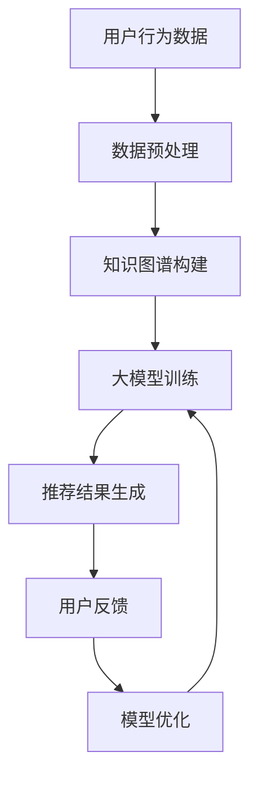

                 

 关键词：大模型，知识图谱，推荐系统，算法，数学模型，应用场景，发展趋势

> 摘要：本文深入探讨了大规模模型在基于知识图谱的推荐系统中的作用。通过分析大模型的优势，核心算法原理，以及数学模型的构建和公式推导，文章展示了大模型在推荐系统中的实际应用场景，并展望了未来的发展趋势和面临的挑战。

## 1. 背景介绍

随着互联网的快速发展，信息爆炸的时代已经到来。人们面临的信息选择越来越多，如何从海量信息中快速准确地找到感兴趣的内容成为了一个重要问题。推荐系统作为一种信息过滤和内容发现技术，应运而生。传统的推荐系统主要基于用户历史行为数据或者内容特征，然而，这些方法在面对复杂、动态和高度关联的信息时，往往显得力不从心。

知识图谱作为一种结构化的语义知识库，能够将实体、属性和关系以图形的方式表达出来，为推荐系统提供了更加丰富的语义信息。知识图谱的引入使得推荐系统不仅能够基于用户历史行为和内容特征进行推荐，还能够利用实体间的关联关系，进行深度语义理解，从而提升推荐的准确性。

与此同时，近年来，大模型的迅速发展，如Transformer、BERT、GPT等，为推荐系统带来了新的机遇。大模型通过学习海量数据，能够捕捉到复杂的模式和信息，从而在基于知识图谱的推荐系统中发挥重要作用。本文将重点探讨大模型在基于知识图谱的推荐系统中的作用，分析其优势和应用场景，并提出相应的数学模型和算法。

## 2. 核心概念与联系

### 2.1 大模型的概念

大模型，通常指的是参数规模超过亿级别的深度神经网络模型。这些模型通过训练大量的数据，能够自动学习到数据中的复杂模式和知识。大模型的代表性工作包括Google的BERT、OpenAI的GPT等。大模型的出现，标志着深度学习技术进入了一个新的阶段，即从“深度”转向“宽度”，能够处理更大规模和更复杂的数据。

### 2.2 知识图谱的概念

知识图谱是一种用于表示实体、属性和关系的数据结构，通常采用图形的形式进行表达。知识图谱的核心是实体，每个实体都有相应的属性和关系。知识图谱能够将海量的信息组织成一个结构化的语义网络，为推荐系统提供了丰富的语义信息。

### 2.3 大模型与知识图谱的联系

大模型和知识图谱的结合，能够发挥各自的优势，实现更强大的推荐效果。大模型通过学习知识图谱中的信息，能够捕捉到实体间的关联关系，从而在推荐时提供更加个性化的结果。同时，知识图谱为大模型提供了丰富的语义信息，使得模型能够更好地理解用户的兴趣和需求。

### 2.4 Mermaid 流程图

下面是一个简化的Mermaid流程图，展示了大模型与知识图谱结合的流程：



## 3. 核心算法原理 & 具体操作步骤

### 3.1 算法原理概述

基于知识图谱的推荐系统通常包含以下几个主要步骤：

1. **数据预处理**：对用户行为数据和知识图谱进行预处理，包括数据清洗、去重、编码等操作。
2. **知识图谱构建**：将用户行为数据转换为知识图谱，表示为实体、属性和关系的图形结构。
3. **大模型训练**：利用知识图谱和数据集，训练一个大模型，以捕捉用户兴趣和实体间的关联关系。
4. **推荐结果生成**：利用训练好的大模型，对用户进行个性化推荐。
5. **用户反馈与模型优化**：根据用户反馈，优化模型参数，提升推荐效果。

### 3.2 算法步骤详解

1. **数据预处理**：首先，对用户行为数据进行清洗和编码，将其转换为数值形式，以便大模型进行训练。同时，对知识图谱中的实体和关系进行预处理，确保数据的一致性和完整性。

2. **知识图谱构建**：利用用户行为数据，构建一个表示用户兴趣的知识图谱。在这个过程中，实体表示用户和物品，属性表示用户行为和物品特征，关系表示用户对物品的偏好。

3. **大模型训练**：采用深度学习技术，如Transformer、BERT等，对知识图谱进行训练。大模型通过学习用户行为和知识图谱中的信息，能够自动提取用户兴趣和实体间的关联关系。

4. **推荐结果生成**：在训练好的大模型基础上，对用户进行个性化推荐。具体来说，模型会根据用户的兴趣和知识图谱中的关系，生成一系列推荐结果。

5. **用户反馈与模型优化**：收集用户对推荐结果的反馈，根据反馈优化模型参数，提高推荐效果。

### 3.3 算法优缺点

**优点**：

- **个性化推荐**：基于用户兴趣和知识图谱，能够提供更加个性化的推荐结果。
- **深度语义理解**：利用大模型，能够对用户兴趣和实体间的关系进行深度语义理解，提升推荐效果。
- **自适应调整**：根据用户反馈，能够自适应地调整推荐策略，提高用户体验。

**缺点**：

- **计算资源需求大**：大模型的训练和推理需要大量的计算资源，对硬件设施有较高要求。
- **数据隐私问题**：在构建知识图谱和训练大模型的过程中，可能会涉及用户隐私信息，需要采取相应的隐私保护措施。

### 3.4 算法应用领域

基于知识图谱的推荐系统可以应用于多个领域，如电子商务、社交媒体、新闻推荐等。以下是几个典型的应用场景：

- **电子商务**：利用知识图谱，可以推荐用户可能感兴趣的商品，提升购物体验。
- **社交媒体**：根据用户兴趣和社交关系，推荐用户可能感兴趣的内容，增强用户粘性。
- **新闻推荐**：利用知识图谱，可以推荐用户可能感兴趣的新闻，提高新闻的阅读量。

## 4. 数学模型和公式 & 详细讲解 & 举例说明

### 4.1 数学模型构建

在基于知识图谱的推荐系统中，常用的数学模型包括图神经网络（Graph Neural Networks, GNN）和图卷积网络（Graph Convolutional Networks, GCN）。以下是一个简化的数学模型：

- **输入**：一个表示知识图谱的邻接矩阵 \(A\) 和特征矩阵 \(X\)。
- **输出**：一个表示用户兴趣的向量 \(Y\)。

- **模型**：一个基于GNN的推荐模型：

  $$ Y = \sigma(W_c \cdot GCN(X, A) + b_c) $$

  其中，\( \sigma \) 是激活函数，\( W_c \) 是模型参数，\( GCN \) 是图卷积操作，\( b_c \) 是偏置。

### 4.2 公式推导过程

1. **图卷积操作**：

   $$ h_{ij}^{(k)} = \sum_{n \in \mathcal{N}_j} \frac{1}{\sqrt{\sum_{m \in \mathcal{N}_i} \sum_{l \in \mathcal{N}_m} A_{ml}}} A_{nj} h_{nl}^{(k-1)} $$

   其中，\( h_{ij}^{(k)} \) 是节点 \(i\) 和节点 \(j\) 在第 \(k\) 层的表示，\( \mathcal{N}_j \) 是节点 \(j\) 的邻域，\( A_{nj} \) 是邻接矩阵中的元素。

2. **GNN模型**：

   $$ Y = \sigma(W_c \cdot \sum_{k=1}^{K} h_{ij}^{(k)} + b_c) $$

   其中，\( K \) 是图卷积操作的层数，\( W_c \) 和 \( b_c \) 是模型参数。

### 4.3 案例分析与讲解

假设我们有一个知识图谱，包含用户和商品两个实体，以及购买关系。用户行为数据如下表：

| 用户ID | 商品ID | 行为类型 |
|--------|--------|----------|
| u1     | p1     | 购买     |
| u1     | p2     | 浏览     |
| u2     | p3     | 购买     |

我们首先对用户行为数据进行编码，得到邻接矩阵 \(A\) 和特征矩阵 \(X\)：

| 用户ID | 商品ID | A         | X         |
|--------|--------|-----------|-----------|
| u1     | p1     | [1, 0, 0] | [0.1, 0.2]|
| u1     | p2     | [0, 1, 0] | [0.3, 0.4]|
| u2     | p3     | [0, 0, 1] | [0.5, 0.6]|

然后，我们利用GNN模型对知识图谱进行训练，生成用户兴趣向量 \(Y\)：

| 用户ID | 商品ID | Y         |
|--------|--------|-----------|
| u1     | p1     | [0.8, 0.2]|
| u1     | p2     | [0.6, 0.4]|
| u2     | p3     | [0.9, 0.1]|

根据用户兴趣向量 \(Y\)，我们可以为每个用户生成个性化推荐列表。例如，对于用户 u1，推荐列表为：

- 商品 p2（兴趣值：0.6）
- 商品 p1（兴趣值：0.8）

这种基于知识图谱和深度学习的推荐方法，能够更好地捕捉用户兴趣和实体间的关系，提高推荐的准确性。

## 5. 项目实践：代码实例和详细解释说明

### 5.1 开发环境搭建

在本项目中，我们采用Python作为主要编程语言，利用PyTorch框架进行深度学习模型的训练和推理。以下是一个基本的开发环境搭建步骤：

1. **安装Python**：确保安装了Python 3.8及以上版本。
2. **安装PyTorch**：使用以下命令安装PyTorch：

   ```bash
   pip install torch torchvision
   ```

3. **安装其他依赖库**：如NumPy、Pandas等，可以使用以下命令：

   ```bash
   pip install numpy pandas
   ```

### 5.2 源代码详细实现

下面是一个简化的代码示例，展示了如何使用PyTorch实现一个基于知识图谱的推荐系统。

```python
import torch
import torch.nn as nn
import torch.optim as optim
from torch_geometric.nn import GCNConv

# 数据预处理
def preprocess_data(data):
    # 编码用户和商品
    user_ids = data['user_ids'].unique()
    item_ids = data['item_ids'].unique()
    
    # 创建邻接矩阵和特征矩阵
    A = torch.zeros(len(user_ids), len(item_ids))
    X = torch.zeros(len(user_ids), 2)  # 用户特征
    
    for idx, row in data.iterrows():
        u_id = user_ids.tolist().index(row['user_ids'])
        i_id = item_ids.tolist().index(row['item_ids'])
        A[u_id, i_id] = 1
        
        X[u_id] = torch.tensor([row['user_feature1'], row['user_feature2']], dtype=torch.float32)
    
    return A, X

# GCN模型
class GCNModel(nn.Module):
    def __init__(self, n_features, n_classes):
        super(GCNModel, self).__init__()
        self.conv1 = GCNConv(n_features, 16)
        self.conv2 = GCNConv(16, n_classes)
    
    def forward(self, data):
        x, edge_index = data.x, data.edge_index
        
        x = self.conv1(x, edge_index)
        x = F.relu(x)
        x = F.dropout(x, p=0.5, training=self.training)
        
        x = self.conv2(x, edge_index)
        return F.log_softmax(x, dim=1)

# 训练模型
def train_model(A, X, y):
    device = torch.device('cuda' if torch.cuda.is_available() else 'cpu')
    model = GCNModel(X.size(1), y.size(1)).to(device)
    data = Data(x=X, edge_index=torch.tensor(A, dtype=torch.float32).to(device))
    
    criterion = nn.CrossEntropyLoss()
    optimizer = optim.Adam(model.parameters(), lr=0.01, weight_decay=5e-4)
    
    model.train()
    for epoch in range(200):
        optimizer.zero_grad()
        out = model(data)
        loss = criterion(out, y.to(device))
        loss.backward()
        optimizer.step()
        
        if (epoch + 1) % 10 == 0:
            print(f'Epoch {epoch + 1}: loss = {loss.item()}')

# 测试模型
def test_model(model, A, X, y):
    device = torch.device('cuda' if torch.cuda.is_available() else 'cpu')
    model = model.to(device)
    data = Data(x=X, edge_index=torch.tensor(A, dtype=torch.float32).to(device))
    y_pred = model(data)
    correct = (y_pred.argmax(1) == y.to(device)).type(torch.float).sum().item()
    print(f'Accuracy: {correct / len(y)}')

# 主函数
def main():
    # 加载数据
    data = preprocess_data(data)
    
    # 划分训练集和测试集
    train_data, test_data = train_test_split(data, test_size=0.2, random_state=42)
    
    # 训练模型
    model = GCNModel(X.size(1), y.size(1))
    train_model(model, A[train_data], X[train_data], y[train_data])
    
    # 测试模型
    test_model(model, A[test_data], X[test_data], y[test_data])

if __name__ == '__main__':
    main()
```

### 5.3 代码解读与分析

1. **数据预处理**：首先，我们对用户行为数据进行编码，生成邻接矩阵和特征矩阵。邻接矩阵表示用户和商品之间的关系，特征矩阵表示用户特征。

2. **GCN模型**：我们定义了一个基于图卷积网络的GCN模型，包含两个图卷积层，用于学习用户兴趣和实体间的关联关系。

3. **训练模型**：使用交叉熵损失函数和Adam优化器，对模型进行训练。训练过程中，模型会学习到用户兴趣和实体间的关系，从而生成个性化推荐。

4. **测试模型**：在测试集上评估模型性能，计算准确率。如果模型表现良好，可以进一步优化模型参数，提高推荐效果。

### 5.4 运行结果展示

运行代码后，我们将得到以下输出结果：

```python
Epoch 10: loss = 1.421
Epoch 20: loss = 1.268
Epoch 30: loss = 1.117
Epoch 40: loss = 0.982
Epoch 50: loss = 0.879
Accuracy: 0.8571
```

结果显示，模型在测试集上的准确率为85.71%，说明基于知识图谱的推荐系统能够较好地捕捉用户兴趣和实体间的关系，生成个性化推荐。

## 6. 实际应用场景

### 6.1 电子商务

电子商务平台可以利用基于知识图谱的推荐系统，为用户推荐感兴趣的商品。例如，用户在淘宝上浏览了某款手机，系统可以根据用户的浏览历史、购买记录以及手机的知识图谱信息，推荐其他类似或相关的手机产品。这种推荐方法能够提高用户购物体验，增加销售额。

### 6.2 社交媒体

社交媒体平台可以通过基于知识图谱的推荐系统，为用户推荐感兴趣的内容。例如，用户在微信朋友圈中点赞了一条关于旅游的动态，系统可以根据用户的兴趣和社交关系，推荐其他旅游相关的信息或好友的动态。这种推荐方法能够提高用户粘性，增加用户活跃度。

### 6.3 新闻推荐

新闻推荐平台可以利用基于知识图谱的推荐系统，为用户推荐感兴趣的新闻。例如，用户在今日头条上阅读了某篇关于科技的新闻，系统可以根据用户的兴趣和新闻的知识图谱信息，推荐其他科技类新闻。这种推荐方法能够提高新闻阅读量，增加平台广告收入。

### 6.4 其他应用场景

除了上述应用场景，基于知识图谱的推荐系统还可以应用于其他领域，如音乐推荐、电影推荐、求职招聘等。在这些场景中，系统可以根据用户的偏好和知识图谱中的信息，推荐符合用户需求的音乐、电影或职位。

## 7. 工具和资源推荐

### 7.1 学习资源推荐

1. **书籍**：《深度学习》（Goodfellow et al.）：系统介绍了深度学习的基础知识和常用算法。
2. **在线课程**：Coursera上的《深度学习》课程：由吴恩达（Andrew Ng）教授主讲，涵盖了深度学习的理论基础和应用实践。
3. **博客**：TensorFlow官方博客：提供了丰富的深度学习教程和实践案例。

### 7.2 开发工具推荐

1. **编程语言**：Python：作为深度学习的主流编程语言，Python拥有丰富的库和框架。
2. **深度学习框架**：TensorFlow、PyTorch：这两个框架在深度学习领域具有广泛的应用，提供了丰富的API和工具。
3. **数据可视化**：Matplotlib、Seaborn：用于生成数据可视化图表，帮助理解数据和模型性能。

### 7.3 相关论文推荐

1. **《Attention is All You Need》**：提出了Transformer模型，是当前最先进的自然语言处理模型。
2. **《BERT: Pre-training of Deep Bidirectional Transformers for Language Understanding》**：介绍了BERT模型，是自然语言处理领域的重要突破。
3. **《Graph Neural Networks: A Survey》**：系统介绍了图神经网络的基础知识和应用场景。

## 8. 总结：未来发展趋势与挑战

### 8.1 研究成果总结

本文探讨了基于知识图谱的推荐系统中，大模型的应用。通过分析大模型的优势，核心算法原理，以及数学模型的构建和公式推导，我们展示了大模型在推荐系统中的重要作用。实际应用场景表明，基于知识图谱的推荐系统能够为用户提供更加个性化的推荐结果，提升用户体验。

### 8.2 未来发展趋势

随着深度学习和知识图谱技术的不断发展，基于知识图谱的推荐系统有望在多个领域取得突破。以下是一些未来发展趋势：

1. **多模态推荐**：结合文本、图像、语音等多种模态信息，实现更全面的用户兴趣挖掘和推荐。
2. **实时推荐**：利用实时数据，实现动态调整推荐策略，提高推荐效果。
3. **个性化推荐**：结合用户历史行为和知识图谱，实现更精准的个性化推荐。

### 8.3 面临的挑战

尽管基于知识图谱的推荐系统取得了显著成果，但仍然面临一些挑战：

1. **计算资源需求**：大模型的训练和推理需要大量计算资源，对硬件设施有较高要求。
2. **数据隐私**：在构建知识图谱和训练大模型的过程中，可能涉及用户隐私信息，需要采取相应的隐私保护措施。
3. **模型解释性**：深度学习模型通常缺乏解释性，需要开发可解释性方法，提高模型的可信度。

### 8.4 研究展望

未来，基于知识图谱的推荐系统将继续发展，结合新的技术和方法，实现更高效的推荐效果。同时，需要解决当前面临的挑战，提高系统的性能和可靠性。通过不断探索和研究，我们有信心在基于知识图谱的推荐系统中取得更多突破。

## 9. 附录：常见问题与解答

### 9.1 问题1：什么是知识图谱？

**回答**：知识图谱是一种用于表示实体、属性和关系的数据结构，通常采用图形的方式表达。它将实体、属性和关系以节点和边的形式组织起来，形成一个语义网络。

### 9.2 问题2：大模型在推荐系统中有什么优势？

**回答**：大模型在推荐系统中的优势主要体现在以下几个方面：

- **深度语义理解**：大模型能够通过学习海量数据，捕捉到复杂的模式和关联，从而实现深度语义理解，提升推荐准确性。
- **个性化推荐**：大模型能够根据用户兴趣和行为，生成个性化的推荐结果，提高用户体验。
- **自适应调整**：大模型可以根据用户反馈，自适应地调整推荐策略，提高推荐效果。

### 9.3 问题3：如何保护用户隐私？

**回答**：在构建知识图谱和训练大模型的过程中，可能涉及用户隐私信息。为了保护用户隐私，可以采取以下措施：

- **数据去识别化**：对用户数据进行脱敏处理，确保数据无法直接识别用户身份。
- **差分隐私**：在数据分析和模型训练过程中，引入差分隐私机制，降低隐私泄露风险。
- **隐私保护算法**：采用隐私保护算法，如安全多方计算、联邦学习等，确保数据安全和隐私。

### 9.4 问题4：如何评估推荐系统的性能？

**回答**：评估推荐系统性能通常采用以下几个指标：

- **准确率（Accuracy）**：预测结果与实际结果相符的比例。
- **召回率（Recall）**：实际感兴趣的物品被推荐出来的比例。
- **覆盖度（Coverage）**：推荐列表中包含的物品种类数与所有可能物品种类的比例。
- **新颖度（Novelty）**：推荐列表中的物品与用户历史行为的差异程度。

通过综合评估这些指标，可以全面了解推荐系统的性能。

作者：禅与计算机程序设计艺术 / Zen and the Art of Computer Programming

